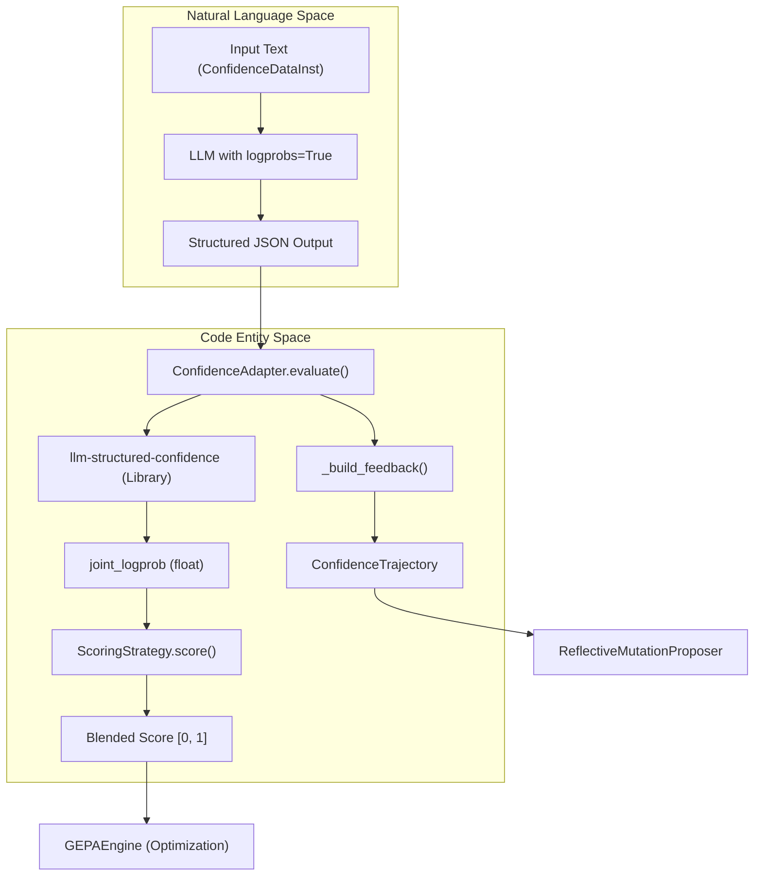
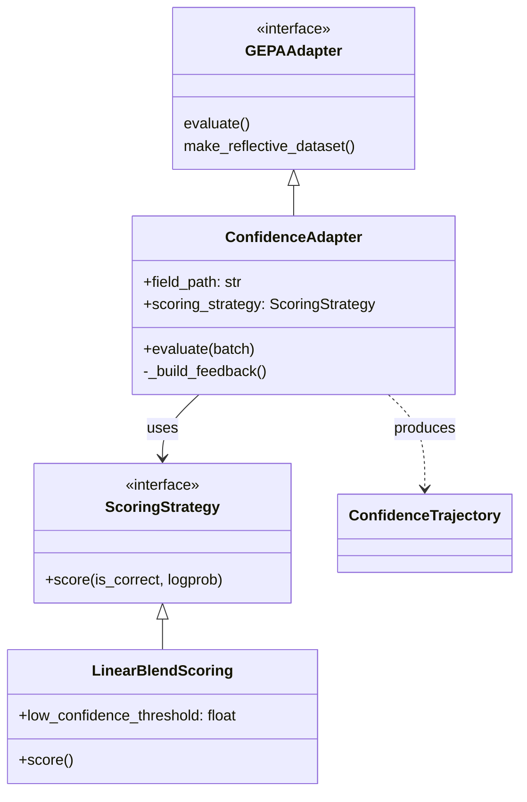
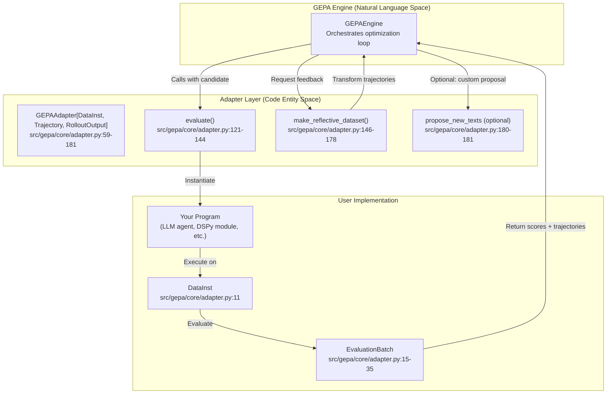
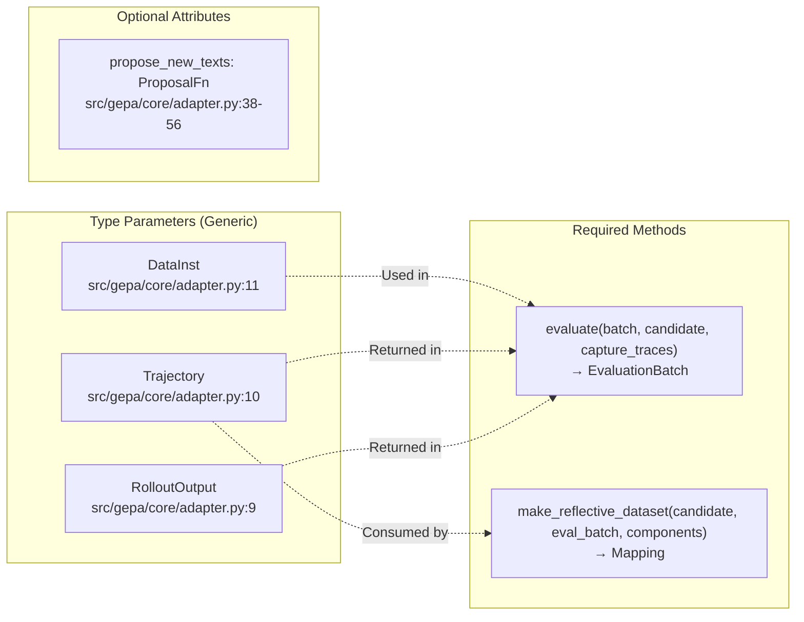

The `ConfidenceAdapter` is a specialized adapter for **classification tasks** that leverages token-level log-probabilities (logprobs) to provide a continuous scoring signal and rich diagnostic feedback. Unlike standard adapters that use binary (correct/incorrect) metrics, the `ConfidenceAdapter` detects "lucky guesses" and penalizes low-confidence correct answers, while providing the reflection LLM with specific details about model uncertainty and competing alternatives [src/gepa/adapters/confidence_adapter/confidence_adapter.py:4-12]().

## Overview and Purpose

In classification, binary scoring (1.0 for correct, 0.0 for wrong) creates several optimization bottlenecks:
1. **Lucky Guesses**: A model that is 51% sure of the correct answer receives the same reward as one that is 99% sure, even though the former is unstable [docs/docs/blog/posts/2026-03-17-confidence-adapter-benchmark/index.md:24-25]().
2. **Generic Feedback**: High-conviction errors (99% sure of the wrong answer) require different prompt interventions than uncertain errors (near 50/50 split) [docs/docs/blog/posts/2026-03-17-confidence-adapter-benchmark/index.md:26-28]().
3. **Vanishing Gradient**: The optimizer cannot distinguish between "almost right" and "completely wrong" without a continuous signal [docs/docs/blog/posts/2026-03-17-confidence-adapter-benchmark/index.md:28-29]().

The `ConfidenceAdapter` addresses these by extracting the **joint logprob** (sum of per-token logprobs) for the classification field, mapping it to a `[0, 1]` score via a `ScoringStrategy`, and generating tiered feedback for the reflection loop [src/gepa/adapters/confidence_adapter/scoring.py:14-29]().

### Data Flow and System Architecture

The following diagram illustrates how the `ConfidenceAdapter` interacts with the LLM and the GEPA engine.

**ConfidenceAdapter Logic Flow**

Sources: [src/gepa/adapters/confidence_adapter/confidence_adapter.py:22-24](), [src/gepa/adapters/confidence_adapter/confidence_adapter.py:35-51](), [src/gepa/adapters/confidence_adapter/scoring.py:52-62]()

## Implementation Details

### Data Structures

The adapter uses specific TypedDicts to manage the classification data and the resulting execution traces.

*   **`ConfidenceDataInst`**: Defines the input format, requiring an `input` string and an `answer` that must match one of the `enum` values in the JSON schema [src/gepa/adapters/confidence_adapter/confidence_adapter.py:35-51]().
*   **`ConfidenceTrajectory`**: Captures the full state of an evaluation, including the `parsed_value`, the `logprob_score`, and the generated `feedback` string [src/gepa/adapters/confidence_adapter/confidence_adapter.py:53-87]().

### Scoring Strategies

Scoring strategies implement the `ScoringStrategy` protocol, which maps `(is_correct, logprob_score)` to a float [src/gepa/adapters/confidence_adapter/scoring.py:52-75]().

| Strategy | Logic | Use Case |
| :--- | :--- | :--- |
| `LinearBlendScoring` | Penalizes correct answers below a `low_confidence_threshold` linearly [src/gepa/adapters/confidence_adapter/scoring.py:86-109](). | **Default**. Best for most classification tasks. |
| `ThresholdScoring` | Binary gate: 1.0 only if correct AND probability > threshold [src/gepa/adapters/confidence_adapter/scoring.py:138-150](). | Strict requirements where uncertainty is unacceptable. |
| `SigmoidScoring` | Smooth S-curve mapping probability to `[0, 1]` [src/gepa/adapters/confidence_adapter/scoring.py:169-187](). | Tasks requiring a differentiable-like signal for small changes. |

### Reflective Feedback Generation

The `_build_feedback` function generates human-readable instructions for the reflection LLM based on thresholds [src/gepa/adapters/confidence_adapter/confidence_adapter.py:151-178]():

*   **Correct + Confident**: Returns `"Correct."` to avoid distracting the optimizer [src/gepa/adapters/confidence_adapter/confidence_adapter.py:183-184]().
*   **Correct but Uncertain**: Flags the prediction as a "lucky guess" and lists top alternatives [src/gepa/adapters/confidence_adapter/confidence_adapter.py:185-194]().
*   **Incorrect (High Conviction)**: Uses strong language (e.g., "The model has no doubt about its wrong answer") to prompt major prompt revisions [src/gepa/adapters/confidence_adapter/confidence_adapter.py:203-209]().

## Component Interaction

The following diagram maps the internal functions and classes involved in the evaluation process.

**ConfidenceAdapter Class Relationships**

Sources: [src/gepa/adapters/confidence_adapter/confidence_adapter.py:23-24](), [src/gepa/adapters/confidence_adapter/confidence_adapter.py:63-120](), [src/gepa/adapters/confidence_adapter/scoring.py:52-62]()

## Usage Example

To use the `ConfidenceAdapter`, the target model must support `logprobs=True` and the `response_format` should be a JSON schema with `enum` constraints [docs/docs/guides/confidence-adapter.md:52-56]().

```python
from gepa.adapters.confidence_adapter import ConfidenceAdapter
from gepa.adapters.confidence_adapter.scoring import LinearBlendScoring

adapter = ConfidenceAdapter(
    model="openai/gpt-4o-mini",
    field_path="label",
    response_format={
        "type": "json_schema",
        "json_schema": {
            "name": "cls",
            "schema": {
                "type": "object",
                "properties": {"label": {"type": "string", "enum": ["A", "B"]}},
                "required": ["label"]
            }
        }
    },
    scoring_strategy=LinearBlendScoring(low_confidence_threshold=0.90)
)
```
Sources: [docs/docs/guides/confidence-adapter.md:63-90](), [src/gepa/adapters/confidence_adapter/confidence_adapter.py:107-121]()

## Benchmark Results

In comparative benchmarks, the `ConfidenceAdapter` consistently outperformed the `DefaultAdapter` (binary scoring) on multiclass tasks [examples/confidence_adapter/README.md:38-44]().

| Dataset | DefaultAdapter Accuracy | ConfidenceAdapter Accuracy | Improvement |
| :--- | :--- | :--- | :--- |
| **AG News** | 85.80% | **87.90%** | **+2.10pp** |
| **Emotion** | 58.42% | **60.22%** | **+1.80pp** |
| **Rotten Tomatoes**| 93.15% | 93.15% | 0.00pp |

The gains are most pronounced in multiclass scenarios where subtle differences between categories (e.g., "Business" vs "Sci/Tech") benefit from the granular logprob signal [docs/docs/blog/posts/2026-03-17-confidence-adapter-benchmark/index.md:14-15]().

Sources: [examples/confidence_adapter/README.md:38-44](), [docs/docs/blog/posts/2026-03-17-confidence-adapter-benchmark/index.md:14-15]()

# Creating Custom Adapters


This page provides a practical guide for implementing custom adapters to integrate GEPA with your own systems. An adapter translates between your domain-specific data structures and GEPA's optimization engine, enabling GEPA to optimize arbitrary text-based systems—from LLM agents to code generators to configuration files.

For the adapter protocol specification, see [GEPAAdapter Interface](#5.1). For examples of concrete implementations, see [DefaultAdapter](#5.2), [DSPy Full Program Evolution](#5.5), and [OptimizeAnythingAdapter](#5.3).

**Sources:** [src/gepa/core/adapter.py:1-181]()

---

## Adapter Architecture Overview

The adapter layer sits between the GEPA optimization engine and your system under optimization. It provides three responsibilities: program construction and evaluation, reflective dataset creation, and optionally custom proposal logic.

### System-to-Code Mapping

The following diagram bridges the conceptual optimization flow with the specific classes and methods defined in the codebase.

Title: Adapter Integration Architecture


**Sources:** [src/gepa/core/adapter.py:58-104](), [src/gepa/core/adapter.py:121-181]()

---

## The GEPAAdapter Protocol

The `GEPAAdapter` protocol defines the contract your adapter must implement. It uses three generic type parameters to maintain type safety while remaining domain-agnostic.

Title: GEPAAdapter Protocol Components


| Component | Type | Purpose |
|-----------|------|---------|
| `DataInst` | Type parameter | Your domain's input data structure (e.g., question, task, test case) [src/gepa/core/adapter.py:11-11]() |
| `Trajectory` | Type parameter | Execution trace capturing intermediate states for reflection [src/gepa/core/adapter.py:10-10]() |
| `RolloutOutput` | Type parameter | Program output (opaque to GEPA, forwarded to your logging) [src/gepa/core/adapter.py:9-9]() |
| `evaluate()` | Required method | Execute candidate on batch, return scores and optionally traces [src/gepa/core/adapter.py:121-144]() |
| `make_reflective_dataset()` | Required method | Transform traces into LLM-readable feedback examples [src/gepa/core/adapter.py:146-178]() |
| `propose_new_texts` | Optional attribute | Override default LLM-based proposal with custom logic [src/gepa/core/adapter.py:180-181]() |

**Sources:** [src/gepa/core/adapter.py:8-181]()

---

## Implementing evaluate()

The `evaluate()` method is the core of your adapter. It receives a candidate (text components) and a batch of data, executes your program, and returns scores.

### Method Signature [src/gepa/core/adapter.py:121-126]()

```python
def evaluate(
    self,
    batch: list[DataInst],
    candidate: dict[str, str],
    capture_traces: bool = False,
) -> EvaluationBatch[Trajectory, RolloutOutput]:
    ...
```

### Parameters [src/gepa/core/adapter.py:130-138]()

| Parameter | Type | Description |
|-----------|------|-------------|
| `batch` | `list[DataInst]` | Input data to evaluate on (size determined by minibatch config) |
| `candidate` | `dict[str, str]` | Mapping from component name → component text (e.g., `{"system_prompt": "You are..."}`) |
| `capture_traces` | `bool` | If `True`, populate trajectories in return value; if `False`, return `None` for trajectories |

### Return Value: EvaluationBatch [src/gepa/core/adapter.py:15-36]()

```python
@dataclass
class EvaluationBatch(Generic[Trajectory, RolloutOutput]):
    outputs: list[RolloutOutput]          # Per-example outputs (opaque to GEPA)
    scores: list[float]                   # Per-example scores (higher = better)
    trajectories: list[Trajectory] | None # Per-example traces (only if capture_traces=True)
    objective_scores: list[dict[str, float]] | None  # Optional multi-objective metrics
```

**Constraints:**
- `len(outputs) == len(scores) == len(batch)` [src/gepa/core/adapter.py:31-33]()
- If `capture_traces=True`: `trajectories` must be provided and align one-to-one [src/gepa/core/adapter.py:24-26]()
- Scores: higher is better, sum over minibatch for acceptance, average over valset for tracking [src/gepa/core/adapter.py:103-107]()
- Never raise for individual example failures—return failure scores (e.g., 0.0) instead [src/gepa/core/adapter.py:112-117]()

**Sources:** [src/gepa/core/adapter.py:15-36](), [src/gepa/core/adapter.py:103-144]()

---

## Implementing make_reflective_dataset()

The `make_reflective_dataset()` method transforms execution traces into a structured dataset that the reflection LLM uses to propose improvements.

### Method Signature [src/gepa/core/adapter.py:146-151]()

```python
def make_reflective_dataset(
    self,
    candidate: dict[str, str],
    eval_batch: EvaluationBatch[Trajectory, RolloutOutput],
    components_to_update: list[str],
) -> Mapping[str, Sequence[Mapping[str, Any]]]:
    ...
```

### Parameters [src/gepa/core/adapter.py:153-158]()

| Parameter | Type | Description |
|-----------|------|-------------|
| `candidate` | `dict[str, str]` | The candidate that was evaluated |
| `eval_batch` | `EvaluationBatch` | Result from `evaluate(..., capture_traces=True)` with trajectories populated |
| `components_to_update` | `list[str]` | Subset of component names to generate feedback for |

### Return Value [src/gepa/core/adapter.py:161-163]()

A dictionary mapping each component name to a list of feedback examples. Each example is a JSON-serializable dict.

**Recommended schema:**
```python
ReflectiveExample = {
    "Inputs": dict[str, Any] | str,      # Clean view of inputs to the component
    "Generated Outputs": dict[str, Any] | str,  # Component's outputs
    "Feedback": str,                     # Diagnostic feedback (errors, corrections, etc.)
}
```

**Sources:** [src/gepa/core/adapter.py:146-178]()

---

## Optional: Custom Proposal Logic

By default, GEPA uses internal signatures to propose new component texts. You can override this by setting the `propose_new_texts` attribute or implementing the method in your class.

### ProposalFn Protocol [src/gepa/core/adapter.py:38-56]()

```python
class ProposalFn(Protocol):
    def __call__(
        self,
        candidate: dict[str, str],
        reflective_dataset: Mapping[str, Sequence[Mapping[str, Any]]],
        components_to_update: list[str],
    ) -> dict[str, str]:
        """Return mapping from component name → new component text."""
        ...
```

**Sources:** [src/gepa/core/adapter.py:38-56]()

---

## State Persistence

Adapters that need to persist state (e.g., dynamic validation sets or frequency counters) across checkpoint boundaries can implement optional methods [src/gepa/core/adapter.py:88-101]().

| Method | Purpose |
|--------|---------|
| `get_adapter_state() -> dict[str, Any]` | Return a fresh dict of state to be snapshotted [src/gepa/core/adapter.py:92-95]() |
| `set_adapter_state(state: dict[str, Any]) -> None` | Restore state from a checkpoint [src/gepa/core/adapter.py:96-97]() |

**Sources:** [src/gepa/core/adapter.py:88-101]()

---

## Best Practices and Pitfalls

### Rich Feedback
The more informative your feedback, the better GEPA can optimize. Include the score, expected versus actual output, and specific error analysis (e.g., "Issue: Response too verbose") [docs/docs/guides/adapters.md:173-191]().

### Error Handling
Never raise for individual example failures—return failure scores (e.g., 0.0) and populate trajectories with error info [src/gepa/core/adapter.py:112-117]().

### Multi-Objective Optimization
Support multiple objectives by returning `objective_scores` in the `EvaluationBatch`. This allows GEPA to track and optimize for competing metrics like accuracy, latency, and cost [docs/docs/guides/adapters.md:221-236]().

### Trajectory Memory
Keep `Trajectory` objects minimal. Large traces can bloat the system state and slow down serialization [docs/docs/guides/adapters.md:7-8]().

**Sources:** [src/gepa/core/adapter.py:112-117](), [docs/docs/guides/adapters.md:173-236]()