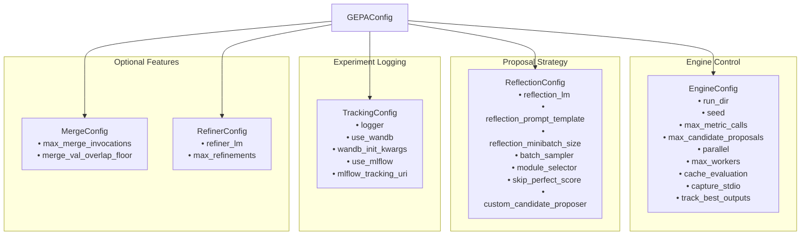
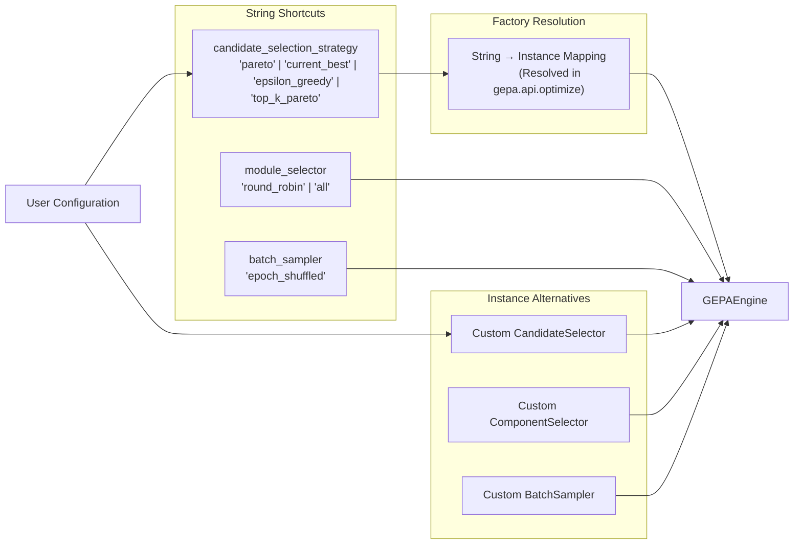
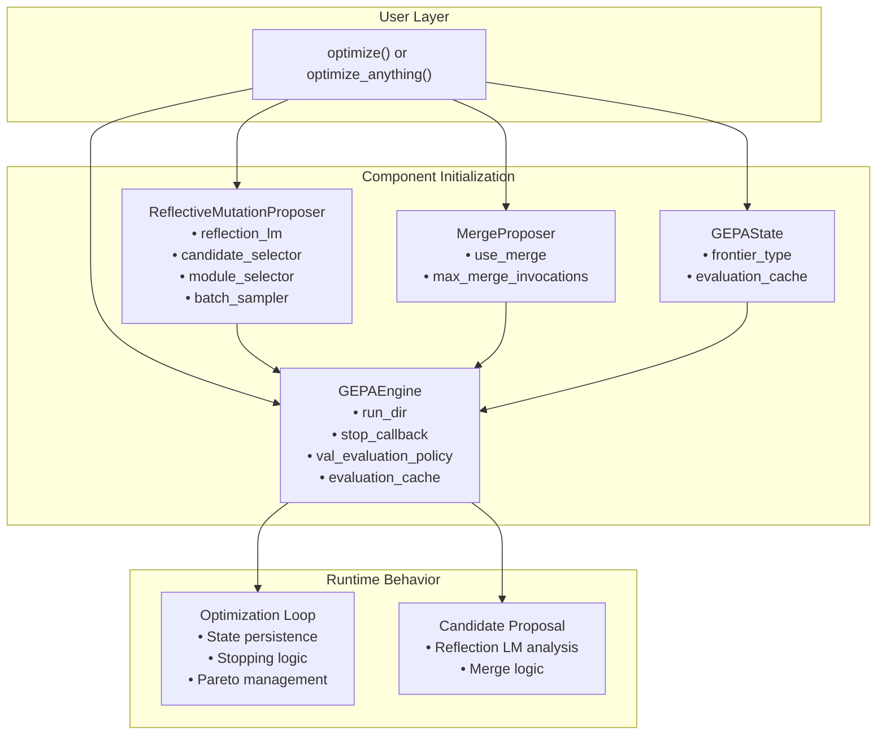
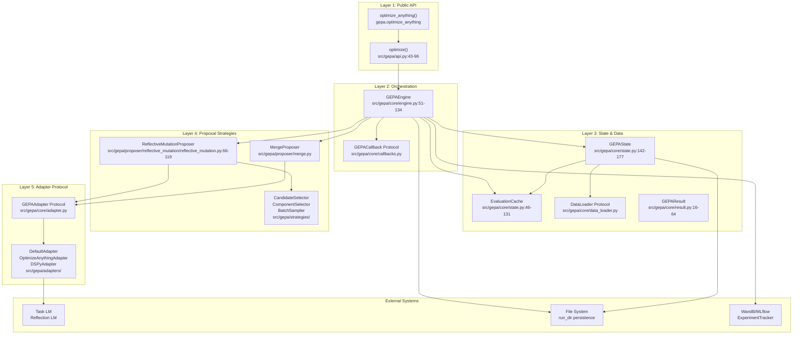
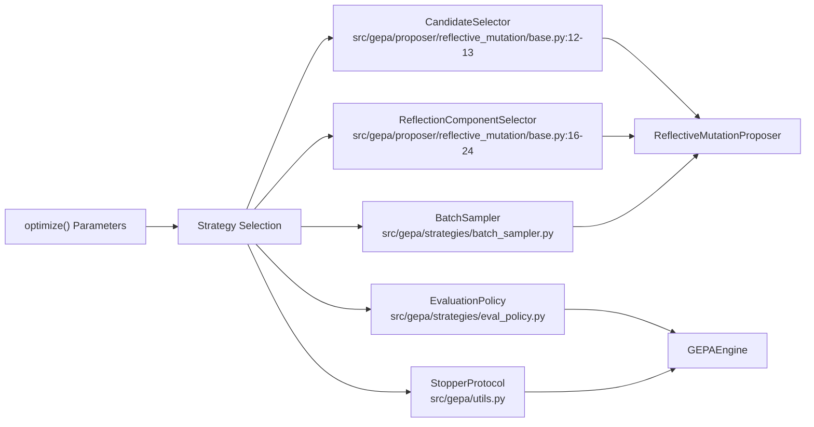
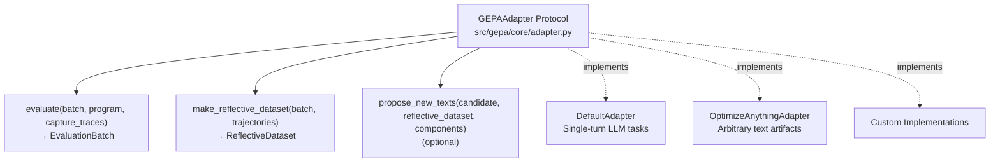
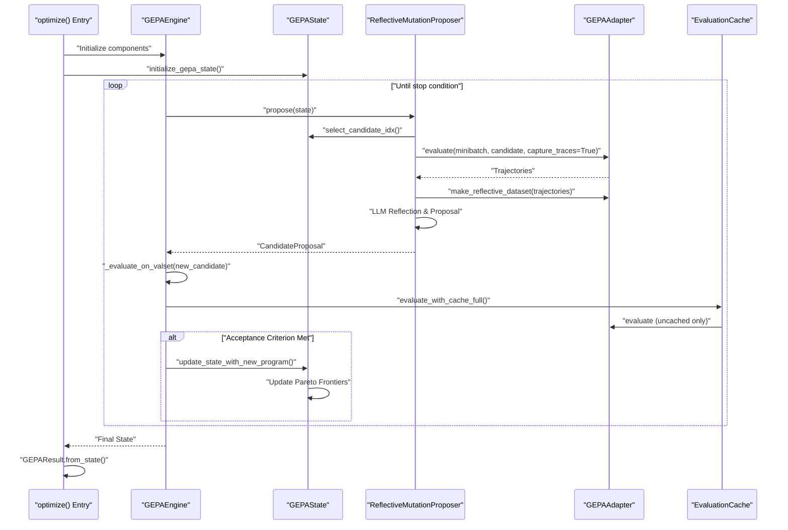
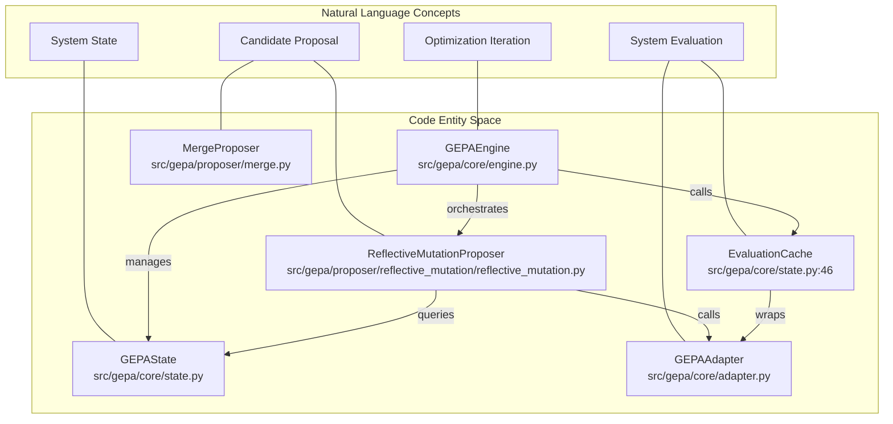
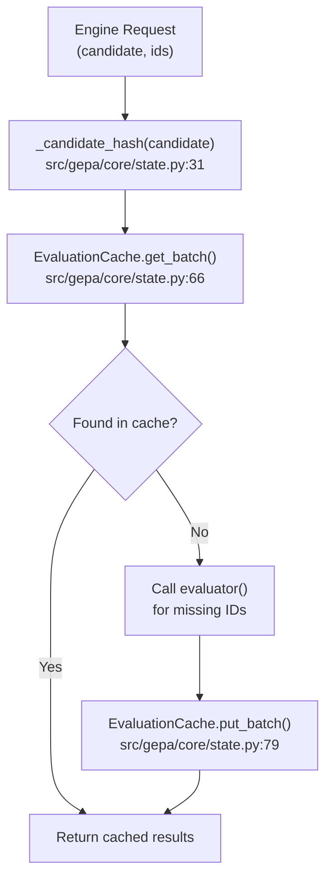

This document describes GEPA's hierarchical configuration system, which controls optimization behavior, proposal strategies, tracking, and stopping conditions. GEPA offers two configuration approaches: **flat parameters** for the `gepa.optimize()` API and **hierarchical configs** for the `optimize_anything()` API.

For information about:
- Stop conditions specifically, see [Stopping Conditions](3.5)
- Data loading and evaluation policies, see [Data Loading and Evaluation Policies](3.6)
- Callback configuration, see [Callback System](4.4.3)

## Two Configuration Approaches

GEPA provides two APIs with different configuration styles:

| API | Configuration Style | Use Case |
|-----|---------------------|----------|
| `gepa.optimize()` | Flat parameters (80+ keyword arguments) | Simple DSPy/prompt optimization tasks |
| `optimize_anything()` | Hierarchical `GEPAConfig` object | Complex systems, code optimization, better IDE autocomplete |

Both APIs provide identical capabilities — the hierarchical approach simply groups related parameters into typed dataclasses for clarity in complex scenarios.

**Sources:** [src/gepa/api.py:43-96](), [src/gepa/optimize_anything.py:124-159]()

---

## Configuration Hierarchy

The `GEPAConfig` object used by `optimize_anything` is composed of several specialized configuration blocks.

**Title:** GEPAConfig Composition Hierarchy

**Sources:** [src/gepa/optimize_anything.py:208-320]()

---

## EngineConfig — Optimization Loop Control

`EngineConfig` controls the core optimization loop behavior, state persistence, and computational resources.

### Parameters

| Parameter | Type | Default | Description |
|-----------|------|---------|-------------|
| `run_dir` | `str \| None` | `None` | Directory for state persistence. If exists, resumes from saved state [src/gepa/core/engine.py:88-89](). |
| `seed` | `int` | `0` | Random seed for reproducibility [src/gepa/api.py:91](). |
| `max_metric_calls` | `int \| None` | `None` | Budget limit (number of evaluator calls). Creates `MaxMetricCallsStopper` [src/gepa/utils/stop_condition.py:168-173](). |
| `max_candidate_proposals` | `int \| None` | `None` | Maximum number of candidates to propose [src/gepa/utils/stop_condition.py:202-207](). |
| `stop_callbacks` | `StopperProtocol \| list` | `None` | Custom stopping conditions [src/gepa/api.py:71](). |
| `parallel` | `bool` | `False` | Enable parallel evaluation [src/gepa/core/engine.py:129](). |
| `cache_evaluation` | `bool` | `False` | Enable `EvaluationCache` to memoize (candidate, example) pairs [src/gepa/core/state.py:46-49](). |
| `capture_stdio` | `bool` | `False` | Redirect stdout/stderr during evaluation [src/gepa/optimize_anything.py:228](). |
| `track_best_outputs` | `bool` | `True` | Store best outputs per validation example [src/gepa/api.py:85](). |
| `use_cloudpickle` | `bool` | `False` | Use `cloudpickle` for state serialization [src/gepa/api.py:87](). |

### State Persistence

When `run_dir` is set:
- **State saved**: `GEPAState` tracks all explored candidates, scores, and Pareto frontiers [src/gepa/core/state.py:142-151]().
- **Resume logic**: The engine snapshots adapter state into `GEPAState` before saving [src/gepa/core/engine.py:135-144]().
- **Evaluation Cache**: Stored in state and used to avoid redundant calls to the metric [src/gepa/core/state.py:94-130]().

**Sources:** [src/gepa/core/engine.py:54-134](), [src/gepa/core/state.py:142-180](), [src/gepa/optimize_anything.py:208-239]()

---

## ReflectionConfig — Proposal Strategy

`ReflectionConfig` controls the `ReflectiveMutationProposer`, which uses an LLM to analyze execution traces and propose improved candidates.

### Parameters

| Parameter | Type | Default | Description |
|-----------|------|---------|-------------|
| `reflection_lm` | `LanguageModel \| str \| None` | **Required** | LLM for reflection. String model ID or `LM` instance [src/gepa/lm.py:30-50](). |
| `reflection_prompt_template` | `str \| dict[str, str] \| None` | Default | Custom prompt for reflection. Can be per-component [src/gepa/proposer/reflective_mutation/reflective_mutation.py:104-112](). |
| `reflection_minibatch_size` | `int \| None` | `3` | Number of examples per reflection step [src/gepa/api.py:58](). |
| `batch_sampler` | `BatchSampler \| "epoch_shuffled"` | `"epoch_shuffled"` | Training batch sampling strategy [src/gepa/strategies/batch_sampler.py:28-29](). |
| `module_selector` | `ReflectionComponentSelector \| str` | `"round_robin"` | Component selection strategy [src/gepa/strategies/component_selector.py:35-38](). |
| `skip_perfect_score` | `bool` | `True` | Skip proposal if current candidate achieves `perfect_score` [src/gepa/proposer/reflective_mutation/reflective_mutation.py:114-118](). |

### Reflection Prompt Template

The reflection process uses `InstructionProposalSignature` to render prompts. Custom templates must include `<curr_param>` and `<side_info>` placeholders, which are validated at initialization [src/gepa/proposer/reflective_mutation/reflective_mutation.py:110-112]().

**Sources:** [src/gepa/proposer/reflective_mutation/reflective_mutation.py:74-118](), [src/gepa/optimize_anything.py:241-283](), [src/gepa/lm.py:30-131]()

---

## TrackingConfig — Experiment Logging

`TrackingConfig` controls integration with experiment tracking platforms like Weights & Biases or MLflow.

### Parameters

| Parameter | Type | Default | Description |
|-----------|------|---------|-------------|
| `logger` | `LoggerProtocol \| None` | `StdOutLogger` | Logger instance for console/file output [src/gepa/logging/logger.py:23-25](). |
| `use_wandb` | `bool` | `False` | Enable Weights & Biases integration [src/gepa/api.py:76](). |
| `wandb_init_kwargs` | `dict \| None` | `None` | Kwargs for `wandb.init()` [src/gepa/api.py:78](). |
| `use_mlflow` | `bool` | `False` | Enable MLflow integration [src/gepa/api.py:80](). |

### LM Cost Tracking

GEPA tracks the cumulative cost and token usage of the reflection LLM.
- **LM Class**: Automatically tracks USD cost via LiteLLM [src/gepa/lm.py:73-86](). It uses `litellm.completion_cost` to calculate expenses for both single and batch completions [src/gepa/lm.py:115-120](), [src/gepa/lm.py:167-170]().
- **TrackingLM**: Estimates tokens for plain callables by assuming ~4 characters per token (reports $0 cost) [src/gepa/lm.py:190-200]().
- **MaxReflectionCostStopper**: A `StopperProtocol` implementation that monitors the `total_cost` attribute of the reflection LM and stops optimization once a USD budget is reached [src/gepa/utils/stop_condition.py:176-191]().

**Sources:** [src/gepa/lm.py:73-131](), [src/gepa/lm.py:190-200](), [src/gepa/logging/experiment_tracker.py:22-35](), [src/gepa/utils/stop_condition.py:176-191]()

---

## MergeConfig — Cross-Pollination Strategy

`MergeConfig` controls the `MergeProposer`, which combines two Pareto-optimal candidates that share a common ancestor.

### Parameters

| Parameter | Type | Default | Description |
|-----------|------|---------|-------------|
| `use_merge` | `bool` | `False` | Enable merge proposer [src/gepa/api.py:65](). |
| `max_merge_invocations` | `int` | `5` | Maximum number of merge attempts [src/gepa/api.py:66](). |
| `merge_val_overlap_floor` | `int` | `5` | Minimum overlapping validation IDs for merge subsampling [src/gepa/api.py:67](). |

### Merge Logic

The `MergeProposer` identifies candidates on the Pareto frontier and attempts to find a common ancestor. It then creates a new candidate by selectively taking components from the descendants that differ from the ancestor.

**Sources:** [src/gepa/core/engine.py:117-123](), [src/gepa/optimize_anything.py:304-320]()

---

## String-Based Configuration Shortcuts

GEPA supports string identifiers for built-in strategies, which are resolved to concrete class instances during initialization.

**Title:** String-Based Configuration Resolution Flow

### Supported String Shortcuts

| Parameter | String Options | Resolved Type |
|-----------|----------------|---------------|
| `candidate_selection_strategy` | `"pareto"`, `"current_best"`, `"epsilon_greedy"`, `"top_k_pareto"` | `CandidateSelector` [src/gepa/api.py:29-34]() |
| `module_selector` | `"round_robin"`, `"all"` | `ReflectionComponentSelector` [src/gepa/api.py:35-38]() |
| `batch_sampler` | `"epoch_shuffled"` | `BatchSampler` [src/gepa/api.py:28]() |

**Sources:** [src/gepa/api.py:53-63](), [src/gepa/strategies/candidate_selector.py:1-83](), [src/gepa/strategies/component_selector.py:1-80]()

---

## Configuration Flow to Components

The configuration parameters provided to the high-level APIs are distributed to the internal engine components during initialization.

**Title:** Configuration Parameter Flow from User Code to Runtime Components

**Sources:** [src/gepa/core/engine.py:54-134](), [src/gepa/proposer/reflective_mutation/reflective_mutation.py:74-102](), [src/gepa/api.py:43-96]()

# Architecture Deep Dive

This section provides detailed architectural documentation of GEPA's internal systems, design patterns, and component interactions. It covers the core orchestration engine, state management, proposal strategies, caching mechanisms, and extensibility patterns.

For usage instructions and integration guides, see [Core Concepts](#3). For specific adapter implementations, see [Adapter System](#5). For implementation details of individual subsystems, see the dedicated sub-sections below.

## Purpose and Scope

This document explains GEPA's internal architecture from a systems perspective: how components are organized, how they communicate, and how data flows through the optimization process. It is intended for developers who need to understand GEPA's implementation, extend the framework, or debug complex behaviors.

Key topics covered:
- **System Layers**: API, orchestration, strategies, adapters, and infrastructure
- **Core Design Patterns**: Strategy pattern, adapter pattern, protocol-based abstraction
- **State Management**: Persistence, caching, Pareto frontier tracking
- **Execution Flow**: Iteration lifecycle, proposal mechanisms, evaluation pipelines
- **Extension Points**: Where and how to customize GEPA's behavior

For specific subsystems, see:
- [GEPAEngine and Optimization Loop](#4.1) for iteration orchestration
- [State Management and Persistence](#4.2) for `GEPAState` internals
- [Proposer System](#4.4) for mutation and merge strategies
- [Evaluation Caching](#4.7) for cost optimization mechanisms
- [Pareto Frontier Management](#4.8) for multi-objective tracking

---

## Architectural Overview

GEPA follows a **layered architecture** with clear separation of concerns. The system is organized into five primary layers:

### System Layer Diagram

**Sources**: [src/gepa/api.py:43-96](), [src/gepa/core/engine.py:51-134](), [src/gepa/core/state.py:142-177](), [src/gepa/core/adapter.py:17-17]()

### Layer Responsibilities

| Layer | Components | Responsibilities |
|-------|-----------|------------------|
| **Public API** | `optimize()`, `optimize_anything()` | Parameter normalization, strategy selection, high-level interface |
| **Orchestration** | `GEPAEngine`, callbacks | Iteration loop, stop condition checks, parallel proposal coordination |
| **State & Data** | `GEPAState`, `EvaluationCache`, `DataLoader` | Persistent state, Pareto frontiers, cached evaluations, data loading |
| **Proposal Strategies** | `ReflectiveMutationProposer`, `MergeProposer` | Candidate generation via reflection or merging |
| **Adapter Protocol** | `GEPAAdapter`, concrete adapters | System integration, evaluation, trajectory capture, reflection feedback |

**Sources**: [src/gepa/api.py:43-96](), [src/gepa/core/engine.py:51-134](), [src/gepa/core/state.py:142-177]()

---

## Core Design Patterns

GEPA's architecture relies on several key design patterns that enable extensibility and maintainability:

### 1. Strategy Pattern

The **Strategy Pattern** is used extensively to make optimization behavior configurable. Multiple strategies are injected into the `GEPAEngine` at initialization:

**Key Strategy Interfaces**:
- `CandidateSelector.select_candidate_idx(state)` - Selects which candidate to mutate [src/gepa/proposer/reflective_mutation/base.py:13-13]()
- `ReflectionComponentSelector` - Selects which components within a candidate to update [src/gepa/proposer/reflective_mutation/base.py:16-24]()
- `BatchSampler` - Samples training examples for reflection [src/gepa/strategies/batch_sampler.py]()
- `EvaluationPolicy` - Determines which validation instances to evaluate [src/gepa/strategies/eval_policy.py]()
- `StopperProtocol` - Defines termination conditions [src/gepa/utils.py]()

**Sources**: [src/gepa/api.py:53-71](), [src/gepa/proposer/reflective_mutation/base.py:11-24]()

### 2. Adapter Pattern

The **Adapter Pattern** enables GEPA to integrate with arbitrary external systems through the `GEPAAdapter` protocol:

**Adapter Contract** ([src/gepa/core/adapter.py]()):
1. **evaluate**: Execute the system with a candidate, return outputs, scores, and trajectories.
2. **make_reflective_dataset**: Transform execution traces into structured feedback for the reflection LM.
3. **propose_new_texts** (optional): Allow the adapter to override the LLM-based proposal logic.

**Sources**: [src/gepa/core/adapter.py:17-17](), [src/gepa/api.py:113-124]()

### 3. Protocol-Based Abstraction

GEPA uses Python protocols (structural subtyping) for loose coupling between the engine and its components:

| Protocol | Purpose | Key Methods |
|----------|---------|-------------|
| `GEPAAdapter` | System integration | `evaluate`, `make_reflective_dataset` |
| `CandidateSelector` | Candidate selection | `select_candidate_idx` |
| `ProposeNewCandidate` | Proposal logic | `propose(state)` |
| `StopperProtocol` | Termination conditions | `__call__(state) -> bool` |
| `GEPACallback` | Observability hooks | `on_iteration_start`, `on_candidate_accepted`, etc. |
| `LanguageModel` | LM abstraction | `__call__(prompt) -> str` |

**Sources**: [src/gepa/core/adapter.py:17-17](), [src/gepa/proposer/reflective_mutation/base.py:12-28](), [src/gepa/proposer/base.py:46-54](), [src/gepa/core/callbacks.py]()

---

## Main Execution Flow

The optimization process follows a deterministic iteration loop orchestrated by `GEPAEngine`:

### Iteration Lifecycle Sequence

**Sources**: [src/gepa/core/engine.py:154-200](), [src/gepa/proposer/reflective_mutation/reflective_mutation.py:66-119]()

---

## Component Interaction Map

This diagram bridges the Natural Language space (concepts) with Code Entity space (classes/files):

**Sources**: [src/gepa/core/engine.py](), [src/gepa/core/state.py](), [src/gepa/proposer/reflective_mutation/reflective_mutation.py](), [src/gepa/proposer/merge.py]()

---

## Data Flow and State Transitions

### State Lifecycle

`GEPAState` is the central data structure that tracks the entire optimization history and Pareto frontiers:

```mermaid
graph LR
    subgraph "State Tracking"
        Candidates["program_candidates<br/>src/gepa/core/state.py:157"]
        Scores["prog_candidate_val_subscores<br/>src/gepa/core/state.py:159"]
        Frontiers["pareto_front_valset<br/>src/gepa/core/state.py:162"]
        Lineage["parent_program_for_candidate<br/>src/gepa/core/state.py:158"]
    end
    
    subgraph "Persistence"
        Save["GEPAState.save()"]
        Load["initialize_gepa_state()<br/>src/gepa/core/state.py:30"]
    end

    Candidates --> Save
    Scores --> Save
    Frontiers --> Save
    Load --> Candidates
```

**State Contents** ([src/gepa/core/state.py:157-177]()):
- `program_candidates`: List of all explored parameter mappings.
- `prog_candidate_val_subscores`: Map of scores per validation instance for each candidate.
- `pareto_front_valset`: The current best score achieved for each validation instance.
- `program_at_pareto_front_valset`: The set of candidate indices that achieve the Pareto-optimal score for each instance.

**Sources**: [src/gepa/core/state.py:142-177]()

### Evaluation Cache Mechanism

The `EvaluationCache` provides memoization for `(candidate, example)` pairs to minimize redundant LLM calls:

**Sources**: [src/gepa/core/state.py:31-131]()

---

## Summary

GEPA's architecture is designed for **modularity** and **persistence**. The separation of the optimization loop (`GEPAEngine`), the system integration (`GEPAAdapter`), and the persistent history (`GEPAState`) allows for robust optimization of complex text-based systems with built-in resume capabilities and efficient evaluation.

For deeper dives into specific subsystems:
- **Engine internals and loop flow**: [GEPAEngine and Optimization Loop](#4.1)
- **State structure and serialization**: [State Management and Persistence](#4.2)
- **Result analysis and lineage**: [Results and Lineage Tracking](#4.3)
- **Candidate generation strategies**: [Proposer System](#4.4)
- **Caching and efficiency**: [Evaluation Caching](#4.7)
- **Multi-objective optimization**: [Pareto Frontier Management](#4.8)

**Sources**: [src/gepa/core/engine.py](), [src/gepa/core/state.py](), [src/gepa/api.py]()