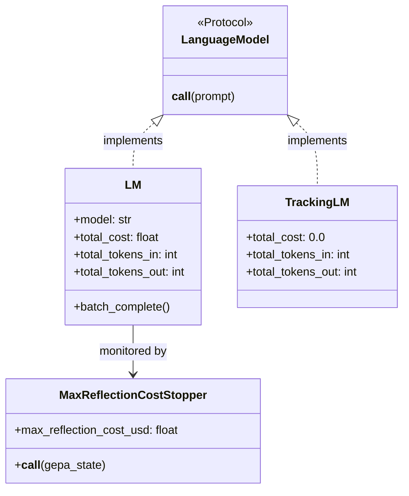
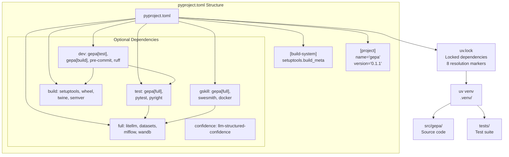
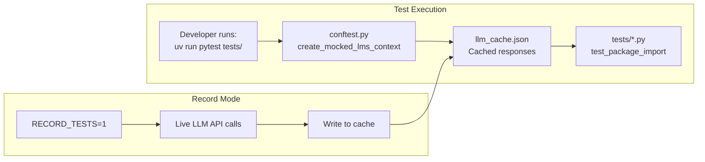

GEPA provides built-in mechanisms to monitor and limit the financial and computational resources consumed during optimization. This is primarily achieved through tracking the usage of the **Reflection LM**, which is typically the most expensive component of the optimization loop. GEPA tracks cumulative USD costs, input tokens, and output tokens, allowing for budget-aware optimization patterns.

## Overview of Cost Monitoring

Cost tracking is integrated directly into the language model abstraction layer. Whether using a standard LiteLLM-supported model or a custom callable, GEPA ensures that usage metrics are accumulated throughout the lifecycle of an optimization run [docs/docs/guides/cost-tracking.md:3-4]().

### Data Flow for Cost Tracking

The following diagram illustrates how cost data flows from the underlying LLM provider through the GEPA abstraction layers to the user.

**Cost Data Flow Architecture**
```mermaid
graph TD
    subgraph "LLM Provider Space"
        API["LLM API (OpenAI/Anthropic/etc)"]
    end

    subgraph "Code Entity Space: gepa.lm"
        LITELLM["litellm.completion()"]
        LM_CLASS["class LM"]
        TRACKING_LM["class TrackingLM"]
    end

    subgraph "Optimization Control"
        STOPPER["class MaxReflectionCostStopper"]
        ENGINE["class GEPAEngine"]
    end

    API -->| "Usage & Cost Metadata" | LITELLM
    LITELLM -->| "completion_cost()" | LM_CLASS
    LM_CLASS -->| "total_cost" | STOPPER
    TRACKING_LM -->| "total_tokens_in/out" | ENGINE
    STOPPER -->| "stop_requested" | ENGINE
```
Sources: [src/gepa/lm.py:30-131](), [src/gepa/utils/stop_condition.py:176-191](), [src/gepa/lm.py:190-205]()

## The LM Abstraction

The `LM` class is a thin wrapper around LiteLLM that provides thread-safe accumulation of costs and tokens [src/gepa/lm.py:30-65]().

### Key Metrics Tracked
| Metric | Code Entity | Description |
| :--- | :--- | :--- |
| **Total Cost** | `total_cost` | Cumulative USD cost calculated via `litellm.completion_cost` [src/gepa/lm.py:73-76](), [src/gepa/lm.py:117-127](). |
| **Input Tokens** | `total_tokens_in` | Total prompt tokens processed by the model [src/gepa/lm.py:78-81](), [src/gepa/lm.py:123-128](). |
| **Output Tokens** | `total_tokens_out` | Total completion tokens generated by the model [src/gepa/lm.py:83-86](), [src/gepa/lm.py:124-129](). |

### Handling Custom Callables: TrackingLM
When a user provides a plain Python callable (e.g., a local model or a custom API wrapper) instead of a LiteLLM model string, GEPA wraps it in `TrackingLM` [src/gepa/lm.py:190-192]().
* **Cost Estimation**: Since custom callables do not provide standardized cost metadata, `TrackingLM` always reports `total_cost = 0.0` [src/gepa/lm.py:195-196]().
* **Token Estimation**: It estimates token counts based on string length, assuming approximately 4 characters per token [src/gepa/lm.py:194-195]().

Sources: [src/gepa/lm.py:73-87](), [src/gepa/lm.py:115-130](), [src/gepa/lm.py:190-205]()

## Budget-Aware Stopping

GEPA allows users to define a hard financial ceiling for the reflection process using the `MaxReflectionCostStopper`.

### MaxReflectionCostStopper
This stopper monitors the `total_cost` attribute of the assigned reflection LM [src/gepa/utils/stop_condition.py:189-190](). If the cumulative cost exceeds the user-defined budget, the optimization loop terminates gracefully.

**Implementation Logic:**
1. The stopper is initialized with a `max_reflection_cost_usd` and a reference to the `reflection_lm` [src/gepa/utils/stop_condition.py:184-186]().
2. During each iteration of `GEPAEngine`, the stopper is called [src/gepa/utils/stop_condition.py:188]().
3. It uses `getattr(self._reflection_lm, "total_cost", 0.0)` to safely retrieve the current spend [src/gepa/utils/stop_condition.py:189]().
4. It returns `True` if the budget is reached, signaling the engine to stop [src/gepa/utils/stop_condition.py:190]().

### Usage in Configuration
Users can set this limit via `GEPAConfig` or directly in `optimize_anything`:

```python
from gepa.optimize_anything import optimize_anything, GEPAConfig, EngineConfig

config = GEPAConfig(
    engine=EngineConfig(
        max_reflection_cost=5.0  # Stop after $5.00 USD
    )
)
```
Sources: [src/gepa/utils/stop_condition.py:176-191](), [docs/docs/guides/cost-tracking.md:65-85]()

## Implementation Details

### Thread Safety
Because GEPA may perform parallel batch completions (via `LM.batch_complete`), cost and token accumulation is protected by a threading lock (`self._cost_lock`) to ensure accuracy across concurrent requests [src/gepa/lm.py:65](), [src/gepa/lm.py:126-129](), [src/gepa/lm.py:176-179]().

### Truncation Detection
While not strictly a "cost," token limits often lead to truncated responses which waste budget. The `LM` class includes a `_check_truncation` method that monitors the `finish_reason` from the LLM provider and logs a warning if `max_tokens` is reached before the model finishes its thought [src/gepa/lm.py:88-94]().

**Natural Language to Code Mapping**

Sources: [src/gepa/lm.py:30-65](), [src/gepa/lm.py:190-205](), [src/gepa/utils/stop_condition.py:176-187]()

## Summary Table of Tracking Behavior

| Feature | `LM` (LiteLLM) | `TrackingLM` (Callable) |
| :--- | :--- | :--- |
| **Cost Source** | `litellm.completion_cost` | Hardcoded `0.0` |
| **Token Source** | Provider API usage data | Estimated (~4 chars/token) |
| **Parallelism** | Supported via `batch_complete` | Sequential `__call__` |
| **Budget Gating** | Triggered by `MaxReflectionCostStopper` | Never triggers (cost is 0) |

Sources: [src/gepa/lm.py:116-131](), [src/gepa/lm.py:190-205](), [src/gepa/utils/stop_condition.py:188-190]()

# Development Guide


This guide is for contributors and developers working on GEPA itself. It covers project setup, testing infrastructure, CI/CD pipelines, code quality standards, and the release process. For information about using GEPA to optimize your own systems, see the Quick Start (#2) and Core Concepts (#3) sections.

---

## Overview

GEPA's development infrastructure implements production-grade DevOps practices with automated testing, linting, type checking, and dual-deployment to TestPyPI and PyPI. The build system uses `uv` for fast, reproducible dependency management, while GitHub Actions workflows enforce code quality and automate releases.

**Key Components:**
- **Package Management**: `pyproject.toml` with optional dependency groups, `uv.lock` for reproducibility.
- **CI/CD**: Four parallel jobs (lint check, type check, tests, package build) plus automated release workflow.
- **Testing**: `pytest` with LLM mocking for deterministic tests.
- **Release Strategy**: TestPyPI for development iterations, PyPI for production releases.

Sources: [pyproject.toml:1-121](), [.github/workflows/run_tests.yml:1-183](), [.github/workflows/build_and_release.yml:1-186]()

---

## Project Setup and Dependencies

### Installation with uv

GEPA uses `uv` (Astral's fast Python package manager) for dependency management. For detailed installation steps, see [Project Setup and Dependencies](#9.1).

```bash
# Clone repository
git clone https://github.com/gepa-ai/gepa.git
cd gepa

# Set up environment using uv (Recommended)
uv sync --extra dev --python 3.11
```

Sources: [CONTRIBUTING.md:1-30](), [AGENTS.md:5-11]()

### Understanding pyproject.toml Dependency Groups

The [pyproject.toml:22-74]() defines several optional dependency groups:

| Group | Purpose | Key Dependencies |
|-------|---------|------------------|
| `full` | Runtime dependencies for all GEPA features | `litellm`, `datasets`, `mlflow`, `wandb`, `tqdm`, `cloudpickle` |
| `confidence` | Logic for confidence-based evaluation | `llm-structured-confidence` |
| `test` | Testing infrastructure | `gepa[full]`, `pytest`, `pyright` |
| `build` | Package building and publishing | `setuptools`, `wheel`, `build`, `twine`, `semver` |
| `dev` | Development tools (superset of test + build) | `pre-commit`, `ruff` |
| `gskill` | gskill pipeline dependencies | `swesmith`, `docker`, `python-dotenv`, `pyyaml` |

**Python Version Compatibility**: Dependencies are split by Python version at the 3.14 boundary ([pyproject.toml:28-40]()) to ensure compatibility with higher floors for packages like `pydantic` and `tiktoken`.

Sources: [pyproject.toml:22-74]()

### Development Environment Diagram



Sources: [pyproject.toml:1-121](), [uv.lock:1-13](), [AGENTS.md:13-21]()

---

## Testing Infrastructure

### Running Tests with pytest

GEPA uses `pytest` for testing, with the test suite located in the `tests/` directory as specified in [pyproject.toml:86-87]().

**Running Tests:**
```bash
# Run all tests using uv
uv run pytest tests/
```

Sources: [pyproject.toml:86-87](), [CONTRIBUTING.md:31-35](), [AGENTS.md:26-31]()

### Test Organization and LLM Mocking

Tests include basic import checks ([tests/test_import.py:1-19]()) to ensure the package and its primary `optimize` function can be loaded. GEPA utilizes a mocking system to ensure tests are deterministic and cost-effective. For details on fixtures and mocking, see [Testing Infrastructure](#9.2).

### Testing Workflow Diagram



Sources: [tests/test_import.py:1-19](), [.github/workflows/run_tests.yml:104-105]()

---

## CI/CD Pipeline

GEPA's CI/CD consists of two primary workflows. For a full breakdown, see [CI/CD Pipeline](#9.3).

### run_tests.yml: Continuous Integration

The [.github/workflows/run_tests.yml:1-183]() workflow runs 4 parallel jobs on every push and PR:
1. **fix**: Checks if `ruff` would make automatic changes ([.github/workflows/run_tests.yml:13-48]()).
2. **typecheck**: Verifies type safety using `pyright` ([.github/workflows/run_tests.yml:50-72]()).
3. **test**: Runs the test suite across Python versions 3.10 to 3.14 ([.github/workflows/run_tests.yml:74-110]()).
4. **build_package**: Verifies the package builds and installs correctly ([.github/workflows/run_tests.yml:149-183]()).

### build_and_release.yml: Release Workflow

The [.github/workflows/build_and_release.yml:1-186]() workflow automates publishing to TestPyPI and PyPI. It uses a custom script `test_version.py` ([.github/workflows/build_utils/test_version.py:10-65]()) to handle auto-incrementing pre-release versions for TestPyPI. It verifies the version does not already exist on PyPI before proceeding ([.github/workflows/build_and_release.yml:138-148]()).

Sources: [.github/workflows/run_tests.yml:1-183](), [.github/workflows/build_and_release.yml:1-186](), [.github/workflows/build_utils/test_version.py:1-65]()

---

## Code Quality and Linting

GEPA follows the Google Python Style Guide and uses `ruff` for linting and formatting. Configuration is managed in [pyproject.toml:89-142](). For detailed guidelines, see [Code Quality and Linting](#9.4).

### Key Linting Rules
- **Line Length**: 120 characters ([pyproject.toml:91]()).
- **Import Sorting**: Handled by `ruff.lint.isort` ([pyproject.toml:133-135]()).
- **Type Checking**: Enforced via `pyright` ([CONTRIBUTING.md:98-103]()).
- **Exclusions**: Relative imports are strictly forbidden ([AGENTS.md:38]()).

### Pre-commit Hooks
Contributors should install pre-commit hooks to automate these checks:
```bash
uv run pre-commit install
```

Sources: [pyproject.toml:89-142](), [CONTRIBUTING.md:61-97](), [AGENTS.md:33-39]()

---

## Documentation and Release Process

GEPA's release process is triggered by Git tags (e.g., `v0.1.1`). The workflow updates the version marker in `pyproject.toml` using `sed` ([.github/workflows/build_and_release.yml:66]()) and publishes the build. For details on documentation generation and release steps, see [Documentation and Release Process](#9.5).

Sources: [.github/workflows/build_and_release.yml:7-10](), [pyproject.toml:10-11]()