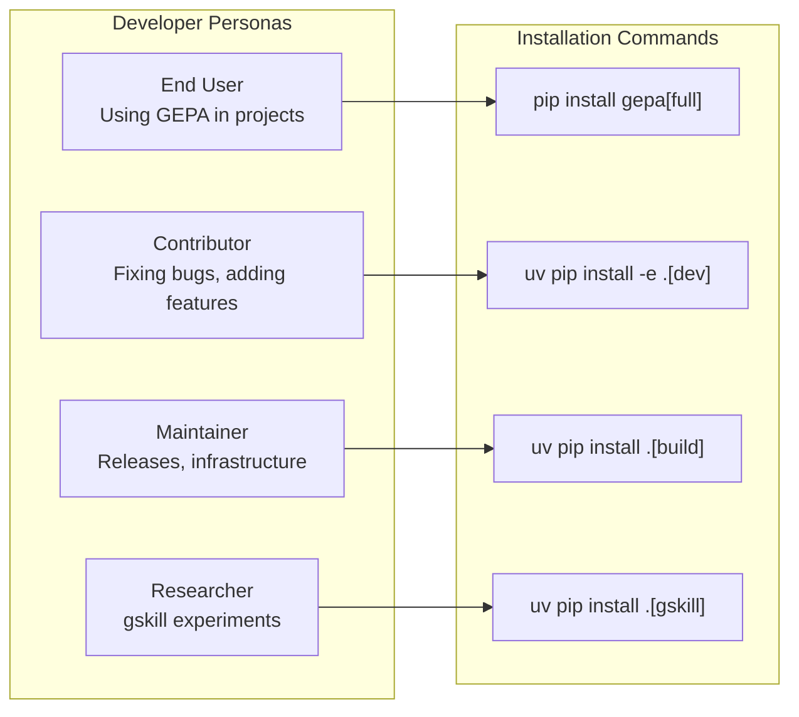

uv venv .venv --python 3.11
uv sync -p .venv --extra dev
```

### Verifying Installation

To ensure the environment is correctly configured, run the following commands:

```bash
# Run tests
uv run pytest tests/

# Type check
uv run pyright

# Lint check
uv run ruff check
```

**Sources:** [.github/workflows/run_tests.yml:31-36](), [.github/workflows/run_tests.yml:93-98](), [CONTRIBUTING.md:17-39]()

---

## Dependency Group Usage Patterns



**Common Installation Scenarios:**

1. **Using GEPA in a project:** `pip install gepa[full]`
   - Installs runtime dependencies for optimization.
2. **Contributing to GEPA:** `uv pip install -e ".[dev]"`
   - Editable install including all test and build tools.
3. **Running tests only:** `uv pip install ".[test]"`
   - Minimal install for running the test suite in CI ([.github/workflows/run_tests.yml:98]()).
4. **Building releases:** `uv pip install ".[build]"`
   - Tools for package building and publishing ([.github/workflows/build_and_release.yml:55]()).

**Sources:** [pyproject.toml:22-74](), [.github/workflows/run_tests.yml:98](), [.github/workflows/build_and_release.yml:55]()

---

## Build System Configuration

### pyproject.toml Structure

```mermaid
graph TB
    PYPROJECT["pyproject.toml"]
    
    subgraph "Build System"
        BUILD_SYS["[build-system]<br/>setuptools>=77.0.1"]
        BUILD_BACKEND["build-backend = setuptools.build_meta"]
    end
    
    subgraph "Project Metadata"
        NAME["name = gepa"]
        VERSION["version marker<br/>(modified by CI)"]
        DESC["description, authors, license"]
        PYTHON["requires-python = '>=3.10, <3.15'"]
    end
    
    subgraph "Package Configuration"
        PACKAGES["[tool.setuptools.packages.find]<br/>where = ['src']"]
        PKG_DATA["[tool.setuptools.package-data]<br/>gepa = ['py.typed']"]
    end
    
    subgraph "Tool Configurations"
        PYTEST["[tool.pytest.ini_options]<br/>testpaths = ['tests']"]
        RUFF["[tool.ruff]<br/>Linting rules"]
    end
    
    PYPROJECT --> BUILD_SYS
    PYPROJECT --> BUILD_BACKEND
    PYPROJECT --> NAME
    PYPROJECT --> VERSION
    PYPROJECT --> DESC
    PYPROJECT --> PYTHON
    PYPROJECT --> PACKAGES
    PYPROJECT --> PKG_DATA
    PYPROJECT --> PYTEST
    PYPROJECT --> RUFF
```



### Key Configuration Sections

- **Build Backend**: Uses `setuptools` as the build backend, requiring `setuptools>=77.0.1`, `wheel`, and `build` ([pyproject.toml:1-3]()).
- **Package Discovery**: Source code is located in the `src/` directory (src-layout) ([pyproject.toml:80-81]()).
- **Version Management**: The version is defined with a marker comment `#replace_package_version_marker` which CI workflows modify during release using `sed` ([pyproject.toml:8-11](), [.github/workflows/build_and_release.yml:66]()).
- **Type Support**: Includes the `py.typed` marker file for PEP 561 support ([pyproject.toml:83-84]()).

**Sources:** [pyproject.toml:1-84](), [.github/workflows/build_and_release.yml:66]()

---

## Dependency Locking with uv.lock

The `uv.lock` file provides deterministic dependency resolution. It contains resolution markers covering combinations of Python versions and platforms (Linux vs. non-Linux) to ensure consistent environments regardless of the OS or specific Python 3.x minor version.

### Transitive Dependencies
`uv.lock` captures exact versions, hashes, and source URLs for all packages, including transitive ones. For example, `aiohappyeyeballs` is pinned to `2.6.1` with specific wheel hashes ([uv.lock:15-22]()).

**Sources:** [uv.lock:1-13](), [uv.lock:15-22]()

---

## CI/CD Integration

### Dependency Installation in CI

The CI pipeline follows a standardized setup:
1. Checkout code.
2. Set up Python (matrix of 3.10-3.14).
3. Set up `uv` with caching enabled on `pyproject.toml` and `uv.lock`.
4. Create venv and run `uv sync --extra dev`.
5. Execute tests via `uv run pytest`.

### Build and Release Workflow
The release workflow uses `uv` to install build dependencies, build binary wheels, and verify the wheel by installing it in a fresh environment before publishing to PyPI.

**Sources:** [.github/workflows/run_tests.yml:25-36](), [.github/workflows/run_tests.yml:85-98](), [.github/workflows/build_and_release.yml:48-83]()

---

## Tool Configuration in pyproject.toml

### Ruff Configuration
Ruff is configured with a 120-character line length and targets Python 3.10 ([pyproject.toml:91-93]()). It enables a wide range of linting rules including:
- **E/W**: pycodestyle errors and warnings.
- **F**: pyflakes.
- **I**: isort for import ordering.
- **B**: flake8-bugbear.
- **UP**: pyupgrade.

Per-file ignores are used to allow specific patterns, such as `assert` statements in the `tests/` directory ([pyproject.toml:141-145]()).

**Sources:** [pyproject.toml:89-149]()