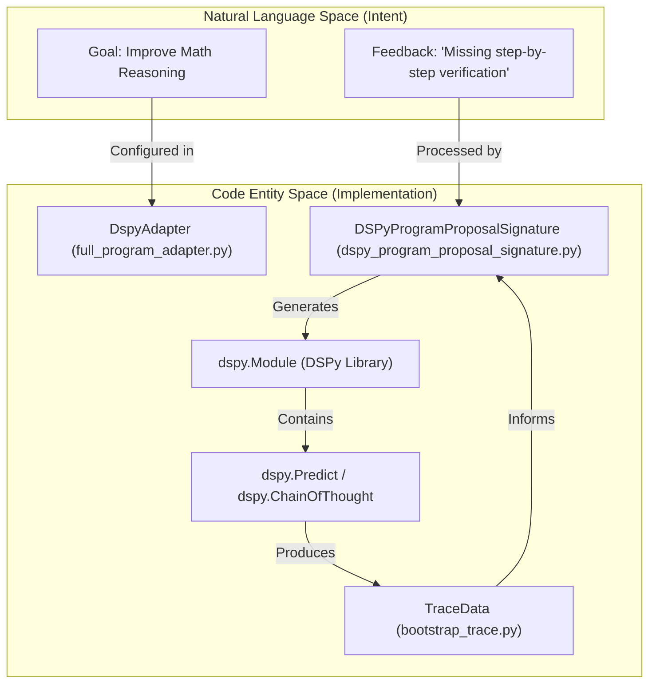
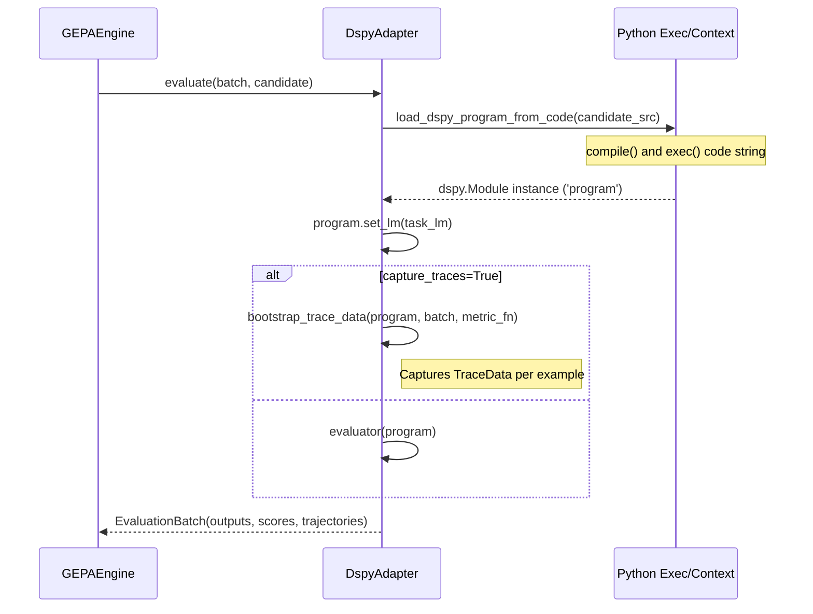

## Purpose and Scope

This page documents the `DspyAdapter` for full program evolution, which enables GEPA to evolve entire DSPy programs—including custom signatures, module compositions, and control flow logic—rather than just optimizing instruction strings within existing predictors. This adapter treats DSPy programs as first-class evolutionary targets, automatically refining program structure, reasoning patterns, and module interactions based on execution traces and performance feedback.

**Scope distinction:**
- For basic DSPy prompt optimization (evolving instruction strings within existing DSPy predictors), see [DSPy Integration]().
- For the general adapter protocol specification, see [GEPAAdapter Interface]().

## Overview

The `DspyAdapter` represents a fundamentally different optimization paradigm compared to traditional prompt engineering. Instead of treating DSPy programs as fixed computational graphs with tunable text parameters, this adapter evolves the programs themselves—modifying signatures, adding or removing modules, restructuring control flow, and introducing new reasoning patterns.

### Key Capabilities

| Capability | Description | Implementation Detail |
|------------|-------------|---------|
| **Signature Evolution** | Evolve input/output field definitions and descriptions | Uses `DSPyProgramProposalSignature` to rewrite `dspy.Signature` classes [src/gepa/adapters/dspy_full_program_adapter/dspy_program_proposal_signature.py:39-44]() |
| **Module Composition** | Add, remove, or reorganize DSPy modules | Proposes new `dspy.Module` subclasses with custom `__init__` and `forward` logic [src/gepa/adapters/dspy_full_program_adapter/dspy_program_proposal_signature.py:50-60]() |
| **Control Flow Modification** | Introduce conditionals, loops, or multi-path reasoning | Encourages use of Python logic for symbolic/logical operations [src/gepa/adapters/dspy_full_program_adapter/dspy_program_proposal_signature.py:67-68]() |
| **Trace-Driven Feedback** | Extract fine-grained predictor failures | Maps `dspy.teleprompt.bootstrap_trace.TraceData` to specific named predictors [src/gepa/adapters/dspy_full_program_adapter/full_program_adapter.py:185-195]() |

### Performance Impact

The adapter has demonstrated substantial improvements on challenging benchmarks:
- **ARC-AGI**: Optimizes Gemini-2.5-Pro performance from 44% to 49.5% by evolving a 5-step schema including Python code generation and execution feedback loops [src/gepa/examples/dspy_full_program_evolution/arc_agi.ipynb:10-17]().
- **MATH Dataset**: 67.1% (baseline `dspy.ChainOfThought`) → 93% (evolved program) using GPT-4.1 Nano [src/gepa/adapters/dspy_full_program_adapter/README.md:42-42]().

Sources: [src/gepa/examples/dspy_full_program_evolution/arc_agi.ipynb:10-17](), [src/gepa/adapters/dspy_full_program_adapter/README.md:42-42]()

## Architecture

The `DspyAdapter` implements the `GEPAAdapter` protocol, specialized for handling DSPy's program representation as Python source code.

### Natural Language Space to Code Entity Space Mapping

This diagram illustrates how high-level optimization goals are translated into specific code entities within the `DspyAdapter` ecosystem.


Sources: [src/gepa/adapters/dspy_full_program_adapter/full_program_adapter.py:14-131](), [src/gepa/adapters/dspy_full_program_adapter/dspy_program_proposal_signature.py:11-91]()

### Program Representation and Lifecycle

Candidates in this adapter are dictionaries containing a `"program"` key, which holds the full Python source code of the DSPy module [src/gepa/adapters/dspy_full_program_adapter/full_program_adapter.py:37-40]().


Sources: [src/gepa/adapters/dspy_full_program_adapter/full_program_adapter.py:36-131]()

## Key Functions and Classes

### `DspyAdapter` Class
The core implementation of the adapter protocol for DSPy programs [src/gepa/adapters/dspy_full_program_adapter/full_program_adapter.py:14-14]().
- **`load_dspy_program_from_code`**: Uses `compile` and `exec` to transform a candidate string into a live `dspy.Module` [src/gepa/adapters/dspy_full_program_adapter/full_program_adapter.py:42-81](). It enforces that the code defines a variable named `program` [src/gepa/adapters/dspy_full_program_adapter/full_program_adapter.py:65-71]().
- **`evaluate`**: Supports two modes. Standard evaluation via `dspy.evaluate.Evaluate` and trace-aware evaluation via `bootstrap_trace_data` for reflection [src/gepa/adapters/dspy_full_program_adapter/full_program_adapter.py:83-131]().
- **`make_reflective_dataset`**: Extracts `Program Inputs`, `Program Outputs`, and `Program Trace` from the `TraceData` [src/gepa/adapters/dspy_full_program_adapter/full_program_adapter.py:146-182](). It specifically identifies failures in internal predictors by checking for `FailedPrediction` instances in the trace [src/gepa/adapters/dspy_full_program_adapter/full_program_adapter.py:170-173]().

### `DSPyProgramProposalSignature`
A specialized GEPA `Signature` that instructs the reflection LM on how to evolve DSPy code [src/gepa/adapters/dspy_full_program_adapter/dspy_program_proposal_signature.py:11-11]().
- **Prompt Template**: Includes a comprehensive overview of DSPy concepts (Signatures, Modules, Improvement Strategies) to guide the LM [src/gepa/adapters/dspy_full_program_adapter/dspy_program_proposal_signature.py:12-70]().
- **Output Extractor**: Extracts the proposed Python code from triple backticks in the LM response [src/gepa/adapters/dspy_full_program_adapter/dspy_program_proposal_signature.py:117-133]().

Sources: [src/gepa/adapters/dspy_full_program_adapter/full_program_adapter.py:14-220](), [src/gepa/adapters/dspy_full_program_adapter/dspy_program_proposal_signature.py:11-133]()

## Data Flow: Trace Extraction to Reflection

The power of full program evolution lies in its ability to pinpoint which part of a multi-step program failed.

| Step | Entity | Action |
|------|--------|--------|
| **Capture** | `bootstrap_trace_data` | Records every call to `dspy.Predict` or `dspy.ChainOfThought` [src/gepa/adapters/dspy_full_program_adapter/full_program_adapter.py:95-104]() |
| **Extraction** | `make_reflective_dataset` | Iterates through `trace_instances` to find `FailedPrediction` or low-score outputs [src/gepa/adapters/dspy_full_program_adapter/full_program_adapter.py:170-182]() |
| **Mapping** | `named_predictors()` | Matches trace data back to the specific variable name in the source code (e.g., `self.reasoner`) [src/gepa/adapters/dspy_full_program_adapter/full_program_adapter.py:185-195]() |
| **Formatting** | `yaml.dump` | Serializes the collected feedback into a structured YAML format for the reflection prompt [src/gepa/adapters/dspy_full_program_adapter/dspy_program_proposal_signature.py:105-109]() |

Sources: [src/gepa/adapters/dspy_full_program_adapter/full_program_adapter.py:133-220](), [src/gepa/adapters/dspy_full_program_adapter/dspy_program_proposal_signature.py:105-109]()

## Usage Example

To use the `DspyAdapter`, you provide a seed program string and configure the task and reflection LMs.

```python
from gepa import optimize
from gepa.adapters.dspy_full_program_adapter.full_program_adapter import DspyAdapter
import dspy