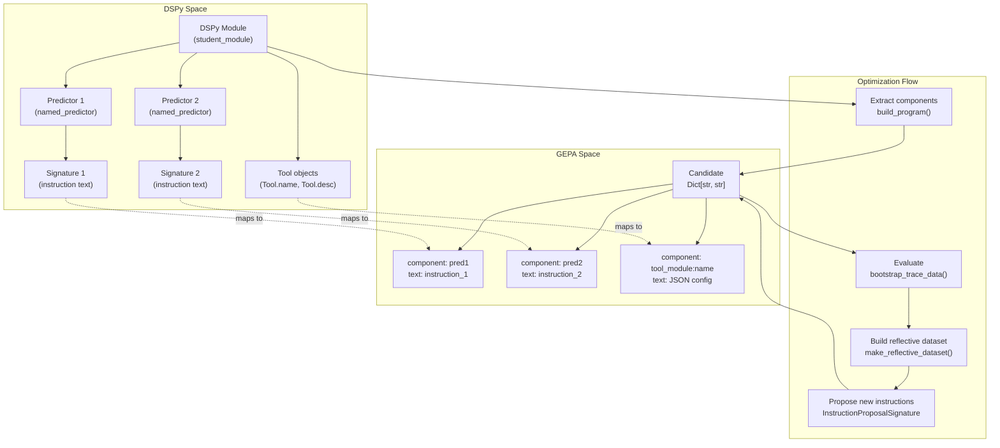
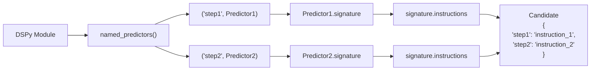
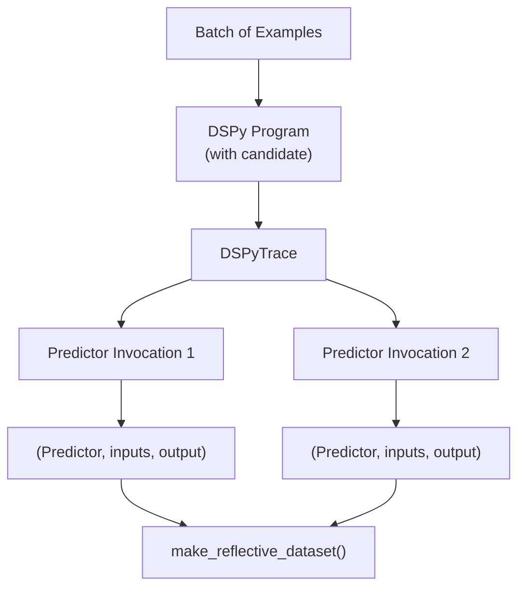
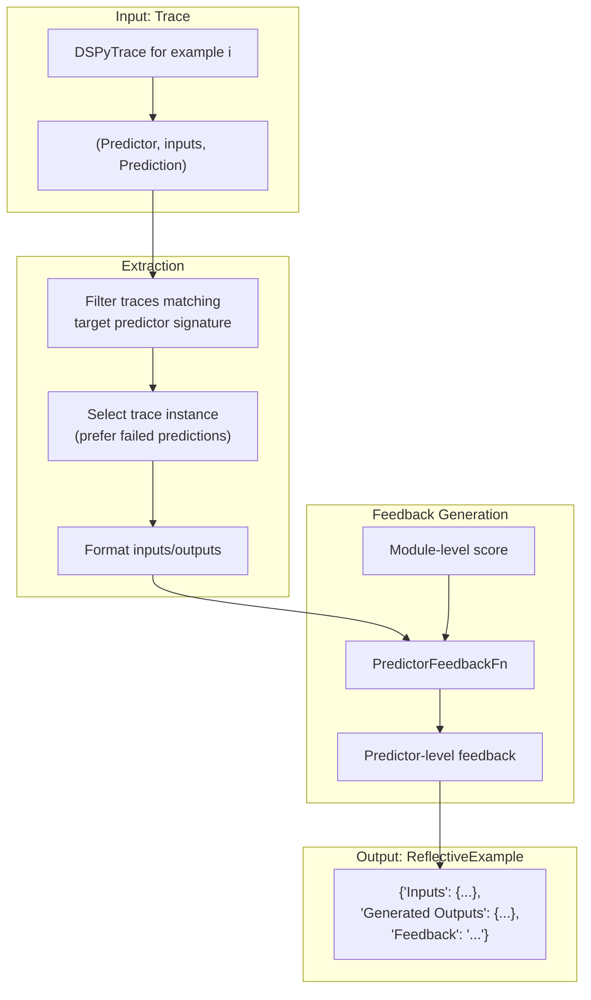
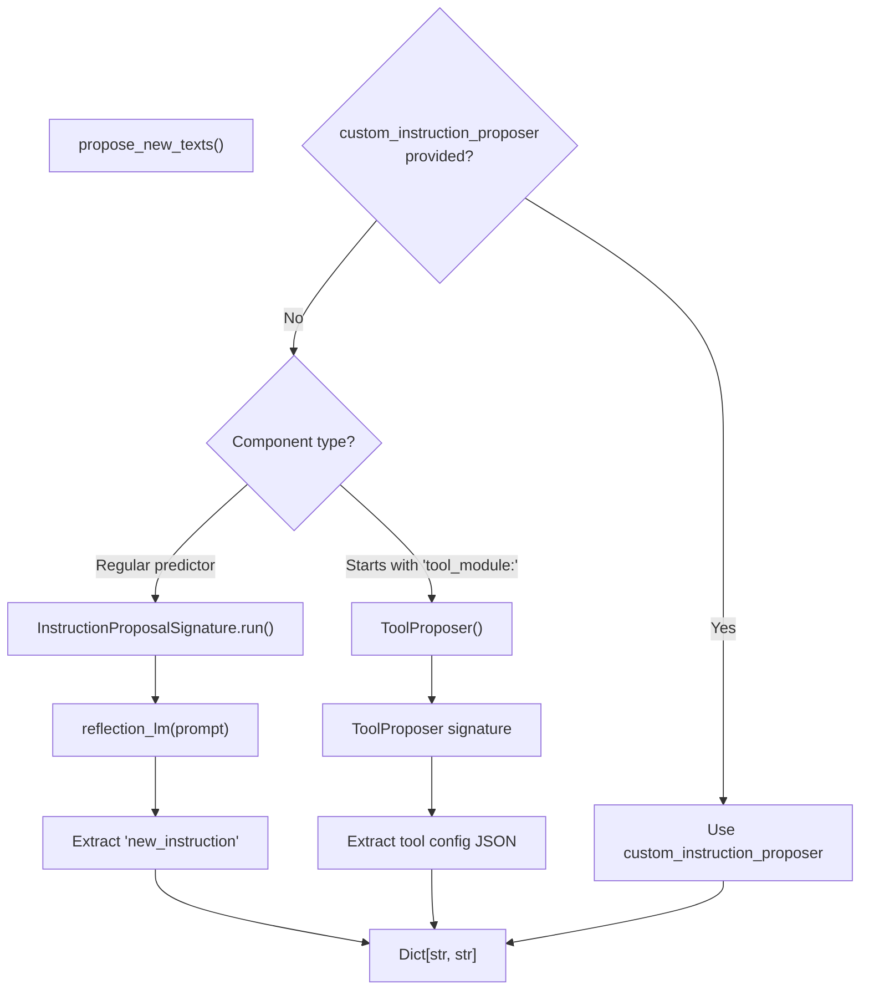
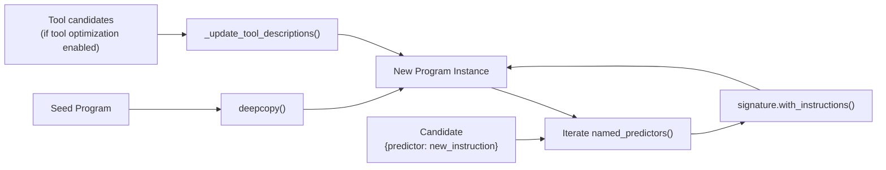

## Purpose and Scope

This page documents GEPA's integration with [DSPy](https://dspy.ai/), a framework for programming language models using signatures and modules. GEPA optimizes DSPy programs by evolving their instruction strings and tool descriptions through LLM-based reflection.

**Scope of this page:**
- How DSPy signatures and predictors map to GEPA candidates
- Instruction proposal mechanism for single and multiple predictors
- Basic DSPy program optimization workflow

**Related pages:**
- For the full DSPyAdapter implementation with tool optimization and complex trace handling, see **5.5 DSPy Full Program Evolution**
- For the general adapter interface that DSPyAdapter implements, see [GEPAAdapter Interface](src/gepa/core/adapter.py:1-181)()
- For creating custom adapters, see **5.10 Creating Custom Adapters**

---

## DSPy Program Structure

DSPy programs consist of three key abstractions that GEPA optimizes:

| Component | Description | GEPA Mapping |
|-----------|-------------|--------------|
| **Signature** | Defines input/output fields and an instruction string | The instruction becomes a candidate component |
| **Predictor** | Wraps a signature and executes LM calls | Named predictors become optimization targets |
| **Module** | Composes multiple predictors into a program | The full module is evaluated; individual predictors are evolved |

A typical DSPy signature:

```python
class QuestionAnswer(dspy.Signature):
    """Answer questions with short factoid answers."""
    question = dspy.InputField()
    answer = dspy.OutputField()
```

GEPA extracts the docstring (`"Answer questions with short factoid answers."`) as the candidate component text and evolves it through reflection.

**Sources:** [src/gepa/adapters/README.md:8-8](), [src/gepa/adapters/dspy_adapter/README.md:1-7]()

---

## Integration Architecture

"DSPy to GEPA Entity Mapping"


**Key mapping:**
- Each named predictor in the DSPy program becomes a candidate component [src/gepa/adapters/dspy_adapter/dspy_adapter.py:181-181]().
- Component names are the predictor names from `named_predictors()` [src/gepa/adapters/dspy_adapter/dspy_adapter.py:181-181]().
- Component texts are the signature instruction strings [src/gepa/adapters/dspy_adapter/dspy_adapter.py:181-181]().
- Tool-using modules get special `tool_module:` prefixed component names [src/gepa/adapters/dspy_adapter/dspy_adapter.py:28-28]().

**Sources:** [src/gepa/adapters/dspy_adapter/dspy_adapter.py:28-28](), [src/gepa/adapters/dspy_adapter/dspy_adapter.py:177-206]()

---

## Signature and Component Extraction

The `DspyAdapter` extracts optimizable components from a DSPy program using the `named_predictors()` method:

"Component Extraction Data Flow"


The `build_program()` method performs the reverse operation: given a candidate dictionary, it creates a fresh copy of the module using `deepcopy()` and updates each predictor's signature with the evolved instruction text [src/gepa/adapters/dspy_adapter/dspy_adapter.py:178-206]().

**Sources:** [src/gepa/adapters/dspy_adapter/dspy_adapter.py:177-206]()

---

## Evaluation and Trace Capture

The `DspyAdapter` evaluation flow differs based on whether traces are needed:

| Mode | Function | Purpose | Returns |
|------|----------|---------|---------|
| `capture_traces=True` | `bootstrap_trace_data()` | Capture full execution trace for reflection | `TraceData` with predictor-level details |
| `capture_traces=False` | `Evaluate()` | Fast scoring for acceptance test | Scores and outputs only |

**DSPyTrace Structure:**

A trace is a list of tuples: `[(Predictor, PredictorInputs, Prediction), ...]` representing each predictor invocation during program execution [src/gepa/adapters/dspy_adapter/dspy_adapter.py:39-39]().

"Trace Collection and Processing"


**Sources:** [src/gepa/adapters/dspy_adapter/dspy_adapter.py:39-39](), [src/gepa/adapters/dspy_adapter/dspy_adapter.py:257-321]()

---

## Reflective Dataset Construction

The `make_reflective_dataset()` method transforms `DSPyTrace` objects into structured `ReflectiveExample` records for instruction proposal [src/gepa/adapters/dspy_adapter/dspy_adapter.py:341-341]():

"Reflective Record Generation"


**ReflectiveExample Schema [src/gepa/adapters/dspy_adapter/dspy_adapter.py:41-48]():**

| Field | Type | Description |
|-------|------|-------------|
| `Inputs` | `Dict[str, Any]` | Predictor inputs, with special handling for `History` objects |
| `Generated Outputs` | `Dict[str, Any] \| str` | Predictor outputs, or error message if `FailedPrediction` |
| `Feedback` | `str` | Diagnostic feedback from `PredictorFeedbackFn` or parse error details |

**Special handling:**
- **History objects**: Serialized to JSON format showing message sequence [src/gepa/adapters/dspy_adapter/dspy_adapter.py:381-381]().
- **FailedPrediction**: Outputs replaced with parse error and expected format guidance [src/gepa/adapters/dspy_adapter/dspy_adapter.py:408-408]().

**Sources:** [src/gepa/adapters/dspy_adapter/dspy_adapter.py:41-48](), [src/gepa/adapters/dspy_adapter/dspy_adapter.py:341-474]()

---

## Instruction Proposal Mechanism

GEPA uses the `InstructionProposalSignature` to evolve DSPy instructions [src/gepa/adapters/dspy_adapter/dspy_adapter.py:154-154](). The proposal routing logic separates regular instructions from tool-specific proposals:

"Proposal Routing Logic"


**InstructionProposalSignature input [src/gepa/adapters/dspy_adapter/dspy_adapter.py:156-159]():**

```python
{
    "current_instruction_doc": "existing instruction text",
    "dataset_with_feedback": [
        {
            "Inputs": {...},
            "Generated Outputs": {...},
            "Feedback": "diagnostic feedback"
        },
        ...
    ]
}
```

**Sources:** [src/gepa/adapters/dspy_adapter/dspy_adapter.py:118-176](), [src/gepa/strategies/instruction_proposal.py:22-22]()

---

## Program Reconstruction

After proposal, `build_program()` reconstructs the DSPy module with updated instructions [src/gepa/adapters/dspy_adapter/dspy_adapter.py:177-177]():

"Program Assembly"


**Key operations:**
1. **Deep copy**: Creates independent instance via `student.deepcopy()` [src/gepa/adapters/dspy_adapter/dspy_adapter.py:178-178]().
2. **Instruction update**: `pred.signature = pred.signature.with_instructions(new_text)` [src/gepa/adapters/dspy_adapter/dspy_adapter.py:206-206]().
3. **Tool update** (if enabled): Modifies `Tool.desc` and argument descriptions in-place [src/gepa/adapters/dspy_adapter/dspy_adapter.py:208-229]().

**Sources:** [src/gepa/adapters/dspy_adapter/dspy_adapter.py:177-206](), [src/gepa/adapters/dspy_adapter/dspy_adapter.py:208-229]()

---

## PredictorFeedbackFn Protocol

The `PredictorFeedbackFn` is a user-defined function that generates feedback for individual predictor outputs [src/gepa/adapters/dspy_adapter/dspy_adapter.py:63-63]():

**Function signature [src/gepa/adapters/dspy_adapter/dspy_adapter.py:64-71]():**
```python
def feedback_fn(
    predictor_output: dict[str, Any],
    predictor_inputs: dict[str, Any],
    module_inputs: Example,
    module_outputs: Prediction,
    captured_trace: DSPyTrace,
) -> ScoreWithFeedback
```

**Return type [src/gepa/adapters/dspy_adapter/dspy_adapter.py:57-60]():**
```python
class ScoreWithFeedback(Prediction):
    score: float
    feedback: str | None = None
    subscores: dict[str, float] | None = None
```

**Usage in DspyAdapter:**
- One `PredictorFeedbackFn` per predictor name in `feedback_map` [src/gepa/adapters/dspy_adapter/dspy_adapter.py:107-107]().
- Called during `make_reflective_dataset()` to generate the `"Feedback"` field [src/gepa/adapters/dspy_adapter/dspy_adapter.py:439-439]().

**Sources:** [src/gepa/adapters/dspy_adapter/dspy_adapter.py:57-60](), [src/gepa/adapters/dspy_adapter/dspy_adapter.py:63-86](), [src/gepa/adapters/dspy_adapter/dspy_adapter.py:439-461]()

---

## Score and Subscore Handling

DSPy metrics can return complex score objects. The adapter extracts both main scores and subscores for multi-objective optimization [src/gepa/adapters/dspy_adapter/dspy_adapter.py:323-339]():

**Supported score formats:**

| Input Type | Extraction Logic |
|------------|------------------|
| `float` | Direct score, no subscores |
| `dict` | Extract `["score"]` and optional `["subscores"]` |
| Object with attributes | Extract `.score` and optional `.subscores` |
| `None` | Use `failure_score` (default 0.0) |

**Multi-objective mapping:**
- Main score → `EvaluationBatch.scores` [src/gepa/adapters/dspy_adapter/dspy_adapter.py:338-338]().
- Subscores → `EvaluationBatch.objective_scores` [src/gepa/adapters/dspy_adapter/dspy_adapter.py:339-339]().

**Sources:** [src/gepa/adapters/dspy_adapter/dspy_adapter.py:323-339]()

---

## Configuration Options

The `DspyAdapter` constructor accepts several configuration parameters [src/gepa/adapters/dspy_adapter/dspy_adapter.py:90-104]():

| Parameter | Type | Description |
|-----------|------|-------------|
| `student_module` | `Module` | The DSPy program to optimize |
| `metric_fn` | `Callable` | Evaluation function returning score or score object |
| `feedback_map` | `dict[str, Callable]` | Predictor name → feedback function mapping |
| `failure_score` | `float` | Score to assign when evaluation fails (default 0.0) |
| `num_threads` | `int \| None` | Parallel evaluation threads |
| `add_format_failure_as_feedback` | `bool` | Include `FailedPrediction` instances in reflective dataset |
| `rng` | `random.Random \| None` | Random number generator for deterministic trace sampling |
| `reflection_lm` | LM instance | Language model for instruction proposal |
| `custom_instruction_proposer` | `ProposalFn \| None` | Custom proposal function override |
| `warn_on_score_mismatch` | `bool` | Warn when predictor score differs from module score |
| `enable_tool_optimization` | `bool` | Enable optimization of tool descriptions |
| `reflection_minibatch_size` | `int \| None` | Minibatch size for controlling logging granularity |

**Sources:** [src/gepa/adapters/dspy_adapter/dspy_adapter.py:89-117]()

---

## Differences from Other Adapters

| Feature | DSPyAdapter | DefaultAdapter | OptimizeAnythingAdapter |
|---------|-------------|----------------|------------------------|
| **Target** | DSPy programs | Single-turn LLM tasks | Arbitrary text artifacts |
| **Components** | Named predictors | Single `system_prompt` | Single artifact string |
| **Trace type** | `DSPyTrace` | `DefaultTrajectory` | ASI logs |
| **Feedback** | `PredictorFeedbackFn` | `ContainsAnswerEvaluator` | `oa.log()` strings |
| **Multi-component** | Yes | No | No |
| **Tool support** | Yes (optional) | No | No |

**Sources:** [src/gepa/adapters/dspy_adapter/dspy_adapter.py:1-526](), [src/gepa/adapters/default_adapter/default_adapter.py:87-174](), [src/gepa/optimize_anything.py:100-150]()