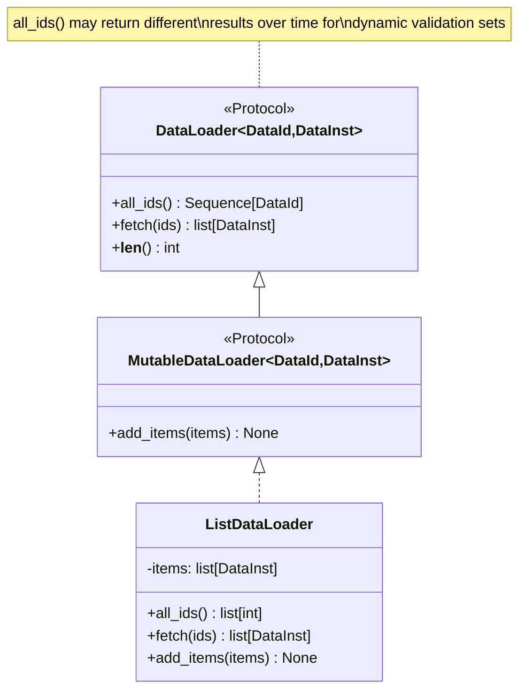
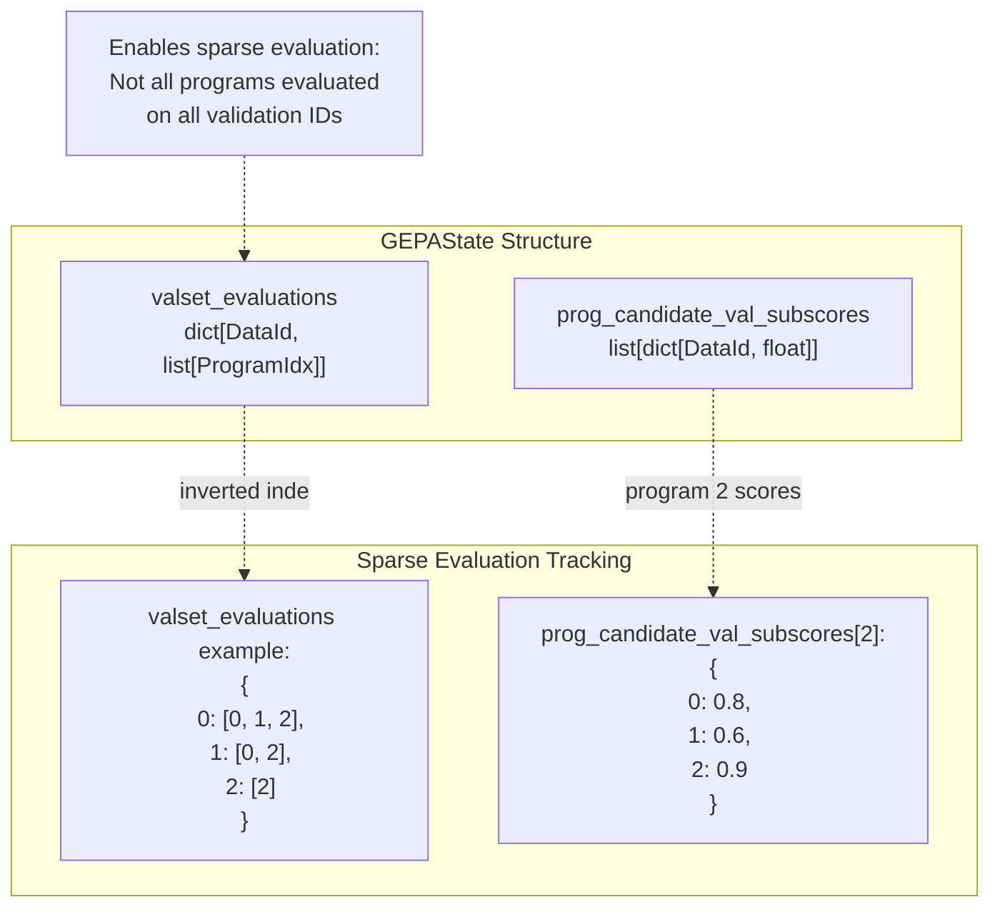
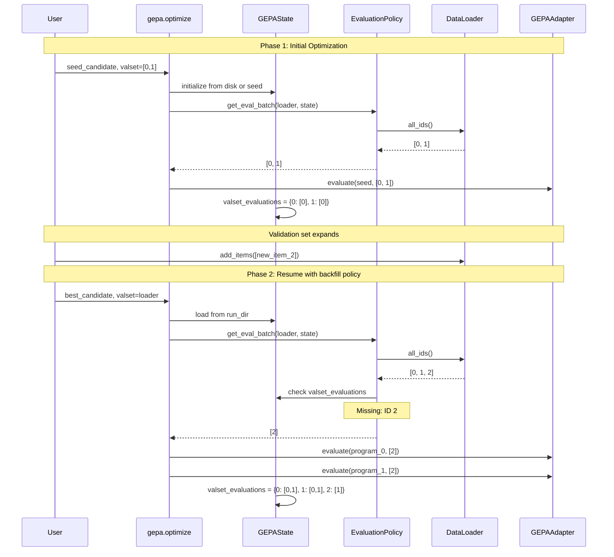
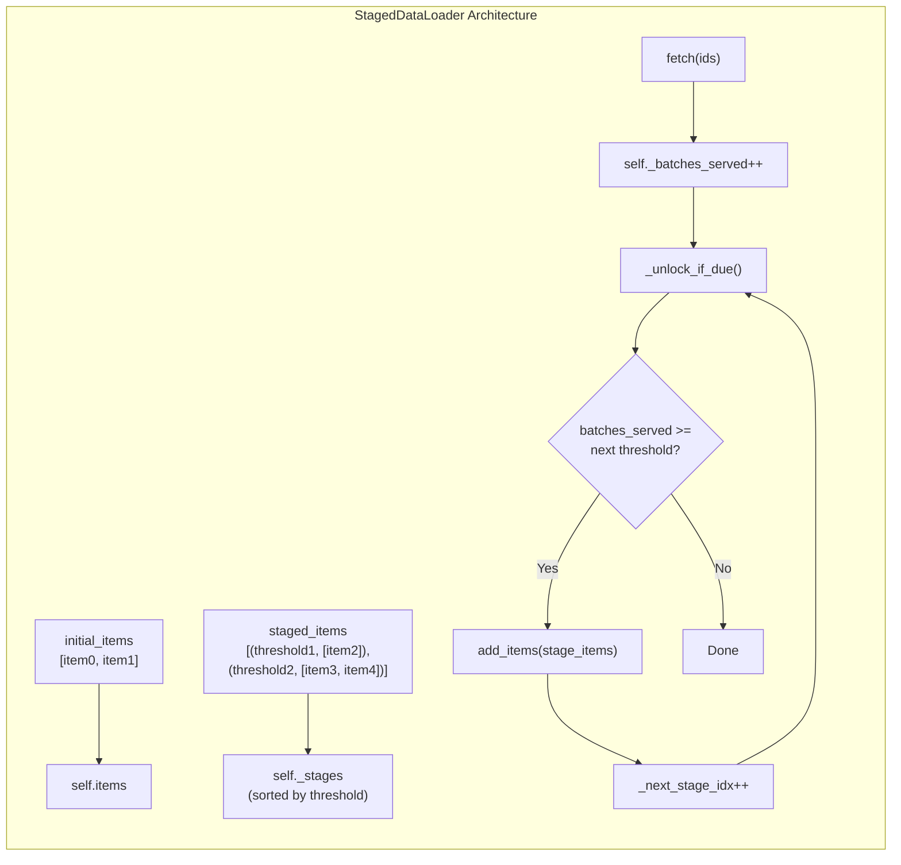
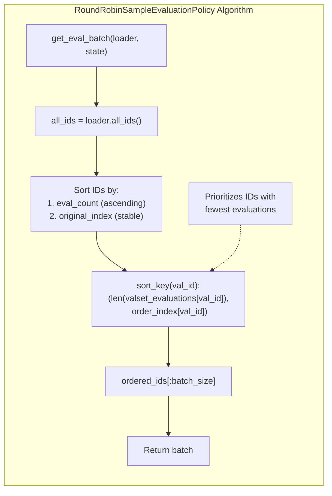
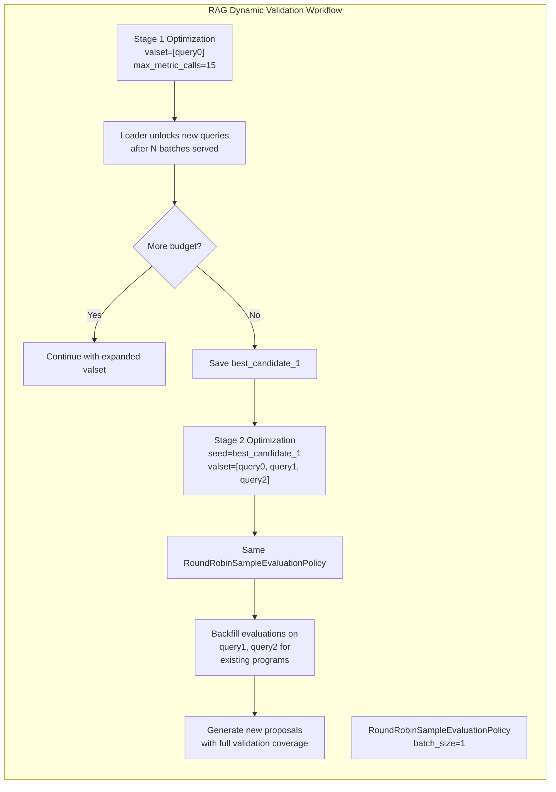
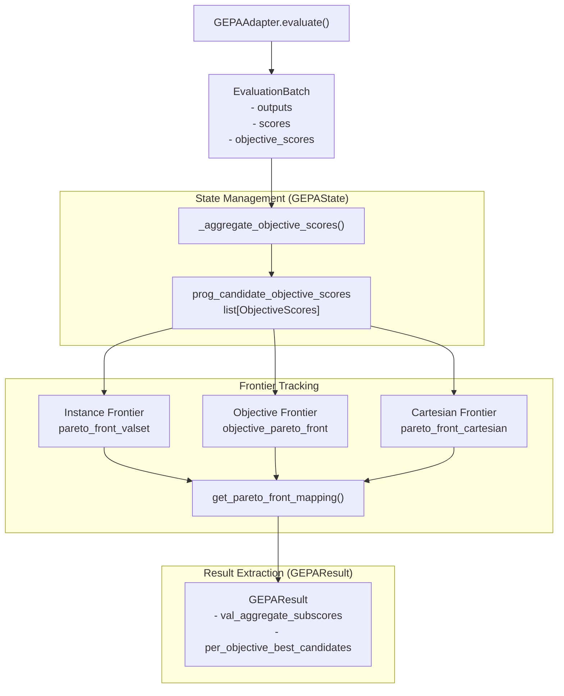
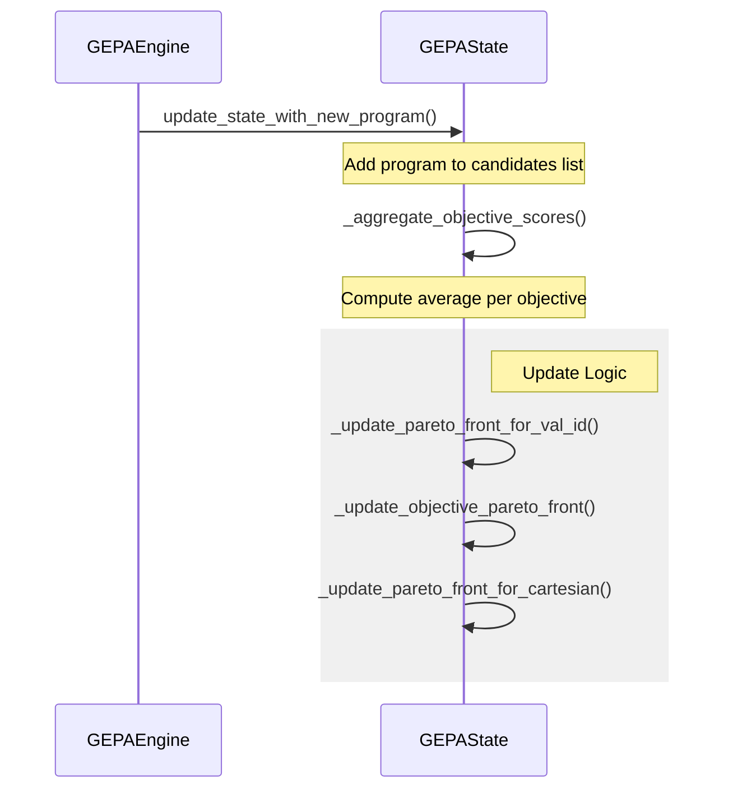

This page explains how GEPA handles validation sets that grow or change during optimization. Dynamic validation sets enable scenarios where validation data becomes available incrementally, or where you want to gradually expand validation coverage as optimization progresses.

For information about the `DataLoader` protocol itself, see [Data Loading and Evaluation Policies](3.6). For details on `EvaluationPolicy` strategies, see [Evaluation Policies](4.6).

## Purpose and Scope

Dynamic validation sets address scenarios where:
- Validation data arrives incrementally during optimization (e.g., from an active learning pipeline).
- Validation sets expand based on performance thresholds or iteration counts.
- Different validation subsets become relevant at different optimization stages.
- You want to backfill evaluations on new validation data for previously discovered candidates.

GEPA supports dynamic validation through the `DataLoader` protocol and `EvaluationPolicy` interface, which decouple the validation data source from the optimization engine.

**Sources**: [src/gepa/core/data_loader.py:1-75](), [src/gepa/strategies/eval_policy.py:1-64]()

## Core Abstractions

### DataLoader Protocol

The `DataLoader` protocol defines the minimal interface for accessing validation data:



**Sources**: [src/gepa/core/data_loader.py:26-75]()

The key design feature enabling dynamic validation is that `all_ids()` may return different results when called at different times. The optimization engine calls `all_ids()` to determine the current validation set size. [src/gepa/core/data_loader.py:30-32]()

### MutableDataLoader for Runtime Growth

The `MutableDataLoader` protocol extends `DataLoader` with an `add_items()` method:

| Method | Purpose | When Called |
|--------|---------|-------------|
| `add_items(items)` | Append new validation examples to the loader | Custom logic (policy, adapter hooks, external triggers) |
| `all_ids()` | Return current validation ID universe | Before each validation evaluation |
| `fetch(ids)` | Materialize data instances by ID | During evaluation |

**Sources**: [src/gepa/core/data_loader.py:43-66]()

## Validation Tracking in GEPAState

`GEPAState` tracks which validation IDs have been evaluated for which programs using the `valset_evaluations` field and `prog_candidate_val_subscores`:



This dual-index structure enables:
1. **Forward lookup**: Given a program, which validation IDs were evaluated? (`prog_candidate_val_subscores[prog_idx].keys()`) [src/gepa/strategies/eval_policy.py:46-48]()
2. **Reverse lookup**: Given a validation ID, which programs were evaluated? (`valset_evaluations[val_id]`) [tests/test_incremental_eval_policy.py:77-78]()

**Sources**: [src/gepa/strategies/eval_policy.py:46-52](), [tests/test_incremental_eval_policy.py:74-77]()

## Backfilling Evaluations

When new validation data arrives, GEPA can backfill evaluations on previously discovered candidates. The backfilling workflow is facilitated by policies that detect the delta between the `DataLoader` and the `GEPAState`.



**Sources**: [tests/test_incremental_eval_policy.py:102-140](), [tests/test_data_loader.py:69-94]()

### Backfill Policy Example

A common pattern for dynamic validation is prioritizing unevaluated validation IDs. A policy typically compares the `all_ids` from the loader with the keys in `state.valset_evaluations`. [tests/test_incremental_eval_policy.py:69-78]()

```python
class BackfillValidationPolicy(EvaluationPolicy):
    def get_eval_batch(self, loader, state, target_program_idx=None):
        valset_ids = set(loader.all_ids())
        # state.valset_evaluations tracks which IDs have any evaluations
        missing_valset_ids = valset_ids.difference(state.valset_evaluations.keys())
        
        if missing_valset_ids:
            return sorted(list(missing_valset_ids))  # Prioritize new IDs
        
        return list(valset_ids) # Default to full
```

This pattern enables resuming optimization from a saved state and backfilling evaluations on all previously discovered programs. [src/gepa/strategies/eval_policy.py:37-41](), [tests/test_incremental_eval_policy.py:62-83]()

## Staged DataLoader Implementation

The test suite provides a reference implementation `StagedDataLoader` that unlocks validation data based on batch count. [tests/test_data_loader.py:7-29]()



Key methods:

| Method | Behavior |
|--------|----------|
| `__init__(initial_items, staged_items)` | Initialize with base items and staged unlock conditions. [tests/test_data_loader.py:10-29]() |
| `fetch(ids)` | Return items, increment batch counter, unlock stages if thresholds met. [tests/test_data_loader.py:35-39]() |
| `unlock_next_stage()` | Manually trigger stage unlock (bypasses threshold). [tests/test_data_loader.py:41-49]() |
| `all_ids()` | Return IDs for all currently unlocked items. [src/gepa/core/data_loader.py:56-57]() |

**Sources**: [tests/test_data_loader.py:7-57]()

## Round-Robin Sampling Policy

For dynamic validation sets, a round-robin sampling policy ensures all validation IDs receive evaluation coverage even if the set is too large for full evaluation every iteration. [tests/test_incremental_eval_policy.py:54-60]()



This policy prioritizes IDs with the fewest evaluations and limits batch size to control evaluation cost. [tests/test_incremental_eval_policy.py:76-81]()

**Sources**: [tests/test_incremental_eval_policy.py:54-100]()

## Integration with RAG Optimization

The RAG adapter demonstrates dynamic validation in scenarios where validation sets grow as new queries are discovered. [tests/test_rag_adapter/test_rag_end_to_end.py:15-50]()



**Sources**: [tests/test_rag_adapter/test_rag_end_to_end.py:15-50](), [tests/test_incremental_eval_policy.py:102-140]()

## State Persistence Across Stages

The state persistence mechanism preserves validation evaluation history across optimization stages. [tests/test_state.py:79-115]() When resuming with an expanded validation set:

1. **Load state**: `GEPAState` deserializes previous evaluation counts and scores. [tests/test_state.py:144]()
2. **Detect missing IDs**: `EvaluationPolicy` compares `loader.all_ids()` vs `state.valset_evaluations.keys()`. [tests/test_incremental_eval_policy.py:69-77]()
3. **Backfill evaluations**: Policy returns missing IDs to the engine. [tests/test_incremental_eval_policy.py:81]()
4. **Update state**: New evaluations are merged into `prog_candidate_val_subscores`. [src/gepa/strategies/eval_policy.py:46-48]()

**Sources**: [src/gepa/strategies/eval_policy.py:43-53](), [tests/test_incremental_eval_policy.py:85-95](), [tests/test_state.py:79-115]()

## Best Practices

### 1. Design Idempotent Evaluation Policies
Ensure `get_eval_batch()` is deterministic given the same state to avoid unpredictable evaluation patterns during resumption.

### 2. Track Coverage Explicitly
Monitor which validation IDs have been evaluated for each program to ensure that the "best" program selection is based on comparable data. `FullEvaluationPolicy` handles this by averaging available scores. [src/gepa/strategies/eval_policy.py:46-52]()

### 3. Use State Persistence for Multi-Stage Workflows
Save state between stages for resumability. When `gepa.optimize` is called with a `run_dir`, it can resume from the existing state, preserving the history of evaluations even if the `valset` passed to the function has grown. [tests/test_incremental_eval_policy.py:119-129](), [tests/test_state.py:95-102]()

### 4. Implement Gradual Backfilling
Avoid evaluating all programs on all new validation IDs at once if the new set is large. Use a batch-limited policy like `RoundRobinSampleEvaluationPolicy` to spread the cost across multiple iterations. [tests/test_incremental_eval_policy.py:60-81]()

# Multi-Objective Optimization


## Purpose and Scope

This page explains GEPA's multi-objective optimization capabilities, which allow you to optimize candidates against multiple competing metrics simultaneously rather than a single aggregate score. It covers how to define multiple objective functions, the four Pareto frontier strategies available, and how to interpret multi-objective results.

For basic optimization with single metrics, see [The optimize Function (3.1)](). For information on how Pareto frontiers are used in merge operations, see [Merge Proposer (4.4.2)]().

## Overview

GEPA supports multi-objective optimization through its `ObjectiveScores` system. Instead of evaluating candidates with a single scalar score, adapters and evaluators can return a dictionary of named objective scores for each example. GEPA then maintains Pareto frontiers to track candidates that excel on different objectives or specific validation examples.

**Key features:**
- Return multiple named metrics from your evaluator (e.g., `{"accuracy": 0.9, "latency": 0.7, "cost": 0.85}`) [[src/gepa/core/state.py:21-21]]().
- Choose from four frontier tracking strategies: `instance`, `objective`, `hybrid`, or `cartesian` [[src/gepa/core/state.py:22-23]]().
- Access per-objective best candidates and Pareto-optimal trade-offs in results [[src/gepa/core/result.py:224-242]]().
- Merge proposer automatically considers multi-objective Pareto fronts to combine strengths of different candidates [[src/gepa/proposer/merge.py:290-304]]().

Sources: [[src/gepa/api.py:43-96]](), [[src/gepa/core/state.py:20-26]]()

## Architecture Overview

### Multi-Objective Data Flow

The following diagram shows how objective scores flow from the `GEPAAdapter` through the `GEPAEngine` into the persistent `GEPAState` and final `GEPAResult`.

**Multi-Objective Data Flow Diagram**


Sources: [[src/gepa/core/state.py:378-392]](), [[src/gepa/core/state.py:540-561]](), [[src/gepa/core/result.py:211-249]]()

## Defining Multiple Objectives

### Adapter Implementation

To use multi-objective optimization, your adapter's `evaluate()` method must return `objective_scores` in the `EvaluationBatch`. This is a sequence of `ObjectiveScores` dictionaries, one for each input in the batch.

| Field | Type | Purpose |
|-------|------|---------|
| `scores` | `list[float]` | Aggregate score per example (used for subsample acceptance) [[src/gepa/core/adapter.py:39-39]]() |
| `objective_scores` | `Sequence[ObjectiveScores] \| None` | Named objective metrics per example [[src/gepa/core/adapter.py:40-40]]() |

**Example objective_scores structure:**
```python
objective_scores = [
    {"accuracy": 1.0, "latency_score": 0.8},  # Example 0
    {"accuracy": 0.7, "latency_score": 0.95}, # Example 1
]
```

Sources: [[src/gepa/core/adapter.py:37-41]](), [[src/gepa/core/state.py:20-21]]()

### Validation Requirements

When using `frontier_type` of `"objective"`, `"hybrid"`, or `"cartesian"`, GEPA enforces that `objective_scores` are provided. If the adapter returns `None` for objectives while one of these types is selected, the engine will raise an error during state updates [[src/gepa/core/state.py:520-525]]().

Sources: [[src/gepa/core/state.py:209-215]](), [[src/gepa/core/state.py:520-525]]()

## Frontier Type Strategies

GEPA provides four strategies for tracking Pareto frontiers, controlled by the `frontier_type` parameter in `gepa.optimize()` [[src/gepa/api.py:55-55]]().

### Strategy Comparison Table

| Strategy | Key Type | Tracks Best Per... | Requires Objective Scores |
|----------|----------|-------------------|---------------------------|
| `instance` | `DataId` | Validation example (Default) | No |
| `objective` | `str` | Objective metric | Yes |
| `hybrid` | `Union` | Example AND objective | Yes |
| `cartesian` | `tuple[DataId, str]` | (Example, objective) pair | Yes |

Sources: [[src/gepa/api.py:133-133]](), [[src/gepa/core/state.py:22-25]]()

### Instance Frontier (Default)

**Key:** `DataId` [[src/gepa/core/state.py:24-24]]()

Tracks the best candidate(s) for each individual validation example based on the primary `score`. This enables per-example specialization, where different candidates might handle different subsets of data better [[src/gepa/core/state.py:162-163]]().

Sources: [[src/gepa/core/state.py:162-163]](), [[src/gepa/core/state.py:542-542]]()

### Objective Frontier

**Key:** `str` (objective name) [[src/gepa/core/state.py:24-24]]()

Tracks the best candidate(s) for each objective metric across the entire validation set. GEPA calculates the average for each named objective across all examples in the validation set [[src/gepa/core/state.py:378-392]]().

Sources: [[src/gepa/core/state.py:164-165]](), [[src/gepa/core/state.py:543-544]]()

### Hybrid Frontier

**Key:** `DataId | str` [[src/gepa/core/state.py:24-24]]()

Combines both `instance` and `objective` frontiers. It identifies candidates that are either the best on a specific validation example OR achieve the highest average for a specific objective metric.

Sources: [[src/gepa/core/state.py:545-551]]()

### Cartesian Frontier

**Key:** `tuple[DataId, str]` (example ID, objective name) [[src/gepa/core/state.py:24-25]]()

The most granular strategy. It tracks the best candidate for every combination of validation example and objective metric. This is useful for identifying candidates that excel at specific metrics on specific types of data [[src/gepa/core/state.py:166-167]]().

Sources: [[src/gepa/core/state.py:166-167]](), [[src/gepa/core/state.py:552-556]]()

## State Management and Updates

### Frontier Update Flow

When a new program is discovered and evaluated on the validation set, the `GEPAEngine` calls `state.update_state_with_new_program` [[src/gepa/core/engine.py:228-233]](). Inside `GEPAState`, several internal methods update the corresponding frontiers based on the new scores.

**State Update Sequence**


Sources: [[src/gepa/core/state.py:483-538]](), [[src/gepa/core/engine.py:175-233]]()

### Result Interpretation

The `GEPAResult` object provides structured access to the multi-objective performance.

| Field | Type | Description |
|-------|------|-------------|
| `val_aggregate_subscores` | `list[ObjectiveScores]` | Average objective scores for every candidate [[src/gepa/core/result.py:22-22]]() |
| `per_objective_best_candidates` | `dict[str, set[int]]` | Indices of candidates that are best for each objective [[src/gepa/core/result.py:48-48]]() |
| `objective_pareto_front` | `ObjectiveScores` | The best scores achieved for each objective [[src/gepa/core/result.py:47-47]]() |

Sources: [[src/gepa/core/result.py:15-49]](), [[src/gepa/core/result.py:224-242]]()

## Integration with Merge Proposer

The `MergeProposer` leverages these frontiers to identify candidates for merging. It specifically looks for "dominator" programs—those that reside on the Pareto frontier—to find common ancestors and perform component-wise swaps [[src/gepa/proposer/merge.py:290-304]]().

By using `frontier_type="objective"`, the `MergeProposer` will attempt to merge a candidate that is best at "Accuracy" with one that is best at "Latency", potentially creating a child that excels at both.

Sources: [[src/gepa/proposer/merge.py:118-185]](), [[src/gepa/gepa_utils.py:1-20]]()

## Usage Example: PUPA Dataset

The GEPA test suite includes a multi-objective test using the PUPA dataset, which optimizes for both `quality` and `leakage` (PII protection).

```python