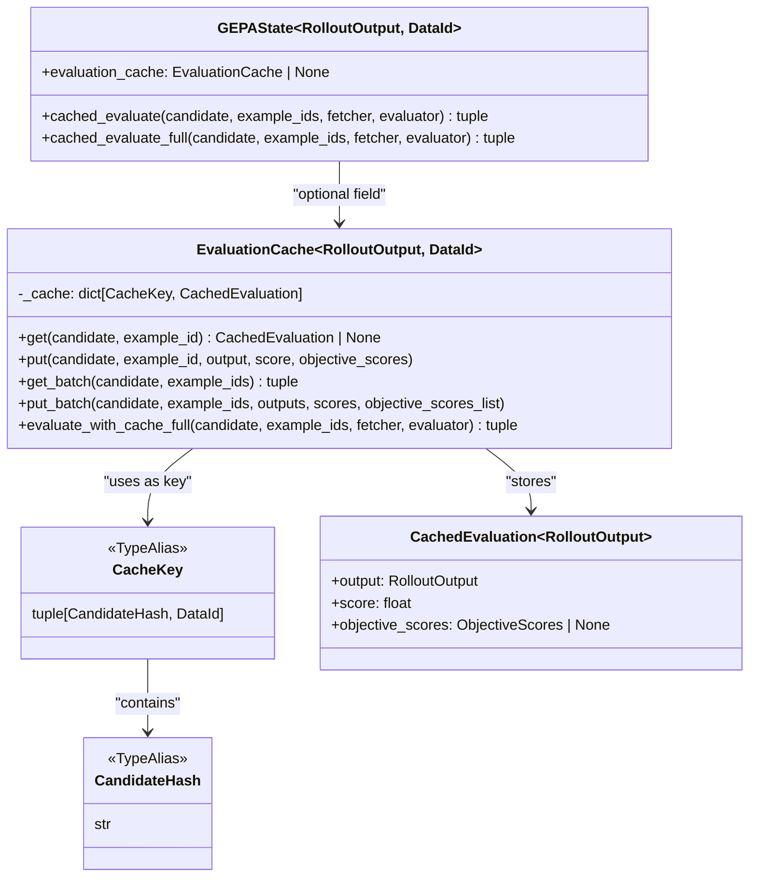
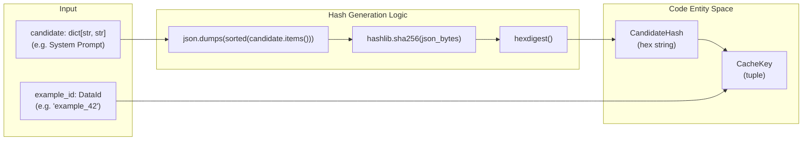
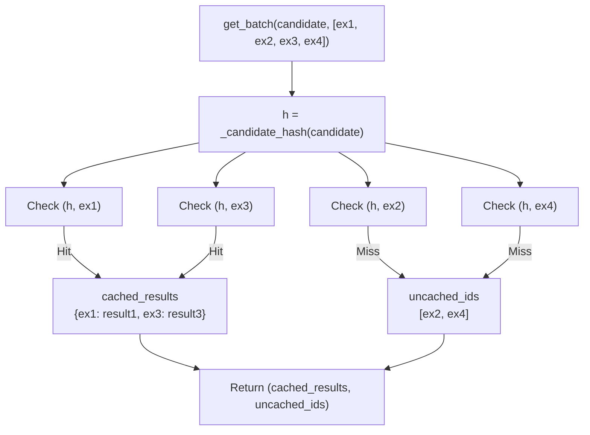
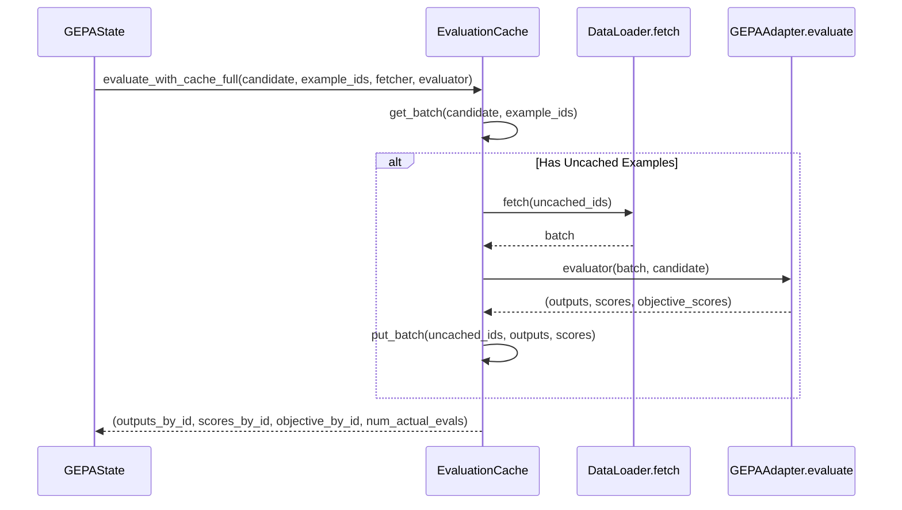
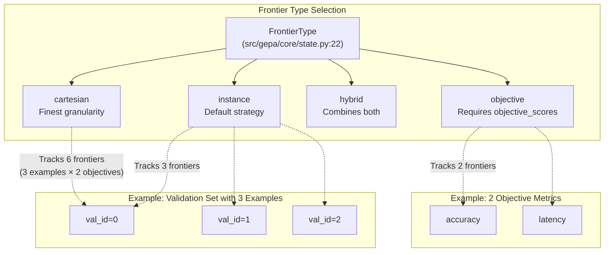
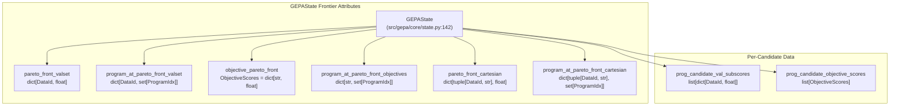
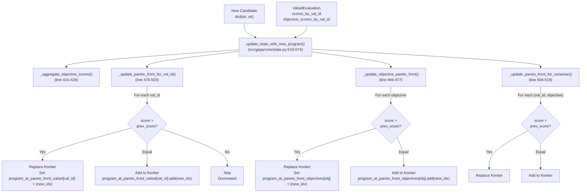
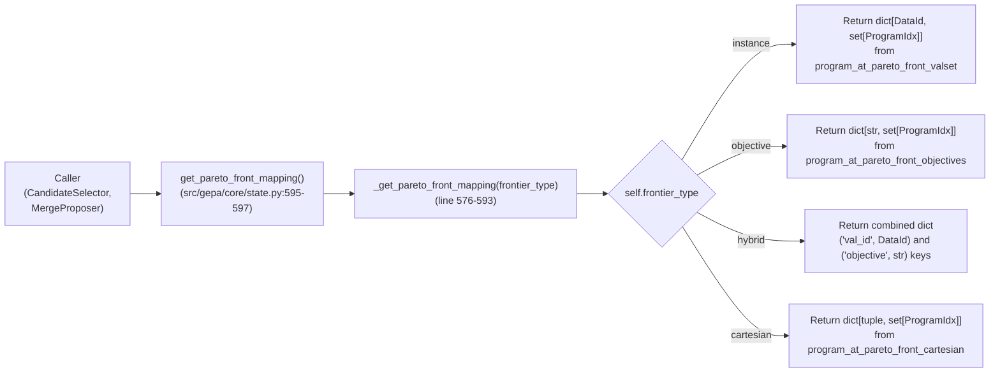
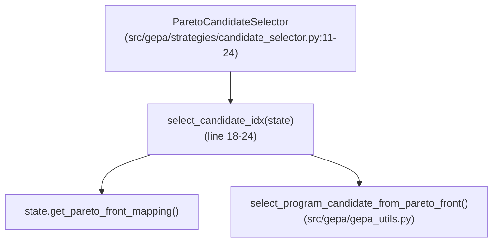
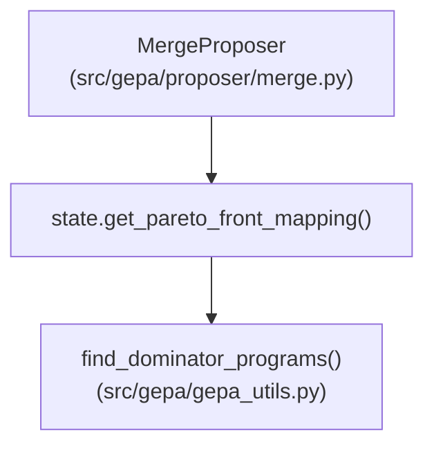

This document describes the evaluation caching system that reduces redundant evaluations by storing and reusing results for previously evaluated (candidate, example) pairs. For information about state management and persistence, see [4.2 State Management and Persistence](). For details on evaluation policies that control when evaluations occur, see [4.6 Evaluation Policies]().

## Purpose and Scope

The evaluation caching system prevents redundant evaluations when the same candidate is evaluated on the same data example multiple times during optimization. This commonly occurs when:

- Multiple proposers evaluate the same candidate on overlapping validation examples.
- The `MergeProposer` evaluates candidates on subsamples that overlap with prior evaluations [src/gepa/proposer/merge.py:340-342]().
- A candidate is re-evaluated after being selected multiple times by different selection strategies.
- Optimization is resumed from a checkpoint and re-encounters previously evaluated combinations [src/gepa/core/state.py:595-613]().

The caching layer is optional and can be enabled via the `cache_evaluation` parameter in `gepa.optimize` [src/gepa/api.py:100-100](). When disabled, all evaluations are executed even if the same (candidate, example) pair was evaluated previously.

**Sources:** [src/gepa/core/state.py:45-131](), [src/gepa/api.py:100-100]()

---

## Cache Architecture

### Core Data Structures

The caching system consists of three primary classes that work together to store and retrieve evaluation results:

**Evaluation Logic to Code Entity Mapping**


**Type Definitions:**

| Type | Definition | Purpose |
|------|------------|---------|
| `CandidateHash` | `str` | SHA256 hash of candidate dictionary [src/gepa/core/state.py:27-27]() |
| `CacheKey` | `tuple[CandidateHash, DataId]` | Unique identifier for cached evaluation [src/gepa/core/state.py:28-28]() |
| `CachedEvaluation` | Dataclass | Stores output, score, and objective scores [src/gepa/core/state.py:36-41]() |
| `EvaluationCache` | Generic class | Main cache container and API [src/gepa/core/state.py:45-131]() |

**Sources:** [src/gepa/core/state.py:27-49]()

---

## Cache Key Generation

The cache uses a two-part composite key to uniquely identify evaluations:

**Natural Language Concept to Code Identifier Flow**


### Hash Function Implementation

The `_candidate_hash` function creates a deterministic hash from a candidate dictionary [src/gepa/core/state.py:31-33]():

```python
def _candidate_hash(candidate: dict[str, str]) -> CandidateHash:
    """Compute a deterministic hash of a candidate dictionary."""
    return hashlib.sha256(json.dumps(sorted(candidate.items())).encode()).hexdigest()
```

**Key Properties:**
- **Deterministic**: Same candidate dict always produces the same hash.
- **Order-independent**: Dictionary iteration order doesn't affect the hash due to `sorted()` [src/gepa/core/state.py:33-33]().
- **Content-based**: Any change to text content produces a different hash.

**Sources:** [src/gepa/core/state.py:31-33]()

---

## Cache Operations

### Basic Get and Put

The `EvaluationCache` provides methods for single and batch operations.

| Method | Parameters | Returns | Purpose |
|--------|-----------|---------|---------|
| `get` | `candidate`, `example_id` | `CachedEvaluation \| None` | Retrieve single cached result [src/gepa/core/state.py:51-56]() |
| `put` | `candidate`, `example_id`, `output`, `score`, `objective_scores` | `None` | Store single evaluation result [src/gepa/core/state.py:58-64]() |
| `get_batch` | `candidate`, `example_ids` | `(cached_results, uncached_ids)` | Batch retrieval with cache hit/miss partitioning [src/gepa/core/state.py:66-81]() |
| `put_batch` | `candidate`, `example_ids`, `outputs`, `scores`, `objective_scores_list` | `None` | Batch storage [src/gepa/core/state.py:83-92]() |

### Batch Caching with Partial Hits

The `get_batch` method efficiently handles scenarios where some examples are cached and others are not [src/gepa/core/state.py:66-81]():



**Sources:** [src/gepa/core/state.py:51-92]()

---

## Integration with Evaluation Flow

### Cache-Aware Evaluation

The `evaluate_with_cache_full` method provides the complete caching logic, coordinating the `DataLoader.fetch` and the `GEPAAdapter.evaluate` calls [src/gepa/core/state.py:94-130]():



The `num_actual_evals` field is critical for tracking metrics budget consumption, as only newly evaluated examples count toward the `max_metric_calls` limit [src/gepa/core/state.py:129-130]().

**Sources:** [src/gepa/core/state.py:94-130]()

---

### GEPAState Integration

The `GEPAState` class provides two convenience methods that delegate to the cache:

1.  `cached_evaluate`: Returns only scores and the count of actual evaluations [src/gepa/core/state.py:530-541]().
2.  `cached_evaluate_full`: Returns all evaluation data including outputs and objective scores [src/gepa/core/state.py:543-556]().

**Sources:** [src/gepa/core/state.py:530-556]()

---

## Performance and Efficiency

### Impact on Optimization

Caching provides significant efficiency gains in several scenarios:

| Scenario | Example | Benefit |
|----------|---------|---------|
| **Merge subsample evaluation** | `MergeProposer` evaluates on 5 examples first [src/gepa/proposer/merge.py:340-342](). | Subsample results are reused during full validation. |
| **Multi-frontier evaluation** | With `frontier_type="hybrid"`, same examples are checked for multiple frontier types [tests/test_pareto_frontier_types/test_pareto_frontier_types.py:45-46](). | Redundant evaluations are skipped. |
| **Repeated selection** | Epsilon-greedy selector picks the same candidate multiple times. | Prior evaluation results are reused instantly. |
| **Resumption** | Optimization resumes from `GEPAState` [src/gepa/core/state.py:595-613](). | Previous run's evaluations are preserved. |

### Configuration

Caching is enabled via `cache_evaluation=True` in the main API [src/gepa/api.py:100-100](). It is tested for correctness across complex tasks like AIME prompt optimization [tests/test_evaluation_cache.py:166-206]().

**Sources:** [src/gepa/api.py:100-100](), [tests/test_evaluation_cache.py:166-206](), [src/gepa/proposer/merge.py:340-342]()

# Pareto Frontier Management


This document describes GEPA's Pareto frontier tracking system, which maintains sets of non-dominated candidates across validation examples and objective metrics. Pareto frontiers enable multi-objective optimization by preserving candidates that excel on different subsets of the evaluation data, allowing GEPA to merge complementary strengths and evolve from diverse starting points.

**Scope:** This page covers frontier types, state representation, update logic, and integration with candidate selection and merge strategies. For information about how candidates are selected from frontiers during optimization, see **4.5 Selection Strategies**. For details on how frontiers guide the merge process, see **4.4.2 Merge Proposer**.

---

## Frontier Types

GEPA supports four frontier tracking strategies, controlled by the `frontier_type` parameter. Each strategy defines a different notion of Pareto dominance.

**Type Alias:** `FrontierType = Literal["instance", "objective", "hybrid", "cartesian"]` [src/gepa/core/state.py:22-22]()

| Frontier Type | Dominance Criterion | Use Case |
|---------------|---------------------|----------|
| `"instance"` | Per validation example — tracks best score for each `DataId` | Default; preserves candidates excelling on different examples |
| `"objective"` | Per objective metric — tracks best score for each named objective | Multi-objective optimization with explicit objectives (e.g., accuracy, latency) |
| `"hybrid"` | Union of instance and objective frontiers | Simultaneously track per-example and per-objective dominance |
| `"cartesian"` | Per (example, objective) pair — tracks best score for each `(DataId, objective)` | Fine-grained tracking when both dimensions matter |

### Frontier Logic Mapping

Title: Frontier Type Selection to Code Entities


**Sources:** [src/gepa/core/state.py:22-23](), [src/gepa/api.py:53-55](), [src/gepa/core/state.py:162-167]()

---

## State Representation

The `GEPAState` class maintains separate data structures for each frontier type. All four frontiers are stored regardless of the active `frontier_type`, but only the active frontier is updated during optimization.

### Core Data Structures

Title: GEPAState Frontier Attributes


**Instance Frontier:**
- `pareto_front_valset: dict[DataId, float]` — best score achieved on each validation example [src/gepa/core/state.py:162-162]()
- `program_at_pareto_front_valset: dict[DataId, set[ProgramIdx]]` — set of candidates achieving that score [src/gepa/core/state.py:163-163]()

**Objective Frontier:**
- `objective_pareto_front: dict[str, float]` — best score for each objective metric [src/gepa/core/state.py:164-164]()
- `program_at_pareto_front_objectives: dict[str, set[ProgramIdx]]` — set of candidates achieving that objective score [src/gepa/core/state.py:165-165]()

**Cartesian Frontier:**
- `pareto_front_cartesian: dict[tuple[DataId, str], float]` — best score for each (example, objective) pair [src/gepa/core/state.py:166-166]()
- `program_at_pareto_front_cartesian: dict[tuple[DataId, str], set[ProgramIdx]]` — set of candidates achieving that score [src/gepa/core/state.py:167-167]()

**Sources:** [src/gepa/core/state.py:142-171]()

---

## Frontier Update Logic

Frontiers are updated whenever a new candidate is added via `update_state_with_new_program()`. The method delegates to specialized update functions based on the active `frontier_type`. [src/gepa/core/state.py:519-574]()

### Update Flow

Title: Frontier Update Mechanism


### Update Implementation Details

**Instance Frontier Update:** [src/gepa/core/state.py:478-503]()
```python
def _update_pareto_front_for_val_id(self, val_id, score, program_idx, output, run_dir, iteration):
    prev_score = self.pareto_front_valset.get(val_id, float("-inf"))
    if score > prev_score:
        self.pareto_front_valset[val_id] = score
        self.program_at_pareto_front_valset[val_id] = {program_idx}  # Replace
    elif score == prev_score:
        self.program_at_pareto_front_valset[val_id].add(program_idx)  # Add
```

**Objective Frontier Update:** [src/gepa/core/state.py:466-477]()
```python
def _update_objective_pareto_front(self, objective_scores, program_idx):
    for objective, score in objective_scores.items():
        prev_score = self.objective_pareto_front.get(objective, float("-inf"))
        if score > prev_score:
            self.objective_pareto_front[objective] = score
            self.program_at_pareto_front_objectives[objective] = {program_idx}
        elif score == prev_score:
            self.program_at_pareto_front_objectives[objective].add(program_idx)
```

**Sources:** [src/gepa/core/state.py:466-574]()

---

## Frontier Access and Retrieval

The `get_pareto_front_mapping()` method provides a unified interface for retrieving the active frontier, abstracting over the storage layouts. [src/gepa/core/state.py:595-597]()

### Access Pattern

Title: Unified Frontier Access


**Sources:** [src/gepa/core/state.py:576-597](), [src/gepa/core/state.py:24-25]()

---

## Integration with Candidate Selection

Candidate selectors use Pareto frontiers to choose which candidate to evolve from. The `ParetoCandidateSelector` samples from frontier programs, weighted by their aggregate scores. [src/gepa/strategies/candidate_selector.py:11-24]()

### Selection Flow

Title: Pareto Selection Logic


**Sources:** [src/gepa/strategies/candidate_selector.py:11-83](), [src/gepa/core/state.py:595-597]()

---

## Integration with Merge Strategy

The `MergeProposer` uses Pareto frontiers to identify "dominator programs" — candidates that appear on multiple frontier keys, indicating they excel across diverse examples or objectives. [src/gepa/proposer/merge.py:17-18]()

### Merge Candidate Identification

Title: Merge Proposer Frontier Integration


**Sources:** [src/gepa/proposer/merge.py:17-18](), [src/gepa/core/state.py:595-597]()

---

## Configuration and Initialization

### API Configuration

The `frontier_type` is configured in `gepa.optimize()`: [src/gepa/api.py:55-55]()

```python
gepa.optimize(
    ...,
    frontier_type="instance",  # "objective", "hybrid", "cartesian"
)
```

### Initialization Logic

Frontiers are initialized with the seed candidate during `initialize_gepa_state`: [src/gepa/core/state.py:194-232]()

- **Instance frontier:** Seed dominates all examples it evaluated. [src/gepa/core/state.py:198-202]()
- **Objective frontier:** Seed sets initial objective scores. [src/gepa/core/state.py:204-209]()
- **Cartesian frontier:** Initialized if `frontier_type == "cartesian"`. [src/gepa/core/state.py:212-218]()

**Sources:** [src/gepa/api.py:55-55](), [src/gepa/core/state.py:194-232]()