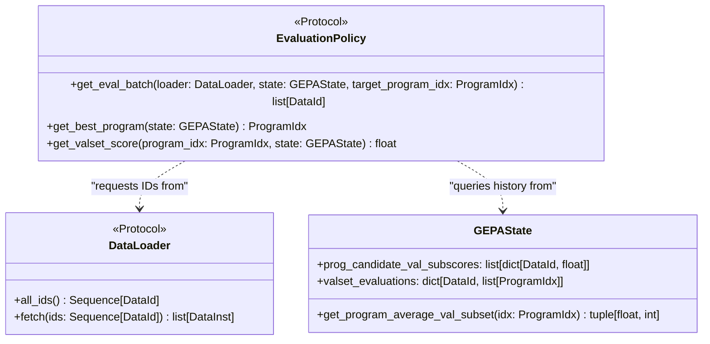
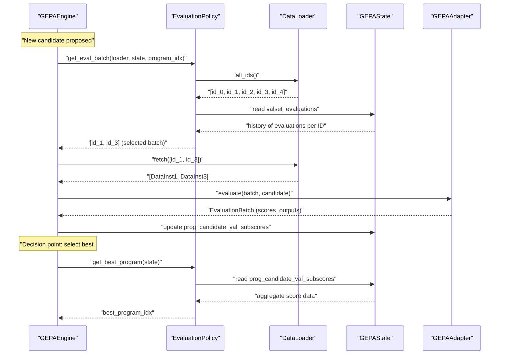
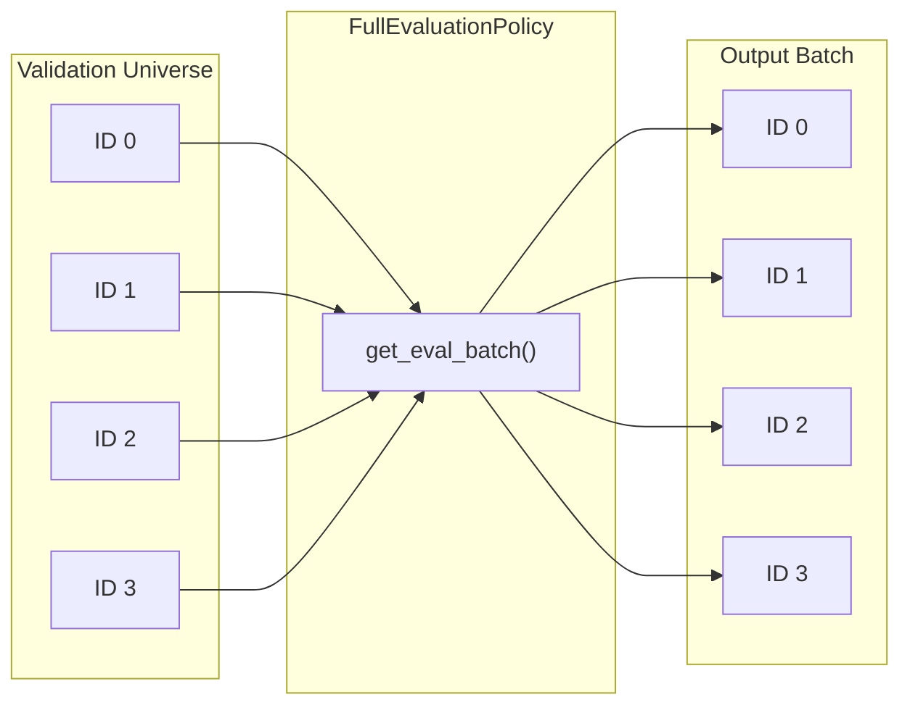
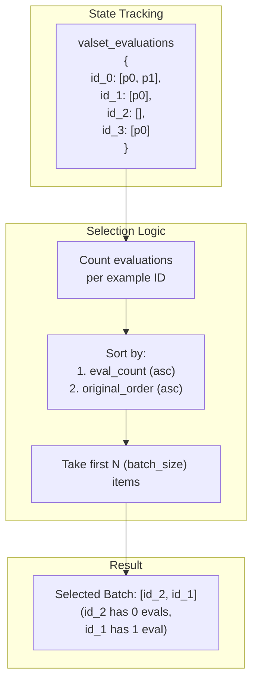
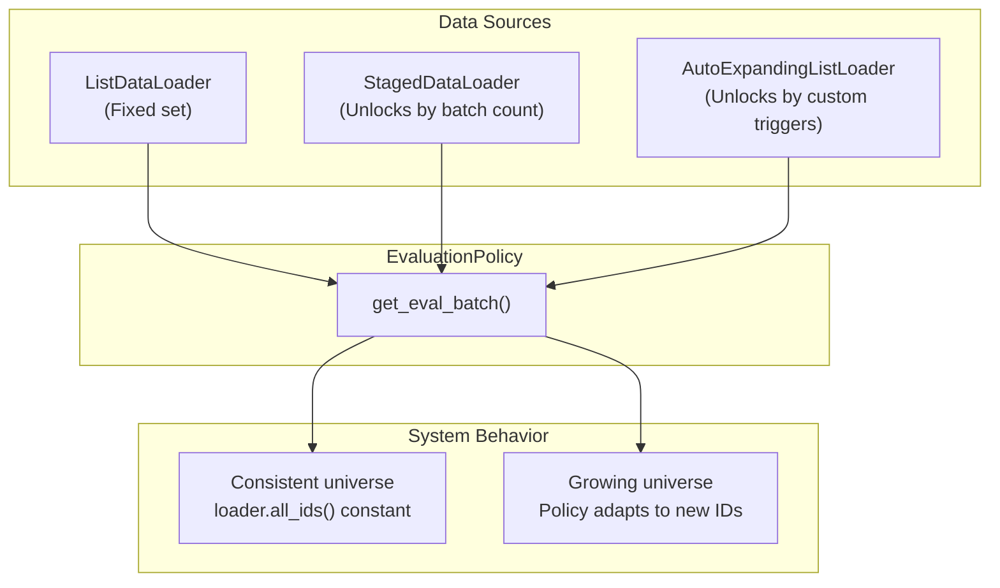

## Purpose and Scope

This document covers the evaluation policy system in GEPA, which controls how validation examples are selected for evaluating candidate programs during optimization. Evaluation policies determine which subset of the validation set to use for each candidate's evaluation, enabling both full validation and efficient sampling strategies. This is a core component of the optimization loop architecture.

For information about the data structures that evaluation policies operate on, see [State Management and Persistence](#4.2). For information about the caching mechanism that avoids redundant evaluations, see [Evaluation Caching](#4.7). For broader context on data loading, see [Stopping Conditions](#3.5).

**Sources:** [src/gepa/strategies/eval_policy.py:1-65](), [src/gepa/core/data_loader.py:1-75]()

---

## Overview

Evaluation policies control **which validation examples to evaluate for each candidate program** during GEPA's optimization loop. This is crucial for two reasons:

1. **Budget efficiency**: Evaluating on a subset of validation examples reduces compute cost while still providing meaningful signal.
2. **Dynamic validation sets**: Policies can adapt to validation sets that grow during optimization (e.g., as new edge cases are discovered or staged).

The evaluation policy is decoupled from both the adapter (which performs actual evaluation) and the state (which tracks results), making it easy to plug in different strategies without changing other components.

**Sources:** [src/gepa/strategies/eval_policy.py:1-14](), [tests/test_incremental_eval_policy.py:54-100]()

---

## The EvaluationPolicy Protocol

The `EvaluationPolicy` protocol defines three core methods that any evaluation policy must implement:

Title: Evaluation Policy Interface and Dependencies


### Method Responsibilities

| Method | Purpose | Returns |
|--------|---------|---------|
| `get_eval_batch` | Select which validation examples to evaluate for a candidate | List of validation example IDs (`DataId`) |
| `get_best_program` | Identify the best performing candidate across all evaluations recorded in state | Program index (`ProgramIdx`) |
| `get_valset_score` | Compute a scalar score for a specific program on the validation set | Float score |

**Sources:** [src/gepa/strategies/eval_policy.py:12-32](), [src/gepa/core/data_loader.py:27-41]()

---

## Evaluation Policy Workflow

The following diagram shows how an evaluation policy integrates into GEPA's optimization loop managed by the engine:

Title: Evaluation Selection and State Update Flow


**Sources:** [src/gepa/strategies/eval_policy.py:16-31](), [tests/test_incremental_eval_policy.py:32-43](), [src/gepa/core/data_loader.py:34-36]()

---

## Built-in Evaluation Policies

### FullEvaluationPolicy

The `FullEvaluationPolicy` evaluates every candidate on the complete validation set. This provides the most accurate assessment but can be computationally expensive for large validation sets.

Title: Full Evaluation Selection Logic


**Implementation Details:**
- `get_eval_batch`: Returns all IDs from `loader.all_ids()`. [src/gepa/strategies/eval_policy.py:37-41]()
- `get_best_program`: Selects the program with the highest average score across its evaluated examples. [src/gepa/strategies/eval_policy.py:43-53]()
- **Tie-breaking**: If averages are equal, it prefers the program with higher "coverage" (more evaluated examples). [src/gepa/strategies/eval_policy.py:49-52]()

**Sources:** [src/gepa/strategies/eval_policy.py:34-58]()

---

### RoundRobinSampleEvaluationPolicy

The `RoundRobinSampleEvaluationPolicy` implements an incremental evaluation strategy that prioritizes validation examples that have been evaluated least frequently. This ensures all examples eventually get coverage while minimizing redundant evaluations per candidate.

Title: Incremental Round-Robin Selection Logic


**Key Features:**
- **Adaptive sampling**: Focuses on under-evaluated examples to build a balanced validation signal across the frontier. [tests/test_incremental_eval_policy.py:76-80]()
- **Configurable batch size**: `batch_size` parameter controls how many examples to evaluate per iteration. [tests/test_incremental_eval_policy.py:57-60]()
- **Stable ordering**: Uses original position in `loader.all_ids()` as a tie-breaker for deterministic behavior. [tests/test_incremental_eval_policy.py:73-80]()
- **Dynamic valset support**: Automatically incorporates new examples as they become available in the loader. [tests/test_incremental_eval_policy.py:102-140]()

**Sources:** [tests/test_incremental_eval_policy.py:54-100]()

---

## Interaction with Data Loaders

Evaluation policies work with `DataLoader` implementations, including those that dynamically expand during optimization like `StagedDataLoader` or `AutoExpandingListLoader`.

Title: Policy Interaction with Dynamic Data Loaders


### Example: Dynamic Valset Handling
When using `StagedDataLoader`, the `all_ids()` method returns a growing list as stages are unlocked. The `RoundRobinSampleEvaluationPolicy` will naturally pick up these new IDs because their evaluation count in `state.valset_evaluations` starts at zero.

**Sources:** [src/gepa/core/data_loader.py:50-67](), [tests/test_data_loader.py:7-57](), [tests/test_incremental_eval_policy.py:8-22]()

---

## Custom Evaluation Policy Implementation

You can implement custom evaluation policies by adhering to the `EvaluationPolicy` protocol.

### Example: Backfill Validation Policy
This strategy prioritizes evaluating examples that haven't been seen by *any* program yet, then falls back to a random sample.

```python
class BackfillValidationPolicy(EvaluationPolicy):
    def get_eval_batch(self, loader, state, target_program_idx=None) -> list[DataId]:
        all_ids = set(loader.all_ids())
        # Find validation examples not yet evaluated by any program
        missing_ids = all_ids.difference(state.valset_evaluations.keys())
        if missing_ids:
            return sorted(list(missing_ids))[:5]
        # Fallback to first 5
        return list(all_ids)[:5]
    
    def get_best_program(self, state: GEPAState) -> ProgramIdx:
        # Custom logic to define "best"
        # state.get_program_average_val_subset(idx) returns (avg_score, coverage)
        best_idx, best_score = -1, float("-inf")
        for i in range(len(state.program_candidates)):
            score, _ = state.get_program_average_val_subset(i)
            if score > best_score:
                best_score = score
                best_idx = i
        return best_idx
    
    def get_valset_score(self, program_idx: ProgramIdx, state: GEPAState) -> float:
        return state.get_program_average_val_subset(program_idx)[0]
```

**Sources:** [src/gepa/strategies/eval_policy.py:12-32](), [src/gepa/core/data_loader.py:27-41](), [src/gepa/core/state.py:142-176]()

---

## State Integration

Evaluation policies are consumers of `GEPAState`. They use recorded history to determine future actions.

| State Attribute | Policy Usage |
|-----------------|--------------|
| `prog_candidate_val_subscores` | Used in `get_best_program` and `get_valset_score` to aggregate performance. [src/gepa/strategies/eval_policy.py:46-48]() |
| `valset_evaluations` | Used in `get_eval_batch` to determine which examples need more data. [tests/test_incremental_eval_policy.py:74-77]() |
| `get_program_average_val_subset` | Helper to get mean scores for a specific program. [src/gepa/strategies/eval_policy.py:57]() |

**Sources:** [src/gepa/strategies/eval_policy.py:43-58](), [tests/test_incremental_eval_policy.py:85-100]()

---

## Policy Selection Matrix

| Policy | Use Case | Advantage | Disadvantage |
|--------|----------|-----------|--------------|
| `FullEvaluationPolicy` | Small, static validation sets. | Maximum signal accuracy. | High cost for large sets. |
| `RoundRobinSampleEvaluationPolicy` | Large or dynamic validation sets. | Efficient budget usage; guaranteed coverage. | Noisier signal per iteration. |
| Custom Policy | Multi-stage or domain-specific logic. | Fully optimized for specific workflows. | Requires manual implementation. |

**Sources:** [src/gepa/strategies/eval_policy.py:34-58](), [tests/test_incremental_eval_policy.py:54-100]()