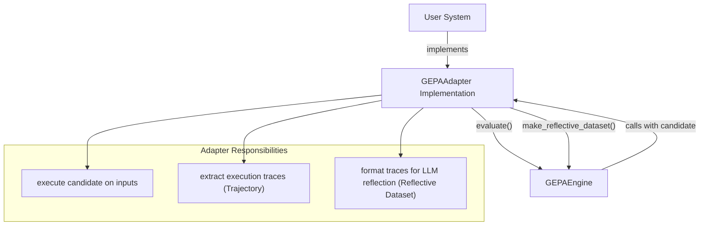
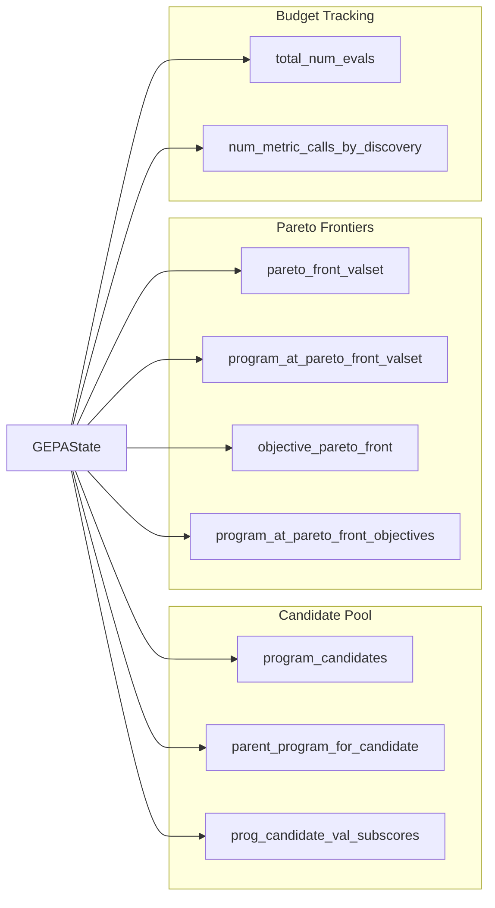
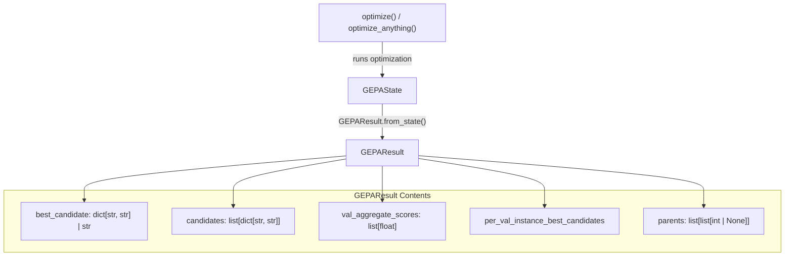
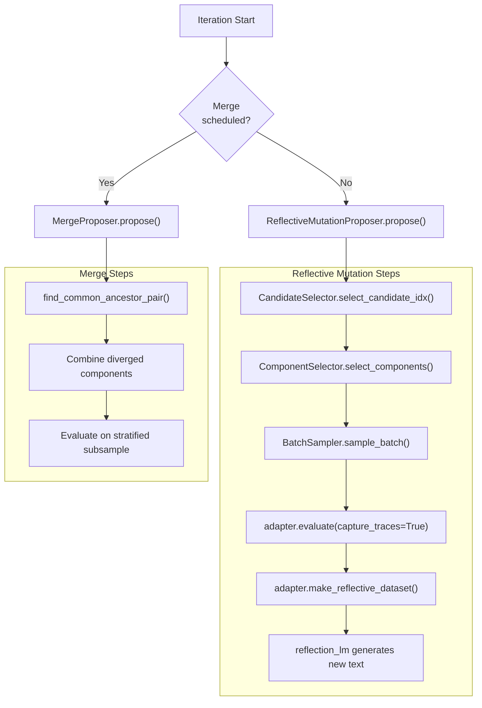
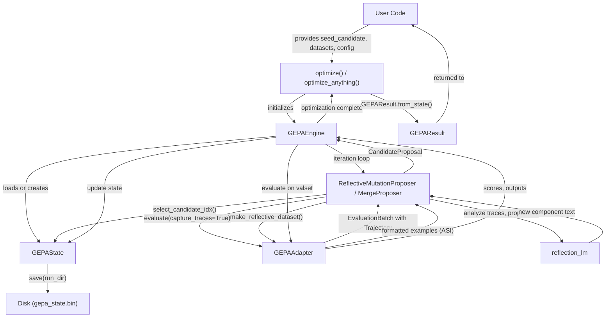
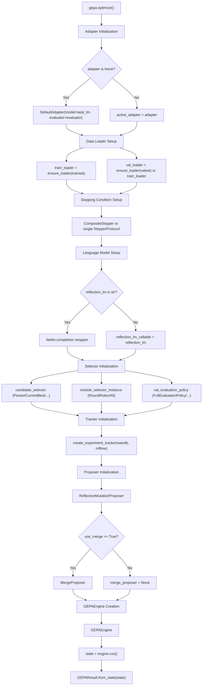
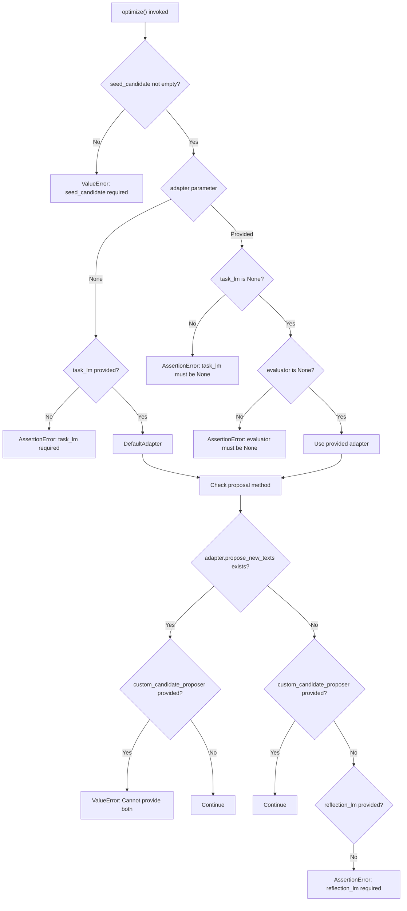
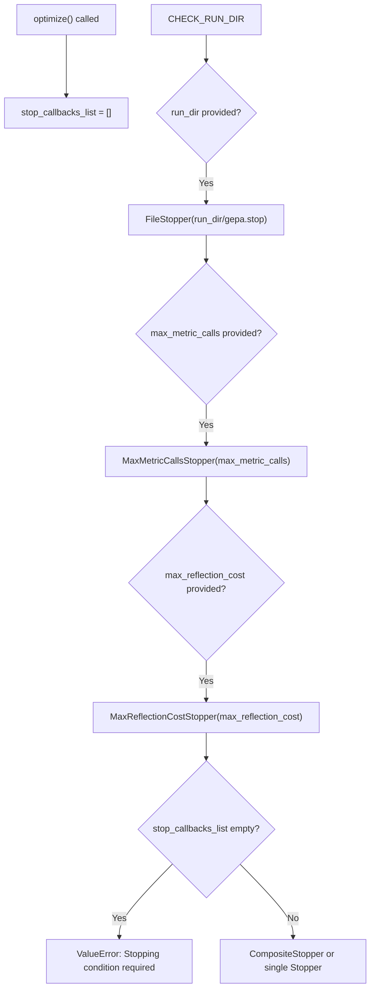
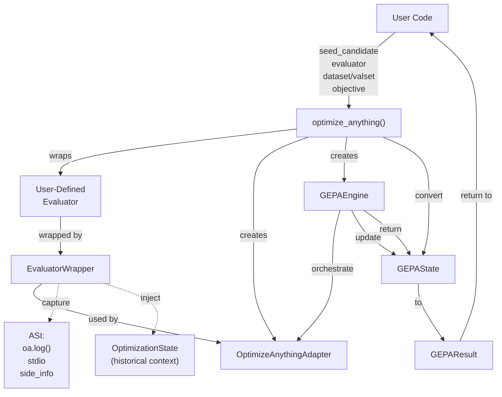
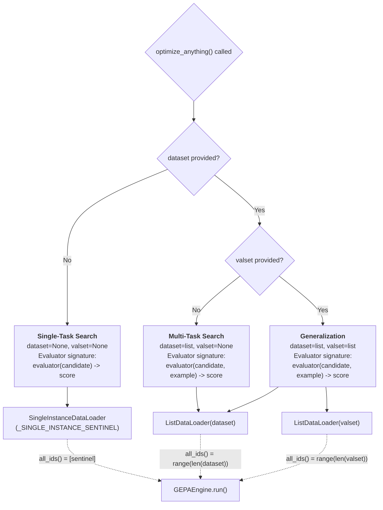

seed_candidate = {
    "system_prompt": "You are a helpful assistant...",
    "query_rewriter": "Reformulate the query to be more specific..."
}
```

**Component** refers to an individual named text parameter within a candidate (e.g., `"system_prompt"`). The `seed_candidate` provided by the user defines the initial components and their starting values. In "seedless mode" via `optimize_anything`, GEPA can bootstrap the initial candidate from a natural language objective.

**Sources:** [src/gepa/api.py:44-44](), [src/gepa/api.py:103-105](), [README.md:102-105]()

For detailed information about candidate structure and component handling, see [Candidates and Text Components](#3.4).

---

### Adapters: The Integration Interface

The `GEPAAdapter` protocol defines how GEPA connects to arbitrary systems. Adapters implement two required methods:

| Method | Purpose | Returns |
|--------|---------|---------|
| `evaluate(batch, candidate, capture_traces)` | Execute candidate on input batch | `EvaluationBatch` with scores, outputs, and optional trajectories |
| `make_reflective_dataset(candidate, eval_batch, components)` | Transform execution traces into LLM-readable feedback | `dict[component_name, list[examples]]` |



**Diagram: GEPAAdapter Protocol Interface**

**Sources:** [src/gepa/core/adapter.py:11-40](), [src/gepa/api.py:113-124]()

See [Adapters and System Integration](#3.3) for implementation details and built-in adapter examples.

---

### State: Persistent Optimization History

`GEPAState` maintains the complete optimization history and is automatically persisted to disk when `run_dir` is specified. Key state components:

| State Component | Type | Purpose |
|----------------|------|---------|
| `program_candidates` | `list[dict[str, str]]` | All explored candidates |
| `parent_program_for_candidate` | `list[list[int \| None]]` | Lineage tracking |
| `prog_candidate_val_subscores` | `list[dict[DataId, float]]` | Per-example scores |
| `pareto_front_valset` | `dict[DataId, float]` | Best score per validation example |
| `total_num_evals` | `int` | Cumulative metric call count |



**Diagram: GEPAState Structure**

The state implements persistence, enabling GEPA to resume optimization from a directory:

```python
# Resumption from disk happens automatically via engine initialization
result = gepa.optimize(
    run_dir="./optimization_run",  # Resumes if directory exists
    seed_candidate=seed,
    ...
)
```

**Sources:** [src/gepa/core/state.py:142-200](), [src/gepa/core/engine.py:135-153]()

See [State Management and Persistence](#4.2) for details on state evolution and migration.

---

### Results: Immutable Optimization Snapshot

`GEPAResult` is the immutable object returned by `optimize()` and `optimize_anything()`, containing the best found candidate and full lineage information.



**Diagram: GEPAResult Structure**

**Sources:** [src/gepa/core/result.py:15-50](), [src/gepa/api.py:96-96]()

See [Results and Lineage Tracking](#4.3) for details on analyzing optimization results.

---

## The Optimization Loop

At each iteration, `GEPAEngine` coordinates three main steps:

### 1. Proposal Generation

Two proposer mechanisms generate new candidates:

**Reflective Mutation** (`ReflectiveMutationProposer`):
1. Select candidate from pool via `CandidateSelector` (e.g., Pareto selection).
2. Select component(s) to modify via `ReflectionComponentSelector`.
3. Sample minibatch via `BatchSampler`.
4. Execute candidate and capture trajectories.
5. Build reflective dataset (ASI) via adapter.
6. `reflection_lm` analyzes ASI and proposes new component text.

**Merge** (`MergeProposer`):
1. Find two Pareto-optimal candidates with a common ancestor.
2. Combine components where descendants diverged.
3. Evaluate on a stratified subsample to ensure the merge is effective.



**Diagram: Proposal Generation Paths**

**Sources:** [src/gepa/core/engine.py:429-588](), [src/gepa/proposer/reflective_mutation/reflective_mutation.py:66-120](), [src/gepa/proposer/merge.py:128-180]()

See [Proposer System](#4.4) for detailed proposer architecture.

### 2. Subsample Acceptance

New candidates must improve on their training subsample before full validation:
- **Reflective mutation**: Uses `AcceptanceCriterion` (default: `StrictImprovementAcceptance`).
- **Merge**: Evaluated against the performance of both parents to ensure hybrid improvement.

**Sources:** [src/gepa/core/engine.py:124-128](), [src/gepa/strategies/acceptance.py:1-40]()

### 3. Full Validation and Pareto Update

Accepted candidates undergo full validation evaluation:
1. Evaluate on validation set (controlled by `EvaluationPolicy`).
2. Update Pareto frontier(s) based on `frontier_type`.
3. Persist updated state to disk via `GEPAState.save()`.

**Sources:** [src/gepa/core/engine.py:154-174](), [src/gepa/core/state.py:220-250]()

---

## Strategic Configuration Points

GEPA's behavior is controlled by pluggable strategy objects:

### Candidate Selection
Controls which candidate to evolve from the pool.
- `ParetoCandidateSelector`: Sample uniformly from the Pareto front.
- `CurrentBestCandidateSelector`: Always select the highest-scoring candidate.

**Sources:** [src/gepa/strategies/candidate_selector.py:1-50](), [src/gepa/api.py:53-54]()

### Component Selection
Controls which component(s) to modify in a candidate.
- `RoundRobinReflectionComponentSelector`: Cycle through components.
- `AllReflectionComponentSelector`: Modify all components at once.

**Sources:** [src/gepa/strategies/component_selector.py:1-30](), [src/gepa/api.py:63-63]()

### Batch Sampling
Controls training data selection for the reflection step.
- `EpochShuffledBatchSampler`: Shuffles and batches examples into epochs.

**Sources:** [src/gepa/strategies/batch_sampler.py:1-20](), [src/gepa/api.py:57-57]()

### Frontier Type
Controls Pareto frontier tracking strategy.
- `"instance"`: Tracks best performance per validation example.
- `"objective"`: Tracks Pareto front across multiple competing objectives (e.g., accuracy vs. latency).

**Sources:** [src/gepa/core/state.py:22-23](), [src/gepa/api.py:55-55]()

### Stopping Conditions
Controls when optimization terminates. Multiple stoppers can be combined via `CompositeStopper`.

| Stopper | Termination Condition |
|---------|-----------------------|
| `MaxMetricCallsStopper` | Cumulative metric calls reach a limit |
| `MaxReflectionCostStopper` | Total USD cost of reflection LM calls reaches a budget |
| `TimeoutStopCondition` | Specified time elapsed |
| `ScoreThresholdStopper` | Validation score reaches a target |

**Sources:** [src/gepa/utils/stop_condition.py:34-210](), [src/gepa/api.py:69-71]()

See [Stopping Conditions](#3.5) for complete documentation.

---

## Data Flow Through the System



**Diagram: End-to-End Data Flow**

**Sources:** [src/gepa/api.py:42-407](), [src/gepa/core/engine.py:429-653](), [src/gepa/optimize_anything.py:53-131]()

---

## Evaluation and Caching

### Evaluation Batches
Adapters return `EvaluationBatch` objects containing outputs, scores, and trajectories. This structured output allows GEPA to handle multi-objective scores and complex execution traces.

### Evaluation Caching
When `cache_evaluation=True`, GEPA uses `EvaluationCache` to memoize `(candidate, example_id)` pairs, significantly reducing costs for validation steps.

**Sources:** [src/gepa/core/state.py:45-131](), [src/gepa/api.py:89-89]()

See [Evaluation Caching](#4.7) for implementation details.

---

## Configuration Hierarchy

GEPA uses a structured configuration system to manage complexity. In `optimize_anything`, this is exposed via `GEPAConfig`, which nests `EngineConfig`, `ReflectionConfig`, and others.

**Sources:** [src/gepa/optimize_anything.py:124-130](), [src/gepa/api.py:43-96]()

See [Configuration System](#3.8) for detailed parameter documentation.

# The optimize Function


This document covers the `gepa.optimize` function, which serves as the main API entry point for the GEPA framework. The `optimize` function orchestrates the entire evolutionary optimization process, from initialization to result generation.

For information about the internal optimization engine mechanics, see [Optimization Engine](4.1). For details about adapter implementation requirements, see [GEPAAdapter Interface](5.1). For specific optimization strategies and component selection, see [Optimization Strategies](3.3).

## Purpose and Scope

The `optimize` function provides a high-level interface that configures and executes GEPA's evolutionary text optimization algorithm. It handles parameter validation, component initialization, and orchestration of the optimization loop while abstracting away the internal complexity from end users.

**Sources:** [src/gepa/api.py:43-132]()

## Function Signature and Parameters

The `optimize` function accepts a comprehensive set of parameters organized into logical groups:

| Parameter Group | Key Parameters | Description |
|---|---|---|
| **Core Requirements** | `seed_candidate`, `trainset`, `valset` | Initial candidate (`dict[str, str]`) and training/validation datasets (lists or `DataLoader` instances). [src/gepa/api.py:44-46]() |
| **System Integration** | `adapter`, `task_lm`, `evaluator` | `GEPAAdapter` instance or `task_lm` string for `DefaultAdapter`. Optional custom `Evaluator`. [src/gepa/api.py:47-49]() |
| **Reflection Configuration** | `reflection_lm`, `candidate_selection_strategy`, `frontier_type`, `reflection_minibatch_size` | LLM for reflection, selection strategy (`"pareto"`, `"current_best"`, etc.), frontier strategy (`"instance"`, `"objective"`, etc.), minibatch size. [src/gepa/api.py:51-58]() |
| **Component Selection** | `module_selector`, `reflection_prompt_template`, `custom_candidate_proposer` | Component selector (`"round_robin"`, `"all"`), optional custom prompt templates, optional custom proposal function. [src/gepa/api.py:60-63]() |
| **Merge Strategy** | `use_merge`, `max_merge_invocations`, `merge_val_overlap_floor` | Enable merge (`bool`), max merge attempts, minimum validation overlap. [src/gepa/api.py:65-67]() |
| **Budget & Stopping** | `max_metric_calls`, `max_reflection_cost`, `stop_callbacks`, `perfect_score`, `skip_perfect_score` | Maximum evaluation calls, reflection cost budget, custom stoppers, perfect score threshold. [src/gepa/api.py:59-71]() |
| **Evaluation** | `val_evaluation_policy`, `cache_evaluation`, `batch_sampler`, `acceptance_criterion` | Validation policy, enable caching (`bool`), batch sampling strategy, acceptance logic. [src/gepa/api.py:89-95]() |
| **Logging & Callbacks** | `logger`, `run_dir`, `callbacks`, `use_wandb`, `use_mlflow`, `track_best_outputs`, `display_progress_bar` | Logger instance, save directory, callback list, experiment trackers, output tracking, progress display. [src/gepa/api.py:73-86]() |
| **Reproducibility** | `seed`, `raise_on_exception`, `use_cloudpickle` | Random seed, exception handling mode, use cloudpickle for serialization. [src/gepa/api.py:91-92]() |

**Sources:** [src/gepa/api.py:43-96]()

## Component Initialization and Orchestration

The `optimize` function serves as a factory that instantiates and wires together the core GEPA components. It creates the `GEPAEngine` which manages the optimization loop [src/gepa/core/engine.py:51-54]().

### GEPA Component Initialization Flow



**Sources:** [src/gepa/api.py:180-408](), [src/gepa/core/engine.py:54-134]()

## Parameter Validation and Default Handling

The function performs several validation checks and applies defaults:

### Adapter Configuration Logic



This validation ensures that:
1. A non-empty `seed_candidate` is provided.
2. Either `adapter` OR `task_lm` is specified, but not both.
3. When using a custom adapter, `task_lm` and `evaluator` must be `None`.
4. Either the adapter provides `propose_new_texts`, OR `custom_candidate_proposer` is provided, OR `reflection_lm` is specified.

**Sources:** [src/gepa/api.py:176-252]()

## Data Loader Normalization

The function normalizes dataset inputs to `DataLoader` instances using `ensure_loader` [src/gepa/core/data_loader.py:18-18]():

```python
train_loader = ensure_loader(trainset)
val_loader = ensure_loader(valset) if valset is not None else train_loader
```

**Sources:** [src/gepa/api.py:198-199]()

## Stopping Conditions Construction

The function constructs a composite stopping condition from multiple sources:



The function requires at least one stopping condition. Multiple stoppers are combined using `CompositeStopper`.

**Sources:** [src/gepa/api.py:201-236]()

## Strategy Configuration Patterns

The function supports flexible strategy configuration through string-based selectors:

### Strategy Mapping

| Category | String Value | Implementation Class |
|---|---|---|
| **Component Selector** | `"round_robin"` | `RoundRobinReflectionComponentSelector` [src/gepa/strategies/component_selector.py:35-37]() |
| **Component Selector** | `"all"` | `AllReflectionComponentSelector` [src/gepa/strategies/component_selector.py:35-37]() |
| **Candidate Selector** | `"pareto"` | `ParetoCandidateSelector` [src/gepa/strategies/candidate_selector.py:32-32]() |
| **Candidate Selector** | `"current_best"` | `CurrentBestCandidateSelector` [src/gepa/strategies/candidate_selector.py:30-30]() |
| **Batch Sampler** | `"epoch_shuffled"` | `EpochShuffledBatchSampler` [src/gepa/strategies/batch_sampler.py:28-28]() |

**Sources:** [src/gepa/api.py:278-326]()

## Return Value and Result Generation

The function returns a `GEPAResult` object constructed from the final `GEPAState` produced by the engine [src/gepa/core/result.py:20-20](). This result contains the best candidate found, performance metrics, and lineage tracking.

**Sources:** [src/gepa/api.py:407-408]()

# The optimize_anything API


## Purpose and Scope

The `optimize_anything` API is GEPA's universal interface for optimizing arbitrary text artifacts: code, prompts, agent architectures, configurations, vector graphics, scheduling policies, and any other text-representable parameter [src/gepa/optimize_anything.py:1-15](). Unlike the standard `gepa.optimize()` function which is designed specifically for LLM prompt optimization with DSPy integration, `optimize_anything` provides a declarative API that abstracts over three distinct optimization paradigms and works with any domain where quality can be measured [src/gepa/optimize_anything.py:22-26]().

The key insight is that many problems can be formulated as text optimization: speeding up a CUDA kernel, tuning a scheduling policy, or redesigning an agent architecture [src/gepa/optimize_anything.py:10-14]().

---

## Core API Components

The `optimize_anything` API revolves around three user-facing concepts: **candidates** (text parameters to optimize), **evaluators** (functions that score candidates), and **ASI** (diagnostic feedback that guides LLM reflection) [src/gepa/optimize_anything.py:77-95]().



**API Entry Point Flow**
Sources: [src/gepa/optimize_anything.py:153-406](), [src/gepa/adapters/optimize_anything_adapter/optimize_anything_adapter.py:233-296]()

---

## API Signature

The `optimize_anything` function is defined in `src/gepa/optimize_anything.py` and provides a unified interface for all three optimization modes:

```python
def optimize_anything(
    seed_candidate: str | dict[str, str] | None = None,
    evaluator: Evaluator,
    dataset: list | None = None,
    valset: list | None = None,
    objective: str | None = None,
    background: str | None = None,
    config: GEPAConfig | None = None,
) -> GEPAResult
```

| Parameter | Type | Description |
|-----------|------|-------------|
| `seed_candidate` | `str \| dict[str, str] \| None` | Initial artifact to optimize. `None` triggers seedless mode where the LLM generates the first candidate from `objective` [src/gepa/optimize_anything.py:44-49](). |
| `evaluator` | `Evaluator` | Function that scores candidates: `(candidate, example?, **kwargs) -> float \| tuple[float, SideInfo]` [src/gepa/optimize_anything.py:171-230](). |
| `dataset` | `list \| None` | Training examples for multi-task search or generalization modes [src/gepa/optimize_anything.py:31-42](). |
| `valset` | `list \| None` | Validation examples (enables generalization mode when provided) [src/gepa/optimize_anything.py:38-42](). |
| `objective` | `str \| None` | Natural language description of optimization goal (required for seedless mode) [src/gepa/optimize_anything.py:93-95](). |
| `background` | `str \| None` | Domain knowledge, constraints, and context for the reflection LLM [src/gepa/optimize_anything.py:93-95](). |
| `config` | `GEPAConfig \| None` | Engine, reflection, tracking, merge, and refiner configuration [src/gepa/optimize_anything.py:654-811](). |

**Return Value**: `GEPAResult` containing `best_candidate`, `candidates`, Pareto frontiers, and lineage tracking [src/gepa/optimize_anything.py:808-815]().

Sources: [src/gepa/optimize_anything.py:153-166](), [src/gepa/optimize_anything.py:385-408]()

---

## Three Optimization Modes

The presence or absence of `dataset` and `valset` determines which optimization mode is activated [src/gepa/optimize_anything.py:22-43]():



**Optimization Mode Selection Logic**

### Mode 1: Single-Task Search

**Use case**: Solve one hard problem where the candidate *is* the solution (e.g., circle packing, blackbox optimization) [src/gepa/optimize_anything.py:27-30]().

**Characteristics**:
- No `dataset` or `valset` provided.
- Evaluator receives only `candidate` (no `example` parameter) [src/gepa/optimize_anything.py:548-566]().
- Internally uses `SingleInstanceDataLoader` with a sentinel value [src/gepa/optimize_anything.py:161-164]().

### Mode 2: Multi-Task Search

**Use case**: Solve a batch of related problems with cross-task transfer (e.g., CUDA kernels for multiple operations) [src/gepa/optimize_anything.py:33-36]().

**Characteristics**:
- `dataset` provided, `valset=None`.
- Evaluator receives `candidate` and `example` from dataset [src/gepa/optimize_anything.py:567-584]().
- Pareto frontier tracks per-example scores [src/gepa/optimize_anything.py:89-92]().

### Mode 3: Generalization

**Use case**: Build a skill/prompt that generalizes to unseen problems (e.g., prompt optimization for AIME) [src/gepa/optimize_anything.py:38-42]().

**Characteristics**:
- Both `dataset` (train) and `valset` (validation) provided.
- Final ranking uses validation set scores [src/gepa/optimize_anything.py:585-608]().

Sources: [src/gepa/optimize_anything.py:22-43](), [src/gepa/optimize_anything.py:548-608]()

---

## Evaluator Contract

The evaluator is a user-defined function that scores candidates. Its signature adapts to the optimization mode [src/gepa/optimize_anything.py:171-230]():

```python