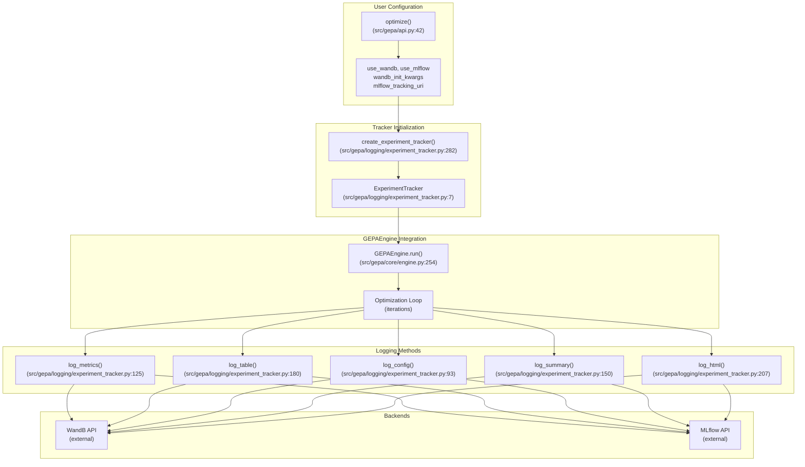
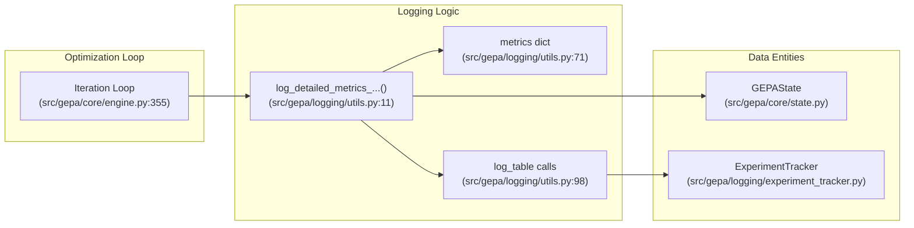
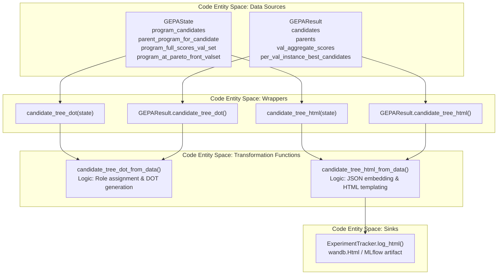
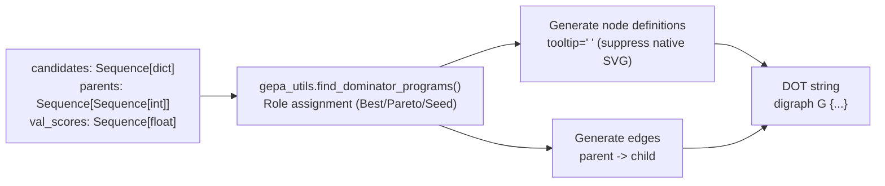
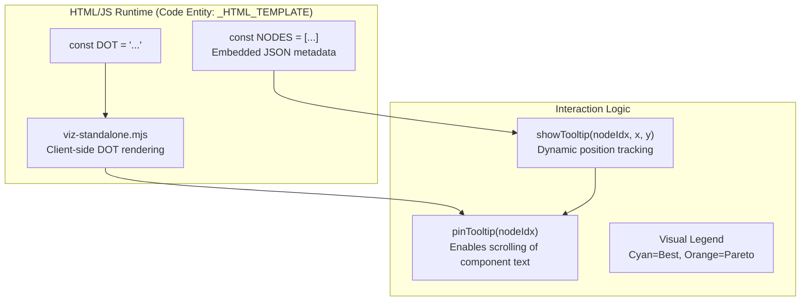
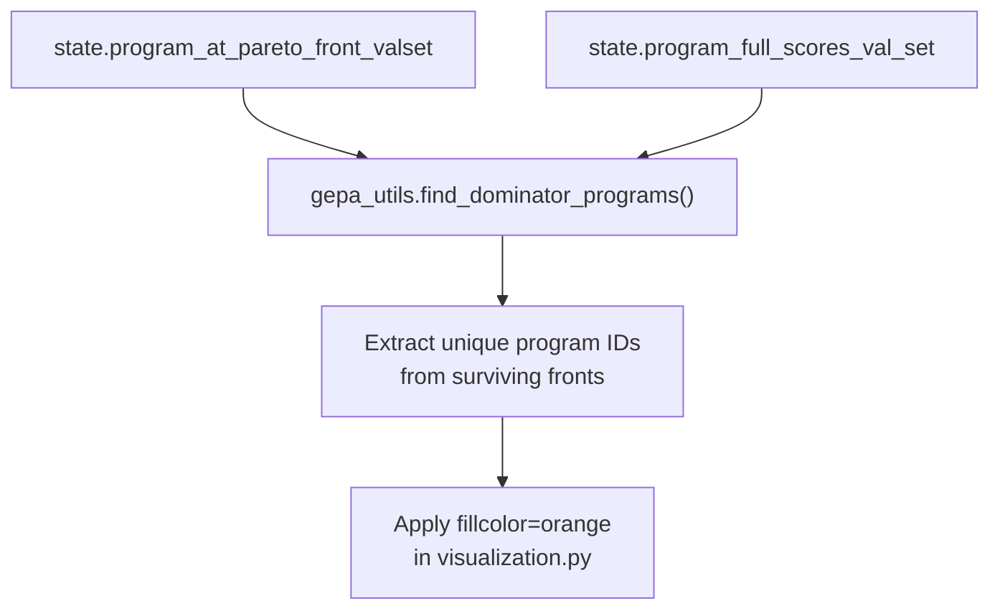
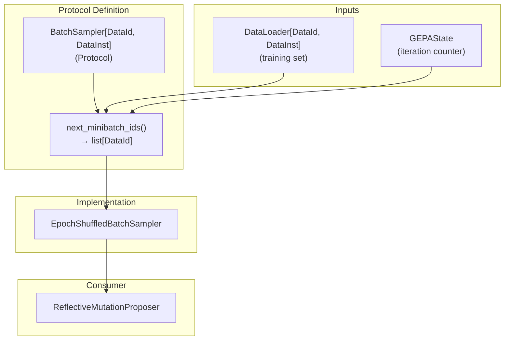
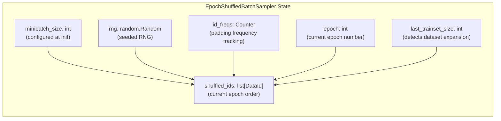
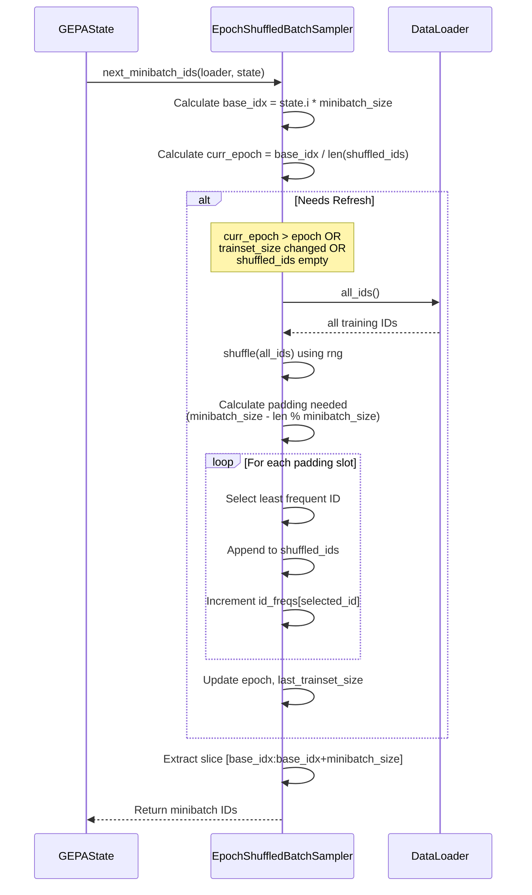

This page documents GEPA's experiment tracking system, which provides unified logging to **Weights & Biases (WandB)** and **MLflow** during optimization runs. For information about the callback system that observes optimization events, see [4.4.3. Callback System](). For visualization of candidate lineage trees, see [8.2. Visualization]().

---

## Overview

GEPA's experiment tracking is implemented by the `ExperimentTracker` class, which provides a unified API that supports multiple backends simultaneously. The tracker logs scalar metrics (for line charts), structured tables, configuration parameters, HTML artifacts, and final summaries. All logging operations gracefully handle failures and support running with no backends enabled.

**Key Features:**
- **Dual-backend support**: Use WandB, MLflow, or both simultaneously [src/gepa/logging/experiment_tracker.py:36-37]().
- **Automatic integration**: Tracks optimization lifecycle without manual instrumentation [src/gepa/core/engine.py:106-107]().
- **Structured logging**: Separates scalar metrics (charts) from structured data (tables) [src/gepa/logging/utils.py:70-130]().
- **Attach to existing runs**: Support for logging into already-active WandB or MLflow runs without terminating them [src/gepa/logging/experiment_tracker.py:130-176]().
- **Context manager**: Automatic run start/end with `with` statement [src/gepa/logging/experiment_tracker.py:12-21]().

### System Architecture and Code Entities

The following diagram bridges the high-level tracking concepts to the specific classes and methods in the codebase.

**Tracking Data Flow Diagram**

**Sources:** [src/gepa/logging/experiment_tracker.py:7-280](), [src/gepa/logging/experiment_tracker.py:282-300](), [src/gepa/core/engine.py:106-107]()

---

## Configuration

Experiment tracking is configured through parameters in the `optimize()` function or via `TrackingConfig` in `optimize_anything()` [src/gepa/optimize_anything.py:34-45]().

| Parameter | Type | Default | Description |
|-----------|------|---------|-------------|
| `use_wandb` | `bool` | `False` | Enable WandB logging [src/gepa/logging/experiment_tracker.py:25]() |
| `wandb_attach_existing` | `bool` | `False` | Log to active WandB run without calling init/finish [src/gepa/logging/experiment_tracker.py:28]() |
| `wandb_step_metric` | `str \| None` | `None` | Custom x-axis metric name for WandB charts [src/gepa/logging/experiment_tracker.py:29]() |
| `use_mlflow` | `bool` | `False` | Enable MLflow logging [src/gepa/logging/experiment_tracker.py:30]() |
| `mlflow_attach_existing` | `bool` | `False` | Log to active MLflow run without starting/ending [src/gepa/logging/experiment_tracker.py:33]() |

**Example: Attaching to an Existing Run**
```python
import wandb
import gepa

with wandb.init(project="my-project"):
    result = gepa.optimize(
        ...,
        use_wandb=True,
        wandb_attach_existing=True  # GEPA logs to this active run
    )
```
**Sources:** [src/gepa/logging/experiment_tracker.py:130-176](), [tests/test_attach_existing_run.py:18-35]()

---

## ExperimentTracker API

The `ExperimentTracker` class provides unified methods for logging different data types.

### log_metrics()
Logs scalar metrics for time-series visualization. Non-numeric values are automatically filtered out [src/gepa/logging/experiment_tracker.py:133-134]().

```python
def log_metrics(self, metrics: dict[str, Any], step: int | None = None) -> None
```
- **WandB**: Calls `wandb.log()` [src/gepa/logging/experiment_tracker.py:138](). If `wandb_step_metric` is defined, it sets up a custom x-axis for GEPA metrics [src/gepa/logging/experiment_tracker.py:98-129]().
- **MLflow**: Calls `mlflow.log_metrics()` [src/gepa/logging/experiment_tracker.py:144]().

### log_table()
Logs structured tabular data.

```python
def log_table(self, table_name: str, columns: list[str], data: list[list[Any]]) -> None
```
- **WandB**: Creates a `wandb.Table` [src/gepa/logging/experiment_tracker.py:186](). It accumulates rows locally in `self._wandb_table_rows` to ensure the full table is sent with each log call, preventing row loss during async commits [src/gepa/logging/experiment_tracker.py:53-57]().
- **MLflow**: Transposes data and calls `mlflow.log_table()` as a JSON artifact [src/gepa/logging/experiment_tracker.py:199-201]().

**Sources:** [src/gepa/logging/experiment_tracker.py:125-206](), [tests/test_experiment_tracker.py:12-41]()

---

## Integration with Optimization Loop

The `GEPAEngine` uses `log_detailed_metrics_after_discovering_new_program` to record state changes when a new candidate is accepted [src/gepa/logging/utils.py:11-21]().

**Optimization Event to Code Mapping**


### Key Metrics Logged
Every time a new program is discovered, the following are logged [src/gepa/logging/utils.py:71-82]():
- `best_score_on_valset`: Highest validation score found so far [src/gepa/logging/utils.py:75]().
- `valset_pareto_front_agg`: Average score of all programs currently on the Pareto front [src/gepa/logging/utils.py:74]().
- `val_program_average`: The validation score for the specific new candidate [src/gepa/logging/utils.py:80]().
- `total_metric_calls`: Total cumulative evaluator calls (`gepa_state.total_num_evals`) [src/gepa/logging/utils.py:81]().

### Logged Tables
- **valset_scores**: Matrix of `candidate_idx` vs. every validation example ID. Only the new candidate's row is logged to avoid $O(candidates \times valset)$ redundant uploads [src/gepa/logging/utils.py:91-98]().
- **valset_pareto_front**: List of `val_id`, its `best_score`, and the `program_ids` achieving it [src/gepa/logging/utils.py:101-110]().
- **objective_scores**: (If applicable) Scores for multiple objectives for the new candidate only [src/gepa/logging/utils.py:113-118]().

**Sources:** [src/gepa/logging/utils.py:11-131](), [src/gepa/core/engine.py:355-376]()

---

## Advanced Features

### Custom WandB Step Metric
To avoid conflicts when GEPA is embedded in a host training loop (like a PyTorch trainer), use `wandb_step_metric`. This defines a custom x-axis for GEPA's metrics so they don't overwrite the host's global step counter [src/gepa/logging/experiment_tracker.py:98-108]().

### Thread-Safe MLflow Logging
The tracker captures the `run_id` and creates an `MlflowClient` during `start_run()` [src/gepa/logging/experiment_tracker.py:165-170](). This ensures that metrics logged from parallel threads (e.g., during parallel candidate proposals) are correctly attributed to the main run instead of auto-creating new runs, as `mlflow.active_run()` is thread-local [src/gepa/logging/experiment_tracker.py:162-164]().

### Structured Logging with Prefixing
The `key_prefix` parameter allows namespacing all logged keys (e.g., `gepa/val_score`) [src/gepa/logging/experiment_tracker.py:59-61](). This is particularly useful when running GEPA as a sub-component of a larger system.

**Sources:** [src/gepa/logging/experiment_tracker.py:34-129](), [src/gepa/logging/experiment_tracker.py:162-175]()

# Visualization


## Purpose and Scope

This page documents GEPA's visualization capabilities for candidate lineage trees. GEPA generates visual representations of the optimization process, showing how candidates evolve through parent-child relationships, their validation scores, and their role in the Pareto frontier. [src/gepa/visualization.py:1-12]()

Visualization is provided in two formats:
- **DOT format**: Graphviz graph definition language for rendering with external tools. [src/gepa/visualization.py:34-102]()
- **HTML format**: Self-contained interactive webpage with hover tooltips and client-side rendering using `@viz-js/viz`. [src/gepa/visualization.py:105-161]()

For experiment tracking and logging (WandB/MLflow integration), see [8.1](). For Pareto frontier management details, see [4.8]().

**Sources:** [src/gepa/visualization.py:1-13]()

---

## Visualization Architecture

The visualization system uses a **data-driven architecture** where core functions (`*_from_data`) operate on raw Python data structures, while convenience wrappers extract data from `GEPAState` or `GEPAResult` objects. [src/gepa/visualization.py:168-185]()

### Data Flow and System Integration

This diagram bridges the "Natural Language Space" (optimization concepts) to the "Code Entity Space" (specific classes and functions).

"Visualization Data Flow"


**Sources:** [src/gepa/visualization.py:14-186](), [src/gepa/core/result.py:99-119](), [src/gepa/core/result.py:121-148]()

---

## Graphviz DOT Format

### DOT Generation Logic

The `candidate_tree_dot_from_data()` function generates a Graphviz DOT string representing the candidate lineage tree. It performs role assignment (Best, Pareto, Seed) to determine node styling. [src/gepa/visualization.py:34-102]()

| Component | Implementation Detail |
|-----------|-------------|
| **Best Candidate** | Highest `val_score` gets `fillcolor=cyan`. [src/gepa/visualization.py:87-88]() |
| **Pareto Front** | Identified via `find_dominator_programs()`, gets `fillcolor=orange`. [src/gepa/visualization.py:55-90]() |
| **Edges** | Generated from `parents[child]` mapping. [src/gepa/visualization.py:96-99]() |
| **Labels** | Formatted as `{idx}\n({score:.2f})`. [src/gepa/visualization.py:85]() |

"DOT Generation Pipeline"


**Sources:** [src/gepa/visualization.py:34-102](), [tests/test_visualization.py:27-58]()

---

## Interactive HTML Visualization

### HTML Template and Tooltips

The `candidate_tree_html_from_data()` function produces a complete HTML page. It embeds the DOT string and a JSON representation of all candidate metadata (`nodes_json`). [src/gepa/visualization.py:105-161]()

"HTML Interactive Components"


### Tooltip Content Structure
The HTML template uses a JavaScript-based tooltip system to display full candidate content, which is often too large for a standard Graphviz label. [src/gepa/visualization.py:192-230]()
1. **Metadata Processing**: Node data including index, score, parents, and role are serialized into JSON. [src/gepa/visualization.py:133-154]()
2. **Component Rendering**: Each component (e.g., `system_prompt`) is displayed with its full text content within the interactive tooltip. [src/gepa/visualization.py:152]()
3. **Escaping**: Text is escaped for safe inclusion in the HTML structure. [src/gepa/visualization.py:24-27]()

**Sources:** [src/gepa/visualization.py:105-161](), [tests/test_visualization.py:71-100]()

---

## Pareto Front Visualization Logic

The visualization relies on identifying "dominator" programs—those that belong to the Pareto frontier of at least one validation instance. [src/gepa/visualization.py:55-56]()

### Pareto Identification Flow

"Pareto Node Highlighting"


**Sources:** [src/gepa/visualization.py:51-56](), [src/gepa/visualization.py:89-90](), [src/gepa/core/result.py:45-49]()

---

## Integration with Results

The `GEPAResult` class provides built-in methods to generate these visualizations from a finished optimization run. [src/gepa/core/result.py:99-119]()

| Method | Implementation |
|----------|----------------|
| `candidate_tree_dot()` | Calls `candidate_tree_dot_from_data` with internal result data. [src/gepa/core/result.py:99-108]() |
| `candidate_tree_html()` | Calls `candidate_tree_html_from_data` with internal result data. [src/gepa/core/result.py:110-119]() |

**Sources:** [src/gepa/core/result.py:99-120](), [tests/test_visualization.py:103-136]()

---

## Summary of Key Functions

| Function | File | Description |
|----------|------|-------------|
| `candidate_tree_dot_from_data` | `src/gepa/visualization.py` | Core DOT generation logic using raw data sequences. [src/gepa/visualization.py:34]() |
| `candidate_tree_html_from_data` | `src/gepa/visualization.py` | Core HTML/JS template generation for interactive viewing. [src/gepa/visualization.py:105]() |
| `candidate_tree_dot` | `src/gepa/visualization.py` | Wrapper for `GEPAState` to generate DOT. [src/gepa/visualization.py:168]() |
| `candidate_tree_html` | `src/gepa/visualization.py` | Wrapper for `GEPAState` to generate HTML. [src/gepa/visualization.py:178]() |

**Sources:** [src/gepa/visualization.py:34-186]()

# Batch Sampling Strategies


**Purpose**: This document details GEPA's batch sampling system, which controls how training examples are selected during reflective mutation proposals. The `BatchSampler` protocol defines the interface for sampling minibatches from the training set, while `EpochShuffledBatchSampler` provides the default implementation with deterministic, epoch-based shuffling. Batch sampling is distinct from validation evaluation (see [Evaluation Policies](#4.6)) and affects only the reflective mutation proposer's training data selection.

## BatchSampler Protocol

The `BatchSampler` protocol defines a single-method interface for selecting training data IDs to form the next minibatch. This abstraction decouples the sampling strategy from the optimization engine, allowing custom implementations [src/gepa/strategies/batch_sampler.py:13-14]().

Title: BatchSampler Protocol Architecture

**Sources**: [src/gepa/strategies/batch_sampler.py:13-14](), [docs/docs/guides/batch-sampling.md:155-159]()

The protocol signature requires two parameters:

| Parameter | Type | Purpose |
|-----------|------|---------|
| `loader` | `DataLoader[DataId, DataInst]` | Provides access to training data and IDs |
| `state` | `GEPAState` | Contains iteration counter (`state.i`) for epoch tracking |

The return value is a list of `DataId` objects identifying which training examples to include in the current minibatch. These IDs are then used by the adapter to retrieve and evaluate the corresponding data instances [src/gepa/strategies/batch_sampler.py:13-14]().

**Sources**: [src/gepa/strategies/batch_sampler.py:13-14](), [src/gepa/core/data_loader.py:9-10]()

## EpochShuffledBatchSampler Implementation

`EpochShuffledBatchSampler` is the default built-in implementation of the `BatchSampler` protocol. It provides deterministic, epoch-based shuffling with intelligent padding to ensure consistent minibatch sizes [src/gepa/strategies/batch_sampler.py:17-23]().

### Internal State Management

Title: EpochShuffledBatchSampler Internal State

**Sources**: [src/gepa/strategies/batch_sampler.py:25-34]()

The sampler maintains internal state to support:
- **Epoch detection**: Tracks when to reshuffle based on iteration count [src/gepa/strategies/batch_sampler.py:64-69]().
- **Padding frequency**: Ensures least-frequently-used IDs are selected for padding [src/gepa/strategies/batch_sampler.py:50-56]().
- **Dataset expansion**: Detects when the training set grows and triggers reshuffle [src/gepa/strategies/batch_sampler.py:66-69]().
- **Reproducibility**: Uses a seeded `random.Random` instance for deterministic shuffling [src/gepa/strategies/batch_sampler.py:31-34]().

**Sources**: [src/gepa/strategies/batch_sampler.py:25-34]()

### Shuffling and Padding Algorithm

The sampler follows a multi-step process to generate consistent minibatches:

Title: Minibatch Generation Sequence

**Sources**: [src/gepa/strategies/batch_sampler.py:36-77]()

#### Padding Strategy

When the training set size is not evenly divisible by `minibatch_size`, the sampler pads the shuffled list to ensure all minibatches have exactly `minibatch_size` elements. The padding algorithm selects IDs with the lowest frequency count, ensuring balanced representation across the epoch [src/gepa/strategies/batch_sampler.py:50-56]():

```python