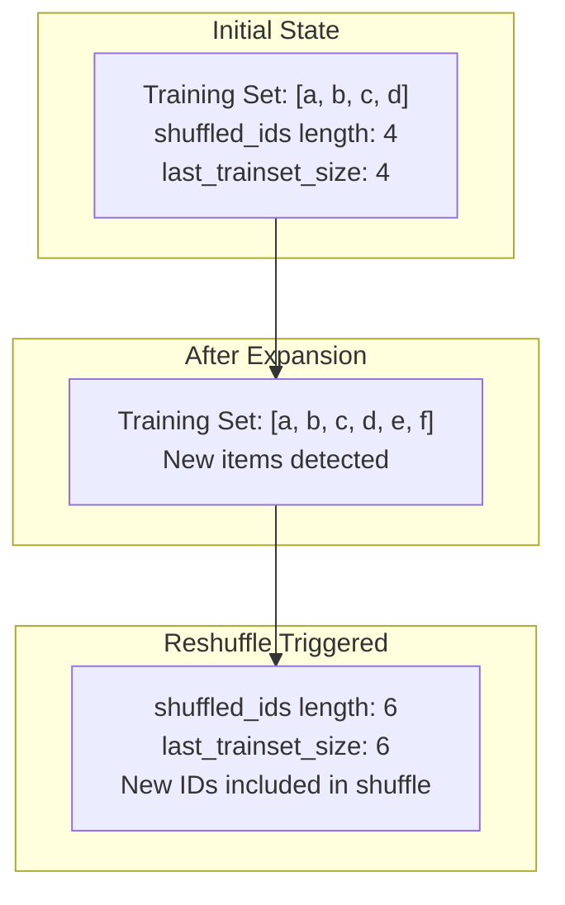
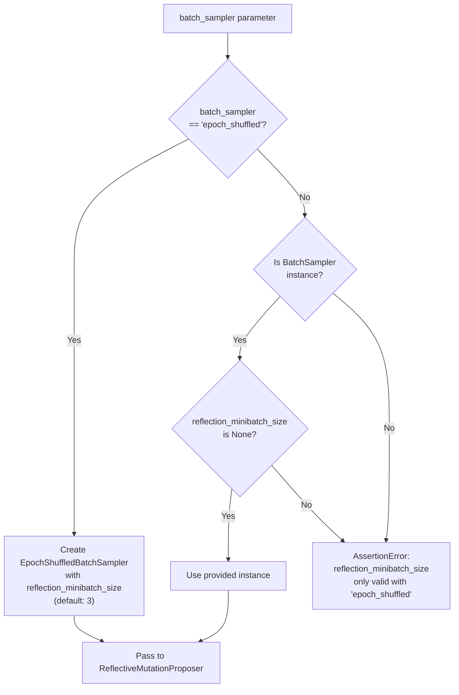
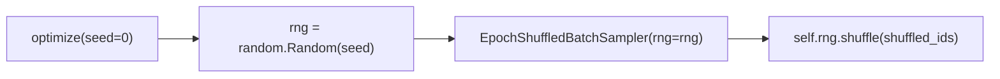
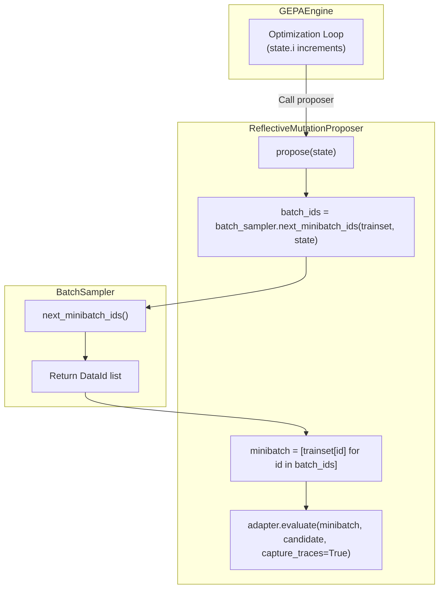
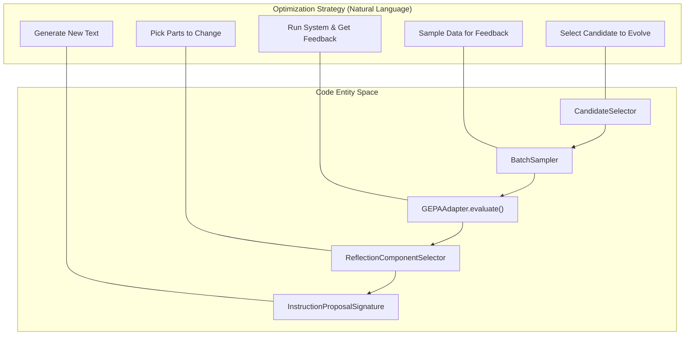
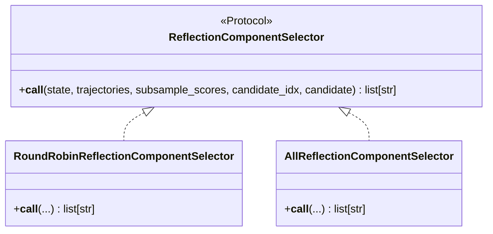
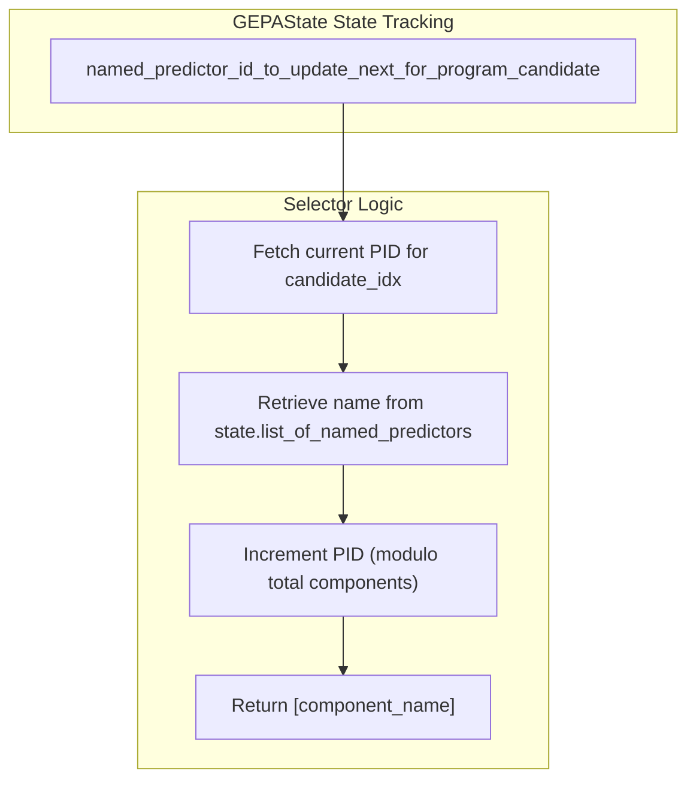
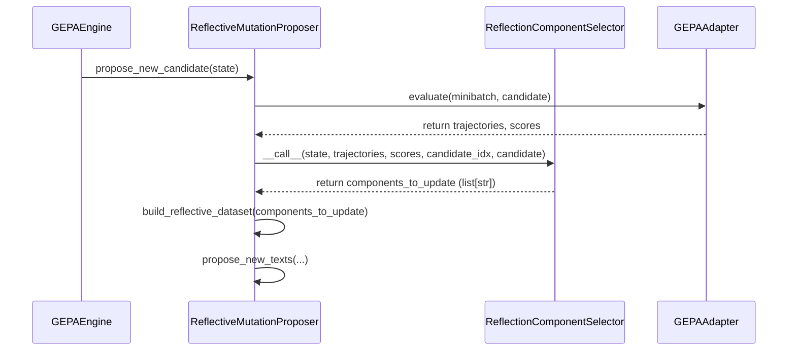

mod = trainset_size % self.minibatch_size
num_to_pad = (self.minibatch_size - mod) if mod != 0 else 0
if num_to_pad > 0:
    for _ in range(num_to_pad):
        selected_id = self.id_freqs.most_common()[::-1][0][0]  # Least frequent
        self.shuffled_ids.append(selected_id)
        self.id_freqs[selected_id] += 1
```
**Sources**: [src/gepa/strategies/batch_sampler.py:50-56]()

#### Epoch Boundary Detection

The sampler automatically detects epoch boundaries based on the iteration counter [src/gepa/strategies/batch_sampler.py:63-69]():

| Condition | Action |
|-----------|--------|
| `curr_epoch > self.epoch` | Trigger reshuffle for new epoch |
| `trainset_size != last_trainset_size` | Trigger reshuffle due to dataset expansion |
| `not shuffled_ids` | Initial shuffle (first call) |

**Sources**: [src/gepa/strategies/batch_sampler.py:63-69]()

### Dynamic Training Set Support

`EpochShuffledBatchSampler` supports training sets that grow during optimization. When the loader's size increases, the sampler detects the change and reshuffles to incorporate new data [tests/test_batch_sampler.py:10-28]().

Title: Dynamic Training Set Handling

**Sources**: [tests/test_batch_sampler.py:10-28](), [src/gepa/strategies/batch_sampler.py:66-69]()

## Configuration and Usage

### Integration with gepa.optimize

The `batch_sampler` parameter in `gepa.optimize()` accepts either a string literal or a `BatchSampler` instance [docs/docs/guides/batch-sampling.md:34-45]().

#### Configuration Options

| Configuration | Effect | Example |
|--------------|--------|---------|
| `batch_sampler="epoch_shuffled"` | Default; creates `EpochShuffledBatchSampler` | `optimize(..., batch_sampler="epoch_shuffled")` |
| `batch_sampler="epoch_shuffled"`, `reflection_minibatch_size=7` | Custom minibatch size | `optimize(..., reflection_minibatch_size=7)` |
| `batch_sampler=custom_instance` | Use custom implementation | `optimize(..., batch_sampler=MyCustomSampler())` |

**Sources**: [docs/docs/guides/batch-sampling.md:34-45](), [docs/docs/guides/batch-sampling.md:123-132]()

#### Instantiation Logic

Title: Sampler Initialization Logic

**Sources**: [docs/docs/guides/batch-sampling.md:134-136](), [src/gepa/strategies/batch_sampler.py:25-34]()

The configuration enforces that `reflection_minibatch_size` can only be specified when using the default `"epoch_shuffled"` strategy [docs/docs/guides/batch-sampling.md:134-136]().

## Deterministic Behavior and Reproducibility

### RNG Seeding

The sampler's deterministic behavior relies on a seeded `random.Random` instance. The RNG is initialized from the top-level `seed` parameter in `gepa.optimize()` [src/gepa/strategies/batch_sampler.py:31-34]().

Title: RNG Propagation Flow

**Sources**: [src/gepa/strategies/batch_sampler.py:31-34](), [docs/docs/guides/batch-sampling.md:29]()

### Deterministic Guarantees

Given the same seed, training set, and minibatch size, `EpochShuffledBatchSampler` guarantees:

| Property | Guarantee |
|----------|-----------|
| **Epoch-to-epoch consistency** | Same shuffling order for each epoch |
| **Iteration order** | Minibatches always drawn from same positions in shuffled list |
| **Padding selection** | Least-frequent IDs selected deterministically |
| **Cross-run reproducibility** | Identical behavior across runs with same seed |

**Sources**: [src/gepa/strategies/batch_sampler.py:17-77](), [docs/docs/guides/batch-sampling.md:28-30]()

## Integration with Optimization Loop

### Reflective Mutation Proposer Interaction

The batch sampler is exclusively used by `ReflectiveMutationProposer` to select training examples for reflection [docs/docs/guides/batch-sampling.md:12-18]().

Title: Optimization Loop Interaction

**Sources**: [src/gepa/strategies/batch_sampler.py:58-77](), [docs/docs/guides/batch-sampling.md:12-18]()

The interaction pattern:

1. **Engine increments** `state.i` for each proposal attempt.
2. **Proposer calls** `batch_sampler.next_minibatch_ids(trainset, state)`.
3. **Sampler returns** list of `DataId` values [src/gepa/strategies/batch_sampler.py:77]().
4. **Proposer retrieves** corresponding `DataInst` objects from loader.
5. **Adapter evaluates** candidate on retrieved minibatch.

**Sources**: [src/gepa/strategies/batch_sampler.py:58-77](), [docs/docs/guides/batch-sampling.md:12-18]()

### State Counter Usage

The sampler relies on `state.i` to track progress through the dataset [src/gepa/strategies/batch_sampler.py:63]():

| Iteration (`state.i`) | Epoch | Minibatch Position |
|----------------------|-------|-------------------|
| 0 | 0 | `shuffled_ids[0:minibatch_size]` |
| 1 | 0 | `shuffled_ids[minibatch_size:2*minibatch_size]` |
| k | `floor(k * minibatch_size / len(shuffled_ids))` | `shuffled_ids[(k*size) % len : ...]` |

**Sources**: [src/gepa/strategies/batch_sampler.py:63-77]()

### Error Handling

The sampler raises `ValueError` if asked to sample from an empty loader [src/gepa/strategies/batch_sampler.py:60-61]():

```python
# From next_minibatch_ids in src/gepa/strategies/batch_sampler.py
trainset_size = len(loader)
if trainset_size == 0:
    raise ValueError("Cannot sample a minibatch from an empty loader.")
```
**Sources**: [src/gepa/strategies/batch_sampler.py:60-61](), [tests/test_batch_sampler.py:30-36]()

## Custom Batch Sampler Implementation

To implement a custom batch sampler, define a class implementing the `BatchSampler` protocol [docs/docs/guides/batch-sampling.md:90-120]():

```python
from gepa.strategies.batch_sampler import BatchSampler
from gepa.core.data_loader import DataId, DataLoader
from gepa.core.state import GEPAState

class MyCustomSampler(BatchSampler[DataId, Any]):
    def __init__(self, minibatch_size: int):
        self.minibatch_size = minibatch_size

    def next_minibatch_ids(
        self, 
        loader: DataLoader, 
        state: GEPAState
    ) -> list[DataId]:
        # Custom sampling logic (e.g., hard example mining)
        all_ids = list(loader.all_ids())
        return all_ids[:self.minibatch_size]
```
**Sources**: [src/gepa/strategies/batch_sampler.py:13-14](), [docs/docs/guides/batch-sampling.md:90-120]()

# Component Selection Strategies


This page documents the component selection system in GEPA, which determines **which components** of a candidate to modify during reflective mutation. Component selectors operate after a candidate has been selected for evolution (see [Selection Strategies](#4.5)) and a batch of training examples has been sampled (see [Batch Sampling Strategies](#8.3)), choosing which named text components (e.g., prompts, instructions, code snippets) should be updated by the reflection LM.

---

## When Component Selection Occurs

Component selection happens during the **reflective mutation** phase of each GEPA iteration. The sequence is managed by the `ReflectiveMutationProposer` [src/gepa/proposer/reflective_mutation/reflective_mutation.py:66-72]().

### Data Flow Diagram: Natural Language Space to Code Entity Space

The following diagram illustrates how abstract optimization steps map to specific classes and methods in the codebase.



**Sources:** [src/gepa/proposer/reflective_mutation/reflective_mutation.py:66-101](), [src/gepa/core/engine.py:51-86](), [src/gepa/strategies/component_selector.py:7-8]()

---

## The ReflectionComponentSelector Protocol

Component selectors implement a callable protocol defined in the reflective mutation base. This protocol allows the `ReflectiveMutationProposer` to query which components should be targeted for improvement based on execution traces and scores.

### Class Hierarchy



**Sources:** [src/gepa/proposer/reflective_mutation/base.py:28](), [src/gepa/strategies/component_selector.py:10-37]()

### Protocol Signature

The core interface is defined in `src/gepa/strategies/component_selector.py`:

```python
def __call__(
    self,
    state: GEPAState,
    trajectories: list[Trajectory],
    subsample_scores: list[float],
    candidate_idx: int,
    candidate: dict[str, str],
) -> list[str]
```

**Parameters:**
| Parameter | Type | Description |
|-----------|------|-------------|
| `state` | `GEPAState` | Full optimization state with candidate history, Pareto fronts, and evaluation results [src/gepa/core/state.py:30]() |
| `trajectories` | `list[Trajectory]` | Execution traces captured from evaluating the candidate on the minibatch [src/gepa/core/adapter.py:17]() |
| `subsample_scores` | `list[float]` | Scores for each example in the minibatch |
| `candidate_idx` | `int` | Index of the candidate being evolved in the state's candidate list |
| `candidate` | `dict[str, str]` | The candidate itself (mapping component names to text) |

**Returns:** List of component names (strings) to update. Must be a subset of `candidate.keys()`.

**Sources:** [src/gepa/strategies/component_selector.py:11-18]()

---

## Built-in Strategies

GEPA provides two built-in component selection strategies.

### Round Robin Selector

The `RoundRobinReflectionComponentSelector` cycles through components sequentially, updating one component per iteration.



**Sources:** [src/gepa/strategies/component_selector.py:10-24]()

**Implementation Detail:**
The selector uses `state.named_predictor_id_to_update_next_for_program_candidate` to maintain a persistent pointer across iterations for each specific candidate [src/gepa/strategies/component_selector.py:19-20](). This ensures that if a candidate is selected for evolution multiple times, GEPA systematically works through all its components.

### All Components Selector

The `AllReflectionComponentSelector` selects all components in every iteration, proposing simultaneous updates to the entire candidate.

```python
class AllReflectionComponentSelector(ReflectionComponentSelector):
    def __call__(
        self,
        state: GEPAState,
        trajectories: list[Trajectory],
        subsample_scores: list[float],
        candidate_idx: int,
        candidate: dict[str, str],
    ) -> list[str]:
        return list(candidate.keys())
```

**Sources:** [src/gepa/strategies/component_selector.py:27-36]()

**Use Case:** This is ideal for systems where components are tightly coupled and should be updated together, or for rapid exploration when the candidate has only a single component.

---

## Configuration via optimize()

The `module_selector` parameter in `gepa.optimize()` controls which strategy is used [src/gepa/api.py:63]().

### String Identifiers
You can pass a string to use built-in strategies:
- `"round_robin"`: Uses `RoundRobinReflectionComponentSelector` (Default) [src/gepa/api.py:63]().
- `"all"`: Uses `AllReflectionComponentSelector`.

### Custom Callables
You can pass a custom object or function that implements the `ReflectionComponentSelector` protocol.

```python
def my_custom_selector(state, trajectories, scores, idx, candidate):
    # Only update the 'prompt' component if the score is low
    if sum(scores)/len(scores) < 0.5:
        return ["prompt"]
    return []

optimize(..., module_selector=my_custom_selector)
```

**Sources:** [src/gepa/api.py:63](), [tests/test_module_selector.py:127-153]()

---

## Technical Implementation and Data Flow

The component selector is instantiated and used within the `ReflectiveMutationProposer`.

### Component Selection in the Proposer Loop



**Sources:** [src/gepa/proposer/reflective_mutation/reflective_mutation.py:120-146](), [src/gepa/core/engine.py:101-107]()

### Handling Missing Templates
If a component is selected but no specific reflection template is provided for it in `reflection_prompt_template` (when passed as a dict), GEPA logs a warning and falls back to the default template [src/gepa/proposer/reflective_mutation/reflective_mutation.py:157-164]().

---

## Validation and Testing

The behavior of component selectors is verified in `tests/test_module_selector.py`.

| Test Case | Description |
|-----------|-------------|
| `test_module_selector_default_round_robin` | Verifies `optimize()` defaults to Round Robin [tests/test_module_selector.py:49-71](). |
| `test_module_selector_string_all` | Verifies the `"all"` string correctly instantiates the `AllReflectionComponentSelector` [tests/test_module_selector.py:101-123](). |
| `test_module_selector_custom_instance` | Verifies that a custom callable is correctly utilized by the proposer [tests/test_module_selector.py:127-154](). |
| `test_module_selector_invalid_string_raises_error` | Ensures that unknown strategy strings trigger an `AssertionError` [tests/test_module_selector.py:177-193](). |

**Sources:** [tests/test_module_selector.py:49-193]()