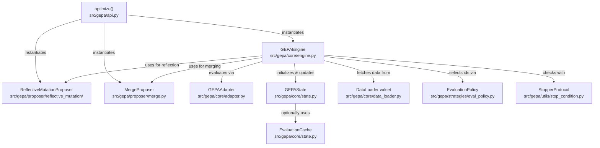
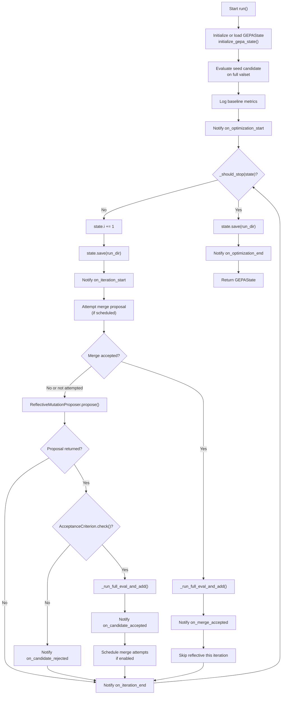

**Purpose**: This page documents the `GEPAEngine` class and the core optimization loop that drives GEPA's evolutionary search. It explains how the engine orchestrates candidate proposal, evaluation, acceptance, and state updates across iterations until stopping conditions are met.

**Scope**: Covers the engine's initialization, the main `run()` method, iteration structure, proposal scheduling (merge vs reflective mutation), acceptance criteria, and integration with callbacks, stopping conditions, and progress tracking. For details on state persistence and Pareto frontier management, see [State Management and Persistence](4.2). For proposer implementations, see [Proposer System](4.4).

---

## Overview

The `GEPAEngine` class in [src/gepa/core/engine.py:51-624]() is the orchestrator of GEPA's optimization process. It manages:

- **Iteration control**: Incrementing iterations and checking stop conditions.
- **Proposal coordination**: Scheduling merge and reflective mutation proposals.
- **Evaluation orchestration**: Calling adapters to evaluate candidates on validation sets.
- **Acceptance logic**: Determining whether to add new candidates to the population based on `AcceptanceCriterion` [src/gepa/core/engine.py:124]().
- **State updates**: Maintaining candidate pool, scores, and Pareto frontiers in `GEPAState`.
- **Callback notifications**: Emitting events for logging and monitoring via `notify_callbacks`.
- **Persistence**: Saving state snapshots for resumability.

The engine is instantiated by the `optimize()` function in [src/gepa/api.py:383-403]() and runs until stopping conditions are satisfied.

**Sources**: [src/gepa/core/engine.py:51-624](), [src/gepa/api.py:383-403]()

---

## GEPAEngine Initialization

### Constructor Parameters

The `GEPAEngine.__init__` method ([src/gepa/core/engine.py:54-134]()) accepts:

| Parameter | Type | Purpose |
|-----------|------|---------|
| `adapter` | `GEPAAdapter` | Evaluates candidates and creates reflective datasets. |
| `run_dir` | `str \| None` | Directory for saving state and outputs. |
| `valset` | `DataLoader` | Validation data for scoring candidates. |
| `seed_candidate` | `dict[str, str]` | Initial candidate to bootstrap optimization. |
| `reflective_proposer` | `ReflectiveMutationProposer` | Handles LLM-based reflection and mutation. |
| `merge_proposer` | `MergeProposer \| None` | Combines Pareto-optimal candidates (optional). |
| `frontier_type` | `FrontierType` | Strategy for tracking Pareto frontiers. |
| `stop_callback` | `StopperProtocol` | Determines when to halt optimization. |
| `val_evaluation_policy` | `EvaluationPolicy` | Controls which validation examples to evaluate. |
| `evaluation_cache` | `EvaluationCache \| None` | Caches (candidate, example) evaluations. |
| `perfect_score` | `float \| None` | Score threshold considered optimal. |
| `track_best_outputs` | `bool` | Whether to save best outputs per validation example. |
| `display_progress_bar` | `bool` | Show tqdm progress bar. |
| `raise_on_exception` | `bool` | Propagate exceptions vs. graceful stopping. |
| `num_parallel_proposals` | `int` | Number of concurrent proposals to generate. |

**Sources**: [src/gepa/core/engine.py:54-134]()

---

### Dependency Graph



**Caption**: Dependency graph showing how `GEPAEngine` integrates with proposers, adapters, state, and supporting components.

**Sources**: [src/gepa/api.py:383-403](), [src/gepa/core/engine.py:54-134]()

---

## The Main Optimization Loop

The `run()` method ([src/gepa/core/engine.py:235-590]()) executes the optimization loop. It:

1. **Initializes state**: Loads from disk if `run_dir` exists, otherwise creates new state with seed candidate via `initialize_gepa_state` [src/gepa/core/state.py:30]().
2. **Evaluates seed**: Scores the initial candidate on the full validation set.
3. **Iterates**: Proposes, evaluates, and accepts/rejects candidates until stop conditions trigger.
4. **Persists state**: Saves snapshots to disk after each iteration.
5. **Returns final state**: Contains all explored candidates and their scores.

---

### High-Level Loop Structure



**Caption**: Main optimization loop flowchart showing iteration lifecycle, merge/reflective proposal sequencing, and callback notifications.

**Sources**: [src/gepa/core/engine.py:235-590]()

---

## Iteration Structure

Each iteration ([src/gepa/core/engine.py:372-570]()) follows this sequence:

### 1. State Persistence and Iteration Start

```python