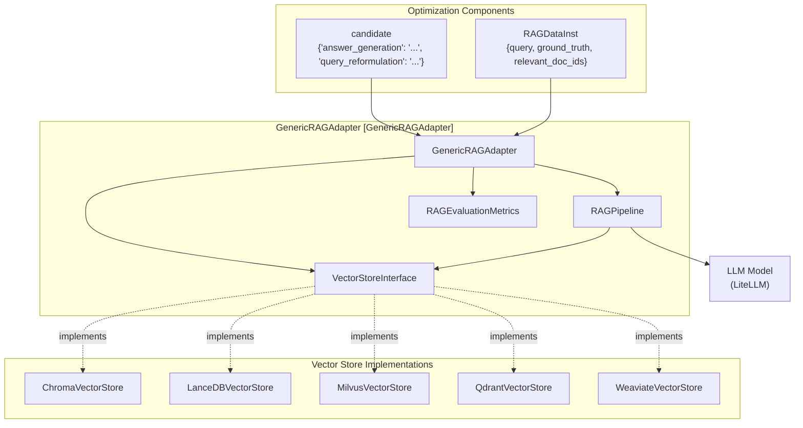
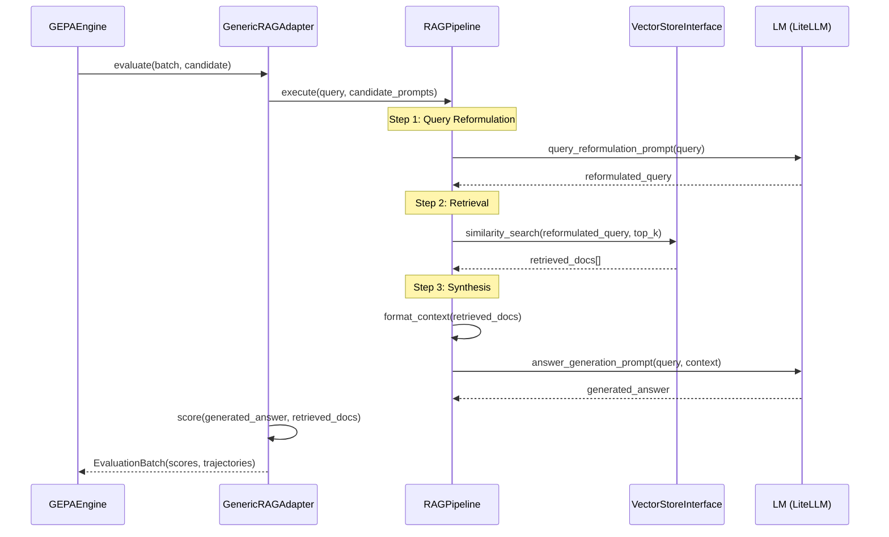

## Purpose and Scope

The **Generic RAG Adapter** (`GenericRAGAdapter`) enables GEPA to optimize Retrieval-Augmented Generation (RAG) systems by treating retrieval prompts, generation prompts, and retrieval parameters as text components that can be evolved. This adapter bridges GEPA's optimization engine with vector store-agnostic retrieval systems, allowing optimization of the entire RAG pipeline including query reformulation, document retrieval, context synthesis, and answer generation. [src/gepa/adapters/generic_rag_adapter/GEPA_RAG.md:1-15]().

The adapter is designed to be **vector store-agnostic**, supporting backends like ChromaDB, LanceDB, Milvus, Qdrant, and Weaviate through a unified `VectorStoreInterface`. [src/gepa/adapters/generic_rag_adapter/GEPA_RAG.md:10-13]().

**Sources:** [src/gepa/adapters/generic_rag_adapter/GEPA_RAG.md:1-15](), [src/gepa/adapters/generic_rag_adapter/generic_rag_adapter.py:11-30]()

## Overview

The Generic RAG Adapter orchestrates three key components to optimize RAG systems:

1.  **Vector Store Integration**: Abstracts different vector databases through the `VectorStoreInterface`. [src/gepa/adapters/generic_rag_adapter/GEPA_RAG.md:132-148]().
2.  **RAG Pipeline**: Manages the retrieval-generation workflow with configurable strategies (similarity, vector, or hybrid search). [src/gepa/adapters/generic_rag_adapter/GEPA_RAG.md:150-157]().
3.  **Evaluation Metrics**: Assesses retrieval quality (Precision, Recall, MRR) and generation accuracy (containment, semantic similarity). [src/gepa/adapters/generic_rag_adapter/GEPA_RAG.md:12-13]().

### System Architecture



**Diagram: Generic RAG Adapter Architecture**

**Sources:** [src/gepa/adapters/generic_rag_adapter/GEPA_RAG.md:126-158](), [src/gepa/examples/rag_adapter/RAG_GUIDE.md:9-17]()

## Data Format: RAGDataInst

RAG examples follow the `RAGDataInst` structure, which extends the standard data instance format with retrieval-specific fields:

| Field | Type | Description |
| :--- | :--- | :--- |
| `query` | `str` | The user's question or search query. |
| `ground_truth_answer` | `str` | The expected correct answer for evaluation. |
| `relevant_doc_ids` | `list[str]` | Document IDs that contain relevant information (for retrieval scoring). |
| `metadata` | `dict` | Optional metadata (e.g., `category`, `difficulty`, `split`). |

**Sources:** [tests/test_rag_adapter/test_rag_end_to_end.py:15-50]()

## Vector Store Interface

The adapter abstracts vector database operations through the `VectorStoreInterface`, enabling GEPA to remain decoupled from specific database drivers. [src/gepa/adapters/generic_rag_adapter/GEPA_RAG.md:132-148]().

### Core Interface Methods

| Method | Parameters | Description |
| :--- | :--- | :--- |
| `similarity_search` | `query: str, k: int, filters: dict` | Semantic similarity search using text. [src/gepa/adapters/generic_rag_adapter/vector_stores/chroma_store.py:42-56]() |
| `vector_search` | `query_vector: list[float], k: int` | Search using pre-computed embeddings. [src/gepa/adapters/generic_rag_adapter/vector_stores/chroma_store.py:58-74]() |
| `hybrid_search` | `query: str, k: int, alpha: float` | Combined dense (vector) and sparse (keyword) search. [src/gepa/adapters/generic_rag_adapter/vector_stores/weaviate_store.py:97-129]() |
| `add_documents` | `docs: list, embeddings: list, ids: list` | Add new documents to the store. [src/gepa/adapters/generic_rag_adapter/vector_stores/lancedb_store.py:93-130]() |
| `get_collection_info`| - | Returns metadata (count, dimension, type). [src/gepa/adapters/generic_rag_adapter/vector_stores/chroma_store.py:76-93]() |

**Sources:** [src/gepa/adapters/generic_rag_adapter/GEPA_RAG.md:132-148](), [src/gepa/adapters/generic_rag_adapter/vector_stores/chroma_store.py:42-93](), [src/gepa/adapters/generic_rag_adapter/vector_stores/lancedb_store.py:93-130](), [src/gepa/adapters/generic_rag_adapter/vector_stores/weaviate_store.py:97-129]()

### Supported Implementations

| Implementation | Characteristics | Source |
| :--- | :--- | :--- |
| `ChromaVectorStore` | Local persistence, simple setup, no Docker required. | [src/gepa/adapters/generic_rag_adapter/vector_stores/chroma_store.py:9-158]() |
| `LanceDBVectorStore`| Serverless, columnar format (Apache Arrow), local files. | [src/gepa/adapters/generic_rag_adapter/vector_stores/lancedb_store.py:9-130]() |
| `MilvusVectorStore` | Cloud-native, scalable, supports Milvus Lite (local). | [src/gepa/adapters/generic_rag_adapter/vector_stores/milvus_store.py:9-148]() |
| `QdrantVectorStore` | Advanced filtering, payload search, high performance. | [src/gepa/examples/rag_adapter/RAG_GUIDE.md:15-15]() |
| `WeaviateVectorStore`| Production-ready hybrid search, requires Docker. | [src/gepa/adapters/generic_rag_adapter/vector_stores/weaviate_store.py:9-130]() |

**Sources:** [src/gepa/examples/rag_adapter/RAG_GUIDE.md:9-17](), [src/gepa/adapters/generic_rag_adapter/GEPA_RAG.md:161-200]()

## RAG Pipeline Execution

The pipeline execution bridges Natural Language Space (queries/prompts) to Code Entity Space (vector store methods and LLM calls).



**Diagram: RAG Execution Flow**

**Sources:** [src/gepa/adapters/generic_rag_adapter/GEPA_RAG.md:150-157](), [tests/test_rag_adapter/test_rag_end_to_end.py:230-242]()

## Configuration Options

The `rag_config` dictionary controls the behavior of the `RAGPipeline`:

| Parameter | Type | Default | Description |
| :--- | :--- | :--- | :--- |
| `retrieval_strategy` | `str` | `"similarity"` | Strategy: `"similarity"`, `"vector"`, or `"hybrid"`. [src/gepa/adapters/generic_rag_adapter/GEPA_RAG.md:61-61]() |
| `top_k` | `int` | `5` | Number of documents to retrieve. [src/gepa/adapters/generic_rag_adapter/GEPA_RAG.md:62-62]() |
| `retrieval_weight` | `float` | `0.5` | Weight for retrieval quality in the final score. |
| `generation_weight` | `float` | `0.5` | Weight for generation quality in the final score. |
| `alpha` | `float` | `0.5` | Hybrid search balance (0.0=keyword, 1.0=semantic). [src/gepa/adapters/generic_rag_adapter/GEPA_RAG.md:142-142]() |

**Sources:** [src/gepa/adapters/generic_rag_adapter/GEPA_RAG.md:60-64](), [tests/test_rag_adapter/test_rag_end_to_end.py:197-197]()

## Adapter Implementation

The `GenericRAGAdapter` implements the core `GEPAAdapter` protocol.

### Key Methods

*   **`evaluate(batch, candidate, capture_traces)`**: Runs the RAG pipeline on a batch of `RAGDataInst`. It computes retrieval scores (checking if `relevant_doc_ids` were found) and generation scores (checking answer correctness). [tests/test_rag_adapter/test_rag_end_to_end.py:220-271]()
*   **`make_reflective_dataset(candidate, eval_batch, components_to_update)`**: Converts execution traces into a dataset for the reflection LLM. It pairs the original query and retrieved context with the generated answer and specific failure feedback (e.g., "Retrieved docs were irrelevant" or "Answer hallucinated information"). [tests/test_incremental_eval_policy.py:45-47]()

**Sources:** [src/gepa/core/adapter.py:27-181](), [tests/test_rag_adapter/test_rag_end_to_end.py:244-271](), [tests/test_incremental_eval_policy.py:45-47]()

## Advanced Usage: Dynamic Validation

GEPA supports `DataLoader` and `EvaluationPolicy` to handle validation sets that grow over time or are sampled strategically. [src/gepa/core/data_loader.py:27-41](), [src/gepa/strategies/eval_policy.py:13-32]().

### Round Robin Evaluation Policy

The `RoundRobinSampleEvaluationPolicy` ensures that validation instances with the fewest evaluations are prioritized. This is particularly useful for RAG systems where evaluating the entire validation set per iteration is cost-prohibitive. [tests/test_incremental_eval_policy.py:54-84]().

```python
from tests.test_incremental_eval_policy import RoundRobinSampleEvaluationPolicy

policy = RoundRobinSampleEvaluationPolicy(batch_size=5)