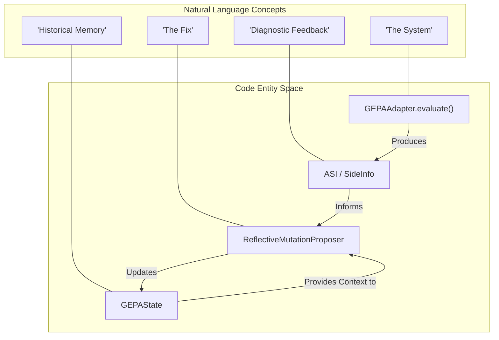
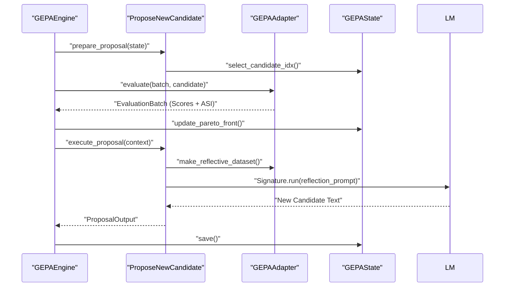

This page provides definitions for codebase-specific terms, jargon, and domain concepts used throughout the GEPA framework. It serves as a technical reference for onboarding engineers to understand how natural language concepts map to specific code entities.

## Core System Concepts

### ASI (Actionable Side Information)
The textual "gradient" of GEPA. While traditional optimizers only receive a scalar score, GEPA evaluators return ASI—diagnostic feedback such as error messages, stack traces, execution logs, or intermediate reasoning steps. This information is passed to the **Reflection LM** to help it understand *why* a candidate failed and *how* to fix it [src/gepa/optimize_anything.py:82-88]().
*   **Code Pointer:** `SideInfo` type alias in [src/gepa/optimize_anything.py:98]().

### Candidate
A specific instantiation of the system being optimized. It is represented as a mapping from component names to their textual content (e.g., prompt strings, code snippets, or configuration values) [src/gepa/api.py:104-105]().
*   **Code Pointer:** `Candidate` type alias in [src/gepa/optimize_anything.py:154]().

### Pareto Frontier
The set of candidates that are not strictly outperformed by any other candidate across all evaluation dimensions. GEPA tracks frontiers across different "types" (instance-level, objective-level, etc.) to ensure that specialized candidates (e.g., those that excel at a specific hard task) are preserved for future mutations or merges [src/gepa/api.py:129-130]().
*   **Code Pointer:** `FrontierType` in [src/gepa/core/state.py:22-23]().

### Task LM vs. Reflection LM
*   **Task LM:** The model executing the actual task (e.g., answering a math problem). It is part of the system being optimized [src/gepa/api.py:48]().
*   **Reflection LM:** The "meta-optimizer" model. It reads the **ASI** and **Trajectories** to propose improvements to the candidates [src/gepa/api.py:51]().

### Trajectory
A record of the operations performed by different components during a single execution (rollout). It typically contains the specific text used by a component and the resulting output or ASI [src/gepa/api.py:109-111]().
*   **Code Pointer:** `Trajectory` in [src/gepa/core/adapter.py:17]().

### Rollout
The process of executing a **Candidate** on a single **DataInst** to produce a **RolloutOutput** and a **Trajectory** [src/gepa/api.py:109-110]().

---

## Code Entities and Data Structures

### GEPAEngine
The central orchestrator that manages the optimization loop. It coordinates between the **Adapter**, **Proposers**, and **State** [src/gepa/core/engine.py:51-52]().
*   **Key Function:** `_run_optimization_loop` in [src/gepa/core/engine.py:241]().

### GEPAState
The persistent container for all data generated during a run, including the candidate library, evaluation scores, Pareto frontiers, and the evaluation cache [src/gepa/core/state.py:142-151]().
*   **Serialization:** Uses `save()` and `load()` methods to persist to disk [src/gepa/core/state.py:236-258]().

### GEPAResult
The immutable object returned to the user after optimization. It contains the `best_candidate`, the full lineage tree, and aggregate statistics [src/gepa/core/result.py:16-38]().

### GEPAAdapter
A protocol that defines how GEPA interacts with an external system. It must implement `evaluate` (to score candidates) and `make_reflective_dataset` (to prepare ASI for the Reflection LM) [src/gepa/core/adapter.py:51]().

### Configuration Classes
GEPA uses a hierarchical configuration system:
*   **GEPAConfig:** Top-level container for all settings [src/gepa/optimize_anything.py:129]().
*   **EngineConfig:** Settings for the optimization loop (max calls, parallel proposals) [src/gepa/optimize_anything.py:129]().
*   **ReflectionConfig:** Settings for the Reflection LM (model name, temperature) [src/gepa/optimize_anything.py:101]().
*   **MergeConfig:** Parameters for the `MergeProposer` [src/gepa/optimize_anything.py:101]().

---

## Architectural Mapping

### Natural Language Space to Code Entity Space: Optimization Loop
The following diagram maps high-level optimization concepts to the specific classes and methods that implement them.

**Optimization Workflow Mapping**

*Sources: [src/gepa/api.py:102-124](), [src/gepa/core/engine.py:51-86](), [src/gepa/optimize_anything.py:77-92]()*

### System Interaction Mapping
This diagram illustrates how the `GEPAEngine` coordinates data flow between internal logic and user-provided components.

**Internal Coordination Diagram**

*Sources: [src/gepa/core/engine.py:241-320](), [src/gepa/proposer/reflective_mutation/reflective_mutation.py:66-125](), [src/gepa/core/state.py:142-170]()*

---

## Specialized Terminology

### Seedless Mode
A mode where no initial `seed_candidate` is provided. The **Reflection LM** bootstraps the first candidate based on a natural language `objective` and `background` description [src/gepa/optimize_anything.py:44-49]().

### System-Aware Merge
Implemented by `MergeProposer`, this strategy identifies two candidates on the Pareto frontier, finds their common ancestor, and creates a "child" by picking components from the parents that improved upon the ancestor's specific weaknesses [src/gepa/proposer/merge.py:118-172]().

### Frontier Types
*   **instance:** Pareto optimal per validation example [src/gepa/core/state.py:22]().
*   **objective:** Pareto optimal per evaluation metric (e.g., Accuracy vs. Latency) [src/gepa/core/state.py:22]().
*   **hybrid:** Combines both instance and objective frontiers [src/gepa/core/state.py:22]().
*   **cartesian:** Pareto optimal per (example x objective) pair [src/gepa/core/state.py:23]().

### StopperProtocol
A callable interface for defining custom exit conditions (e.g., `MaxMetricCallsStopper`, `TimeoutStopCondition`, or `ScoreThresholdStopper`) [src/gepa/utils/stop_condition.py:14-31]().

### gskill
A pipeline for "Automated Skill Learning" where GEPA is used to discover repository-specific coding patterns or skills that can be transferred across models [src/gepa/api.py:1020-1030]().

### Signature
A structured abstraction for LLM interactions. It defines a `prompt_renderer` and an `output_extractor` to ensure deterministic parsing of LLM proposals [src/gepa/proposer/reflective_mutation/base.py:31-50]().
*   **Example:** `InstructionProposalSignature` [src/gepa/proposer/reflective_mutation/reflective_mutation.py:31]().

### DataInst and DataId
*   **DataInst:** The uninterpreted data type representing a single task or input example (e.g., a math problem or a code file) [src/gepa/api.py:106]().
*   **DataId:** A unique identifier for a `DataInst`, used for tracking scores and cache hits [src/gepa/core/data_loader.py:18]().

### Minibatch and EvaluationBatch
*   **Minibatch:** A subset of training data sampled by the `BatchSampler` for reflection [src/gepa/proposer/reflective_mutation/reflective_mutation.py:16]().
*   **EvaluationBatch:** A container for outputs, scores, and trajectories produced by evaluating a candidate on a batch of inputs [src/gepa/core/adapter.py:31-39]().

### ExperimentTracker
A unified logging interface that supports both **WandB** and **MLflow**. It handles metric logging, table uploads, and run initialization [src/gepa/logging/experiment_tracker.py:7-10]().

---
*Sources:*
*   *Core Definitions: [src/gepa/api.py:97-147](), [src/gepa/optimize_anything.py:1-106]()*
*   *Engine & State: [src/gepa/core/engine.py:51-134](), [src/gepa/core/state.py:17-176]()*
*   *Proposers: [src/gepa/proposer/reflective_mutation/reflective_mutation.py:66-102](), [src/gepa/proposer/merge.py:118-172]()*
*   *Stopping Conditions: [src/gepa/utils/stop_condition.py:14-210]()*
*   *Logging: [src/gepa/logging/experiment_tracker.py:7-46](), [src/gepa/logging/utils.py:11-87]()*