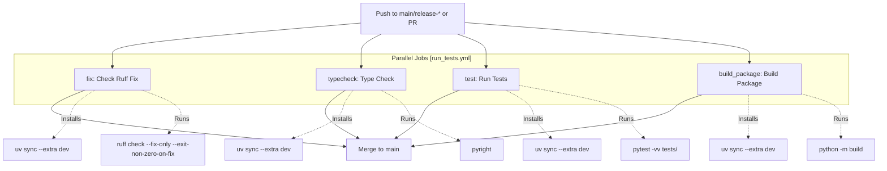
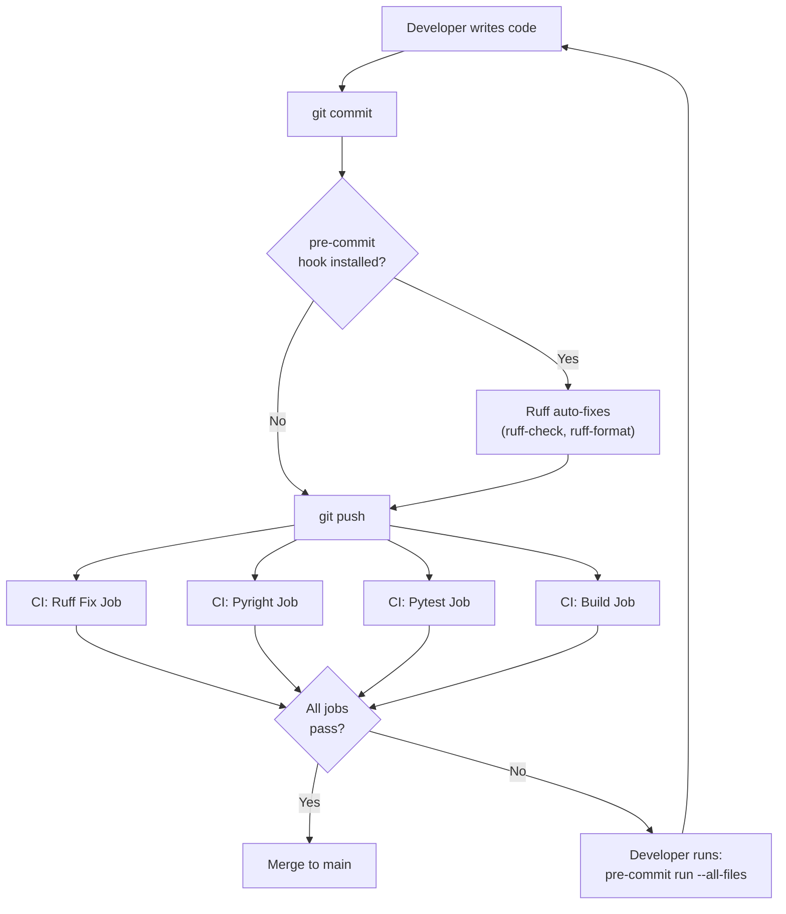
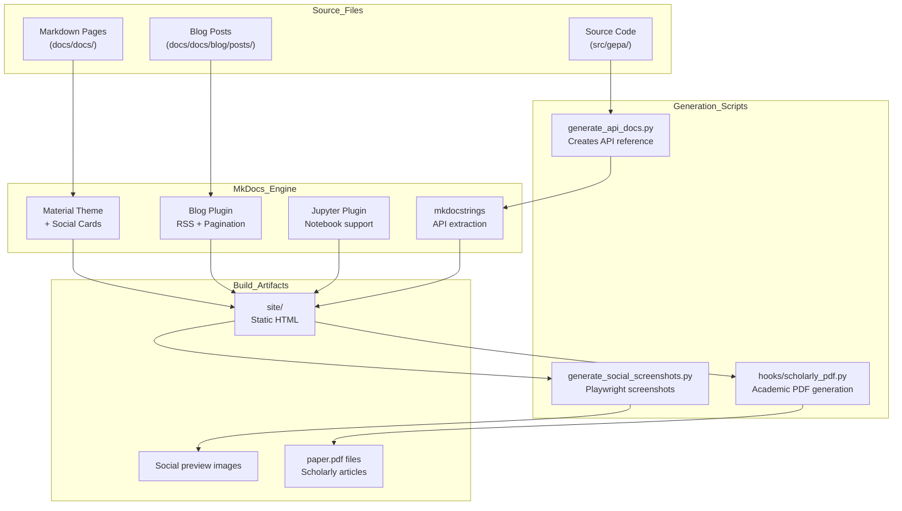
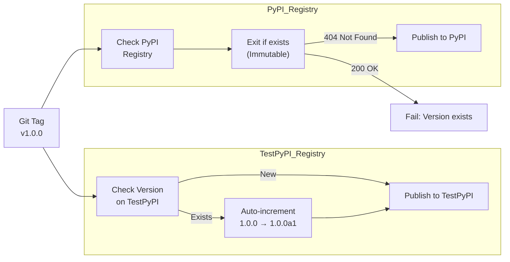

"examples/**/*.py" = ["E402"]
```

### Formatter Configuration

[pyproject.toml:126-131]() controls formatting behavior:

- **`docstring-code-format: false`**: Don't reformat code in docstrings (preserves examples).
- **`quote-style: "double"`**: Use double quotes for strings.
- **`indent-style: "space"`**: Use spaces, not tabs.
- **`skip-magic-trailing-comma: false`**: Respect trailing commas for line breaks.
- **`line-ending: "auto"`**: Detect from existing files.

### Import Sorting

[pyproject.toml:133-138]() configures import organization via `isort` and `flake8-tidy-imports`:

```python
[tool.ruff.lint.isort]
known-first-party = ["gepa"]       # GEPA's own modules
known-third-party = ["dspy"]       # Third-party dependencies

[tool.ruff.lint.flake8-tidy-imports]
ban-relative-imports = "all"       # Force absolute imports
```

Sources: [pyproject.toml:89-149]()

---

## Type Checking with Pyright

GEPA uses **Pyright** (Microsoft's static type checker) rather than mypy [pyproject.toml:50](). Pyright is faster and has better support for modern Python typing features.

### Type Checking Markers

[pyproject.toml:83-84]() declares type information presence:

```toml
[tool.setuptools.package-data]
gepa = ["py.typed"]
```

The `py.typed` marker file signals that GEPA exports type information, allowing downstream projects to type-check code that uses GEPA.

### Configuration and Exclusions

GEPA maintains a `pyrightconfig.json` to manage type checking scope [pyrightconfig.json:1-17]().

| Setting | Value | Purpose |
|---------|-------|---------|
| `include` | `["src"]` | Core source directory [pyrightconfig.json:2-4]() |
| `typeCheckingMode` | `"standard"` | Balanced type checking strictness [pyrightconfig.json:5]() |
| `exclude` | `["src/gepa/adapters/dspy_adapter", ...]` | Skip specific adapters and examples [pyrightconfig.json:6-16]() |

Exclusions are primarily used for adapters or examples that rely on complex external dependencies or dynamic code generation (like `dspy_full_program_adapter`) that are difficult to type check statically [pyrightconfig.json:7-16]().

### CI Integration

[.github/workflows/run_tests.yml:50-72]() shows the dedicated type checking job:

```yaml
typecheck:
  name: Type Check
  runs-on: ubuntu-latest
  steps:
    - uses: actions/checkout@v4
    - name: Run Pyright
      run: uv run -p .venv pyright
```

Type checking runs on Python 3.11 only [.github/workflows/run_tests.yml:57](), as type information is generally consistent across versions. Failures block merging to `main`.

Sources: [pyproject.toml:83-84](), [pyrightconfig.json:1-17](), [.github/workflows/run_tests.yml:50-72]()

---

## Pre-commit Hooks

GEPA uses pre-commit hooks for local development. The [pyproject.toml:64]() `dev` dependency group includes `pre-commit`.

### Hook Configuration

[.pre-commit-config.yaml:1-27]() defines the active hooks:

- **`ruff-check`**: Runs linting with `--fix` and `--exit-non-zero-on-fix` [.pre-commit-config.yaml:13-14]().
- **`ruff-format`**: Ensures consistent code style [.pre-commit-config.yaml:16]().
- **`check-yaml`**: Validates YAML syntax [.pre-commit-config.yaml:21]().
- **`check-added-large-files`**: Prevents accidental commits of large binaries (>3MB) [.pre-commit-config.yaml:24-25]().
- **`check-merge-conflict`**: Detects unresolved git merge markers [.pre-commit-config.yaml:26]().

### Local Usage

When auto-fixable issues are detected in CI, developers see this message [.github/workflows/run_tests.yml:40-47]():

```
❌ Ruff found issues that can be fixed automatically.
💡 To fix them locally, run:

    pre-commit run --all-files

Then commit and push the changes.
```

Sources: [.pre-commit-config.yaml:1-27](), [.github/workflows/run_tests.yml:39-48]()

---

## CI/CD Quality Enforcement

GEPA's CI/CD pipeline runs **four parallel jobs** on every push and pull request, ensuring comprehensive quality checks before code reaches `main`.

### Job Architecture


Sources: [.github/workflows/run_tests.yml:12-183]()

### Job 1: Ruff Fix Check

[.github/workflows/run_tests.yml:13-48]() implements the deliberate-failure pattern:

```yaml
fix:
  name: Check Ruff Fix
  steps:
    - name: Ruff Check
      run: |
        uv run -p .venv ruff check --fix-only --diff --exit-non-zero-on-fix || (
          ...
          exit 1
        )
```

**Key Flags**:
- `--fix-only`: Only apply auto-fixes, don't report unfixable issues.
- `--diff`: Show what would change.
- `--exit-non-zero-on-fix`: Exit 1 if any fixes were needed (causes CI failure).

### Job 3: Run Tests

[.github/workflows/run_tests.yml:74-105]() executes `pytest` across **five Python versions**:

```yaml
test:
  name: Run Tests
  strategy:
    matrix:
      python-version: ["3.10", "3.11", "3.12", "3.13", "3.14"]
  steps:
    - name: Run tests with pytest
      run: uv run -p .venv pytest -vv tests/
```

This matrix ensures GEPA works on all supported Python versions (3.10-3.14 as specified in [pyproject.toml:18]()).

### Job 4: Build Package

[.github/workflows/run_tests.yml:149-183]() verifies the package builds and installs correctly:

```yaml
build_package:
  name: Build Package
  steps:
    - name: Build
      run: uv run -p .venv python -m build
    - name: Install built package
      run: uv pip install dist/*.whl -p .venv
    - name: Test import gepa
      run: uv run -p .venv python -c "import gepa"
```

This job also ensures that optional dependencies like `dspy` do not introduce conflicting packages [.github/workflows/run_tests.yml:180-183]().

Sources: [.github/workflows/run_tests.yml:13-183]()

---

## Dependency Management with uv

All CI jobs use **uv** (Astral's fast Python package manager) with aggressive caching to speed up builds [.github/workflows/run_tests.yml:25-30]().

### Cache Configuration

[.github/workflows/run_tests.yml:25-30]() shows the cache setup:

```yaml
- name: Install uv with caching
  uses: astral-sh/setup-uv@v5
  with:
    enable-cache: true
    cache-dependency-glob: |
      **/pyproject.toml
      **/uv.lock
```

### Virtual Environment Strategy

Each job creates an isolated venv using `uv sync` [.github/workflows/run_tests.yml:36]():

```yaml
- name: Create and activate virtual environment
  run: |
    uv venv .venv --python 3.11
    echo "${{ github.workspace }}/.venv/bin" >> $GITHUB_PATH
- name: Install dependencies
  run: uv sync -p .venv --extra dev
```

Sources: [.github/workflows/run_tests.yml:24-36](), [uv.lock:1-13]()

---

## Code Quality Workflow


Sources: [.pre-commit-config.yaml:1-27](), [.github/workflows/run_tests.yml:1-183]()

---

## Key Configuration Entities

| Entity | File | Purpose |
|--------|------|---------|
| `[tool.ruff]` | [pyproject.toml:89]() | Ruff configuration root |
| `[tool.ruff.lint]` | [pyproject.toml:95]() | Linting rules and exclusions |
| `[tool.ruff.format]` | [pyproject.toml:126]() | Code formatting style |
| `[tool.pytest.ini_options]` | [pyproject.toml:86]() | Pytest configuration |
| `pre-commit` | [pyproject.toml:64]() | Local hook management tool |
| `uv` | [uv.lock:1]() | Dependency resolution and execution |
| `py.typed` | [pyproject.toml:84]() | PEP 561 marker for type information |

Sources: [pyproject.toml:50-149](), [uv.lock:1-13]()

# Documentation and Release Process


This page documents GEPA's documentation infrastructure and package release workflow. It covers the MkDocs-based documentation system, GitHub Actions CI/CD pipelines, version management strategy, and the dual-registry publishing process (TestPyPI and PyPI).

---

## Documentation Architecture

GEPA's documentation uses **MkDocs** with the Material theme, enhanced with custom scripts for API reference generation, scholarly PDF creation, and social media preview generation. The system supports multiple deployment targets and generates rich metadata for SEO and academic citation.

### Documentation Components

Title: Documentation Generation Pipeline

Sources: [docs/mkdocs.yml:1-13]()

**MkDocs Configuration**
The documentation system is configured via [docs/mkdocs.yml:1-135]() and uses the following key components:

| Component | Purpose | Configuration |
|--------|---------|---------------|
| `mkdocs-material` | Theme with social card generation | [docs/requirements.txt:3-4]() |
| `blog` plugin | Blog post management, RSS feed | [docs/mkdocs.yml:20-21]() |
| `mkdocstrings` | API documentation from docstrings | [docs/requirements.txt:7-8]() |
| `mkdocs-jupyter` | Render Jupyter notebooks | [docs/requirements.txt:12]() |
| `scholarly_pdf.py` | Custom hook for academic PDFs | [docs/mkdocs.yml:12]() |

Sources: [docs/mkdocs.yml:1-135](), [docs/requirements.txt:1-26]()

### API Documentation Generation

The `generate_api_docs.py` script creates API reference pages by introspecting the source code. It uses an `API_MAPPING` dictionary to define which modules and classes should be exposed [docs/scripts/generate_api_docs.py:20-119]().

**Key Features:**
- **Validation mode** (`--validate`): Checks that all items in `API_MAPPING` can be imported [docs/scripts/generate_api_docs.py:11-12]().
- **Categorization**: Groups APIs into categories like `optimize_anything`, `core`, `callbacks`, and `proposers` [docs/scripts/generate_api_docs.py:20-119]().
- **Nav Generation**: Integrates with the `nav` section of `mkdocs.yml` [docs/mkdocs.yml:43-132]().

The script is invoked during CI builds to ensure the documentation is always in sync with the source code:
```bash
python scripts/generate_api_docs.py --validate --skip-adapters  # Validation step
python scripts/generate_api_docs.py                              # Generation step
```
Sources: [docs/scripts/generate_api_docs.py:1-119](), [.github/workflows/docs.yml:71-79]()

### Rich Metadata and SEO

The documentation includes comprehensive metadata for discoverability and academic citation, implemented via template overrides in [docs/overrides/main.html:1-126]().

**Metadata Types:**
- **Open Graph / Twitter**: Social media previews including `og:image` and `twitter:card` [docs/overrides/main.html:25-48]().
- **Google Scholar**: Citation tags like `citation_author` and `citation_pdf_url` [docs/overrides/main.html:50-73]().
- **JSON-LD**: Structured data for search engines, supporting `ScholarlyArticle` and `BlogPosting` types [docs/overrides/main.html:77-114]().

Sources: [docs/overrides/main.html:1-126]()

### Social Preview Generation

Social media previews are automatically generated for all key pages during CI builds using Playwright.

**Workflow**:
1. After `mkdocs build`, the script `generate_social_screenshots.py` is executed [.github/workflows/docs.yml:93-96]().
2. Playwright captures screenshots of key pages (Home, Showcase, Blog, API) at 1200×630px [docs/scripts/generate_social_screenshots.py:43-51](), [docs/scripts/generate_social_screenshots.py:74-79]().
3. The script updates `og:image` and `twitter:image` tags in the built HTML files to point to these generated previews [docs/scripts/generate_social_screenshots.py:129-154]().

Sources: [.github/workflows/docs.yml:93-96](), [docs/scripts/generate_social_screenshots.py:1-169]()

---

## Release Process Workflow

GEPA uses a **git tag-based release process** that publishes to both TestPyPI (for validation) and PyPI (for production).

### Version Management Logic

Title: Release Pipeline Logic


The system allows iterating on the release process by auto-incrementing pre-release versions if the version already exists on TestPyPI. This prevents build failures due to immutable version constraints in the registry.

---

## Documentation Deployment

### Production Deployment (GitHub Pages)

The [.github/workflows/docs.yml:1-119]() workflow orchestrates the build and deployment to GitHub Pages.

| Step | Command / Action | Purpose |
|------|------------------|---------|
| Setup | `astral-sh/setup-uv@v5` | Fast Python environment setup with caching [.github/workflows/docs.yml:43-50]() |
| Install GEPA | `uv pip install -e ".[full]"` | Install package for API introspection [.github/workflows/docs.yml:57-59]() |
| API Generation | `python scripts/generate_api_docs.py` | Create reference MD files [.github/workflows/docs.yml:76-79]() |
| Build | `mkdocs build` | Generate static HTML with `SCHOLARLY_PDF=1` [.github/workflows/docs.yml:86-91]() |
| Social | `python scripts/generate_social_screenshots.py` | Generate preview cards [.github/workflows/docs.yml:93-96]() |
| Deploy | `actions/deploy-pages@v4` | Push to GitHub Pages [.github/workflows/docs.yml:116-119]() |

Sources: [.github/workflows/docs.yml:1-119]()

### Scholarly PDF Creation

Academic-style PDFs are generated for blog posts and articles using the `scholarly_pdf.py` hook [docs/mkdocs.yml:12](). 

**Requirements**:
- Frontmatter must contain `citation_authors` [docs/docs/blog/posts/2026-02-18-introducing-optimize-anything/index.md:26-39]().
- Environment variable `SCHOLARLY_PDF=1` must be set during build [.github/workflows/docs.yml:91]().

The hook uses Playwright to render the page and save it as `paper.pdf` in the corresponding directory. This is referenced in metadata via `citation_pdf_url` [docs/overrides/main.html:65]().

Sources: [docs/mkdocs.yml:11-12](), [docs/overrides/main.html:50-73](), [.github/workflows/docs.yml:86-91]()

---

## Summary of Key Documentation Paths

| Path | Description |
|------|-------------|
| `docs/docs/` | Main Markdown content [docs/mkdocs.yml:9]() |
| `docs/docs/blog/` | Blog posts and assets [docs/mkdocs.yml:20-21]() |
| `docs/scripts/` | Documentation automation scripts (API, Social) |
| `docs/overrides/` | Custom HTML templates for Material theme [docs/overrides/main.html:1]() |
| `docs/hooks/` | MkDocs build hooks (PDF generation) [docs/mkdocs.yml:12]() |

Sources: [docs/mkdocs.yml:1-135](), [docs/overrides/main.html:1-126]()