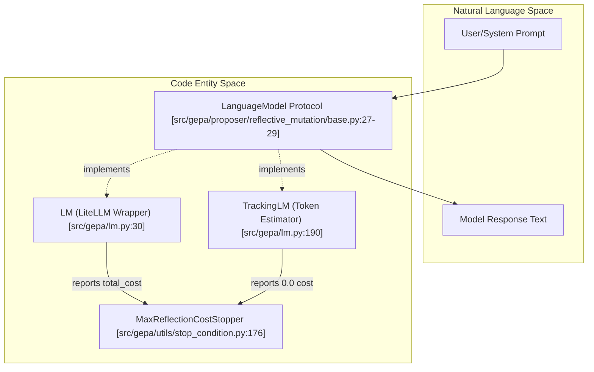
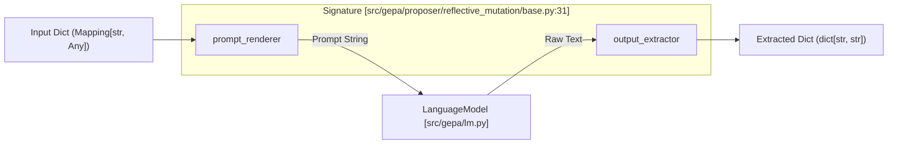
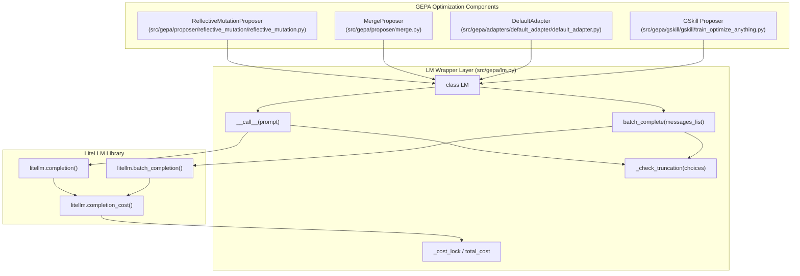

## Purpose and Scope

This page documents GEPA's language model abstraction layer and prompt/response handling infrastructure. It provides a uniform interface for the reflective optimization loop to interact with diverse LLM providers while maintaining structured input/output parsing.

1.  **The `LM` wrapper class** — A thin abstraction over LiteLLM providing retry logic, truncation detection, and parallel execution via `batch_complete()`.
2.  **The `Signature` system** — A prompt template abstraction defining how to render prompts from structured inputs and extract structured outputs from LLM responses.
3.  **Instruction proposal signatures** — Specialized signature implementations used during reflective mutation to generate improved candidate text.

For information about how LMs are used in the optimization loop, see the Reflective Mutation Proposer documentation ([Reflective Mutation Proposer](#4.4.1)). For adapter-level LM usage patterns, see the Adapter System section ([Adapter System](#5)).

---

## The Language Model Protocol

GEPA defines a minimal protocol for language models that all reflection LMs must satisfy. This ensures that the engine can interact with standard LiteLLM models, custom local models, or mocked models during testing.

### Natural Language Space to Code Entity Space

The following diagram bridges the conceptual "Language Model" used in optimization theory with the specific code entities in GEPA.

**Diagram: LM Abstraction Hierarchy**

**Sources:** [src/gepa/proposer/reflective_mutation/base.py:27-29](), [src/gepa/lm.py:30-41](), [src/gepa/lm.py:190-205](), [src/gepa/utils/stop_condition.py:176-191]()

The protocol requires a `__call__` method accepting either a string prompt or a list of chat dictionaries and returning a string response [src/gepa/proposer/reflective_mutation/base.py:27-29]().

---

## LM Wrapper Class

The `LM` class is GEPA's default implementation, providing a production-ready wrapper over LiteLLM with automatic retry handling, truncation warnings, and parallel batch execution [src/gepa/lm.py:30-41]().

### Construction and Usage
```python
from gepa.lm import LM

lm = LM(model="openai/gpt-4o", temperature=0.7, max_tokens=4096)
response = lm("Improve this code...") # String prompt
```
The constructor forwards extra keyword arguments directly to `litellm.completion`, allowing for provider-specific parameters like `top_p` or `api_base` [src/gepa/lm.py:67-71]().

### Cost and Token Tracking
The `LM` class maintains thread-safe counters for usage and cost [src/gepa/lm.py:62-65]():
- `total_cost`: Cumulative USD cost calculated via `litellm.completion_cost` [src/gepa/lm.py:73-76]().
- `total_tokens_in` / `total_tokens_out`: Cumulative token usage [src/gepa/lm.py:79-86]().

For details on configuration and parallel execution, see [LM Wrapper Class](#6.1).

**Sources:** [src/gepa/lm.py:30-181](), [src/test_reflection_cost_tracking.py:13-80]()

---

## Signature Abstraction

The `Signature` dataclass defines a reusable pattern for LLM interactions: structured input rendering → LLM call → structured output extraction [src/gepa/proposer/reflective_mutation/base.py:31-64]().

**Diagram: Signature Execution Flow**

**Sources:** [src/gepa/proposer/reflective_mutation/base.py:31-50](), [src/gepa/lm.py:96-131]()

### Execution Methods
- **`run()`**: The primary entry point that orchestrates the rendering, calling, and extraction [src/gepa/proposer/reflective_mutation/base.py:45-50]().
- **`run_with_metadata()`**: Returns the extracted output along with the rendered prompt and raw response, which is essential for `ExperimentTracker` logging [src/gepa/proposer/reflective_mutation/base.py:52-64]().

For details on implementing custom signatures, see [Signature System](#6.2).

---

## Instruction Proposal Signatures

GEPA uses specialized `Signature` subclasses during reflective mutation to generate improved candidate text based on Actionable Side Information (ASI) [src/gepa/optimize_anything.py:82-88]().

### Reflective Mutation Workflow
1. **ASI Collection**: The `Evaluator` captures diagnostic feedback via `oa.log()` [src/gepa/optimize_anything.py:56-59]().
2. **Prompt Construction**: Specialized signatures like `InstructionProposalSignature` incorporate these logs into the prompt.
3. **Proposal Generation**: The reflection LM proposes modifications to specific `Candidate` components (e.g., changing a prompt or a hyperparameter) [src/gepa/optimize_anything.py:77-81]().

For details, see [Instruction Proposal Signatures](#6.3).

---

## Tracking and Budgeting

GEPA provides mechanisms to monitor and limit LM usage during optimization to prevent unexpected costs.

- **`TrackingLM`**: When a plain callable is provided as a reflection model, GEPA wraps it in `TrackingLM` to estimate token counts based on string length (~4 chars/token) [src/gepa/lm.py:190-205]().
- **`MaxReflectionCostStopper`**: Terminates the optimization loop once the cumulative USD cost of the reflection LM exceeds a specified budget [src/gepa/utils/stop_condition.py:176-191]().

**Sources:** [src/gepa/lm.py:190-220](), [src/gepa/utils/stop_condition.py:176-191](), [src/test_reflection_cost_tracking.py:142-174]()

---

## Child Pages

- [LM Wrapper Class](#6.1) — Document LM class: LiteLLM integration, retry logic, truncation detection, and batch_complete() for parallel execution
- [Signature System](#6.2) — Explain Signature abstraction: prompt_renderer, output_extractor, run() method, and Signature subclassing patterns
- [Instruction Proposal Signatures](#6.3) — Document InstructionProposalSignature, ToolProposer, and other specialized signature implementations for reflection

# LM Wrapper Class


The `LM` class provides a lightweight abstraction over [LiteLLM](https://github.com/BerriAI/litellm) for unified language model interaction across GEPA. It handles retries, truncation detection, parallel execution, cost tracking, and cross-model compatibility through a consistent interface.

**Scope**: This page documents the `LM` wrapper class implementation. For higher-level signature abstraction (prompt construction and output parsing), see [Signature System](6.2). For reflection-specific signature usage, see [Instruction Proposal Signatures](6.3).

---

## Overview

The `LM` class is defined in [src/gepa/lm.py:30-181]() and serves as GEPA's standard language model interface. It conforms to the `LanguageModel` protocol (`(str | list[dict]) -> str`) used throughout the system for reflection, proposal generation, and refinement.

**Key responsibilities:**
- **Normalize prompt formats**: Handles both raw strings and structured chat messages [src/gepa/lm.py:96-102]().
- **Automatic retries**: Uses LiteLLM's `num_retries` with exponential backoff [src/gepa/lm.py:107]().
- **Truncation detection**: Logs a warning when `finish_reason='length'` is detected [src/gepa/lm.py:88-94]().
- **Parallel batch execution**: Efficiently runs multiple completions via `batch_complete()` [src/gepa/lm.py:133-181]().
- **Cost and Token Tracking**: Accumulates USD cost and token usage across all calls [src/gepa/lm.py:115-129]().
- **Cross-model compatibility**: Uses `drop_params=True` so unsupported parameters are silently ignored [src/gepa/lm.py:108]().

**Sources:** [src/gepa/lm.py:1-181](), [src/gepa/proposer/reflective_mutation/base.py:135]()

---

## Architecture

The following diagram illustrates how the `LM` wrapper bridges high-level GEPA components with the underlying LiteLLM library and model providers.

### GEPA to Code Entity Space: LM Integration

**Sources:** [src/gepa/lm.py:30-181](), [src/gepa/adapters/default_adapter/default_adapter.py:87-104](), [src/gepa/gskill/gskill/train_optimize_anything.py:138-142]()

---

## Initialization

The `LM` constructor configures model selection and global completion parameters:

```python
def __init__(
    self,
    model: str,
    temperature: float | None = None,
    max_tokens: int | None = None,
    num_retries: int = 3,
    **kwargs: Any,
):
```

**Parameters:**

| Parameter | Type | Default | Description |
|-----------|------|---------|-------------|
| `model` | `str` | *required* | LiteLLM model identifier (e.g., `"openai/gpt-4.1"`, `"anthropic/claude-3-5-sonnet"`) |
| `temperature` | `float \| None` | `None` | Sampling temperature; omitted from request if `None` |
| `max_tokens` | `int \| None` | `None` | Maximum tokens to generate; omitted if `None` |
| `num_retries` | `int` | `3` | Number of retry attempts on transient failures |
| `**kwargs` | `Any` | — | Extra parameters forwarded to `litellm.completion()` (e.g., `top_p`, `stop`, `api_key`) |

**Sources:** [src/gepa/lm.py:52-71](), [tests/test_lm.py:14-35]()

---

## Calling Interface

### Single-Call Interface
The `LM` instance is callable and accepts either a string or a list of chat messages [src/gepa/lm.py:96]().

```python
def __call__(self, prompt: str | list[dict[str, Any]]) -> str:
```

- **String Input**: Automatically wrapped into a user message: `[{"role": "user", "content": prompt}]` [src/gepa/lm.py:99-100]().
- **Chat Messages**: Passed directly to the model [src/gepa/lm.py:102]().

### Batch Execution
The `batch_complete()` method enables parallel execution of multiple prompts using `litellm.batch_completion` [src/gepa/lm.py:133-134]().

```python
def batch_complete(
    self, 
    messages_list: list[list[dict[str, Any]]], 
    max_workers: int = 10, 
    **kwargs: Any
) -> list[str]:
```

**Implementation Details:**
- **Parallelism**: Managed via `max_workers` [src/gepa/lm.py:154]().
- **Keyword Merging**: Call-time `kwargs` override initial `completion_kwargs` [src/gepa/lm.py:150-157]().
- **Cleanup**: Response strings are stripped of leading/trailing whitespace [src/gepa/lm.py:166]().

**Sources:** [src/gepa/lm.py:96-131](), [src/gepa/lm.py:133-181](), [tests/test_lm.py:98-166]()

---

## Cost and Token Tracking

The `LM` class maintains cumulative statistics for monitoring and budget control.

### Attributes
- `total_cost`: Cumulative USD cost of all successful calls [src/gepa/lm.py:73-76]().
- `total_tokens_in`: Cumulative input (prompt) tokens [src/gepa/lm.py:78-81]().
- `total_tokens_out`: Cumulative output (completion) tokens [src/gepa/lm.py:83-86]().

### Thread Safety
Cost accumulation is protected by a `threading.Lock` to ensure accuracy during parallel batch calls or multi-threaded optimization [src/gepa/lm.py:65](), [src/gepa/lm.py:126-129](), [src/gepa/lm.py:177-180]().

### TrackingLM Wrapper
For custom callables that do not use LiteLLM, GEPA provides `TrackingLM` [src/gepa/lm.py:190-221](). It estimates token usage based on string length (~4 characters per token) and reports `0.0` cost [src/gepa/lm.py:195](), [tests/test_reflection_cost_tracking.py:83-116]().

**Sources:** [src/gepa/lm.py:62-86](), [src/gepa/lm.py:190-221](), [tests/test_reflection_cost_tracking.py:13-80]()

---

## Error and Truncation Handling

### Truncation Detection
The `_check_truncation` method inspects the `finish_reason` of model responses. If a response is cut off due to token limits, it logs a warning recommending a higher `max_tokens` setting [src/gepa/lm.py:88-94]().

### Budget Enforcement
The `MaxReflectionCostStopper` uses the `LM.total_cost` attribute to terminate optimization if a pre-defined USD budget is exceeded [src/gepa/utils/stop_condition.py:176-191]().

```python
# src/gepa/utils/stop_condition.py:188-190
def __call__(self, gepa_state: GEPAState) -> bool:
    cost = getattr(self._reflection_lm, "total_cost", 0.0)
    return cost >= self.max_reflection_cost_usd
```

**Sources:** [src/gepa/lm.py:88-94](), [src/gepa/utils/stop_condition.py:176-191](), [tests/test_reflection_cost_tracking.py:142-174]()

---

## Integration in GEPA

### Adapter Usage
Adapters like `DefaultAdapter` use `LM` for evaluating candidates [src/gepa/adapters/default_adapter/default_adapter.py:98]().

```python