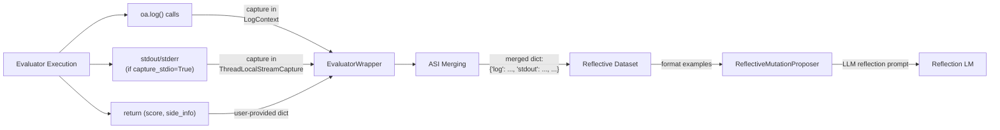
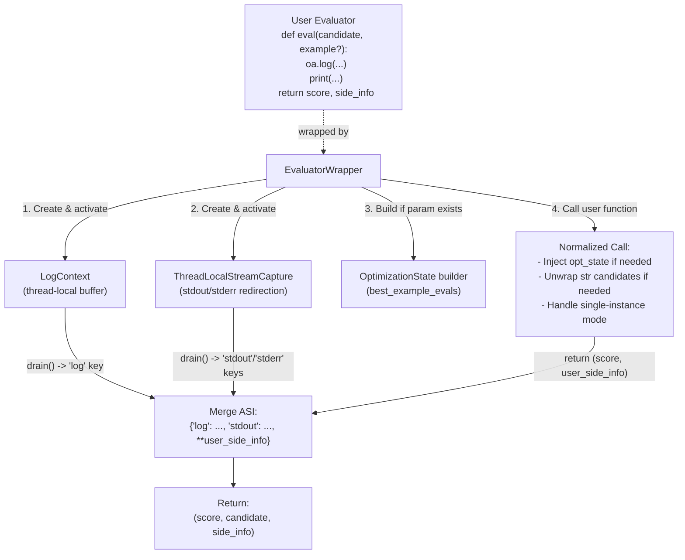
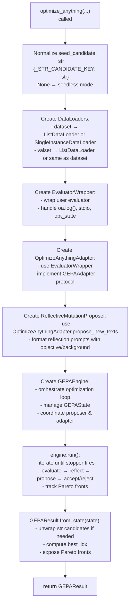

def evaluator(
    candidate: str | dict[str, str],
    example: Any,
    opt_state: OptimizationState = None  # optional injection
) -> float | tuple[float, SideInfo]:
    ...
```

### Return Values

| Return Type | Description |
|-------------|-------------|
| `float` | Score only (higher is better). |
| `tuple[float, dict]` | Score and side information (ASI). |

### Optional Parameter Injection

The evaluator may declare optional keyword parameters that GEPA injects automatically, such as `opt_state` for historical context [src/gepa/optimize_anything.py:233-256]().

Sources: [src/gepa/optimize_anything.py:385-408](), [src/gepa/adapters/optimize_anything_adapter/optimize_anything_adapter.py:233-296]()

---

## Actionable Side Information (ASI)

ASI is the text-optimization analogue of gradients. Where gradients tell an optimizer *which direction to move*, ASI tells the LLM proposer *why a candidate failed* and *how to fix it* [src/gepa/optimize_anything.py:83-88]().



**ASI Flow: Evaluator → Wrapper → Reflective Dataset → LLM Proposer**

### ASI Structure

ASI is a `dict[str, Any]` with conventional keys like `"log"`, `"stdout"`, and `"scores"` [src/gepa/optimize_anything.py:171-230]().

### Image Support

ASI supports including images for VLM reflection via the `gepa.Image` class [src/gepa/optimize_anything.py:131](), [src/gepa/image.py:1-10]().

Sources: [src/gepa/optimize_anything.py:83-88](), [src/gepa/adapters/optimize_anything_adapter/optimize_anything_adapter.py:76-147]()

---

## Logging and Diagnostics

### 1. `oa.log()` — In-Evaluator Logging

Thread-safe print-like function that captures output into the `"log"` key of side_info [src/gepa/optimize_anything.py:260-377]().

### 2. Stdout/Stderr Capture

When `capture_stdio=True` in `EngineConfig`, `sys.stdout` and `sys.stderr` are redirected into side_info [src/gepa/optimize_anything.py:611-650](). Uses `ThreadLocalStreamCapture` [src/gepa/utils/stdio_capture.py:1-20]().

Sources: [src/gepa/optimize_anything.py:260-377](), [src/gepa/utils/stdio_capture.py:1-237]()

---

## EvaluatorWrapper Architecture

The `EvaluatorWrapper` class bridges user-defined evaluators to GEPA's internal `GEPAAdapter` protocol [src/gepa/optimize_anything.py:419-425]().



**EvaluatorWrapper Lifecycle**
Sources: [src/gepa/optimize_anything.py:419-545](), [src/gepa/adapters/optimize_anything_adapter/optimize_anything_adapter.py:233-296]()

---

## Stopping Conditions and Cost Tracking

The `optimize_anything` API supports various stopping conditions to manage budgets and execution time.

### Stopper Protocol
Stoppers are callables that return `True` when optimization should terminate [src/gepa/utils/stop_condition.py:14-31](). Common implementations include:
- `MaxMetricCallsStopper`: Stops after N evaluator calls [src/gepa/utils/stop_condition.py:163-174]().
- `TimeoutStopCondition`: Stops after a time limit [src/gepa/utils/stop_condition.py:34-43]().
- `MaxReflectionCostStopper`: Stops once the reflection LM cumulative cost reaches a USD budget [src/gepa/utils/stop_condition.py:176-191]().

### LM Cost Tracking
The `LM` wrapper tracks cumulative USD cost and token counts (input/output) across all calls [src/gepa/lm.py:60-87](). For custom callables, `TrackingLM` estimates usage based on string length (~4 chars/token) but reports zero cost [src/gepa/lm.py:190-210]().

Sources: [src/gepa/utils/stop_condition.py:1-210](), [src/gepa/lm.py:30-210]()

---

## Configuration Hierarchy

The `optimize_anything` API accepts a `GEPAConfig` object composing specialized sub-configs [src/gepa/optimize_anything.py:654-811]():

| Config Class | Purpose |
|--------------|---------|
| `EngineConfig` | Loop control (`max_metric_calls`, `seed`) [src/gepa/optimize_anything.py:611-650](). |
| `ReflectionConfig` | LLM settings (`reflection_lm`, `batch_sampler`) [src/gepa/optimize_anything.py:654-665](). |
| `TrackingConfig` | Experiment logging (`use_wandb`) [src/gepa/optimize_anything.py:675-688](). |

Sources: [src/gepa/optimize_anything.py:654-811]()

---

## Internal Execution Flow



**optimize_anything Execution Pipeline**
Sources: [src/gepa/optimize_anything.py:610-815](), [src/gepa/core/engine.py:254-653]()