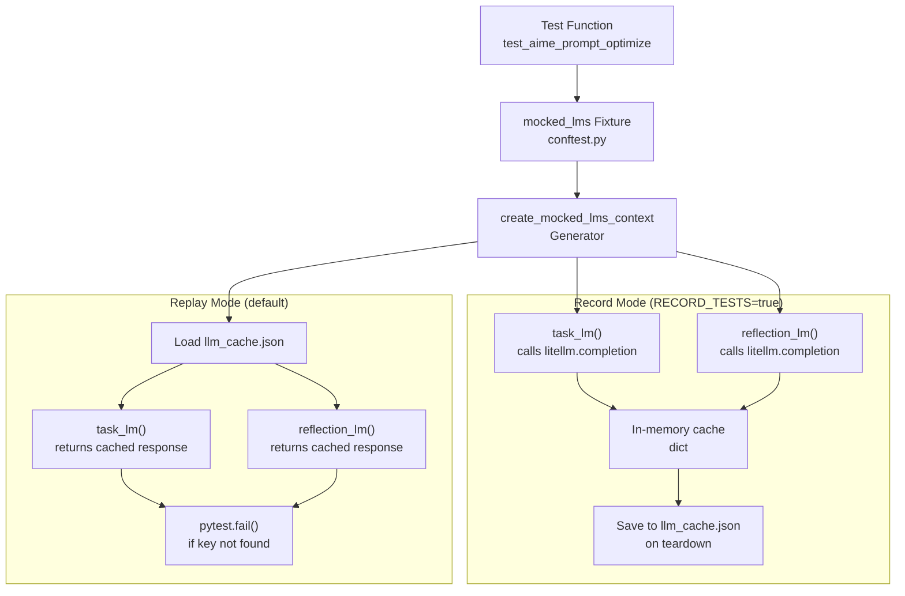
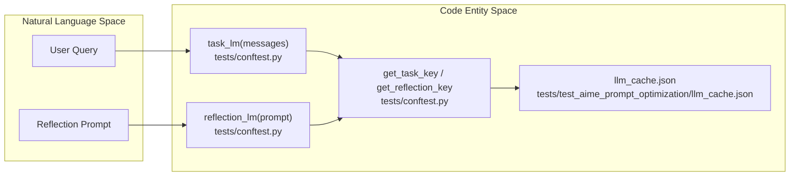
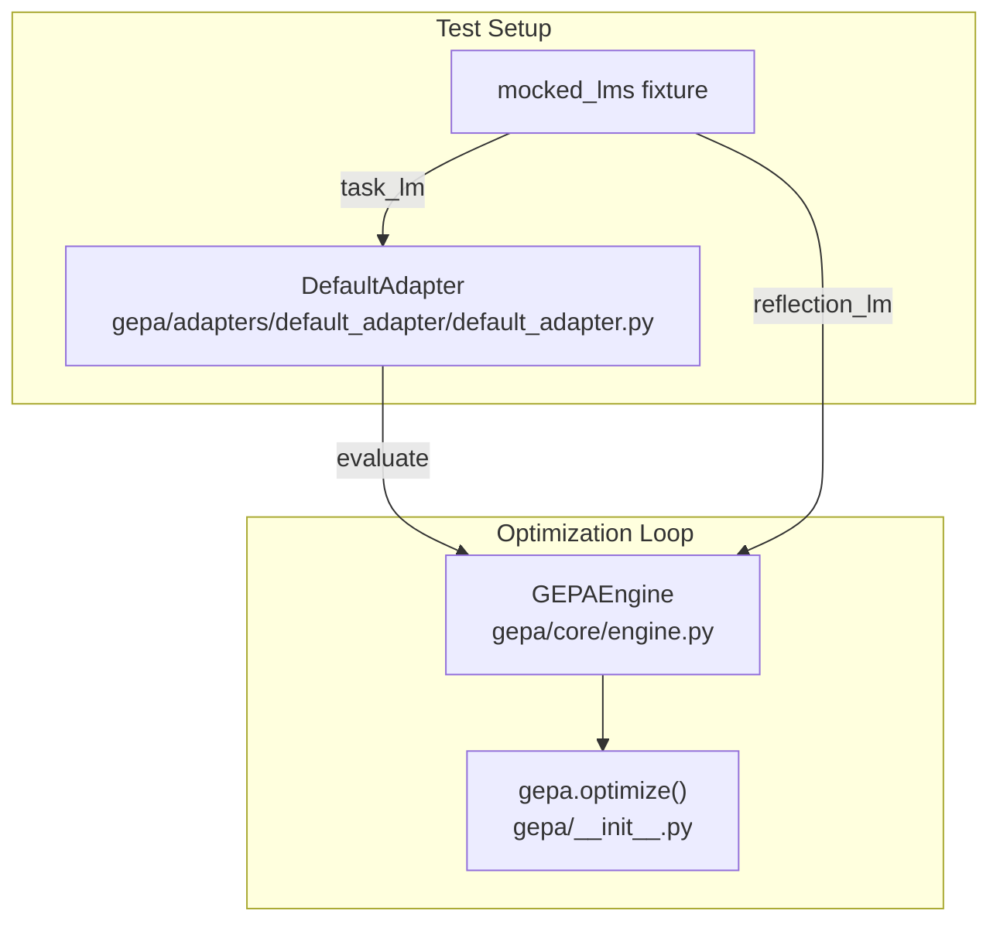

gepa_result = gepa.optimize(
    seed_candidate=seed_prompt,
    trainset=trainset,
    valset=valset,
    adapter=DefaultAdapter(model=task_lm, evaluator=evaluator),
    reflection_lm=reflection_lm,
    frontier_type="objective",
    max_metric_calls=32,
)
```

Sources: [[tests/test_pareto_frontier_types/test_pareto_frontier_types.py:61-90]](), [[tests/test_pareto_frontier_types/test_pareto_frontier_types.py:100-110]]()

# Testing with LLM Mocking


## Purpose and Scope

This page documents GEPA's testing infrastructure for deterministic, reproducible tests that involve LLM interactions. The record/replay pattern enables fast CI/CD pipelines without requiring live API calls while ensuring test behavior matches production LLM responses.

For information about the overall testing infrastructure and CI/CD setup, see [Testing Infrastructure](9.2) and [CI/CD Pipeline](9.3). For adapter-specific testing patterns, see [Creating Custom Adapters](5.10).

---

## Overview: Why Mock LLMs?

GEPA's optimization process involves numerous LLM calls for both task execution and reflection-based mutations. Testing this functionality presents challenges:

| Challenge | Solution |
|-----------|----------|
| **Non-determinism** | LLM responses vary between runs | Cache deterministic responses |
| **API Costs** | Thousands of test calls accumulate expenses | Replay cached responses |
| **CI/CD Speed** | Network latency slows test suites | Use local cache files |
| **Reproducibility** | Hard to debug flaky test failures | Deterministic cached outputs |

GEPA implements a **record/replay pattern** where tests can operate in two modes:
- **Record mode**: Makes actual API calls and saves responses via `litellm`.
- **Replay mode**: Uses cached responses from `llm_cache.json` for deterministic testing.

---

## Architecture: Record/Replay System

The record/replay logic is encapsulated in the `create_mocked_lms_context` generator, which is exposed to tests through the `mocked_lms` pytest fixture.

### Data Flow for Mocked LLMs



**Sources**: [tests/conftest.py:9-86]()

---

## The mocked_lms Fixture

The `mocked_lms` fixture provides two callable functions that transparently handle record/replay logic. It requires a `recorder_dir` fixture to specify where the `llm_cache.json` file resides.

### System to Code Mapping: LM Mocking



### Function Signatures

| Function | Input | Output | Usage |
|----------|-------|--------|-------|
| `task_lm(messages)` | List of message dicts | String response | Adapter LLM calls during evaluation |
| `reflection_lm(prompt)` | String prompt | String response | Reflection-based mutation proposals |

### Key Generation Strategy

Both functions use deterministic key generation to ensure consistent cache lookups:

- **task_lm**: `("task_lm", json.dumps(messages, sort_keys=True))` [tests/conftest.py:26-30]()
- **reflection_lm**: `("reflection_lm", prompt)` [tests/conftest.py:32-34]()

The `sort_keys=True` parameter ensures message dicts produce canonical JSON representations, making keys deterministic regardless of dict insertion order.

**Sources**: [tests/conftest.py:26-34](), [tests/conftest.py:88-96]()

---

## Using the Fixture in Tests

### Optimization Flow with Mocking



### Example: AIME Prompt Optimization Test

The test demonstrates how to unpack the fixture and pass the mocked LMs into the `gepa.optimize` API.

```python
def test_aime_prompt_optimize(mocked_lms, recorder_dir):
    # Unpack the two LM functions
    task_lm, reflection_lm = mocked_lms
    
    # Configure adapter with mocked task_lm
    adapter = DefaultAdapter(model=task_lm)
    
    # Run optimization with mocked LLMs
    gepa_result = gepa.optimize(
        seed_candidate=seed_prompt,
        trainset=trainset,
        valset=valset,
        adapter=adapter,
        reflection_lm=reflection_lm,  # Mocked reflection LM
        max_metric_calls=30,
    )
```

**Sources**: [tests/test_aime_prompt_optimization/test_aime_prompt_optimize.py:19-50]()

---

## Recording New Test Responses

### Running Tests in Record Mode

To generate new cached responses or update existing ones, set the `RECORD_TESTS` environment variable:

```bash
# Set environment variable to enable recording
RECORD_TESTS=true pytest tests/test_aime_prompt_optimization/
```

### Record Mode Behavior

1. **Lazy Import**: `litellm` is only imported when `should_record` is true [tests/conftest.py:39]().
2. **API Call**: Calls `litellm.completion` with a hardcoded model (e.g., `openai/gpt-4.1-nano` for tasks) [tests/conftest.py:46]().
3. **Persistence**: The in-memory `cache` dictionary is dumped to `llm_cache.json` upon fixture teardown [tests/conftest.py:61-62]().

### File Structure

The `llm_cache.json` file contains a flat dictionary mapping stringified tuples (keys) to string responses.

```json
{
  "('task_lm', '[{\"content\": \"...\", \"role\": \"system\"}, {\"content\": \"...\", \"role\": \"user\"}]')": "Step-by-step solution...",
  "('reflection_lm', 'Analyze this prompt...')": "Proposed improvement..."
}
```

**Sources**: [tests/conftest.py:37-62](), [tests/test_aime_prompt_optimization/llm_cache.json:1-40]()

---

## Replay Mode (Default)

### Standard Test Execution

Without the `RECORD_TESTS` environment variable, tests run in replay mode. If a key is not found in the cache, the test fails immediately using `pytest.fail()` to prevent accidental live API calls in CI [tests/conftest.py:71, 76, 82]().

### Benefits of Replay Mode

| Benefit | Description |
|---------|-------------|
| **Speed** | No network latency; tests run in seconds despite complex optimization loops. |
| **Determinism** | Identical responses guarantee reproducible Pareto frontiers and candidate lineage. |
| **Cost** | Zero API charges for CI/CD pipeline runs. |
| **Offline** | Tests run without internet connectivity. |

**Sources**: [tests/conftest.py:64-85]()

---

## Golden File Testing Pattern

In addition to caching LLM responses, GEPA tests often save "golden" output files for regression testing. This ensures that the optimization logic itself hasn't drifted.

### Implementation Logic

Tests check the `RECORD_TESTS` flag to decide whether to overwrite or assert against the golden file:

```python
    # In record mode, we save the "golden" result
    if os.environ.get("RECORD_TESTS", "false").lower() == "true":
        with open(optimized_prompt_file, "w") as f:
            f.write(best_prompt)
    # In replay mode, we assert against the golden result
    else:
        with open(optimized_prompt_file) as f:
            expected_prompt = f.read()
        assert best_prompt == expected_prompt
```

**Sources**: [tests/test_aime_prompt_optimization/test_aime_prompt_optimize.py:57-69]()

---

## Deterministic Testing Strategies

Beyond record/replay, GEPA utilizes other deterministic strategies:

1. **RNG Seeding**: A `rng` fixture provides a `random.Random(42)` instance to ensure deterministic sampling in proposers [tests/conftest.py:98-100]().
2. **Instruction Proposal Testing**: `InstructionProposalSignature` is tested using unit tests with fixed LLM outputs to verify extraction logic [tests/test_instruction_proposal.py:9-103]().
3. **Mocking State**: State initialization and persistence are tested using `MagicMock` for loggers and temporary directories for run storage [tests/test_state.py:22-116]().
4. **Adapter Mocks**: Custom adapters like `MCPAdapter` or `DSPyAdapter` are tested using mock clients or model callables to simulate server responses [tests/test_mcp_adapter.py:82-143]().

**Sources**: [tests/conftest.py:98-100](), [tests/test_instruction_proposal.py:9-103](), [tests/test_state.py:22-116](), [tests/test_mcp_adapter.py:82-143]()

---

## Troubleshooting

### Common Issues

| Error | Cause | Solution |
|-------|-------|----------|
| `Cache file not found` | Missing `llm_cache.json` | Run with `RECORD_TESTS=true pytest <test_path>` to generate it. |
| `Unseen input for task_lm` | The test input changed (e.g., modified prompt or data) | Re-record the test to update the cache. |
| `Unseen input for reflection_lm` | The reflection prompt or context changed | Re-record the test. |

**Sources**: [tests/conftest.py:71, 76, 82]()