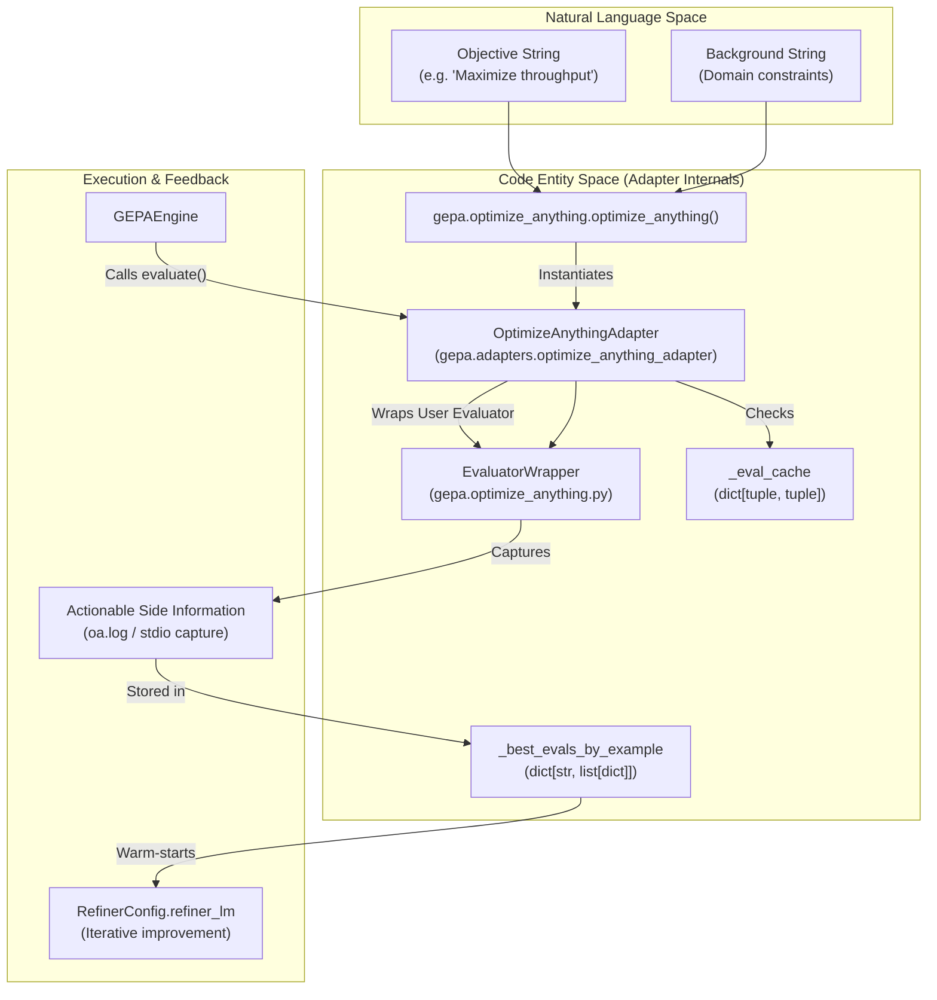
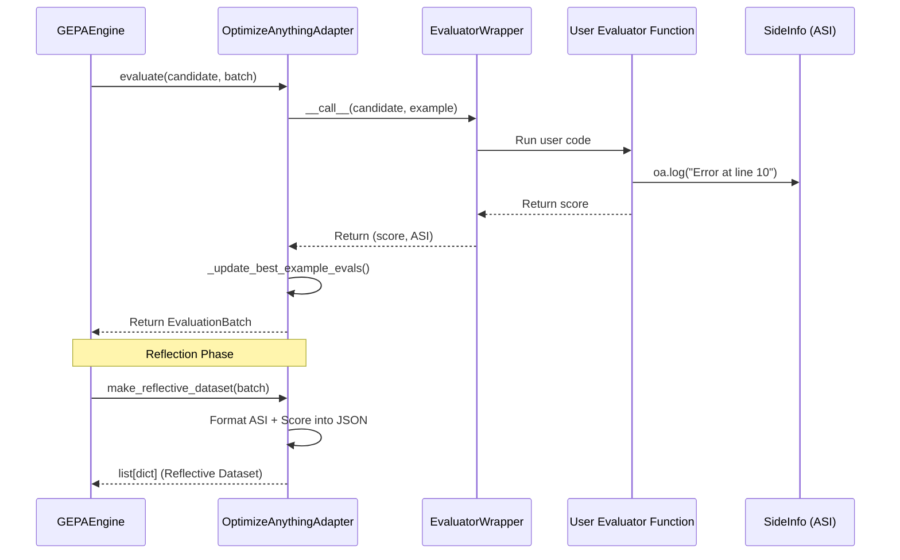

## Purpose and Scope

`OptimizeAnythingAdapter` is the concrete `GEPAAdapter` implementation that powers the `optimize_anything()` API [src/gepa/optimize_anything.py:124](). It bridges user-provided evaluator functions with GEPA's internal engine, handling evaluation execution, result caching, and candidate refinement [src/gepa/adapters/optimize_anything_adapter/optimize_anything_adapter.py:1-13]().

Unlike domain-specific adapters, `OptimizeAnythingAdapter` is designed to be **universal**. It accepts arbitrary user-defined evaluator callables and transparently instruments them with Actionable Side Information (ASI) capture via `oa.log()`, stdio redirection, and `OptimizationState` injection [src/gepa/optimize_anything.py:107-152](). It supports three primary optimization paradigms: single-task search, multi-task search, and generalization [src/gepa/optimize_anything.py:22-43]().

---

## Architecture and Data Flow

`OptimizeAnythingAdapter` sits between the high-level `optimize_anything()` API and the low-level `GEPAEngine`. It manages the lifecycle of candidate evaluation and feedback loop construction.

### System Components and Code Entities

The following diagram illustrates how natural language objectives are transformed into optimized code artifacts through the adapter's internal machinery.

**Sources:** [src/gepa/optimize_anything.py:1-106](), [src/gepa/adapters/optimize_anything_adapter/optimize_anything_adapter.py:56-104]()

---

## Key Implementation Details

### Evaluator Instrumentation

The adapter uses an internal `EvaluatorWrapper` to add GEPA-specific features to standard Python functions. This wrapper handles:

1.  **ASI Capture**: Intercepts `oa.log()` calls and stores them in `side_info["log"]` [src/gepa/optimize_anything.py:58-59]().
2.  **Stdio Redirection**: If enabled via `EngineConfig`, it uses `ThreadLocalStreamCapture` to grab `print()` output [src/gepa/optimize_anything.py:151](), [src/gepa/utils/stdio_capture.py:151-152]().
3.  **State Injection**: If the evaluator accepts an `opt_state` argument, the adapter injects an `OptimizationState` object containing historical best evaluations for the current task [src/gepa/optimize_anything.py:100-103]().

### Evaluation Caching

To prevent redundant LLM calls or expensive computations, `OptimizeAnythingAdapter` implements a multi-mode cache system [src/gepa/adapters/optimize_anything_adapter/optimize_anything_adapter.py:74-76]():

*   **Memory Cache**: Stores results in a dictionary `_eval_cache` [src/gepa/adapters/optimize_anything_adapter/optimize_anything_adapter.py:92]().
*   **Disk Cache**: Persists results as `.pkl` files in a `fitness_cache` directory using SHA256 hashes of the candidate and example as keys [src/gepa/adapters/optimize_anything_adapter/optimize_anything_adapter.py:97-100](), [src/gepa/adapters/optimize_anything_adapter/optimize_anything_adapter.py:130-151]().

### Candidate Refinement

When a `RefinerConfig` is provided, the adapter performs local iterative improvement. After a candidate is evaluated, the `refiner_lm` is called with the `REFINER_PROMPT_TEMPLATE`, the current candidate, and the evaluation history to produce a refined version before returning to the engine [src/gepa/adapters/optimize_anything_adapter/optimize_anything_adapter.py:34-53](), [src/gepa/adapters/optimize_anything_adapter/optimize_anything_adapter.py:8-9]().

---

## Data Flow: Evaluation to Reflection

The following diagram traces how evaluation data flows from a raw score back into the "Code Entity Space" for the next iteration of proposals.

**Sources:** [src/gepa/adapters/optimize_anything_adapter/optimize_anything_adapter.py:105-127](), [src/gepa/optimize_anything.py:82-88]()

---

## Stop Conditions

The adapter's behavior is often governed by `StopperProtocol` implementations that monitor the `GEPAState`. Common stoppers used with `optimize_anything()` include:

*   **MaxMetricCallsStopper**: Stops after a fixed number of evaluations [src/gepa/utils/stop_condition.py:163-174]().
*   **MaxReflectionCostStopper**: Stops when the USD cost of the reflection LM exceeds a budget [src/gepa/utils/stop_condition.py:176-191](). This stopper reads the `total_cost` attribute from the `LM` instance [src/gepa/lm.py:73-77]().
*   **ScoreThresholdStopper**: Stops once a target metric is achieved [src/gepa/utils/stop_condition.py:64-81]().
*   **TimeoutStopCondition**: Stops after a specified duration [src/gepa/utils/stop_condition.py:34-44]().
*   **NoImprovementStopper**: Stops after a specified number of iterations without improving the best score [src/gepa/utils/stop_condition.py:83-113]().

**Sources:** [src/gepa/utils/stop_condition.py:1-210](), [src/gepa/utils/__init__.py:28-39](), [src/gepa/lm.py:73-77]()

---

## Summary Table

| Component | Code Reference | Responsibility |
| :--- | :--- | :--- |
| **Adapter Class** | `OptimizeAnythingAdapter` | Orchestrates evaluation, caching, and refinement logic [src/gepa/adapters/optimize_anything_adapter/optimize_anything_adapter.py:56-61](). |
| **Wrapper** | `EvaluatorWrapper` | Instruments user functions with ASI and state injection [src/gepa/optimize_anything.py:107-152](). |
| **Capture** | `oa.log()` | Provides the mechanism for evaluators to return diagnostic text (ASI) [src/gepa/optimize_anything.py:58-59](). |
| **Cost Tracker** | `LM.total_cost` | Tracks cumulative USD spend for budget-aware stopping [src/gepa/lm.py:73-77](). |
| **Cache Key** | `_cache_key` | Generates stable hashes from `(candidate, example)` pairs [src/gepa/adapters/optimize_anything_adapter/optimize_anything_adapter.py:145-147](). |

**Sources:** [src/gepa/adapters/optimize_anything_adapter/optimize_anything_adapter.py:56-175](), [src/gepa/optimize_anything.py:107-152](), [src/gepa/lm.py:73-77]()