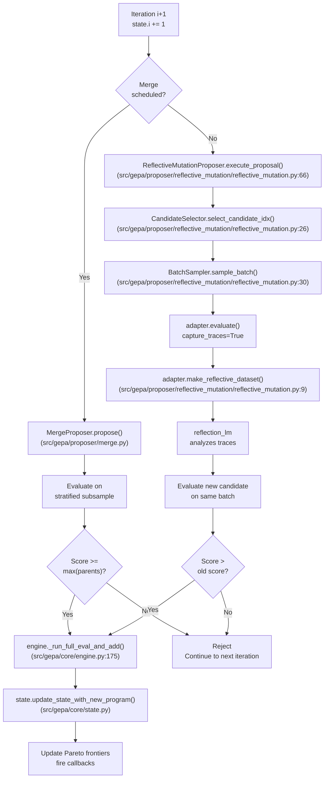
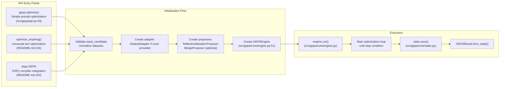
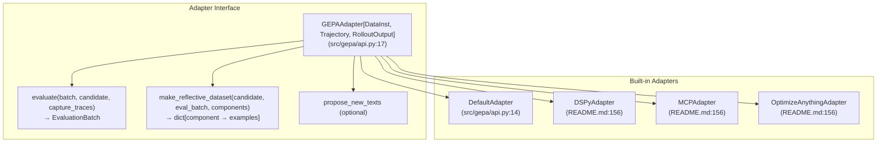
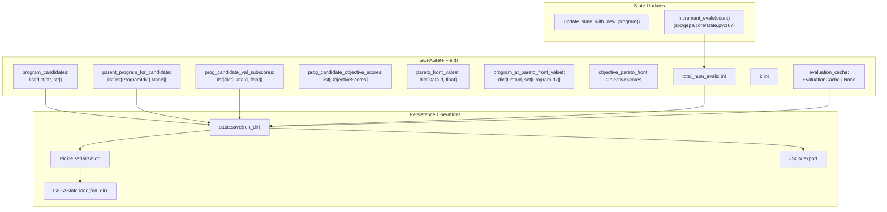
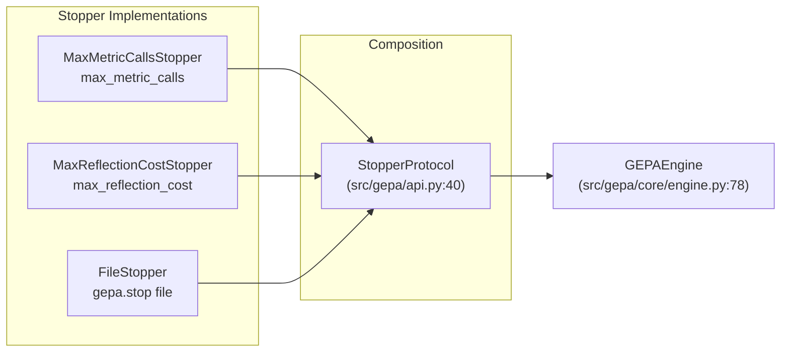

GEPA (Genetic-Pareto) is a framework for optimizing textual system components—prompts, code, agent architectures, configurations—using LLM-based reflection and Pareto-efficient evolutionary search. Unlike reinforcement learning or gradient-based methods, GEPA leverages language models to read full execution traces (error messages, profiling data, reasoning logs) and diagnose *why* candidates fail, enabling targeted improvements with 100–500 evaluations instead of 5,000–25,000+.

**Scope of this document:** This page provides a high-level architectural overview of GEPA's core systems, their interactions, and how they map to code entities. For specific subsystems, see:
- User-facing APIs and quick start examples: [Quick Start](#2)
- Detailed optimization concepts: [Core Concepts](#3)
- Internal architecture deep dive: [Architecture Deep Dive](#4)
- Adapter development: [Adapter System](#5)

---

## System Architecture

GEPA's architecture separates concerns through a layered design: user-facing APIs invoke the core engine, which orchestrates proposers, adapters, and strategies while maintaining persistent state.

```mermaid
graph TB
    subgraph "User APIs"
        OPTIMIZE["gepa.optimize()<br/>(src/gepa/api.py:43-96)"]
        OPTIMIZE_ANY["optimize_anything()<br/>(gepa.optimize_anything)"]
        DSPY["dspy.GEPA<br/>(DSPy integration)"]
    end
    
    subgraph "Core Engine"
        ENGINE["GEPAEngine<br/>(src/gepa/core/engine.py:51)"]
        STATE["GEPAState<br/>(src/gepa/core/state.py:142)"]
        RESULT["GEPAResult<br/>(src/gepa/api.py:20)"]
    end
    
    subgraph "Proposers"
        REFLECTIVE["ReflectiveMutationProposer<br/>(src/gepa/proposer/reflective_mutation/reflective_mutation.py:66)"]
        MERGE["MergeProposer<br/>(src/gepa/proposer/merge.py:20)"]
    end
    
    subgraph "Adapters"
        ADAPTER["GEPAAdapter protocol<br/>(src/gepa/api.py:17)"]
        DEFAULT["DefaultAdapter<br/>(src/gepa/api.py:14)"]
        DSPY_ADAPTER["DSPyAdapter"]
        MCP_ADAPTER["MCPAdapter"]
        OA_ADAPTER["OptimizeAnythingAdapter"]
    end
    
    subgraph "Strategies"
        CAND_SEL["CandidateSelector<br/>(src/gepa/api.py:25)"]
        BATCH_SAMP["BatchSampler<br/>(src/gepa/api.py:28)"]
        STOP["StopperProtocol<br/>(src/gepa/api.py:40)"]
        EVAL_POL["EvaluationPolicy<br/>(src/gepa/api.py:39)"]
    end
    
    subgraph "Storage & Logging"
        CACHE["EvaluationCache<br/>(src/gepa/core/state.py:46)"]
        TRACKER["ExperimentTracker<br/>(src/gepa/core/engine.py:31)"]
        CALLBACKS["GEPACallback<br/>(src/gepa/core/engine.py:11)"]
    end
    
    OPTIMIZE --> ENGINE
    OPTIMIZE_ANY --> ENGINE
    DSPY --> ENGINE
    
    ENGINE --> STATE
    ENGINE --> REFLECTIVE
    ENGINE --> MERGE
    ENGINE --> RESULT
    
    ENGINE --> ADAPTER
    ADAPTER --> DEFAULT
    ADAPTER --> DSPY_ADAPTER
    ADAPTER --> MCP_ADAPTER
    ADAPTER --> OA_ADAPTER
    
    REFLECTIVE --> CAND_SEL
    REFLECTIVE --> BATCH_SAMP
    ENGINE --> STOP
    ENGINE --> EVAL_POL
    
    STATE --> CACHE
    ENGINE --> TRACKER
    ENGINE --> CALLBACKS
```

**Sources:** [src/gepa/api.py:1-96](), [src/gepa/core/engine.py:1-134](), [src/gepa/core/state.py:1-176](), [README.md:135-156]()

---

## Core Optimization Loop

Each iteration follows a dual-path strategy: either **reflective mutation** (LLM-driven improvement) or **merge** (combining Pareto-optimal candidates).

**Sources:** [src/gepa/core/engine.py:154-181](), [src/gepa/proposer/merge.py:118-177](), [src/gepa/proposer/reflective_mutation/reflective_mutation.py:66-170]()

---

## Key Data Structures

GEPA's core data types define how candidates, evaluations, and state are represented throughout the system.

| Type | Location | Purpose |
|------|----------|---------|
| `Candidate` | [src/gepa/proposer/merge.py:9]() | Maps component names to text values (e.g., `{"system_prompt": "..."}`) |
| `GEPAState` | [src/gepa/core/state.py:142]() | Persistent optimization state: candidates, scores, Pareto fronts, budget |
| `EvaluationBatch` | [src/gepa/core/adapter.py]() | Container for evaluation results: `outputs`, `scores`, `trajectories`, `objective_scores` |
| `ValsetEvaluation` | [src/gepa/core/state.py:134]() | Validation results indexed by `DataId`: `outputs_by_val_id`, `scores_by_val_id` |
| `GEPAResult` | [src/gepa/api.py:20]() | Immutable snapshot returned to user: best candidate, lineage, Pareto fronts |
| `CandidateProposal` | [src/gepa/proposer/base.py:24]() | Proposed candidate with parent IDs and subsample scores |
| `EvaluationCache` | [src/gepa/core/state.py:46]() | Memoization for `(candidate, example_id)` pairs to avoid redundant evals |

**Sources:** [src/gepa/core/state.py:46-176](), [src/gepa/proposer/merge.py:9-24](), [src/gepa/api.py:12-40]()

---

## User-Facing Entry Points

Three APIs provide different levels of abstraction:

**Configuration mapping:**
- `gepa.optimize()`: Assembles `GEPAEngine` with user-specified strategies ([src/gepa/api.py:43-96]())
- `max_metric_calls`: Budget limit used by the engine ([src/gepa/api.py:69]())
- `run_dir`: Directory for persistence and logging ([src/gepa/api.py:74]())
- `candidate_selection_strategy`: Strategy for choosing candidates to mutate ([src/gepa/api.py:53]())
- `reflection_lm`: LLM used for analyzing traces and proposing fixes ([src/gepa/api.py:51]())

**Sources:** [src/gepa/api.py:43-96](), [src/gepa/core/engine.py:51-134](), [README.md:68-130]()

---

## Adapter Protocol

The `GEPAAdapter` protocol separates domain-specific evaluation logic from the core optimization engine.

**Required methods:**
1. `evaluate()`: Execute candidate on batch, return `EvaluationBatch` with scores, outputs, and optionally trajectories ([src/gepa/api.py:113-118]())
2. `make_reflective_dataset()`: Transform trajectories into structured feedback for the reflection LLM ([src/gepa/api.py:119-123]())

**Optional method:**
3. `propose_new_texts()`: Custom proposal logic, overriding default LLM-based reflection ([src/gepa/proposer/reflective_mutation/reflective_mutation.py:120-135]())

**Sources:** [src/gepa/api.py:113-123](), [src/gepa/proposer/reflective_mutation/reflective_mutation.py:120-135](), [README.md:151-166]()

---

## State Management and Persistence

`GEPAState` maintains all optimization artifacts and supports resumption from disk.

**Key features:**
- **Caching:** Optional `EvaluationCache` memoizes `(candidate_hash, example_id)` pairs to avoid redundant evaluations ([src/gepa/core/state.py:46-131]()).
- **Budget Tracking:** Tracks total evaluations and metric calls to enforce limits ([src/gepa/core/state.py:175-177]()).
- **Pareto Frontiers:** Maintains sets of non-dominated candidates across instances and objectives ([src/gepa/core/state.py:162-167]()).

**Sources:** [src/gepa/core/state.py:1-177](), [src/gepa/core/engine.py:135-153]()

---

## Pareto Frontier Management

GEPA tracks four frontier types to support multi-objective optimization:

| Frontier Type | Key Type | Purpose |
|---------------|----------|---------|
| `instance` | `DataId` | Per validation example performance ([src/gepa/core/state.py:22]()) |
| `objective` | `str` | Per objective metric performance ([src/gepa/core/state.py:22]()) |
| `hybrid` | `tuple` | Both instance and objective ([src/gepa/core/state.py:22]()) |
| `cartesian` | `tuple` | Per (example, objective) pair ([src/gepa/core/state.py:22]()) |

**Frontier type configured via:** `frontier_type` parameter in `optimize` ([src/gepa/api.py:55]()).

**Sources:** [src/gepa/core/state.py:21-25](), [src/gepa/api.py:55]()

---

## Stopping Conditions

Multiple stopping strategies can be composed via the `StopperProtocol`:

**Auto-creation:** 
- `max_metric_calls` parameter provided to `optimize` ([src/gepa/api.py:69]()).
- `max_reflection_cost` parameter provided to `optimize` ([src/gepa/api.py:70]()).
- `FileStopper` used for graceful shutdown via a signal file ([src/gepa/api.py:40]()).

**Sources:** [src/gepa/api.py:40-78](), [src/gepa/core/engine.py:78-95]()

---

## Strategy Layer

Pluggable strategies control optimization behavior:

| Strategy Type | Interface | Implementations | Configuration |
|---------------|-----------|----------------|---------------|
| Candidate Selection | `CandidateSelector` | `Pareto`, `CurrentBest`, `EpsilonGreedy`, `TopKPareto` | [src/gepa/api.py:53-54]() |
| Batch Sampling | `BatchSampler` | `EpochShuffledBatchSampler` | [src/gepa/api.py:57]() |
| Component Selection | `ReflectionComponentSelector` | `RoundRobin`, `All` | [src/gepa/api.py:63]() |
| Evaluation Policy | `EvaluationPolicy` | `FullEvaluationPolicy` | [src/gepa/api.py:93]() |

**Sources:** [src/gepa/api.py:25-39](), [src/gepa/api.py:53-93]()