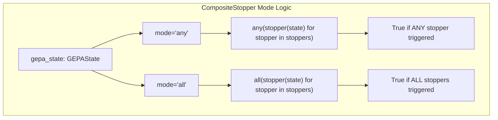
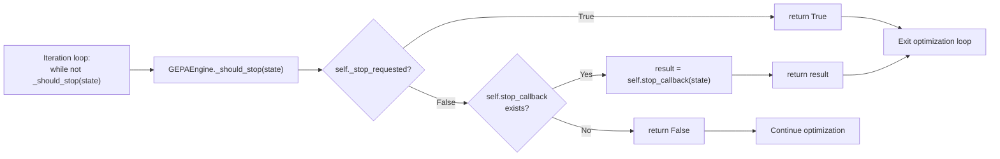
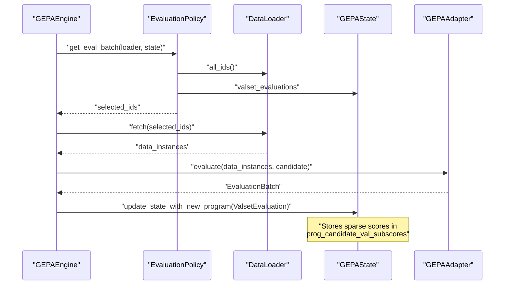
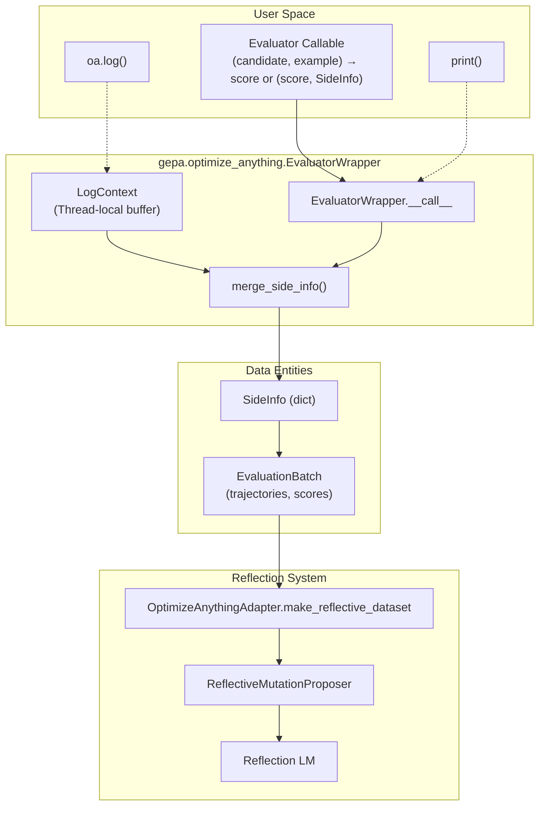
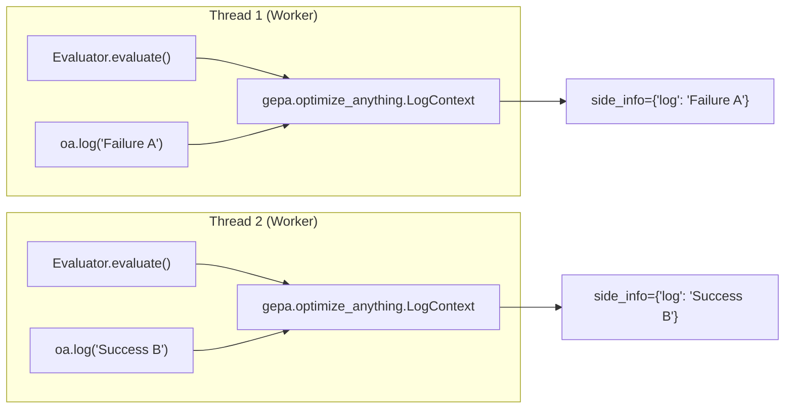

```

**Shorthand:** The `max_metric_calls` parameter in `optimize()` or `optimize_anything()` automatically creates this stopper. [src/gepa/api.py:69-69](), [src/gepa/optimize_anything.py:66-67]()

**Sources:** [src/gepa/utils/stop_condition.py:163-174]()

---

### TimeoutStopCondition

Stops optimization after a wall-clock time limit.

| Attribute | Type | Description |
|-----------|------|-------------|
| `timeout_seconds` | `float` | Maximum runtime in seconds |
| `start_time` | `float` | Timestamp when stopper was initialized |

**Stopping Logic:** Returns `True` when `time.time() - start_time > timeout_seconds`. [src/gepa/utils/stop_condition.py:43-43]()

**Sources:** [src/gepa/utils/stop_condition.py:34-43]()

---

### NoImprovementStopper

Stops optimization when no improvement is observed for a specified number of iterations.

| Attribute | Type | Description |
|-----------|------|-------------|
| `max_iterations_without_improvement` | `int` | Patience before stopping |
| `best_score` | `float` | Best score seen so far (internal state) |
| `iterations_without_improvement` | `int` | Counter tracking stagnation (internal state) |

**Stopping Logic:** 
1. Computes current best score as `max(gepa_state.program_full_scores_val_set)` [src/gepa/utils/stop_condition.py:96-98]()
2. If `current_score > best_score`, resets counter and updates best score [src/gepa/utils/stop_condition.py:99-101]()
3. Otherwise, increments counter [src/gepa/utils/stop_condition.py:103-103]()
4. Returns `True` when counter reaches threshold [src/gepa/utils/stop_condition.py:105-105]()

**Methods:**
- `reset()`: Resets the counter (useful when manually updating the score) [src/gepa/utils/stop_condition.py:109-111]()

**Sources:** [src/gepa/utils/stop_condition.py:83-111]()

---

### ScoreThresholdStopper

Stops optimization when a target score is reached.

| Attribute | Type | Description |
|-----------|------|-------------|
| `threshold` | `float` | Target score to achieve |

**Stopping Logic:** Returns `True` when `max(gepa_state.program_full_scores_val_set) >= threshold`. [src/gepa/utils/stop_condition.py:75-78]()

**Sources:** [src/gepa/utils/stop_condition.py:64-80]()

---

### FileStopper

Stops optimization when a specified file exists on disk. Enables graceful stopping from external processes.

| Attribute | Type | Description |
|-----------|------|-------------|
| `stop_file_path` | `str` | Path to stop signal file |

**Stopping Logic:** Returns `True` when `os.path.exists(stop_file_path)`. [src/gepa/utils/stop_condition.py:56-56]()

**Methods:**
- `remove_stop_file()`: Deletes the stop file [src/gepa/utils/stop_condition.py:58-61]()

**Sources:** [src/gepa/utils/stop_condition.py:46-61]()

---

### SignalStopper

Stops optimization when OS signals are received (e.g., SIGINT from Ctrl+C, SIGTERM).

| Attribute | Type | Description |
|-----------|------|-------------|
| `signals` | `list` | Signals to handle (default: `[SIGINT, SIGTERM]`) [src/gepa/utils/stop_condition.py:118-118]() |
| `_stop_requested` | `bool` | Internal flag set by signal handler |
| `_original_handlers` | `dict` | Original signal handlers for restoration |

**Stopping Logic:** Installs signal handlers on initialization. When a registered signal is received, sets `_stop_requested = True`. Returns `True` when flag is set. [src/gepa/utils/stop_condition.py:126-139]()

**Methods:**
- `cleanup()`: Restores original signal handlers [src/gepa/utils/stop_condition.py:141-148]()

**Sources:** [src/gepa/utils/stop_condition.py:114-149]()

---

### MaxReflectionCostStopper

Stops once the reflection LM's cumulative cost (USD) reaches a specified budget. This is critical for managing API expenditures during long-running optimization jobs.

| Attribute | Type | Description |
|-----------|------|-------------|
| `max_reflection_cost_usd` | `float` | Maximum budget in USD |
| `_reflection_lm` | `object` | The LM instance to track |

**Stopping Logic:** Reads `total_cost` from the `LM` instance. Returns `True` if `cost >= max_reflection_cost_usd`. [src/gepa/utils/stop_condition.py:188-190]()

**Note:** Custom callables wrapped in `TrackingLM` always report `0.0` cost and will never trip this stopper. [src/gepa/utils/stop_condition.py:179-181](), [src/gepa/lm.py:195-195]()

**Sources:** [src/gepa/utils/stop_condition.py:176-191](), [src/gepa/lm.py:73-76](), [tests/test_reflection_cost_tracking.py:142-174]()

---

### MaxCandidateProposalsStopper

Stops after a maximum number of candidate proposals (optimization iterations).

| Attribute | Type | Description |
|-----------|------|-------------|
| `max_proposals` | `int` | Maximum number of proposals |

**Stopping Logic:** Returns `True` when `gepa_state.i >= max_proposals - 1`. [src/gepa/utils/stop_condition.py:206-207]()

**Note:** `state.i` starts at -1 and is incremented at the START of each iteration. The stopper is checked BEFORE the increment, so when `state.i = N-1`, we're about to run proposal N. To allow exactly N proposals, we stop when `state.i >= N - 1`. [src/gepa/utils/stop_condition.py:197-200]()

**Sources:** [src/gepa/utils/stop_condition.py:193-208]()

---

### MaxTrackedCandidatesStopper

Stops when the number of tracked candidates reaches a maximum.

| Attribute | Type | Description |
|-----------|------|-------------|
| `max_tracked_candidates` | `int` | Maximum number of candidates to track |

**Stopping Logic:** Returns `True` when `len(gepa_state.program_candidates) >= max_tracked_candidates`. [src/gepa/utils/stop_condition.py:160-160]()

**Sources:** [src/gepa/utils/stop_condition.py:150-161]()

---

## Combining Stoppers

### CompositeStopper

Combines multiple stopping conditions with logical operators.

| Attribute | Type | Description |
|-----------|------|-------------|
| `stoppers` | `tuple[StopperProtocol, ...]` | Stoppers to combine |
| `mode` | `Literal["any", "all"]` | Combination mode |

**Modes:**
- `"any"`: Stops when **any** child stopper returns `True` (logical OR). [src/gepa/utils/stop_condition.py:223-224]()
- `"all"`: Stops when **all** child stoppers return `True` (logical AND). [src/gepa/utils/stop_condition.py:225-226]()



**Sources:** [src/gepa/utils/stop_condition.py:210-228]()

---

## Engine Integration

### Stopping Check Flow

The `GEPAEngine` checks stopping conditions at each iteration. This logic is encapsulated in the internal engine loop.



**Key Points:**
- Manual stop requests (via `request_stop()`) take precedence. [src/gepa/core/engine.py:92-92]()
- Stopper is invoked with current `GEPAState` snapshot. [src/gepa/core/engine.py:78-78]()

**Sources:** [src/gepa/core/engine.py:51-134](), [src/gepa/utils/stop_condition.py:14-31]()

---

## Manual Stopping

The `GEPAEngine` provides a `_stop_requested` flag for programmatic stopping. This allows external systems (e.g., callbacks, monitoring systems) to trigger graceful shutdown.

**Sources:** [src/gepa/core/engine.py:92-92]()

---

## Summary Table

| Stopper | Trigger Condition | Typical Use Case |
|---------|------------------|------------------|
| `MaxMetricCallsStopper` | `total_num_evals >= max_metric_calls` | Budget control |
| `TimeoutStopCondition` | Wall-clock time limit reached | Time-boxed optimization |
| `NoImprovementStopper` | No improvement for N iterations | Early stopping on convergence |
| `ScoreThresholdStopper` | Target score achieved | Stopping when "good enough" |
| `FileStopper` | Stop file exists | External/manual control |
| `SignalStopper` | OS signal received | Graceful Ctrl+C handling |
| `MaxReflectionCostStopper` | `total_cost >= max_reflection_cost_usd` | Financial budget control |
| `MaxCandidateProposalsStopper` | N proposals completed | Limiting exploration |
| `MaxTrackedCandidatesStopper` | N candidates tracked | Memory control |
| `CompositeStopper` | Combines multiple stoppers | Complex stopping logic |

**Sources:** [src/gepa/utils/stop_condition.py:14-228]()

# Data Loading and Evaluation Policies


This page explains GEPA's data loading and validation evaluation abstractions. These components control how training and validation data are accessed and how validation examples are evaluated during optimization.

**Scope**: This page covers the `DataLoader` protocol for data access, the `BatchSampler` for training data flow, and the `EvaluationPolicy` protocol for controlling validation evaluation strategies.

## DataLoader Protocol

The `DataLoader` protocol provides a uniform interface for accessing training and validation data, whether stored in memory or loaded dynamically. GEPA uses data loaders to decouple the optimization logic from specific data storage mechanisms.

### Interface Definition

The core `DataLoader` protocol defines three methods:

| Method | Return Type | Purpose |
|--------|-------------|---------|
| `all_ids()` | `Sequence[DataId]` | Returns ordered list of all currently available data identifiers [src/gepa/core/data_loader.py:30-32]() |
| `fetch(ids)` | `list[DataInst]` | Materializes data instances for given ids, preserving order [src/gepa/core/data_loader.py:34-36]() |
| `__len__()` | `int` | Returns current number of items [src/gepa/core/data_loader.py:38-40]() |

The generic type parameters are:
- `DataId`: A hashable and comparable identifier type (e.g., `int`, `str`, `tuple`) [src/gepa/core/data_loader.py:22-23]()
- `DataInst`: The actual data instance type (defined by the adapter) [src/gepa/core/data_loader.py:27]()

### Architecture Diagram

```mermaid
graph TB
    subgraph "DataLoader Protocol Space"
        Protocol["DataLoader[DataId, DataInst]"]
        Mutable["MutableDataLoader"]
        Protocol --- Methods["all_ids()<br/>fetch(ids)<br/>__len__()"]
        Mutable --- Add["add_items()"]
    end
    
    subgraph "Concrete Implementation Space"
        ListLoader["ListDataLoader"]
        StagedLoader["StagedDataLoader"]
        AutoExpanding["AutoExpandingListLoader"]
    end
    
    subgraph "GEPA Integration"
        API["gepa.optimize()"]
        EnsureLoader["ensure_loader()"]
        Engine["GEPAEngine"]
    end
    
    Protocol <|-- Mutable
    Mutable <|-- ListLoader
    ListLoader <|-- StagedLoader
    ListLoader <|-- AutoExpanding
    
    API --> EnsureLoader
    EnsureLoader --> ListLoader
    Engine --> Protocol
```

**Sources**: [src/gepa/core/data_loader.py:27-68](), [tests/test_data_loader.py:7-57](), [tests/test_incremental_eval_policy.py:8-21]()

### ListDataLoader: In-Memory Implementation

`ListDataLoader` is the reference implementation that stores data in a Python list. It automatically assigns integer ids based on list indices [src/gepa/core/data_loader.py:50-66]().

### Dynamic Validation Sets

Data loaders support validation sets that grow during optimization. The `all_ids()` method returns the **current** set of available ids, which may change between calls.

**Example: StagedDataLoader**
The test suite demonstrates a `StagedDataLoader` that unlocks examples after serving a certain number of batches via `fetch`, simulating scenarios where more validation data becomes available over time [tests/test_data_loader.py:7-57]().

## Batch Sampling Strategies

While `DataLoader` provides access, the `BatchSampler` determines the order and grouping of training examples for the reflective mutation process.

### EpochShuffledBatchSampler

This is the default sampler used for training minibatches [src/gepa/strategies/batch_sampler.py:17-77]().

- **Shuffling**: Re-shuffles IDs at the start of every epoch [src/gepa/strategies/batch_sampler.py:47]().
- **Padding**: If the dataset size is not divisible by the minibatch size, it pads the last batch using the least frequent IDs to ensure balanced coverage [src/gepa/strategies/batch_sampler.py:50-56]().
- **Determinism**: Uses the state's RNG (`state.rng1`) to ensure reproducible sampling [src/gepa/strategies/batch_sampler.py:31-34]().

### Custom Samplers

Users can implement the `BatchSampler` protocol to create domain-specific sampling logic, such as prioritizing "hard" examples that currently have low scores on the Pareto frontier [docs/docs/guides/batch-sampling.md:98-121]().

**Sources**: [src/gepa/strategies/batch_sampler.py:13-78](), [docs/docs/guides/batch-sampling.md:1-174]()

## EvaluationPolicy Protocol

The `EvaluationPolicy` protocol controls **which validation examples to evaluate** for each program candidate and **how to determine the best program**.

### Interface Definition

| Method | Parameters | Returns | Purpose |
|--------|-----------|---------|---------|
| `get_eval_batch()` | `loader`, `state`, `target_program_idx` | `list[DataId]` | Select which validation ids to evaluate [src/gepa/strategies/eval_policy.py:17-21]() |
| `get_best_program()` | `state` | `ProgramIdx` | Determine which program is currently best [src/gepa/strategies/eval_policy.py:23-26]() |
| `get_valset_score()` | `program_idx`, `state` | `float` | Calculate validation score for a program [src/gepa/strategies/eval_policy.py:28-31]() |

### Policy Implementations

#### 1. FullEvaluationPolicy (Default)
Evaluates **all validation examples** for every candidate program [src/gepa/strategies/eval_policy.py:34-58]().
- `get_eval_batch` returns `loader.all_ids()` [src/gepa/strategies/eval_policy.py:41]().
- `get_best_program` calculates the average score across all evaluated instances, considering coverage in case of ties [src/gepa/strategies/eval_policy.py:43-53]().

#### 2. RoundRobinSampleEvaluationPolicy
A sample-based policy that prioritizes validation examples with the fewest recorded evaluations across the entire search [tests/test_incremental_eval_policy.py:54-100]().
- It sorts `all_ids` by the number of times they appear in `state.valset_evaluations` [tests/test_incremental_eval_policy.py:76-80]().
- It returns a batch of size `batch_size`, allowing for sparse evaluation of the validation set to save on rollout costs [tests/test_incremental_eval_policy.py:81-83]().

### Integration Flow



**Sources**: [src/gepa/strategies/eval_policy.py:12-64](), [tests/test_incremental_eval_policy.py:54-100](), [src/gepa/core/state.py:25-29]()

## State Management for Policies

The `GEPAState` facilitates complex evaluation policies by tracking fine-grained performance data:
- `prog_candidate_val_subscores`: A list of dictionaries (one per program) mapping `DataId` to the numeric score received [src/gepa/core/state.py:25-29]().
- `valset_evaluations`: A mapping from `DataId` to the list of `ProgramIdx` that have been evaluated on that specific instance, used by round-robin policies to ensure even coverage [tests/test_incremental_eval_policy.py:74-78]().

This architecture enables **sparse evaluation** where not every program is evaluated on every validation example, which is essential for large-scale optimization or expensive rollouts [tests/test_incremental_eval_policy.py:133-139]().

**Sources**: [src/gepa/core/state.py:25-29](), [src/gepa/strategies/eval_policy.py:46-52](), [tests/test_incremental_eval_policy.py:102-140]()

# Actionable Side Information (ASI)


This page explains Actionable Side Information (ASI), the diagnostic feedback mechanism that enables LLM-driven optimization in GEPA. ASI is what separates GEPA from traditional black-box optimizers: rather than reducing all evaluation context to a single scalar, ASI provides rich, structured diagnostic feedback that an LLM can read and reason about during reflection.

---

## Conceptual Foundation

Traditional optimization methods know *that* a candidate failed but not *why*. When a numeric optimizer receives a score of 0.3, it has no context about what went wrong — was it a syntax error? A logic bug? An edge case failure? This fundamental limitation forces these methods to rely on thousands of evaluations to triangulate improvements through pure trial and error.

**ASI changes this by making diagnostic feedback a first-class concept.** Just as gradients tell a numerical optimizer which direction to move in parameter space, ASI tells an LLM proposer *why* a candidate failed and *how* to fix it [src/gepa/optimize_anything.py:82-88](). The evaluator can return:

- Error messages and stack traces [src/gepa/optimize_anything.py:122]()
- Expected vs. actual outputs [src/gepa/optimize_anything.py:57-58]()
- Profiling data and performance metrics [src/gepa/optimize_anything.py:86-88]()
- Reasoning traces and intermediate steps [README.md:33]()
- Visual feedback (rendered images for VLM proposers) [src/gepa/optimize_anything.py:87-88]()
- Any structured information an expert would use to diagnose the problem.

With this context, the reflection LLM can make targeted, informed improvements rather than random mutations [README.md:141-143]().

**Sources:** [src/gepa/optimize_anything.py:82-88](), [README.md:33](), [README.md:141-145]()

---

## ASI Data Flow

The flow of diagnostic information starts in the user-defined evaluator and ends in the prompt of the reflection language model.

### Code-Entity ASI Pipeline


**Figure: ASI flows from the user evaluator through multiple capture mechanisms, gets merged by `EvaluatorWrapper`, and is structured by the adapter for consumption by the reflection LM.**

The data flow has four stages:
1. **Capture**: User evaluator provides ASI via return value, `oa.log()`, or `print()` (if enabled) [src/gepa/optimize_anything.py:56-59]().
2. **Merge**: `EvaluatorWrapper` combines all sources into a single `side_info` dict [src/gepa/optimize_anything.py:1138-1188]().
3. **Structure**: Adapter's `make_reflective_dataset()` organizes ASI per component [src/gepa/core/adapter.py:53-57]().
4. **Reflection**: Proposer formats ASI into prompts that the reflection LM reads [src/gepa/proposer/reflective_mutation/reflective_mutation.py:1-20]().

**Sources:** [src/gepa/optimize_anything.py:1043-1188](), [src/gepa/core/adapter.py:41-62](), [src/gepa/optimize_anything.py:56-59]()

---

## Providing ASI: Three Methods

### Method 1: Return (score, side_info) Tuple
The most explicit way is to return a tuple from your evaluator. `SideInfo` is a type alias for `dict[str, Any]` [src/gepa/optimize_anything.py:116-122]().

```python
import gepa.optimize_anything as oa

def evaluate(candidate, example):
    result = run_my_system(candidate)
    
    score = result.score
    side_info = {
        "Input": example["input"],
        "Output": result.output,
        "Error": result.error_msg,
    }
    
    return score, side_info
```
**Sources:** [src/gepa/optimize_anything.py:98-100](), [src/gepa/optimize_anything.py:116-122]()

### Method 2: Use oa.log()
For evaluators that need to log diagnostics progressively, `oa.log()` works like `print()` but captures output into `side_info["log"]` [src/gepa/optimize_anything.py:103](). This is useful when evaluation has multiple intermediate steps.

```python
import gepa.optimize_anything as oa

def evaluate(candidate):
    oa.log("Step 1: Compiling...")
    # ... compile logic ...
    oa.log("Step 2: Running tests...")
    # ... test logic ...
    return final_score
```
All `oa.log()` output is captured per-thread and included automatically [src/gepa/optimize_anything.py:347-377]().

**Sources:** [src/gepa/optimize_anything.py:103](), [src/gepa/optimize_anything.py:347-377]()

### Method 3: Automatic stdout/stderr Capture
Set `EngineConfig(capture_stdio=True)` to automatically capture all `print()` statements and `sys.stdout`/`sys.stderr` writes [src/gepa/optimize_anything.py:151-152]().

```python
from gepa.optimize_anything import optimize_anything, GEPAConfig, EngineConfig

def evaluate(candidate):
    print("Running candidate...")  # captured to side_info["stdout"]
    return score

result = optimize_anything(
    seed_candidate=code,
    evaluator=evaluate,
    config=GEPAConfig(engine=EngineConfig(capture_stdio=True)),
)
```
**Sources:** [src/gepa/optimize_anything.py:151-152](), [src/gepa/utils/stdio_capture.py:16-27]()

---

## ASI Structure and Conventions

The `SideInfo` dict uses several conventional keys to communicate with the engine:

| Category | Field Pattern | Purpose |
|----------|---------------|---------|
| **Multi-objective scores** | `"scores"` | Dict of metric name → value for Pareto tracking [src/gepa/optimize_anything.py:89-92](). |
| **Input/Output context** | `"Input"`, `"Output"`, `"Expected"` | What went in and what came out. |
| **Diagnostic feedback** | `"Feedback"`, `"Error"`, `"Reasoning"` | Qualitative assessment and error details. |
| **Visual feedback** | Any key with `Image` value | Rendered images for VLM reflection [src/gepa/optimize_anything.py:105](). |
| **Automatic capture** | `"log"`, `"stdout"`, `"stderr"` | Output from `oa.log()`, `print()`, or subprocesses. |

### Important Implementation Details
1. **"Higher is better" for scores**: All metrics in `"scores"` must follow this convention. If you have a loss metric, negate it.
2. **Image support**: Use `gepa.Image` to include visual feedback for vision-capable reflection LMs [src/gepa/optimize_anything.py:105]().
3. **Conflict Resolution**: If your evaluator returns a key like `"log"`, GEPA stores its internal captured output under `_gepa_log` to avoid overwriting your data [src/gepa/optimize_anything.py:1169-1172]().

**Sources:** [src/gepa/optimize_anything.py:171-230](), [src/gepa/optimize_anything.py:1169-1172]()

---

## Thread Safety and LogContext

GEPA often runs evaluations in parallel using `max_workers`. To ensure that logs from one evaluation don't bleed into another, GEPA uses thread-local storage [src/gepa/optimize_anything.py:260-261]().

### Log Isolation Diagram


**Figure: Each evaluator call gets an isolated `LogContext` in thread-local storage via `_log_tls`.**

The `LogContext` class manages these buffers:
- **Thread-local storage**: Each thread has its own buffer via `_log_tls` [src/gepa/optimize_anything.py:260-261]().
- **Automatic lifecycle**: `EvaluatorWrapper` creates a `LogContext` before calling the evaluator and drains it after [src/gepa/optimize_anything.py:1143-1165]().
- **Manual Propagation**: If your evaluator spawns its own threads, use `oa.get_log_context()` and `oa.set_log_context()` to propagate the logging context to children [src/gepa/optimize_anything.py:324-344]().

**Sources:** [src/gepa/optimize_anything.py:260-344](), [src/gepa/optimize_anything.py:1143-1165]()

---

## Reflection and LM Cost Tracking

ASI consumption involves calls to the Reflection LM. GEPA tracks the cost and token usage of these calls via the `LM` class [src/gepa/lm.py:74-86]().

- **MaxReflectionCostStopper**: A specialized stopper that terminates optimization once a USD budget is reached [src/gepa/utils/stop_condition.py:176-192]().
- **TrackingLM**: For custom proposers that don't use the standard `LM` wrapper, `TrackingLM` provides estimated token usage (~4 chars/token) to maintain visibility into reflection overhead [src/gepa/lm.py:190-210]().

**Sources:** [src/gepa/lm.py:74-86](), [src/gepa/utils/stop_condition.py:176-192](), [src/gepa/lm.py:190-210]()