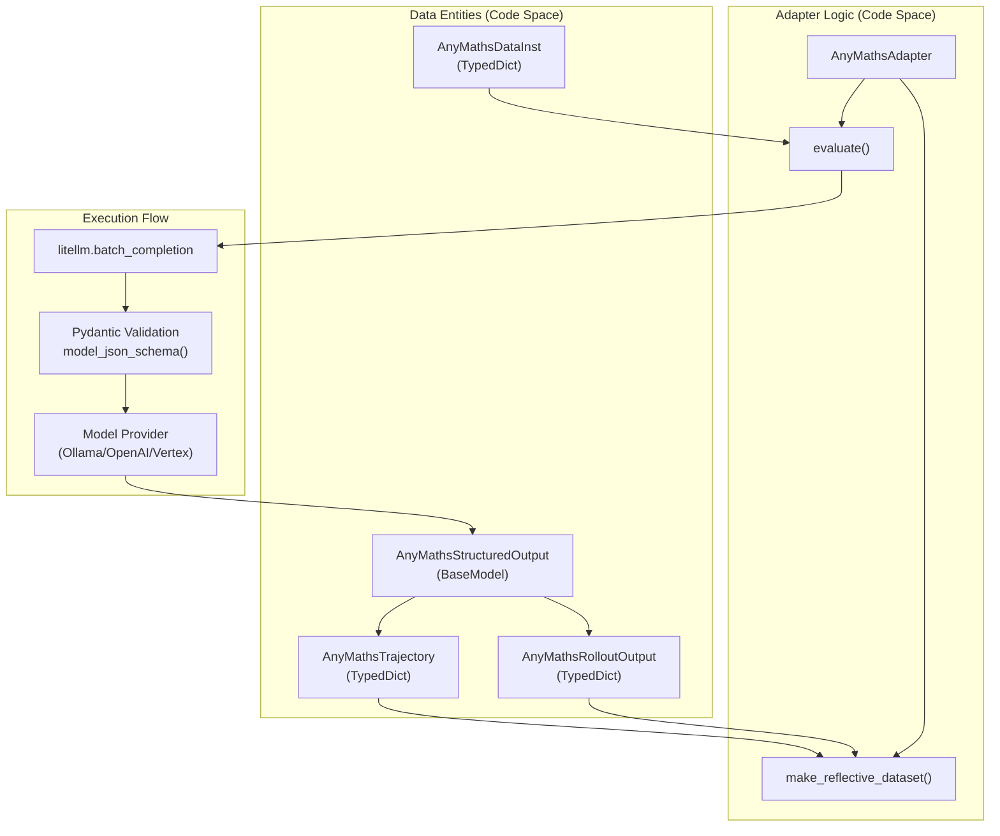
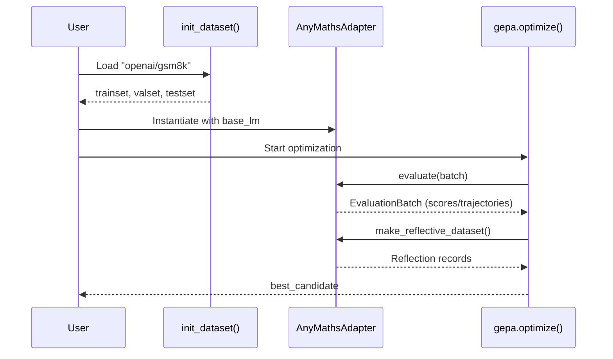

```

**Sources:** [tests/test_incremental_eval_policy.py:54-100](), [src/gepa/strategies/eval_policy.py:34-58]()

### Staged Data Loading

The `StagedDataLoader` allows "unlocking" harder or more diverse RAG examples after a certain number of batches have been served. [tests/test_data_loader.py:7-57]().

```python
from tests.test_data_loader import StagedDataLoader

loader = StagedDataLoader(
    initial_items=basic_queries,
    staged_items=[(10, complex_queries)] # Unlock after 10 batches
)
```

**Sources:** [tests/test_data_loader.py:7-57]()

## Example: Multi-Component Optimization

A typical GEPA RAG optimization run evolves multiple prompts simultaneously:

```python
initial_prompts = {
    "query_reformulation": "Rewrite this query for a vector search: {query}",
    "context_synthesis": "Combine these docs into a summary: {documents}",
    "answer_generation": "Answer based on context: {context}\nQuestion: {query}"
}

result = gepa.optimize(
    seed_candidate=initial_prompts,
    adapter=GenericRAGAdapter(vector_store=store, llm_model="gpt-4o"),
    trainset=train_data,
    valset=val_data,
    max_metric_calls=50
)
```

**Sources:** [src/gepa/adapters/generic_rag_adapter/GEPA_RAG.md:48-95](), [src/gepa/adapters/generic_rag_adapter/GEPA_RAG.md:120-125]()

# AnyMaths Adapter


This document describes the **AnyMathsAdapter**, a GEPA adapter for optimizing prompts on mathematical word problems. The adapter handles datasets like GSM8K and AIME, supporting structured JSON outputs with step-by-step solutions and final answers.

For general adapter concepts, see [Adapters and System Integration](). For the adapter protocol interface, see [GEPAAdapter Interface](). For other built-in adapters, see [DefaultAdapter](), [DSPy Integration](), and [Generic RAG Adapter]().

## Purpose and Scope

The `AnyMathsAdapter` enables GEPA to optimize prompts for math problem solving by:
- Enforcing structured JSON outputs with `final_answer` and `solution_pad` fields via Pydantic validation [src/gepa/adapters/anymaths_adapter/anymaths_adapter.py:24-29]().
- Supporting any LiteLLM-compatible provider, including local instances via Ollama [src/gepa/adapters/anymaths_adapter/README.md:38-40]().
- Providing detailed feedback based on correctness and reference solutions during reflection [src/gepa/adapters/anymaths_adapter/anymaths_adapter.py:149-163]().
- Handling format failures gracefully with fallback scores [src/gepa/adapters/anymaths_adapter/anymaths_adapter.py:118-120]().

The adapter is designed for math word problem datasets where examples contain questions, answers, and optionally reference solutions [src/gepa/adapters/anymaths_adapter/README.md:21-32]().

Sources: [src/gepa/adapters/anymaths_adapter/anymaths_adapter.py:1-175](), [src/gepa/adapters/anymaths_adapter/README.md:1-44]()

## Architecture Overview

The following diagram bridges the Natural Language reasoning space with the code entities defined in `anymaths_adapter.py`.

### AnyMaths System Mapping

Sources: [src/gepa/adapters/anymaths_adapter/anymaths_adapter.py:9-31](), [src/gepa/core/adapter.py:6-7]()

## Data Structures

The adapter defines four primary data structures to interface with GEPA:

### AnyMathsDataInst
Input data format for a single math problem [src/gepa/adapters/anymaths_adapter/anymaths_adapter.py:9-13]().

| Field | Type | Description |
|-------|------|-------------|
| `input` | `str` | The math problem question text |
| `additional_context` | `dict[str, str]` | Optional context like reference solution |
| `answer` | `str` | Ground truth answer (numerical only) |

### AnyMathsStructuredOutput
Pydantic model enforcing the LLM response schema [src/gepa/adapters/anymaths_adapter/anymaths_adapter.py:24-29]().

| Field | Type | Description |
|-------|------|-------------|
| `final_answer` | `str` | Numerical answer with no units or text |
| `solution_pad` | `str` | Step-by-step solution reasoning |

The schema is passed to LiteLLM's `batch_completion` to enforce JSON structure validation [src/gepa/adapters/anymaths_adapter/anymaths_adapter.py:95-101]().

Sources: [src/gepa/adapters/anymaths_adapter/anymaths_adapter.py:9-29]()

## Adapter Implementation

### Constructor
The `AnyMathsAdapter.__init__` method configures the connection to the model provider [src/gepa/adapters/anymaths_adapter/anymaths_adapter.py:39-58]().

| Parameter | Type | Default | Description |
|-----------|------|---------|-------------|
| `model` | `str` | required | LiteLLM model identifier (e.g., `"ollama/qwen3:4b"`) |
| `failure_score` | `float` | `0.0` | Score assigned on incorrect answer or parse failure |
| `api_base` | `str \| None` | `"http://localhost:11434"` | API base URL (required for Ollama) |
| `max_litellm_workers` | `int` | `10` | Parallel workers for batch completion |

### Evaluation Method
The `evaluate()` method implements the core evaluation loop [src/gepa/adapters/anymaths_adapter/anymaths_adapter.py:60-128]():

1. **Prompt Extraction**: Extracts the system prompt from the `candidate` dictionary [src/gepa/adapters/anymaths_adapter/anymaths_adapter.py:75]().
2. **Batch Request**: Uses `self.litellm.batch_completion` with forced JSON schema validation [src/gepa/adapters/anymaths_adapter/anymaths_adapter.py:90-101]().
3. **Response Parsing**: Uses `ast.literal_eval()` to safely parse the returned string into a dictionary [src/gepa/adapters/anymaths_adapter/anymaths_adapter.py:108]().
4. **Scoring**: Assigns `1.0` if `data["answer"]` is found within the `final_answer` field, otherwise returns `failure_score` [src/gepa/adapters/anymaths_adapter/anymaths_adapter.py:117-120]().

### Reflective Dataset Construction
The `make_reflective_dataset()` method creates feedback records for prompt refinement [src/gepa/adapters/anymaths_adapter/anymaths_adapter.py:130-174]():

- **Success Feedback**: Confirms the answer was correct [src/gepa/adapters/anymaths_adapter/anymaths_adapter.py:149-150]().
- **Failure Feedback**: Provides the correct answer and appends `additional_context` (like reference solutions) to guide the reflection LM [src/gepa/adapters/anymaths_adapter/anymaths_adapter.py:151-163]().

Sources: [src/gepa/adapters/anymaths_adapter/anymaths_adapter.py:39-174]()

## Usage and Integration

### Training Workflow
The training script `train_anymaths.py` demonstrates how to initialize the adapter and start the optimization loop.


Sources: [src/gepa/examples/anymaths-bench/train_anymaths.py:97-173](), [src/gepa/adapters/anymaths_adapter/anymaths_adapter.py:60-174]()

### Dataset Preparation
The `init_dataset` function supports `openai/gsm8k` and `MathArena/aime_2025` [src/gepa/examples/anymaths-bench/train_anymaths.py:1-52](). It reformats raw data into the `AnyMathsDataInst` schema, separating the final numerical answer from the step-by-step solution string [src/gepa/examples/anymaths-bench/train_anymaths.py:12-16]().

### Running Optimization
A typical command for local optimization using Ollama:
```bash
python src/gepa/examples/anymaths-bench/train_anymaths.py \
    --anymaths_dset_name "openai/gsm8k" \
    --base_lm "ollama/qwen3:4b" \
    --use_api_base \
    --api_base_url "http://localhost:11434" \
    --reflection_lm "ollama/qwen3:8b" \
    --budget 500
```
Sources: [src/gepa/examples/anymaths-bench/train_anymaths.py:65-91](), [src/gepa/adapters/anymaths_adapter/README.md:78-81]()

## Seed vs. Optimized Prompts

The adapter starts with a basic `instruction_prompt.txt` that defines the JSON format [src/gepa/examples/anymaths-bench/prompt-templates/instruction_prompt.txt:1-9](). 

The optimized prompt `optimal_prompt.txt` typically evolves to include:
- **Sequential operation logic**: Instructions to calculate in distinct steps [src/gepa/examples/anymaths-bench/prompt-templates/optimal_prompt.txt:14-15]().
- **Domain-specific interpretation**: Guidance on unit conversion and monetary logic [src/gepa/examples/anymaths-bench/prompt-templates/optimal_prompt.txt:17-18]().
- **Strict output constraints**: Explicit prohibitions against internal monologues or currency symbols in the final answer field [src/gepa/examples/anymaths-bench/prompt-templates/optimal_prompt.txt:19, 23]().

Sources: [src/gepa/examples/anymaths-bench/prompt-templates/instruction_prompt.txt:1-9](), [src/gepa/examples/anymaths-bench/prompt-templates/optimal_prompt.txt:1-24]()