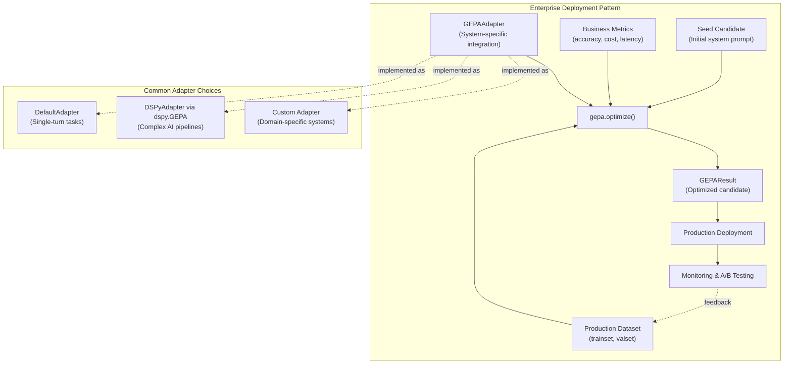
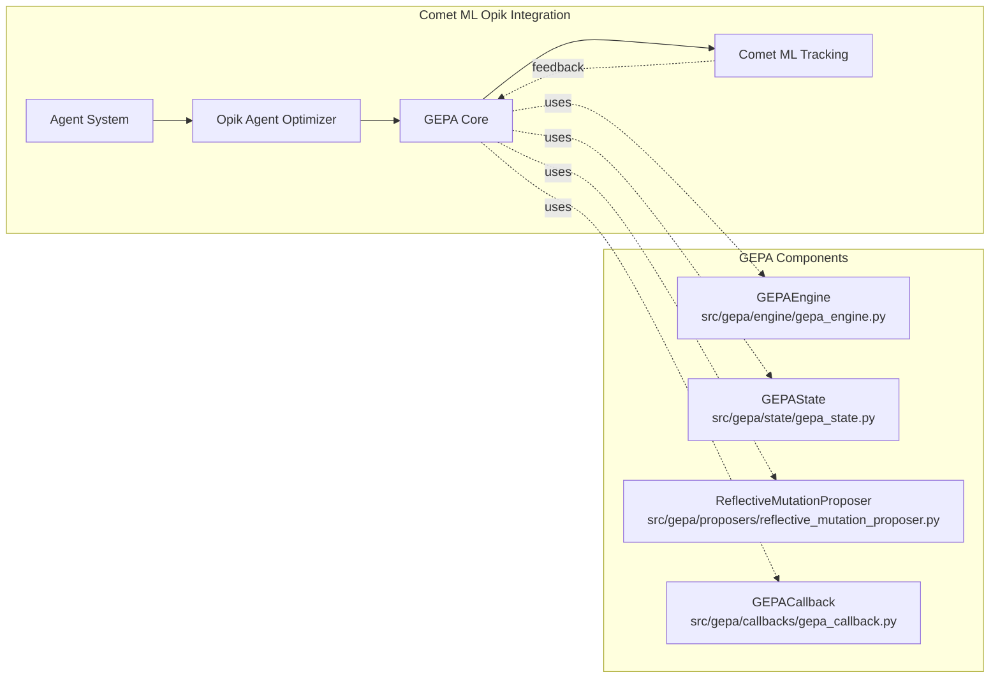
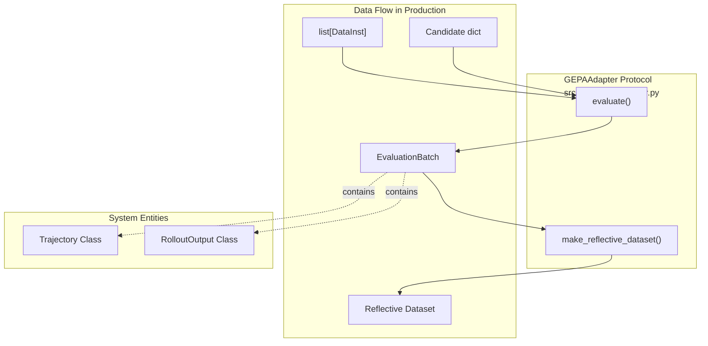

This page documents real-world production deployments of GEPA across diverse industries and use cases. It covers enterprise implementations, framework integrations, domain-specific applications, and quantitative results from production systems. For hands-on tutorials and examples, see the [AIME Prompt Optimization](#7.1), [DSPy Program Evolution](#7.2), and [optimize_anything Examples](#7.3).

## Enterprise Production Deployments

### Shopify: Context Engineering
Tobi Lutke (CEO, Shopify) highlighted GEPA as "severely under hyped" in AI context engineering. Shopify uses GEPA for optimizing AI system prompts and context engineering across their platform. [README.md:48-49]().

### Databricks: 90x Cost Reduction
Databricks achieved frontier model performance at dramatically reduced cost by combining open-source models with GEPA optimization. Ivan Zhou (Research Engineer, Databricks Mosaic) reported that `gpt-oss-120b + GEPA` beats Claude Opus 4.1 while being **90x cheaper**. [README.md:41-41]().

**Key Results at Databricks:**
- Open-source models optimized with GEPA outperform Claude Opus 4.1, Claude Sonnet 4, and GPT-5. [docs/docs/guides/use-cases.md:40-40]().
- Consistent **3-7% performance gains** across all model types. [docs/docs/guides/use-cases.md:41-41]().
- Model adaptation time reduced from weeks to days. [docs/docs/guides/use-cases.md:56-56]().

### Dropbox: Relevance Judging
Dropbox used GEPA to optimize their Dash search relevance judge, achieving a **45% NMSE reduction** on `gpt-oss-120b`. [docs/docs/guides/use-cases.md:46-50](). For the smaller `gemma-3-12b` model, GEPA cut malformed JSON from 40% to under 3% while improving NMSE from 46.88 to 17.26. [docs/docs/guides/use-cases.md:50-55]().

### Google ADK: Official Agent Optimization
Google's Agent Development Kit (ADK) uses GEPA as its built-in agent optimization engine. The `adk optimize` CLI command runs a `GEPARootAgentPromptOptimizer` to automatically improve agent instructions. [docs/docs/guides/use-cases.md:100-104]().

### Production Deployment Pattern


**Production Deployment Pattern**
Sources: [README.md:82-92](), [docs/docs/guides/adapters.md:15-35]()

## Framework Integrations

### MLflow and Comet ML
GEPA is integrated into major ML platforms:
- **MLflow:** Available as `mlflow.genai.optimize_prompts()`, enabling automatic prompt improvement using evaluation metrics and training data. [docs/docs/tutorials/index.md:66-66]().
- **Comet ML Opik:** Integrated as a core optimization algorithm for prompts, agents, and multimodal systems. [docs/docs/guides/use-cases.md:116-124]().

### OpenAI Cookbook: Self-Evolving Agents
The official OpenAI Cookbook features GEPA for building **autonomous self-healing workflows**. It teaches how to diagnose why agents fall short of production readiness and build automated LLMOps retraining loops. [docs/docs/guides/use-cases.md:67-75]().

### Pydantic AI Integration
A tutorial demonstrates GEPA integration with Pydantic AI using `Agent.override()` for instruction injection. This improved contact extraction accuracy from 86% to 97%. [docs/docs/guides/use-cases.md:134-142]().

### Framework Integration Architecture


**Comet ML Opik Architecture with Code Entities**
Sources: [docs/docs/guides/use-cases.md:116-124](), [README.md:135-147]()

## Domain-Specific Applications

### AI Coding Agents & Systems Research
- **Firebird Technologies:** Improved AI coding agents resolve rate on Jinja from 55% to 82% via auto-learned skills. [README.md:45-45](), [docs/docs/tutorials/index.md:47-47]().
- **Cloud Scheduling (CloudCast):** GEPA discovered a cloud scheduling policy that achieved **40.2% cost savings**, beating expert-designed heuristics. [README.md:44-44]().
- **Nous Research Hermes Agent:** Uses GEPA for evolutionary self-improvement of agent skills and prompts, applying targeted mutations driven by failure case analysis. [docs/docs/guides/use-cases.md:158-164]().

### Healthcare & Specialized Reasoning
- **Multi-Agent RAG:** Optimized multi-agent RAG systems for healthcare (Diabetes and COPD agents). [docs/docs/tutorials/index.md:46-46]().
- **ARC-AGI:** Achieved an accuracy jump from 32% to 89% for ARC-AGI agents via architecture discovery. [README.md:43-43]().
- **OCR Optimization:** Intrinsic Labs reported a 38% error reduction in OCR tasks using Gemini models optimized with GEPA. [docs/docs/tutorials/index.md:51-51]().

## Performance and Efficiency Metrics

GEPA provides significant advantages over traditional Reinforcement Learning (RL) methods like GRPO:

| Metric | GEPA | Traditional RL (GRPO) | Advantage |
|--------|------|-----------------------|-----------|
| **Evaluations** | 100–500 | 5,000–25,000+ | **35x faster** |
| **Cost** | Open-source + GEPA | Claude Opus | **90x cheaper** |
| **Data Required** | 3+ examples | 1,000+ examples | **Low-data capable** |

Sources: [README.md:41-46](), [README.md:98-109]()

### Scaling with Combee
For large-scale deployments, GEPA can be scaled using the **Combee** framework. Combee addresses **context overload**—where the aggregator LLM fails to distill high-value insights from large numbers of reflections—by using a **Map-Shuffle-Reduce** paradigm. [docs/docs/blog/posts/2026-04-09-gepa-at-scale-with-combee/index.md:47-51]().

**Combee Architecture Features:**
1. **Parallel Scan Aggregation:** Hierarchical aggregation to avoid overwhelming the LLM context. [docs/docs/blog/posts/2026-04-09-gepa-at-scale-with-combee/index.md:73-75]().
2. **Augmented Shuffling:** Duplicating reflections to ensure crucial insights are not lost during reduction. [docs/docs/blog/posts/2026-04-09-gepa-at-scale-with-combee/index.md:79-82]().
3. **Dynamic Batch Size Controller:** Automatically balancing throughput and quality based on profiling. [docs/docs/blog/posts/2026-04-09-gepa-at-scale-with-combee/index.md:83-85]().

### Key Success Factors in Production
1. **Actionable Side Information (ASI):** Unlike scalar rewards, GEPA uses full execution traces (error messages, logs) to diagnose *why* a candidate failed. [README.md:33-33]().
2. **Pareto-Efficient Selection:** GEPA evolves high-performing variants by selecting candidates from the Pareto frontier—those that excel on different subsets of tasks. [README.md:139-139]().
3. **System-Aware Merge:** Combining the strengths of two Pareto-optimal candidates that excel on different tasks. [README.md:145-145]().

## Deployment Patterns and Best Practices

### Configuration for Production
Production deployments typically utilize a `GEPAConfig` to manage budgets and reflection quality:

```python
from gepa.optimize_anything import GEPAConfig, EngineConfig

config = GEPAConfig(
    engine=EngineConfig(
        max_metric_calls=150,  # Strict budget control
        run_dir="./prod_run"   # Persistent state for resumption
    )
)
```
Sources: [README.md:129-130](), [docs/docs/guides/adapters.md:221-236]()

### Using Adapters
GEPA connects to production systems via the `GEPAAdapter` interface. While `optimize_anything` handles most text-based artifacts, custom adapters allow for:
- **Rich Feedback:** Including specific error analysis (e.g., "Response too verbose"). [docs/docs/guides/adapters.md:180-190]().
- **Multi-Objective Support:** Optimizing for accuracy, latency, and cost simultaneously. [docs/docs/guides/adapters.md:221-236]().
- **Graceful Error Handling:** Returning failed results with traces rather than crashing the optimization loop. [docs/docs/guides/adapters.md:195-218]().


**Adapter Implementation and Data Flow**
Sources: [docs/docs/guides/adapters.md:15-35](), [docs/docs/guides/adapters.md:84-118]()