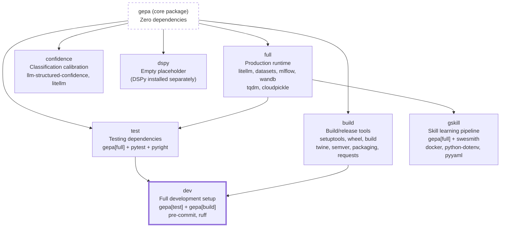

This page covers setting up a local development environment for GEPA, understanding the dependency architecture, and configuring the build system. For information about running tests, see [Testing Infrastructure](9.2). For CI/CD workflows, see [CI/CD Pipeline](9.3).

---

## Python Version Support

GEPA supports Python 3.10 through 3.14, as specified in `pyproject.toml`. The project uses conditional dependencies to handle compatibility requirements across Python versions:

| Python Version | Key Differences |
|----------------|-----------------|
| **3.10-3.13** | Standard dependencies (e.g., `litellm>=1.83.0`, `mlflow>=3.11.1`, `wandb`) |
| **3.14+** | Updated dependencies to support Python 3.14 (e.g., `mlflow-skinny>=3.11.1`, `datasets>=4.5.0`, additional `pyarrow`, `pydantic`, `tiktoken` pins) |

The CI pipeline tests all supported versions in parallel using a matrix strategy.

**Sources:** [pyproject.toml:18](), [pyproject.toml:23-40](), [.github/workflows/run_tests.yml:77-79]()

---

## Package Manager: uv

GEPA uses [uv](https://github.com/astral-sh/uv) as its primary package manager. `uv` provides:

- **Fast dependency resolution**: Written in Rust, significantly faster than standard `pip`.
- **Deterministic installs**: The lock file `uv.lock` ensures reproducible environments across development and CI.
- **Virtual environment management**: Integrated venv creation and activation via `uv venv`.
- **Caching**: Automatic dependency caching in CI/CD via `astral-sh/setup-uv`.

All CI/CD workflows use `uv`, and developers are encouraged to use it locally for consistent results.

**Sources:** [.github/workflows/run_tests.yml:25-30](), [.github/workflows/build_and_release.yml:49-51](), [uv.lock:1-13]()

---

## Dependency Architecture

### Core Dependencies

GEPA's core package has **zero required dependencies**, keeping the base installation minimal. All functional features are gated behind optional dependency groups.

### Optional Dependency Groups



**Dependency Groups Breakdown:**

| Group | Purpose | Key Dependencies | Install Command |
|-------|---------|-----------------|-----------------|
| `full` | Production runtime with all optimization features | `litellm`, `datasets`, `mlflow`, `wandb`, `tqdm`, `cloudpickle` | `uv pip install "gepa[full]"` |
| `confidence` | Support for `ConfidenceAdapter` calibration | `llm-structured-confidence`, `litellm` | `uv pip install "gepa[confidence]"` |
| `dspy` | DSPy integration (placeholder) | None | `uv pip install "gepa[dspy]"` |
| `test` | Running tests | `pytest`, `pyright` + `full` dependencies | `uv pip install "gepa[test]"` |
| `build` | Building and releasing packages | `setuptools`, `wheel`, `build`, `twine`, `semver`, `packaging`, `requests` | `uv pip install "gepa[build]"` |
| `dev` | Full development environment | All of `test` + `build` + `pre-commit`, `ruff` | `uv pip install "gepa[dev]"` |
| `gskill` | Automated skill learning for coding agents | `swesmith`, `docker`, `python-dotenv`, `pyyaml` + `full` | `uv pip install "gepa[gskill]"` |

**Sources:** [pyproject.toml:22-74]()

---

## Setting Up Development Environment

### Initial Setup

```bash
# Clone repository
git clone https://github.com/gepa-ai/gepa
cd gepa

# Create virtual environment (Python 3.11 recommended for development)
uv venv .venv --python 3.11

# Activate virtual environment
source .venv/bin/activate  # On Unix/macOS
# .venv\Scripts\activate   # On Windows

# Install development dependencies in editable mode
uv pip install -e ".[dev]"
```

The `-e` flag installs in editable mode, allowing changes to the source code to be immediately reflected.

### Alternative: Using uv sync

For CI/CD and reproducible environments, use `uv sync` which respects the `uv.lock` file:

```bash