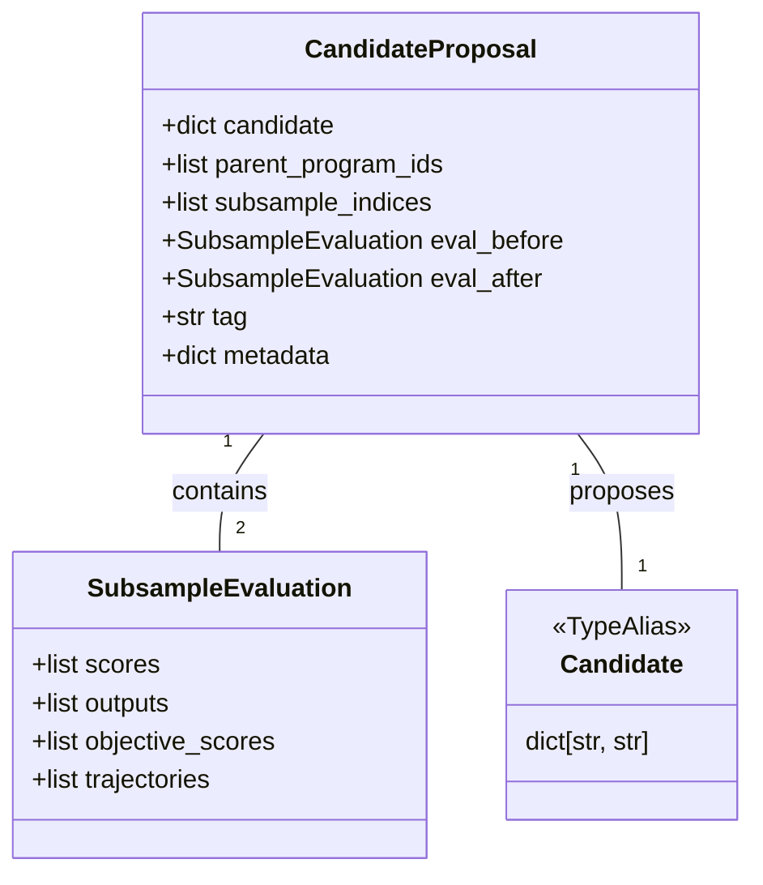

## Purpose and Scope

The Proposer System is responsible for generating new candidate programs during GEPA's optimization loop. It implements a dual-strategy approach where candidates are proposed either through LLM-based reflective mutation or through ancestry-based merging of high-performing candidates. This page explains the proposer architecture, the `ProposeNewCandidate` protocol, and how the two proposer strategies coordinate within the optimization loop.

For detailed documentation of the individual proposer implementations, see [Reflective Mutation Proposer](#4.4.1) and [Merge Proposer](#4.4.2). For information about how candidates are selected from the population, see [Selection Strategies](#4.5). For the overall optimization loop that orchestrates proposers, see [GEPAEngine and Optimization Loop](#4.1).

## Proposer Architecture Overview

GEPA's proposer system implements a plugin-based architecture where multiple proposal strategies can coexist and be coordinated by the `GEPAEngine`. All proposers implement the `ProposeNewCandidate` protocol and return a standardized `CandidateProposal` object.

```mermaid
graph TB
    subgraph "Code Entity Space: Protocols"
        [ProposeNewCandidate]
        [CandidateSelector]
        [ReflectionComponentSelector]
    end
    
    subgraph "Natural Language Space: Proposals"
        [CandidateProposal]
        [SubsampleEvaluation]
        [Candidate]
    end
    
    subgraph "Concrete Implementations"
        [ReflectiveMutationProposer]
        [MergeProposer]
    end
    
    [ReflectiveMutationProposer] -- "implements" --> [ProposeNewCandidate]
    [MergeProposer] -- "implements" --> [ProposeNewCandidate]
    
    [ProposeNewCandidate] -- "returns" --> [CandidateProposal]
    [CandidateProposal] -- "contains" --> [Candidate]
    [CandidateProposal] -- "contains" --> [SubsampleEvaluation]
    
    [ReflectiveMutationProposer] -- "uses" --> [CandidateSelector]
    [ReflectiveMutationProposer] -- "uses" --> [ReflectionComponentSelector]
    
    style [ProposeNewCandidate] stroke-dasharray: 5 5
    style [CandidateSelector] stroke-dasharray: 5 5
```

**Proposer System Architecture**

Sources: [src/gepa/proposer/base.py:31-54](), [src/gepa/proposer/reflective_mutation/base.py:11-24](), [src/gepa/proposer/merge.py:20-21]()

## The ProposeNewCandidate Protocol

The `ProposeNewCandidate` protocol defines the interface that all proposers must implement. It requires a single method `propose` that takes the current `GEPAState` and returns either a `CandidateProposal` or `None`.

| Protocol Method | Signature | Return Value |
|----------------|-----------|--------------|
| `propose` | `(state: GEPAState) -> CandidateProposal \| None` | A proposal if successful, `None` if no valid candidate could be generated |

Both `ReflectiveMutationProposer` and `MergeProposer` implement this protocol. The proposer is responsible for:

1. Selecting or generating a candidate program.
2. Evaluating the candidate on a subsample of data (minibatch).
3. Packaging the result as a `CandidateProposal` if an improvement is detected.

The protocol allows proposers to return `None` to indicate that no valid proposal could be generated in the current iteration. For example, the `MergeProposer` returns `None` if no valid pairs with a common ancestor are found [src/gepa/proposer/merge.py:128-144]().

Sources: [src/gepa/proposer/base.py:46-54](), [src/gepa/proposer/merge.py:20-21]()

## CandidateProposal Data Structure

The `CandidateProposal` is a standardized data structure returned by all proposers. It encapsulates both the proposed candidate and the evidence (subsample scores and outputs) supporting its potential improvement.



**CandidateProposal Structure and Code Entities**

### Field Descriptions

| Field | Type | Description |
|-------|------|-------------|
| `candidate` | `dict[str, str]` | The proposed program mapping component names to text [src/gepa/proposer/base.py:32](). |
| `parent_program_ids` | `list[int]` | Indices of parent programs in `state.program_candidates` [src/gepa/proposer/base.py:33](). |
| `eval_before` | `SubsampleEvaluation` | Detailed evaluation data of the parent(s) on the subsample [src/gepa/proposer/base.py:39](). |
| `eval_after` | `SubsampleEvaluation` | Detailed evaluation data of the new candidate on the subsample [src/gepa/proposer/base.py:40](). |
| `tag` | `str` | Identifies the proposer type: `"reflective_mutation"` or `"merge"` [src/gepa/proposer/base.py:42](). |

The `SubsampleEvaluation` object specifically stores per-example numeric `scores`, raw `outputs`, `objective_scores` for multi-objective runs, and `trajectories` (execution traces) used for reflection [src/gepa/proposer/base.py:12-28]().

Sources: [src/gepa/proposer/base.py:12-44]()

## Dual Proposer Strategy

GEPA orchestrates two complementary proposal strategies that operate in a coordinated manner:

### Reflective Mutation Proposer

The `ReflectiveMutationProposer` generates new candidates by using LLM reflection on execution traces. This is the primary exploration mechanism. It selects a candidate using a `CandidateSelector` (e.g., `ParetoCandidateSelector`), identifies components via a `ReflectionComponentSelector`, and uses a `LanguageModel` to propose improvements based on captured trajectories.

For details, see [Reflective Mutation Proposer](#4.4.1).

Sources: [src/gepa/proposer/reflective_mutation/base.py:11-24](), [src/gepa/strategies/candidate_selector.py:11-13]()

### Merge Proposer

The `MergeProposer` combines components from two high-performing candidates that share a common ancestor. This exploitation strategy helps consolidate improvements from different evolutionary branches by finding "dominator" programs on the Pareto frontier and identifying common ancestors [src/gepa/proposer/merge.py:118-154]().

For details, see [Merge Proposer](#4.4.2).

Sources: [src/gepa/proposer/merge.py:118-171]()

## Two-Phase Evaluation Pattern

Both proposers follow a two-phase evaluation pattern to balance efficiency with accuracy.

### Phase 1: Subsample Evaluation (Proposer Responsibility)

The proposer evaluates candidates on a small subsample (minibatch) to filter unpromising candidates.
- **Minibatch Selection**: Proposers use a `BatchSampler` to select training instances.
- **Trace Capture**: Traces are captured during evaluation to provide context for the reflection LM.

### Phase 2: Full Evaluation (Engine Responsibility)

If a proposal is accepted (typically if the subsample score improves), the `GEPAEngine` performs a full evaluation on the validation set. This updates the global `GEPAState` and the Pareto frontier.

Sources: [src/gepa/core/state.py:142-151](), [src/gepa/proposer/base.py:31-44]()

## Summary

The Proposer System implements GEPA's dual-strategy optimization approach through a protocol-based architecture. The `ProposeNewCandidate` protocol enables pluggable proposal strategies, while the `CandidateProposal` return type ensures uniform handling by the `GEPAEngine`. 

For implementation details of specific proposers, see:
- [Reflective Mutation Proposer](#4.4.1) — LLM-based reflection and mutation.
- [Merge Proposer](#4.4.2) — Ancestry-based candidate merging.
- [Callback System](#4.4.3) — How proposers signal events (e.g., `EvaluationStartEvent`, `EvaluationEndEvent`) to the rest of the system [src/gepa/proposer/merge.py:10-15]().