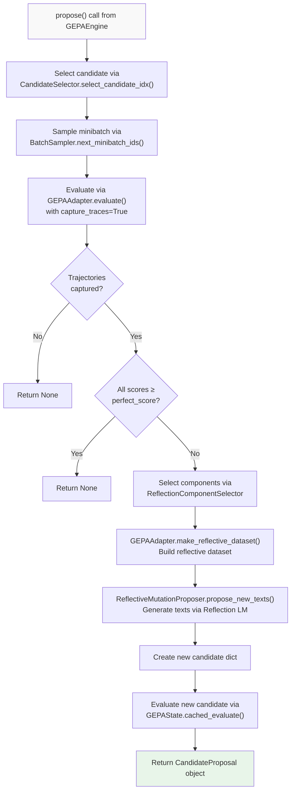
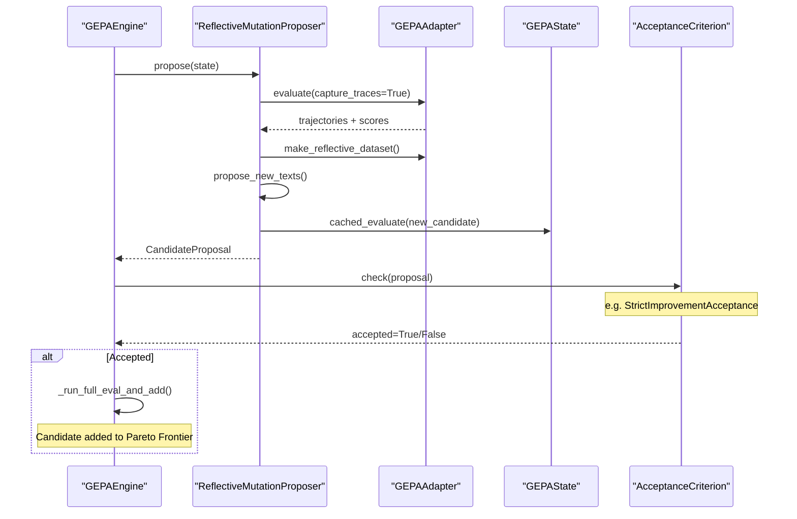
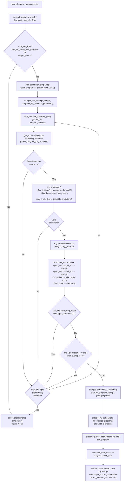
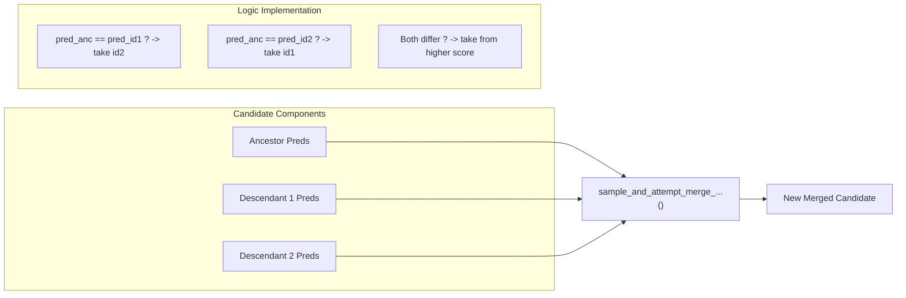
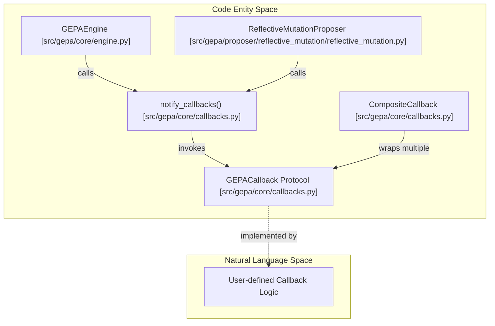
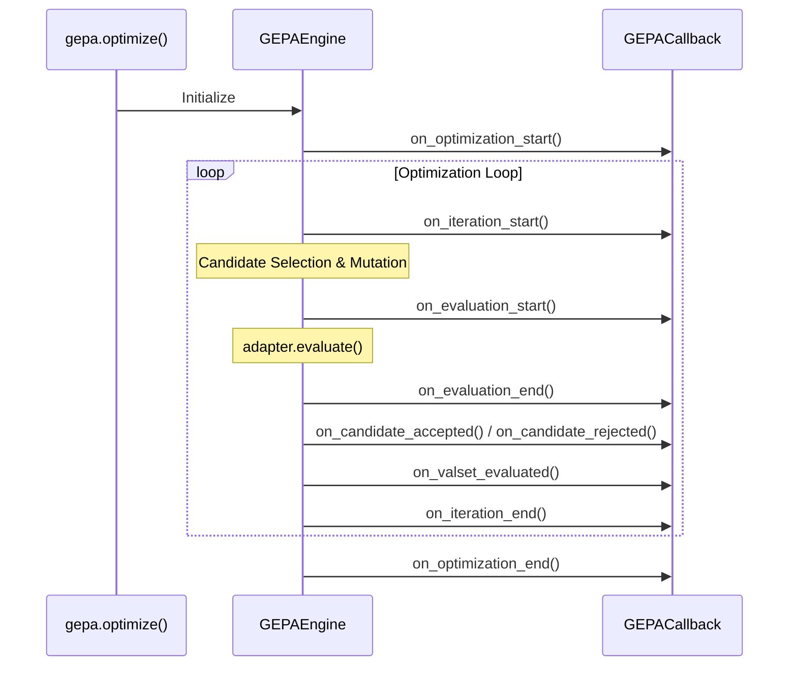
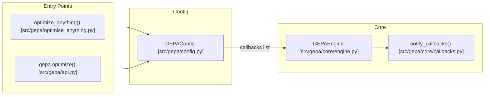
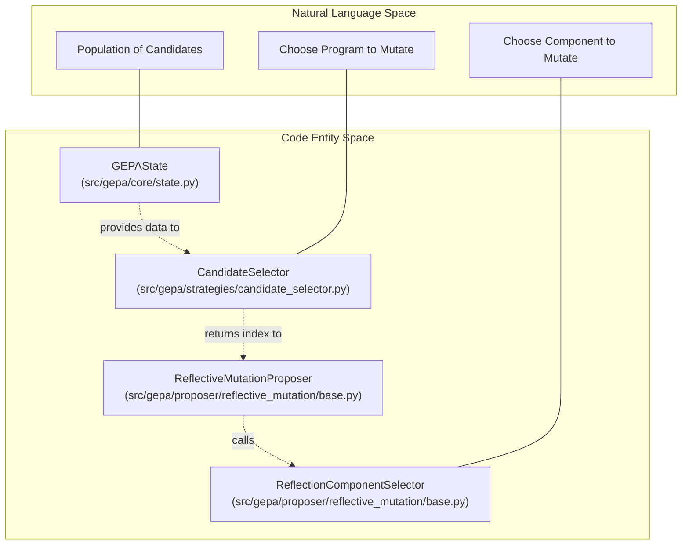
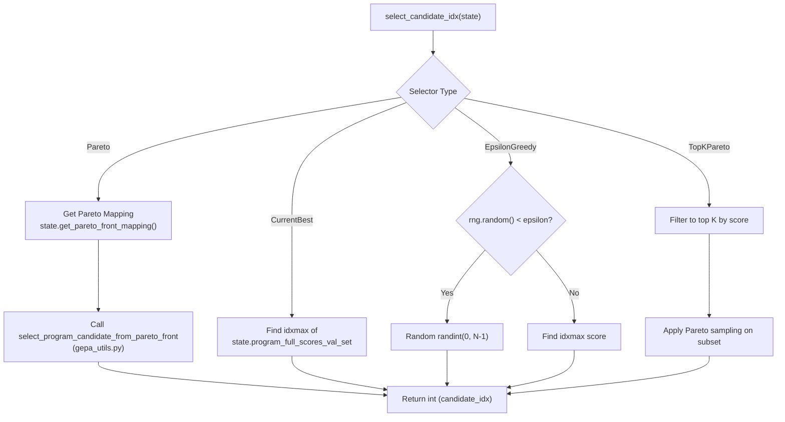
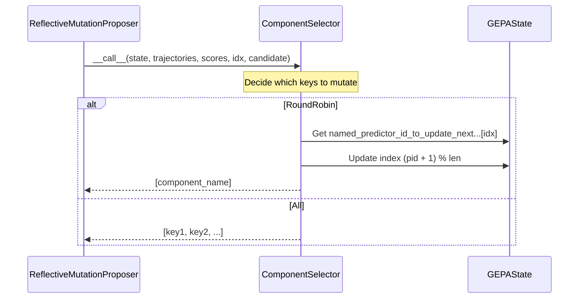

This page provides a detailed explanation of the `ReflectiveMutationProposer` class, which implements the core reflective mutation strategy in GEPA. This proposer uses LLM-based reflection on execution traces to iteratively improve text components of a system.

For information about the merge-based proposer, see [Merge Proposer](#4.4.2). For an overview of the proposer architecture, see [Proposer System](#4.4). For details on selection strategies, see [Selection Strategies](#4.5).

---

## Purpose and Scope

The Reflective Mutation Proposer is responsible for:
1. Selecting a candidate program from the current population.
2. Evaluating it on a training minibatch while capturing execution traces.
3. Using those traces to generate a reflective dataset with feedback.
4. Proposing new text components via LLM reflection or custom logic.
5. Evaluating the mutated candidate and providing it to the engine for acceptance.

This process leverages rich execution information (traces, intermediate outputs, evaluation feedback) to guide the LLM toward better text components, rather than proposing mutations blindly.

Sources: [src/gepa/proposer/reflective_mutation/reflective_mutation.py:66-123](), [src/gepa/api.py:98-124]()

---

## Class Structure

The `ReflectiveMutationProposer` class is defined in [src/gepa/proposer/reflective_mutation/reflective_mutation.py:66-258]() and implements the `ProposeNewCandidate` protocol. It supports parallel execution by splitting the workflow into `prepare_proposal`, `execute_proposal`, and `apply_proposal_output`.

### Constructor Parameters

| Parameter | Type | Description |
|-----------|------|-------------|
| `logger` | `Any` | Logger for progress output |
| `trainset` | `DataLoader` | Training data source [src/gepa/proposer/reflective_mutation/reflective_mutation.py:77-77]() |
| `adapter` | `GEPAAdapter` | System adapter for evaluation and reflection [src/gepa/proposer/reflective_mutation/reflective_mutation.py:78-78]() |
| `candidate_selector` | `CandidateSelector` | Strategy for selecting which candidate to mutate [src/gepa/proposer/reflective_mutation/reflective_mutation.py:79-79]() |
| `module_selector` | `ReflectionComponentSelector` | Strategy for selecting which components to update [src/gepa/proposer/reflective_mutation/reflective_mutation.py:80-80]() |
| `batch_sampler` | `BatchSampler` | Strategy for sampling training examples [src/gepa/proposer/reflective_mutation/reflective_mutation.py:81-81]() |
| `perfect_score` | `float \| None` | Score considered "perfect" [src/gepa/proposer/reflective_mutation/reflective_mutation.py:82-82]() |
| `skip_perfect_score` | `bool` | Whether to skip mutation when scores are perfect [src/gepa/proposer/reflective_mutation/reflective_mutation.py:83-83]() |
| `reflection_lm` | `LanguageModel \| None` | LLM for generating new texts [src/gepa/proposer/reflective_mutation/reflective_mutation.py:85-85]() |
| `reflection_prompt_template` | `str \| dict \| None` | Custom prompt template for reflection [src/gepa/proposer/reflective_mutation/reflective_mutation.py:86-86]() |

Sources: [src/gepa/proposer/reflective_mutation/reflective_mutation.py:74-89]()

---

## Reflective Mutation Workflow

The following diagram illustrates the complete reflective mutation process, mapping the logical flow to the implementation in `ReflectiveMutationProposer`.

### Natural Language Space to Code Entity Space: Proposal Workflow



Sources: [src/gepa/proposer/reflective_mutation/reflective_mutation.py:165-258](), [src/gepa/core/engine.py:299-310]()

---

## Detailed Process Steps

### Step 1: Candidate Selection and Batch Sampling
The proposer first identifies which existing program to mutate using a `CandidateSelector` (e.g., `ParetoCandidateSelector` [src/gepa/api.py:32]()) and samples a minibatch of training data using the `BatchSampler` [src/gepa/proposer/reflective_mutation/reflective_mutation.py:182-184]().

### Step 2: Trace Capture and Evaluation
The current candidate is evaluated on the minibatch with `capture_traces=True` [src/gepa/proposer/reflective_mutation/reflective_mutation.py:187-187](). This instructs the `GEPAAdapter` to record execution trajectories, such as LLM prompts, tool calls, or intermediate state changes [src/gepa/api.py:109-111]().

### Step 3: Reflective Dataset Building
The `GEPAAdapter.make_reflective_dataset` method transforms raw trajectories and scores into a structured format for the reflection LM [src/gepa/proposer/reflective_mutation/reflective_mutation.py:218-220](). This dataset typically contains:
- The input provided to the system.
- The output generated by the current component.
- Feedback or ground truth comparison.

Sources: [src/gepa/api.py:119-123](), [src/gepa/proposer/reflective_mutation/reflective_mutation.py:120-125]()

### Step 4: LLM Proposal (InstructionProposalSignature)
The `propose_new_texts` method handles the generation of improved instructions [src/gepa/proposer/reflective_mutation/reflective_mutation.py:120-163](). It uses `InstructionProposalSignature` to render a prompt containing the `<curr_param>` (current instruction) and `<side_info>` (reflective dataset) [src/gepa/strategies/instruction_proposal.py:13-29]().

```python
# Deterministic template rendering in InstructionProposalSignature
prompt = prompt_template.replace("<curr_param>", current_instruction)
prompt = prompt.replace("<side_info>", formatted_text)
```
Sources: [src/gepa/strategies/instruction_proposal.py:111-112]()

### Step 5: Evaluation and Proposal Creation
The mutated candidate is evaluated on the same minibatch using `GEPAState.cached_evaluate` [src/gepa/proposer/reflective_mutation/reflective_mutation.py:241-243](). A `CandidateProposal` is then created, containing the new program and the "before vs. after" scores [src/gepa/proposer/reflective_mutation/reflective_mutation.py:251-258]().

---

## Engine Integration and Acceptance

The `GEPAEngine` coordinates the proposer and decides whether to promote the proposal to the full validation set based on an `AcceptanceCriterion` [src/gepa/core/engine.py:124-124]().

### System Component Interaction



Sources: [src/gepa/core/engine.py:299-323](), [src/gepa/proposer/reflective_mutation/reflective_mutation.py:251-258](), [src/gepa/strategies/acceptance.py:1-40]()

---

## Evaluation Caching

The `ReflectiveMutationProposer` utilizes `EvaluationCache` to minimize redundant LLM calls [src/gepa/core/state.py:30](). 

- **Cache Put**: After the initial trace-capture evaluation, the results are stored in the cache [src/gepa/proposer/reflective_mutation/reflective_mutation.py:194-198]().
- **Cache Get**: When evaluating the newly mutated candidate, the engine/proposer checks if this specific (candidate, example) pair has been seen before via `state.cached_evaluate` [src/gepa/core/engine.py:164-166]().

Sources: [src/gepa/proposer/reflective_mutation/reflective_mutation.py:194-198](), [src/gepa/core/engine.py:164-166]()

---

## Configuration via optimize()

Users configure the reflective mutation process through the `optimize` API [src/gepa/api.py:43-96]().

| Parameter | Impact |
|-----------|--------|
| `reflection_minibatch_size` | Number of training examples used for a single reflection step [src/gepa/api.py:58-58](). |
| `module_selector` | Strategy for choosing which component to mutate (e.g., `round_robin`) [src/gepa/api.py:63-63](). |
| `reflection_prompt_template` | Custom prompt for the reflection LM [src/gepa/api.py:60-60](). |
| `acceptance_criterion` | Logic for accepting a proposal (e.g., `strict_improvement`) [src/gepa/api.py:94-95](). |

Sources: [src/gepa/api.py:50-96]()

# Merge Proposer


The Merge Proposer implements GEPA's second proposal strategy, which combines successful descendants of common ancestors to create new candidate programs. This complements the Reflective Mutation Proposer (see [4.4.1]()) by exploiting the evolutionary lineage structure rather than relying on LLM-based reflection. The merge strategy identifies programs on the Pareto front that share a common ancestor and combines their improved components to create potentially superior candidates.

**Sources**: [src/gepa/proposer/merge.py:1-347](), [src/gepa/core/engine.py:234-297]()

---

## Purpose and Scope

The `MergeProposer` class in [src/gepa/proposer/merge.py:203-211]() implements a genetic algorithm-inspired crossover operation adapted for multi-component text optimization. When two programs independently evolve from a common ancestor and both outperform it, their improved components likely address different weaknesses. The merge strategy combines these complementary improvements into a single candidate.

This page covers:
- Common ancestor identification and lineage traversal.
- Predictor combination logic for creating merged candidates.
- Subsample evaluation strategy for efficient merge filtering.
- Integration with the optimization loop and scheduling mechanisms.

For the broader proposal system architecture, see [4.4](). For state management and lineage tracking, see [4.2]().

**Sources**: [src/gepa/proposer/merge.py:203-238]()

---

## Merge Strategy Overview

The merge operation follows a four-phase process: candidate selection, ancestor identification, component combination, and subsample evaluation.

### Merge Flow Diagram



**Sources**: [src/gepa/proposer/merge.py:278-346](), [src/gepa/proposer/merge.py:112-200](), [src/gepa/proposer/merge.py:63-109](), [src/gepa/gepa_utils.py:118-132]()

---

## Common Ancestor Identification

The merge proposer identifies pairs of programs suitable for merging by finding common ancestors in the evolutionary lineage tree stored in `GEPAState.parent_program_for_candidate` [src/gepa/core/state.py:158]().

### Ancestor Search Algorithm

The `find_common_ancestor_pair()` function implements the following logic:

| Step | Function | Description |
|------|----------|-------------|
| 1 | Sample pair | Randomly select two programs `i` and `j` from Pareto front dominators [src/gepa/proposer/merge.py:90-95](). |
| 2 | Collect ancestors | Recursively traverse `parent_list` for both programs to find all preceding versions [src/gepa/proposer/merge.py:97-98](). |
| 3 | Find intersection | Compute the intersection of both ancestor sets [src/gepa/proposer/merge.py:104](). |
| 4 | Filter candidates | Apply `filter_ancestors()` to ensure the ancestor is valid and outperformed [src/gepa/proposer/merge.py:105](). |
| 5 | Weight selection | Choose an ancestor weighted by its aggregate score [src/gepa/proposer/merge.py:108-112](). |

**Sources**: [src/gepa/proposer/merge.py:63-115]()

### Ancestor Filtering Criteria

The `filter_ancestors()` function ensures merge quality by rejecting ancestors that:

1. **Have been merged before**: Checks `merges_performed[0]` for the triplet `(i, j, ancestor)` [src/gepa/proposer/merge.py:56-57]().
2. **Outperform descendants**: Only merges if the ancestor score is lower than or equal to both descendants [src/gepa/proposer/merge.py:59-60]().
3. **Lack diverging predictors**: Uses `does_triplet_have_desirable_predictors()` to ensure at least one component has been updated in one descendant while remaining identical to the ancestor in the other [src/gepa/proposer/merge.py:62-63]().

**Sources**: [src/gepa/proposer/merge.py:46-66](), [src/gepa/proposer/merge.py:27-43]()

---

## Predictor Combination Logic

Once a valid triplet (ancestor, descendant1, descendant2) is identified, the merge creates a new candidate by combining predictors component-by-component.

### Code-to-Logic Mapping



The logic in [src/gepa/proposer/merge.py:163-183]() applies these rules for each predictor (text component):

| Predictor State | Ancestor | Descendant 1 | Descendant 2 | Merge Decision |
|----------------|----------|--------------|--------------|----------------|
| **Case 1** | A | A | B | Take B (D2 improved it) [src/gepa/proposer/merge.py:167-171]() |
| **Case 2** | A | B | A | Take B (D1 improved it) [src/gepa/proposer/merge.py:167-171]() |
| **Case 3** | A | B | C | Take from higher-scoring descendant [src/gepa/proposer/merge.py:173-177]() |
| **Case 4** | A | B | B | Take B (both converged) [src/gepa/proposer/merge.py:167-171]() |

**Sources**: [src/gepa/proposer/merge.py:163-183]()

---

## Subsample Evaluation Strategy

Before committing to full validation, the merge proposer performs a quick subsample evaluation to filter obviously poor merges. This is handled by `select_eval_subsample_for_merged_program()` [src/gepa/proposer/merge.py:246]().

### Evaluation Process

1. **Subsample Selection**: Identifies validation examples where the two parents disagree significantly or have high variance in performance [src/gepa/proposer/merge.py:246-276]().
2. **Evaluation**: Calls the `evaluator` on the subsample [src/gepa/proposer/merge.py:302-308]().
3. **Acceptance**: The `GEPAEngine` checks if the merged candidate's subsample sum is greater than or equal to the maximum of its parents' subsample sums [src/gepa/core/engine.py:244-245]().

**Sources**: [src/gepa/proposer/merge.py:246-346](), [src/gepa/core/engine.py:244-245]()

---

## Scheduling and Integration

The merge proposer integrates with the optimization loop through a scheduling mechanism controlled by the `GEPAEngine`.

### Integration with GEPAEngine

The engine coordinates merge scheduling in the main optimization loop [src/gepa/core/engine.py:234-297](). Merges are only attempted when `last_iter_found_new_program=True` (set after a reflective mutation succeeds [src/gepa/core/engine.py:284-288]()).

### Configuration Parameters

The `MergeProposer` constructor accepts parameters from the `MergeConfig` (via `optimize()` [src/gepa/api.py:65-67]()):

| Parameter | Type | Default | Description |
|-----------|------|---------|-------------|
| `use_merge` | `bool` | `False` | Global enable/disable flag. |
| `max_merge_invocations` | `int` | 5 | Maximum total merge attempts across run. |
| `merge_val_overlap_floor` | `int` | 5 | Minimum overlapping validation examples required. |

**Sources**: [src/gepa/api.py:65-67](), [src/gepa/proposer/merge.py:214-233](), [src/gepa/core/engine.py:234-297]()

---

## Implementation Details

### Data Structures

The merge proposer maintains deduplication logs in `merges_performed` [src/gepa/proposer/merge.py:237]():
- `merges_performed[0]` (`list[AncestorLog]`): Tracks attempted triplets `(id1, id2, ancestor)` [src/gepa/proposer/merge.py:22]().
- `merges_performed[1]` (`list[MergeDescription]`): Tracks specific predictor combinations `(id1, id2, predictor_sources)` [src/gepa/proposer/merge.py:23]().

### Trace Logging

Detailed information is logged to `state.full_program_trace` [src/gepa/proposer/merge.py:311-332](), including `merged_entities` (the triplet indices) and subsample scores.

**Sources**: [src/gepa/proposer/merge.py:16-25](), [src/gepa/proposer/merge.py:237](), [src/gepa/proposer/merge.py:311-332]()

# Callback System


The callback system provides a comprehensive observability and instrumentation framework for GEPA optimization runs. It enables users to monitor, log, and respond to events throughout the optimization lifecycle without modifying core algorithms. Callbacks are synchronous and observational, receiving a live reference to the `GEPAState` for maximum inspection capability.

For details on the core optimization loop that triggers these events, see [GEPAEngine and Optimization Loop](). For information on the state object accessible via callbacks, see [State Management and Persistence]().

## Core Architecture

The callback system is built around the `GEPACallback` protocol, structured event `TypedDict` objects, and a robust notification mechanism.

### GEPACallback Protocol

The `GEPACallback` protocol [src/gepa/core/callbacks.py:257-385]() defines over 20 optional methods. A class implementing any subset of these methods satisfies the protocol due to its `@runtime_checkable` nature [src/gepa/core/callbacks.py:256]().

```python
@runtime_checkable
class GEPACallback(Protocol):
    def on_optimization_start(self, event: OptimizationStartEvent) -> None: ...
    def on_iteration_start(self, event: IterationStartEvent) -> None: ...
    def on_evaluation_end(self, event: EvaluationEndEvent) -> None: ...
    # All methods are optional
```

### Event Data Structures

Each callback method receives exactly one argument: a `TypedDict` containing all relevant event data [src/gepa/core/callbacks.py:47-48](). This pattern ensures backward compatibility when adding new fields.

| Event Type | Key Fields | Purpose |
|:---|:---|:---|
| `OptimizationStartEvent` | `seed_candidate`, `trainset_size`, `config` | Initialization parameters [src/gepa/core/callbacks.py:51-58]() |
| `IterationStartEvent` | `iteration`, `state`, `trainset_loader` | Start of a loop iteration [src/gepa/core/callbacks.py:69-75]() |
| `EvaluationEndEvent` | `scores`, `outputs`, `trajectories`, `objective_scores` | Results from an adapter evaluation [src/gepa/core/callbacks.py:114-126]() |
| `ProposalEndEvent` | `new_instructions`, `prompts`, `raw_lm_outputs` | Reflection LM outputs and extracted text [src/gepa/core/callbacks.py:156-165]() |
| `ValsetEvaluatedEvent` | `average_score`, `is_best_program`, `scores_by_val_id` | Validation set performance [src/gepa/core/callbacks.py:217-230]() |
| `BudgetUpdatedEvent` | `metric_calls_used`, `metric_calls_remaining` | Real-time cost and budget tracking [src/gepa/core/callbacks.py:239-246]() |

**Sources:** [src/gepa/core/callbacks.py:51-246]()

### Notification Infrastructure



**Diagram: Callback Invocation and Implementation Bridge**

The `notify_callbacks()` utility [src/gepa/core/callbacks.py:521-546]() safely iterates through provided callbacks. If a callback fails, the error is logged as a warning, but the optimization process continues [src/gepa/core/callbacks.py:542-545]().

**Sources:** [src/gepa/core/callbacks.py:387-546](), [src/gepa/core/engine.py:9-26]()

## Optimization Lifecycle and Events

GEPA fires events at every critical junction of the optimization process, from initial setup to final results.

### Lifecycle Sequence



**Diagram: Sequence of Primary Callback Events**

- **on_optimization_start** [src/gepa/core/engine.py:316-329](): Fired once at the beginning of `GEPAEngine.run()`.
- **on_valset_evaluated** [src/gepa/core/engine.py:203-220](): Fired whenever a candidate is evaluated on the validation set, providing per-example scores and an aggregate average.
- **on_optimization_end** [src/gepa/core/engine.py:577-588](): Fired after the loop terminates, providing the final `GEPAState`.

**Sources:** [src/gepa/core/engine.py:203-220, 316-329, 577-588](), [src/gepa/core/callbacks.py:51-67, 217-231]()

### Reflection and Proposal Events

During reflective mutation, specific events track the "thought process" of the optimizer:

- **on_reflective_dataset_built** [src/gepa/proposer/reflective_mutation/reflective_mutation.py:280-290](): Occurs after the adapter processes trajectories into a reflection-ready format.
- **on_proposal_start** [src/gepa/proposer/reflective_mutation/reflective_mutation.py:292-302](): Fired immediately before calling the reflection LM.
- **on_proposal_end** [src/gepa/proposer/reflective_mutation/reflective_mutation.py:306-314](): Captures the raw LM output and the extracted instructions. This is the primary hook for debugging "why" the optimizer suggested a specific change.

**Sources:** [src/gepa/proposer/reflective_mutation/reflective_mutation.py:280-314](), [src/gepa/core/callbacks.py:138-165]()

### Budget and State Events

GEPA provides real-time tracking of resource consumption and persistence:

- **on_budget_updated** [src/gepa/core/engine.py:352-363](): Triggered via a state hook whenever `metric_calls` are incremented.
- **on_state_saved** [src/gepa/core/engine.py:383-390](): Fired after a checkpoint is written to the `run_dir`.
- **on_pareto_front_updated** [src/gepa/core/engine.py:184-192](): Fired whenever the Pareto frontier changes, listing indices of newly added and displaced candidates.

**Sources:** [src/gepa/core/engine.py:184-192, 352-364, 383-390](), [src/gepa/core/callbacks.py:209-215, 232-246]()

## Implementation Details

### CompositeCallback

The `CompositeCallback` [src/gepa/core/callbacks.py:387-519]() is a performance-optimized wrapper for multiple callbacks. It caches method lookups [src/gepa/core/callbacks.py:408-410]() and ensures that an error in one callback does not prevent others from receiving the event [src/gepa/core/callbacks.py:446-450]().

### Mutability Policy

While most events are observational, GEPA explicitly allows mutation in specific fields to support dynamic optimization patterns:
- **Dynamic Training Data**: Users can call `.add_items()` on `event["trainset_loader"]` during `on_iteration_start` [docs/docs/guides/callbacks.md:8-9]().
- **State Inspection**: Callbacks receive the **live** `GEPAState` [docs/docs/guides/callbacks.md:6](). While direct mutation of state fields is discouraged, it allows for deep inspection of candidate lineage and evaluation history.

**Sources:** [src/gepa/core/callbacks.py:387-519](), [docs/docs/guides/callbacks.md:1-12]()

### Integration with Proposers

The `GEPAEngine` passes its callback list to proposers during initialization [src/gepa/api.py:360, 379](). This allows the `ReflectiveMutationProposer` and `MergeProposer` to fire specialized events like `on_minibatch_sampled` [src/gepa/proposer/reflective_mutation/reflective_mutation.py:174-183]() and `on_merge_attempted` [src/gepa/core/engine.py:419-428]().

**Sources:** [src/gepa/api.py:347-402](), [src/gepa/core/engine.py:419-428](), [src/gepa/proposer/reflective_mutation/reflective_mutation.py:174-183]()

### Integration with optimize_anything

The `optimize_anything` API accepts callbacks via the `GEPAConfig` object [tests/test_optimize_anything_callbacks.py:42-50](). These callbacks receive the same events as those used in the lower-level `gepa.optimize` API [tests/test_optimize_anything_callbacks.py:25-56]().



**Diagram: Callback Propagation from Top-Level APIs**

**Sources:** [tests/test_optimize_anything_callbacks.py:25-56](), [src/gepa/optimize_anything.py:1-13]()

# Selection Strategies


This page documents the selection strategies used in GEPA's evolutionary optimization loop. Selection occurs at two levels: **candidate selection** (picking which program from the population to evolve) and **component selection** (picking which specific text modules within that program to mutate).

## Overview: Two-Level Selection

GEPA's selection system operates hierarchically during each iteration of the `ReflectiveMutationProposer`. First, a program index is chosen from the current population in `GEPAState`. Second, specific components (e.g., instructions, few-shot examples) within that program are selected for reflection and modification.

### Natural Language to Code Entity Space

The following diagram bridges high-level selection concepts to the specific classes and methods in the codebase:



**Sources:** [src/gepa/proposer/reflective_mutation/base.py:8-24](), [src/gepa/core/state.py:142-176]()

## Candidate Selection Strategies

Candidate selection strategies implement the `CandidateSelector` protocol [src/gepa/proposer/reflective_mutation/base.py:8-13](). They determine which program index (`int`) should be selected based on the current `GEPAState`.

### Built-in Candidate Selectors

| Strategy Class | String Alias | Description | Implementation |
| :--- | :--- | :--- | :--- |
| `ParetoCandidateSelector` | `"pareto"` | Samples from the Pareto frontier based on per-example or per-objective performance. | [src/gepa/strategies/candidate_selector.py:11-24]() |
| `CurrentBestCandidateSelector` | `"current_best"` | Greedily selects the candidate with the highest aggregate validation score. | [src/gepa/strategies/candidate_selector.py:27-33]() |
| `EpsilonGreedyCandidateSelector` | `"epsilon_greedy"` | With probability $\epsilon$, picks a random candidate; otherwise picks the current best. | [src/gepa/strategies/candidate_selector.py:36-50]() |
| `TopKParetoCandidateSelector` | `"top_k_pareto"` | Restricts Pareto selection to the top $K$ programs by aggregate score. | [src/gepa/strategies/candidate_selector.py:53-82]() |

### Selection Logic Detail

The `GEPAState` provides the necessary metrics (validation scores, objective scores, and Pareto mapping) for these selectors to function [src/gepa/core/state.py:157-176]().



**Sources:** [src/gepa/strategies/candidate_selector.py:1-83](), [src/gepa/core/state.py:157-161]()

## Component Selection Strategies

Component selection strategies implement the `ReflectionComponentSelector` protocol [src/gepa/proposer/reflective_mutation/base.py:16-24](). They decide which specific text components (keys in the candidate dictionary) should be updated.

### RoundRobinReflectionComponentSelector
Cycles through components in a fixed order for each candidate. It maintains state within `GEPAState.named_predictor_id_to_update_next_for_program_candidate` to ensure each component is eventually mutated [src/gepa/strategies/component_selector.py:19-24]().
*   **Implementation:** [src/gepa/strategies/component_selector.py:10-24]()
*   **Behavior:** Increments the internal counter for the specific candidate index and returns a list containing a single component name.

### AllReflectionComponentSelector
Selects every component in the candidate for simultaneous mutation.
*   **Implementation:** [src/gepa/strategies/component_selector.py:27-36]()
*   **Behavior:** Returns `list(candidate.keys())` [src/gepa/strategies/component_selector.py:36-36]().

### Component Selection Data Flow



**Sources:** [src/gepa/strategies/component_selector.py:1-37](), [tests/test_module_selector.py:156-175]()

## Configuration and Integration

Selection strategies are configured via the `optimize()` or `optimize_anything()` entry points. The `EngineConfig` class in the configuration system allows users to specify these strategies by name or instance [docs/docs/guides/candidate-selection.md:60-72]().

### Factory Resolution
While the `GEPAEngine` handles the execution, the proposer setup typically defaults to specific strategies:
1.  **Candidate Selectors:** Default is often `"pareto"` [docs/docs/guides/candidate-selection.md:11-14]().
2.  **Component Selectors:** Defaults to `RoundRobinReflectionComponentSelector` [tests/test_module_selector.py:49-70]().

### Usage in Proposer
The `ReflectiveMutationProposer` (and other proposers like `MergeProposer`) use these strategies to focus the search:
*   In `MergeProposer`, selection involves finding "dominator" programs and common ancestors to identify viable merge candidates [src/gepa/proposer/merge.py:69-115]().
*   In `ReflectiveMutationProposer`, the `CandidateSelector` is called to pick the source for mutation, and the `ComponentSelector` identifies the specific prompt/code keys to pass to the reflection LM.

**Sources:** [src/gepa/proposer/merge.py:69-115](), [tests/test_module_selector.py:49-123](), [docs/docs/guides/candidate-selection.md:1-54]()

## Custom Strategies

Users can implement custom strategies by satisfying the protocols:
*   **Custom Candidate Selection:** Implement `CandidateSelector` and pass the instance to the engine configuration [docs/docs/guides/candidate-selection.md:141-156]().
*   **Custom Component Selection:** Implement a callable following the `ReflectionComponentSelector` signature and pass it to `module_selector` [tests/test_module_selector.py:127-154]().

**Sources:** [src/gepa/proposer/reflective_mutation/base.py:8-24](), [tests/test_module_selector.py:127-154]()