This page documents GEPA's `Signature` abstraction for structured LLM prompting and response parsing. The Signature system provides a reusable pattern for converting structured inputs into prompts, calling language models, and extracting structured outputs. This abstraction is primarily used by proposers during reflection to generate improved candidate texts.

For the LLM wrapper layer that executes prompts, see [LM Wrapper Class](#6.1). For how signatures are used in instruction proposal, see [Instruction Proposal Signatures](#6.3).

---

## Purpose and Design Philosophy

The `Signature` class serves as a template pattern for LLM interactions. Rather than scattering prompt construction and parsing logic throughout the codebase, signatures encapsulate three concerns:

1.  **Prompt rendering**: Converting structured input dictionaries into prompts (strings or message lists).
2.  **Output extraction**: Parsing raw LLM responses into structured dictionaries.
3.  **Execution coordination**: Orchestrating the render → call → extract pipeline.

This design enables:
*   **Reusability**: Define a signature once, use it across multiple proposers.
*   **Testability**: Mock LMs can verify prompt rendering and parsing independently.
*   **Extensibility**: Subclass to implement domain-specific prompt patterns.
*   **Metadata tracking**: Capture rendered prompts and raw outputs for debugging.

**Sources:** [src/gepa/proposer/reflective_mutation/base.py:31-65]()

---

## Core Interface and Data Flow

The diagram below illustrates the flow from structured input to structured output via the `Signature.run()` method.

### Data Flow: Natural Language Space to Code Entity Space

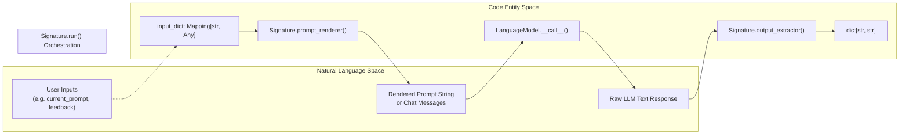

**Data Flow Steps:**

| Step | Method | Input | Output | Purpose |
| :--- | :--- | :--- | :--- | :--- |
| 1 | `prompt_renderer` | `input_dict: Mapping[str, Any]` | `str \| list[dict[str, Any]]` | Transform inputs into LLM-ready format. |
| 2 | LM call | Rendered prompt | Raw string response | Execute language model. |
| 3 | Strip whitespace | Raw response | Trimmed response | Normalize output. |
| 4 | `output_extractor` | Trimmed response | `dict[str, str]` | Parse response into structured data. |

The `run()` method coordinates this pipeline, while `run_with_metadata()` additionally returns the rendered prompt and raw output for observability.

**Sources:** [src/gepa/proposer/reflective_mutation/base.py:46-64]()

---

## Signature Class Definition

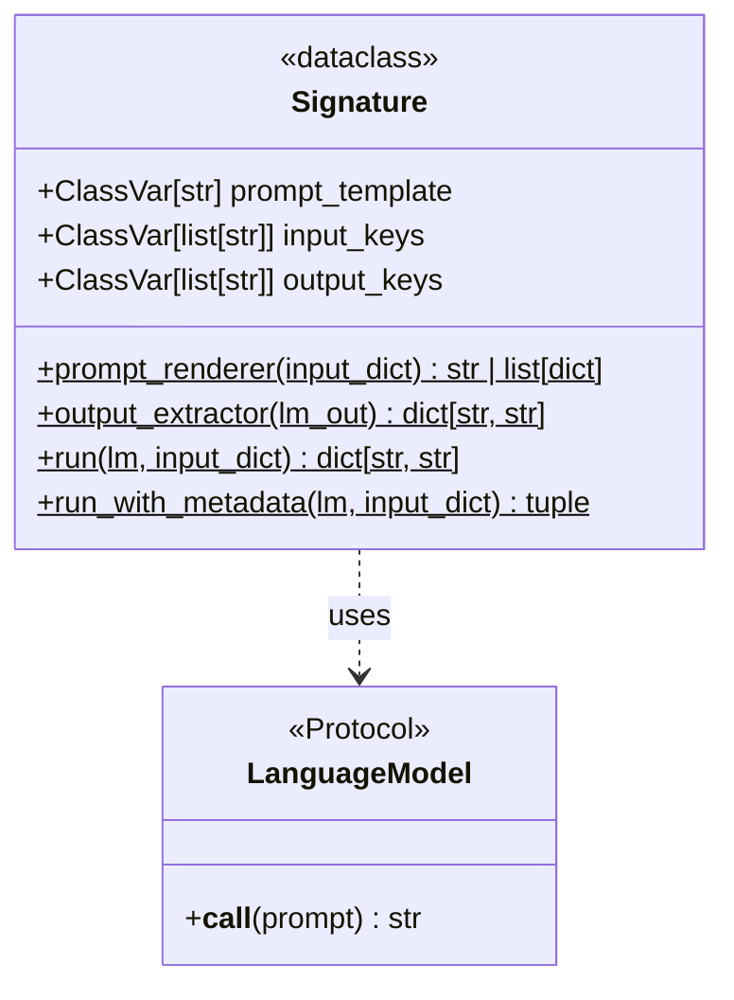

### Class Variables

All signatures must define three class-level variables:

*   **`prompt_template`**: Template string defining the prompt structure (may include placeholders).
*   **`input_keys`**: List of expected keys in `input_dict` passed to `prompt_renderer`.
*   **`output_keys`**: List of keys expected in the dictionary returned by `output_extractor`.

These variables serve as documentation and enable validation in signature subclasses.

**Sources:** [src/gepa/proposer/reflective_mutation/base.py:32-35]()

---

## Required Methods

### `prompt_renderer(input_dict: Mapping[str, Any]) -> str | list[dict[str, Any]]`

Converts a structured input dictionary into an LLM-compatible prompt format.

**Parameters:**
*   `input_dict`: Mapping containing all inputs needed to render the prompt (keys should match `input_keys`).

**Returns:**
*   **String prompt**: For completion-style LLMs (e.g., raw text prompts).
*   **Message list**: For chat-style LLMs (list of `{"role": ..., "content": ...}` dicts).

**Implementation requirements:**
*   Must be a `@classmethod`.
*   Should validate that all required `input_keys` are present.
*   May perform formatting, serialization (e.g., JSON), or template substitution.

**Sources:** [src/gepa/proposer/reflective_mutation/base.py:37-39]()

---

### `output_extractor(lm_out: str) -> dict[str, str]`

Parses the raw LLM response into a structured dictionary.

**Parameters:**
*   `lm_out`: Stripped string output from the language model.

**Returns:**
*   Dictionary mapping output keys to extracted values (all values must be strings).

**Implementation requirements:**
*   Must be a `@classmethod`.
*   Should handle malformed outputs gracefully (raise meaningful errors or return defaults).
*   Keys should match `output_keys`.
*   All values must be strings (downstream code expects this).

**Sources:** [src/gepa/proposer/reflective_mutation/base.py:41-43]()

---

### `run(lm: LanguageModel, input_dict: Mapping[str, Any]) -> dict[str, str]`

Executes the full signature pipeline: render → call → extract.

**Implementation:**
[src/gepa/proposer/reflective_mutation/base.py:46-50]()
```python
@classmethod
def run(cls, lm: LanguageModel, input_dict: Mapping[str, Any]) -> dict[str, str]:
    full_prompt = cls.prompt_renderer(input_dict)
    lm_res = lm(full_prompt)
    lm_out = lm_res.strip()
    return cls.output_extractor(lm_out)
```

This method is **provided by the base class** and typically does not need to be overridden. Subclasses customize behavior by implementing `prompt_renderer` and `output_extractor`.

**Sources:** [src/gepa/proposer/reflective_mutation/base.py:45-50]()

---

### `run_with_metadata(lm: LanguageModel, input_dict: Mapping[str, Any]) -> tuple`

Like `run()`, but also returns the rendered prompt and raw LM output for debugging and logging.

**Returns:**
*   3-tuple: `(extracted_output, rendered_prompt, raw_lm_output)`
    *   `extracted_output`: Same as `run()` return value.
    *   `rendered_prompt`: Output of `prompt_renderer` (string or message list).
    *   `raw_lm_output`: Raw stripped string from LM (before parsing).

**Sources:** [src/gepa/proposer/reflective_mutation/base.py:52-64]()

---

## Integration with Proposers

Signatures are invoked by proposers (like those implementing the `ProposeNewCandidate` protocol) during the reflection phase.

### System Interaction: Reflection to Candidate Proposal

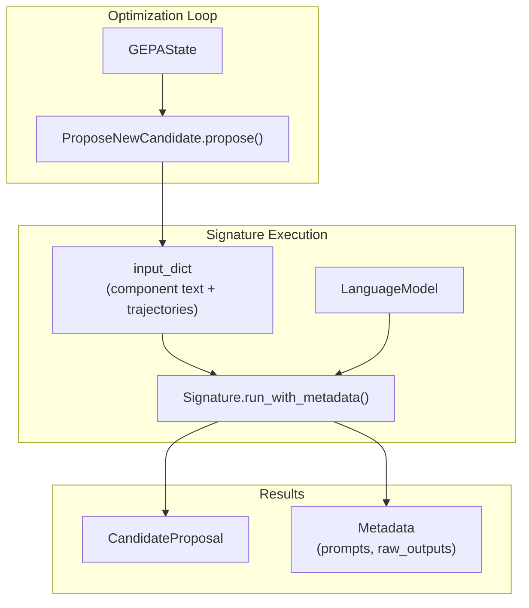

1.  **Context Building**: Proposer constructs an `input_dict` using data from `GEPAState` (e.g., current candidate text and `Trajectory` feedback).
2.  **Signature execution**: Calls `Signature.run()` or `Signature.run_with_metadata()`.
3.  **Output collection**: Aggregates new texts into a `CandidateProposal`.
4.  **Metadata Tracking**: The `run_with_metadata` output is often stored in the `CandidateProposal.metadata` field for later analysis in `GEPAResult`.

**Sources:** [src/gepa/proposer/base.py:31-43](), [src/gepa/proposer/reflective_mutation/base.py:52-64]()

---

## Creating and Testing Custom Signatures

### Subclassing Pattern

To create a custom signature, inherit from `Signature` and implement the abstract class methods.

```python
from gepa.proposer.reflective_mutation.base import Signature

class MyCustomSignature(Signature):
    prompt_template = "Improve this: {text}"
    input_keys = ["text"]
    output_keys = ["improved_text"]

    @classmethod
    def prompt_renderer(cls, input_dict):
        return cls.prompt_template.format(text=input_dict["text"])

    @classmethod
    def output_extractor(cls, lm_out: str) -> dict[str, str]:
        return {"improved_text": lm_out}
```

### Unit Testing Pattern

The test suite demonstrates how to verify signature behavior without calling real LLMs by using a mock `LanguageModel`.

**Key tests from codebase:**
*   **Stripping behavior**: [tests/proposer/test_signature_base.py:22-32]() verifies that `Signature.run()` handles string responses correctly and strips whitespace before passing to the extractor.
*   **Input passing**: [tests/proposer/test_signature_base.py:34-53]() ensures the `prompt_renderer` is called with the exact `input_dict` provided.
*   **Whitespace normalization**: [tests/proposer/test_signature_base.py:55-74]() confirms that `output_extractor` receives stripped output even if the LM returns leading/trailing spaces.

**Sources:** [tests/proposer/test_signature_base.py:1-74](), [src/gepa/proposer/reflective_mutation/base.py:31-50]()

---

## Summary of Key Entities

| Entity | Role | Source |
| :--- | :--- | :--- |
| `Signature` | Base class for structured LLM interactions. | [src/gepa/proposer/reflective_mutation/base.py:31-65]() |
| `LanguageModel` | Protocol for LLM callables used by Signatures. | [src/gepa/proposer/reflective_mutation/base.py:27-28]() |
| `prompt_renderer` | Classmethod to convert dict to prompt string/messages. | [src/gepa/proposer/reflective_mutation/base.py:37-39]() |
| `output_extractor` | Classmethod to parse LM string into dict. | [src/gepa/proposer/reflective_mutation/base.py:41-43]() |
| `run` | Orchestrator method for the full pipeline. | [src/gepa/proposer/reflective_mutation/base.py:45-50]() |
| `run_with_metadata` | Pipeline execution with debug info capture. | [src/gepa/proposer/reflective_mutation/base.py:52-64]() |

**Sources:** [src/gepa/proposer/reflective_mutation/base.py:1-65](), [src/gepa/proposer/base.py:31-54](), [src/gepa/core/result.py:15-38]()

# Instruction Proposal Signatures


This page documents the signature implementations used by GEPA to propose new candidate texts during optimization. These signatures define how the reflection language model analyzes execution traces and generates improved instructions, prompts, or descriptions.

For information about the general Signature abstraction and protocol, see [Signature System](6.2). For language model wrapper configuration, see [LM Wrapper Class](6.1).

---

## Overview

Instruction proposal signatures serve as the bridge between structured feedback (the reflective dataset) and new candidate text generation. Each signature encapsulates:

1.  **Prompt rendering logic** - Converts current text and feedback into an LLM prompt.
2.  **Output extraction logic** - Parses LLM responses to extract clean instruction text.
3.  **Input/output schema** - Defines expected inputs and outputs.

GEPA provides several specialized signature implementations:
*   `InstructionProposalSignature`: Default general-purpose instruction proposal used across `DefaultAdapter` and `DspyAdapter`.
*   `ToolProposer`: Specialized for optimizing tool descriptions and predictor instructions jointly in tool-using modules.
*   `GenerateEnhancedMultimodalInstructionFromFeedback`: A DSPy-based signature for pattern-aware multimodal reflection.

**Sources:** [src/gepa/strategies/instruction_proposal.py:12-154](), [src/gepa/adapters/dspy_adapter/instruction_proposal.py:17-54](), [src/gepa/adapters/dspy_adapter/dspy_adapter.py:164-173]()

---

## Signature Class Hierarchy

The following diagram maps the Natural Language concept of "Instruction Improvement" to the Code Entity Space, showing how the `Signature` protocol is implemented across different modules.

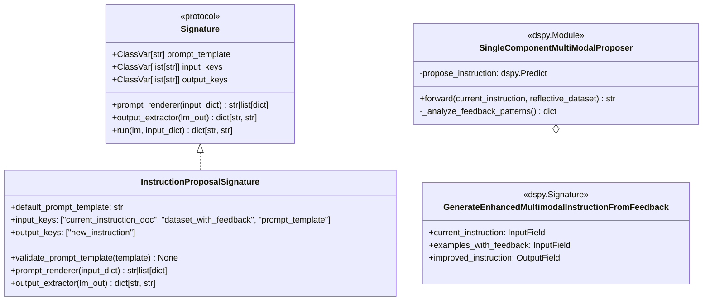

**Sources:** [src/gepa/strategies/instruction_proposal.py:12-32](), [src/gepa/adapters/dspy_adapter/instruction_proposal.py:17-63]()

---

## InstructionProposalSignature

The default signature implementation for proposing improved instructions. It converts a reflective dataset (inputs, outputs, feedback) into a structured prompt that guides the reflection LM to generate better instructions.

### Key Components

| Component | Type | Description |
| :--- | :--- | :--- |
| `default_prompt_template` | `str` | Template with placeholders `<curr_param>` and `<side_info>`. |
| `input_keys` | `list[str]` | `["current_instruction_doc", "dataset_with_feedback", "prompt_template"]`. |
| `output_keys` | `list[str]` | `["new_instruction"]`. |

**Sources:** [src/gepa/strategies/instruction_proposal.py:13-32]()

### Prompt Rendering Flow

The `prompt_renderer` handles both standard text and multimodal data by extracting `Image` objects from the reflective dataset.

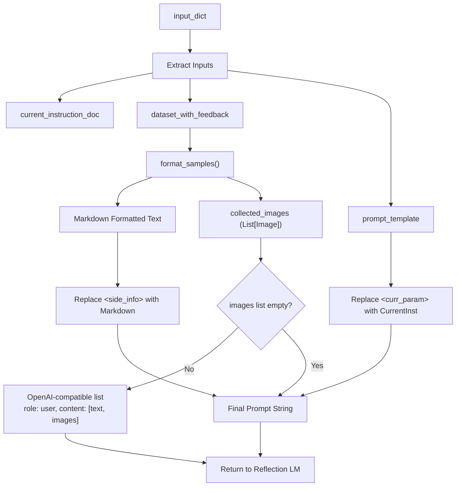

**Sources:** [src/gepa/strategies/instruction_proposal.py:45-122]()

### Default Prompt Template

The default template used when no custom template is provided:

```text
I provided an assistant with the following instructions to perform a task for me:
```
<curr_param>
```

The following are examples of different task inputs provided to the assistant along with the assistant's response for each of them, and some feedback on how the assistant's response could be better:
```
<side_info>
```
... (instructions to identify niche info and generalizable strategies)
Provide the new instructions within ``` blocks.
```

**Sources:** [src/gepa/strategies/instruction_proposal.py:13-29]()

### Reflective Dataset Formatting

The `format_samples()` method converts reflective dataset entries into readable markdown recursively. It supports nested dictionaries, lists, and `Image` objects. Images are replaced with `[IMAGE-N — see visual content]` placeholders in the text and returned as a separate list for the multimodal payload.

**Sources:** [src/gepa/strategies/instruction_proposal.py:54-95]()

### Output Extraction

The `output_extractor()` method parses LLM responses to extract clean instruction text from code blocks, handling various edge cases like missing language specifiers or incomplete blocks.

| Input Format | Extraction Logic |
| :--- | :--- |
| ` ```markdown\ntext\n``` ` | Remove backticks and `markdown` specifier. |
| ` ```\ntext\n``` ` | Remove backticks and whitespace. |
| ` ```text ` (unclosed) | Extract everything after opening backticks. |
| ` text\n``` ` (unstarted) | Extract everything before closing backticks. |
| No backticks | Strip whitespace and return full text. |

**Sources:** [src/gepa/strategies/instruction_proposal.py:125-153](), [tests/test_instruction_proposal.py:12-102]()

---

## Custom Prompt Templates

Users can customize the reflection prompt by providing a string or a dictionary to the `reflection_prompt_template` parameter in `gepa.optimize()`.

### Single Template Mode
Provide a single string template applied to all components. It must contain `<curr_param>` and `<side_info>`.

### Per-Component Template Mode
Provide a dict mapping component names to specific templates. This allows different reflection strategies for different parts of a system (e.g., one for "instructions" and another for "context").

**Sources:** [tests/test_optimize.py:29-43](), [tests/test_optimize.py:115-126]()

---

## Tool and MCP Optimization

While `InstructionProposalSignature` handles general text, specialized adapters like `MCPAdapter` and `DspyAdapter` use it to optimize `tool_description` components. In `DspyAdapter`, the `propose_new_texts` method routes components to either `InstructionProposalSignature` or a specialized `ToolProposer` depending on whether the component name starts with `tool_module`.

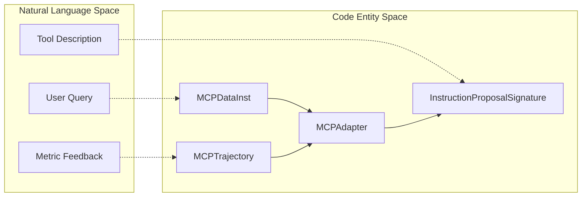

**Sources:** [src/gepa/examples/mcp_adapter/mcp_optimization_example.py:208-221](), [src/gepa/adapters/dspy_adapter/dspy_adapter.py:140-173](), [tests/test_mcp_adapter.py:23-30]()

---

## MultiModalInstructionProposer

The `SingleComponentMultiModalProposer` is a `dspy.Module` that enhances reflection for visual tasks. It goes beyond simple formatting by performing pattern analysis on the feedback.

### Feedback Pattern Analysis
The `_analyze_feedback_patterns` method categorizes feedback into:
*   **Error patterns**: Keywords like "incorrect", "wrong", "missing".
*   **Success patterns**: Keywords like "correct", "accurate", "well".
*   **Domain knowledge gaps**: Keywords like "should know", "context", "background".

These patterns are summarized and prepended to the prompt to help the reflection LM avoid repeating specific mistakes.

**Sources:** [src/gepa/adapters/dspy_adapter/instruction_proposal.py:117-152]()

### Specialized Signature Guidance
The `GenerateEnhancedMultimodalInstructionFromFeedback` signature includes explicit "Analysis Steps" and "Instruction Requirements" in its docstring, specifically targeting visual-textual integration and domain-specific visual knowledge.

**Sources:** [src/gepa/adapters/dspy_adapter/instruction_proposal.py:17-38]()

# Examples and Use Cases


This page demonstrates GEPA's application across different domains with concrete examples, optimized outputs, and performance metrics. GEPA has been deployed in production at companies including Shopify, Databricks, Dropbox, and OpenAI, and is integrated into frameworks like DSPy, MLflow, and Comet ML Opik.

GEPA optimizes systems containing text components:
- **Single prompts**: System instructions for specific tasks.
- **Multi-component pipelines**: RAG systems with query reformulation, synthesis, and reranking prompts.
- **Complete programs**: Evolving entire codebases including function signatures, modules, and control flow.
- **Arbitrary artifacts**: Code, SVG art, CUDA kernels, and configurations via the `optimize_anything` API.

Sources: [README.md:31-49](), [docs/docs/guides/use-cases.md:26-146]()

## Examples-to-Code Mapping

The following table maps example domains to their implementing code entities:

| Example | Adapter Class | Key Implementation Files | Optimized Components |
|---------|---------------|-------------------------|----------------------|
| AIME Math Prompts | `DefaultAdapter` | [src/gepa/adapters/default_adapter/]() | `system_prompt` |
| DSPy Program Evolution | `DspyFullProgramAdapter` | [src/gepa/adapters/dspy_full_program_adapter/]() | Complete program code |
| Universal Artifacts | `OptimizeAnythingAdapter` | [src/gepa/adapters/optimize_anything_adapter.py:1-50]() | `seed_candidate` string |
| MCP Tool Optimization | `MCPAdapter` | [src/gepa/adapters/mcp_adapter.py:1-100]() | Tool descriptions/prompts |
| RAG Multi-Hop QA | `GenericRAGAdapter` | [src/gepa/adapters/generic_rag_adapter/]() | `query`, `synthesis`, `answer` |

Sources: [README.md:151-165](), [src/gepa/core/adapter.py:1-35]()

## Performance Results Summary

| Example | Task | Baseline | GEPA Result | Improvement |
|---------|------|----------|-------------|-------------|
| AIME 2025 | Math competition | GPT-4.1-mini: 46.6% | GPT-4.1-mini: 56.6% | **+10.0%** |
| MATH Benchmark | Program evolution | DSPy ChainOfThought: 67% | Evolved program: 93% | **+26.0%** |
| ARC-AGI | Visual reasoning | Baseline: 32% | Evolved agent: 89% | **+57.0%** |
| Databricks Agents | Enterprise tasks | Claude Opus 4.1 | Open model + GEPA | **90x cheaper** |
| Dropbox Dash | Relevance Judge | NMSE: 8.83 | NMSE: 4.86 | **45% reduction** |
| Jinja Skills | Coding Agent | Mini-SWE-Agent: 55% | With `gskill`: 82% | **+27.0%** |

Sources: [README.md:37-47](), [docs/docs/guides/use-cases.md:46-59](), [docs/docs/blog/posts/2026-02-18-automatically-learning-skills-for-coding-agents/index.md:74-79]()

## Standard Optimization Workflow

All examples follow the core loop implemented by `GEPAEngine`.

**Diagram: Standard GEPA Workflow Across Examples**

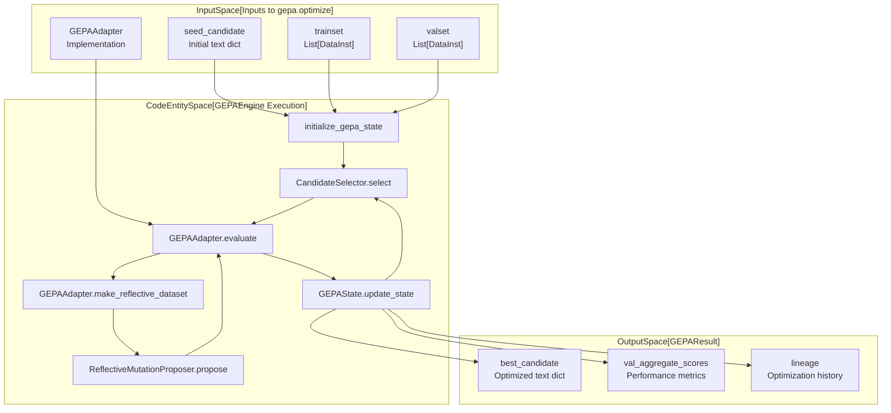

Sources: [src/gepa/core/engine.py:1-100](), [src/gepa/core/adapter.py:10-35](), [src/gepa/api.py:1-50]()

## Example-to-Code Mapping

**Diagram: Mapping Natural Language Domains to Code Entities**

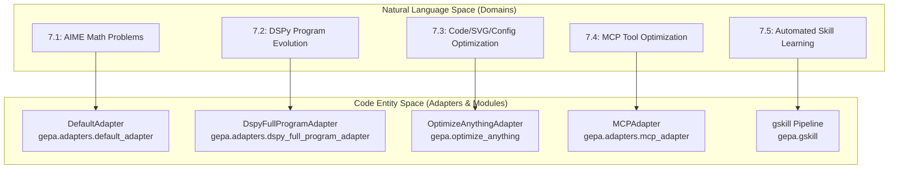

Sources: [README.md:68-132](), [docs/docs/tutorials/index.md:7-28](), [docs/docs/guides/use-cases.md:150-166](), [docs/docs/blog/posts/2026-02-18-automatically-learning-skills-for-coding-agents/index.md:41-49]()

## Detailed Example Walkthroughs

### [AIME Prompt Optimization](#7.1)
Walkthrough of optimizing prompts for AIME math problems using `DefaultAdapter`. Shows evolution from simple instructions to expert-level prompts, achieving a 10% improvement on AIME 2025. For details, see [AIME Prompt Optimization](#7.1).

Sources: [README.md:68-95]()

### [DSPy Program Evolution](#7.2)
Example of evolving entire DSPy programs with multiple predictors. This demonstrates using `DspyFullProgramAdapter` to achieve 93% accuracy on the MATH benchmark by evolving both instructions and program structure. For details, see [DSPy Program Evolution](#7.2).

Sources: [docs/docs/tutorials/index.md:7-12]()

### [optimize_anything Examples](#7.3)
Showcase of the universal `optimize_anything` API for diverse artifacts including Python code, SVG art, CUDA kernels, and cloud scheduling algorithms (ADRS). For details, see [optimize_anything Examples](#7.3).

Sources: [README.md:111-132](), [docs/docs/blog/posts/2026-02-18-introducing-optimize-anything/index.md:44-79]()

### [MCP Tool Optimization](#7.4)
Example of optimizing Model Context Protocol (MCP) tool descriptions and system prompts for local and remote servers, improving tool-use agent reliability. For details, see [MCP Tool Optimization](#7.4).

Sources: [README.md:156-165]()

### [gskill: Automated Skill Learning for Coding Agents](#7.5)
Detailed example of the `gskill` pipeline: using **SWE-smith** to generate tasks from a repository and the GEPA optimization loop to learn repository-specific skills. Demonstrated on `jinja` and `bleve` repositories, showing significant transferability to agents like Claude Code. For details, see [gskill: Automated Skill Learning for Coding Agents](#7.5).

Sources: [docs/docs/blog/posts/2026-02-18-automatically-learning-skills-for-coding-agents/index.md:31-58]()

### [Production Use Cases](#7.6)
Overview of real-world deployments at Shopify, Databricks, Dropbox, and OpenAI. Includes performance metrics, cost savings (e.g., 90x cheaper inference at Databricks), and integration patterns. For details, see [Production Use Cases](#7.6).

Sources: [docs/docs/guides/use-cases.md:26-146]()

# AIME Prompt Optimization


## Purpose and Scope

This document walks through the AIME (American Invitational Mathematics Examination) prompt optimization example, demonstrating how GEPA evolves a simple instruction into a sophisticated, domain-specific prompt. This walkthrough showcases the use of the `optimize_anything` API and the reflective feedback loop to achieve significant accuracy gains on mathematical reasoning tasks.

For general information about the `gepa.optimize` function, see [3.1. The optimize Function](). For details on the universal optimization interface used here, see [3.2. The optimize_anything API]().

## Overview

The AIME benchmark consists of challenging high-school-level math problems where the answer is always an integer between 000 and 999. Optimizing for AIME requires the LLM to not only follow formatting instructions but also to apply specific mathematical strategies (e.g., modular arithmetic constraints, base conversion identities, and combinatorial symmetry).

**Key Characteristics:**
- **Task Type**: Mathematical reasoning and problem-solving.
- **Optimization Target**: A single system prompt (string).
- **Metric**: `math_metric` [examples/aime_math/utils.py:21-39](), which checks for integer equality and provides detailed solution-based feedback.
- **Dataset**: `AI-MO/aimo-validation-aime` for training/validation and `MathArena/aime_2025` for testing [examples/aime_math/utils.py:42-68]().
- **Improvement**: Significant accuracy gains (e.g., ~10%) over a standard "Solve this math problem" baseline [examples/aime_math/main.py:76-78]().

**Sources:** [examples/aime_math/main.py:33-41](), [examples/aime_math/utils.py:21-39]()

## Implementation Architecture

The AIME example utilizes `optimize_anything` to treat the system prompt as a text artifact. It bridges the gap between the DSPy-based solver and the GEPA optimization engine.

### System Mapping to Code Entities

| Natural Language Concept | Code Entity / Symbol | File Path |
| :--- | :--- | :--- |
| **Optimization Entry** | `optimize_anything()` | [src/gepa/optimize_anything.py:126-126]() |
| **Math Solver** | `dspy.ChainOfThought(MathSolverSignature)` | [examples/aime_math/utils.py:12-12]() |
| **Evaluation Logic** | `evaluate()` function | [examples/aime_math/main.py:15-29]() |
| **Feedback Generator** | `math_metric()` | [examples/aime_math/utils.py:21-39]() |
| **Task Model** | `gpt-4.1-mini` | [examples/aime_math/main.py:38-38]() |
| **Reflection Model** | `openai/gpt-5.1` | [examples/aime_math/main.py:53-53]() |

**Sources:** [examples/aime_math/main.py:15-63](), [examples/aime_math/utils.py:7-39]()

### Data Flow Diagram

The diagram below shows how data flows from the HuggingFace datasets through the `optimize_anything` wrapper into the core `GEPAEngine`.

**AIME Optimization Pipeline**
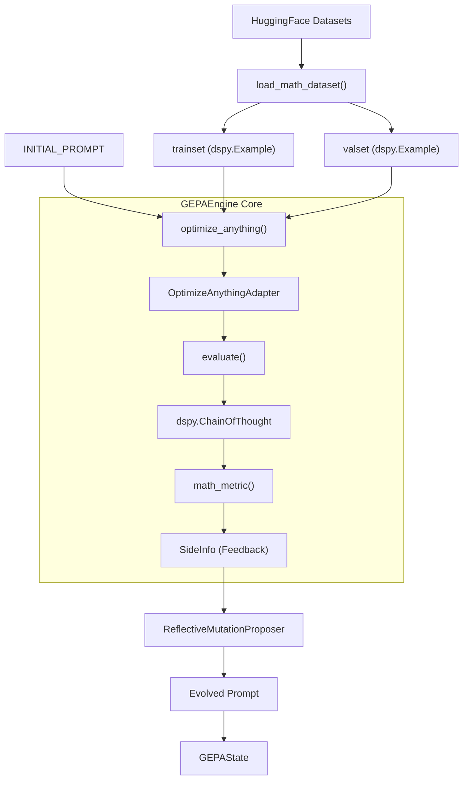
**Sources:** [examples/aime_math/main.py:15-63](), [examples/aime_math/utils.py:15-39](), [src/gepa/optimize_anything.py:126-170]()

## The Optimization Loop

### 1. Evaluation and Feedback
For every candidate prompt, the `evaluate` function is called. It runs the problem through a `dspy.ChainOfThought` predictor [examples/aime_math/utils.py:12-18](). The `math_metric` then compares the result to the ground truth. Crucially, if the training example includes a step-by-step solution, this solution is appended to the feedback as "Actionable Side Information" (ASI) [examples/aime_math/utils.py:24-28]().

### 2. Reflection
The `ReflectiveMutationProposer` [src/gepa/proposers/reflective_mutation.py:46-46]() receives the ASI (the feedback and the correct solution). The Reflection LM (e.g., GPT-5) analyzes why the current prompt failed to lead the solver to the correct answer and proposes modifications to the prompt to handle similar mathematical structures in the future.

### 3. Prompt Evolution
The prompt evolves from a simple instruction into a comprehensive "Expert Math Solver" guide.

**Evolution of Prompt Content:**

| Stage | Prompt Content Example |
| :--- | :--- |
| **Seed** | "Solve the math problem carefully. Break down the steps and provide the final answer as a single number." [examples/aime_math/main.py:33-35]() |
| **Intermediate** | Includes instructions on formatting: "The answer field must contain only the final value requested (e.g., 227, 585, 601)." [assets/annotated_aime_prompt.html:87-87]() |
| **Expert** | Includes domain strategies: "Mod 9 often collapses coefficients... b + c ≡ 0 (mod 9)" or "Palindromes across bases: (A B A)_8 = 65A + 8B." [assets/annotated_aime_prompt.html:100-111]() |

**Sources:** [examples/aime_math/main.py:33-35](), [assets/annotated_aime_prompt.html:74-153]()

## Technical Configuration

The optimization is governed by the `GEPAConfig`, which sets the parallelization and resource limits.

```python
gepa_config = GEPAConfig(
    engine=EngineConfig(
        run_dir="outputs/aime_math",
        max_metric_calls=500,
        parallel=True,
        max_workers=32,
        cache_evaluation=True,
    ),
    reflection=ReflectionConfig(
        reflection_lm="openai/gpt-5.1",
    ),
)
```
- `max_metric_calls=500`: The budget for how many times the solver can be run against the training set [examples/aime_math/main.py:46-46]().
- `cache_evaluation=True`: Prevents re-running the exact same prompt on the same data point, saving costs [examples/aime_math/main.py:50-50]().

**Sources:** [examples/aime_math/main.py:43-55]()

## Result Analysis

The final output of the optimization is a `GEPAResult` object. The script extracts the `best_candidate` (the highest-scoring prompt on the validation set) and performs a final evaluation on the AIME 2025 test set [examples/aime_math/main.py:71-74]().

**Learned Expert Knowledge in Prompt:**
The optimized prompt typically includes:
1.  **Strict Formatting**: Ensuring the LLM doesn't output "The answer is 123" but just "123" [assets/annotated_aime_prompt.html:85-88]().
2.  **Modular Constraints**: Using properties of Mod 9 or Mod 11 to prune search spaces in digit problems [assets/annotated_aime_prompt.html:98-102]().
3.  **Combinatorial Identities**: Correctly characterizing intersecting families of subsets or arithmetic progression anchors [assets/annotated_aime_prompt.html:115-136]().
4.  **Verification Steps**: Mandatory "quick verification" instructions at the end of the reasoning chain [assets/annotated_aime_prompt.html:77-77]().

**Sources:** [examples/aime_math/main.py:70-78](), [assets/annotated_aime_prompt.html:74-153]()

# DSPy Program Evolution


This page provides a detailed walkthrough of using GEPA to evolve complete DSPy programs, including their structure, signatures, and modules. Unlike basic prompt optimization, this approach treats the entire program source code as a mutable artifact, allowing GEPA to evolve complex multi-stage architectures, control flow, and tool-use patterns.

## Overview

GEPA can optimize entire DSPy programs by treating the source code as a text component. This is facilitated by the `DspyAdapter`, which handles the execution of dynamically generated code and extracts execution traces for reflection.

Two primary benchmarks demonstrate this capability:
1.  **MATH Benchmark**: Evolving a simple `dspy.ChainOfThought` module into a multi-stage reasoning and extraction pipeline, improving performance from **67% to 93%** using GPT-4.1 Nano [[src/gepa/examples/dspy_full_program_evolution/example.ipynb:165-178]()].
2.  **ARC-AGI Benchmark**: Evolving a baseline into a 5-step schema involving natural language hypothesizing, Python code generation, and iterative refinement, improving Gemini-2.5-Pro performance from **44% to 49.5%** [[src/gepa/examples/dspy_full_program_evolution/arc_agi.ipynb:8-17]()].

**Sources:** [src/gepa/examples/dspy_full_program_evolution/arc_agi.ipynb:1-18](), [src/gepa/examples/dspy_full_program_evolution/example.ipynb:1-178]()

## The DspyAdapter Implementation

The `DspyAdapter` is the core engine for full program evolution. It inherits from `GEPAAdapter` and implements the logic to build, evaluate, and reflect upon DSPy modules defined as source code [[src/gepa/adapters/dspy_full_program_adapter/full_program_adapter.py:14-14]()].

### Key Components

| Component | Role |
| :--- | :--- |
| `build_program` | Compiles and executes the candidate string to extract a `program` object [[src/gepa/adapters/dspy_full_program_adapter/full_program_adapter.py:36-40]()]. |
| `evaluate` | Runs the DSPy `Evaluate` utility or `bootstrap_trace_data` to capture execution trajectories [[src/gepa/adapters/dspy_full_program_adapter/full_program_adapter.py:83-131]()]. |
| `make_reflective_dataset` | Extracts `TraceData` (inputs, outputs, reasoning, and errors) to provide actionable feedback to the reflection LM [[src/gepa/adapters/dspy_full_program_adapter/full_program_adapter.py:133-186]()]. |

### Program Building and Safety
The adapter uses `exec()` to instantiate the `program` object from the candidate source code [[src/gepa/adapters/dspy_full_program_adapter/full_program_adapter.py:58-65]()]. It performs syntax checks and ensures the code defines a valid `dspy.Module` [[src/gepa/adapters/dspy_full_program_adapter/full_program_adapter.py:48-77]()].

**Diagram: DspyAdapter Program Lifecycle**

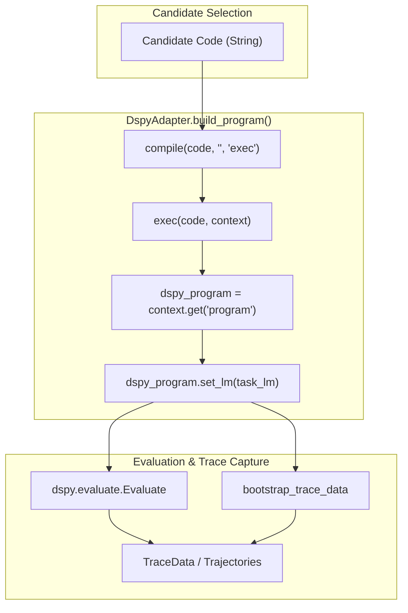

**Sources:** [src/gepa/adapters/dspy_full_program_adapter/full_program_adapter.py:14-131]()

## Reflection and Proposal Signature

The evolution is driven by the `DSPyProgramProposalSignature`. This signature instructs the reflection LM on DSPy concepts like Signatures, Modules (Predict, ChainOfThought, ReAct), and improvement strategies [[src/gepa/adapters/dspy_full_program_adapter/dspy_program_proposal_signature.py:11-70]()].

### Improvement Strategies
The reflection LM is guided to:
1.  **Decompose** complex tasks into multi-step modules if the LM is overloaded [[src/gepa/adapters/dspy_full_program_adapter/dspy_program_proposal_signature.py:64-64]()].
2.  **Refine Signatures** by adding instructions, edge cases, and successful strategies to docstrings [[src/gepa/adapters/dspy_full_program_adapter/dspy_program_proposal_signature.py:66-66]()].
3.  **Incorporate Python Logic** for symbolic or logical operations, delegating only reasoning to the LM [[src/gepa/adapters/dspy_full_program_adapter/dspy_program_proposal_signature.py:67-67]()].
4.  **Use Code Execution** for math or coding tasks by defining signatures that output code for execution in the module's `forward` pass [[src/gepa/adapters/dspy_full_program_adapter/dspy_program_proposal_signature.py:69-69]()].

**Sources:** [src/gepa/adapters/dspy_full_program_adapter/dspy_program_proposal_signature.py:11-91]()

## Example: MATH Benchmark Evolution

In the MATH benchmark (algebra subset), GEPA evolves a baseline program into a sophisticated pipeline.

### Seed Program
The seed is a minimal string representing a standard DSPy module:
```python
program_src = """import dspy
program = dspy.ChainOfThought("question -> answer")"""
```
[[src/gepa/examples/dspy_full_program_evolution/example.ipynb:99-100]()]

### Evolved Program Structure
The resulting optimized program typically evolves into a custom `dspy.Module` with multiple signatures. For example, it might separate reasoning from final answer extraction to handle complex algebra [[src/gepa/adapters/dspy_full_program_adapter/dspy_program_proposal_signature.py:50-60]()].

**Diagram: Evolved MATH Program Data Flow**

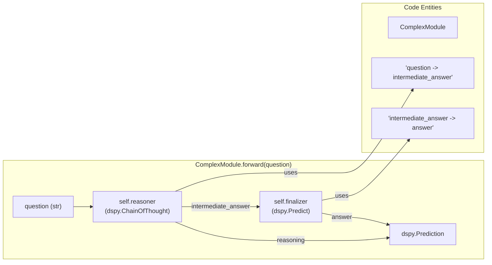

**Sources:** [src/gepa/examples/dspy_full_program_evolution/example.ipynb:99-101](), [src/gepa/adapters/dspy_full_program_adapter/dspy_program_proposal_signature.py:50-61]()

## Implementation Details

### Metric and Feedback
The `metric_fn` not only returns a score but also `feedback_text`. This text includes the correct answer and the step-by-step reasoning from the gold dataset when the prediction is incorrect [[src/gepa/examples/dspy_full_program_evolution/example.ipynb:125-131]()].

### Optimization Loop
The `gepa.optimize` function is called with the `DspyAdapter`. It requires a `reflection_lm` (often a high-capacity model like GPT-4) and a `task_lm` (the model being optimized, which can be smaller/faster) [[src/gepa/examples/dspy_full_program_evolution/example.ipynb:140-147]()].

```python
adapter = DspyAdapter(
    task_lm=dspy.LM(model="openai/gpt-4.1-nano"),
    metric_fn=metric_fn,
    reflection_lm=lambda x: reflection_lm(x)[0],
)
```
[[src/gepa/examples/dspy_full_program_evolution/example.ipynb:141-147]()]

### Robustness and Testing
The `DspyAdapter` includes error handling for cases where the evolved code fails to compile or execute. In such cases, it returns a `failure_score` and captures the traceback as feedback for the next iteration [[src/gepa/adapters/dspy_full_program_adapter/full_program_adapter.py:47-63](), [tests/test_dspy_full_program_adapter.py:59-70]()].

**Sources:** [src/gepa/examples/dspy_full_program_evolution/example.ipynb:125-147](), [src/gepa/adapters/dspy_full_program_adapter/full_program_adapter.py:47-131](), [tests/test_dspy_full_program_adapter.py:55-110]()

# optimize_anything Examples


This page demonstrates `optimize_anything` across diverse domains, showcasing how the same API optimizes code, agent architectures, mathematical solvers, visual artifacts, and cloud infrastructure policies. Each example illustrates one of the three optimization modes (single-task search, multi-task search, generalization) and highlights how Actionable Side Information (ASI) enables targeted improvements.

For basic usage and API details, see **3.2. The optimize_anything API**. For prompt optimization examples, see **7.1. AIME Prompt Optimization**. For coding agent skill learning, see **7.5. gskill: Automated Skill Learning for Coding Agents**.

---

## Optimization Mode Overview

`optimize_anything` supports three distinct modes determined by the presence of `dataset` and `valset` parameters:

**Optimization Mode Decision Flow**
```mermaid
graph TD
    [Start] --> [CheckDataset]
    [CheckDataset] -- "dataset=None" --> [SingleTaskMode]
    [CheckDataset] -- "dataset=list" --> [CheckValset]
    [CheckValset] -- "valset=None" --> [MultiTaskMode]
    [CheckValset] -- "valset=list" --> [GeneralizationMode]
    
    [SingleTaskMode] -- "Candidate is solution" --> [SingleDesc]
    [MultiTaskMode] -- "Solve batch of tasks" --> [MultiDesc]
    [GeneralizationMode] -- "Build transferable skill" --> [GenDesc]

    subgraph "Natural Language Space"
    [SingleDesc]
    [MultiDesc]
    [GenDesc]
    end

    subgraph "Code Entity Space"
    [SingleTaskMode]
    [MultiTaskMode]
    [GeneralizationMode]
    [CheckDataset]
    [CheckValset]
    end
```
Sources: [src/gepa/optimize_anything.py:22-43]()

The mode determines evaluator signature and how candidates are scored:

| Mode | Evaluator Signature | Candidate Role | Pareto Frontier |
|------|-------------------|----------------|-----------------|
| **Single-Task** | `evaluate(candidate) -> score` | Candidate is the solution | Tracked per objective metric |
| **Multi-Task** | `evaluate(candidate, example) -> score` | Candidate applied to each example | Tracked per task + per metric |
| **Generalization** | `evaluate(candidate, example) -> score` | Candidate must generalize | Tracked on validation set |

---

## Single-Task Search Examples

In single-task mode, the candidate itself is the solution to one hard problem. The evaluator receives only the candidate (no `example` argument).

### Circle Packing

**Problem:** Pack $n=26$ circles in a unit square to maximize the sum of their radii.

**Evaluator Structure:**
```mermaid
graph LR
    [CandidateCode] -- "Execute" --> [Subprocess]
    [Subprocess] -- "Compute" --> [PackingScore]
    [PackingScore] -- "ASI" --> [ReflectiveMutationProposer]
    
    subgraph "ASI Diagnostics"
    [OverlapViolations]
    [BoundaryViolations]
    [GeometricFeedback]
    end
    
    [Subprocess] -.-> [OverlapViolations]
    [Subprocess] -.-> [BoundaryViolations]
```

**Key ASI Fields:**
- Packing score (sum of radii)
- Number of overlapping circles
- Circles outside boundary
- Visualization of current packing (via `oa.log()`) [src/gepa/optimize_anything.py:58-59]()

**Results:** GEPA reaches score 2.63598+, outperforming competitive evolution baselines.

---

### Blackbox Mathematical Optimization

**Problem:** Discover an optimization algorithm tailored to a specific blackbox objective function from the `EvalSet` benchmark [examples/blackbox/evalset/evalset.py:103-157]().

**Evaluator Implementation Pattern:**
```python
def evaluate(candidate: str, opt_state: OptimizationState) -> tuple[float, dict]:
    """Evaluate a solver algorithm on the objective function."""
    # Extract previous best xs for warm-starting
    best_xs = extract_best_xs(opt_state) # examples/blackbox/main.py:42
    
    # Execute candidate code to get solver function
    result = execute_code(
        code=candidate,
        problem_index=46,
        budget=2000,
        best_xs=best_xs
    ) # examples/blackbox/main.py:44-49
    
    # ASI: diagnostic info for reflection
    side_info = {
        "score": result["score"],
        "all_trials": result.get("all_trials", []),
        "stdout": result.get("stdout", ""),
        "error": result.get("error", "")
    }
    return result["score"], side_info
```

**Key Insight:** GEPA learns problem-specific strategies. For deceptive traps, it designs multi-start search from diverse initial points.

Sources: [examples/blackbox/main.py:34-64](), [src/gepa/optimize_anything.py:77-88]()

---

## Multi-Task Search Examples

In multi-task mode, the evaluator receives an `example` parameter and is called once per task. Insights from solving one task transfer to others.

### CUDA Kernel Generation

**Problem:** Generate fast CUDA kernels for multiple PyTorch operations, evaluated on GPU hardware.

**Optimization Flow:**
```mermaid
graph TB
    [GEPAEngine] -- "Select" --> [ParetoCandidateSelector]
    [ParetoCandidateSelector] -- "Task" --> [KernelEvaluator]
    [KernelEvaluator] -- "Compile/Bench" --> [PerformanceASI]
    [PerformanceASI] -- "Reflect" --> [ReflectiveMutationProposer]
    [ReflectiveMutationProposer] -- "New Prompt" --> [CandidatePool]
    
    subgraph "Code Entities"
    [GEPAEngine]
    [ParetoCandidateSelector]
    [ReflectiveMutationProposer]
    end
```
Sources: [src/gepa/optimize_anything.py:128-148]()

**Results:**
- GEPA identifies hardware-specific optimizations (e.g., shared memory tiling) that generalize across different tensor operations.

---

### SVG Art Generation

**Problem:** Optimize SVG source code depicting complex scenes starting from a blank canvas.

**Key Feature:** The rendered image is passed back as ASI using `gepa.Image` [src/gepa/image.py:1-20](), enabling the VLM proposer to visually inspect its own output.

Sources: [src/gepa/optimize_anything.py:130-131]()

---

## Generalization Mode Examples

In generalization mode, candidates must perform well on unseen examples from `valset`. The Pareto frontier tracks performance on validation data.

### Agent Architecture Discovery (ARC-AGI)

**Problem:** Evolve the entire agent system (code, sub-agent architecture, control flow, prompts) for ARC-AGI puzzles [examples/arc_agi/main.py:23-39]().

**Evaluator Implementation:**
```python
def evaluate(candidate: str, example) -> tuple[float, SideInfo]:
    """Evaluate an agent on a single ARC problem."""
    result = run_agent(
        agent_code=candidate,
        train_in=example.train_in,
        train_out=example.train_out,
        test_in=example.test_in,
        test_out=example.test_out,
        model_id=LLM_MODEL
    ) # examples/arc_agi/main.py:44-52

    score = result["test_score"]
    side_info: SideInfo = {
        "score": score,
        "problem_id": example.problem_id,
        "error": result["error"],
        **result["llms"].get_traces() # Capture LLM costs/trajectories
    }
    return score, side_info
```

Sources: [examples/arc_agi/main.py:42-74](), [examples/arc_agi/utils.py:145-175]()

---

### Cloud Infrastructure Algorithms

#### Can't Be Late: Spot Instance Scheduling
**Objective:** Decide when to use cheap-but-preemptible SPOT instances vs reliable ON_DEMAND instances to complete tasks before deadlines.
**Results:** GEPA discovers adaptive scheduling policies that track spot availability patterns, achieving significant cost savings over standard heuristics.

---

## Seedless Optimization

When `seed_candidate=None`, the reflection LM bootstraps the first candidate from `objective` and `background` descriptions.

**Seedless Bootstrap Process:**
```mermaid
graph TB
    [Objective] --> [BootstrapSignature]
    [Background] --> [BootstrapSignature]
    [BootstrapSignature] -- "LLM Proposal" --> [InitialCandidate]
    [InitialCandidate] -- "First Eval" --> [GEPAEngineLoop]

    subgraph "Internal Logic"
    [BootstrapSignature]
    [InitialCandidate]
    end
```
Sources: [src/gepa/optimize_anything.py:44-49]()

---

## Optimization Control and Stopping

GEPA provides a comprehensive suite of `StopperProtocol` implementations to manage optimization budgets.

| Stopper Class | Condition | File Pointer |
| :--- | :--- | :--- |
| `MaxMetricCallsStopper` | Stops after $N$ evaluator calls | [src/gepa/utils/stop_condition.py:163-174]() |
| `MaxReflectionCostStopper` | Stops after $X$ USD spent on reflection | [src/gepa/utils/stop_condition.py:176-191]() |
| `MaxCandidateProposalsStopper` | Stops after $M$ proposal iterations | [src/gepa/utils/stop_condition.py:193-208]() |
| `TimeoutStopCondition` | Stops after $T$ seconds | [src/gepa/utils/stop_condition.py:34-43]() |
| `ScoreThresholdStopper` | Stops when a target score is reached | [src/gepa/utils/stop_condition.py:64-81]() |

**Cost Tracking Example:**
The `LM` class tracks cumulative USD cost via LiteLLM [src/gepa/lm.py:73-76](). The `MaxReflectionCostStopper` monitors this to prevent budget overruns [src/gepa/utils/stop_condition.py:188-190]().

Sources: [src/gepa/utils/stop_condition.py:1-210](), [src/gepa/lm.py:30-188]()

# MCP Tool Optimization


## Purpose and Scope

This page demonstrates how to use GEPA to optimize Model Context Protocol (MCP) tool descriptions and system prompts for tool-using agents. MCP is a protocol for exposing tools and resources to LLMs through local or remote servers. GEPA improves tool usage accuracy by evolving tool descriptions based on execution traces and feedback collected during agent interaction.

For general information about the MCP adapter architecture, see [MCP Adapter](#5.6). For broader prompt optimization examples, see [AIME Prompt Optimization](#7.1). For DSPy-based tool optimization, see [DSPy Full Program Evolution](#5.5).

---

## What Gets Optimized

GEPA optimizes the textual components that guide tool usage within an agentic workflow:

| Component | Purpose | Example |
|-----------|---------|---------|
| **Tool Description** | High-level explanation of what the tool does | "Read file contents from disk" → "Read and return the complete text contents of a file given its relative path" |
| **Argument Descriptions** | Explanation of each tool parameter | "path: Relative path to the file" → "path: Relative path from base directory (e.g., 'notes.txt' or 'data/report.pdf')" |
| **System Prompt** | Instructions for the agent using the tools | "You are a helpful assistant" → "You are a file management assistant. Use the available tools to help users read, write, and organize files" |

The optimization process analyzes `MCPTrajectory` objects [src/gepa/adapters/mcp_adapter/mcp_adapter.py:51-70]() containing execution traces (tool calls, arguments, outputs, errors) to identify patterns in successful vs. failed tool usage.

**Sources:** [src/gepa/examples/mcp_adapter/mcp_optimization_example.py:1-32](), [src/gepa/adapters/mcp_adapter/mcp_adapter.py:94-108]()

---

## Architecture Overview

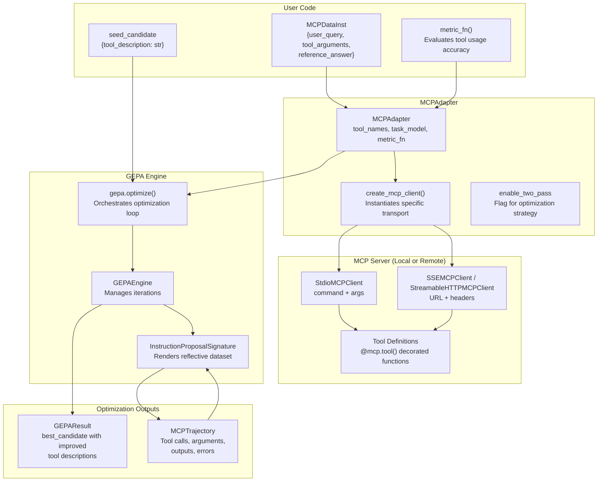

**MCP Tool Optimization Architecture**: This diagram shows how `MCPDataInst` [src/gepa/adapters/mcp_adapter/mcp_adapter.py:34-49]() flows through the `MCPAdapter` [src/gepa/adapters/mcp_adapter/mcp_adapter.py:94-94]() to connect with MCP servers via `create_mcp_client` [src/gepa/adapters/mcp_adapter/mcp_client.py:24-24](), and how the engine uses `InstructionProposalSignature` [src/gepa/strategies/instruction_proposal.py:12-12]() to improve descriptions.

**Sources:** [src/gepa/examples/mcp_adapter/mcp_optimization_example.py:65-154](), [src/gepa/adapters/mcp_adapter/mcp_adapter.py:34-70](), [src/gepa/adapters/mcp_adapter/mcp_client.py:1-15]()

---

## Local vs. Remote Server Setup

The adapter supports three primary transport mechanisms defined in `mcp_client.py`:

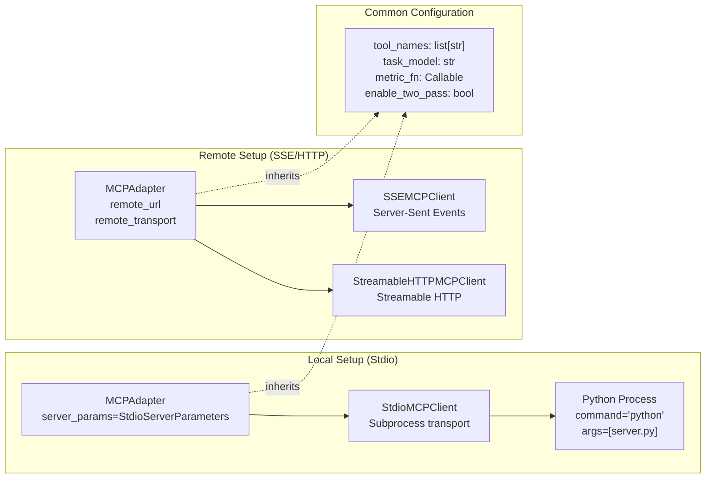

**Local vs. Remote MCP Server Configuration**: Local servers use `StdioMCPClient` [src/gepa/adapters/mcp_adapter/mcp_client.py:66-66]() to spawn a subprocess, while remote servers use `SSEMCPClient` [src/gepa/adapters/mcp_adapter/mcp_client.py:129-129]() or `StreamableHTTPMCPClient`.

**Sources:** [src/gepa/examples/mcp_adapter/mcp_optimization_example.py:194-253](), [src/gepa/adapters/mcp_adapter/mcp_adapter.py:131-163](), [src/gepa/adapters/mcp_adapter/mcp_client.py:66-210]()

---

## Basic Usage Pattern

### Step 1: Create MCP Server (Local Example)

The example uses a `FastMCP` server for file operations [src/gepa/examples/mcp_adapter/mcp_optimization_example.py:69-75]().

```python
# server.py snippet
@mcp.tool()
def read_file(path: str) -> str:
    """Read contents of a file."""
    # ... implementation
```

**Sources:** [src/gepa/examples/mcp_adapter/mcp_optimization_example.py:69-130]()

### Step 2: Define Evaluation Dataset

Each `MCPDataInst` [src/gepa/adapters/mcp_adapter/mcp_adapter.py:34-49]() includes the query and validation data:

```python
dataset = [
    {
        "user_query": "What's in the notes.txt file?",
        "tool_arguments": {"path": "notes.txt"},
        "reference_answer": "3pm",
        "additional_context": {},
    },
]
```

**Sources:** [src/gepa/examples/mcp_adapter/mcp_optimization_example.py:155-177]()

### Step 3: Define Metric Function

The metric evaluates whether the tool was used correctly based on the `MCPOutput` [src/gepa/adapters/mcp_adapter/mcp_adapter.py:72-87]():

```python
def metric_fn(data_inst, output: str) -> float:
    reference = data_inst.get("reference_answer", "")
    return 1.0 if reference and reference.lower() in output.lower() else 0.0
```

**Sources:** [src/gepa/examples/mcp_adapter/mcp_optimization_example.py:179-187]()

### Step 4: Initialize MCPAdapter and Optimize

```python
adapter = MCPAdapter(
    tool_names="read_file",
    task_model="ollama/llama3.1:8b",
    metric_fn=metric_fn,
    server_params=StdioServerParameters(command="python", args=[str(server_file)]),
    enable_two_pass=True,
)

result = gepa.optimize(
    seed_candidate={"tool_description": "Read file contents from disk."},
    trainset=dataset,
    adapter=adapter,
    reflection_lm="ollama/qwen3:8b",
    max_metric_calls=10,
)
```

**Sources:** [src/gepa/examples/mcp_adapter/mcp_optimization_example.py:208-239]()

---

## Two-Pass Execution Mode

When `enable_two_pass=True` [src/gepa/adapters/mcp_adapter/mcp_adapter.py:145-145](), the adapter uses a two-stage execution strategy to isolate planning from synthesis:

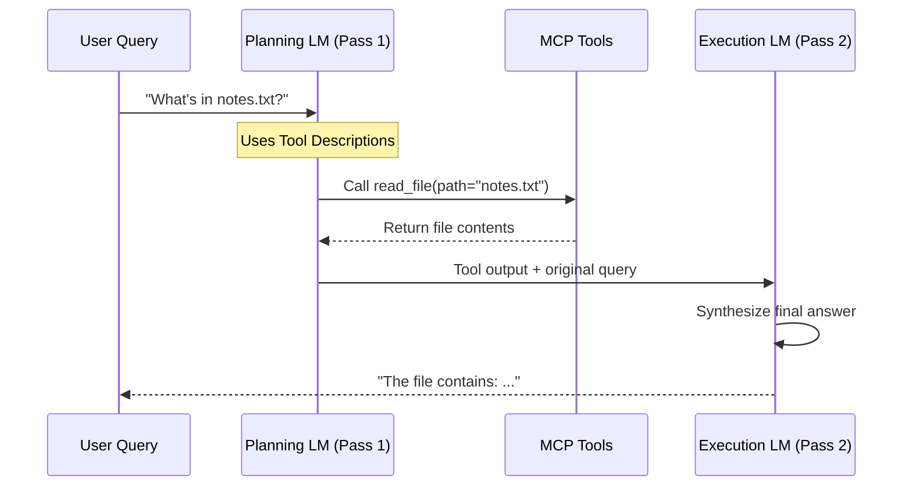

| Pass | Purpose | Input | Output |
|------|---------|-------|--------|
| **1. Planning** | Select tool + arguments | User query, tool descriptions | `tool_arguments` [src/gepa/adapters/mcp_adapter/mcp_adapter.py:63-63]() |
| **2. Execution** | Synthesize answer | Tool output, original query | `final_answer` [src/gepa/adapters/mcp_adapter/mcp_adapter.py:83-83]() |

**Sources:** [src/gepa/adapters/mcp_adapter/mcp_adapter.py:145-145](), [src/gepa/adapters/mcp_adapter/README.md:168-181]()

---

## Multi-Tool Optimization

GEPA can optimize multiple tool descriptions simultaneously. The adapter maps tool names to specific component keys [src/gepa/adapters/mcp_adapter/README.md:208-213]():

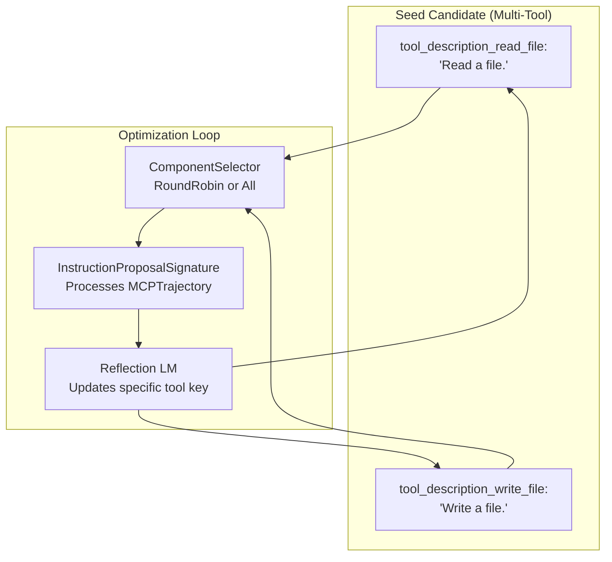

**Multi-Tool Optimization**: Each tool gets a separate component key (e.g., `tool_description_read_file`). The `InstructionProposalSignature` [src/gepa/strategies/instruction_proposal.py:12-12]() renders the trajectory data into a format the reflection LM can use to improve specific descriptions.

**Sources:** [src/gepa/examples/mcp_adapter/mcp_optimization_example.py:328-403](), [src/gepa/adapters/mcp_adapter/README.md:208-218]()

---

## Configuration Options

### MCPAdapter Parameters

| Parameter | Type | Purpose |
|-----------|------|---------|
| `tool_names` | `str \| list[str]` | Tool(s) to optimize [src/gepa/adapters/mcp_adapter/mcp_adapter.py:133-133]() |
| `task_model` | `str \| Callable` | Model for tool execution [src/gepa/adapters/mcp_adapter/mcp_adapter.py:134-134]() |
| `metric_fn` | `Callable` | Scoring function [src/gepa/adapters/mcp_adapter/mcp_adapter.py:135-135]() |
| `server_params` | `StdioServerParameters` | Local server config [src/gepa/adapters/mcp_adapter/mcp_adapter.py:137-137]() |
| `remote_url` | `str` | Remote server endpoint [src/gepa/adapters/mcp_adapter/mcp_adapter.py:139-139]() |
| `enable_two_pass` | `bool` | Use two-stage execution [src/gepa/adapters/mcp_adapter/mcp_adapter.py:145-145]() |

**Sources:** [src/gepa/adapters/mcp_adapter/mcp_adapter.py:131-163]()

---

## Example Walkthrough: File Operations

### Initial Failure
The model might call a tool with a missing extension if the description is vague.
- **Trajectory**: `user_query`: "Read notes", `tool_arguments`: `{"path": "notes"}` [src/gepa/adapters/mcp_adapter/mcp_adapter.py:63-63]().
- **Result**: Error from server.

### Reflective Improvement
The `InstructionProposalSignature` [src/gepa/strategies/instruction_proposal.py:12-12]() renders this failure:
1. **Input**: "Read file contents from disk." [src/gepa/strategies/instruction_proposal.py:46-49]()
2. **Feedback**: The trajectory captured in `MCPTrajectory` [src/gepa/adapters/mcp_adapter/mcp_adapter.py:51-70]() is converted to markdown by `format_samples` [src/gepa/strategies/instruction_proposal.py:54-95]().
3. **Output**: The reflection LM uses the `InstructionProposalSignature.default_prompt_template` [src/gepa/strategies/instruction_proposal.py:13-29]() to suggest a new description, which is extracted by `output_extractor` [src/gepa/strategies/instruction_proposal.py:125-153]().

**Sources:** [src/gepa/strategies/instruction_proposal.py:12-153](), [src/gepa/examples/mcp_adapter/mcp_optimization_example.py:224-249]()

# gskill: Automated Skill Learning for Coding Agents


## Purpose and Scope

This document describes **gskill**, a fully automated pipeline for learning repository-specific skills that improve coding agent performance. gskill combines GEPA's `optimize_anything` API with SWE-smith task generation to iteratively evolve natural-language skill files that guide coding agents in understanding repository structure, debugging patterns, and best practices.

For the general `optimize_anything` API, see [The optimize_anything API](#3.2). For broader coding agent use cases, see [Production Use Cases](#7.6).

## System Overview

gskill operates as a closed-loop optimization system where:

1.  **SWE-smith** generates verifiable software engineering tasks from a target repository by mining real commits and introducing bugs [docs/docs/guides/gskill.md:9-9]().
2.  **Agent rollouts** execute tasks using current skills inside parallel Docker containers, capturing success/failure trajectories [src/gepa/gskill/README.md:15-15]().
3.  **Custom proposers** analyze trajectories and reflect on what went wrong to propose better skills [docs/docs/guides/gskill.md:11-11]().
4.  **GEPA's optimization loop** selects high-performing skill variants via Pareto-efficient search [docs/docs/guides/gskill.md:80-80]().

The learned skills are plain-text markdown files that can be injected into any coding agent (e.g., Claude Code's `.claude/skills/` directory) to improve task completion rates [src/gepa/gskill/gskill/evaluate/claude_code_skills.py:8-12]().

### Natural Language to Code Entity Mapping

The following diagram bridges the high-level "Skill Learning" concept to the specific Python classes and Docker entities used in the implementation.

**Diagram: gskill Implementation Mapping**
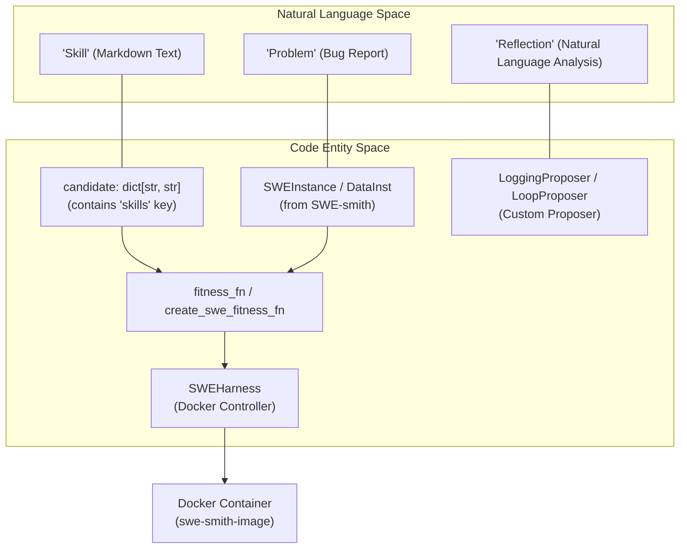
**Sources:** [docs/docs/guides/gskill.md:98-111](), [src/gepa/gskill/gskill/evaluate/claude_code.py:32-32](), [src/gepa/gskill/README.md:15-15]()

## Architecture Components

### SWE-smith Task Generation

SWE-smith is a data generation pipeline that creates verifiable software engineering tasks from any GitHub repository. Each task includes:

*   A problem statement (bug description or feature request)
*   The repository state at a specific commit
*   Test cases that verify correctness

gskill loads SWE-smith tasks and splits them into training, validation, and test sets using `load_and_split_data` [src/gepa/gskill/gskill/evaluate/claude_code.py:72-139]().

**Sources:** [src/gepa/gskill/README.md:13-13](), [src/gepa/gskill/gskill/evaluate/claude_code.py:72-139]()

### Fitness Function: SWE Task Evaluation

The fitness function, created via `create_fitness_fn`, wraps a coding agent (e.g., `mini-swe-agent`) and evaluates it on SWE-smith tasks. It returns:

*   **Score**: 1.0 for pass (all tests pass), 0.0 for fail [docs/docs/guides/gskill.md:108-108]().
*   **Side info**: Full agent trajectory including actions, reasoning, test output, and error messages [docs/docs/guides/gskill.md:121-138]().

**Sources:** [docs/docs/guides/gskill.md:98-111](), [docs/docs/guides/gskill.md:175-185]()

### Cost Tracking

gskill uses a `UnifiedCostTracker` to monitor expenses across both agent rollouts and reflection steps [src/gepa/gskill/gskill/cost_tracker.py:15-19](). It integrates with LiteLLM's `success_callback` to automatically calculate costs based on token usage and model pricing [src/gepa/gskill/gskill/cost_tracker.py:50-83]().

**Sources:** [src/gepa/gskill/gskill/cost_tracker.py:15-106]()

## Training Pipeline

### Main Training Flow

The training process is typically invoked via `train_optimize_anything.py`. It initializes the environment, loads data, and starts the GEPA engine.

**Diagram: gskill Execution Flow**
```mermaid
graph TD
    START["train_optimize_anything.py"]
    LOAD["load_and_split_data()"]
    FIT["create_fitness_fn()"]
    COST["UnifiedCostTracker"]
    OPT["optimize_anything()"]
    RES["best_skills.txt"]
    
    START --> LOAD
    START --> COST
    LOAD --> FIT
    FIT --> OPT
    OPT --> RES
```
**Sources:** [docs/docs/guides/gskill.md:49-58](), [src/gepa/gskill/gskill/cost_tracker.py:174-180](), [src/gepa/gskill/README.md:110-121]()

### Configuration

gskill training is configured through command-line arguments, including `--repo`, `--model`, `--reflection-model`, and `--workers` [docs/docs/guides/gskill.md:69-87]().

## Integration with optimize_anything

gskill uses `optimize_anything` to manage the evolution of the `skills` text component.

```python
# Conceptual usage in gskill
result = optimize_anything(
    seed_candidate={"skills": ""},
    evaluator=fitness_fn,
    dataset=train_data,
    config=GEPAConfig(
        engine=EngineConfig(
            parallel=True,
            max_workers=6,
            max_metric_calls=600,
        ),
    ),
)
```
**Sources:** [docs/docs/guides/gskill.md:152-161](), [docs/docs/guides/gskill.md:168-185]()

## Deployment and Transfer

### Claude Code Integration

Learned skills can be deployed to Claude Code by formatting them as a `SKILL.md` file with YAML frontmatter [src/gepa/gskill/gskill/evaluate/claude_code_skills.py:56-83]().

The `install_skill_in_container` function automates this by creating the `.claude/skills/<repo_name>/SKILL.md` file structure inside the agent's environment [src/gepa/gskill/gskill/evaluate/claude_code_skills.py:86-125]().

**Sources:** [src/gepa/gskill/gskill/evaluate/claude_code_skills.py:56-125]()

### Performance and Transferability

Skills learned on smaller models (e.g., `gpt-5-mini`) transfer effectively to larger frontier models like Claude Sonnet or Claude Code [docs/docs/guides/gskill.md:13-13]().

| Output File | Description |
| :--- | :--- |
| `best_skills.txt` | The final optimized skill set [src/gepa/gskill/README.md:114-114]() |
| `cost_summary.txt` | Breakdown of agent vs reflection costs [src/gepa/gskill/README.md:119-119]() |
| `gepa_state.bin` | State file for resuming interrupted runs [src/gepa/gskill/README.md:120-120]() |

**Sources:** [src/gepa/gskill/README.md:110-121](), [src/gepa/gskill/gskill/cost_tracker.py:107-145]()