Stopping conditions control when GEPA's optimization loop terminates. This page documents the `StopperProtocol` interface, all built-in stopper implementations, and how to combine multiple stopping criteria.

For information about the overall optimization loop flow, see [GEPAEngine and Optimization Loop](4.1). For configuration of stopping conditions in the API, see [Configuration System](3.8).

---

## Overview

GEPA requires at least one stopping condition to prevent infinite optimization loops. Stopping conditions are implemented as callables conforming to the `StopperProtocol`, which receives the current `GEPAState` and returns `True` when optimization should halt.

**Sources:** [src/gepa/utils/stop_condition.py:14-31](), [src/gepa/core/engine.py:78-78](), [src/gepa/api.py:68-71]()

---

## StopperProtocol Interface

The `StopperProtocol` defines the contract for all stopping conditions:

```python
@runtime_checkable
class StopperProtocol(Protocol):
    def __call__(self, gepa_state: GEPAState) -> bool:
        """Returns True when optimization should stop."""
        ...
```

Any callable object implementing this signature can be used as a stopping condition. The `gepa_state` parameter provides access to:
- `total_num_evals`: Total number of metric evaluations performed [src/gepa/utils/stop_condition.py:173-173]()
- `i`: Current iteration number (starts at -1, incremented at loop start) [src/gepa/utils/stop_condition.py:207-207]()
- `program_candidates`: All candidates explored [src/gepa/utils/stop_condition.py:160-160]()
- `program_full_scores_val_set`: Validation scores for each candidate [src/gepa/utils/stop_condition.py:76-77]()

**Sources:** [src/gepa/utils/stop_condition.py:14-31]()

---

## Stopper Hierarchy

```mermaid
classDiagram
    class StopperProtocol {
        <<Protocol>>
        +__call__(gepa_state: GEPAState) bool
    }
    
    class MaxMetricCallsStopper {
        +max_metric_calls: int
        +__call__(gepa_state: GEPAState) bool
    }
    
    class TimeoutStopCondition {
        +timeout_seconds: float
        +start_time: float
        +__call__(gepa_state: GEPAState) bool
    }
    
    class NoImprovementStopper {
        +max_iterations_without_improvement: int
        +best_score: float
        +iterations_without_improvement: int
        +__call__(gepa_state: GEPAState) bool
        +reset() void
    }
    
    class ScoreThresholdStopper {
        +threshold: float
        +__call__(gepa_state: GEPAState) bool
    }
    
    class FileStopper {
        +stop_file_path: str
        +__call__(gepa_state: GEPAState) bool
        +remove_stop_file() void
    }
    
    class SignalStopper {
        +signals: list
        -_stop_requested: bool
        -_original_handlers: dict
        +__call__(gepa_state: GEPAState) bool
        +cleanup() void
    }
    
    class MaxCandidateProposalsStopper {
        +max_proposals: int
        +__call__(gepa_state: GEPAState) bool
    }
    
    class MaxTrackedCandidatesStopper {
        +max_tracked_candidates: int
        +__call__(gepa_state: GEPAState) bool
    }

    class MaxReflectionCostStopper {
        +max_reflection_cost_usd: float
        -_reflection_lm: object
        +__call__(gepa_state: GEPAState) bool
    }
    
    class CompositeStopper {
        +stoppers: tuple~StopperProtocol~
        +mode: Literal["any", "all"]
        +__call__(gepa_state: GEPAState) bool
    }
    
    StopperProtocol <|.. MaxMetricCallsStopper
    StopperProtocol <|.. TimeoutStopCondition
    StopperProtocol <|.. NoImprovementStopper
    StopperProtocol <|.. ScoreThresholdStopper
    StopperProtocol <|.. FileStopper
    StopperProtocol <|.. SignalStopper
    StopperProtocol <|.. MaxCandidateProposalsStopper
    StopperProtocol <|.. MaxTrackedCandidatesStopper
    StopperProtocol <|.. MaxReflectionCostStopper
    StopperProtocol <|.. CompositeStopper
    
    CompositeStopper o-- StopperProtocol : contains
```



**Sources:** [src/gepa/utils/stop_condition.py:14-228]()

---

## Built-in Stopper Implementations

### MaxMetricCallsStopper

Stops optimization after a maximum number of metric evaluations (forward passes through the system being optimized).

| Attribute | Type | Description |
|-----------|------|-------------|
| `max_metric_calls` | `int` | Maximum allowed evaluations |

**Stopping Logic:** Returns `True` when `gepa_state.total_num_evals >= max_metric_calls`. [src/gepa/utils/stop_condition.py:173-173]()

**Usage:**
```python
from gepa.utils import MaxMetricCallsStopper

stopper = MaxMetricCallsStopper(max_metric_calls=100)