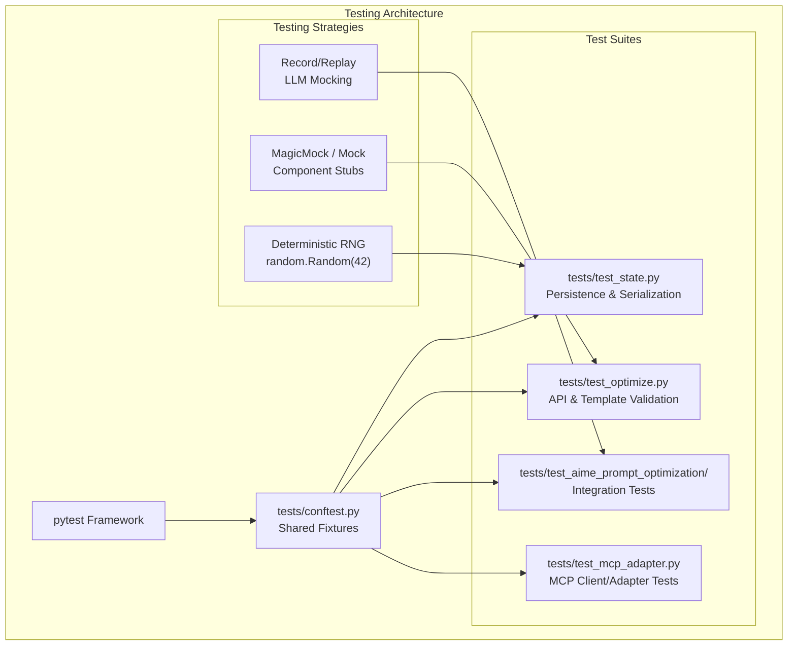
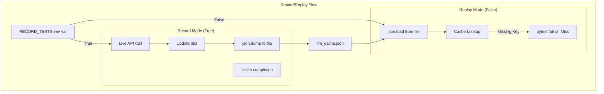
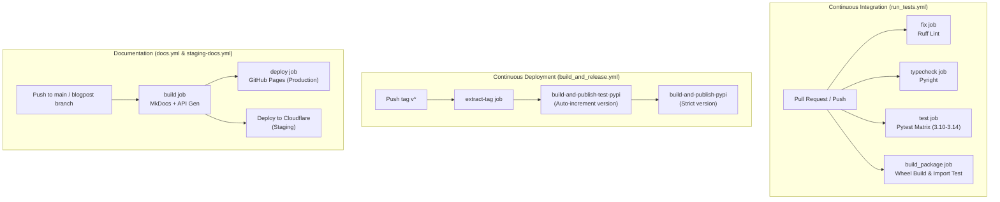
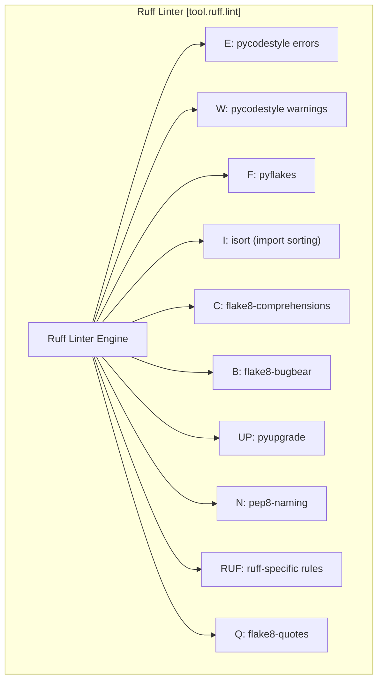

This document covers GEPA's testing infrastructure, including unit testing patterns, mock systems, and specialized testing approaches for LLM-dependent components. The testing framework ensures reliability across the optimization engine, adapter system, and various integration points.

For information about the overall development setup, see [Project Setup and Dependencies](9.1). For deployment testing, see [CI/CD Pipeline](9.3).

## Testing Framework Overview

GEPA uses **pytest** as the primary testing framework with extensive mocking capabilities to isolate components and enable deterministic testing of complex optimization workflows. The test configuration is defined in `pyproject.toml`.

**Testing Architecture**


**Sources:** [tests/conftest.py:1-101](), [tests/test_state.py:1-160](), [tests/test_optimize.py:1-208]()

## Record/Replay Testing for LLM Integration

A sophisticated record/replay system in `tests/conftest.py` enables deterministic testing of LLM-dependent components without requiring live API calls during routine testing.

### Record/Replay Implementation

The `create_mocked_lms_context` generator function implements the core record/replay logic using a JSON cache file.

**LLM Mocking Data Flow**


**Key Implementation Details:**
*   **Deterministic Keys**: `get_task_key` uses `json.dumps(messages, sort_keys=True)` to create a canonical representation of message lists [tests/conftest.py:26-30]().
*   **Lazy Imports**: `litellm` is only imported when `RECORD_TESTS` is true to minimize dependencies in standard test runs [tests/conftest.py:37-39]().
*   **Fixture Integration**: The `mocked_lms` fixture yields a tuple of `(task_lm, reflection_lm)` callables to the test function [tests/conftest.py:88-95]().

**Sources:** [tests/conftest.py:9-86](), [tests/conftest.py:88-95]()

## Integration Testing: AIME Prompt Optimization

The AIME test suite serves as the primary integration test, exercising the full `gepa.optimize` loop with real data but mocked LLM calls.

### Test Workflow
1.  **Initialization**: Loads a subset of the AIME dataset (10 train, 10 val) [tests/test_aime_prompt_optimization/test_aime_prompt_optimize.py:31-34]().
2.  **Execution**: Calls `gepa.optimize` with a `DefaultAdapter` and the `mocked_lms` fixture [tests/test_aime_prompt_optimization/test_aime_prompt_optimize.py:42-50]().
3.  **Verification**: 
    *   In **Record Mode**: Saves the resulting `best_candidate` to `optimized_prompt.txt` [tests/test_aime_prompt_optimization/test_aime_prompt_optimize.py:57-62]().
    *   In **Replay Mode**: Asserts that the current optimization result exactly matches the "golden" prompt in the text file [tests/test_aime_prompt_optimization/test_aime_prompt_optimize.py:65-69]().

**Sources:** [tests/test_aime_prompt_optimization/test_aime_prompt_optimize.py:19-70](), [tests/test_aime_prompt_optimization/optimized_prompt.txt:1-13]()

## State and Persistence Testing

Testing the `GEPAState` ensures that optimization runs can be paused and resumed without data loss or inconsistency.

### State Initialization and Serialization
*   **Fresh Init**: Verifies that initializing `GEPAState` correctly counts evaluations and writes initial outputs to the run directory [tests/test_state.py:22-52]().
*   **Pickle Equivalence**: Ensures that both standard `pickle` and `cloudpickle` produce equivalent restored states [tests/test_state.py:94-115]().
*   **Runtime Exclusion**: Validates that non-serializable objects like `_budget_hooks` are excluded from serialization but can be re-added to a loaded state [tests/test_state.py:118-158]().

### Dynamic Validation Testing
The `test_dynamic_validation` function uses a `DummyAdapter` and a custom `InitValidationPolicy` to verify that the engine can handle changes to the validation set during a run [tests/test_state.py:160-200]().

**Sources:** [tests/test_state.py:22-200]()

## API and Signature Testing

### Optimize API Validation
The `gepa.optimize` API is tested for parameter robustness:
*   **Prompt Templates**: Verifies that `reflection_prompt_template` correctly injects `<curr_param>` and `<side_info>` into the reflection LM call [tests/test_optimize.py:9-52]().
*   **Error Handling**: Ensures the engine raises `ValueError` for missing placeholders or empty `seed_candidate` dictionaries [tests/test_optimize.py:53-87](), [tests/test_optimize.py:154-208]().

### Instruction Proposal Signatures
The `InstructionProposalSignature` is unit tested to ensure it can robustly extract new instructions from LLM outputs containing various markdown artifacts:
*   **Language Specifiers**: Handles ` ```markdown ` or ` ```plaintext ` blocks [tests/test_instruction_proposal.py:16-24]().
*   **Incomplete Blocks**: Correctly parses outputs that start with backticks but lack closing markers [tests/test_instruction_proposal.py:69-74]().
*   **Nested Backticks**: Extracts the outermost block when multiple code blocks are present [tests/test_instruction_proposal.py:49-68]().

**Sources:** [tests/test_optimize.py:9-208](), [tests/test_instruction_proposal.py:9-102](), [src/gepa/strategies/instruction_proposal.py:125-153]()

## Adapter-Specific Testing

### MCP Adapter Tests
The `MCPAdapter` test suite covers transport-level logic and multi-tool coordination:
*   **Client Factory**: Tests `create_mcp_client` for `stdio`, `sse`, and `streamable_http` transports [tests/test_mcp_adapter.py:96-144]().
*   **Multi-Tool Initialization**: Verifies the adapter correctly handles single strings or lists of tool names [tests/test_mcp_adapter.py:151-178]().

### DSPY Adapter Testing
The `SingleComponentMultiModalProposer` in the DSPy adapter is tested for its ability to format multimodal reflective datasets, including the generation of pattern summaries for visual-textual integration [src/gepa/adapters/dspy_adapter/instruction_proposal.py:56-115]().

**Sources:** [tests/test_mcp_adapter.py:96-210](), [src/gepa/adapters/dspy_adapter/instruction_proposal.py:56-115]()

## Developer Commands

### Environment Setup
Developers should use `uv` for consistent test environments:
```shell
uv sync --extra dev --python 3.11
uv run pytest tests/
```

### Running Tests with Mocking
*   **Replay Mode (Default)**: `pytest tests/`
*   **Record Mode**: `RECORD_TESTS=true pytest tests/` (Requires valid API keys for `litellm`)

**Sources:** [tests/conftest.py:22-23](), [tests/test_aime_prompt_optimization/test_aime_prompt_optimize.py:57-70]()

# CI/CD Pipeline


This document describes GEPA's continuous integration and deployment infrastructure, including automated testing, building, publishing, and documentation workflows. The CI/CD system ensures code quality through linting and type checking, validates functionality across multiple Python versions, and automates package distribution to TestPyPI/PyPI and documentation deployment to GitHub Pages and Cloudflare.

## Overview

GEPA uses GitHub Actions to automate its lifecycle. The pipeline consists of four primary workflows:

1.  **Testing Workflow** ([`.github/workflows/run_tests.yml`]()) - Validates every push and pull request.
2.  **Release Workflow** ([`.github/workflows/build_and_release.yml`]()) - Publishes packages to PyPI upon version tagging.
3.  **Documentation Workflow** ([`.github/workflows/docs.yml`]()) - Builds and deploys official documentation.
4.  **Staging Docs Workflow** ([`.github/workflows/staging-docs.yml`]()) - Previews blog posts and documentation changes on a staging environment.

### CI/CD Architecture

The following diagram illustrates the flow from code contribution to package distribution and documentation deployment.



**Sources:** [`.github/workflows/run_tests.yml:1-183`](), [`.github/workflows/build_and_release.yml:1-186`](), [`.github/workflows/docs.yml:1-119`](), [`.github/workflows/staging-docs.yml:1-110`]()

## Testing Workflow (run_tests.yml)

The testing workflow runs on pushes to `main`, `release-*` branches, and all pull requests ([`.github/workflows/run_tests.yml:5-10`]()). It uses `uv` for high-performance dependency management and environment isolation ([`.github/workflows/run_tests.yml:25-30`]()).

### Parallel Jobs and Matrix Testing

| Job | Tooling | Purpose |
| :--- | :--- | :--- |
| `fix` | `ruff` | Validates code style and applies automatic fixes via `ruff check --fix-only` ([`.github/workflows/run_tests.yml:13-48`]()). |
| `typecheck` | `pyright` | Ensures type safety across the codebase using `pyright` ([`.github/workflows/run_tests.yml:50-72`]()). |
| `test` | `pytest` | Runs the test suite across a matrix of Python 3.10, 3.11, 3.12, 3.13, and 3.14 ([`.github/workflows/run_tests.yml:74-105`]()). |
| `build_package` | `build` + `uv` | Verifies the package builds correctly and `gepa[dspy]` dependencies are isolated via `tests/ensure_gepa_dspy_dependency.py` ([`.github/workflows/run_tests.yml:149-183`]()). |

### Python 3.14 Compatibility
The pipeline explicitly tests against Python 3.14 ([`.github/workflows/run_tests.yml:79`]()). To support this, `pyproject.toml` defines version-specific dependency floors for packages like `datasets`, `pandas`, and `wandb` to handle breaking changes in the Python ecosystem ([`pyproject.toml:28-40`]()).

**Sources:** [`.github/workflows/run_tests.yml:1-183`](), [`pyproject.toml:22-40`]()

## Release Workflow (build_and_release.yml)

This workflow automates the publication of GEPA to TestPyPI and PyPI when a tag starting with `v` is pushed to the `main` branch ([`.github/workflows/build_and_release.yml:7-14`]()).

### Versioning and Conflict Resolution

GEPA employs a dual-stage release strategy:

1.  **TestPyPI:** Uses a custom script `test_version.py` to check if a version exists on the repository. If it does, it automatically increments the version using a prerelease suffix (e.g., `0.1.1` -> `0.1.1a1`) to allow continuous testing of the release process ([`.github/workflows/build_and_release.yml:56-64`](), [`.github/workflows/build_utils/test_version.py:38-46`]()).
2.  **PyPI:** Enforces a strict version match with the Git tag. It uses `curl` to check the PyPI JSON API; if the version already exists, the workflow fails with an error to prevent accidental overwrites ([`.github/workflows/build_and_release.yml:131-150`]()).

### Automated Metadata Updates
The workflow uses `sed` to find the `#replace_package_version_marker` in `pyproject.toml` and update the `version` field dynamically before building the wheel ([`.github/workflows/build_and_release.yml:65-66`](), [`pyproject.toml:10-11`]()).

### Git Branching Strategy
- **Test Release:** Changes are pushed to a `release-test-<version>` branch ([`.github/workflows/build_and_release.yml:91-96`]()).
- **Production Release:** Changes are committed to a `release-<version>` branch, which is then merged back into `main` to ensure the repository version stays in sync with PyPI ([`.github/workflows/build_and_release.yml:173-186`]()).

**Sources:** [`.github/workflows/build_and_release.yml:1-186`](), [`.github/workflows/build_utils/test_version.py:1-65`]()

## Documentation Workflows

GEPA maintains high-quality documentation using MkDocs, automated API generation, and social preview generation.

### Production Docs (docs.yml)
Triggered by changes in `docs/` or `src/gepa/` (to update API docs), this workflow:
- Installs GEPA with the `[full]` extra ([`.github/workflows/docs.yml:58-59`]()).
- Runs `generate_api_docs.py` to extract docstrings from source code ([`.github/workflows/docs.yml:76-79`]()).
- Installs Playwright to generate social preview screenshots ([`.github/workflows/docs.yml:81-84`]()).
- Builds the site with `SCHOLARLY_PDF=1` which triggers the `scholarly_pdf.py` hook to generate academic-style PDFs for blog posts ([`.github/workflows/docs.yml:86-91`](), [`docs/hooks/scholarly_pdf.py:1-6`]()).
- Deploys to GitHub Pages via `actions/deploy-pages` ([`.github/workflows/docs.yml:116-119`]()).

### Staging Docs (staging-docs.yml)
Used for previewing blog posts (e.g., on `blogpost` branches), this workflow deploys to Cloudflare Pages. It includes security measures to prevent search engine indexing of staging content:
- Injects `<meta name="robots" content="noindex">` into all HTML files ([`.github/workflows/staging-docs.yml:95-96`]()).
- Configures a `_headers` file for Cloudflare to set the `X-Robots-Tag` ([`.github/workflows/staging-docs.yml:90-93`]()).

**Sources:** [`.github/workflows/docs.yml:1-119`](), [`.github/workflows/staging-docs.yml:80-97`](), [`docs/hooks/scholarly_pdf.py:1-87`]()

## Infrastructure & Tooling

### Dependency Management (uv)
All workflows utilize `astral-sh/setup-uv` with caching enabled ([`.github/workflows/run_tests.yml:25-30`]()). The [`uv.lock`]() file ensures that all CI runs use identical dependency trees across different Python versions and platforms ([`uv.lock:1-13`]()).

### Code Entity to Pipeline Mapping

The following diagram maps specific code entities and files to the CI/CD processes that consume or modify them.

```mermaid
classDiagram
    class pyproject_toml["pyproject.toml"] {
        +name: "gepa"
        +version: "0.1.1"
        +optional-dependencies: "full, test, build, dev, gskill"
    }
    class run_tests_yml[".github/workflows/run_tests.yml"] {
        +job: fix (ruff)
        +job: typecheck (pyright)
        +job: test (pytest matrix)
    }
    class build_and_release_yml[".github/workflows/build_and_release.yml"] {
        +job: build-and-publish-test-pypi
        +job: build-and-publish-pypi
    }
    class test_version_py["test_version.py"] {
        +get_latest_version()
        +increment_version()
    }
    class scholarly_pdf_py["scholarly_pdf.py"] {
        +on_post_build()
    }
    
    run_tests_yml ..> pyproject_toml : uses [dev] extra
    build_and_release_yml ..> pyproject_toml : updates version field
    build_and_release_yml --> test_version_py : invokes for TestPyPI
    docs_yml[".github/workflows/docs.yml"] --> scholarly_pdf_py : triggers hook
```

**Sources:** [`pyproject.toml:1-121`](), [`.github/workflows/run_tests.yml:1-183`](), [`.github/workflows/build_and_release.yml:1-186`](), [`.github/workflows/build_utils/test_version.py:1-65`](), [`docs/hooks/scholarly_pdf.py:39-43`]()

# Code Quality and Linting


This page documents GEPA's code quality infrastructure, including linting with Ruff, type checking with Pyright, and CI/CD enforcement. For information about the complete CI/CD pipeline including builds and releases, see [9.3 CI/CD Pipeline](). For testing infrastructure including LLM mocking, see [9.2 Testing Infrastructure]().

---

## Overview

GEPA enforces code quality through a multi-layered approach combining static analysis, type checking, and automated testing. The system uses **Ruff** as the primary linter and formatter [pyproject.toml:89-132](), **Pyright** for static type checking [pyproject.toml:50](), and a CI/CD pipeline that deliberately fails on auto-fixable issues to encourage local pre-commit hook usage [.github/workflows/run_tests.yml:39-48]().

**Key Design Philosophy**: Rather than auto-fixing issues in CI and committing them back, GEPA's CI fails if Ruff finds auto-fixable issues, prompting developers to run `pre-commit run --all-files` locally [.github/workflows/run_tests.yml:44](). This ensures developers see and understand the fixes before committing.

---

## Ruff Configuration

Ruff serves as both linter and formatter, replacing multiple tools (black, isort, flake8, pyupgrade) with a single, fast Rust-based implementation.

### Basic Settings

[pyproject.toml:89-93]() defines core Ruff parameters:

| Setting | Value | Purpose |
|---------|-------|---------|
| `include` | `["src/**/*.py"]` | Only lint source code, not tests or scripts |
| `line-length` | `120` | Maximum line length (more permissive than PEP 8's 79) |
| `indent-width` | `4` | Standard Python indentation |
| `target-version` | `"py310"` | Minimum supported Python version |

### Enabled Rule Categories

[pyproject.toml:96-107]() selects rule families:


Sources: [pyproject.toml:95-107]()

### Strategic Rule Ignores

[pyproject.toml:108-121]() disables specific rules that conflict with GEPA's coding style:

| Rule | Description | Reason for Ignoring |
|------|-------------|---------------------|
| `B027` | Allow non-abstract empty methods in ABCs | Protocol classes use empty methods as interfaces |
| `FBT003` | Allow boolean positional values | Common in config objects |
| `C901` | Ignore complexity checking | GEPA's optimization logic is inherently complex |
| `E501` | Ignore line length errors | Handled by formatter |
| `UP035` | Allow `typing` module imports | Compatibility with older Python versions |
| `RUF005` | Allow `+` for concatenating collections | More readable than alternatives |
| `B904` | Allow `raise` in `except` blocks | Used for exception wrapping |
| `F403` | Allow wildcard imports | Used in `__init__.py` for API exposure |
| `E721` | Allow `==` for type comparison | Used in adapter type checking |
| `UP031` | Allow percent-format strings | Legacy compatibility |
| `RUF022` | Allow unsorted `__all__` | Order reflects logical grouping |
| `E731` | Allow lambda assignment | Used for inline function creation |

### Per-File Overrides

[pyproject.toml:140-149]() applies special rules to specific file types:

```python