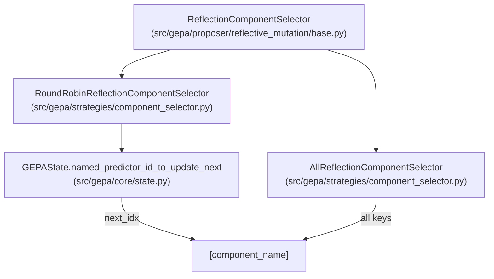
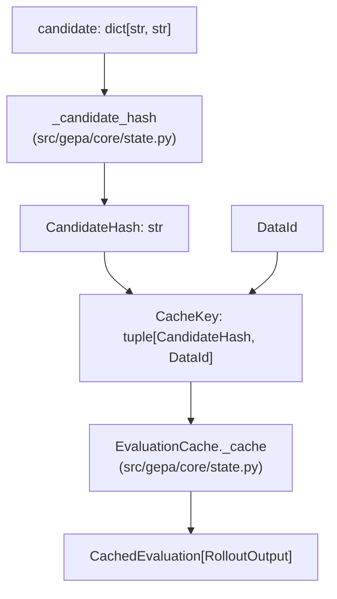

```

**Reflective Mutation**:
New candidate texts are generated for specific components, and a new dictionary is constructed for the proposal in `CandidateProposal` [src/gepa/proposer/base.py:31-43]().

This ensures:
1. **Parent preservation**: Original candidates remain unchanged for lineage tracking [src/gepa/core/result.py:42]().
2. **Cache validity**: Evaluation cache keys (based on candidate hash) remain stable [src/gepa/core/state.py:31-33]().
3. **State consistency**: No side effects from concurrent access patterns.
4. **Pareto tracking**: Historical best candidates are not corrupted by later mutations.

Sources: [src/gepa/proposer/merge.py:155](), [src/gepa/core/state.py:31-33](), [src/gepa/proposer/base.py:31-43](), [src/gepa/core/result.py:42]()

---

## Candidate Lifecycle

**Candidate Evolution Through Optimization**

```mermaid
sequenceDiagram
    participant Engine["GEPAEngine<br/>(src/gepa/core/engine.py)"]
    participant State["GEPAState<br/>(src/gepa/core/state.py)"]
    participant RefMut["ReflectiveMutationProposer<br/>(src/gepa/proposer/reflective_mutation/reflective_mutation.py)"]
    participant Merge["MergeProposer<br/>(src/gepa/proposer/merge.py)"]
    
    Engine->>State: "program_candidates[0] = seed"
    
    loop "Optimization Iterations"
        alt "Reflective Mutation"
            Engine->>RefMut: "propose(state)"
            RefMut-->>Engine: "CandidateProposal(candidate, [parent_idx])"
        else "Merge"
            Engine->>Merge: "propose(state)"
            Merge-->>Engine: "CandidateProposal(candidate, [id1, id2, ancestor])"
        end
        
        Engine->>Engine: "_run_full_eval_and_add"
        Engine->>State: "update_state_with_new_program"
    end
```

**Key lifecycle stages:**

1. **Initialization** ([src/gepa/core/state.py:195-199]()): Seed candidate becomes program index 0.
2. **Selection**: Proposers select parent candidate indices from the state using a `CandidateSelector` [src/gepa/proposer/reflective_mutation/base.py:12-13]().
3. **Mutation**: `ReflectiveMutationProposer` modifies component texts using LLM reflection.
4. **Merge** ([src/gepa/proposer/merge.py:118-177]()): `MergeProposer` combines components from two candidates via a common ancestor.
5. **Proposal**: New candidate dictionary returned in `CandidateProposal` with parent lineage [src/gepa/proposer/base.py:31-43]().
6. **Evaluation**: The engine evaluates the candidate on validation data.
7. **Addition**: `update_state_with_new_program` appends to all parallel arrays with a unique index.

Sources: [src/gepa/core/state.py:195-199](), [src/gepa/proposer/merge.py:118-177](), [src/gepa/proposer/base.py:31-43](), [src/gepa/proposer/reflective_mutation/base.py:12-13]()

---

## Component Selection and Evolution

During each iteration, GEPA may modify one or more components of the selected parent candidate. A `ReflectionComponentSelector` determines which keys to update [src/gepa/proposer/reflective_mutation/base.py:16-24]().

**Round-robin mechanism** ([src/gepa/core/state.py:169-170]()):
```python
list_of_named_predictors: list[str]
named_predictor_id_to_update_next_for_program_candidate: list[int]
```

Each candidate maintains an index into `list_of_named_predictors` indicating which component to update next. This enables systematic exploration of the component space.

**Component Selection Flow**



Sources: [src/gepa/core/state.py:169-170](), [src/gepa/proposer/reflective_mutation/base.py:16-24](), [src/gepa/strategies/candidate_selector.py:11-83]()

---

## Candidate Hashing and Caching

Candidates are hashed for caching purposes using a deterministic SHA256 hash [src/gepa/core/state.py:31-33]():

```python
def _candidate_hash(candidate: dict[str, str]) -> CandidateHash:
    """Compute a deterministic hash of a candidate dictionary."""
    return hashlib.sha256(json.dumps(sorted(candidate.items())).encode()).hexdigest()
```

**Evaluation Cache Architecture**



**Type definitions** ([src/gepa/core/state.py:27-28]()):
```python
CandidateHash: TypeAlias = str
CacheKey: TypeAlias = tuple[CandidateHash, DataId]
```

**Cache lookup in state** ([src/gepa/core/state.py:94-130]()):
```python
def evaluate_with_cache_full(
    self,
    candidate: dict[str, str],
    example_ids: list[DataId],
    fetcher: Callable[[list[DataId]], Any],
    evaluator: Callable[...],
) -> tuple[dict[DataId, RolloutOutput], dict[DataId, float], dict[DataId, ObjectiveScores] | None, int]:
    # Logic in EvaluationCache class
```

The hashing ensures:
- **Deterministic keys**: Identical candidates always produce the same hash.
- **Order-independent**: Dictionary key order doesn't affect hash due to `sorted()`.
- **Evaluation savings**: Skips expensive LLM calls when (candidate, example) pair is already evaluated.

Sources: [src/gepa/core/state.py:27-33](), [src/gepa/core/state.py:46-131]()