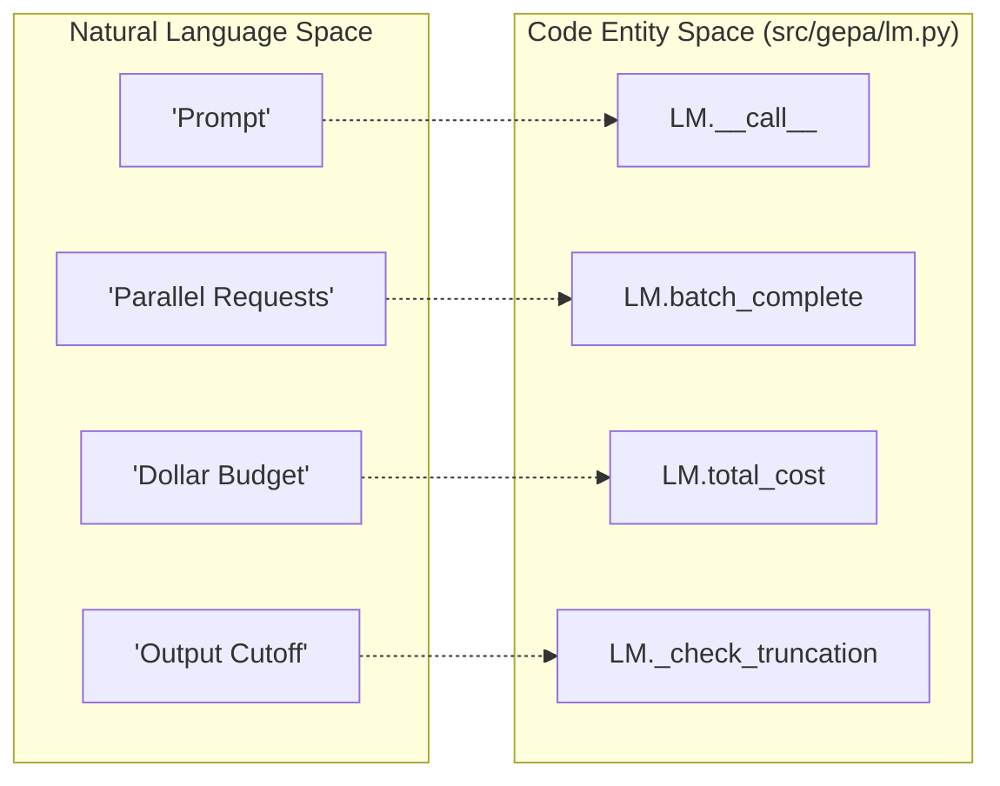

responses = self._lm.batch_complete(
    litellm_requests, max_workers=self.max_litellm_workers, **self.litellm_batch_completion_kwargs
)
```

### Proposer Usage
The `ReflectiveMutationProposer` utilizes an `LM` instance (the "Reflection LM") to generate new candidate improvements based on feedback [src/gepa/proposer/reflective_mutation/reflective_mutation.py]().

### Natural Language to Code Entity Mapping
The following diagram maps natural language optimization concepts to the specific code entities in the `LM` wrapper.


**Sources:** [src/gepa/lm.py:30-181](), [src/gepa/utils/stop_condition.py:176-191]()

---

## Summary of Key Methods

| Method | Role | Source |
|:---|:---|:---|
| `__init__` | Configures model, temperature, and retries. | [src/gepa/lm.py:52-71]() |
| `__call__` | Executes a single prompt (string or messages). | [src/gepa/lm.py:96-131]() |
| `batch_complete` | Executes multiple prompts in parallel. | [src/gepa/lm.py:133-181]() |
| `_check_truncation` | Detects and warns about length-limited outputs. | [src/gepa/lm.py:88-94]() |
| `total_cost` | Property returning cumulative USD expenditure. | [src/gepa/lm.py:73-76]() |

**Sources:** [src/gepa/lm.py:1-181]()