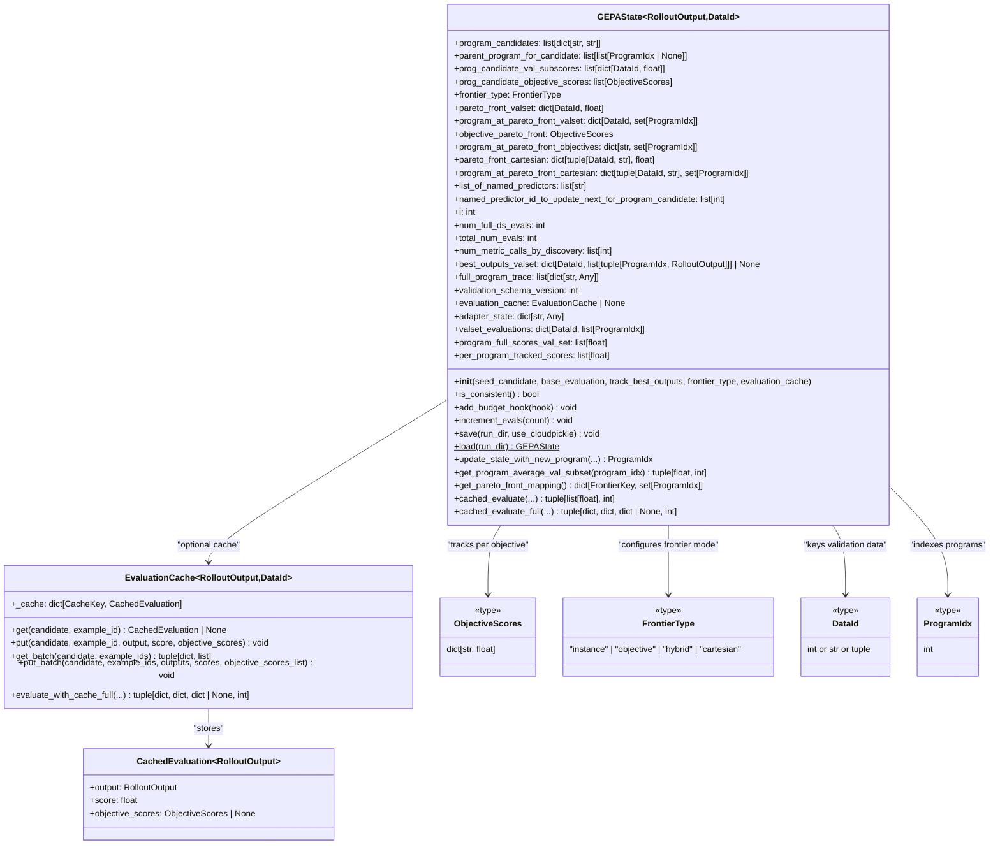
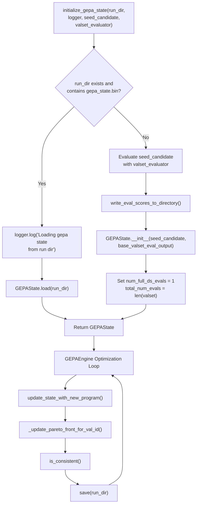
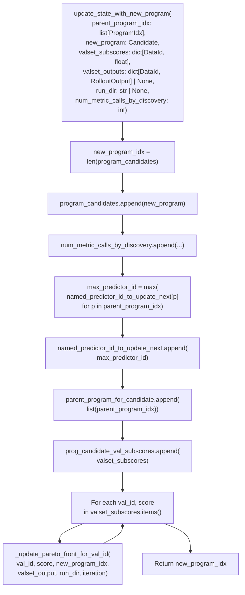
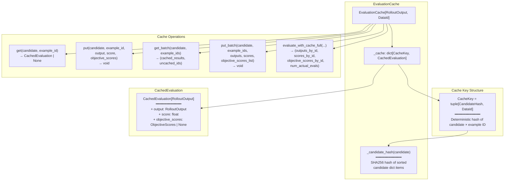
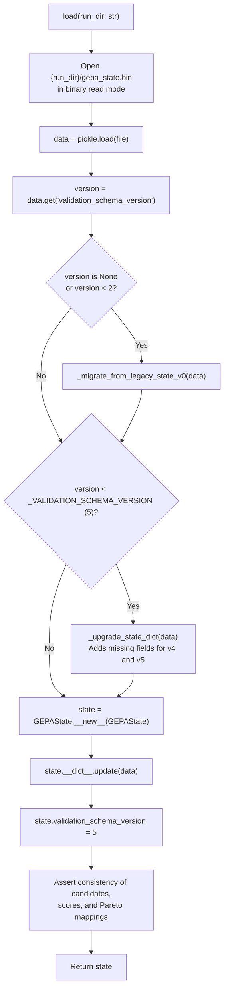

def cached_evaluate_full(self, program, example_ids, fetcher, evaluator):
    # Check cache for existing results
    # Evaluate only uncached IDs
    # Update cache with new results
    ...
```

**Cache key**: Generated from the candidate components and the specific data instance ID [src/gepa/core/state.py:46-131]().

**Sources**: [src/gepa/core/state.py:46-131](), [src/gepa/api.py:89](), [tests/test_evaluation_cache.py:19-71]()

---

## Stopping Conditions

The `_should_stop()` method ([src/gepa/core/engine.py:592-598]()) checks:

1. **Manual stop request**: `self._stop_requested` flag.
2. **Stop callback**: Invokes `self.stop_callback(state)` which may check:
   - `MaxMetricCallsStopper`: Budget exhausted [src/gepa/utils/stop_condition.py:16-16]().
   - `FileStopper`: Stop file present [src/gepa/utils/stop_condition.py:15-15]().
   - `TimeoutStopCondition`: Time limit exceeded [src/gepa/utils/stop_condition.py:21-21]().
   - `ScoreThresholdStopper`: Target score reached [src/gepa/utils/stop_condition.py:18-18]().

**Sources**: [src/gepa/core/engine.py:592-598](), [src/gepa/utils/stop_condition.py:13-21]()

---

## Summary

The `GEPAEngine` orchestrates GEPA's optimization loop by:

1. **Initializing or resuming** from saved state.
2. **Scheduling proposals**: Parallel reflective mutation and conditional merge attempts.
3. **Evaluating candidates**: Via adapter with optional caching to minimize costs.
4. **Applying acceptance criteria**: Using pluggable strategies like `StrictImprovementAcceptance`.
5. **Updating state**: Maintaining Pareto frontiers across validation sets.
6. **Checking stopping conditions**: Budget, time, or score-based limits.

**Sources**: [src/gepa/core/engine.py:46-624](), [src/gepa/api.py:41-408]()

# State Management and Persistence


The GEPA state management system tracks the evolution of program candidates throughout the optimization process using sparse validation coverage, multi-objective Pareto frontiers, evaluation caching, and efficient persistence mechanisms. The `GEPAState` class maintains program lineage, sparse validation scores, configurable Pareto fronts, and optimization metadata, enabling seamless resumption of long-running optimization jobs.

This page details the internal state representation, the four frontier types for multi-objective optimization, the evaluation cache system, sparse evaluation tracking, budget hooks, schema versioning, and persistence mechanisms.

**Sources:** [src/gepa/core/state.py:142-241]()

## Core State Structure

The `GEPAState` class serves as the central repository for all optimization state, tracking program evolution from the initial seed candidate through all generated variations. A key design feature is **sparse validation coverage**: not every program evaluates every validation example, enabling efficient incremental evaluation strategies.

### GEPAState Data Model

**GEPAState Class Structure**


**Sources:** [src/gepa/core/state.py:142-178](), [src/gepa/core/state.py:17-21](), [src/gepa/core/state.py:36-93]()

### State Components Overview

| Component | Type | Purpose |
|-----------|------|---------|
| `program_candidates` | `list[dict[str, str]]` | All program variants (e.g., `Candidate` [src/gepa/core/adapter.py:12]()) |
| `parent_program_for_candidate` | `list[list[ProgramIdx \| None]]` | Lineage for each program (supports multiple parents for merges [src/gepa/proposer/merge.py:124]()) |
| `prog_candidate_val_subscores` | `list[dict[DataId, float]]` | **Sparse** per-instance validation scores |
| `prog_candidate_objective_scores` | `list[ObjectiveScores]` | Per-program aggregate scores for each objective metric |
| `frontier_type` | `FrontierType` | Frontier tracking mode: `"instance"`, `"objective"`, `"hybrid"`, or `"cartesian"` |
| `pareto_front_valset` | `dict[DataId, float]` | Best score achieved for each validation ID (instance frontier) |
| `program_at_pareto_front_valset` | `dict[DataId, set[ProgramIdx]]` | Programs achieving Pareto front for each validation ID |
| `objective_pareto_front` | `ObjectiveScores` | Best aggregate score achieved for each objective (objective frontier) |
| `program_at_pareto_front_objectives` | `dict[str, set[ProgramIdx]]` | Programs achieving best score for each objective |
| `pareto_front_cartesian` | `dict[tuple[DataId, str], float]` | Best score for each (val_id, objective) pair |
| `list_of_named_predictors` | `list[str]` | Component names from seed candidate |
| `named_predictor_id_to_update_next_for_program_candidate` | `list[int]` | Next component index to update for each program (round-robin) |
| `num_metric_calls_by_discovery` | `list[int]` | Metric calls consumed when each program was discovered |
| `best_outputs_valset` | `dict[DataId, list[tuple[ProgramIdx, RolloutOutput]]] \| None` | Best program outputs per validation ID |
| `evaluation_cache` | `EvaluationCache \| None` | Optional cache for (candidate, example) evaluations |
| `adapter_state` | `dict[str, Any]` | Snapshot of internal adapter state for persistence |
| `validation_schema_version` | `int` | Schema version for migration support (currently v5 [src/gepa/core/state.py:153]()) |

**Sources:** [src/gepa/core/state.py:149-178](), [src/gepa/core/state.py:145](), [src/gepa/core/state.py:153]()

## State Lifecycle

The state management system follows a defined lifecycle from initialization through iterative updates to final result generation, with checkpoint/resume support via binary serialization.

### State Initialization and Updates

**State Initialization Flow with Resume Support**


**Sources:** [src/gepa/core/state.py:248-276](), [src/gepa/core/state.py:213-238]()

### Adapter State Syncing

Custom adapters can persist internal state (e.g., usage stats, indices) by implementing the `GEPAAdapter` protocol methods. The engine snapshots this state into the `GEPAState` during the save process.

*   `get_adapter_state()`: Called by the engine to capture a snapshot [src/gepa/core/adapter.py:92-95]().
*   `set_adapter_state(state)`: Called by the engine during resume to restore internal state [src/gepa/core/adapter.py:96-97]().

**Sources:** [src/gepa/core/adapter.py:88-100](), [tests/test_state.py:118-159]()

## Program Candidate Management

Program candidates are stored as dictionaries mapping component names to text content. The `update_state_with_new_program()` method maintains consistency across candidates, lineage, scores, and Pareto fronts.

### Program Addition and Lineage Tracking

**update_state_with_new_program() Method Flow**


**Sources:** [src/gepa/core/state.py:213-238]()

## Pareto Frontier Types

GEPA supports four configurable frontier tracking modes via the `frontier_type` parameter, enabling different multi-objective optimization strategies.

### Frontier Type Overview

**Four Frontier Tracking Modes**

```mermaid
graph TB
    subgraph "frontier_type Parameter"
        FT["frontier_type: FrontierType<br/>Configurable at initialization"]
    end
    
    subgraph "Instance Mode"
        IM["'instance'<br/>━━━━━━━━━━"]
        IM_PF["pareto_front_valset:<br/>dict[DataId, float]"]
        IM_PAF["program_at_pareto_front_valset:<br/>dict[DataId, set[ProgramIdx]]"]
        IM_DESC["Tracks best program<br/>for each validation instance"]
    end
    
    subgraph "Objective Mode"
        OM["'objective'<br/>━━━━━━━━━━"]
        OM_PF["objective_pareto_front:<br/>dict[str, float]"]
        OM_PAF["program_at_pareto_front_objectives:<br/>dict[str, set[ProgramIdx]]"]
        OM_DESC["Tracks best program<br/>for each objective metric"]
    end
    
    subgraph "Hybrid Mode"
        HM["'hybrid'<br/>━━━━━━━━━━"]
        HM_BOTH["Maintains both:<br/>- Instance frontiers<br/>- Objective frontiers"]
        HM_DESC["Tracks both instance and<br/>objective frontiers"]
    end
    
    subgraph "Cartesian Mode"
        CM["'cartesian'<br/>━━━━━━━━━━"]
        CM_PF["pareto_front_cartesian:<br/>dict[tuple[DataId, str], float]"]
        CM_PAF["program_at_pareto_front_cartesian:<br/>dict[tuple[DataId, str], set[ProgramIdx]]"]
        CM_DESC["Tracks best program<br/>for each (val_id, objective) pair"]
    end
    
    FT --> IM
    FT --> OM
    FT --> HM
    FT --> CM
    
    IM --> IM_PF
    IM --> IM_PAF
    IM --> IM_DESC
    
    OM --> OM_PF
    OM --> OM_PAF
    OM --> OM_DESC
    
    HM --> HM_BOTH
    HM --> HM_DESC
    
    CM --> CM_PF
    CM --> CM_PAF
    CM --> CM_DESC
```


**Sources:** [src/gepa/core/state.py:22-25](), [src/gepa/core/state.py:195-224]()

## Evaluation Cache System

The `EvaluationCache` class provides memoization for expensive (candidate, example) evaluations, significantly reducing LLM API costs by avoiding redundant executions of the same candidate on the same data.

### EvaluationCache Architecture

**EvaluationCache Class Structure and Caching Flow**


**Sources:** [src/gepa/core/state.py:31-93](), [src/gepa/core/state.py:27-28]()

## State Persistence and Schema Versioning

The state system provides binary serialization for checkpoint/resume functionality with schema versioning support for backward compatibility.

### Save/Load Operations

| Operation | Method | File Location | Format |
|-----------|--------|---------------|--------|
| Save State | `save(run_dir, use_cloudpickle=False)` | `{run_dir}/gepa_state.bin` | Binary pickle |
| Load State | `load(run_dir)` | `{run_dir}/gepa_state.bin` | Binary pickle with migration |
| Budget Hook | `add_budget_hook(hook)` | N/A (Runtime only) | Callback |

**Sources:** [src/gepa/core/state.py:95-106](), [src/gepa/core/state.py:108-127](), [tests/test_state.py:118-159]()

### Schema Versioning and Migration

GEPA uses schema versioning to ensure backward compatibility. The current version is v5 [src/gepa/core/state.py:153]().

**Schema Migration: Legacy → v5**

| Version | Key Changes | Migration Logic |
|---------|-------------|-----------------|
| v0/v1 | Dense list-based scores | Convert lists to sparse dicts [src/gepa/core/state.py:328-368]() |
| v4 | Multi-objective support | Initialize `prog_candidate_objective_scores` and Pareto structures [src/gepa/core/state.py:328-368]() |
| v5 | Adapter state persistence | Initialize `adapter_state` as an empty dictionary [src/gepa/core/state.py:368]() |

**Sources:** [src/gepa/core/state.py:153](), [src/gepa/core/state.py:328-368]()

**load() Method with Migration**


**Sources:** [src/gepa/core/state.py:299-326](), [src/gepa/core/state.py:328-368]()

# Results and Lineage Tracking


GEPA provides `GEPAResult` as an immutable snapshot of optimization runs, designed for safe analysis, serialization, and distribution. The result object captures all candidate programs discovered, their performance metrics, lineage relationships, and metadata about the optimization process. This immutable design enables concurrent analysis while the engine continues optimization, and provides a stable interface for downstream systems.

For related information, see page 4.2 for `GEPAState` runtime management and page 3.4 for candidate structure.

## GEPAResult Structure

`GEPAResult` is a frozen dataclass providing an immutable view of optimization outcomes. The class is defined at [src/gepa/core/result.py:16-62]() and contains the following fields:

| Field | Type | Description |
|-------|------|-------------|
| `candidates` | `list[dict[str, str]]` | All discovered program candidates (component_name → text) |
| `parents` | `list[list[ProgramIdx \| None]]` | Lineage information; `parents[i]` lists parent indices for candidate `i` |
| `val_aggregate_scores` | `list[float]` | Per-candidate aggregate scores on validation set |
| `val_subscores` | `list[dict[DataId, float]]` | Per-candidate sparse score mappings (validation_id → score) |
| `per_val_instance_best_candidates` | `dict[DataId, set[ProgramIdx]]` | Per-instance Pareto fronts (validation_id → set of candidate indices) |
| `discovery_eval_counts` | `list[int]` | Cumulative metric calls at discovery time for each candidate |
| `best_outputs_valset` | `dict[DataId, list[tuple[...]]] \| None` | Optional best outputs per validation instance |
| `total_metric_calls` | `int \| None` | Total metric evaluations across the run |
| `num_full_val_evals` | `int \| None` | Count of full validation evaluations performed |
| `run_dir` | `str \| None` | Directory containing optimization artifacts |
| `seed` | `int \| None` | Random seed for reproducibility |

The `frozen=True` dataclass decorator at [src/gepa/core/result.py:15-15]() ensures immutability after construction.

**Diagram: GEPAResult Data Structure**

```mermaid
graph TB
    "Result"["GEPAResult<br/>(frozen dataclass)"]
    
    subgraph "CoreData"["Core Data Fields"]
        "Candidates"["candidates:<br/>list[dict[str, str]]"]
        "Parents"["parents:<br/>list[list[ProgramIdx | None]]"]
        "ValAggScores"["val_aggregate_scores:<br/>list[float]"]
        "ValSubScores"["val_subscores:<br/>list[dict[DataId, float]]"]
        "PerValBest"["per_val_instance_best_candidates:<br/>dict[DataId, set[ProgramIdx]]"]
        "DiscoveryCount"["discovery_eval_counts:<br/>list[int]"]
    end
    
    subgraph "OptionalData"["Optional Fields"]
        "BestOutputs"["best_outputs_valset:<br/>dict[DataId, list[tuple[ProgramIdx, RolloutOutput]]]"]
        "TotalMetric"["total_metric_calls: int"]
        "NumFullEval"["num_full_val_evals: int"]
        "RunDir"["run_dir: str"]
        "Seed"["seed: int"]
    end
    
    subgraph "Properties"["Convenience Properties"]
        "NumCand"["num_candidates: int"]
        "NumVal"["num_val_instances: int"]
        "BestIdx"["best_idx: int"]
        "BestCand"["best_candidate: dict[str, str]"]
    end
    
    "Result" --> "CoreData"
    "Result" --> "OptionalData"
    "Result" --> "Properties"
```

Sources: [src/gepa/core/result.py:15-91]()

## Lineage Tracking System

GEPA tracks evolutionary relationships through the `parent_program_for_candidate` field in `GEPAState`, which becomes the `parents` field in `GEPAResult`. Each candidate maintains a list of parent indices, enabling multi-parent lineage tracking for merge operations.

### Parent Tracking in GEPAState

The `GEPAState.parent_program_for_candidate` field is a `list[list[ProgramIdx | None]]` where:
- `parent_program_for_candidate[i]` contains the list of parent indices for candidate `i`.
- Base seed candidate has `parent_program_for_candidate[0] = [None]`.
- Reflective mutations have single-parent lineage: `[[parent_idx]]`.
- Merge operations have multi-parent lineage: `[[parent_idx_1, parent_idx_2]]`.

When new candidates are added via `update_state_with_new_program()`, the parent list is appended:

```python
self.parent_program_for_candidate.append(list(parent_program_idx))
```

**Diagram: Lineage Tracking Through parent_program_for_candidate**

```mermaid
graph TB
    subgraph "GEPAState_Runtime"["GEPAState Runtime"]
        "PC"["program_candidates:<br/>list[dict[str, str]]"]
        "PPFC"["parent_program_for_candidate:<br/>list[list[ProgramIdx | None]]"]
    end
    
    subgraph "Example"["Example Lineage Graph"]
        "C0"["Candidate 0 (Seed)<br/>parents = [None]"]
        "C1"["Candidate 1 (Mutation)<br/>parents = [0]"]
        "C2"["Candidate 2 (Mutation)<br/>parents = [0]"]
        "C3"["Candidate 3 (Mutation)<br/>parents = [1]"]
        "C4"["Candidate 4 (Merge)<br/>parents = [1, 2]"]
        "C5"["Candidate 5 (Mutation)<br/>parents = [4]"]
        
        "C0" --> "C1"
        "C0" --> "C2"
        "C1" --> "C3"
        "C1" --> "C4"
        "C2" --> "C4"
        "C4" --> "C5"
    end
    
    subgraph "UpdateLogic"["update_state_with_new_program()"]
        "Input"["parent_program_idx: list[ProgramIdx]"]
        "Append"["self.parent_program_for_candidate.append(list(parent_program_idx))"]
    end
    
    "PPFC" --> "Example"
    "Input" --> "Append"
    "Append" --> "PPFC"
```

Sources: [src/gepa/core/result.py:42-42](), [src/gepa/core/result.py:126-126]()

### Lineage in GEPAResult

When `GEPAResult` is extracted from `GEPAState`, the lineage information is copied into the immutable `parents` field at [src/gepa/core/result.py:126-126](). This creates a shallow copy of the list structure, ensuring the result remains independent of subsequent state mutations.

Sources: [src/gepa/core/result.py:42-42](), [src/gepa/core/result.py:126-126]()

## Result Extraction and Transformation

`GEPAResult` is typically created as a snapshot of the engine's state. It provides methods to handle multi-objective results and Pareto frontiers.

| GEPAState/Engine Data | GEPAResult Field | Transformation |
|-----------------|------------------|----------------|
| `program_candidates` | `candidates` | `list(state.program_candidates)` |
| `parent_program_for_candidate` | `parents` | `list(state.parent_program_for_candidate)` |
| `prog_candidate_val_subscores` | `val_subscores` | `[dict(scores) for scores in state.prog_candidate_val_subscores]` |
| `program_full_scores_val_set` | `val_aggregate_scores` | `list(state.program_full_scores_val_set)` |
| `program_at_pareto_front_valset` | `per_val_instance_best_candidates` | `{val_id: set(front) for val_id, front in state.program_at_pareto_front_valset.items()}` |

Sources: [src/gepa/core/result.py:41-58]()

## Serialization and Deserialization

`GEPAResult` supports JSON serialization for persistent storage and analysis. The serialization system handles complex nested structures including dictionaries and sets.

### Serialization via to_dict()

The `to_dict()` method at [src/gepa/core/result.py:121-149]() converts the result to a JSON-serializable dictionary. Key transformations for JSON compatibility include converting `set[ProgramIdx]` to `list` for Pareto fronts [src/gepa/core/result.py:131-131]() and embedding the `_VALIDATION_SCHEMA_VERSION` [src/gepa/core/result.py:147-147]().

### Deserialization via from_dict()

The static method `from_dict()` at [src/gepa/core/result.py:151-162]() reconstructs `GEPAResult` from a dictionary with schema migration support:

**Diagram: from_dict() Schema Handling**

```mermaid
flowchart TD
    "Start"["from_dict(d: dict[str, Any])"]
    "GetVersion"["version = d.get('validation_schema_version') or 0"]
    
    "CheckVersion"{"version > 2?"}
    "RaiseError"["raise ValueError('Unsupported version')"]
    
    "CheckLegacy"{"version <= 1?"}
    "MigrateLegacy"["_migrate_from_dict_v0(d)"]
    "LoadV2"["_from_dict_v2(d)"]
    
    "Return"["Return GEPAResult"]
    
    "Start" --> "GetVersion"
    "GetVersion" --> "CheckVersion"
    "CheckVersion" -->|Yes| "RaiseError"
    "CheckVersion" -->|No| "CheckLegacy"
    "CheckLegacy" -->|Yes| "MigrateLegacy"
    "CheckLegacy" -->|No| "LoadV2"
    "MigrateLegacy" --> "Return"
    "LoadV2" --> "Return"
```

The method delegates to version-specific loaders:
- **Version 0-1**: `_migrate_from_dict_v0()` at [src/gepa/core/result.py:207-224]() handles legacy list-based sparse scores and converts them to the modern `dict[DataId, float]` format.
- **Version 2**: `_from_dict_v2()` at [src/gepa/core/result.py:226-245]() handles current dictionary-based formats.

Sources: [src/gepa/core/result.py:121-162](), [src/gepa/core/result.py:207-245]()

## Result Analysis and Visualization

`GEPAResult` provides built-in methods for visualizing the optimization trajectory and lineage tree.

### Visualization Methods

The result object includes two primary visualization methods:

1.  **`candidate_tree_dot()`**: Generates a Graphviz DOT string of the candidate lineage tree [src/gepa/core/result.py:99-108]().
2.  **`candidate_tree_html()`**: Generates a self-contained interactive HTML page rendering the candidate tree [src/gepa/core/result.py:110-119]().

These methods utilize `val_aggregate_scores` to color-code nodes (e.g., cyan for best) and `per_val_instance_best_candidates` to identify Pareto-optimal programs [src/gepa/visualization.py:87-92]().

### Candidate Proposals and Evaluations

During optimization, the engine uses `CandidateProposal` and `SubsampleEvaluation` to track the quality of new candidates.

- **`SubsampleEvaluation`**: Captures scores, outputs, multi-objective scores, and trajectories from a minibatch evaluation [src/gepa/proposer/base.py:12-28]().
- **`CandidateProposal`**: Wraps a new candidate dictionary with its parent IDs and evaluation results (`eval_before` vs `eval_after`) [src/gepa/proposer/base.py:31-44]().

**Diagram: Candidate Evaluation Flow**

```mermaid
graph LR
    subgraph "Proposer"["ProposeNewCandidate.propose()"]
        "Mutate"["Generate dict[str, str]"]
        "Eval"["adapter.evaluate()"]
    end
    
    subgraph "Proposal"["CandidateProposal"]
        "Cand"["candidate: dict[str, str]"]
        "Parents"["parent_program_ids: list[int]"]
        "SubEval"["eval_after: SubsampleEvaluation"]
    end
    
    subgraph "SubEvalData"["SubsampleEvaluation"]
        "Scores"["scores: list[float]"]
        "Traj"["trajectories: list[Any]"]
    end
    
    "Proposer" --> "Proposal"
    "Proposal" --> "SubEvalData"
```

Sources: [src/gepa/core/result.py:99-119](), [src/gepa/proposer/base.py:12-44](), [src/gepa/visualization.py:34-102]()