# gepa-ai/gepa — DeepWiki Notes

Source: https://deepwiki.com/gepa-ai/gepa


# gepa Documentation Index

This file contains links to all extracted documents.
Please refer to the files below for detailed information.

- [Introduction](gepa/Introduction.md)
- [Overview](gepa/Overview.md)
- [Quick Start](gepa/Quick_Start.md)
- [1. Prepare data Inputs and Expected Answers](gepa/1._Prepare_data_Inputs_and_Expected_Answers.md)
- [2. Define initial prompt](gepa/2._Define_initial_prompt.md)
- [3. Run Optimization](gepa/3._Run_Optimization.md)
- [Core Concepts](gepa/Core_Concepts.md)
- [Example candidate with two components](gepa/Example_candidate_with_two_components.md)
- [Single-task mode no dataset](gepa/Single-task_mode_no_dataset.md)
- [Multi-task or generalization mode dataset provided](gepa/Multi-task_or_generalization_mode_dataset_provided.md)
- [Adapters and System Integration](gepa/Adapters_and_System_Integration.md)
- [Candidates and Text Components](gepa/Candidates_and_Text_Components.md)
- [Then selectively overwrite components from descendants](gepa/Then_selectively_overwrite_components_from_descendants.md)
- [Stopping Conditions](gepa/Stopping_Conditions.md)
- [Pass to optimize anything or gepa.optimize](gepa/Pass_to_optimize_anything_or_gepa.optimize.md)
- [Configuration System](gepa/Configuration_System.md)
- [GEPAEngine and Optimization Loop](gepa/GEPAEngine_and_Optimization_Loop.md)
- [srcgepacoreengine.py382-404](gepa/srcgepacoreengine.py382-404.md)
- [srcgepacoreengine.py490-538](gepa/srcgepacoreengine.py490-538.md)
- [srcgepacorestate.py94-130](gepa/srcgepacorestate.py94-130.md)
- [Proposer System](gepa/Proposer_System.md)
- [Reflective Mutation Proposer](gepa/Reflective_Mutation_Proposer.md)
- [Evaluation Policies](gepa/Evaluation_Policies.md)
- [Evaluation Caching](gepa/Evaluation_Caching.md)
- [Adapter System](gepa/Adapter_System.md)
- [OptimizeAnythingAdapter](gepa/OptimizeAnythingAdapter.md)
- [DSPy Integration](gepa/DSPy_Integration.md)
- [DSPy Full Program Evolution](gepa/DSPy_Full_Program_Evolution.md)
- [1. Define the seed code](gepa/1._Define_the_seed_code.md)
- [2. Initialize the adapter](gepa/2._Initialize_the_adapter.md)
- [3. Run optimization](gepa/3._Run_optimization.md)
- [Generic RAG Adapter](gepa/Generic_RAG_Adapter.md)
- [Prioritizes ids based on state.valset evaluations count](gepa/Prioritizes_ids_based_on_state.valset_evaluations_count.md)
- [Confidence Adapter](gepa/Confidence_Adapter.md)
- [Language Models and Signatures](gepa/Language_Models_and_Signatures.md)
- [srcgepaadaptersdefault adapterdefault adapter.py132-134](gepa/srcgepaadaptersdefault_adapterdefault_adapter.py132-134.md)
- [Signature System](gepa/Signature_System.md)
- [Production Use Cases](gepa/Production_Use_Cases.md)
- [Advanced Topics](gepa/Advanced_Topics.md)
- [Experiment Tracking and Logging](gepa/Experiment_Tracking_and_Logging.md)
- [From  update shuffled method in srcgepastrategiesbatch sampler.py](gepa/From__update_shuffled_method_in_srcgepastrategiesbatch_sampler.py.md)
- [Dynamic Validation Sets](gepa/Dynamic_Validation_Sets.md)
- [Custom evaluator returning objective scores](gepa/Custom_evaluator_returning_objective_scores.md)
- [Optimization call with objective frontier](gepa/Optimization_call_with_objective_frontier.md)
- [Acceptance Criteria](gepa/Acceptance_Criteria.md)
- [Cost Tracking](gepa/Cost_Tracking.md)
- [Project Setup and Dependencies](gepa/Project_Setup_and_Dependencies.md)
- [Create venv and sync dependencies from lockfile](gepa/Create_venv_and_sync_dependencies_from_lockfile.md)
- [Testing Infrastructure](gepa/Testing_Infrastructure.md)
- [Tests can use assert statements and relative imports](gepa/Tests_can_use_assert_statements_and_relative_imports.md)
- [  init  .py files can have unused imports re-exports](gepa/__init__.py_files_can_have_unused_imports_re-exports.md)
- [gskill suppresses logging before imports](gepa/gskill_suppresses_logging_before_imports.md)
- [Jupyter-notebook-style scripts import mid-file](gepa/Jupyter-notebook-style_scripts_import_mid-file.md)
- [API Reference](gepa/API_Reference.md)
- [Glossary](gepa/Glossary.md)

seed_program = """import dspy
program = dspy.ChainOfThought("question -> answer")"""
trainset, valset, _ = gepa.examples.aime.init_dataset()
seed_prompt = {
    "system_prompt": "You are a helpful assistant. Answer the question. "
                     "Put your final answer in the format '### <answer>'"
}
adapter = DspyAdapter(
    task_lm=dspy.LM(model="openai/gpt-4.1-nano"),
    metric_fn=my_metric,
    reflection_lm=lambda x: reflection_lm(x)[0], # Reflection LM must return a string
    num_threads=80
)
result = optimize(
    seed_candidate={"program": seed_program},
    trainset=train_data,
    valset=val_data,
    adapter=adapter,
    max_metric_calls=2000,
)
```
Sources: [src/gepa/adapters/dspy_full_program_adapter/README.md:10-35](), [tests/test_dspy_full_program_adapter.py:120-130]()

## Implementation Safety and Robustness

- **Syntax Errors**: The adapter catches `SyntaxError` during the `compile` phase and returns a `failure_score` (default 0.0) with the traceback as feedback [src/gepa/adapters/dspy_full_program_adapter/full_program_adapter.py:47-55]().
- **Runtime Errors**: Errors during `exec` or program instantiation are caught and reported back to the proposer [src/gepa/adapters/dspy_full_program_adapter/full_program_adapter.py:57-63]().
- **Output Integrity**: Even on build failure, `evaluate()` ensures that `outputs` is a list of the correct length (filled with `None`) to prevent downstream crashes in the optimization engine [tests/test_dspy_full_program_adapter.py:59-71]().

Sources: [src/gepa/adapters/dspy_full_program_adapter/full_program_adapter.py:42-81](), [tests/test_dspy_full_program_adapter.py:55-110]()

# MCP Adapter


## Purpose and Scope

The `MCPAdapter` enables GEPA to optimize Model Context Protocol (MCP) server configurations, specifically tool descriptions and system prompts for tool-using agents. This adapter connects GEPA's optimization loop to MCP servers running locally (via stdio) or remotely (via SSE/StreamableHTTP), allowing automatic improvement of how agents interact with tools.

The adapter handles the complexities of bridging GEPA's synchronous optimization loop with the asynchronous nature of the MCP SDK by utilizing `asyncio.run()` for each evaluation batch [src/gepa/adapters/mcp_adapter/mcp_adapter.py:189-206]().

**Sources:** [src/gepa/adapters/mcp_adapter/mcp_adapter.py:4-10](), [src/gepa/adapters/mcp_adapter/README.md:1-12]()

---

## What is MCP?

The Model Context Protocol (MCP) is a standardized protocol for connecting AI assistants to external tools and data sources. MCP servers expose tools (functions) that agents can invoke, with each tool having:

- **Name**: Unique identifier for the tool.
- **Description**: Natural language explanation of what the tool does.
- **Parameters**: JSON Schema defining arguments the tool accepts.

`MCPAdapter` optimizes these descriptions and the overall system instructions to improve an agent's tool selection accuracy and parameter generation.

**Sources:** [src/gepa/adapters/mcp_adapter/README.md:7-12](), [src/gepa/examples/mcp_adapter/mcp_optimization_example.py:5-12]()

---

## Adapter Architecture

The `MCPAdapter` manages the lifecycle of MCP client connections, executes a two-pass LLM workflow, and computes metrics.

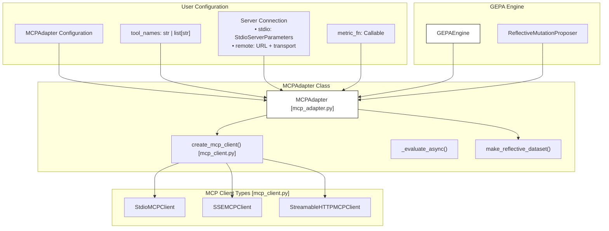
```mermaid
graph TB
    subgraph "User Configuration"
        CONFIG["MCPAdapter Configuration"]
        TOOLS["tool_names: str | list[str]"]
        SERVER["Server Connection<br/>• stdio: StdioServerParameters<br/>• remote: URL + transport"]
        METRIC["metric_fn: Callable"]
    end
    
    subgraph "MCPAdapter Class"
        ADAPTER["MCPAdapter [mcp_adapter.py]"]
        CONN["create_mcp_client() [mcp_client.py]"]
        EXEC["_evaluate_async()"]
        REFLECT["make_reflective_dataset()"]
    end
    
    subgraph "MCP Client Types [mcp_client.py]"
        STDIO["StdioMCPClient"]
        SSE["SSEMCPClient"]
        HTTP["StreamableHTTPMCPClient"]
    end
    
    subgraph "GEPA Engine"
        ENGINE["GEPAEngine"]
        PROPOSER["ReflectiveMutationProposer"]
    end
    
    CONFIG --> ADAPTER
    TOOLS --> ADAPTER
    SERVER --> ADAPTER
    METRIC --> ADAPTER
    
    ADAPTER --> CONN
    CONN --> STDIO
    CONN --> SSE
    CONN --> HTTP
    
    ENGINE --> ADAPTER
    PROPOSER --> ADAPTER
    ADAPTER --> REFLECT
    
    style ADAPTER fill:#ffffff,stroke:#000000
    style ENGINE fill:#ffffff,stroke:#000000
```

**Diagram: MCPAdapter Architecture**

**Sources:** [src/gepa/adapters/mcp_adapter/mcp_adapter.py:94-147](), [src/gepa/adapters/mcp_adapter/mcp_client.py:1-13]()

---

## Component Mapping: Code Entity Space

The following diagram maps the natural language components optimized by GEPA to the internal code structures of the `MCPAdapter`.

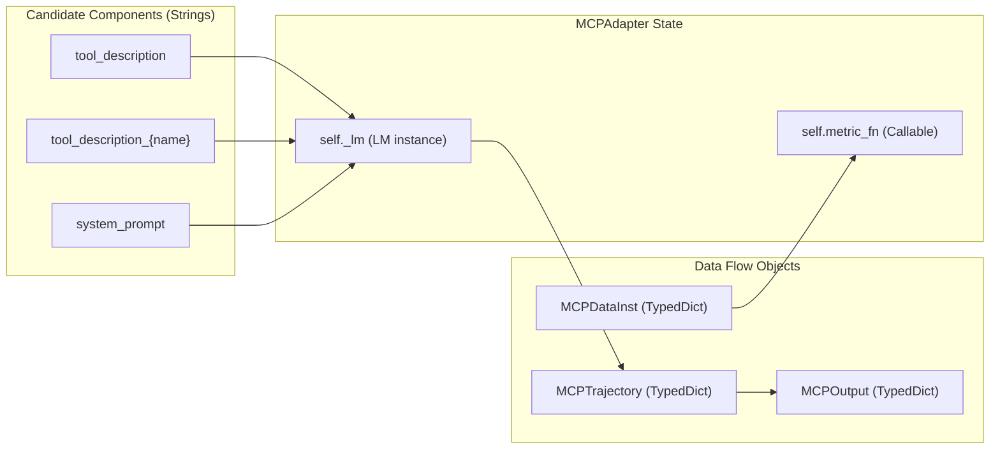
```mermaid
graph LR
    subgraph "Candidate Components (Strings)"
        TD["tool_description"]
        TD_MULTI["tool_description_{name}"]
        SP["system_prompt"]
    end
    
    subgraph "MCPAdapter State"
        LM_ATTR["self._lm (LM instance)"]
        METRIC_ATTR["self.metric_fn (Callable)"]
    end
    
    subgraph "Data Flow Objects"
        DATA_INST["MCPDataInst (TypedDict)"]
        TRAJ["MCPTrajectory (TypedDict)"]
        OUTPUT["MCPOutput (TypedDict)"]
    end
    
    TD --> LM_ATTR
    TD_MULTI --> LM_ATTR
    SP --> LM_ATTR
    
    DATA_INST --> METRIC_ATTR
    TRAJ --> OUTPUT
    LM_ATTR --> TRAJ
```

**Diagram: MCPAdapter Code Entity Mapping**

**Sources:** [src/gepa/adapters/mcp_adapter/mcp_adapter.py:34-88](), [src/gepa/adapters/mcp_adapter/mcp_adapter.py:94-129]()

---

## Server Connection Modes

The adapter uses a factory pattern via `create_mcp_client` to instantiate the appropriate transport [src/gepa/adapters/mcp_adapter/mcp_client.py:231-260]().

### Local stdio Servers
For servers running as local subprocesses.
- **Code Entity**: `StdioMCPClient` [src/gepa/adapters/mcp_adapter/mcp_client.py:66-73]()
- **Parameters**: `StdioServerParameters` (command and args).

### Remote Servers
For servers accessible via network.
- **Code Entity**: `SSEMCPClient` (Server-Sent Events) or `StreamableHTTPMCPClient` [src/gepa/adapters/mcp_adapter/mcp_client.py:129-140]().
- **Parameters**: `remote_url`, `remote_transport`, and optional `remote_headers`.

---

## Two-Pass Workflow

To ensure high-quality tool usage, the `MCPAdapter` implements an optional two-pass execution logic [src/gepa/adapters/mcp_adapter/README.md:168-180]():

1.  **Pass 1 (Tool Selection)**: The `task_model` receives the user query and system prompt (including tool descriptions). It decides whether to call a tool or respond directly.
2.  **Pass 2 (Response Generation)**: If a tool was called, the model receives the tool's output and generates the final user-facing response.

This workflow is controlled by the `enable_two_pass` boolean in the constructor [src/gepa/adapters/mcp_adapter/mcp_adapter.py:145]().

---

## Data Structures

### Dataset Item (`MCPDataInst`)
| Field | Type | Description |
| :--- | :--- | :--- |
| `user_query` | `str` | The input question for the agent [src/gepa/adapters/mcp_adapter/mcp_adapter.py:45]() |
| `tool_arguments` | `dict` | Expected arguments (for validation) [src/gepa/adapters/mcp_adapter/mcp_adapter.py:46]() |
| `reference_answer` | `str \| None` | Ground truth for scoring [src/gepa/adapters/mcp_adapter/mcp_adapter.py:47]() |

### Execution Trace (`MCPTrajectory`)
Captures the full state for reflection, including `tool_description_used`, `tool_response`, and `model_first_pass_output` [src/gepa/adapters/mcp_adapter/mcp_adapter.py:51-70]().

---

## Component Optimization Patterns

`MCPAdapter` supports three main optimization targets based on the keys provided in the `seed_candidate`:

1.  **Global Tool Description**: Key `tool_description`. Used when optimizing a single tool [src/gepa/adapters/mcp_adapter/README.md:203-206]().
2.  **Multi-Tool Descriptions**: Keys following the pattern `tool_description_{tool_name}`. GEPA will mutate each tool's description independently [src/gepa/adapters/mcp_adapter/README.md:209-213]().
3.  **System Prompt**: Key `system_prompt`. Optimizes the overall instructions given to the agent [src/gepa/adapters/mcp_adapter/README.md:225-228]().

---

## Usage Example

### Local Optimization with Multi-Tool Support

```python
from gepa.adapters.mcp_adapter import MCPAdapter
from mcp import StdioServerParameters
import gepa

# Define local server
server_params = StdioServerParameters(
    command="python",
    args=["my_server.py"],
)

# Initialize Adapter
adapter = MCPAdapter(
    tool_names=["read_file", "list_files"],
    task_model="gpt-4o-mini",
    metric_fn=lambda item, output: 1.0 if item["reference_answer"] in output else 0.0,
    server_params=server_params
)

# Optimize
result = gepa.optimize(
    seed_candidate={
        "tool_description_read_file": "Reads a file.",
        "tool_description_list_files": "Lists files."
    },
    trainset=my_dataset,
    adapter=adapter,
    reflection_lm="gpt-4o"
)
```

**Sources:** [src/gepa/adapters/mcp_adapter/mcp_adapter.py:109-129](), [src/gepa/adapters/mcp_adapter/README.md:47-89]()

---

## Implementation Details

### Client Factory
The `create_mcp_client` function handles the logic for choosing the correct `BaseMCPClient` implementation based on the provided configuration [src/gepa/adapters/mcp_adapter/mcp_client.py:231-260]().

### Reflection Dataset Generation
The `make_reflective_dataset` method converts `MCPTrajectory` objects into a format suitable for the `InstructionProposalSignature` [src/gepa/strategies/instruction_proposal.py:12-29](). It includes raw tool responses and model thoughts in the `<side_info>` block to allow the reflection LM to identify why a tool was or was not selected correctly [src/gepa/strategies/instruction_proposal.py:45-95]().

### Instruction Proposal Logic
The `InstructionProposalSignature` [src/gepa/strategies/instruction_proposal.py:12-32]() handles the rendering of these reflective datasets into prompts for the reflection LM. It specifically extracts instructions from Markdown code blocks in the LM output [src/gepa/strategies/instruction_proposal.py:125-153]().

**Sources:** [src/gepa/adapters/mcp_adapter/mcp_adapter.py:94-95](), [src/gepa/strategies/instruction_proposal.py:12-153](), [tests/test_instruction_proposal.py:9-103]()
This page provides comprehensive API documentation for GEPA, including detailed signatures, parameters, and return types for all public classes and functions. For conceptual explanations of how these components work together, see [Core Concepts](#3). For practical usage examples, see [Examples and Use Cases](#7).

---

## Overview

The GEPA API is organized into several layers:

1.  **Primary Entry Points**: [`gepa.optimize()`](#core-entry-point-gepaoptimize) and [`gepa.optimize_anything()`](#optimize-anything-api) - High-level functions for starting optimization.
2.  **Adapter Protocol**: [`GEPAAdapter`](#gepaadapter-protocol) - Interface for integrating custom systems.
3.  **Core Engine**: [`GEPAEngine`](#gepaengine) and [`GEPAState`](#gepastate) - Internal optimization orchestration and persistence.
4.  **Results**: [`GEPAResult`](#geparesult) - Immutable snapshot of optimization outcomes.
5.  **Supporting Infrastructure**: Data loaders, evaluators, callbacks, and stop conditions.

---

## Core Entry Point: `gepa.optimize()`

### Function Signature

```python
def optimize(
    seed_candidate: dict[str, str],
    trainset: list[DataInst] | DataLoader[DataId, DataInst],
    valset: list[DataInst] | DataLoader[DataId, DataInst] | None = None,
    adapter: GEPAAdapter[DataInst, Trajectory, RolloutOutput] | None = None,
    task_lm: str | ChatCompletionCallable | None = None,
    evaluator: Evaluator | None = None,
    # Reflection configuration
    reflection_lm: LanguageModel | str | None = None,
    candidate_selection_strategy: CandidateSelector | Literal["pareto", "current_best", "epsilon_greedy", "top_k_pareto"] = "pareto",
    frontier_type: FrontierType = "instance",
    skip_perfect_score: bool = True,
    batch_sampler: BatchSampler | Literal["epoch_shuffled"] = "epoch_shuffled",
    reflection_minibatch_size: int | None = None,
    perfect_score: float = 1.0,
    reflection_prompt_template: str | dict[str, str] | None = None,
    custom_candidate_proposer: ProposalFn | None = None,
    # Component selection
    module_selector: ReflectionComponentSelector | str = "round_robin",
    # Merge configuration
    use_merge: bool = False,
    max_merge_invocations: int = 5,
    merge_val_overlap_floor: int = 5,
    # Budget and stop conditions
    max_metric_calls: int | None = None,
    max_reflection_cost: float | None = None,
    stop_callbacks: StopperProtocol | Sequence[StopperProtocol] | None = None,
    # Logging and callbacks
    logger: LoggerProtocol | None = None,
    run_dir: str | None = None,
    callbacks: list[GEPACallback] | None = None,
    use_wandb: bool = False,
    use_mlflow: bool = False,
    track_best_outputs: bool = True,
    display_progress_bar: bool = False,
    cache_evaluation: bool = False,
    # Reproducibility
    seed: int = 0,
    raise_on_exception: bool = True,
    val_evaluation_policy: EvaluationPolicy[DataId, DataInst] | Literal["full_eval"] | None = None,
    acceptance_criterion: AcceptanceCriterion | Literal["strict_improvement", "improvement_or_equal"] = "strict_improvement",
) -> GEPAResult[RolloutOutput, DataId]
```
[src/gepa/api.py:43-96]()

### Core Parameters

| Parameter | Type | Description |
| :--- | :--- | :--- |
| `seed_candidate` | `dict[str, str]` | Initial component mapping. Must contain at least one component. [src/gepa/api.py:44]() |
| `trainset` | `list` \| `DataLoader` | Training data for reflective updates. [src/gepa/api.py:45]() |
| `valset` | `list` \| `DataLoader` \| `None` | Validation data for tracking Pareto scores. [src/gepa/api.py:46]() |
| `adapter` | `GEPAAdapter` \| `None` | System integration adapter. [src/gepa/api.py:47]() |
| `task_lm` | `str` \| `Callable` \| `None` | Model for task execution (if using `DefaultAdapter`). [src/gepa/api.py:48]() |
| `evaluator` | `Evaluator` \| `None` | Custom evaluator for `DefaultAdapter`. [src/gepa/api.py:49]() |

### Reflection and Strategy Parameters

| Parameter | Type | Default | Description |
| :--- | :--- | :--- | :--- |
| `reflection_lm` | `LanguageModel` \| `str` | `None` | Model for proposing improved components. [src/gepa/api.py:51]() |
| `candidate_selection_strategy` | `CandidateSelector` \| `str` | `"pareto"` | Strategy for selecting candidates to mutate. [src/gepa/api.py:53]() |
| `frontier_type` | `FrontierType` | `"instance"` | Pareto tracking: `"instance"`, `"objective"`, `"hybrid"`, `"cartesian"`. [src/gepa/api.py:55]() |
| `acceptance_criterion` | `AcceptanceCriterion` \| `str` | `"strict_improvement"` | Gating for candidate promotion. [src/gepa/api.py:94]() |
| `max_reflection_cost` | `float` \| `None` | `None` | Budget limit in USD for reflection calls. [src/gepa/api.py:70]() |

**Sources**: [src/gepa/api.py:43-96](), [src/gepa/core/state.py:22-30]()

---

## Optimize Anything API

`optimize_anything` is a universal wrapper for optimizing arbitrary text artifacts (code, configs, prompts). It simplifies setup by automatically wrapping evaluators and handling Actionable Side Information (ASI).

### Core Workflow
```python
import gepa.optimize_anything as oa

def evaluate(candidate: str) -> float:
    score, diagnostic = run_candidate(candidate)
    oa.log("Diagnostic:", diagnostic)   # captured as ASI
    return score

result = oa.optimize_anything(
    seed_candidate="<initial code>",
    evaluator=evaluate,
    objective="Maximize performance",
)
```
[src/gepa/optimize_anything.py:16-68]()

### Configuration Hierarchy
`optimize_anything` uses a nested configuration system to control the engine and reflection behavior.

- `GEPAConfig`: Top-level container. [src/gepa/optimize_anything.py:101]()
- `EngineConfig`: Controls loop limits, parallelization, and merge behavior. [src/gepa/optimize_anything.py:101]()
- `ReflectionConfig`: Configures the reflection LM, prompt templates, and minibatch sizes. [src/gepa/optimize_anything.py:101]()
- `TrackingConfig`: Configures logging via WandB or MLflow. [src/gepa/optimize_anything.py:102]()

**Sources**: [src/gepa/optimize_anything.py:1-106](), [src/gepa/optimize_anything.py:124-150]()

---

## API Component Relationships

This diagram maps the natural language concepts of the optimization loop to the specific code entities in the GEPA framework.

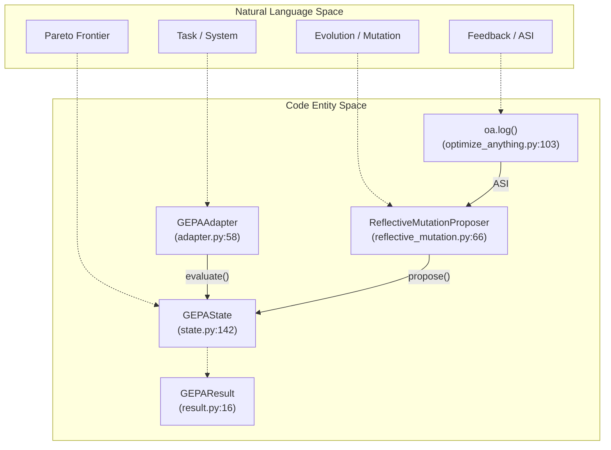
```mermaid
graph TB
    subgraph "Natural Language Space"
        Task["Task / System"]
        Feedback["Feedback / ASI"]
        Evolution["Evolution / Mutation"]
        Frontier["Pareto Frontier"]
    end

    subgraph "Code Entity Space"
        Adapter["GEPAAdapter<br/>(adapter.py:58)"]
        Log["oa.log()<br/>(optimize_anything.py:103)"]
        Proposer["ReflectiveMutationProposer<br/>(reflective_mutation.py:66)"]
        State["GEPAState<br/>(state.py:142)"]
        Result["GEPAResult<br/>(result.py:16)"]
    end

    Task -.-> Adapter
    Feedback -.-> Log
    Evolution -.-> Proposer
    Frontier -.-> State
    State -.-> Result

    Adapter -- "evaluate()" --> State
    Proposer -- "propose()" --> State
    Log -- "ASI" --> Proposer
```

**Sources**: [src/gepa/core/adapter.py:58](), [src/gepa/optimize_anything.py:103](), [src/gepa/proposer/reflective_mutation/reflective_mutation.py:66](), [src/gepa/core/state.py:142](), [src/gepa/core/result.py:16]()

---

## Core Types and Protocols

### `GEPAAdapter` Protocol
The primary interface for integrating GEPA with custom systems.

```python
class GEPAAdapter(Protocol[DataInst, Trajectory, RolloutOutput]):
    def evaluate(
        self,
        batch: list[DataInst],
        candidate: dict[str, str],
        capture_traces: bool = False,
    ) -> EvaluationBatch[Trajectory, RolloutOutput]:
        """Execute candidate on batch, returning outputs, scores, and optionally traces."""
        ...

    def make_reflective_dataset(
        self,
        candidate: dict[str, str],
        eval_batch: EvaluationBatch[Trajectory, RolloutOutput],
        components_to_update: list[str],
    ) -> Mapping[str, Sequence[Mapping[str, Any]]]:
        """Build reflective dataset (ASI) for instruction proposal."""
        ...
```
[src/gepa/core/adapter.py:58-112]()

### `EvaluationBatch` Dataclass
Container for evaluation results returned by `GEPAAdapter.evaluate()`.

| Attribute | Type | Description |
| :--- | :--- | :--- |
| `outputs` | `list[RolloutOutput]` | Per-example raw outputs. [src/gepa/core/adapter.py:20]() |
| `scores` | `list[float]` | Per-example numeric scores. [src/gepa/core/adapter.py:23]() |
| `trajectories` | `list[Trajectory]` \| `None` | Per-example traces for reflection. [src/gepa/core/adapter.py:26]() |
| `objective_scores` | `list[dict]` \| `None` | Multi-objective score breakdown. [src/gepa/core/adapter.py:29]() |

**Sources**: [src/gepa/core/adapter.py:15-35]()

---

## Core Engine Components

### `GEPAEngine`
Orchestrates the optimization loop using pluggable candidate proposers. It manages parallel proposals and coordinates between the adapter and the state.

```python
class GEPAEngine(Generic[DataId, DataInst, Trajectory, RolloutOutput]):
    def __init__(self, adapter, run_dir, valset, seed_candidate, ...):
        # Orchestration logic
        ...

    def run(self) -> GEPAState[RolloutOutput, DataId]:
        """Main optimization loop."""
        ...
```
[src/gepa/core/engine.py:51-134]()

### `GEPAState`
Internal persistent state of a GEPA optimization run. Tracks all explored candidates, Pareto frontiers, and evaluation budget. It also houses the `EvaluationCache`.

```python
class GEPAState(Generic[RolloutOutput, DataId]):
    program_candidates: list[dict[str, str]]
    pareto_front_valset: dict[DataId, float]
    total_num_evals: int
    # ...
```
[src/gepa/core/state.py:142-181]()

**Sources**: [src/gepa/core/engine.py:51-134](), [src/gepa/core/state.py:142-181]()

---

## Proposer System

GEPA uses two main proposer types to generate new candidates:

1.  **`ReflectiveMutationProposer`**: Leverages `reflection_lm` to mutate components based on textual feedback (ASI). It supports parallel execution via `prepare_proposal`, `execute_proposal`, and `apply_proposal_output`. [src/gepa/proposer/reflective_mutation/reflective_mutation.py:66-72]()
2.  **`MergeProposer`**: Identifies "dominator" programs on the Pareto frontier and merges them using common ancestor logic. [src/gepa/proposer/merge.py:210]()

### Merge Logic Flow
The `MergeProposer` attempts to combine the strengths of two successful candidates that diverged from a common ancestor.

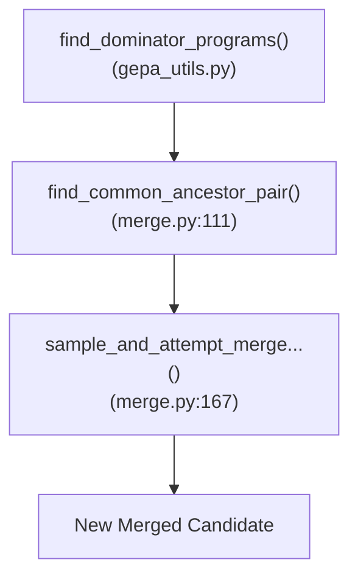
```mermaid
graph TD
    FindDominators["find_dominator_programs()<br/>(gepa_utils.py)"]
    FindAncestor["find_common_ancestor_pair()<br/>(merge.py:111)"]
    SampleMerge["sample_and_attempt_merge...()<br/>(merge.py:167)"]
    NewCandidate["New Merged Candidate"]

    FindDominators --> FindAncestor
    FindAncestor --> SampleMerge
    SampleMerge --> NewCandidate
```

**Sources**: [src/gepa/proposer/merge.py:111-178](), [src/gepa/proposer/merge.py:210](), [tests/proposer/test_merge.py:4-10]()

---

## Stopping Conditions

GEPA provides a flexible stopping system via `StopperProtocol`. Multiple stoppers can be combined using `CompositeStopper`.

| Stopper | Description |
| :--- | :--- |
| `MaxMetricCallsStopper` | Stops after a fixed number of evaluations. [src/gepa/utils/stop_condition.py:163]() |
| `TimeoutStopCondition` | Stops after a specified time duration. [src/gepa/utils/stop_condition.py:34]() |
| `ScoreThresholdStopper` | Stops once a target score is reached. [src/gepa/utils/stop_condition.py:64]() |
| `MaxReflectionCostStopper` | Stops based on cumulative USD cost of reflection LM. [src/gepa/utils/stop_condition.py:176]() |
| `NoImprovementStopper` | Stops after N iterations without improvement. [src/gepa/utils/stop_condition.py:83]() |
| `FileStopper` | Stops when a specific file exists on disk. [src/gepa/utils/stop_condition.py:46]() |
| `SignalStopper` | Stops when a system signal (SIGINT/SIGTERM) is received. [src/gepa/utils/stop_condition.py:114]() |

**Sources**: [src/gepa/utils/stop_condition.py:1-210]()

---

## Language Model Abstraction

### `LM` Class
A wrapper over LiteLLM that provides cost tracking, retry logic, and truncation detection. It implements the `LanguageModel` protocol.

```python
class LM:
    def __init__(self, model: str, temperature: float = None, ...):
        self.model = model
        self._total_cost = 0.0

    @property
    def total_cost(self) -> float:
        """Cumulative USD cost of all calls."""
        return self._total_cost
```
[src/gepa/lm.py:30-76]()

### `TrackingLM`
Wraps arbitrary callables (e.g., local models or mock functions) to estimate token usage and cost for non-LiteLLM interfaces.
[src/gepa/lm.py:190]()

**Sources**: [src/gepa/lm.py:30-190](), [tests/test_reflection_cost_tracking.py:13-174]()

---

## Evaluation Caching

The `EvaluationCache` prevents redundant calls to the `GEPAAdapter.evaluate()` method by hashing candidates and example IDs. It is stored within the `GEPAState`.

```python
@dataclass
class EvaluationCache(Generic[RolloutOutput, DataId]):
    def get(self, candidate, example_id):
        """Retrieve cached result."""
        ...
    def put(self, candidate, example_id, output, score, ...):
        """Store result."""
        ...
```
[src/gepa/core/state.py:46-64]()

**Sources**: [src/gepa/core/state.py:31-131]()

# Comparison with Other Methods


This document compares GEPA's optimization approach with other methods for improving AI systems, including reinforcement learning (RL), gradient-based optimization, traditional evolutionary algorithms, and manual prompt engineering. It explains the key technical differences, performance characteristics, and implementation details that distinguish GEPA.

For details on GEPA's core algorithm, see [Architecture Deep Dive](). For information on GEPA's key innovation of using execution traces, see [Actionable Side Information (ASI)]().

---

## High-Level Comparison

The table below summarizes the key characteristics distinguishing GEPA from other optimization methods:

| Characteristic | GEPA | RL (PPO/GRPO) | Gradient-Based | Evolutionary Algorithms | Manual Engineering |
|---|---|---|---|---|---|
| **Feedback Type** | Full execution traces (ASI) | Scalar rewards | Loss gradients | Scalar fitness scores | Human judgment |
| **Evaluations Needed** | 100-500 | 10,000-25,000+ | 1,000-1,000 | 1,000-10,000+ | 10-100 |
| **Model Access** | API-only (black-box) | Weights required | Weights required | API-only | API-only |
| **Interpretability** | High (readable traces) | Low (policy network) | Low (gradient paths) | Low (fitness landscape) | High (human understanding) |
| **Data Requirements** | 3-50 examples | 1,000+ examples | 100-1,000 examples | 50-500 examples | 1-10 examples |
| **Cost Efficiency** | **90x cheaper** (Databricks) | High compute cost | Medium compute cost | Medium compute cost | Zero compute cost |
| **Speed to Convergence** | **35x faster** than RL | Slow (hours-days) | Medium (minutes-hours) | Medium (minutes-hours) | Fast (minutes) but limited |

Sources: [README.md:31-49](), [docs/docs/index.md:17-22]()

---

## Performance Benchmarks

GEPA has demonstrated significant improvements across multiple production deployments and research benchmarks:

| Domain | Baseline | GEPA-Optimized | Improvement | Source |
|---|---|---|---|---|
| **Enterprise Agents (Databricks)** | Claude Opus 4.1 | Open-source + GEPA | **90x cost reduction** | [README.md:41]() |
| **AIME Math (2025)** | GPT-4.1 Mini: 46.6% | GPT-4.1 Mini + GEPA: 56.6% | **+10 pp** | [README.md:94]() |
| **MATH Benchmark** | DSPy CoT: 67% | DSPy Program + GEPA: 93% | **+26 pp** | [docs/docs/tutorials/index.md:11]() |
| **ARC-AGI Agent** | Initial: 32% | Evolved Architecture: 89% | **+57 pp** | [README.md:43]() |
| **Cloud Scheduling** | Expert heuristics | GEPA-discovered policy | **40.2% cost savings** | [README.md:44]() |
| **Jinja Coding Agent** | Base: 55% resolve | Auto-learned skills: 82% | **+27 pp** | [README.md:45]() |

**Speed Comparison**:
- **GEPA**: 100-500 evaluations to convergence.
- **RL (GRPO)**: 5,000-25,000+ evaluations.
- **Result**: **35x faster** than reinforcement learning [README.md:42]().

---

## Reinforcement Learning vs. GEPA

### Scalar Reward vs. Actionable Side Information (ASI)

Reinforcement Learning (RL) typically collapses complex system behavior into a single scalar reward. GEPA uses LLMs to *read* full execution traces—errors, logs, and reasoning—to diagnose *why* a candidate failed.

**Natural Language Space to Code Entity Space: RL vs GEPA Flow**

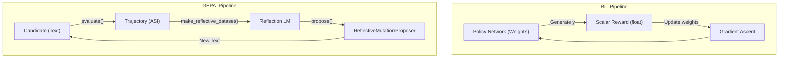
```mermaid
graph TB
    subgraph "RL_Pipeline"
        RL_Model["Policy Network (Weights)"]
        RL_Reward["Scalar Reward (float)"]
        RL_Update["Gradient Ascent"]
    end

    subgraph "GEPA_Pipeline"
        GEPA_Candidate["Candidate (Text)"]
        GEPA_Trace["Trajectory (ASI)"]
        GEPA_Reflection["Reflection LM"]
        GEPA_Proposer["ReflectiveMutationProposer"]
    end

    RL_Model -- "Generate y" --> RL_Reward
    RL_Reward -- "Update weights" --> RL_Update
    RL_Update --> RL_Model

    GEPA_Candidate -- "evaluate()" --> GEPA_Trace
    GEPA_Trace -- "make_reflective_dataset()" --> GEPA_Reflection
    GEPA_Reflection -- "propose()" --> GEPA_Proposer
    GEPA_Proposer -- "New Text" --> GEPA_Candidate
```

**Key Technical Differences:**
1. **Feedback Granularity**: RL uses `r = f(y)`. GEPA uses `Trajectory` objects containing `oa.log()` outputs [README.md:121-122]().
2. **Optimization Space**: RL optimizes continuous weights. GEPA optimizes discrete text parameters using `ReflectiveMutationProposer` [README.md:33-35]().
3. **Sample Efficiency**: GEPA converges in 100-500 calls because each "gradient step" (reflection) is highly informed by diagnostic feedback [README.md:33]().

Sources: [README.md:31-46](), [docs/docs/index.md:17-22]()

---

## Scaling GEPA: The Combee Framework

While traditional optimizers may struggle with large batch sizes, GEPA can be scaled using **Combee** to handle parallel agent traces without **context overload**.

**Combee Parallel Scaling Logic**

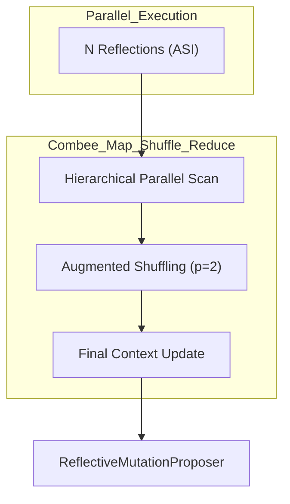
```mermaid
graph TD
    subgraph "Parallel_Execution"
        Traces["N Reflections (ASI)"]
    end

    subgraph "Combee_Map_Shuffle_Reduce"
        Map["Hierarchical Parallel Scan"]
        Shuffle["Augmented Shuffling (p=2)"]
        Reduce["Final Context Update"]
    end

    Traces --> Map
    Map --> Shuffle
    Shuffle --> Reduce
    Reduce --> Proposer["ReflectiveMutationProposer"]
```

**Performance Impact of Scaling:**
- **Speedup**: Up to **17x speedup** in wall-clock training time compared to sequential processing [docs/docs/blog/posts/2026-04-09-gepa-at-scale-with-combee/index.md:51]().
- **Quality Retention**: Avoids the accuracy drop (e.g., 87% to 72%) seen in naive batch size increases by using a **hierarchical parallel scan** [docs/docs/blog/posts/2026-04-09-gepa-at-scale-with-combee/index.md:63-75]().

Sources: [docs/docs/blog/posts/2026-04-09-gepa-at-scale-with-combee/index.md:45-91]()

---

## Traditional Evolutionary Algorithms

GEPA (Genetic-Pareto) extends classical evolutionary strategies with LLM-based operators and multi-objective Pareto tracking.

**System-Aware Evolution Flow**

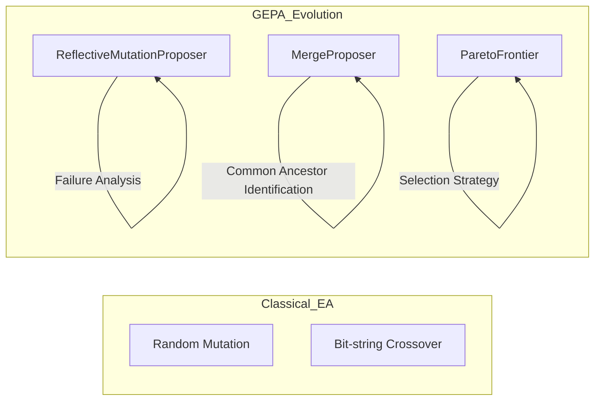
```mermaid
graph LR
    subgraph "Classical_EA"
        C_Mut["Random Mutation"]
        C_Cross["Bit-string Crossover"]
    end

    subgraph "GEPA_Evolution"
        G_Ref["ReflectiveMutationProposer"]
        G_Merge["MergeProposer"]
        G_Pareto["ParetoFrontier"]
    end

    G_Ref -- "Failure Analysis" --> G_Ref
    G_Merge -- "Common Ancestor Identification" --> G_Merge
    G_Pareto -- "Selection Strategy" --> G_Pareto
```

**Key Innovations in GEPA:**
1. **Informed Mutation**: Instead of random noise, `ReflectiveMutationProposer` uses an LLM to propose targeted fixes based on `Trajectory` data [README.md:142]().
2. **System-Aware Merge**: `MergeProposer` combines strengths of two Pareto-optimal candidates excelling on different tasks [README.md:145]().
3. **Pareto Frontier Management**: GEPA maintains frontier types to balance performance across different task subsets [README.md:139]().

Sources: [README.md:135-148](), [docs/docs/index.md:4-9]()

---

## Manual Prompt Engineering

Manual engineering relies on human intuition and a small number of test cases. GEPA automates this process, scaling to hundreds of evaluations.

| Aspect | Manual Engineering | GEPA |
|---|---|---|
| **Coverage** | 1-10 test cases | 100-500 test cases |
| **Reproducibility** | Low (expert dependent) | High (automated pipeline) |
| **Complexity** | Limited by human memory | Handles massive prompt evolution |
| **Insights** | Mental intuition | Actionable Side Information (ASI) logs |

**Example Evolution**: GEPA evolved GPT-4.1 Mini from 46.6% to 56.6% on AIME 2025 by analyzing failure traces over 150 evaluations [README.md:94]().

Sources: [README.md:67-94](), [docs/docs/tutorials/index.md:36]()

---

## Other Prompt Optimizers (OPRO, TextGrad, DSPy)

GEPA is integrated into the broader ecosystem, notably as `dspy.GEPA`.

### vs. OPRO (LLM as Optimizer)
OPRO uses score summaries. GEPA uses full `Trajectory` data (ASI) and `MergeProposer`. OPRO typically lacks the fine-grained diagnostic feedback loop provided by `oa.log()` [README.md:121-122]().

### vs. TextGrad
TextGrad uses a "gradient" metaphor for feedback. GEPA uses an evolutionary metaphor with population management, Pareto frontiers, and reflective mutation [README.md:33]().

### vs. DSPy Optimizers
GEPA is often the high-performance choice for complex programs. While `BootstrapFewShot` mines examples, `dspy.GEPA` evolves the instructions and logic themselves [README.md:96-109]().

Sources: [README.md:96-109](), [docs/docs/tutorials/index.md:33-41]()

---

## Decision Framework: When to Use GEPA

| Use GEPA When... | Use RL When... | Use Manual When... |
|---|---|---|
| **API-only models** (GPT-4, Claude) | **Weight access** is available | **Extremely scarce data** (<5 items) |
| **Expensive rollouts** (Slow agents) | **Cheap rollouts** (ms latency) | **Initial seed** creation |
| **Small-Medium data** (10-100 items) | **Large data** (10,000+ items) | **Simple tasks** |
| **Multi-objective** needs (Cost/Acc) | **Single scalar** reward | **Quick prototypes** |

**The "BetterTogether" Recipe**: A common production pattern is using GEPA for initial rapid optimization (API-only) followed by RL for final weight fine-tuning [README.md:33-46]().

Sources: [README.md:31-49](), [docs/docs/index.md:17-22]()
In each optimization iteration, GEPA proposes a new candidate and evaluates it against a minibatch of data. The **Acceptance Criterion** is the logic that gates whether this candidate is accepted into the global candidate pool or rejected [docs/docs/guides/acceptance-criterion.md:3-4](). This mechanism allows users to control the exploration-exploitation trade-off, handle multi-objective improvements, or implement custom safety and quality checks before a candidate is promoted.

## The Acceptance Protocol

All acceptance strategies must implement the `AcceptanceCriterion` protocol [src/gepa/strategies/acceptance.py:11-27](). This protocol defines a single method, `should_accept`, which receives the full context of the proposal and the current system state.

### Data Flow for Acceptance

The diagram below illustrates how evaluation data flows from the proposer into the acceptance logic to update the `GEPAState`.

**Acceptance Gating Logic**
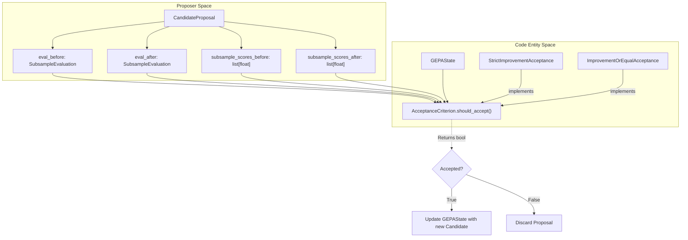
```mermaid
graph TD
    subgraph "Proposer Space"
        A["CandidateProposal"] --> B["eval_before: SubsampleEvaluation"]
        A --> C["eval_after: SubsampleEvaluation"]
        A --> D["subsample_scores_before: list[float]"]
        A --> E["subsample_scores_after: list[float]"]
    end

    subgraph "Code Entity Space"
        F["AcceptanceCriterion.should_accept()"]
        G["GEPAState"]
        H["StrictImprovementAcceptance"]
        I["ImprovementOrEqualAcceptance"]
    end

    B & C & D & E --> F
    G --> F
    F -.->|"Returns bool"| J{"Accepted?"}
    J -->|"True"| K["Update GEPAState with new Candidate"]
    J -->|"False"| L["Discard Proposal"]

    H -- "implements" --> F
    I -- "implements" --> F
```
Sources: [src/gepa/strategies/acceptance.py:11-36](), [src/gepa/strategies/acceptance.py:39-62](), [src/gepa/proposer/base.py:27-42]()

## Built-in Implementations

GEPA provides two primary built-in criteria for standard optimization tasks.

### Strict Improvement (Default)
The `StrictImprovementAcceptance` class requires the sum of scores on the current minibatch to be strictly greater than the sum of scores achieved by the parent candidate on that same minibatch [src/gepa/strategies/acceptance.py:39-48]().

*   **Logic**: `sum(new_scores) > sum(old_scores)`
*   **Usage**: Prevents the candidate pool from being flooded with lateral moves that do not provide measurable progress.

### Improvement or Equal
The `ImprovementOrEqualAcceptance` class allows candidates that maintain the same performance level as their parents [src/gepa/strategies/acceptance.py:51-61]().

*   **Logic**: `sum(new_scores) >= sum(old_scores)`
*   **Usage**: Useful for exploring diverse regions of the solution space where many candidates might achieve identical scores (e.g., binary pass/fail tasks) [docs/docs/guides/acceptance-criterion.md:20-22]().

Sources: [src/gepa/strategies/acceptance.py:39-62](), [docs/docs/guides/acceptance-criterion.md:9-29]()

## Configuration

Acceptance criteria can be configured via the `gepa.optimize` functional API or the `GEPAConfig` object.

### Functional API
```python
result = gepa.optimize(
    ...,
    acceptance_criterion="improvement_or_equal", # or a custom instance
)
```
Sources: [docs/docs/guides/acceptance-criterion.md:24-29]()

### Config Object
```python
from gepa.optimize_anything import GEPAConfig, EngineConfig

config = GEPAConfig(
    engine=EngineConfig(
        acceptance_criterion="improvement_or_equal",
    ),
)
```
Sources: [docs/docs/guides/acceptance-criterion.md:35-45]()

## Custom Acceptance Logic

For advanced use cases, you can implement the `AcceptanceCriterion` protocol. The `should_accept` method provides access to the following data via the `CandidateProposal` [src/gepa/strategies/acceptance.py:16-24]():

| Field | Type | Description |
| :--- | :--- | :--- |
| `eval_before` / `eval_after` | `SubsampleEvaluation` | Contains per-example `scores`, `outputs`, `objective_scores`, and `trajectories`. |
| `subsample_scores_before` | `list[float]` | Shorthand list of scalar scores for the parent on the minibatch. |
| `candidate` | `TextComponentDict` | The actual text/code of the proposed candidate. |
| `state` | `GEPAState` | Access to the Pareto frontier, iteration count, and previous validation scores. |

### Example: Multi-Objective Acceptance
If you want to accept a candidate if it improves on *any* single objective (e.g., accuracy OR speed), even if the aggregate score is lower [docs/docs/guides/acceptance-criterion.md:79-105]():

```python
class AnyObjectiveImproved:
    def should_accept(self, proposal: CandidateProposal, state: GEPAState) -> bool:
        if not (proposal.eval_before and proposal.eval_after):
            return False
        
        # Access multi-objective scores returned by the evaluator
        old_objs = proposal.eval_before.objective_scores # List[Dict[str, float]]
        new_objs = proposal.eval_after.objective_scores
        
        if old_objs is None or new_objs is None:
            return sum(proposal.subsample_scores_after or []) > sum(proposal.subsample_scores_before or [])

        # Collect all objective names
        objectives = set()
        for s in old_objs:
            objectives.update(s.keys())

        for obj in objectives:
            old_total = sum(s.get(obj, 0.0) for s in old_objs)
            new_total = sum(s.get(obj, 0.0) for s in new_objs)
            if new_total > old_total:
                return True
        return False
```
Sources: [docs/docs/guides/acceptance-criterion.md:79-105](), [tests/test_acceptance_criterion.py:101-138]()

### Example: Output-Based Filtering
You can reject candidates that produce invalid output formats, regardless of their score [tests/test_acceptance_criterion.py:142-160]():

```python
class RejectEmptyOutputs:
    def should_accept(self, proposal: CandidateProposal, state: GEPAState) -> bool:
        if proposal.eval_after is None:
            return False
        # Reject if any output in the minibatch is an empty string
        return all(output != "" for output in proposal.eval_after.outputs)
```
Sources: [tests/test_acceptance_criterion.py:142-160]()

## Internal Logic Comparison

The following diagram maps the implementation classes to their decision logic within the `gepa.strategies.acceptance` module.

**Acceptance Strategy Implementation Map**
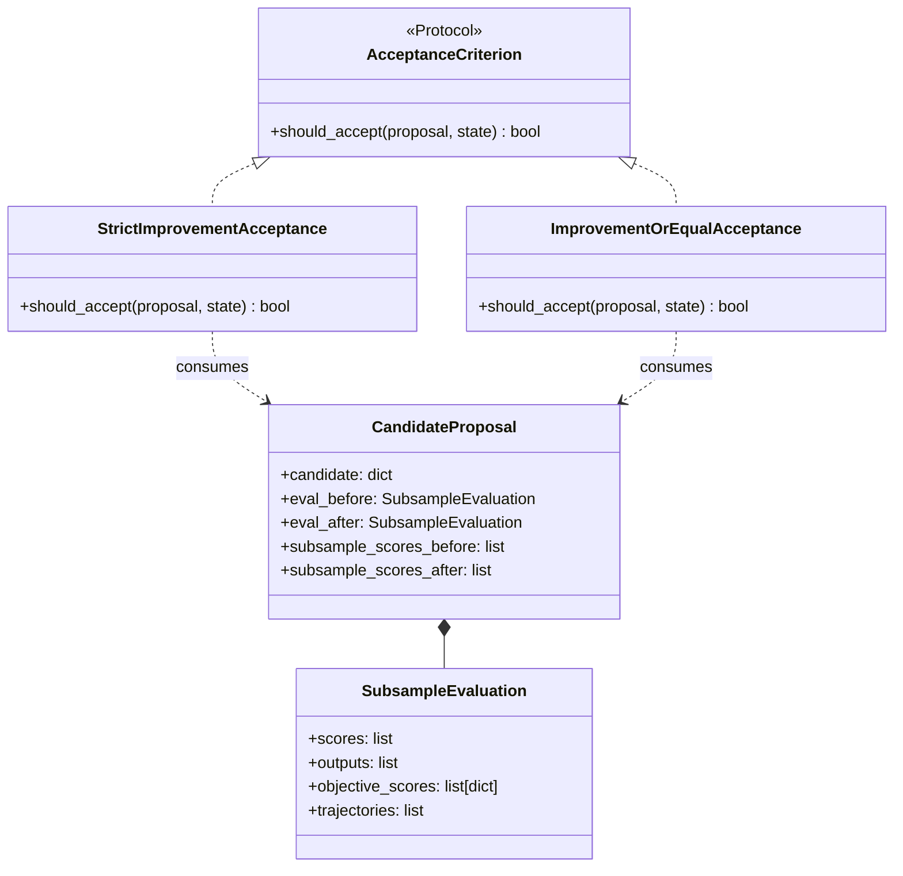
```mermaid
classDiagram
    class AcceptanceCriterion {
        <<Protocol>>
        +should_accept(proposal, state) bool
    }
    class StrictImprovementAcceptance {
        +should_accept(proposal, state) bool
        %% Logic: new_sum > old_sum
    }
    class ImprovementOrEqualAcceptance {
        +should_accept(proposal, state) bool
        %% Logic: new_sum >= old_sum
    }
    class CandidateProposal {
        +candidate: dict
        +eval_before: SubsampleEvaluation
        +eval_after: SubsampleEvaluation
        +subsample_scores_before: list
        +subsample_scores_after: list
    }
    class SubsampleEvaluation {
        +scores: list
        +outputs: list
        +objective_scores: list[dict]
        +trajectories: list
    }

    AcceptanceCriterion <|.. StrictImprovementAcceptance
    AcceptanceCriterion <|.. ImprovementOrEqualAcceptance
    StrictImprovementAcceptance ..> CandidateProposal : consumes
    ImprovementOrEqualAcceptance ..> CandidateProposal : consumes
    CandidateProposal *-- SubsampleEvaluation
```
Sources: [src/gepa/strategies/acceptance.py:11-62](), [src/gepa/proposer/base.py:27-42]()
The Adapter System is GEPA's primary integration mechanism that enables the framework to optimize textual components in diverse external systems. The `GEPAAdapter` protocol defines a standardized interface for connecting GEPA's optimization engine with user-defined programs, whether they are simple LLM prompts, complex DSPy programs, RAG pipelines, or multi-turn agentic systems.

This page covers the core `GEPAAdapter` protocol, evaluation mechanisms, reflective dataset construction, and instruction proposal strategies. For specific adapter implementations, see the child pages listed below.

**Sources:** [src/gepa/core/adapter.py:49-172](), [src/gepa/api.py:1-349](), [src/gepa/adapters/README.md:1-13]()

## GEPAAdapter Protocol Definition

The `GEPAAdapter` protocol is a generic protocol parameterized by three user-defined types that remain opaque to GEPA's core engine. This design enables type-safe integration with arbitrary external systems.

### Protocol Type Parameters and Core Interface

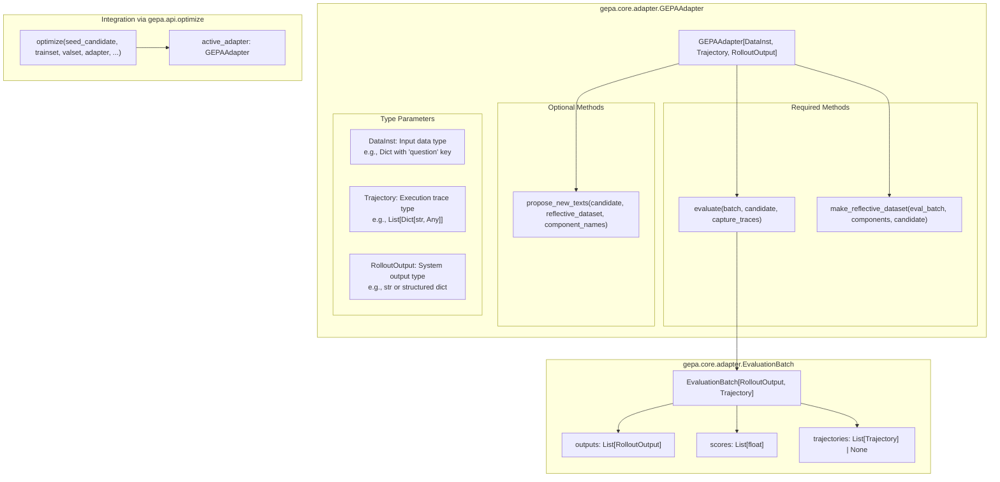
```mermaid
graph TB
    subgraph "gepa.core.adapter.GEPAAdapter"
        Protocol["GEPAAdapter[DataInst, Trajectory, RolloutOutput]"]
        
        subgraph "Required Methods"
            Evaluate["evaluate(batch, candidate, capture_traces)"]
            MakeReflective["make_reflective_dataset(eval_batch, components, candidate)"]
        end
        
        subgraph "Optional Methods"
            ProposeNew["propose_new_texts(candidate, reflective_dataset, component_names)"]
        end
        
        subgraph "Type Parameters"
            DataInst["DataInst: Input data type<br/>e.g., Dict with 'question' key"]
            Trajectory["Trajectory: Execution trace type<br/>e.g., List[Dict[str, Any]]"]
            RolloutOutput["RolloutOutput: System output type<br/>e.g., str or structured dict"]
        end
    end
    
    subgraph "gepa.core.adapter.EvaluationBatch"
        EvalBatch["EvaluationBatch[RolloutOutput, Trajectory]"]
        Outputs["outputs: List[RolloutOutput]"]
        Scores["scores: List[float]"]
        Trajectories["trajectories: List[Trajectory] | None"]
    end
    
    subgraph "Integration via gepa.api.optimize"
        OptimizeFunc["optimize(seed_candidate, trainset, valset, adapter, ...)"]
        ActiveAdapter["active_adapter: GEPAAdapter"]
    end
    
    Protocol --> Evaluate
    Protocol --> MakeReflective
    Protocol --> ProposeNew
    
    Evaluate --> EvalBatch
    EvalBatch --> Outputs
    EvalBatch --> Scores
    EvalBatch --> Trajectories
    
    OptimizeFunc --> ActiveAdapter
```

**Sources:** [src/gepa/core/adapter.py:49-172](), [src/gepa/api.py:155-166](), [src/gepa/api.py:310-312]()

The protocol defines three responsibilities:

### Required: evaluate()

Executes a candidate program on a batch of data instances. Returns an `EvaluationBatch` containing per-example outputs, scores, and optional execution traces. For details, see [GEPAAdapter Interface](#5.1).

**Sources:** [src/gepa/core/adapter.py:97-135]()

### Required: make_reflective_dataset()

Transforms execution trajectories into JSON-serializable feedback for the reflection LM. Returns a dictionary mapping component names to lists of feedback records. For details, see [GEPAAdapter Interface](#5.1).

**Sources:** [src/gepa/core/adapter.py:137-169]()

### Optional: propose_new_texts()

Provides custom instruction proposal logic. If not implemented, GEPA uses the default reflective mutation proposer. For details, see [Creating Custom Adapters](#5.10).

**Sources:** [src/gepa/core/adapter.py:171](), [src/gepa/api.py:209-213]()

## Evaluation Flow and EvaluationBatch Structure

The evaluation system centers around the `EvaluationBatch` dataclass defined in [src/gepa/core/adapter.py:12-28](). This dataclass encapsulates all results from executing a candidate program on a batch of data.

### Evaluation Data Flow Through GEPA Engine

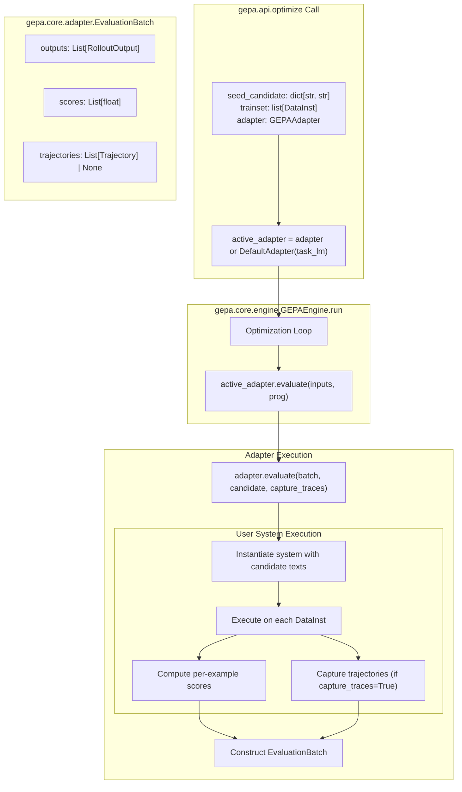
```mermaid
graph TB
    subgraph "gepa.api.optimize Call"
        OptimizeParams["seed_candidate: dict[str, str]<br/>trainset: list[DataInst]<br/>adapter: GEPAAdapter"]
        ActiveAdapter["active_adapter = adapter or DefaultAdapter(task_lm)"]
    end
    
    subgraph "gepa.core.engine.GEPAEngine.run"
        EngineLoop["Optimization Loop"]
        EvalCall["active_adapter.evaluate(inputs, prog)"]
    end
    
    subgraph "Adapter Execution"
        AdapterEval["adapter.evaluate(batch, candidate, capture_traces)"]
        
        subgraph "User System Execution"
            InstantiateSystem["Instantiate system with candidate texts"]
            RunBatch["Execute on each DataInst"]
            ComputeScores["Compute per-example scores"]
            CaptureTraces["Capture trajectories (if capture_traces=True)"]
        end
        
        ConstructBatch["Construct EvaluationBatch"]
    end
    
    subgraph "gepa.core.adapter.EvaluationBatch"
        OutputsField["outputs: List[RolloutOutput]"]
        ScoresField["scores: List[float]"]
        TrajectoriesField["trajectories: List[Trajectory] | None"]
    end
    
    OptimizeParams --> ActiveAdapter
    ActiveAdapter --> EngineLoop
    EngineLoop --> EvalCall
    EvalCall --> AdapterEval
    
    AdapterEval --> InstantiateSystem
    InstantiateSystem --> RunBatch
    RunBatch --> ComputeScores
    RunBatch --> CaptureTraces
    
    ComputeScores --> ConstructBatch
    CaptureTraces --> ConstructBatch
```

**Sources:** [src/gepa/api.py:155-166](), [src/gepa/core/adapter.py:12-28](), [src/gepa/core/adapter.py:97-135]()

## Reflective Dataset Construction

The `make_reflective_dataset()` method transforms execution traces into structured feedback that drives the reflective mutation process. This bridges system execution and LLM-based instruction refinement.

### Reflective Dataset Flow

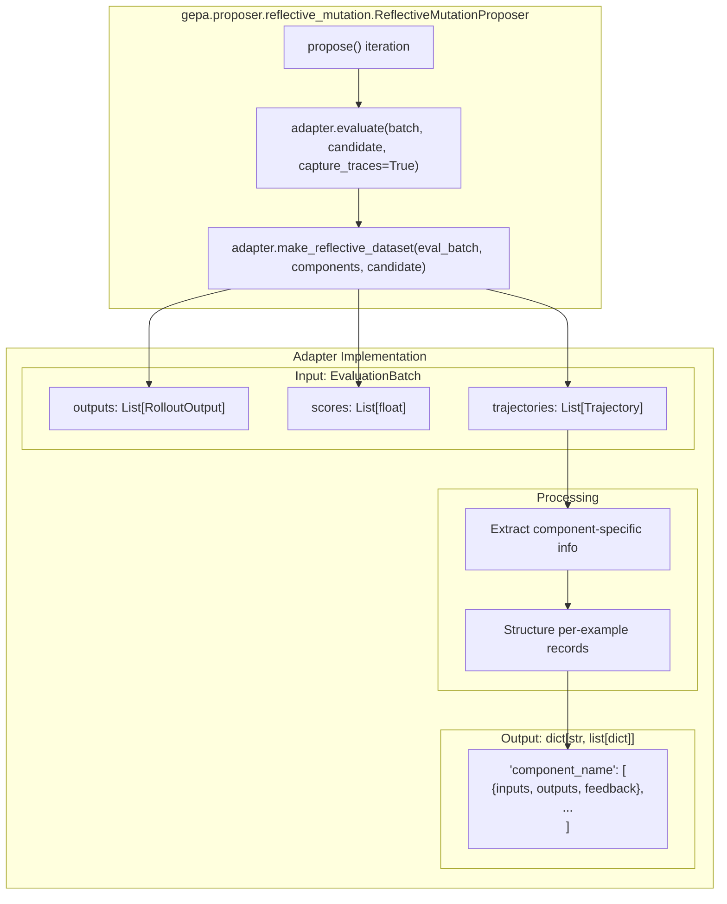
```mermaid
graph TB
    subgraph "gepa.proposer.reflective_mutation.ReflectiveMutationProposer"
        ProposeStep["propose() iteration"]
        EvalWithTraces["adapter.evaluate(batch, candidate, capture_traces=True)"]
        MakeDataset["adapter.make_reflective_dataset(eval_batch, components, candidate)"]
    end
    
    subgraph "Adapter Implementation"
        subgraph "Input: EvaluationBatch"
            Outputs["outputs: List[RolloutOutput]"]
            Scores["scores: List[float]"]
            Trajectories["trajectories: List[Trajectory]"]
        end
        
        subgraph "Processing"
            ExtractPerComponent["Extract component-specific info"]
            StructureRecords["Structure per-example records"]
        end
        
        subgraph "Output: dict[str, list[dict]]"
            CompDataset["'component_name': [<br/>  {inputs, outputs, feedback},<br/>  ...<br/>]"]
        end
    end
    
    ProposeStep --> EvalWithTraces
    EvalWithTraces --> MakeDataset
    
    MakeDataset --> Outputs
    MakeDataset --> Scores
    MakeDataset --> Trajectories
    
    Trajectories --> ExtractPerComponent
    ExtractPerComponent --> StructureRecords
    StructureRecords --> CompDataset
```

**Sources:** [src/gepa/core/adapter.py:137-169]()

## Adapter Ecosystem

GEPA provides several built-in adapters for common use cases and framework integrations.

### Built-in Adapters

- **[GEPAAdapter Interface](#5.1)**: The base protocol for all adapters.
- **[DefaultAdapter](#5.2)**: Integrates GEPA into single-turn LLM environments for optimizing system prompts.
- **[OptimizeAnythingAdapter](#5.3)**: A universal adapter for optimizing arbitrary text artifacts like code or configs.
- **[DSPy Integration](#5.4)**: Optimizes signature instructions for [DSPy](https://dspy.ai/) modules.
- **[DSPy Full Program Evolution](#5.5)**: Deep integration for evolving entire DSPy programs, including tool modules and control flow.
- **[MCP Adapter](#5.6)**: Optimizes Model Context Protocol tool descriptions and system prompts.
- **[Generic RAG Adapter](#5.7)**: Optimizes prompt templates across different stages of a RAG pipeline (retrieval, reranking, synthesis).
- **[AnyMaths Adapter](#5.8)**: Specialized for mathematical problem-solving and reasoning tasks.
- **[Confidence Adapter](#5.9)**: Uses token-level logprobs to detect "lucky guesses" in classification tasks.

**Sources:** [src/gepa/adapters/README.md:1-13](), [src/gepa/adapters/generic_rag_adapter/rag_pipeline.py:9-92]()

### Integration with External Systems

The `GenericRAGAdapter` demonstrates how GEPA can interface with external infrastructure like vector stores through the `VectorStoreInterface` [src/gepa/adapters/generic_rag_adapter/vector_store_interface.py:8-35](). This allows the same optimization logic to be applied to systems backed by ChromaDB, Pinecone, or other retrieval backends. The `RAGPipeline` class [src/gepa/adapters/generic_rag_adapter/rag_pipeline.py:9-19]() orchestrates the flow from query reformulation to answer generation, allowing GEPA to optimize components at each stage.

**Sources:** [src/gepa/adapters/generic_rag_adapter/vector_store_interface.py:8-35](), [src/gepa/adapters/generic_rag_adapter/rag_pipeline.py:9-92]()

## Custom Adapters

For systems that do not fit the built-in patterns, users can implement the `GEPAAdapter` protocol. This requires defining custom types for `DataInst`, `Trajectory`, and `RolloutOutput` and implementing the evaluation and reflection logic. For a step-by-step guide, see **[Creating Custom Adapters](#5.10)**.

**Sources:** [src/gepa/core/adapter.py:49-172](), [docs/docs/guides/adapters.md:1-240]()

# GEPAAdapter Interface


The `GEPAAdapter` protocol is the primary integration point between the GEPA optimization engine and any external system. It defines a standardized contract that allows GEPA to optimize arbitrary text-parameterized systems—such as LLM prompts, DSPy programs, or configuration files—without requiring changes to the core engine.

---

## Protocol Definition

The `GEPAAdapter` protocol is defined in [src/gepa/core/adapter.py:59-181]() as a `Protocol[DataInst, Trajectory, RolloutOutput]`. It uses three generic type parameters that remain opaque to the GEPA engine but are essential for the adapter's internal logic.

### Core Responsibilities
An adapter implementation must handle three main tasks:
1.  **Program Evaluation**: Execute a candidate program on a batch of data and return performance metrics via the `evaluate` method [src/gepa/core/adapter.py:72-75]().
2.  **Reflective Dataset Construction**: Transform execution traces into structured feedback for the reflection LM via `make_reflective_dataset` [src/gepa/core/adapter.py:77-80]().
3.  **Instruction Proposal (Optional)**: Provide custom logic for generating new component texts, overriding the default LLM-based proposer via `propose_new_texts` [src/gepa/core/adapter.py:82-87]().

Sources: [src/gepa/core/adapter.py:59-181]()

---

## Architecture and Code Entity Mapping

The following diagram bridges the conceptual "Natural Language Space" (where prompts are optimized) to the "Code Entity Space" by showing how GEPA engine components interact with the `GEPAAdapter` methods.

**System Interaction Map**
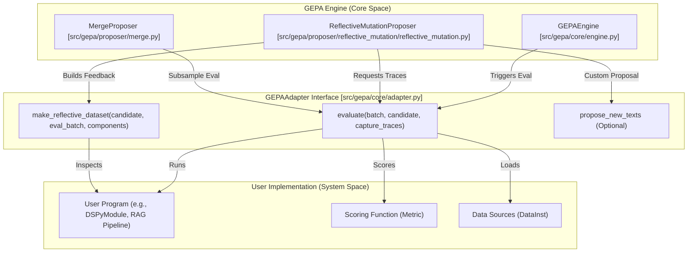
```mermaid
graph TB
    subgraph "GEPA Engine (Core Space)"
        ENGINE["GEPAEngine [src/gepa/core/engine.py]"]
        REFLECT["ReflectiveMutationProposer [src/gepa/proposer/reflective_mutation/reflective_mutation.py]"]
        MERGE["MergeProposer [src/gepa/proposer/merge.py]"]
    end
    
    subgraph "GEPAAdapter Interface [src/gepa/core/adapter.py]"
        direction TB
        EVAL["evaluate(batch, candidate, capture_traces)"]
        REFLECT_DS["make_reflective_dataset(candidate, eval_batch, components)"]
        PROPOSE["propose_new_texts (Optional)"]
    end
    
    subgraph "User Implementation (System Space)"
        USER_PROG["User Program (e.g., DSPyModule, RAG Pipeline)"]
        USER_METRIC["Scoring Function (Metric)"]
        USER_DATA["Data Sources (DataInst)"]
    end
    
    ENGINE -- "Triggers Eval" --> EVAL
    REFLECT -- "Requests Traces" --> EVAL
    REFLECT -- "Builds Feedback" --> REFLECT_DS
    REFLECT -- "Custom Proposal" --> PROPOSE
    MERGE -- "Subsample Eval" --> EVAL
    
    EVAL -- "Runs" --> USER_PROG
    EVAL -- "Scores" --> USER_METRIC
    EVAL -- "Loads" --> USER_DATA
    REFLECT_DS -- "Inspects" --> USER_PROG
```
Sources: [src/gepa/core/adapter.py:59-87](), [src/gepa/core/adapter.py:121-144]()

---

## Generic Type Parameters

The protocol is generic over three types that define the data flow within the adapter:

| Type Parameter | Code Reference | Description | Examples |
| :--- | :--- | :--- | :--- |
| `DataInst` | [src/gepa/core/adapter.py:11]() | The input data type for the task. | `dict`, `str`, `dspy.Example` |
| `Trajectory` | [src/gepa/core/adapter.py:10]() | Captured intermediate state or execution steps. | `list[dict]`, `TraceData`, `stdout` logs |
| `RolloutOutput` | [src/gepa/core/adapter.py:9]() | The raw output produced by the candidate program. | `str`, `Prediction` object |

Sources: [src/gepa/core/adapter.py:9-12](), [src/gepa/core/adapter.py:59-70]()

---

## Method: `evaluate()`

```python
def evaluate(
    self,
    batch: list[DataInst],
    candidate: dict[str, str],
    capture_traces: bool = False,
) -> EvaluationBatch[Trajectory, RolloutOutput]:
```

The `evaluate` method executes the program defined by the `candidate` mapping (component name → text) on a `batch` of inputs [src/gepa/core/adapter.py:121-133]().

### The `EvaluationBatch` Container
The result must be wrapped in an `EvaluationBatch` object [src/gepa/core/adapter.py:15-35]():
*   **`outputs`**: List of `RolloutOutput` (one per input) [src/gepa/core/adapter.py:31-31]().
*   **`scores`**: List of `float` (higher is better) [src/gepa/core/adapter.py:32-32]().
*   **`trajectories`**: Optional list of `Trajectory`. Must be provided if `capture_traces=True` [src/gepa/core/adapter.py:33-33]().
*   **`objective_scores`**: Optional list of dictionaries for multi-objective optimization (name -> score) [src/gepa/core/adapter.py:34-34]().

### Data Flow for Evaluation
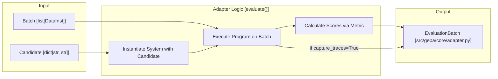
```mermaid
graph LR
    subgraph "Input"
        CAND["Candidate [dict[str, str]]"]
        BATCH["Batch [list[DataInst]]"]
    end
    
    subgraph "Adapter Logic [evaluate()]"
        INIT["Instantiate System with Candidate"]
        EXEC["Execute Program on Batch"]
        SCORE["Calculate Scores via Metric"]
    end
    
    subgraph "Output"
        EV_BATCH["EvaluationBatch [src/gepa/core/adapter.py]"]
    end
    
    CAND --> INIT
    BATCH --> EXEC
    INIT --> EXEC
    EXEC --> SCORE
    SCORE --> EV_BATCH
    EXEC -- "if capture_traces=True" --> EV_BATCH
```
Sources: [src/gepa/core/adapter.py:15-35](), [src/gepa/core/adapter.py:121-144]()

---

## Method: `make_reflective_dataset()`

```python
def make_reflective_dataset(
    self,
    candidate: dict[str, str],
    eval_batch: EvaluationBatch[Trajectory, RolloutOutput],
    components_to_update: list[str],
) -> Mapping[str, Sequence[Mapping[str, Any]]]:
```

This method converts raw `trajectories` and `outputs` into a "reflective dataset"—a JSON-serializable format that the reflection LM uses to understand why a candidate performed well or poorly [src/gepa/core/adapter.py:146-161]().

### Contract Requirements
*   **Structure**: Returns a mapping where keys are component names and values are lists of example records [src/gepa/core/adapter.py:77-80]().
*   **Record Schema**: Records are typically mappings of strings to any serializable data (e.g., input, output, trace feedback) [src/gepa/core/adapter.py:167-173]().
*   **Trace Usage**: The engine calls this when `capture_traces=True` was passed to `evaluate()` to build context for mutation [src/gepa/core/adapter.py:135-137]().

Sources: [src/gepa/core/adapter.py:146-178]()

---

## Optional Method: `propose_new_texts()`

Adapters can optionally implement a `propose_new_texts` method to override GEPA's default instruction proposal logic [src/gepa/core/adapter.py:82-87](). This is useful for:
*   **Coupled Updates**: Updating multiple components that depend on each other [src/gepa/core/adapter.py:51-51]().
*   **Custom Models**: Using a specific LLM or prompting strategy for the reflection step [src/gepa/core/adapter.py:49-50]().

The engine detects this method via the `ProposalFn` protocol [src/gepa/core/adapter.py:38-56]().

Sources: [src/gepa/core/adapter.py:38-56](), [src/gepa/core/adapter.py:82-87]()

---

## Adapter State Persistence

Adapters that maintain internal state (e.g., dynamic validation sets) can implement two optional methods for persistence during checkpointing [src/gepa/core/adapter.py:88-91]():

1.  **`get_adapter_state() -> dict[str, Any]`**: Returns a fresh dictionary of adapter-specific state to be snapshotted [src/gepa/core/adapter.py:92-95]().
2.  **`set_adapter_state(state: dict[str, Any]) -> None`**: Restores previously persisted state into the adapter upon resume [src/gepa/core/adapter.py:96-97]().

The engine detects these methods via duck typing and skips them if not implemented [src/gepa/core/adapter.py:99-101]().

Sources: [src/gepa/core/adapter.py:88-101](), [tests/test_state.py:118-158]()

---

## Implementation Constraints

*   **Scoring**: GEPA assumes higher scores are better. It uses `sum(scores)` for minibatch acceptance and `mean(scores)` for validation tracking [src/gepa/core/adapter.py:104-107]().
*   **Error Handling**: Adapters should not raise exceptions for individual example failures. Instead, they should return a valid `EvaluationBatch` with failure scores (e.g., 0.0) and include the error message in the `Trajectory` [src/gepa/core/adapter.py:112-115]().
*   **Exceptions**: Reserve exceptions for unrecoverable systemic failures (e.g., misconfigured program) [src/gepa/core/adapter.py:116-118]().

Sources: [src/gepa/core/adapter.py:102-119]()

# DefaultAdapter


The `DefaultAdapter` is the simplest concrete implementation of the [GEPAAdapter Interface](#5.1), designed for optimizing system prompts in single-turn LLM tasks. It enables GEPA to evolve textual instructions that guide a language model's behavior on straightforward question-answering or text generation tasks where each input produces a single output.

For optimizing multi-turn conversations, agent systems, or complex programs with control flow, see [DSPy Integration](#5.4), [DSPy Full Program Evolution](#5.5), or [Creating Custom Adapters](#5.10).

---

## Purpose and Scope

`DefaultAdapter` is a concrete implementation of the `GEPAAdapter` protocol for optimizing system prompts in single-turn LLM tasks. It provides a zero-configuration entry point for prompt optimization by handling:

- Execution of candidate system prompts via LiteLLM or custom callables [src/gepa/adapters/default_adapter/default_adapter.py:131-137]()
- Evaluation using configurable evaluators (default: `ContainsAnswerEvaluator`) [src/gepa/adapters/default_adapter/default_adapter.py:102]()
- Trajectory capture for reflective learning [src/gepa/adapters/default_adapter/default_adapter.py:151-159]()
- Reflective dataset construction for LLM-based prompt improvement [src/gepa/adapters/default_adapter/default_adapter.py:176-209]()

**Use DefaultAdapter when:**
- Optimizing a single system message for chat-based LLM APIs.
- Task requires one LLM invocation per input (QA, classification, generation).
- Input data has `input`, `answer`, and optionally `additional_context` fields.
- Simple string-matching or custom evaluation is sufficient.

**Sources:** [src/gepa/adapters/default_adapter/default_adapter.py:87-102]()

---

## Data Structures

### DefaultDataInst

The `DefaultDataInst` TypedDict defines the expected structure for input data instances:

```python
class DefaultDataInst(TypedDict):
    input: str
    additional_context: dict[str, str]
    answer: str
```

| Field | Type | Description |
|-------|------|-------------|
| `input` | `str` | The main input text (question, prompt, etc.) |
| `additional_context` | `dict[str, str]` | Optional metadata available during evaluation |
| `answer` | `str` | Expected answer for evaluation |

**Sources:** [src/gepa/adapters/default_adapter/default_adapter.py:11-14]()

### DefaultTrajectory

Trajectories capture execution traces when `capture_traces=True`:

```python
class DefaultTrajectory(TypedDict):
    data: DefaultDataInst
    full_assistant_response: str
    feedback: str
```

**Sources:** [src/gepa/adapters/default_adapter/default_adapter.py:23-27]()

### DefaultRolloutOutput

The output structure returned for each example:

```python
class DefaultRolloutOutput(TypedDict):
    full_assistant_response: str
```

**Sources:** [src/gepa/adapters/default_adapter/default_adapter.py:29-31]()

### DefaultReflectiveRecord

Structure of records in the reflective dataset:

```python
DefaultReflectiveRecord = TypedDict(
    "DefaultReflectiveRecord",
    {
        "Inputs": str,
        "Generated Outputs": str,
        "Feedback": str,
    },
)
```

**Sources:** [src/gepa/adapters/default_adapter/default_adapter.py:33-40]()

---

## Constructor and Configuration

### DefaultAdapter Constructor

```python
def __init__(
    self,
    model: str | ChatCompletionCallable,
    evaluator: Evaluator | None = None,
    max_litellm_workers: int = 10,
    litellm_batch_completion_kwargs: dict[str, Any] | None = None,
)
```

| Parameter | Type | Default | Description |
|-----------|------|---------|-------------|
| `model` | `str \| ChatCompletionCallable` | (required) | LiteLLM model string or custom callable |
| `evaluator` | `Evaluator \| None` | `ContainsAnswerEvaluator()` | Callable that returns `EvaluationResult` |
| `max_litellm_workers` | `int` | `10` | Parallel workers for LiteLLM |
| `litellm_batch_completion_kwargs` | `dict[str, Any] \| None` | `{}` | Kwargs for `litellm.batch_completion()` |

**Sources:** [src/gepa/adapters/default_adapter/default_adapter.py:88-102]()

---

## Evaluator System

### Evaluator Protocol

The `Evaluator` protocol defines the interface for scoring model responses. It returns an `EvaluationResult` which includes the score, textual feedback, and optional multi-objective scores.

```python
class Evaluator(Protocol):
    def __call__(self, data: DefaultDataInst, response: str) -> EvaluationResult:
        """
        Evaluates a response and returns a score, feedback, and optional objective scores.
        """
        ...
```

**Sources:** [src/gepa/adapters/default_adapter/default_adapter.py:55-60]()

### ContainsAnswerEvaluator

The default evaluator performs exact substring matching to determine correctness. If the `answer` string from the `DefaultDataInst` is found anywhere in the LLM's response, the score is 1.0; otherwise, it is `failure_score`.

```python
class ContainsAnswerEvaluator:
    def __init__(self, failure_score: float = 0.0):
        self.failure_score = failure_score

    def __call__(self, data: DefaultDataInst, response: str) -> EvaluationResult:
        is_correct = data["answer"] in response
        score = 1.0 if is_correct else self.failure_score
        # ... generates feedback message
```

**Sources:** [src/gepa/adapters/default_adapter/default_adapter.py:63-84]()

---

## evaluate() Method

The `evaluate()` method executes the candidate system prompt on a batch of data instances. It handles message construction, parallel LLM calls via `LM.batch_complete`, and scoring via the configured evaluator.

### Execution Flow

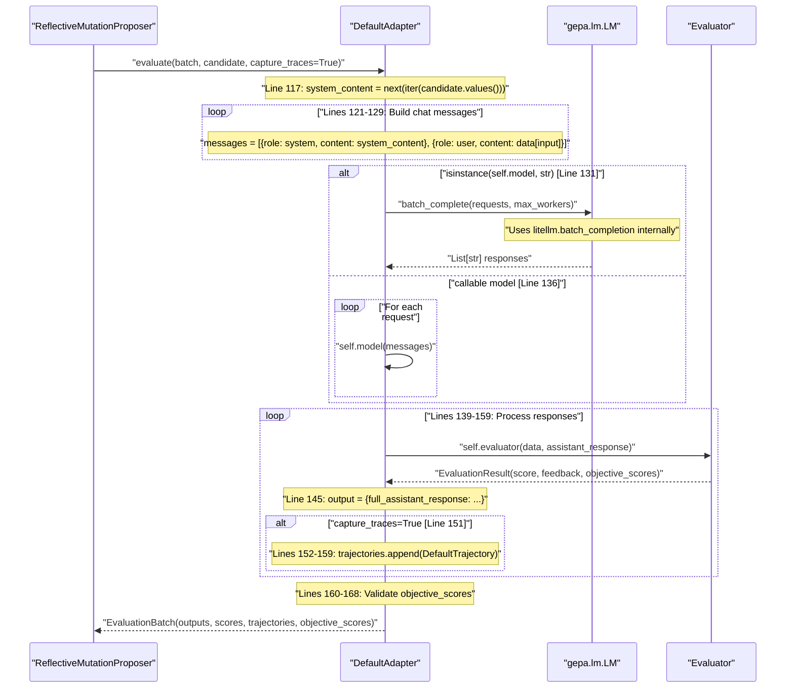
```mermaid
sequenceDiagram
    participant RMP as "ReflectiveMutationProposer"
    participant DA as "DefaultAdapter"
    participant LM as "gepa.lm.LM"
    participant Eval as "Evaluator"
    
    RMP->>DA: "evaluate(batch, candidate, capture_traces=True)"
    Note over DA: "Line 117: system_content = next(iter(candidate.values()))"
    
    loop "Lines 121-129: Build chat messages"
        Note over DA: "messages = [{role: system, content: system_content}, {role: user, content: data[input]}]"
    end
    
    alt "isinstance(self.model, str) [Line 131]"
        DA->>LM: "batch_complete(requests, max_workers)"
        Note over LM: "Uses litellm.batch_completion internally"
        LM-->>DA: "List[str] responses"
    else "callable model [Line 136]"
        loop "For each request"
            DA->>DA: "self.model(messages)"
        end
    end
    
    loop "Lines 139-159: Process responses"
        DA->>Eval: "self.evaluator(data, assistant_response)"
        Eval-->>DA: "EvaluationResult(score, feedback, objective_scores)"
        
        Note over DA: "Line 145: output = {full_assistant_response: ...}"
        
        alt "capture_traces=True [Line 151]"
            Note over DA: "Lines 152-159: trajectories.append(DefaultTrajectory)"
        end
    end
    
    Note over DA: "Lines 160-168: Validate objective_scores"
    DA-->>RMP: "EvaluationBatch(outputs, scores, trajectories, objective_scores)"
```

**Sources:** [src/gepa/adapters/default_adapter/default_adapter.py:106-174](), [src/gepa/lm.py:95-125]()

---

## make_reflective_dataset() Method

Constructs a reflective dataset from evaluation trajectories. This dataset is passed to the reflection LLM to generate improved instructions based on specific failures and successes.

### Implementation

```python
# Line 184: Enforce single component
assert len(components_to_update) == 1
comp = components_to_update[0]

# Line 187: Require trajectories
trajectories = eval_batch.trajectories
assert trajectories is not None

items: list[DefaultReflectiveRecord] = []

# Lines 192-200: Build reflective records
for traj in trajectories:
    d: DefaultReflectiveRecord = {
        "Inputs": traj["data"]["input"],
        "Generated Outputs": traj["full_assistant_response"],
        "Feedback": traj["feedback"],
    }
    items.append(d)

# Line 201: Map component to records
ret_d[comp] = items
```

**Sources:** [src/gepa/adapters/default_adapter/default_adapter.py:176-209]()

---

## Component Mapping

The following diagram maps the logical entities of the `DefaultAdapter` to their specific code definitions.

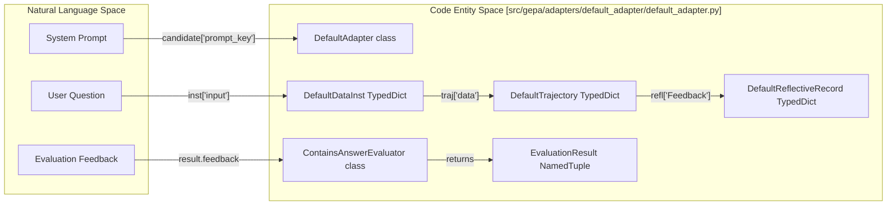
```mermaid
graph LR
    subgraph "Natural Language Space"
        prompt["System Prompt"]
        feedback["Evaluation Feedback"]
        input["User Question"]
    end

    subgraph "Code Entity Space [src/gepa/adapters/default_adapter/default_adapter.py]"
        adapter["DefaultAdapter class"]
        inst["DefaultDataInst TypedDict"]
        eval["ContainsAnswerEvaluator class"]
        refl["DefaultReflectiveRecord TypedDict"]
        traj["DefaultTrajectory TypedDict"]
        result["EvaluationResult NamedTuple"]
    end

    prompt -->|"candidate['prompt_key']"| adapter
    input -->|"inst['input']"| inst
    feedback -->|"result.feedback"| eval
    
    inst -->|"traj['data']"| traj
    traj -->|"refl['Feedback']"| refl
    eval -->|"returns"| result
```

**Sources:** [src/gepa/adapters/default_adapter/default_adapter.py:11-102](), [src/gepa/adapters/default_adapter/default_adapter.py:176-209]()

---

## Usage Example: AIME Prompt Optimization

The `DefaultAdapter` is used in the AIME example to optimize a single system prompt for math problems.

```python
import gepa
from gepa.adapters.default_adapter.default_adapter import DefaultAdapter

# Initial seed candidate
seed_prompt = {
    "system_prompt": "You are a math expert. Solve the problem and put the answer in ### <answer> format."
}

# The engine uses DefaultAdapter by default if task_lm is provided
gepa_result = gepa.optimize(
    seed_candidate=seed_prompt,
    trainset=trainset,
    valset=valset,
    task_lm="openai/gpt-4o-mini",
    reflection_lm="openai/gpt-4o",
)
```

**Sources:** [src/gepa/adapters/default_adapter/default_adapter.py:87-102](), [src/gepa/optimize.py:13-64]()
This page documents the **GEPAAdapter protocol** — the single integration point between GEPA's optimization engine and any system you want to optimize. The adapter pattern enables GEPA to optimize diverse systems (prompts, DSPy programs, MCP tools, arbitrary code, agent architectures) without modifying core engine logic.

**Scope**: This page covers the adapter interface contract, built-in adapter implementations, and guidelines for creating custom adapters.

---

## The Adapter Pattern in GEPA

Adapters bridge the GEPA optimization engine to domain-specific systems by translating between:

1. **System execution** → **evaluation metrics** (via `evaluate()`)
2. **Execution traces** → **reflective datasets** for LLM feedback (via `make_reflective_dataset()`)
3. **Reflection feedback** → **new candidate text** (optionally via `propose_new_texts()`)

The engine never directly interprets your system's inputs, outputs, or execution traces. Instead, it calls adapter methods and consumes standardized return types (`EvaluationBatch`, reflective dataset dictionaries), enabling universal optimization across domains. [[src/gepa/core/adapter.py:59-119]]()

**Key insight**: By implementing three methods, you plug any text-parameterized system into GEPA's evolutionary search loop. [[src/gepa/core/adapter.py:71-100]]()

---

## GEPAAdapter Protocol

The `GEPAAdapter` protocol is defined as a generic interface parameterized by three user-defined types: [[src/gepa/core/adapter.py:59-181]]()

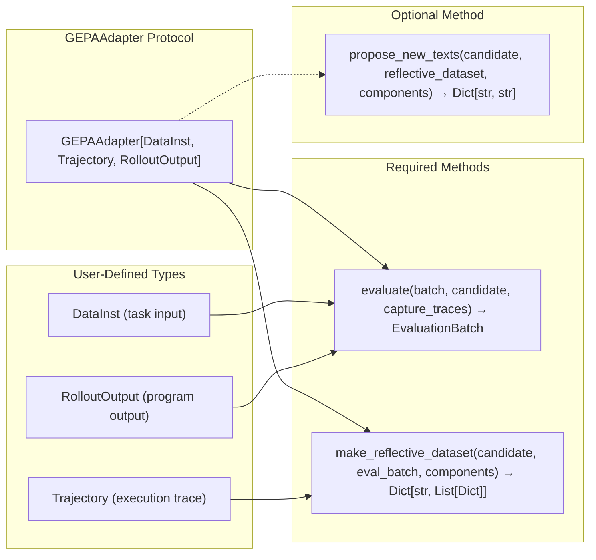
```mermaid
graph LR
    subgraph "User-Defined Types"
        DataInst["DataInst (task input)"]
        Trajectory["Trajectory (execution trace)"]
        RolloutOutput["RolloutOutput (program output)"]
    end
    
    subgraph "GEPAAdapter Protocol"
        Adapter["GEPAAdapter[DataInst, Trajectory, RolloutOutput]"]
    end
    
    subgraph "Required Methods"
        Evaluate["evaluate(batch, candidate, capture_traces) → EvaluationBatch"]
        Reflect["make_reflective_dataset(candidate, eval_batch, components) → Dict[str, List[Dict]]"]
    end
    
    subgraph "Optional Method"
        Propose["propose_new_texts(candidate, reflective_dataset, components) → Dict[str, str]"]
    end
    
    Adapter --> Evaluate
    Adapter --> Reflect
    Adapter -.-> Propose
    
    DataInst --> Evaluate
    Trajectory --> Reflect
    RolloutOutput --> Evaluate
```

**Sources**: [[src/gepa/core/adapter.py:58-181]]()

### Type Parameters

| Type Parameter | Purpose | Examples |
|----------------|---------|----------|
| `DataInst` | Input data format for a single evaluation example | `DefaultDataInst`, `DSPy.Example`, MCP task spec |
| `Trajectory` | Execution trace structure capturing intermediate states | `DefaultTrajectory`, `DSPyTrace`, ASI logs |
| `RolloutOutput` | Program output format | `DefaultRolloutOutput`, `DSPy.Prediction`, JSON results |

These types are opaque to GEPA — the engine never inspects them. They exist solely for your adapter to consume and produce. [[src/gepa/core/adapter.py:8-12]]()

**Sources**: [[src/gepa/core/adapter.py:8-12]]()

---

## The Three Adapter Responsibilities

### 1. Program Evaluation: `evaluate()`

```python
def evaluate(
    self,
    batch: list[DataInst],
    candidate: dict[str, str],
    capture_traces: bool = False,
) -> EvaluationBatch[Trajectory, RolloutOutput]
```

**Contract**: [[src/gepa/core/adapter.py:121-144]]()
- **Input**: A batch of task inputs (`DataInst`), a candidate program (dict mapping component names to text), and a flag indicating whether to capture execution traces.
- **Output**: `EvaluationBatch` with per-example outputs, scores, optional trajectories, and optional objective scores.
- **Semantics**: 
  - Scores are **higher-is-better** floats. [[src/gepa/core/adapter.py:104-107]]()
  - The engine uses `sum(scores)` for minibatch acceptance, `mean(scores)` for validation tracking.
  - When `capture_traces=True`, populate `trajectories` list (aligned with `outputs` and `scores`). [[src/gepa/core/adapter.py:134-137]]()
  - When `capture_traces=False`, set `trajectories=None` to save memory.

**Error Handling**: Never raise exceptions for individual example failures. Return a valid `EvaluationBatch` with failure scores (e.g., 0.0). Reserve exceptions for systemic failures (missing model, schema mismatch). [[src/gepa/core/adapter.py:112-118]]()

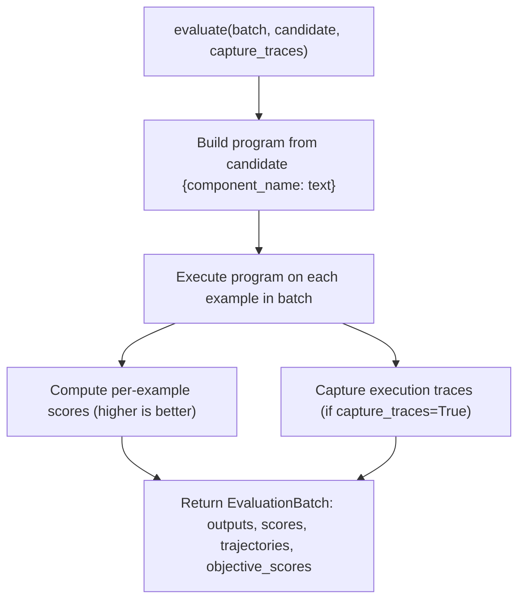
```mermaid
graph TD
    Input["evaluate(batch, candidate, capture_traces)"]
    
    Build["Build program from candidate {component_name: text}"]
    Execute["Execute program on each example in batch"]
    Score["Compute per-example scores (higher is better)"]
    Traces["Capture execution traces (if capture_traces=True)"]
    
    Output["Return EvaluationBatch: outputs, scores, trajectories, objective_scores"]
    
    Input --> Build
    Build --> Execute
    Execute --> Score
    Execute --> Traces
    Score --> Output
    Traces --> Output
```

**Sources**: [[src/gepa/core/adapter.py:106-144]]()

---

### 2. Reflective Dataset Construction: `make_reflective_dataset()`

```python
def make_reflective_dataset(
    self,
    candidate: dict[str, str],
    eval_batch: EvaluationBatch[Trajectory, RolloutOutput],
    components_to_update: list[str],
) -> Mapping[str, Sequence[Mapping[str, Any]]]
```

**Contract**: [[src/gepa/core/adapter.py:146-178]]()
- **Input**: The evaluated candidate, the `EvaluationBatch` from `evaluate(..., capture_traces=True)`, and a list of component names to update.
- **Output**: A dict mapping each component name to a list of JSON-serializable example dicts.
- **Semantics**: Extract high-signal feedback from trajectories to guide LLM reflection. Each example should contain inputs, outputs, and diagnostic feedback.

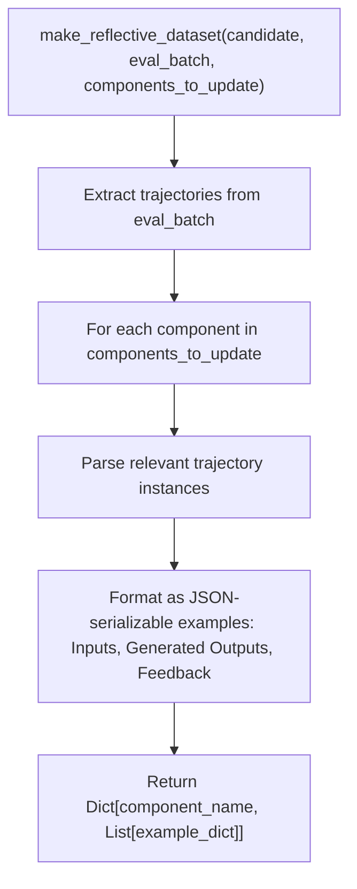
```mermaid
graph TD
    Input["make_reflective_dataset(candidate, eval_batch, components_to_update)"]
    
    Extract["Extract trajectories from eval_batch"]
    Filter["For each component in components_to_update"]
    Parse["Parse relevant trajectory instances"]
    Format["Format as JSON-serializable examples: Inputs, Generated Outputs, Feedback"]
    
    Output["Return Dict[component_name, List[example_dict]]"]
    
    Input --> Extract
    Extract --> Filter
    Filter --> Parse
    Parse --> Format
    Format --> Output
```

**Sources**: [[src/gepa/core/adapter.py:146-178]]()

---

### 3. Custom Instruction Proposal (Optional): `propose_new_texts()`

```python
propose_new_texts: ProposalFn | None = None
```

**Contract**: [[src/gepa/core/adapter.py:38-56]]()
- **Input**: Current candidate, reflective dataset (from `make_reflective_dataset()`), components to update.
- **Output**: Dict mapping component names to new proposed text.
- **Semantics**: Override GEPA's default LLM-based proposal to implement domain-specific logic. [[src/gepa/core/adapter.py:82-87]]()

**Default behavior**: If `propose_new_texts` is `None`, GEPA uses `InstructionProposalSignature` to generate new text via the reflection LLM. [[src/gepa/core/adapter.py:82-84]]()

**Sources**: [[src/gepa/core/adapter.py:37-56]](), [[src/gepa/core/adapter.py:180]]()

---

## EvaluationBatch Structure

The `EvaluationBatch` dataclass standardizes evaluation results across all adapters: [[src/gepa/core/adapter.py:15-36]]()

```python
@dataclass
class EvaluationBatch(Generic[Trajectory, RolloutOutput]):
    outputs: list[RolloutOutput]
    scores: list[float]
    trajectories: list[Trajectory] | None = None
    objective_scores: list[dict[str, float]] | None = None
    num_metric_calls: int | None = None
```

| Field | Type | Required | Purpose |
|-------|------|----------|---------|
| `outputs` | `list[RolloutOutput]` | Yes | Per-example program outputs. [[src/gepa/core/adapter.py:31]]() |
| `scores` | `list[float]` | Yes | Per-example numeric scores (higher is better). [[src/gepa/core/adapter.py:32]]() |
| `trajectories` | `list[Trajectory] \| None` | Conditional | Must be provided when `capture_traces=True`. [[src/gepa/core/adapter.py:33]]() |
| `objective_scores` | `list[dict[str, float]] \| None` | Optional | Multi-objective metrics for Pareto tracking. [[src/gepa/core/adapter.py:34]]() |

**Sources**: [[src/gepa/core/adapter.py:15-36]]()

---

## Built-in Adapters

GEPA provides several specialized adapters: [[src/gepa/adapters/README.md:7-12]]()

- **DefaultAdapter**: Integrates GEPA into single-turn LLM environments for system prompt optimization. [[src/gepa/adapters/README.md:9]]()
- **DSPyAdapter**: Integrates GEPA into DSPy to optimize signature instructions. [[src/gepa/adapters/README.md:8]]()
- **AnyMathsAdapter**: Integrates with litellm and ollama for mathematical problem solving. [[src/gepa/adapters/README.md:10]]()

**Sources**: [[src/gepa/adapters/README.md:1-13]]()

---

## Integration Example: AIME Prompt Optimization

The following diagram illustrates how `DefaultAdapter` bridges the Natural Language space of mathematical problem solving to the Code Entity space of the `GEPAEngine`.

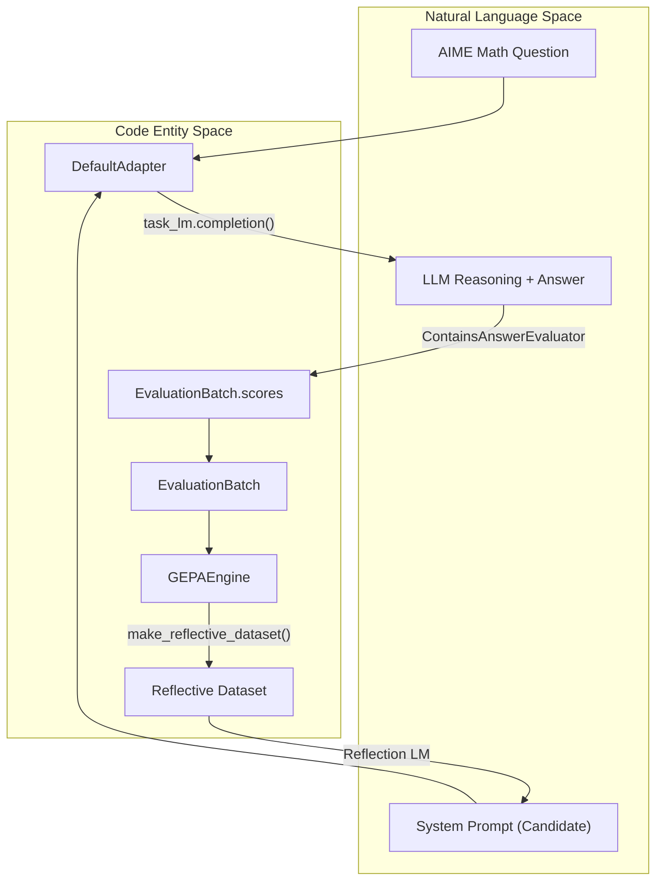
```mermaid
graph TD
    subgraph "Natural Language Space"
        Prob["AIME Math Question"]
        Prompt["System Prompt (Candidate)"]
        Resp["LLM Reasoning + Answer"]
    end

    subgraph "Code Entity Space"
        DA["DefaultAdapter"]
        GE["GEPAEngine"]
        EV["EvaluationBatch"]
        EB["EvaluationBatch.scores"]
        RD["Reflective Dataset"]
    end

    Prob --> DA
    Prompt --> DA
    DA -->|"task_lm.completion()"| Resp
    Resp -->|"ContainsAnswerEvaluator"| EB
    EB --> EV
    EV --> GE
    GE -->|"make_reflective_dataset()"| RD
    RD -->|"Reflection LM"| Prompt
```

**Sources**: [[tests/test_aime_prompt_optimization/test_aime_prompt_optimize.py:25-50]](), [[src/gepa/core/adapter.py:15-36]]()

---

## State Persistence

Adapters can optionally persist internal state across resume boundaries by implementing: [[src/gepa/core/adapter.py:88-101]]()

- `get_adapter_state() -> dict[str, Any]`: Snapshots adapter state into checkpoints.
- `set_adapter_state(state: dict[str, Any]) -> None`: Restores state upon resumption.

The `GEPAState` class manages the serialization of these snapshots using either standard `pickle` or `cloudpickle`. [[tests/test_state.py:89-116]]()

**Sources**: [[src/gepa/core/adapter.py:88-101]](), [[tests/test_state.py:89-116]]()
This page provides in-depth coverage of advanced features and optimization techniques within GEPA. It serves as a high-level map to specialized child pages that detail how to tune the engine, track costs, visualize candidate evolution, and handle complex multi-objective scenarios.

## 8.1 Experiment Tracking and Logging
GEPA integrates with standard experiment tracking frameworks to provide visibility into the optimization process. The `ExperimentTracker` class [src/gepa/logging/experiment_tracker.py:7-10]() handles communication with backends like **Weights & Biases (WandB)** and **MLflow**. It supports logging scalar metrics via `log_metrics()` [src/gepa/logging/experiment_tracker.py:236-258]() and structured data via `log_table()` [src/gepa/logging/experiment_tracker.py:260-291]().

For details, see [Experiment Tracking and Logging](#8.1).

Sources: [src/gepa/logging/experiment_tracker.py:7-291](), [src/gepa/logging/utils.py:11-131]()

## 8.2 Visualization
Understanding the lineage of candidates is crucial for debugging optimization runs. `GEPAResult` provides utilities to generate interactive HTML and DOT visualizations of the candidate tree via `candidate_tree_html()` [src/gepa/core/result.py:110-119]() and `candidate_tree_dot()` [src/gepa/core/result.py:99-108](). These tools help visualize the "family tree" of candidates, showing which mutations or merges led to performance breakthroughs.

For details, see [Visualization](#8.2).

Sources: [src/gepa/core/result.py:99-119]()

## 8.3 Batch Sampling Strategies
The `BatchSampler` protocol defines how data instances are selected from the training set during each iteration. Strategies like `EpochShuffledBatchSampler` ensure diverse data exposure. These samplers provide the `subsample_indices` [src/gepa/proposer/base.py:35]() used by proposers to gather feedback for reflection.

For details, see [Batch Sampling Strategies](#8.3).

Sources: [src/gepa/proposer/base.py:31-45]()

## 8.4 Component Selection Strategies
When a system has multiple optimizable text components (e.g., multiple prompts in a RAG pipeline), GEPA must decide which one to mutate. This is controlled by the `ReflectionComponentSelector` protocol [src/gepa/proposer/reflective_mutation/base.py:16-24](). Implementations allow for targeted mutation of specific modules based on performance or round-robin logic.

For details, see [Component Selection Strategies](#8.4).

Sources: [src/gepa/proposer/reflective_mutation/base.py:16-24]()

## 8.5 Dynamic Validation Sets
To balance evaluation speed and statistical significance, GEPA supports dynamic validation sets. The `BackfillValidationPolicy` allows the engine to evaluate candidates on a growing subset of the validation data, ensuring that promising candidates eventually receive full evaluation without wasting budget on poor ones.

For details, see [Dynamic Validation Sets](#8.5).

Sources: [src/gepa/logging/utils.py:20-28]()

## 8.6 Multi-Objective Optimization
GEPA natively supports optimizing for multiple competing objectives (e.g., accuracy vs. latency). It tracks an `objective_pareto_front` [src/gepa/core/result.py:49]() and `per_objective_best_candidates` [src/gepa/core/result.py:48](). This allows the engine to maintain a diverse set of candidates that excel in different dimensions.

For details, see [Multi-Objective Optimization](#8.6).

Sources: [src/gepa/core/result.py:41-50](), [src/gepa/logging/utils.py:112-131]()

## 8.7 Testing with LLM Mocking
Deterministic testing of stochastic LLM workflows is enabled via mocking utilities. This system supports a "record and replay" mode, allowing developers to verify engine logic without incurring API costs or dealing with non-deterministic model outputs by caching responses in structured files.

For details, see [Testing with LLM Mocking](#8.7).

Sources: [tests/test_experiment_tracking.py:129-143]()

## 8.8 Acceptance Criteria
Not every proposed candidate is worth keeping. The `CandidateProposal` [src/gepa/proposer/base.py:31-45]() structure carries the `eval_before` and `eval_after` data used by acceptance criteria to gate which candidates are added to the state. This prevents the engine from drifting into lower-performance regions of the search space.

For details, see [Acceptance Criteria](#8.8).

Sources: [src/gepa/proposer/base.py:31-45]()

## 8.9 Cost Tracking
Optimization can be expensive. GEPA provides built-in cost tracking to monitor resource usage during the reflection and evaluation phases. This is reflected in `total_metric_calls` [src/gepa/core/result.py:55]() and can be used with stoppers like `MaxReflectionCostStopper` to set hard USD budgets.

For details, see [Cost Tracking](#8.9).

Sources: [src/gepa/core/result.py:54-59](), [src/gepa/logging/utils.py:81]()

## System Integration Mapping

The following diagrams illustrate how advanced system components bridge the gap between high-level optimization concepts and the underlying code entities.

### Optimization Control Bridge
This diagram shows how user-facing configuration and strategies map to the internal `GEPAState` and the logging infrastructure.

```mermaid
graph LR
    subgraph "Natural Language / User Space"
        "Optimization Progress"
        "Mutation Selection"
        "Metric Tracking"
        "Candidate Acceptance"
    end

    subgraph "Code Entity Space"
        "Optimization Progress" --> GS["GEPAState"]
        "Mutation Selection" --> RCS["ReflectionComponentSelector"]
        "Metric Tracking" --> ET["ExperimentTracker"]
        "Candidate Acceptance" --> CP["CandidateProposal"]
        
        GS --> ET
        RCS --> RM["ReflectiveMutationProposer"]
        CP --> RM
        RM --> GS
    end
```
Sources: [src/gepa/core/state.py:7-12](), [src/gepa/logging/experiment_tracker.py:7-35](), [src/gepa/proposer/reflective_mutation/base.py:16-24](), [src/gepa/proposer/base.py:31-45]()

### Data and Evaluation Flow
This diagram maps the flow of data from raw inputs to the persistent results, highlighting the roles of the `Signature` and `GEPAResult`.

```mermaid
graph TD
    subgraph "Natural Language / Data Space"
        "Input Prompts"
        "LLM Responses"
        "Evaluation Scores"
        "Final Artifacts"
    end

    subgraph "Code Entity Space"
        "Input Prompts" --> SIG["Signature"]
        "LLM Responses" --> LM["LanguageModel"]
        "Evaluation Scores" --> SE["SubsampleEvaluation"]
        "Final Artifacts" --> RES["GEPAResult"]
        
        SIG --> LM
        LM --> SE
        SE --> RES
        RES --> HTML["candidate_tree_html"]
    end
```
Sources: [src/gepa/proposer/reflective_mutation/base.py:27-65](), [src/gepa/proposer/base.py:12-28](), [src/gepa/core/result.py:16-120]()
## Purpose and Scope

This page explains the fundamental data structures that GEPA optimizes: **candidates** and their constituent **text components**. These concepts form the core representation of any system being optimized by GEPA, whether it's a simple prompt, a multi-stage RAG pipeline, or a complex agentic system.

For information about how candidates are evaluated and scored, see [Adapters and System Integration](). For details on how GEPA tracks and persists candidate history, see [State Management and Persistence]().

---

## What is a Candidate?

A **candidate** is a concrete configuration of a system, represented as a dictionary mapping component names to text values:

```python
candidate: dict[str, str]
```

Each candidate represents a complete instantiation of the system being optimized. When GEPA evaluates a candidate, it passes this dictionary to the adapter, which uses the text values to configure the actual system components.

**Example - Simple prompt optimization:**
```python
seed_candidate = {
    "instruction": "Solve the following math problem step by step."
}
```

**Example - Multi-component RAG system:**
```python
seed_candidate = {
    "query_rewriter": "Rewrite the user query to be more specific...",
    "context_synthesis": "Synthesize the following passages into a coherent summary...",
    "answer_generator": "Based on the context, provide a detailed answer..."
}
```

**Example - DSPy program with multiple predictors:**
```python
seed_candidate = {
    "generate_query": "signature and docstring for query generation",
    "answer_question": "signature and docstring for answer generation"
}
```

Sources: [src/gepa/core/state.py:157](), [src/gepa/proposer/merge.py:9](), [src/gepa/core/result.py:41]()

---

## Text Components

**Text components** are the named parts of a system that GEPA optimizes. Each key in a candidate dictionary represents a text component, and its value is the text that configures that component.

### Component Naming

Component names (dictionary keys) identify which part of the system the text belongs to. The naming convention depends on the system being optimized:

| System Type | Example Component Names | What They Represent |
|------------|------------------------|---------------------|
| Single-turn LLM | `"instruction"`, `"prompt"` | The main prompt text |
| RAG System | `"query_rewriter"`, `"context_synthesis"`, `"answer_generator"` | Different stages of the pipeline |
| DSPy Program | `"generate_query"`, `"answer_question"` | Individual DSPy predictors/modules |
| Agent System | `"system_prompt"`, `"tool_use_instructions"` | System configuration and behavior rules |

The adapter implementation determines which component names are valid and how they map to the actual system. GEPA treats component names as opaque strings and relies on the adapter to interpret them.

Sources: [src/gepa/core/state.py:169](), [src/gepa/proposer/merge.py:159-162]()

### Component Values

Component values (dictionary values) contain the actual text that configures the system. These can be:

- **Prompts or instructions**: Natural language text guiding LLM behavior.
- **Signatures**: DSPy-style input/output specifications.
- **Templates**: Structured text with placeholders.
- **Code snippets**: For systems that optimize code.
- **Configuration strings**: Any text-based system parameter.

GEPA evolves these text values through reflection and mutation to improve system performance.

Sources: [src/gepa/core/state.py:157](), [src/gepa/proposer/reflective_mutation/base.py:23]()

---

## The Seed Candidate

Every GEPA optimization begins with a **seed candidate** - the initial configuration from which all evolution starts. The seed candidate is evaluated on the validation set at initialization and becomes program index 0 in the state's candidate pool.

**Index 0 is always the seed candidate** - initialized in `GEPAState.__init__` at [src/gepa/core/state.py:195-199]().

Sources: [src/gepa/core/state.py:195-199](), [src/gepa/core/result.py:61-62]()

---

## Candidate Representation in State

### Storage Structure

Candidates are stored as parallel arrays in `GEPAState`, where each index across all arrays represents the same candidate:

**Parallel Array Storage in GEPAState**

```mermaid
graph TB
    subgraph GEPAState["GEPAState (src/gepa/core/state.py)"]
        PC["program_candidates<br/>list[dict[str, str]]"]
        PPG["parent_program_for_candidate<br/>list[list[ProgramIdx | None]]"]
        PCVS["prog_candidate_val_subscores<br/>list[dict[DataId, float]]"]
        PCOS["prog_candidate_objective_scores<br/>list[ObjectiveScores]"]
    end
    
    PC --> PC0["Idx 0: {'instruction': 'Solve step by step'}"]
    PC --> PC1["Idx 1: {'instruction': 'First identify...'}"]
    PC --> PC2["Idx 2: {'instruction': 'Break down...'}"]
    
    PPG --> PPG0["Idx 0: [None]"]
    PPG --> PPG1["Idx 1: [0]"]
    PPG --> PPG2["Idx 2: [0, 1]"]
    
    PCVS --> PCVS0["Idx 0: {5: 0.8, 7: 0.6}"]
    PCVS --> PCVS1["Idx 1: {5: 0.9, 7: 0.7}"]
    
    PCOS --> PCOS0["Idx 0: {'accuracy': 0.72}"]
```

**Parallel Array Fields** (from [src/gepa/core/state.py:157-160]()):

| Field | Type | Content |
|-------|------|---------|
| `program_candidates` | `list[dict[str, str]]` | The candidate dictionaries themselves |
| `parent_program_for_candidate` | `list[list[ProgramIdx \| None]]` | Parent indices (None for seed) |
| `prog_candidate_val_subscores` | `list[dict[DataId, float]]` | Sparse validation scores per example |
| `prog_candidate_objective_scores` | `list[ObjectiveScores]` | Aggregated scores per objective |

Each candidate has a unique **program index** (`ProgramIdx`, defined at [src/gepa/core/state.py:18]()) that serves as its identifier throughout optimization. The index is immutable - candidate 0 is always the seed, candidate 1 is always the first evolved program, etc.

Sources: [src/gepa/core/state.py:157-160](), [src/gepa/core/state.py:18](), [src/gepa/core/state.py:195-206]()

### Component List Tracking

The `list_of_named_predictors` field (at [src/gepa/core/state.py:169]()) maintains the canonical list of component names:

```python
self.list_of_named_predictors = list(seed_candidate.keys())
```

This ensures consistent component tracking across all candidates. When a new candidate is created, it must contain the same component names (though values may differ).

Sources: [src/gepa/core/state.py:169](), [src/gepa/proposer/merge.py:159-162]()

---

## Candidate Immutability and Copying

Candidates follow an immutability pattern - they are never modified in place. When proposing a new candidate, GEPA creates copies:

**Merge Proposer** ([src/gepa/proposer/merge.py:155]()):
```python
new_program: Candidate = deepcopy(program_candidates[ancestor])
The `ConfidenceAdapter` is a specialized adapter for **classification tasks** that leverages token-level log-probabilities (logprobs) to provide a continuous scoring signal and rich diagnostic feedback. Unlike standard adapters that use binary (correct/incorrect) metrics, the `ConfidenceAdapter` detects "lucky guesses" and penalizes low-confidence correct answers, while providing the reflection LLM with specific details about model uncertainty and competing alternatives [src/gepa/adapters/confidence_adapter/confidence_adapter.py:4-12]().

## Overview and Purpose

In classification, binary scoring (1.0 for correct, 0.0 for wrong) creates several optimization bottlenecks:
1. **Lucky Guesses**: A model that is 51% sure of the correct answer receives the same reward as one that is 99% sure, even though the former is unstable [docs/docs/blog/posts/2026-03-17-confidence-adapter-benchmark/index.md:24-25]().
2. **Generic Feedback**: High-conviction errors (99% sure of the wrong answer) require different prompt interventions than uncertain errors (near 50/50 split) [docs/docs/blog/posts/2026-03-17-confidence-adapter-benchmark/index.md:26-28]().
3. **Vanishing Gradient**: The optimizer cannot distinguish between "almost right" and "completely wrong" without a continuous signal [docs/docs/blog/posts/2026-03-17-confidence-adapter-benchmark/index.md:28-29]().

The `ConfidenceAdapter` addresses these by extracting the **joint logprob** (sum of per-token logprobs) for the classification field, mapping it to a `[0, 1]` score via a `ScoringStrategy`, and generating tiered feedback for the reflection loop [src/gepa/adapters/confidence_adapter/scoring.py:14-29]().

### Data Flow and System Architecture

The following diagram illustrates how the `ConfidenceAdapter` interacts with the LLM and the GEPA engine.

**ConfidenceAdapter Logic Flow**
```mermaid
graph TD
    subgraph "Natural Language Space"
        A["Input Text (ConfidenceDataInst)"] --> B["LLM with logprobs=True"]
        B --> C["Structured JSON Output"]
    end

    subgraph "Code Entity Space"
        C --> D["ConfidenceAdapter.evaluate()"]
        D --> E["llm-structured-confidence (Library)"]
        E --> F["joint_logprob (float)"]
        F --> G["ScoringStrategy.score()"]
        G --> H["Blended Score [0, 1]"]
        D --> I["_build_feedback()"]
        I --> J["ConfidenceTrajectory"]
    end

    H --> K["GEPAEngine (Optimization)"]
    J --> L["ReflectiveMutationProposer"]
```
Sources: [src/gepa/adapters/confidence_adapter/confidence_adapter.py:22-24](), [src/gepa/adapters/confidence_adapter/confidence_adapter.py:35-51](), [src/gepa/adapters/confidence_adapter/scoring.py:52-62]()

## Implementation Details

### Data Structures

The adapter uses specific TypedDicts to manage the classification data and the resulting execution traces.

*   **`ConfidenceDataInst`**: Defines the input format, requiring an `input` string and an `answer` that must match one of the `enum` values in the JSON schema [src/gepa/adapters/confidence_adapter/confidence_adapter.py:35-51]().
*   **`ConfidenceTrajectory`**: Captures the full state of an evaluation, including the `parsed_value`, the `logprob_score`, and the generated `feedback` string [src/gepa/adapters/confidence_adapter/confidence_adapter.py:53-87]().

### Scoring Strategies

Scoring strategies implement the `ScoringStrategy` protocol, which maps `(is_correct, logprob_score)` to a float [src/gepa/adapters/confidence_adapter/scoring.py:52-75]().

| Strategy | Logic | Use Case |
| :--- | :--- | :--- |
| `LinearBlendScoring` | Penalizes correct answers below a `low_confidence_threshold` linearly [src/gepa/adapters/confidence_adapter/scoring.py:86-109](). | **Default**. Best for most classification tasks. |
| `ThresholdScoring` | Binary gate: 1.0 only if correct AND probability > threshold [src/gepa/adapters/confidence_adapter/scoring.py:138-150](). | Strict requirements where uncertainty is unacceptable. |
| `SigmoidScoring` | Smooth S-curve mapping probability to `[0, 1]` [src/gepa/adapters/confidence_adapter/scoring.py:169-187](). | Tasks requiring a differentiable-like signal for small changes. |

### Reflective Feedback Generation

The `_build_feedback` function generates human-readable instructions for the reflection LLM based on thresholds [src/gepa/adapters/confidence_adapter/confidence_adapter.py:151-178]():

*   **Correct + Confident**: Returns `"Correct."` to avoid distracting the optimizer [src/gepa/adapters/confidence_adapter/confidence_adapter.py:183-184]().
*   **Correct but Uncertain**: Flags the prediction as a "lucky guess" and lists top alternatives [src/gepa/adapters/confidence_adapter/confidence_adapter.py:185-194]().
*   **Incorrect (High Conviction)**: Uses strong language (e.g., "The model has no doubt about its wrong answer") to prompt major prompt revisions [src/gepa/adapters/confidence_adapter/confidence_adapter.py:203-209]().

## Component Interaction

The following diagram maps the internal functions and classes involved in the evaluation process.

**ConfidenceAdapter Class Relationships**
```mermaid
classDiagram
    class GEPAAdapter {
        <<interface>>
        evaluate()
        make_reflective_dataset()
    }
    class ConfidenceAdapter {
        +field_path: str
        +scoring_strategy: ScoringStrategy
        +evaluate(batch)
        -_build_feedback()
    }
    class ScoringStrategy {
        <<interface>>
        +score(is_correct, logprob)
    }
    class LinearBlendScoring {
        +low_confidence_threshold: float
        +score()
    }
    
    GEPAAdapter <|-- ConfidenceAdapter
    ConfidenceAdapter --> ScoringStrategy : uses
    ScoringStrategy <|-- LinearBlendScoring
    ConfidenceAdapter ..> ConfidenceTrajectory : produces
```
Sources: [src/gepa/adapters/confidence_adapter/confidence_adapter.py:23-24](), [src/gepa/adapters/confidence_adapter/confidence_adapter.py:63-120](), [src/gepa/adapters/confidence_adapter/scoring.py:52-62]()

## Usage Example

To use the `ConfidenceAdapter`, the target model must support `logprobs=True` and the `response_format` should be a JSON schema with `enum` constraints [docs/docs/guides/confidence-adapter.md:52-56]().

```python
from gepa.adapters.confidence_adapter import ConfidenceAdapter
from gepa.adapters.confidence_adapter.scoring import LinearBlendScoring

adapter = ConfidenceAdapter(
    model="openai/gpt-4o-mini",
    field_path="label",
    response_format={
        "type": "json_schema",
        "json_schema": {
            "name": "cls",
            "schema": {
                "type": "object",
                "properties": {"label": {"type": "string", "enum": ["A", "B"]}},
                "required": ["label"]
            }
        }
    },
    scoring_strategy=LinearBlendScoring(low_confidence_threshold=0.90)
)
```
Sources: [docs/docs/guides/confidence-adapter.md:63-90](), [src/gepa/adapters/confidence_adapter/confidence_adapter.py:107-121]()

## Benchmark Results

In comparative benchmarks, the `ConfidenceAdapter` consistently outperformed the `DefaultAdapter` (binary scoring) on multiclass tasks [examples/confidence_adapter/README.md:38-44]().

| Dataset | DefaultAdapter Accuracy | ConfidenceAdapter Accuracy | Improvement |
| :--- | :--- | :--- | :--- |
| **AG News** | 85.80% | **87.90%** | **+2.10pp** |
| **Emotion** | 58.42% | **60.22%** | **+1.80pp** |
| **Rotten Tomatoes**| 93.15% | 93.15% | 0.00pp |

The gains are most pronounced in multiclass scenarios where subtle differences between categories (e.g., "Business" vs "Sci/Tech") benefit from the granular logprob signal [docs/docs/blog/posts/2026-03-17-confidence-adapter-benchmark/index.md:14-15]().

Sources: [examples/confidence_adapter/README.md:38-44](), [docs/docs/blog/posts/2026-03-17-confidence-adapter-benchmark/index.md:14-15]()

# Creating Custom Adapters


This page provides a practical guide for implementing custom adapters to integrate GEPA with your own systems. An adapter translates between your domain-specific data structures and GEPA's optimization engine, enabling GEPA to optimize arbitrary text-based systems—from LLM agents to code generators to configuration files.

For the adapter protocol specification, see [GEPAAdapter Interface](#5.1). For examples of concrete implementations, see [DefaultAdapter](#5.2), [DSPy Full Program Evolution](#5.5), and [OptimizeAnythingAdapter](#5.3).

**Sources:** [src/gepa/core/adapter.py:1-181]()

---

## Adapter Architecture Overview

The adapter layer sits between the GEPA optimization engine and your system under optimization. It provides three responsibilities: program construction and evaluation, reflective dataset creation, and optionally custom proposal logic.

### System-to-Code Mapping

The following diagram bridges the conceptual optimization flow with the specific classes and methods defined in the codebase.

Title: Adapter Integration Architecture
```mermaid
graph TB
    subgraph "GEPA Engine (Natural Language Space)"
        ENGINE["GEPAEngine<br/>Orchestrates optimization loop"]
    end
    
    subgraph "Adapter Layer (Code Entity Space)"
        PROTOCOL["GEPAAdapter[DataInst, Trajectory, RolloutOutput]<br/>src/gepa/core/adapter.py:59-181"]
        EVAL["evaluate()<br/>src/gepa/core/adapter.py:121-144"]
        REFLECT["make_reflective_dataset()<br/>src/gepa/core/adapter.py:146-178"]
        PROPOSE["propose_new_texts (optional)<br/>src/gepa/core/adapter.py:180-181"]
    end
    
    subgraph "User Implementation"
        PROGRAM["Your Program<br/>(LLM agent, DSPy module, etc.)"]
        DATA["DataInst<br/>src/gepa/core/adapter.py:11"]
        BATCH["EvaluationBatch<br/>src/gepa/core/adapter.py:15-35"]
    end
    
    ENGINE -->|"Calls with candidate"| EVAL
    EVAL -->|"Instantiate"| PROGRAM
    PROGRAM -->|"Execute on"| DATA
    DATA -->|"Evaluate"| BATCH
    BATCH -->|"Return scores + trajectories"| ENGINE
    
    ENGINE -->|"Request feedback"| REFLECT
    REFLECT -->|"Transform trajectories"| ENGINE
    
    ENGINE -->|"Optional: custom proposal"| PROPOSE
```

**Sources:** [src/gepa/core/adapter.py:58-104](), [src/gepa/core/adapter.py:121-181]()

---

## The GEPAAdapter Protocol

The `GEPAAdapter` protocol defines the contract your adapter must implement. It uses three generic type parameters to maintain type safety while remaining domain-agnostic.

Title: GEPAAdapter Protocol Components
```mermaid
graph LR
    subgraph "Type Parameters (Generic)"
        DATAINST["DataInst<br/>src/gepa/core/adapter.py:11"]
        TRAJECTORY["Trajectory<br/>src/gepa/core/adapter.py:10"]
        ROLLOUT["RolloutOutput<br/>src/gepa/core/adapter.py:9"]
    end
    
    subgraph "Required Methods"
        EVAL_METHOD["evaluate(batch, candidate, capture_traces)<br/>→ EvaluationBatch"]
        REFLECT_METHOD["make_reflective_dataset(candidate, eval_batch, components)<br/>→ Mapping"]
    end
    
    subgraph "Optional Attributes"
        PROPOSE_ATTR["propose_new_texts: ProposalFn<br/>src/gepa/core/adapter.py:38-56"]
    end
    
    DATAINST -.->|"Used in"| EVAL_METHOD
    TRAJECTORY -.->|"Returned in"| EVAL_METHOD
    ROLLOUT -.->|"Returned in"| EVAL_METHOD
    TRAJECTORY -.->|"Consumed by"| REFLECT_METHOD
```

| Component | Type | Purpose |
|-----------|------|---------|
| `DataInst` | Type parameter | Your domain's input data structure (e.g., question, task, test case) [src/gepa/core/adapter.py:11-11]() |
| `Trajectory` | Type parameter | Execution trace capturing intermediate states for reflection [src/gepa/core/adapter.py:10-10]() |
| `RolloutOutput` | Type parameter | Program output (opaque to GEPA, forwarded to your logging) [src/gepa/core/adapter.py:9-9]() |
| `evaluate()` | Required method | Execute candidate on batch, return scores and optionally traces [src/gepa/core/adapter.py:121-144]() |
| `make_reflective_dataset()` | Required method | Transform traces into LLM-readable feedback examples [src/gepa/core/adapter.py:146-178]() |
| `propose_new_texts` | Optional attribute | Override default LLM-based proposal with custom logic [src/gepa/core/adapter.py:180-181]() |

**Sources:** [src/gepa/core/adapter.py:8-181]()

---

## Implementing evaluate()

The `evaluate()` method is the core of your adapter. It receives a candidate (text components) and a batch of data, executes your program, and returns scores.

### Method Signature [src/gepa/core/adapter.py:121-126]()

```python
def evaluate(
    self,
    batch: list[DataInst],
    candidate: dict[str, str],
    capture_traces: bool = False,
) -> EvaluationBatch[Trajectory, RolloutOutput]:
    ...
```

### Parameters [src/gepa/core/adapter.py:130-138]()

| Parameter | Type | Description |
|-----------|------|-------------|
| `batch` | `list[DataInst]` | Input data to evaluate on (size determined by minibatch config) |
| `candidate` | `dict[str, str]` | Mapping from component name → component text (e.g., `{"system_prompt": "You are..."}`) |
| `capture_traces` | `bool` | If `True`, populate trajectories in return value; if `False`, return `None` for trajectories |

### Return Value: EvaluationBatch [src/gepa/core/adapter.py:15-36]()

```python
@dataclass
class EvaluationBatch(Generic[Trajectory, RolloutOutput]):
    outputs: list[RolloutOutput]          # Per-example outputs (opaque to GEPA)
    scores: list[float]                   # Per-example scores (higher = better)
    trajectories: list[Trajectory] | None # Per-example traces (only if capture_traces=True)
    objective_scores: list[dict[str, float]] | None  # Optional multi-objective metrics
```

**Constraints:**
- `len(outputs) == len(scores) == len(batch)` [src/gepa/core/adapter.py:31-33]()
- If `capture_traces=True`: `trajectories` must be provided and align one-to-one [src/gepa/core/adapter.py:24-26]()
- Scores: higher is better, sum over minibatch for acceptance, average over valset for tracking [src/gepa/core/adapter.py:103-107]()
- Never raise for individual example failures—return failure scores (e.g., 0.0) instead [src/gepa/core/adapter.py:112-117]()

**Sources:** [src/gepa/core/adapter.py:15-36](), [src/gepa/core/adapter.py:103-144]()

---

## Implementing make_reflective_dataset()

The `make_reflective_dataset()` method transforms execution traces into a structured dataset that the reflection LLM uses to propose improvements.

### Method Signature [src/gepa/core/adapter.py:146-151]()

```python
def make_reflective_dataset(
    self,
    candidate: dict[str, str],
    eval_batch: EvaluationBatch[Trajectory, RolloutOutput],
    components_to_update: list[str],
) -> Mapping[str, Sequence[Mapping[str, Any]]]:
    ...
```

### Parameters [src/gepa/core/adapter.py:153-158]()

| Parameter | Type | Description |
|-----------|------|-------------|
| `candidate` | `dict[str, str]` | The candidate that was evaluated |
| `eval_batch` | `EvaluationBatch` | Result from `evaluate(..., capture_traces=True)` with trajectories populated |
| `components_to_update` | `list[str]` | Subset of component names to generate feedback for |

### Return Value [src/gepa/core/adapter.py:161-163]()

A dictionary mapping each component name to a list of feedback examples. Each example is a JSON-serializable dict.

**Recommended schema:**
```python
ReflectiveExample = {
    "Inputs": dict[str, Any] | str,      # Clean view of inputs to the component
    "Generated Outputs": dict[str, Any] | str,  # Component's outputs
    "Feedback": str,                     # Diagnostic feedback (errors, corrections, etc.)
}
```

**Sources:** [src/gepa/core/adapter.py:146-178]()

---

## Optional: Custom Proposal Logic

By default, GEPA uses internal signatures to propose new component texts. You can override this by setting the `propose_new_texts` attribute or implementing the method in your class.

### ProposalFn Protocol [src/gepa/core/adapter.py:38-56]()

```python
class ProposalFn(Protocol):
    def __call__(
        self,
        candidate: dict[str, str],
        reflective_dataset: Mapping[str, Sequence[Mapping[str, Any]]],
        components_to_update: list[str],
    ) -> dict[str, str]:
        """Return mapping from component name → new component text."""
        ...
```

**Sources:** [src/gepa/core/adapter.py:38-56]()

---

## State Persistence

Adapters that need to persist state (e.g., dynamic validation sets or frequency counters) across checkpoint boundaries can implement optional methods [src/gepa/core/adapter.py:88-101]().

| Method | Purpose |
|--------|---------|
| `get_adapter_state() -> dict[str, Any]` | Return a fresh dict of state to be snapshotted [src/gepa/core/adapter.py:92-95]() |
| `set_adapter_state(state: dict[str, Any]) -> None` | Restore state from a checkpoint [src/gepa/core/adapter.py:96-97]() |

**Sources:** [src/gepa/core/adapter.py:88-101]()

---

## Best Practices and Pitfalls

### Rich Feedback
The more informative your feedback, the better GEPA can optimize. Include the score, expected versus actual output, and specific error analysis (e.g., "Issue: Response too verbose") [docs/docs/guides/adapters.md:173-191]().

### Error Handling
Never raise for individual example failures—return failure scores (e.g., 0.0) and populate trajectories with error info [src/gepa/core/adapter.py:112-117]().

### Multi-Objective Optimization
Support multiple objectives by returning `objective_scores` in the `EvaluationBatch`. This allows GEPA to track and optimize for competing metrics like accuracy, latency, and cost [docs/docs/guides/adapters.md:221-236]().

### Trajectory Memory
Keep `Trajectory` objects minimal. Large traces can bloat the system state and slow down serialization [docs/docs/guides/adapters.md:7-8]().

**Sources:** [src/gepa/core/adapter.py:112-117](), [docs/docs/guides/adapters.md:173-236]()
This document describes GEPA's hierarchical configuration system, which controls optimization behavior, proposal strategies, tracking, and stopping conditions. GEPA offers two configuration approaches: **flat parameters** for the `gepa.optimize()` API and **hierarchical configs** for the `optimize_anything()` API.

For information about:
- Stop conditions specifically, see [Stopping Conditions](3.5)
- Data loading and evaluation policies, see [Data Loading and Evaluation Policies](3.6)
- Callback configuration, see [Callback System](4.4.3)

## Two Configuration Approaches

GEPA provides two APIs with different configuration styles:

| API | Configuration Style | Use Case |
|-----|---------------------|----------|
| `gepa.optimize()` | Flat parameters (80+ keyword arguments) | Simple DSPy/prompt optimization tasks |
| `optimize_anything()` | Hierarchical `GEPAConfig` object | Complex systems, code optimization, better IDE autocomplete |

Both APIs provide identical capabilities — the hierarchical approach simply groups related parameters into typed dataclasses for clarity in complex scenarios.

**Sources:** [src/gepa/api.py:43-96](), [src/gepa/optimize_anything.py:124-159]()

---

## Configuration Hierarchy

The `GEPAConfig` object used by `optimize_anything` is composed of several specialized configuration blocks.

```mermaid
graph TB
    GEPA_CFG["GEPAConfig"]
    
    subgraph "Engine Control"
        ENG["EngineConfig
        • run_dir
        • seed
        • max_metric_calls
        • max_candidate_proposals
        • parallel
        • max_workers
        • cache_evaluation
        • capture_stdio
        • track_best_outputs"]
    end
    
    subgraph "Proposal Strategy"
        REFL["ReflectionConfig
        • reflection_lm
        • reflection_prompt_template
        • reflection_minibatch_size
        • batch_sampler
        • module_selector
        • skip_perfect_score
        • custom_candidate_proposer"]
    end
    
    subgraph "Experiment Logging"
        TRACK["TrackingConfig
        • logger
        • use_wandb
        • wandb_init_kwargs
        • use_mlflow
        • mlflow_tracking_uri"]
    end
    
    subgraph "Optional Features"
        MERGE["MergeConfig
        • max_merge_invocations
        • merge_val_overlap_floor"]
        
        REFINER["RefinerConfig
        • refiner_lm
        • max_refinements"]
    end
    
    GEPA_CFG --> ENG
    GEPA_CFG --> REFL
    GEPA_CFG --> TRACK
    GEPA_CFG --> MERGE
    GEPA_CFG --> REFINER
```

**Title:** GEPAConfig Composition Hierarchy

**Sources:** [src/gepa/optimize_anything.py:208-320]()

---

## EngineConfig — Optimization Loop Control

`EngineConfig` controls the core optimization loop behavior, state persistence, and computational resources.

### Parameters

| Parameter | Type | Default | Description |
|-----------|------|---------|-------------|
| `run_dir` | `str \| None` | `None` | Directory for state persistence. If exists, resumes from saved state [src/gepa/core/engine.py:88-89](). |
| `seed` | `int` | `0` | Random seed for reproducibility [src/gepa/api.py:91](). |
| `max_metric_calls` | `int \| None` | `None` | Budget limit (number of evaluator calls). Creates `MaxMetricCallsStopper` [src/gepa/utils/stop_condition.py:168-173](). |
| `max_candidate_proposals` | `int \| None` | `None` | Maximum number of candidates to propose [src/gepa/utils/stop_condition.py:202-207](). |
| `stop_callbacks` | `StopperProtocol \| list` | `None` | Custom stopping conditions [src/gepa/api.py:71](). |
| `parallel` | `bool` | `False` | Enable parallel evaluation [src/gepa/core/engine.py:129](). |
| `cache_evaluation` | `bool` | `False` | Enable `EvaluationCache` to memoize (candidate, example) pairs [src/gepa/core/state.py:46-49](). |
| `capture_stdio` | `bool` | `False` | Redirect stdout/stderr during evaluation [src/gepa/optimize_anything.py:228](). |
| `track_best_outputs` | `bool` | `True` | Store best outputs per validation example [src/gepa/api.py:85](). |
| `use_cloudpickle` | `bool` | `False` | Use `cloudpickle` for state serialization [src/gepa/api.py:87](). |

### State Persistence

When `run_dir` is set:
- **State saved**: `GEPAState` tracks all explored candidates, scores, and Pareto frontiers [src/gepa/core/state.py:142-151]().
- **Resume logic**: The engine snapshots adapter state into `GEPAState` before saving [src/gepa/core/engine.py:135-144]().
- **Evaluation Cache**: Stored in state and used to avoid redundant calls to the metric [src/gepa/core/state.py:94-130]().

**Sources:** [src/gepa/core/engine.py:54-134](), [src/gepa/core/state.py:142-180](), [src/gepa/optimize_anything.py:208-239]()

---

## ReflectionConfig — Proposal Strategy

`ReflectionConfig` controls the `ReflectiveMutationProposer`, which uses an LLM to analyze execution traces and propose improved candidates.

### Parameters

| Parameter | Type | Default | Description |
|-----------|------|---------|-------------|
| `reflection_lm` | `LanguageModel \| str \| None` | **Required** | LLM for reflection. String model ID or `LM` instance [src/gepa/lm.py:30-50](). |
| `reflection_prompt_template` | `str \| dict[str, str] \| None` | Default | Custom prompt for reflection. Can be per-component [src/gepa/proposer/reflective_mutation/reflective_mutation.py:104-112](). |
| `reflection_minibatch_size` | `int \| None` | `3` | Number of examples per reflection step [src/gepa/api.py:58](). |
| `batch_sampler` | `BatchSampler \| "epoch_shuffled"` | `"epoch_shuffled"` | Training batch sampling strategy [src/gepa/strategies/batch_sampler.py:28-29](). |
| `module_selector` | `ReflectionComponentSelector \| str` | `"round_robin"` | Component selection strategy [src/gepa/strategies/component_selector.py:35-38](). |
| `skip_perfect_score` | `bool` | `True` | Skip proposal if current candidate achieves `perfect_score` [src/gepa/proposer/reflective_mutation/reflective_mutation.py:114-118](). |

### Reflection Prompt Template

The reflection process uses `InstructionProposalSignature` to render prompts. Custom templates must include `<curr_param>` and `<side_info>` placeholders, which are validated at initialization [src/gepa/proposer/reflective_mutation/reflective_mutation.py:110-112]().

**Sources:** [src/gepa/proposer/reflective_mutation/reflective_mutation.py:74-118](), [src/gepa/optimize_anything.py:241-283](), [src/gepa/lm.py:30-131]()

---

## TrackingConfig — Experiment Logging

`TrackingConfig` controls integration with experiment tracking platforms like Weights & Biases or MLflow.

### Parameters

| Parameter | Type | Default | Description |
|-----------|------|---------|-------------|
| `logger` | `LoggerProtocol \| None` | `StdOutLogger` | Logger instance for console/file output [src/gepa/logging/logger.py:23-25](). |
| `use_wandb` | `bool` | `False` | Enable Weights & Biases integration [src/gepa/api.py:76](). |
| `wandb_init_kwargs` | `dict \| None` | `None` | Kwargs for `wandb.init()` [src/gepa/api.py:78](). |
| `use_mlflow` | `bool` | `False` | Enable MLflow integration [src/gepa/api.py:80](). |

### LM Cost Tracking

GEPA tracks the cumulative cost and token usage of the reflection LLM.
- **LM Class**: Automatically tracks USD cost via LiteLLM [src/gepa/lm.py:73-86](). It uses `litellm.completion_cost` to calculate expenses for both single and batch completions [src/gepa/lm.py:115-120](), [src/gepa/lm.py:167-170]().
- **TrackingLM**: Estimates tokens for plain callables by assuming ~4 characters per token (reports $0 cost) [src/gepa/lm.py:190-200]().
- **MaxReflectionCostStopper**: A `StopperProtocol` implementation that monitors the `total_cost` attribute of the reflection LM and stops optimization once a USD budget is reached [src/gepa/utils/stop_condition.py:176-191]().

**Sources:** [src/gepa/lm.py:73-131](), [src/gepa/lm.py:190-200](), [src/gepa/logging/experiment_tracker.py:22-35](), [src/gepa/utils/stop_condition.py:176-191]()

---

## MergeConfig — Cross-Pollination Strategy

`MergeConfig` controls the `MergeProposer`, which combines two Pareto-optimal candidates that share a common ancestor.

### Parameters

| Parameter | Type | Default | Description |
|-----------|------|---------|-------------|
| `use_merge` | `bool` | `False` | Enable merge proposer [src/gepa/api.py:65](). |
| `max_merge_invocations` | `int` | `5` | Maximum number of merge attempts [src/gepa/api.py:66](). |
| `merge_val_overlap_floor` | `int` | `5` | Minimum overlapping validation IDs for merge subsampling [src/gepa/api.py:67](). |

### Merge Logic

The `MergeProposer` identifies candidates on the Pareto frontier and attempts to find a common ancestor. It then creates a new candidate by selectively taking components from the descendants that differ from the ancestor.

**Sources:** [src/gepa/core/engine.py:117-123](), [src/gepa/optimize_anything.py:304-320]()

---

## String-Based Configuration Shortcuts

GEPA supports string identifiers for built-in strategies, which are resolved to concrete class instances during initialization.

```mermaid
graph LR
    USER["User Configuration"]
    
    subgraph "String Shortcuts"
        CAND_STR["candidate_selection_strategy
        'pareto' | 'current_best' |
        'epsilon_greedy' | 'top_k_pareto'"]
        
        MOD_STR["module_selector
        'round_robin' | 'all'"]
        
        BATCH_STR["batch_sampler
        'epoch_shuffled'"]
    end
    
    subgraph "Factory Resolution"
        FACTORIES["String → Instance Mapping
        (Resolved in gepa.api.optimize)"]
    end
    
    subgraph "Instance Alternatives"
        CAND_INST["Custom CandidateSelector"]
        MOD_INST["Custom ComponentSelector"]
        BATCH_INST["Custom BatchSampler"]
    end
    
    USER --> CAND_STR
    USER --> CAND_INST
    
    CAND_STR --> FACTORIES
    FACTORIES --> ENGINE["GEPAEngine"]
    CAND_INST --> ENGINE
    
    MOD_STR --> ENGINE
    MOD_INST --> ENGINE
    
    BATCH_STR --> ENGINE
    BATCH_INST --> ENGINE
```

**Title:** String-Based Configuration Resolution Flow

### Supported String Shortcuts

| Parameter | String Options | Resolved Type |
|-----------|----------------|---------------|
| `candidate_selection_strategy` | `"pareto"`, `"current_best"`, `"epsilon_greedy"`, `"top_k_pareto"` | `CandidateSelector` [src/gepa/api.py:29-34]() |
| `module_selector` | `"round_robin"`, `"all"` | `ReflectionComponentSelector` [src/gepa/api.py:35-38]() |
| `batch_sampler` | `"epoch_shuffled"` | `BatchSampler` [src/gepa/api.py:28]() |

**Sources:** [src/gepa/api.py:53-63](), [src/gepa/strategies/candidate_selector.py:1-83](), [src/gepa/strategies/component_selector.py:1-80]()

---

## Configuration Flow to Components

The configuration parameters provided to the high-level APIs are distributed to the internal engine components during initialization.

```mermaid
graph TB
    subgraph "User Layer"
        OPT_CALL["optimize() or optimize_anything()"]
    end
    
    subgraph "Component Initialization"
        REFL_PROP["ReflectiveMutationProposer
        • reflection_lm
        • candidate_selector
        • module_selector
        • batch_sampler"]
        
        MERGE_PROP["MergeProposer
        • use_merge
        • max_merge_invocations"]
        
        ENGINE_INST["GEPAEngine
        • run_dir
        • stop_callback
        • val_evaluation_policy
        • evaluation_cache"]
        
        STATE_INST["GEPAState
        • frontier_type
        • evaluation_cache"]
    end
    
    subgraph "Runtime Behavior"
        LOOP["Optimization Loop
        • State persistence
        • Stopping logic
        • Pareto management"]
        
        PROPOSAL["Candidate Proposal
        • Reflection LM analysis
        • Merge logic"]
    end
    
    OPT_CALL --> REFL_PROP
    OPT_CALL --> MERGE_PROP
    OPT_CALL --> ENGINE_INST
    OPT_CALL --> STATE_INST
    
    REFL_PROP --> ENGINE_INST
    MERGE_PROP --> ENGINE_INST
    STATE_INST --> ENGINE_INST
    
    ENGINE_INST --> LOOP
    ENGINE_INST --> PROPOSAL
```

**Title:** Configuration Parameter Flow from User Code to Runtime Components

**Sources:** [src/gepa/core/engine.py:54-134](), [src/gepa/proposer/reflective_mutation/reflective_mutation.py:74-102](), [src/gepa/api.py:43-96]()

# Architecture Deep Dive


This section provides detailed architectural documentation of GEPA's internal systems, design patterns, and component interactions. It covers the core orchestration engine, state management, proposal strategies, caching mechanisms, and extensibility patterns.

For usage instructions and integration guides, see [Core Concepts](#3). For specific adapter implementations, see [Adapter System](#5). For implementation details of individual subsystems, see the dedicated sub-sections below.

## Purpose and Scope

This document explains GEPA's internal architecture from a systems perspective: how components are organized, how they communicate, and how data flows through the optimization process. It is intended for developers who need to understand GEPA's implementation, extend the framework, or debug complex behaviors.

Key topics covered:
- **System Layers**: API, orchestration, strategies, adapters, and infrastructure
- **Core Design Patterns**: Strategy pattern, adapter pattern, protocol-based abstraction
- **State Management**: Persistence, caching, Pareto frontier tracking
- **Execution Flow**: Iteration lifecycle, proposal mechanisms, evaluation pipelines
- **Extension Points**: Where and how to customize GEPA's behavior

For specific subsystems, see:
- [GEPAEngine and Optimization Loop](#4.1) for iteration orchestration
- [State Management and Persistence](#4.2) for `GEPAState` internals
- [Proposer System](#4.4) for mutation and merge strategies
- [Evaluation Caching](#4.7) for cost optimization mechanisms
- [Pareto Frontier Management](#4.8) for multi-objective tracking

---

## Architectural Overview

GEPA follows a **layered architecture** with clear separation of concerns. The system is organized into five primary layers:

### System Layer Diagram

```mermaid
graph TB
    subgraph "Layer 1: Public API"
        API["optimize()<br/>src/gepa/api.py:43-96"]
        OA_API["optimize_anything()<br/>gepa.optimize_anything"]
    end
    
    subgraph "Layer 2: Orchestration"
        Engine["GEPAEngine<br/>src/gepa/core/engine.py:51-134"]
        Callbacks["GEPACallback Protocol<br/>src/gepa/core/callbacks.py"]
    end
    
    subgraph "Layer 3: State & Data"
        State["GEPAState<br/>src/gepa/core/state.py:142-177"]
        Cache["EvaluationCache<br/>src/gepa/core/state.py:46-131"]
        DataLoader["DataLoader Protocol<br/>src/gepa/core/data_loader.py"]
        Result["GEPAResult<br/>src/gepa/core/result.py:16-64"]
    end
    
    subgraph "Layer 4: Proposal Strategies"
        ReflMut["ReflectiveMutationProposer<br/>src/gepa/proposer/reflective_mutation/reflective_mutation.py:66-119"]
        Merge["MergeProposer<br/>src/gepa/proposer/merge.py"]
        Selectors["CandidateSelector<br/>ComponentSelector<br/>BatchSampler<br/>src/gepa/strategies/"]
    end
    
    subgraph "Layer 5: Adapter Protocol"
        AdapterProto["GEPAAdapter Protocol<br/>src/gepa/core/adapter.py"]
        Adapters["DefaultAdapter<br/>OptimizeAnythingAdapter<br/>DSPyAdapter<br/>src/gepa/adapters/"]
    end
    
    subgraph "External Systems"
        LLMs["Task LM<br/>Reflection LM"]
        Storage["File System<br/>run_dir persistence"]
        Tracking["WandB/MLflow<br/>ExperimentTracker"]
    end
    
    API --> Engine
    OA_API --> API
    
    Engine --> State
    Engine --> Cache
    Engine --> ReflMut
    Engine --> Merge
    Engine --> Callbacks
    
    ReflMut --> Selectors
    ReflMut --> AdapterProto
    Merge --> AdapterProto
    
    State --> Cache
    State --> DataLoader
    
    AdapterProto --> Adapters
    Adapters --> LLMs
    
    Engine --> Storage
    Engine --> Tracking
    State --> Storage
```

**Sources**: [src/gepa/api.py:43-96](), [src/gepa/core/engine.py:51-134](), [src/gepa/core/state.py:142-177](), [src/gepa/core/adapter.py:17-17]()

### Layer Responsibilities

| Layer | Components | Responsibilities |
|-------|-----------|------------------|
| **Public API** | `optimize()`, `optimize_anything()` | Parameter normalization, strategy selection, high-level interface |
| **Orchestration** | `GEPAEngine`, callbacks | Iteration loop, stop condition checks, parallel proposal coordination |
| **State & Data** | `GEPAState`, `EvaluationCache`, `DataLoader` | Persistent state, Pareto frontiers, cached evaluations, data loading |
| **Proposal Strategies** | `ReflectiveMutationProposer`, `MergeProposer` | Candidate generation via reflection or merging |
| **Adapter Protocol** | `GEPAAdapter`, concrete adapters | System integration, evaluation, trajectory capture, reflection feedback |

**Sources**: [src/gepa/api.py:43-96](), [src/gepa/core/engine.py:51-134](), [src/gepa/core/state.py:142-177]()

---

## Core Design Patterns

GEPA's architecture relies on several key design patterns that enable extensibility and maintainability:

### 1. Strategy Pattern

The **Strategy Pattern** is used extensively to make optimization behavior configurable. Multiple strategies are injected into the `GEPAEngine` at initialization:

```mermaid
graph LR
    Config["optimize() Parameters"] --> Factories["Strategy Selection"]
    
    Factories --> CS["CandidateSelector<br/>src/gepa/proposer/reflective_mutation/base.py:12-13"]
    Factories --> MS["ReflectionComponentSelector<br/>src/gepa/proposer/reflective_mutation/base.py:16-24"]
    Factories --> BS["BatchSampler<br/>src/gepa/strategies/batch_sampler.py"]
    Factories --> EP["EvaluationPolicy<br/>src/gepa/strategies/eval_policy.py"]
    Factories --> SC["StopperProtocol<br/>src/gepa/utils.py"]
    
    CS --> Proposer["ReflectiveMutationProposer"]
    MS --> Proposer
    BS --> Proposer
    EP --> Engine["GEPAEngine"]
    SC --> Engine
```

**Key Strategy Interfaces**:
- `CandidateSelector.select_candidate_idx(state)` - Selects which candidate to mutate [src/gepa/proposer/reflective_mutation/base.py:13-13]()
- `ReflectionComponentSelector` - Selects which components within a candidate to update [src/gepa/proposer/reflective_mutation/base.py:16-24]()
- `BatchSampler` - Samples training examples for reflection [src/gepa/strategies/batch_sampler.py]()
- `EvaluationPolicy` - Determines which validation instances to evaluate [src/gepa/strategies/eval_policy.py]()
- `StopperProtocol` - Defines termination conditions [src/gepa/utils.py]()

**Sources**: [src/gepa/api.py:53-71](), [src/gepa/proposer/reflective_mutation/base.py:11-24]()

### 2. Adapter Pattern

The **Adapter Pattern** enables GEPA to integrate with arbitrary external systems through the `GEPAAdapter` protocol:

```mermaid
graph TB
    Protocol["GEPAAdapter Protocol<br/>src/gepa/core/adapter.py"]
    
    Protocol --> Method1["evaluate(batch, program, capture_traces)<br/>→ EvaluationBatch"]
    Protocol --> Method2["make_reflective_dataset(batch, trajectories)<br/>→ ReflectiveDataset"]
    Protocol --> Method3["propose_new_texts(candidate, reflective_dataset, components)<br/>(optional)"]
    
    Protocol -.->|implements| Default["DefaultAdapter<br/>Single-turn LLM tasks"]
    Protocol -.->|implements| OA["OptimizeAnythingAdapter<br/>Arbitrary text artifacts"]
    Protocol -.->|implements| Custom["Custom Implementations"]
```

**Adapter Contract** ([src/gepa/core/adapter.py]()):
1. **evaluate**: Execute the system with a candidate, return outputs, scores, and trajectories.
2. **make_reflective_dataset**: Transform execution traces into structured feedback for the reflection LM.
3. **propose_new_texts** (optional): Allow the adapter to override the LLM-based proposal logic.

**Sources**: [src/gepa/core/adapter.py:17-17](), [src/gepa/api.py:113-124]()

### 3. Protocol-Based Abstraction

GEPA uses Python protocols (structural subtyping) for loose coupling between the engine and its components:

| Protocol | Purpose | Key Methods |
|----------|---------|-------------|
| `GEPAAdapter` | System integration | `evaluate`, `make_reflective_dataset` |
| `CandidateSelector` | Candidate selection | `select_candidate_idx` |
| `ProposeNewCandidate` | Proposal logic | `propose(state)` |
| `StopperProtocol` | Termination conditions | `__call__(state) -> bool` |
| `GEPACallback` | Observability hooks | `on_iteration_start`, `on_candidate_accepted`, etc. |
| `LanguageModel` | LM abstraction | `__call__(prompt) -> str` |

**Sources**: [src/gepa/core/adapter.py:17-17](), [src/gepa/proposer/reflective_mutation/base.py:12-28](), [src/gepa/proposer/base.py:46-54](), [src/gepa/core/callbacks.py]()

---

## Main Execution Flow

The optimization process follows a deterministic iteration loop orchestrated by `GEPAEngine`:

### Iteration Lifecycle Sequence

```mermaid
sequenceDiagram
    participant Main as "optimize() Entry"
    participant Engine as "GEPAEngine"
    participant State as "GEPAState"
    participant Proposer as "ReflectiveMutationProposer"
    participant Adapter as "GEPAAdapter"
    participant Cache as "EvaluationCache"
    
    Main->>Engine: "Initialize components"
    Main->>State: "initialize_gepa_state()"
    
    loop "Until stop condition"
        Engine->>Proposer: "propose(state)"
        Proposer->>State: "select_candidate_idx()"
        Proposer->>Adapter: "evaluate(minibatch, candidate, capture_traces=True)"
        Adapter-->>Proposer: "Trajectories"
        Proposer->>Adapter: "make_reflective_dataset(trajectories)"
        Proposer->>Proposer: "LLM Reflection & Proposal"
        Proposer-->>Engine: "CandidateProposal"
        
        Engine->>Engine: "_evaluate_on_valset(new_candidate)"
        Engine->>Cache: "evaluate_with_cache_full()"
        Cache->>Adapter: "evaluate (uncached only)"
        
        alt "Acceptance Criterion Met"
            Engine->>State: "update_state_with_new_program()"
            State->>State: "Update Pareto Frontiers"
        end
    end
    
    Engine-->>Main: "Final State"
    Main->>Main: "GEPAResult.from_state()"
```

**Sources**: [src/gepa/core/engine.py:154-200](), [src/gepa/proposer/reflective_mutation/reflective_mutation.py:66-119]()

---

## Component Interaction Map

This diagram bridges the Natural Language space (concepts) with Code Entity space (classes/files):

```mermaid
graph TB
    subgraph "Natural Language Concepts"
        Concept_Iter["Optimization Iteration"]
        Concept_State["System State"]
        Concept_Proposal["Candidate Proposal"]
        Concept_Evaluation["System Evaluation"]
    end

    subgraph "Code Entity Space"
        Engine["GEPAEngine<br/>src/gepa/core/engine.py"]
        State["GEPAState<br/>src/gepa/core/state.py"]
        Proposer["ReflectiveMutationProposer<br/>src/gepa/proposer/reflective_mutation/reflective_mutation.py"]
        Merge["MergeProposer<br/>src/gepa/proposer/merge.py"]
        Adapter["GEPAAdapter<br/>src/gepa/core/adapter.py"]
        Cache["EvaluationCache<br/>src/gepa/core/state.py:46"]
    end

    Concept_Iter --- Engine
    Concept_State --- State
    Concept_Proposal --- Proposer
    Concept_Proposal --- Merge
    Concept_Evaluation --- Adapter
    Concept_Evaluation --- Cache

    Engine -- "orchestrates" --> Proposer
    Engine -- "manages" --> State
    Proposer -- "queries" --> State
    Proposer -- "calls" --> Adapter
    Engine -- "calls" --> Cache
    Cache -- "wraps" --> Adapter
```

**Sources**: [src/gepa/core/engine.py](), [src/gepa/core/state.py](), [src/gepa/proposer/reflective_mutation/reflective_mutation.py](), [src/gepa/proposer/merge.py]()

---

## Data Flow and State Transitions

### State Lifecycle

`GEPAState` is the central data structure that tracks the entire optimization history and Pareto frontiers:

```mermaid
graph LR
    subgraph "State Tracking"
        Candidates["program_candidates<br/>src/gepa/core/state.py:157"]
        Scores["prog_candidate_val_subscores<br/>src/gepa/core/state.py:159"]
        Frontiers["pareto_front_valset<br/>src/gepa/core/state.py:162"]
        Lineage["parent_program_for_candidate<br/>src/gepa/core/state.py:158"]
    end
    
    subgraph "Persistence"
        Save["GEPAState.save()"]
        Load["initialize_gepa_state()<br/>src/gepa/core/state.py:30"]
    end

    Candidates --> Save
    Scores --> Save
    Frontiers --> Save
    Load --> Candidates
```

**State Contents** ([src/gepa/core/state.py:157-177]()):
- `program_candidates`: List of all explored parameter mappings.
- `prog_candidate_val_subscores`: Map of scores per validation instance for each candidate.
- `pareto_front_valset`: The current best score achieved for each validation instance.
- `program_at_pareto_front_valset`: The set of candidate indices that achieve the Pareto-optimal score for each instance.

**Sources**: [src/gepa/core/state.py:142-177]()

### Evaluation Cache Mechanism

The `EvaluationCache` provides memoization for `(candidate, example)` pairs to minimize redundant LLM calls:

```mermaid
graph TB
    Request["Engine Request<br/>(candidate, ids)"]
    
    Request --> Hash["_candidate_hash(candidate)<br/>src/gepa/core/state.py:31"]
    
    Hash --> Lookup["EvaluationCache.get_batch()<br/>src/gepa/core/state.py:66"]
    
    Lookup --> CacheCheck{Found in cache?}
    
    CacheCheck -->|Yes| ReturnCached["Return cached results"]
    CacheCheck -->|No| CallAdapter["Call evaluator()<br/>for missing IDs"]
    
    CallAdapter --> Store["EvaluationCache.put_batch()<br/>src/gepa/core/state.py:79"]
    Store --> ReturnCached
```

**Sources**: [src/gepa/core/state.py:31-131]()

---

## Summary

GEPA's architecture is designed for **modularity** and **persistence**. The separation of the optimization loop (`GEPAEngine`), the system integration (`GEPAAdapter`), and the persistent history (`GEPAState`) allows for robust optimization of complex text-based systems with built-in resume capabilities and efficient evaluation.

For deeper dives into specific subsystems:
- **Engine internals and loop flow**: [GEPAEngine and Optimization Loop](#4.1)
- **State structure and serialization**: [State Management and Persistence](#4.2)
- **Result analysis and lineage**: [Results and Lineage Tracking](#4.3)
- **Candidate generation strategies**: [Proposer System](#4.4)
- **Caching and efficiency**: [Evaluation Caching](#4.7)
- **Multi-objective optimization**: [Pareto Frontier Management](#4.8)

**Sources**: [src/gepa/core/engine.py](), [src/gepa/core/state.py](), [src/gepa/api.py]()
This page introduces the fundamental abstractions, data structures, and mechanisms that underpin GEPA's optimization approach. Understanding these concepts is essential for effectively using GEPA, configuring optimization runs, and integrating GEPA with custom systems.

For detailed API documentation of the primary user-facing functions, see [The optimize Function](#3.1) and [The optimize_anything API](#3.2). For system integration patterns, see [Adapters and System Integration](#3.3).

---

## Overview: The Optimization Problem

GEPA (Genetic-Pareto) is a framework for optimizing any system with textual parameters against any evaluation metric. Unlike reinforcement learning or gradient-based methods that collapse execution traces into a single scalar reward, GEPA treats the system as a black box that:

1. Accepts text parameters (e.g., prompts, code, configurations, architectures) as input.
2. Produces outputs on a dataset.
3. Returns scalar scores and optional execution traces.

GEPA's core mechanism is the use of **Actionable Side Information (ASI)**—execution traces like error messages, logs, or intermediate reasoning—as textual feedback that an LLM can analyze to diagnose failures and propose targeted fixes.

**Key files:**
- [src/gepa/api.py:43-96]() - Main `optimize()` entry point
- [src/gepa/optimize_anything.py:53-131]() - Universal `optimize_anything()` API
- [src/gepa/core/engine.py:51-134]() - `GEPAEngine` orchestration logic

---

## Core Abstractions

### Candidates and Text Components

A **candidate** is a mapping from component names to component texts, represented as `dict[str, str]`. Each candidate defines a complete instantiation of the system being optimized.

```python
GEPA provides built-in mechanisms to monitor and limit the financial and computational resources consumed during optimization. This is primarily achieved through tracking the usage of the **Reflection LM**, which is typically the most expensive component of the optimization loop. GEPA tracks cumulative USD costs, input tokens, and output tokens, allowing for budget-aware optimization patterns.

## Overview of Cost Monitoring

Cost tracking is integrated directly into the language model abstraction layer. Whether using a standard LiteLLM-supported model or a custom callable, GEPA ensures that usage metrics are accumulated throughout the lifecycle of an optimization run [docs/docs/guides/cost-tracking.md:3-4]().

### Data Flow for Cost Tracking

The following diagram illustrates how cost data flows from the underlying LLM provider through the GEPA abstraction layers to the user.

**Cost Data Flow Architecture**
```mermaid
graph TD
    subgraph "LLM Provider Space"
        API["LLM API (OpenAI/Anthropic/etc)"]
    end

    subgraph "Code Entity Space: gepa.lm"
        LITELLM["litellm.completion()"]
        LM_CLASS["class LM"]
        TRACKING_LM["class TrackingLM"]
    end

    subgraph "Optimization Control"
        STOPPER["class MaxReflectionCostStopper"]
        ENGINE["class GEPAEngine"]
    end

    API -->| "Usage & Cost Metadata" | LITELLM
    LITELLM -->| "completion_cost()" | LM_CLASS
    LM_CLASS -->| "total_cost" | STOPPER
    TRACKING_LM -->| "total_tokens_in/out" | ENGINE
    STOPPER -->| "stop_requested" | ENGINE
```
Sources: [src/gepa/lm.py:30-131](), [src/gepa/utils/stop_condition.py:176-191](), [src/gepa/lm.py:190-205]()

## The LM Abstraction

The `LM` class is a thin wrapper around LiteLLM that provides thread-safe accumulation of costs and tokens [src/gepa/lm.py:30-65]().

### Key Metrics Tracked
| Metric | Code Entity | Description |
| :--- | :--- | :--- |
| **Total Cost** | `total_cost` | Cumulative USD cost calculated via `litellm.completion_cost` [src/gepa/lm.py:73-76](), [src/gepa/lm.py:117-127](). |
| **Input Tokens** | `total_tokens_in` | Total prompt tokens processed by the model [src/gepa/lm.py:78-81](), [src/gepa/lm.py:123-128](). |
| **Output Tokens** | `total_tokens_out` | Total completion tokens generated by the model [src/gepa/lm.py:83-86](), [src/gepa/lm.py:124-129](). |

### Handling Custom Callables: TrackingLM
When a user provides a plain Python callable (e.g., a local model or a custom API wrapper) instead of a LiteLLM model string, GEPA wraps it in `TrackingLM` [src/gepa/lm.py:190-192]().
* **Cost Estimation**: Since custom callables do not provide standardized cost metadata, `TrackingLM` always reports `total_cost = 0.0` [src/gepa/lm.py:195-196]().
* **Token Estimation**: It estimates token counts based on string length, assuming approximately 4 characters per token [src/gepa/lm.py:194-195]().

Sources: [src/gepa/lm.py:73-87](), [src/gepa/lm.py:115-130](), [src/gepa/lm.py:190-205]()

## Budget-Aware Stopping

GEPA allows users to define a hard financial ceiling for the reflection process using the `MaxReflectionCostStopper`.

### MaxReflectionCostStopper
This stopper monitors the `total_cost` attribute of the assigned reflection LM [src/gepa/utils/stop_condition.py:189-190](). If the cumulative cost exceeds the user-defined budget, the optimization loop terminates gracefully.

**Implementation Logic:**
1. The stopper is initialized with a `max_reflection_cost_usd` and a reference to the `reflection_lm` [src/gepa/utils/stop_condition.py:184-186]().
2. During each iteration of `GEPAEngine`, the stopper is called [src/gepa/utils/stop_condition.py:188]().
3. It uses `getattr(self._reflection_lm, "total_cost", 0.0)` to safely retrieve the current spend [src/gepa/utils/stop_condition.py:189]().
4. It returns `True` if the budget is reached, signaling the engine to stop [src/gepa/utils/stop_condition.py:190]().

### Usage in Configuration
Users can set this limit via `GEPAConfig` or directly in `optimize_anything`:

```python
from gepa.optimize_anything import optimize_anything, GEPAConfig, EngineConfig

config = GEPAConfig(
    engine=EngineConfig(
        max_reflection_cost=5.0  # Stop after $5.00 USD
    )
)
```
Sources: [src/gepa/utils/stop_condition.py:176-191](), [docs/docs/guides/cost-tracking.md:65-85]()

## Implementation Details

### Thread Safety
Because GEPA may perform parallel batch completions (via `LM.batch_complete`), cost and token accumulation is protected by a threading lock (`self._cost_lock`) to ensure accuracy across concurrent requests [src/gepa/lm.py:65](), [src/gepa/lm.py:126-129](), [src/gepa/lm.py:176-179]().

### Truncation Detection
While not strictly a "cost," token limits often lead to truncated responses which waste budget. The `LM` class includes a `_check_truncation` method that monitors the `finish_reason` from the LLM provider and logs a warning if `max_tokens` is reached before the model finishes its thought [src/gepa/lm.py:88-94]().

**Natural Language to Code Mapping**
```mermaid
classDiagram
    class LanguageModel {
        <<Protocol>>
        __call__(prompt)
    }
    class LM {
        +model: str
        +total_cost: float
        +total_tokens_in: int
        +total_tokens_out: int
        +batch_complete()
    }
    class TrackingLM {
        +total_cost: 0.0
        +total_tokens_in: int
        +total_tokens_out: int
    }
    class MaxReflectionCostStopper {
        +max_reflection_cost_usd: float
        +__call__(gepa_state)
    }

    LanguageModel <|.. LM : implements
    LanguageModel <|.. TrackingLM : implements
    LM --> MaxReflectionCostStopper : monitored by
```
Sources: [src/gepa/lm.py:30-65](), [src/gepa/lm.py:190-205](), [src/gepa/utils/stop_condition.py:176-187]()

## Summary Table of Tracking Behavior

| Feature | `LM` (LiteLLM) | `TrackingLM` (Callable) |
| :--- | :--- | :--- |
| **Cost Source** | `litellm.completion_cost` | Hardcoded `0.0` |
| **Token Source** | Provider API usage data | Estimated (~4 chars/token) |
| **Parallelism** | Supported via `batch_complete` | Sequential `__call__` |
| **Budget Gating** | Triggered by `MaxReflectionCostStopper` | Never triggers (cost is 0) |

Sources: [src/gepa/lm.py:116-131](), [src/gepa/lm.py:190-205](), [src/gepa/utils/stop_condition.py:188-190]()

# Development Guide


This guide is for contributors and developers working on GEPA itself. It covers project setup, testing infrastructure, CI/CD pipelines, code quality standards, and the release process. For information about using GEPA to optimize your own systems, see the Quick Start (#2) and Core Concepts (#3) sections.

---

## Overview

GEPA's development infrastructure implements production-grade DevOps practices with automated testing, linting, type checking, and dual-deployment to TestPyPI and PyPI. The build system uses `uv` for fast, reproducible dependency management, while GitHub Actions workflows enforce code quality and automate releases.

**Key Components:**
- **Package Management**: `pyproject.toml` with optional dependency groups, `uv.lock` for reproducibility.
- **CI/CD**: Four parallel jobs (lint check, type check, tests, package build) plus automated release workflow.
- **Testing**: `pytest` with LLM mocking for deterministic tests.
- **Release Strategy**: TestPyPI for development iterations, PyPI for production releases.

Sources: [pyproject.toml:1-121](), [.github/workflows/run_tests.yml:1-183](), [.github/workflows/build_and_release.yml:1-186]()

---

## Project Setup and Dependencies

### Installation with uv

GEPA uses `uv` (Astral's fast Python package manager) for dependency management. For detailed installation steps, see [Project Setup and Dependencies](#9.1).

```bash
# Clone repository
git clone https://github.com/gepa-ai/gepa.git
cd gepa

# Set up environment using uv (Recommended)
uv sync --extra dev --python 3.11
```

Sources: [CONTRIBUTING.md:1-30](), [AGENTS.md:5-11]()

### Understanding pyproject.toml Dependency Groups

The [pyproject.toml:22-74]() defines several optional dependency groups:

| Group | Purpose | Key Dependencies |
|-------|---------|------------------|
| `full` | Runtime dependencies for all GEPA features | `litellm`, `datasets`, `mlflow`, `wandb`, `tqdm`, `cloudpickle` |
| `confidence` | Logic for confidence-based evaluation | `llm-structured-confidence` |
| `test` | Testing infrastructure | `gepa[full]`, `pytest`, `pyright` |
| `build` | Package building and publishing | `setuptools`, `wheel`, `build`, `twine`, `semver` |
| `dev` | Development tools (superset of test + build) | `pre-commit`, `ruff` |
| `gskill` | gskill pipeline dependencies | `swesmith`, `docker`, `python-dotenv`, `pyyaml` |

**Python Version Compatibility**: Dependencies are split by Python version at the 3.14 boundary ([pyproject.toml:28-40]()) to ensure compatibility with higher floors for packages like `pydantic` and `tiktoken`.

Sources: [pyproject.toml:22-74]()

### Development Environment Diagram

```mermaid
graph TB
    subgraph "pyproject.toml Structure"
        PROJ["pyproject.toml"]
        BUILD_SYS["[build-system]<br/>setuptools.build_meta"]
        PROJECT["[project]<br/>name='gepa'<br/>version='0.1.1'"]
        
        subgraph "Optional Dependencies"
            FULL["full: litellm, datasets,<br/>mlflow, wandb"]
            CONF["confidence: llm-structured-confidence"]
            TEST["test: gepa[full],<br/>pytest, pyright"]
            BUILD["build: setuptools, wheel,<br/>twine, semver"]
            DEV["dev: gepa[test],<br/>gepa[build], pre-commit, ruff"]
            GSKILL["gskill: gepa[full],<br/>swesmith, docker"]
        end
    end
    
    PROJ --> BUILD_SYS
    PROJ --> PROJECT
    PROJ --> FULL
    PROJ --> TEST
    PROJ --> BUILD
    PROJ --> DEV
    PROJ --> GSKILL
    
    TEST --> FULL
    DEV --> TEST
    DEV --> BUILD
    GSKILL --> FULL
    
    UV_LOCK["uv.lock<br/>Locked dependencies<br/>8 resolution markers"]
    UV_VENV["uv venv<br/>.venv/"]
    
    PROJ --> UV_LOCK
    UV_LOCK --> UV_VENV
    
    SRC["src/gepa/<br/>Source code"]
    TESTS["tests/<br/>Test suite"]
    
    UV_VENV --> SRC
    UV_VENV --> TESTS
```

Sources: [pyproject.toml:1-121](), [uv.lock:1-13](), [AGENTS.md:13-21]()

---

## Testing Infrastructure

### Running Tests with pytest

GEPA uses `pytest` for testing, with the test suite located in the `tests/` directory as specified in [pyproject.toml:86-87]().

**Running Tests:**
```bash
# Run all tests using uv
uv run pytest tests/
```

Sources: [pyproject.toml:86-87](), [CONTRIBUTING.md:31-35](), [AGENTS.md:26-31]()

### Test Organization and LLM Mocking

Tests include basic import checks ([tests/test_import.py:1-19]()) to ensure the package and its primary `optimize` function can be loaded. GEPA utilizes a mocking system to ensure tests are deterministic and cost-effective. For details on fixtures and mocking, see [Testing Infrastructure](#9.2).

### Testing Workflow Diagram

```mermaid
graph LR
    subgraph "Test Execution"
        DEV["Developer runs:<br/>uv run pytest tests/"]
        CONFTEST["conftest.py<br/>create_mocked_lms_context"]
        CACHE["llm_cache.json<br/>Cached responses"]
        TESTS["tests/*.py<br/>test_package_import"]
        
        DEV --> CONFTEST
        CONFTEST --> CACHE
        CACHE --> TESTS
    end
    
    subgraph "Record Mode"
        ENV["RECORD_TESTS=1"]
        LIVE["Live LLM API calls"]
        WRITE["Write to cache"]
        
        ENV --> LIVE
        LIVE --> WRITE
        WRITE --> CACHE
    end
```

Sources: [tests/test_import.py:1-19](), [.github/workflows/run_tests.yml:104-105]()

---

## CI/CD Pipeline

GEPA's CI/CD consists of two primary workflows. For a full breakdown, see [CI/CD Pipeline](#9.3).

### run_tests.yml: Continuous Integration

The [.github/workflows/run_tests.yml:1-183]() workflow runs 4 parallel jobs on every push and PR:
1. **fix**: Checks if `ruff` would make automatic changes ([.github/workflows/run_tests.yml:13-48]()).
2. **typecheck**: Verifies type safety using `pyright` ([.github/workflows/run_tests.yml:50-72]()).
3. **test**: Runs the test suite across Python versions 3.10 to 3.14 ([.github/workflows/run_tests.yml:74-110]()).
4. **build_package**: Verifies the package builds and installs correctly ([.github/workflows/run_tests.yml:149-183]()).

### build_and_release.yml: Release Workflow

The [.github/workflows/build_and_release.yml:1-186]() workflow automates publishing to TestPyPI and PyPI. It uses a custom script `test_version.py` ([.github/workflows/build_utils/test_version.py:10-65]()) to handle auto-incrementing pre-release versions for TestPyPI. It verifies the version does not already exist on PyPI before proceeding ([.github/workflows/build_and_release.yml:138-148]()).

Sources: [.github/workflows/run_tests.yml:1-183](), [.github/workflows/build_and_release.yml:1-186](), [.github/workflows/build_utils/test_version.py:1-65]()

---

## Code Quality and Linting

GEPA follows the Google Python Style Guide and uses `ruff` for linting and formatting. Configuration is managed in [pyproject.toml:89-142](). For detailed guidelines, see [Code Quality and Linting](#9.4).

### Key Linting Rules
- **Line Length**: 120 characters ([pyproject.toml:91]()).
- **Import Sorting**: Handled by `ruff.lint.isort` ([pyproject.toml:133-135]()).
- **Type Checking**: Enforced via `pyright` ([CONTRIBUTING.md:98-103]()).
- **Exclusions**: Relative imports are strictly forbidden ([AGENTS.md:38]()).

### Pre-commit Hooks
Contributors should install pre-commit hooks to automate these checks:
```bash
uv run pre-commit install
```

Sources: [pyproject.toml:89-142](), [CONTRIBUTING.md:61-97](), [AGENTS.md:33-39]()

---

## Documentation and Release Process

GEPA's release process is triggered by Git tags (e.g., `v0.1.1`). The workflow updates the version marker in `pyproject.toml` using `sed` ([.github/workflows/build_and_release.yml:66]()) and publishes the build. For details on documentation generation and release steps, see [Documentation and Release Process](#9.5).

Sources: [.github/workflows/build_and_release.yml:7-10](), [pyproject.toml:10-11]()
uv venv .venv --python 3.11
uv sync -p .venv --extra dev
```

### Verifying Installation

To ensure the environment is correctly configured, run the following commands:

```bash
# Run tests
uv run pytest tests/

# Type check
uv run pyright

# Lint check
uv run ruff check
```

**Sources:** [.github/workflows/run_tests.yml:31-36](), [.github/workflows/run_tests.yml:93-98](), [CONTRIBUTING.md:17-39]()

---

## Dependency Group Usage Patterns

```mermaid
graph LR
    subgraph "Developer Personas"
        USER["End User<br/>Using GEPA in projects"]
        CONTRIB["Contributor<br/>Fixing bugs, adding features"]
        MAINTAINER["Maintainer<br/>Releases, infrastructure"]
        RESEARCHER["Researcher<br/>gskill experiments"]
    end
    
    subgraph "Installation Commands"
        FULL_CMD["pip install gepa[full]"]
        DEV_CMD["uv pip install -e .[dev]"]
        BUILD_CMD["uv pip install .[build]"]
        GSKILL_CMD["uv pip install .[gskill]"]
    end
    
    USER --> FULL_CMD
    CONTRIB --> DEV_CMD
    MAINTAINER --> BUILD_CMD
    RESEARCHER --> GSKILL_CMD
```

**Common Installation Scenarios:**

1. **Using GEPA in a project:** `pip install gepa[full]`
   - Installs runtime dependencies for optimization.
2. **Contributing to GEPA:** `uv pip install -e ".[dev]"`
   - Editable install including all test and build tools.
3. **Running tests only:** `uv pip install ".[test]"`
   - Minimal install for running the test suite in CI ([.github/workflows/run_tests.yml:98]()).
4. **Building releases:** `uv pip install ".[build]"`
   - Tools for package building and publishing ([.github/workflows/build_and_release.yml:55]()).

**Sources:** [pyproject.toml:22-74](), [.github/workflows/run_tests.yml:98](), [.github/workflows/build_and_release.yml:55]()

---

## Build System Configuration

### pyproject.toml Structure

```mermaid
graph TB
    PYPROJECT["pyproject.toml"]
    
    subgraph "Build System"
        BUILD_SYS["[build-system]<br/>setuptools>=77.0.1"]
        BUILD_BACKEND["build-backend = setuptools.build_meta"]
    end
    
    subgraph "Project Metadata"
        NAME["name = gepa"]
        VERSION["version marker<br/>(modified by CI)"]
        DESC["description, authors, license"]
        PYTHON["requires-python = '>=3.10, <3.15'"]
    end
    
    subgraph "Package Configuration"
        PACKAGES["[tool.setuptools.packages.find]<br/>where = ['src']"]
        PKG_DATA["[tool.setuptools.package-data]<br/>gepa = ['py.typed']"]
    end
    
    subgraph "Tool Configurations"
        PYTEST["[tool.pytest.ini_options]<br/>testpaths = ['tests']"]
        RUFF["[tool.ruff]<br/>Linting rules"]
    end
    
    PYPROJECT --> BUILD_SYS
    PYPROJECT --> BUILD_BACKEND
    PYPROJECT --> NAME
    PYPROJECT --> VERSION
    PYPROJECT --> DESC
    PYPROJECT --> PYTHON
    PYPROJECT --> PACKAGES
    PYPROJECT --> PKG_DATA
    PYPROJECT --> PYTEST
    PYPROJECT --> RUFF
```

### Key Configuration Sections

- **Build Backend**: Uses `setuptools` as the build backend, requiring `setuptools>=77.0.1`, `wheel`, and `build` ([pyproject.toml:1-3]()).
- **Package Discovery**: Source code is located in the `src/` directory (src-layout) ([pyproject.toml:80-81]()).
- **Version Management**: The version is defined with a marker comment `#replace_package_version_marker` which CI workflows modify during release using `sed` ([pyproject.toml:8-11](), [.github/workflows/build_and_release.yml:66]()).
- **Type Support**: Includes the `py.typed` marker file for PEP 561 support ([pyproject.toml:83-84]()).

**Sources:** [pyproject.toml:1-84](), [.github/workflows/build_and_release.yml:66]()

---

## Dependency Locking with uv.lock

The `uv.lock` file provides deterministic dependency resolution. It contains resolution markers covering combinations of Python versions and platforms (Linux vs. non-Linux) to ensure consistent environments regardless of the OS or specific Python 3.x minor version.

### Transitive Dependencies
`uv.lock` captures exact versions, hashes, and source URLs for all packages, including transitive ones. For example, `aiohappyeyeballs` is pinned to `2.6.1` with specific wheel hashes ([uv.lock:15-22]()).

**Sources:** [uv.lock:1-13](), [uv.lock:15-22]()

---

## CI/CD Integration

### Dependency Installation in CI

The CI pipeline follows a standardized setup:
1. Checkout code.
2. Set up Python (matrix of 3.10-3.14).
3. Set up `uv` with caching enabled on `pyproject.toml` and `uv.lock`.
4. Create venv and run `uv sync --extra dev`.
5. Execute tests via `uv run pytest`.

### Build and Release Workflow
The release workflow uses `uv` to install build dependencies, build binary wheels, and verify the wheel by installing it in a fresh environment before publishing to PyPI.

**Sources:** [.github/workflows/run_tests.yml:25-36](), [.github/workflows/run_tests.yml:85-98](), [.github/workflows/build_and_release.yml:48-83]()

---

## Tool Configuration in pyproject.toml

### Ruff Configuration
Ruff is configured with a 120-character line length and targets Python 3.10 ([pyproject.toml:91-93]()). It enables a wide range of linting rules including:
- **E/W**: pycodestyle errors and warnings.
- **F**: pyflakes.
- **I**: isort for import ordering.
- **B**: flake8-bugbear.
- **UP**: pyupgrade.

Per-file ignores are used to allow specific patterns, such as `assert` statements in the `tests/` directory ([pyproject.toml:141-145]()).

**Sources:** [pyproject.toml:89-149]()
def evaluator(data: DefaultDataInst, response: str) -> EvaluationResult:
    quality = judge_quality(response)
    leakage_score = check_pii_leakage(response)
    
    total_score = (quality + leakage_score) / 2
    
    return EvaluationResult(
        score=total_score,
        feedback="...",
        objective_scores={"quality": quality, "leakage": leakage_score}
    )
## Purpose and Scope

This page documents the `DspyAdapter` for full program evolution, which enables GEPA to evolve entire DSPy programs—including custom signatures, module compositions, and control flow logic—rather than just optimizing instruction strings within existing predictors. This adapter treats DSPy programs as first-class evolutionary targets, automatically refining program structure, reasoning patterns, and module interactions based on execution traces and performance feedback.

**Scope distinction:**
- For basic DSPy prompt optimization (evolving instruction strings within existing DSPy predictors), see [DSPy Integration]().
- For the general adapter protocol specification, see [GEPAAdapter Interface]().

## Overview

The `DspyAdapter` represents a fundamentally different optimization paradigm compared to traditional prompt engineering. Instead of treating DSPy programs as fixed computational graphs with tunable text parameters, this adapter evolves the programs themselves—modifying signatures, adding or removing modules, restructuring control flow, and introducing new reasoning patterns.

### Key Capabilities

| Capability | Description | Implementation Detail |
|------------|-------------|---------|
| **Signature Evolution** | Evolve input/output field definitions and descriptions | Uses `DSPyProgramProposalSignature` to rewrite `dspy.Signature` classes [src/gepa/adapters/dspy_full_program_adapter/dspy_program_proposal_signature.py:39-44]() |
| **Module Composition** | Add, remove, or reorganize DSPy modules | Proposes new `dspy.Module` subclasses with custom `__init__` and `forward` logic [src/gepa/adapters/dspy_full_program_adapter/dspy_program_proposal_signature.py:50-60]() |
| **Control Flow Modification** | Introduce conditionals, loops, or multi-path reasoning | Encourages use of Python logic for symbolic/logical operations [src/gepa/adapters/dspy_full_program_adapter/dspy_program_proposal_signature.py:67-68]() |
| **Trace-Driven Feedback** | Extract fine-grained predictor failures | Maps `dspy.teleprompt.bootstrap_trace.TraceData` to specific named predictors [src/gepa/adapters/dspy_full_program_adapter/full_program_adapter.py:185-195]() |

### Performance Impact

The adapter has demonstrated substantial improvements on challenging benchmarks:
- **ARC-AGI**: Optimizes Gemini-2.5-Pro performance from 44% to 49.5% by evolving a 5-step schema including Python code generation and execution feedback loops [src/gepa/examples/dspy_full_program_evolution/arc_agi.ipynb:10-17]().
- **MATH Dataset**: 67.1% (baseline `dspy.ChainOfThought`) → 93% (evolved program) using GPT-4.1 Nano [src/gepa/adapters/dspy_full_program_adapter/README.md:42-42]().

Sources: [src/gepa/examples/dspy_full_program_evolution/arc_agi.ipynb:10-17](), [src/gepa/adapters/dspy_full_program_adapter/README.md:42-42]()

## Architecture

The `DspyAdapter` implements the `GEPAAdapter` protocol, specialized for handling DSPy's program representation as Python source code.

### Natural Language Space to Code Entity Space Mapping

This diagram illustrates how high-level optimization goals are translated into specific code entities within the `DspyAdapter` ecosystem.

```mermaid
graph TD
    subgraph "Natural Language Space (Intent)"
        Goal["Goal: Improve Math Reasoning"]
        Feedback["Feedback: 'Missing step-by-step verification'"]
    end

    subgraph "Code Entity Space (Implementation)"
        Adapter["DspyAdapter (full_program_adapter.py)"]
        PropSig["DSPyProgramProposalSignature (dspy_program_proposal_signature.py)"]
        Module["dspy.Module (DSPy Library)"]
        Predictor["dspy.Predict / dspy.ChainOfThought"]
        Trace["TraceData (bootstrap_trace.py)"]
    end

    Goal -->|Configured in| Adapter
    Feedback -->|Processed by| PropSig
    PropSig -->|Generates| Module
    Module -->|Contains| Predictor
    Predictor -->|Produces| Trace
    Trace -->|Informs| PropSig
```
Sources: [src/gepa/adapters/dspy_full_program_adapter/full_program_adapter.py:14-131](), [src/gepa/adapters/dspy_full_program_adapter/dspy_program_proposal_signature.py:11-91]()

### Program Representation and Lifecycle

Candidates in this adapter are dictionaries containing a `"program"` key, which holds the full Python source code of the DSPy module [src/gepa/adapters/dspy_full_program_adapter/full_program_adapter.py:37-40]().

```mermaid
sequenceDiagram
    participant Engine as GEPAEngine
    participant Adapter as DspyAdapter
    participant Runtime as Python Exec/Context

    Engine->>Adapter: evaluate(batch, candidate)
    Adapter->>Runtime: load_dspy_program_from_code(candidate_src)
    Note over Runtime: compile() and exec() code string
    Runtime-->>Adapter: dspy.Module instance ('program')
    
    Adapter->>Adapter: program.set_lm(task_lm)
    
    alt capture_traces=True
        Adapter->>Adapter: bootstrap_trace_data(program, batch, metric_fn)
        Note right of Adapter: Captures TraceData per example
    else
        Adapter->>Adapter: evaluator(program)
    end
    
    Adapter-->>Engine: EvaluationBatch(outputs, scores, trajectories)
```
Sources: [src/gepa/adapters/dspy_full_program_adapter/full_program_adapter.py:36-131]()

## Key Functions and Classes

### `DspyAdapter` Class
The core implementation of the adapter protocol for DSPy programs [src/gepa/adapters/dspy_full_program_adapter/full_program_adapter.py:14-14]().
- **`load_dspy_program_from_code`**: Uses `compile` and `exec` to transform a candidate string into a live `dspy.Module` [src/gepa/adapters/dspy_full_program_adapter/full_program_adapter.py:42-81](). It enforces that the code defines a variable named `program` [src/gepa/adapters/dspy_full_program_adapter/full_program_adapter.py:65-71]().
- **`evaluate`**: Supports two modes. Standard evaluation via `dspy.evaluate.Evaluate` and trace-aware evaluation via `bootstrap_trace_data` for reflection [src/gepa/adapters/dspy_full_program_adapter/full_program_adapter.py:83-131]().
- **`make_reflective_dataset`**: Extracts `Program Inputs`, `Program Outputs`, and `Program Trace` from the `TraceData` [src/gepa/adapters/dspy_full_program_adapter/full_program_adapter.py:146-182](). It specifically identifies failures in internal predictors by checking for `FailedPrediction` instances in the trace [src/gepa/adapters/dspy_full_program_adapter/full_program_adapter.py:170-173]().

### `DSPyProgramProposalSignature`
A specialized GEPA `Signature` that instructs the reflection LM on how to evolve DSPy code [src/gepa/adapters/dspy_full_program_adapter/dspy_program_proposal_signature.py:11-11]().
- **Prompt Template**: Includes a comprehensive overview of DSPy concepts (Signatures, Modules, Improvement Strategies) to guide the LM [src/gepa/adapters/dspy_full_program_adapter/dspy_program_proposal_signature.py:12-70]().
- **Output Extractor**: Extracts the proposed Python code from triple backticks in the LM response [src/gepa/adapters/dspy_full_program_adapter/dspy_program_proposal_signature.py:117-133]().

Sources: [src/gepa/adapters/dspy_full_program_adapter/full_program_adapter.py:14-220](), [src/gepa/adapters/dspy_full_program_adapter/dspy_program_proposal_signature.py:11-133]()

## Data Flow: Trace Extraction to Reflection

The power of full program evolution lies in its ability to pinpoint which part of a multi-step program failed.

| Step | Entity | Action |
|------|--------|--------|
| **Capture** | `bootstrap_trace_data` | Records every call to `dspy.Predict` or `dspy.ChainOfThought` [src/gepa/adapters/dspy_full_program_adapter/full_program_adapter.py:95-104]() |
| **Extraction** | `make_reflective_dataset` | Iterates through `trace_instances` to find `FailedPrediction` or low-score outputs [src/gepa/adapters/dspy_full_program_adapter/full_program_adapter.py:170-182]() |
| **Mapping** | `named_predictors()` | Matches trace data back to the specific variable name in the source code (e.g., `self.reasoner`) [src/gepa/adapters/dspy_full_program_adapter/full_program_adapter.py:185-195]() |
| **Formatting** | `yaml.dump` | Serializes the collected feedback into a structured YAML format for the reflection prompt [src/gepa/adapters/dspy_full_program_adapter/dspy_program_proposal_signature.py:105-109]() |

Sources: [src/gepa/adapters/dspy_full_program_adapter/full_program_adapter.py:133-220](), [src/gepa/adapters/dspy_full_program_adapter/dspy_program_proposal_signature.py:105-109]()

## Usage Example

To use the `DspyAdapter`, you provide a seed program string and configure the task and reflection LMs.

```python
from gepa import optimize
from gepa.adapters.dspy_full_program_adapter.full_program_adapter import DspyAdapter
import dspy
## Purpose and Scope

This page documents GEPA's integration with [DSPy](https://dspy.ai/), a framework for programming language models using signatures and modules. GEPA optimizes DSPy programs by evolving their instruction strings and tool descriptions through LLM-based reflection.

**Scope of this page:**
- How DSPy signatures and predictors map to GEPA candidates
- Instruction proposal mechanism for single and multiple predictors
- Basic DSPy program optimization workflow

**Related pages:**
- For the full DSPyAdapter implementation with tool optimization and complex trace handling, see **5.5 DSPy Full Program Evolution**
- For the general adapter interface that DSPyAdapter implements, see [GEPAAdapter Interface](src/gepa/core/adapter.py:1-181)()
- For creating custom adapters, see **5.10 Creating Custom Adapters**

---

## DSPy Program Structure

DSPy programs consist of three key abstractions that GEPA optimizes:

| Component | Description | GEPA Mapping |
|-----------|-------------|--------------|
| **Signature** | Defines input/output fields and an instruction string | The instruction becomes a candidate component |
| **Predictor** | Wraps a signature and executes LM calls | Named predictors become optimization targets |
| **Module** | Composes multiple predictors into a program | The full module is evaluated; individual predictors are evolved |

A typical DSPy signature:

```python
class QuestionAnswer(dspy.Signature):
    """Answer questions with short factoid answers."""
    question = dspy.InputField()
    answer = dspy.OutputField()
```

GEPA extracts the docstring (`"Answer questions with short factoid answers."`) as the candidate component text and evolves it through reflection.

**Sources:** [src/gepa/adapters/README.md:8-8](), [src/gepa/adapters/dspy_adapter/README.md:1-7]()

---

## Integration Architecture

"DSPy to GEPA Entity Mapping"
```mermaid
graph TB
    subgraph "DSPy Space"
        PROG["DSPy Module<br/>(student_module)"]
        SIG1["Signature 1<br/>(instruction text)"]
        SIG2["Signature 2<br/>(instruction text)"]
        PRED1["Predictor 1<br/>(named_predictor)"]
        PRED2["Predictor 2<br/>(named_predictor)"]
        TOOLS["Tool objects<br/>(Tool.name, Tool.desc)"]
        
        PROG --> PRED1
        PROG --> PRED2
        PROG --> TOOLS
        PRED1 --> SIG1
        PRED2 --> SIG2
    end
    
    subgraph "GEPA Space"
        CAND["Candidate<br/>Dict[str, str]"]
        COMP1["component: pred1<br/>text: instruction_1"]
        COMP2["component: pred2<br/>text: instruction_2"]
        COMP_TOOL["component: tool_module:name<br/>text: JSON config"]
        
        CAND --> COMP1
        CAND --> COMP2
        CAND --> COMP_TOOL
    end
    
    subgraph "Optimization Flow"
        EXTRACT["Extract components<br/>build_program()"]
        EVAL["Evaluate<br/>bootstrap_trace_data()"]
        REFLECT["Build reflective dataset<br/>make_reflective_dataset()"]
        PROPOSE["Propose new instructions<br/>InstructionProposalSignature"]
    end
    
    PROG --> EXTRACT
    EXTRACT --> CAND
    CAND --> EVAL
    EVAL --> REFLECT
    REFLECT --> PROPOSE
    PROPOSE --> CAND
    
    SIG1 -.->|"maps to"| COMP1
    SIG2 -.->|"maps to"| COMP2
    TOOLS -.->|"maps to"| COMP_TOOL
```

**Key mapping:**
- Each named predictor in the DSPy program becomes a candidate component [src/gepa/adapters/dspy_adapter/dspy_adapter.py:181-181]().
- Component names are the predictor names from `named_predictors()` [src/gepa/adapters/dspy_adapter/dspy_adapter.py:181-181]().
- Component texts are the signature instruction strings [src/gepa/adapters/dspy_adapter/dspy_adapter.py:181-181]().
- Tool-using modules get special `tool_module:` prefixed component names [src/gepa/adapters/dspy_adapter/dspy_adapter.py:28-28]().

**Sources:** [src/gepa/adapters/dspy_adapter/dspy_adapter.py:28-28](), [src/gepa/adapters/dspy_adapter/dspy_adapter.py:177-206]()

---

## Signature and Component Extraction

The `DspyAdapter` extracts optimizable components from a DSPy program using the `named_predictors()` method:

"Component Extraction Data Flow"
```mermaid
graph LR
    MODULE["DSPy Module"]
    NAMED["named_predictors()"]
    PRED1["('step1', Predictor1)"]
    PRED2["('step2', Predictor2)"]
    SIG1["Predictor1.signature"]
    SIG2["Predictor2.signature"]
    INST1["signature.instructions"]
    INST2["signature.instructions"]
    
    CAND["Candidate<br/>{<br/>'step1': 'instruction_1',<br/>'step2': 'instruction_2'<br/>}"]
    
    MODULE --> NAMED
    NAMED --> PRED1
    NAMED --> PRED2
    PRED1 --> SIG1
    PRED2 --> SIG2
    SIG1 --> INST1
    SIG2 --> INST2
    INST1 --> CAND
    INST2 --> CAND
```

The `build_program()` method performs the reverse operation: given a candidate dictionary, it creates a fresh copy of the module using `deepcopy()` and updates each predictor's signature with the evolved instruction text [src/gepa/adapters/dspy_adapter/dspy_adapter.py:178-206]().

**Sources:** [src/gepa/adapters/dspy_adapter/dspy_adapter.py:177-206]()

---

## Evaluation and Trace Capture

The `DspyAdapter` evaluation flow differs based on whether traces are needed:

| Mode | Function | Purpose | Returns |
|------|----------|---------|---------|
| `capture_traces=True` | `bootstrap_trace_data()` | Capture full execution trace for reflection | `TraceData` with predictor-level details |
| `capture_traces=False` | `Evaluate()` | Fast scoring for acceptance test | Scores and outputs only |

**DSPyTrace Structure:**

A trace is a list of tuples: `[(Predictor, PredictorInputs, Prediction), ...]` representing each predictor invocation during program execution [src/gepa/adapters/dspy_adapter/dspy_adapter.py:39-39]().

"Trace Collection and Processing"
```mermaid
graph TB
    BATCH["Batch of Examples"]
    PROG["DSPy Program<br/>(with candidate)"]
    TRACE["DSPyTrace"]
    PRED_INV["Predictor Invocation 1"]
    PRED_INV2["Predictor Invocation 2"]
    
    BATCH --> PROG
    PROG --> TRACE
    TRACE --> PRED_INV
    TRACE --> PRED_INV2
    
    PRED_INV --> TUPLE1["(Predictor, inputs, output)"]
    PRED_INV2 --> TUPLE2["(Predictor, inputs, output)"]
    
    TUPLE1 --> REFLECT["make_reflective_dataset()"]
    TUPLE2 --> REFLECT
```

**Sources:** [src/gepa/adapters/dspy_adapter/dspy_adapter.py:39-39](), [src/gepa/adapters/dspy_adapter/dspy_adapter.py:257-321]()

---

## Reflective Dataset Construction

The `make_reflective_dataset()` method transforms `DSPyTrace` objects into structured `ReflectiveExample` records for instruction proposal [src/gepa/adapters/dspy_adapter/dspy_adapter.py:341-341]():

"Reflective Record Generation"
```mermaid
graph TB
    subgraph "Input: Trace"
        TRACE["DSPyTrace for example i"]
        TRACE_ITEM["(Predictor, inputs, Prediction)"]
    end
    
    subgraph "Extraction"
        MATCH["Filter traces matching<br/>target predictor signature"]
        SELECT["Select trace instance<br/>(prefer failed predictions)"]
        FORMAT["Format inputs/outputs"]
    end
    
    subgraph "Feedback Generation"
        FEEDBACK_FN["PredictorFeedbackFn"]
        MODULE_SCORE["Module-level score"]
        PRED_SCORE["Predictor-level feedback"]
    end
    
    subgraph "Output: ReflectiveExample"
        STRUCT["{'Inputs': {...},<br/>'Generated Outputs': {...},<br/>'Feedback': '...'}"]
    end
    
    TRACE --> TRACE_ITEM
    TRACE_ITEM --> MATCH
    MATCH --> SELECT
    SELECT --> FORMAT
    FORMAT --> FEEDBACK_FN
    MODULE_SCORE --> FEEDBACK_FN
    FEEDBACK_FN --> PRED_SCORE
    PRED_SCORE --> STRUCT
```

**ReflectiveExample Schema [src/gepa/adapters/dspy_adapter/dspy_adapter.py:41-48]():**

| Field | Type | Description |
|-------|------|-------------|
| `Inputs` | `Dict[str, Any]` | Predictor inputs, with special handling for `History` objects |
| `Generated Outputs` | `Dict[str, Any] \| str` | Predictor outputs, or error message if `FailedPrediction` |
| `Feedback` | `str` | Diagnostic feedback from `PredictorFeedbackFn` or parse error details |

**Special handling:**
- **History objects**: Serialized to JSON format showing message sequence [src/gepa/adapters/dspy_adapter/dspy_adapter.py:381-381]().
- **FailedPrediction**: Outputs replaced with parse error and expected format guidance [src/gepa/adapters/dspy_adapter/dspy_adapter.py:408-408]().

**Sources:** [src/gepa/adapters/dspy_adapter/dspy_adapter.py:41-48](), [src/gepa/adapters/dspy_adapter/dspy_adapter.py:341-474]()

---

## Instruction Proposal Mechanism

GEPA uses the `InstructionProposalSignature` to evolve DSPy instructions [src/gepa/adapters/dspy_adapter/dspy_adapter.py:154-154](). The proposal routing logic separates regular instructions from tool-specific proposals:

"Proposal Routing Logic"
```mermaid
graph TB
    START["propose_new_texts()"]
    CUSTOM{"custom_instruction_proposer<br/>provided?"}
    ROUTE{"Component type?"}
    
    CUSTOM -->|Yes| CUSTOM_FN["Use custom_instruction_proposer"]
    CUSTOM -->|No| ROUTE
    
    ROUTE -->|"Regular predictor"| INST_PROP["InstructionProposalSignature.run()"]
    ROUTE -->|"Starts with 'tool_module:'"| TOOL_PROP["ToolProposer()"]
    
    INST_PROP --> LM_CALL["reflection_lm(prompt)"]
    TOOL_PROP --> TOOL_LM["ToolProposer signature"]
    
    LM_CALL --> EXTRACT["Extract 'new_instruction'"]
    TOOL_LM --> TOOL_EXTRACT["Extract tool config JSON"]
    
    EXTRACT --> RESULT["Dict[str, str]"]
    TOOL_EXTRACT --> RESULT
    CUSTOM_FN --> RESULT
```

**InstructionProposalSignature input [src/gepa/adapters/dspy_adapter/dspy_adapter.py:156-159]():**

```python
{
    "current_instruction_doc": "existing instruction text",
    "dataset_with_feedback": [
        {
            "Inputs": {...},
            "Generated Outputs": {...},
            "Feedback": "diagnostic feedback"
        },
        ...
    ]
}
```

**Sources:** [src/gepa/adapters/dspy_adapter/dspy_adapter.py:118-176](), [src/gepa/strategies/instruction_proposal.py:22-22]()

---

## Program Reconstruction

After proposal, `build_program()` reconstructs the DSPy module with updated instructions [src/gepa/adapters/dspy_adapter/dspy_adapter.py:177-177]():

"Program Assembly"
```mermaid
graph LR
    SEED["Seed Program"]
    DEEP["deepcopy()"]
    NEW["New Program Instance"]
    
    CAND["Candidate<br/>{predictor: new_instruction}"]
    
    ITER["Iterate named_predictors()"]
    UPDATE["signature.with_instructions()"]
    
    TOOL_CAND["Tool candidates<br/>(if tool optimization enabled)"]
    TOOL_UPDATE["_update_tool_descriptions()"]
    
    SEED --> DEEP
    DEEP --> NEW
    NEW --> ITER
    CAND --> ITER
    ITER --> UPDATE
    UPDATE --> NEW
    
    TOOL_CAND --> TOOL_UPDATE
    TOOL_UPDATE --> NEW
```

**Key operations:**
1. **Deep copy**: Creates independent instance via `student.deepcopy()` [src/gepa/adapters/dspy_adapter/dspy_adapter.py:178-178]().
2. **Instruction update**: `pred.signature = pred.signature.with_instructions(new_text)` [src/gepa/adapters/dspy_adapter/dspy_adapter.py:206-206]().
3. **Tool update** (if enabled): Modifies `Tool.desc` and argument descriptions in-place [src/gepa/adapters/dspy_adapter/dspy_adapter.py:208-229]().

**Sources:** [src/gepa/adapters/dspy_adapter/dspy_adapter.py:177-206](), [src/gepa/adapters/dspy_adapter/dspy_adapter.py:208-229]()

---

## PredictorFeedbackFn Protocol

The `PredictorFeedbackFn` is a user-defined function that generates feedback for individual predictor outputs [src/gepa/adapters/dspy_adapter/dspy_adapter.py:63-63]():

**Function signature [src/gepa/adapters/dspy_adapter/dspy_adapter.py:64-71]():**
```python
def feedback_fn(
    predictor_output: dict[str, Any],
    predictor_inputs: dict[str, Any],
    module_inputs: Example,
    module_outputs: Prediction,
    captured_trace: DSPyTrace,
) -> ScoreWithFeedback
```

**Return type [src/gepa/adapters/dspy_adapter/dspy_adapter.py:57-60]():**
```python
class ScoreWithFeedback(Prediction):
    score: float
    feedback: str | None = None
    subscores: dict[str, float] | None = None
```

**Usage in DspyAdapter:**
- One `PredictorFeedbackFn` per predictor name in `feedback_map` [src/gepa/adapters/dspy_adapter/dspy_adapter.py:107-107]().
- Called during `make_reflective_dataset()` to generate the `"Feedback"` field [src/gepa/adapters/dspy_adapter/dspy_adapter.py:439-439]().

**Sources:** [src/gepa/adapters/dspy_adapter/dspy_adapter.py:57-60](), [src/gepa/adapters/dspy_adapter/dspy_adapter.py:63-86](), [src/gepa/adapters/dspy_adapter/dspy_adapter.py:439-461]()

---

## Score and Subscore Handling

DSPy metrics can return complex score objects. The adapter extracts both main scores and subscores for multi-objective optimization [src/gepa/adapters/dspy_adapter/dspy_adapter.py:323-339]():

**Supported score formats:**

| Input Type | Extraction Logic |
|------------|------------------|
| `float` | Direct score, no subscores |
| `dict` | Extract `["score"]` and optional `["subscores"]` |
| Object with attributes | Extract `.score` and optional `.subscores` |
| `None` | Use `failure_score` (default 0.0) |

**Multi-objective mapping:**
- Main score → `EvaluationBatch.scores` [src/gepa/adapters/dspy_adapter/dspy_adapter.py:338-338]().
- Subscores → `EvaluationBatch.objective_scores` [src/gepa/adapters/dspy_adapter/dspy_adapter.py:339-339]().

**Sources:** [src/gepa/adapters/dspy_adapter/dspy_adapter.py:323-339]()

---

## Configuration Options

The `DspyAdapter` constructor accepts several configuration parameters [src/gepa/adapters/dspy_adapter/dspy_adapter.py:90-104]():

| Parameter | Type | Description |
|-----------|------|-------------|
| `student_module` | `Module` | The DSPy program to optimize |
| `metric_fn` | `Callable` | Evaluation function returning score or score object |
| `feedback_map` | `dict[str, Callable]` | Predictor name → feedback function mapping |
| `failure_score` | `float` | Score to assign when evaluation fails (default 0.0) |
| `num_threads` | `int \| None` | Parallel evaluation threads |
| `add_format_failure_as_feedback` | `bool` | Include `FailedPrediction` instances in reflective dataset |
| `rng` | `random.Random \| None` | Random number generator for deterministic trace sampling |
| `reflection_lm` | LM instance | Language model for instruction proposal |
| `custom_instruction_proposer` | `ProposalFn \| None` | Custom proposal function override |
| `warn_on_score_mismatch` | `bool` | Warn when predictor score differs from module score |
| `enable_tool_optimization` | `bool` | Enable optimization of tool descriptions |
| `reflection_minibatch_size` | `int \| None` | Minibatch size for controlling logging granularity |

**Sources:** [src/gepa/adapters/dspy_adapter/dspy_adapter.py:89-117]()

---

## Differences from Other Adapters

| Feature | DSPyAdapter | DefaultAdapter | OptimizeAnythingAdapter |
|---------|-------------|----------------|------------------------|
| **Target** | DSPy programs | Single-turn LLM tasks | Arbitrary text artifacts |
| **Components** | Named predictors | Single `system_prompt` | Single artifact string |
| **Trace type** | `DSPyTrace` | `DefaultTrajectory` | ASI logs |
| **Feedback** | `PredictorFeedbackFn` | `ContainsAnswerEvaluator` | `oa.log()` strings |
| **Multi-component** | Yes | No | No |
| **Tool support** | Yes (optional) | No | No |

**Sources:** [src/gepa/adapters/dspy_adapter/dspy_adapter.py:1-526](), [src/gepa/adapters/default_adapter/default_adapter.py:87-174](), [src/gepa/optimize_anything.py:100-150]()
This page explains how GEPA handles validation sets that grow or change during optimization. Dynamic validation sets enable scenarios where validation data becomes available incrementally, or where you want to gradually expand validation coverage as optimization progresses.

For information about the `DataLoader` protocol itself, see [Data Loading and Evaluation Policies](3.6). For details on `EvaluationPolicy` strategies, see [Evaluation Policies](4.6).

## Purpose and Scope

Dynamic validation sets address scenarios where:
- Validation data arrives incrementally during optimization (e.g., from an active learning pipeline).
- Validation sets expand based on performance thresholds or iteration counts.
- Different validation subsets become relevant at different optimization stages.
- You want to backfill evaluations on new validation data for previously discovered candidates.

GEPA supports dynamic validation through the `DataLoader` protocol and `EvaluationPolicy` interface, which decouple the validation data source from the optimization engine.

**Sources**: [src/gepa/core/data_loader.py:1-75](), [src/gepa/strategies/eval_policy.py:1-64]()

## Core Abstractions

### DataLoader Protocol

The `DataLoader` protocol defines the minimal interface for accessing validation data:

```mermaid
classDiagram
    class DataLoader~DataId,DataInst~ {
        <<Protocol>>
        +all_ids() Sequence[DataId]
        +fetch(ids) list[DataInst]
        +__len__() int
    }
    
    class MutableDataLoader~DataId,DataInst~ {
        <<Protocol>>
        +add_items(items) None
    }
    
    class ListDataLoader {
        -items: list[DataInst]
        +all_ids() list[int]
        +fetch(ids) list[DataInst]
        +add_items(items) None
    }
    
    DataLoader <|-- MutableDataLoader
    MutableDataLoader <|.. ListDataLoader
    
    note for DataLoader "all_ids() may return different\nresults over time for\ndynamic validation sets"
```

**Sources**: [src/gepa/core/data_loader.py:26-75]()

The key design feature enabling dynamic validation is that `all_ids()` may return different results when called at different times. The optimization engine calls `all_ids()` to determine the current validation set size. [src/gepa/core/data_loader.py:30-32]()

### MutableDataLoader for Runtime Growth

The `MutableDataLoader` protocol extends `DataLoader` with an `add_items()` method:

| Method | Purpose | When Called |
|--------|---------|-------------|
| `add_items(items)` | Append new validation examples to the loader | Custom logic (policy, adapter hooks, external triggers) |
| `all_ids()` | Return current validation ID universe | Before each validation evaluation |
| `fetch(ids)` | Materialize data instances by ID | During evaluation |

**Sources**: [src/gepa/core/data_loader.py:43-66]()

## Validation Tracking in GEPAState

`GEPAState` tracks which validation IDs have been evaluated for which programs using the `valset_evaluations` field and `prog_candidate_val_subscores`:

```mermaid
graph TB
    subgraph GEPAState["GEPAState Structure"]
        VE["valset_evaluations<br/>dict[DataId, list[ProgramIdx]]"]
        PCVS["prog_candidate_val_subscores<br/>list[dict[DataId, float]]"]
    end
    
    subgraph "Sparse Evaluation Tracking"
        direction TB
        VE_Ex["valset_evaluations example:<br/>{<br/>  0: [0, 1, 2],<br/>  1: [0, 2],<br/>  2: [2]<br/>}"]
        PCVS_Ex["prog_candidate_val_subscores[2]:<br/>{<br/>  0: 0.8,<br/>  1: 0.6,<br/>  2: 0.9<br/>}"]
    end
    
    VE -.inverted index.-> VE_Ex
    PCVS -.program 2 scores.-> PCVS_Ex
    
    note1["Enables sparse evaluation:<br/>Not all programs evaluated<br/>on all validation IDs"]
    note1 -.-> VE
```

This dual-index structure enables:
1. **Forward lookup**: Given a program, which validation IDs were evaluated? (`prog_candidate_val_subscores[prog_idx].keys()`) [src/gepa/strategies/eval_policy.py:46-48]()
2. **Reverse lookup**: Given a validation ID, which programs were evaluated? (`valset_evaluations[val_id]`) [tests/test_incremental_eval_policy.py:77-78]()

**Sources**: [src/gepa/strategies/eval_policy.py:46-52](), [tests/test_incremental_eval_policy.py:74-77]()

## Backfilling Evaluations

When new validation data arrives, GEPA can backfill evaluations on previously discovered candidates. The backfilling workflow is facilitated by policies that detect the delta between the `DataLoader` and the `GEPAState`.

```mermaid
sequenceDiagram
    participant User
    participant optimize as gepa.optimize
    participant State as GEPAState
    participant Policy as EvaluationPolicy
    participant Loader as DataLoader
    participant Adapter as GEPAAdapter
    
    Note over User,Adapter: Phase 1: Initial Optimization
    User->>optimize: seed_candidate, valset=[0,1]
    optimize->>State: initialize from disk or seed
    optimize->>Policy: get_eval_batch(loader, state)
    Policy->>Loader: all_ids()
    Loader-->>Policy: [0, 1]
    Policy-->>optimize: [0, 1]
    optimize->>Adapter: evaluate(seed, [0, 1])
    State->>State: valset_evaluations = {0: [0], 1: [0]}
    
    Note over User,Adapter: Validation set expands
    User->>Loader: add_items([new_item_2])
    
    Note over User,Adapter: Phase 2: Resume with backfill policy
    User->>optimize: best_candidate, valset=loader
    optimize->>State: load from run_dir
    optimize->>Policy: get_eval_batch(loader, state)
    Policy->>Loader: all_ids()
    Loader-->>Policy: [0, 1, 2]
    Policy->>State: check valset_evaluations
    Note over Policy: Missing: ID 2
    Policy-->>optimize: [2]
    optimize->>Adapter: evaluate(program_0, [2])
    optimize->>Adapter: evaluate(program_1, [2])
    State->>State: valset_evaluations = {0: [0,1], 1: [0,1], 2: [1]}
```

**Sources**: [tests/test_incremental_eval_policy.py:102-140](), [tests/test_data_loader.py:69-94]()

### Backfill Policy Example

A common pattern for dynamic validation is prioritizing unevaluated validation IDs. A policy typically compares the `all_ids` from the loader with the keys in `state.valset_evaluations`. [tests/test_incremental_eval_policy.py:69-78]()

```python
class BackfillValidationPolicy(EvaluationPolicy):
    def get_eval_batch(self, loader, state, target_program_idx=None):
        valset_ids = set(loader.all_ids())
        # state.valset_evaluations tracks which IDs have any evaluations
        missing_valset_ids = valset_ids.difference(state.valset_evaluations.keys())
        
        if missing_valset_ids:
            return sorted(list(missing_valset_ids))  # Prioritize new IDs
        
        return list(valset_ids) # Default to full
```

This pattern enables resuming optimization from a saved state and backfilling evaluations on all previously discovered programs. [src/gepa/strategies/eval_policy.py:37-41](), [tests/test_incremental_eval_policy.py:62-83]()

## Staged DataLoader Implementation

The test suite provides a reference implementation `StagedDataLoader` that unlocks validation data based on batch count. [tests/test_data_loader.py:7-29]()

```mermaid
graph LR
    subgraph StagedDataLoader["StagedDataLoader Architecture"]
        direction TB
        Init["initial_items<br/>[item0, item1]"]
        Stages["staged_items<br/>[(threshold1, [item2]),<br/> (threshold2, [item3, item4])]"]
        
        Init --> Items["self.items"]
        Stages --> StageQueue["self._stages<br/>(sorted by threshold)"]
        
        Fetch["fetch(ids)"]
        Fetch --> Counter["self._batches_served++"]
        Counter --> Unlock["_unlock_if_due()"]
        Unlock --> Check{"batches_served >=<br/>next threshold?"}
        Check -->|Yes| Add["add_items(stage_items)"]
        Check -->|No| Done
        Add --> NextStage["_next_stage_idx++"]
        NextStage --> Unlock
    end
```

Key methods:

| Method | Behavior |
|--------|----------|
| `__init__(initial_items, staged_items)` | Initialize with base items and staged unlock conditions. [tests/test_data_loader.py:10-29]() |
| `fetch(ids)` | Return items, increment batch counter, unlock stages if thresholds met. [tests/test_data_loader.py:35-39]() |
| `unlock_next_stage()` | Manually trigger stage unlock (bypasses threshold). [tests/test_data_loader.py:41-49]() |
| `all_ids()` | Return IDs for all currently unlocked items. [src/gepa/core/data_loader.py:56-57]() |

**Sources**: [tests/test_data_loader.py:7-57]()

## Round-Robin Sampling Policy

For dynamic validation sets, a round-robin sampling policy ensures all validation IDs receive evaluation coverage even if the set is too large for full evaluation every iteration. [tests/test_incremental_eval_policy.py:54-60]()

```mermaid
graph TB
    subgraph RoundRobinSampleEvaluationPolicy["RoundRobinSampleEvaluationPolicy Algorithm"]
        direction TB
        Start["get_eval_batch(loader, state)"]
        GetAll["all_ids = loader.all_ids()"]
        
        Start --> GetAll
        GetAll --> Sort["Sort IDs by:<br/>1. eval_count (ascending)<br/>2. original_index (stable)"]
        
        Sort --> BuildKey["sort_key(val_id):<br/>(len(valset_evaluations[val_id]),<br/> order_index[val_id])"]
        
        BuildKey --> Select["ordered_ids[:batch_size]"]
        Select --> Return["Return batch"]
        
        note1["Prioritizes IDs with<br/>fewest evaluations"]
        note1 -.-> BuildKey
    end
```

This policy prioritizes IDs with the fewest evaluations and limits batch size to control evaluation cost. [tests/test_incremental_eval_policy.py:76-81]()

**Sources**: [tests/test_incremental_eval_policy.py:54-100]()

## Integration with RAG Optimization

The RAG adapter demonstrates dynamic validation in scenarios where validation sets grow as new queries are discovered. [tests/test_rag_adapter/test_rag_end_to_end.py:15-50]()

```mermaid
graph TB
    subgraph RAGDynamicValidation["RAG Dynamic Validation Workflow"]
        direction TB
        
        Stage1["Stage 1 Optimization<br/>valset=[query0]<br/>max_metric_calls=15"]
        Policy1["RoundRobinSampleEvaluationPolicy<br/>batch_size=1"]
        
        Stage1 --> Expand["Loader unlocks new queries<br/>after N batches served"]
        Expand --> Stage1Check{"More budget?"}
        Stage1Check -->|Yes| Continue1["Continue with expanded valset"]
        Stage1Check -->|No| Save1["Save best_candidate_1"]
        
        Save1 --> Stage2["Stage 2 Optimization<br/>seed=best_candidate_1<br/>valset=[query0, query1, query2]"]
        
        Stage2 --> Policy2["Same RoundRobinSampleEvaluationPolicy"]
        Policy2 --> Backfill["Backfill evaluations on<br/>query1, query2 for<br/>existing programs"]
        
        Backfill --> NewProposals["Generate new proposals<br/>with full validation coverage"]
    end
```

**Sources**: [tests/test_rag_adapter/test_rag_end_to_end.py:15-50](), [tests/test_incremental_eval_policy.py:102-140]()

## State Persistence Across Stages

The state persistence mechanism preserves validation evaluation history across optimization stages. [tests/test_state.py:79-115]() When resuming with an expanded validation set:

1. **Load state**: `GEPAState` deserializes previous evaluation counts and scores. [tests/test_state.py:144]()
2. **Detect missing IDs**: `EvaluationPolicy` compares `loader.all_ids()` vs `state.valset_evaluations.keys()`. [tests/test_incremental_eval_policy.py:69-77]()
3. **Backfill evaluations**: Policy returns missing IDs to the engine. [tests/test_incremental_eval_policy.py:81]()
4. **Update state**: New evaluations are merged into `prog_candidate_val_subscores`. [src/gepa/strategies/eval_policy.py:46-48]()

**Sources**: [src/gepa/strategies/eval_policy.py:43-53](), [tests/test_incremental_eval_policy.py:85-95](), [tests/test_state.py:79-115]()

## Best Practices

### 1. Design Idempotent Evaluation Policies
Ensure `get_eval_batch()` is deterministic given the same state to avoid unpredictable evaluation patterns during resumption.

### 2. Track Coverage Explicitly
Monitor which validation IDs have been evaluated for each program to ensure that the "best" program selection is based on comparable data. `FullEvaluationPolicy` handles this by averaging available scores. [src/gepa/strategies/eval_policy.py:46-52]()

### 3. Use State Persistence for Multi-Stage Workflows
Save state between stages for resumability. When `gepa.optimize` is called with a `run_dir`, it can resume from the existing state, preserving the history of evaluations even if the `valset` passed to the function has grown. [tests/test_incremental_eval_policy.py:119-129](), [tests/test_state.py:95-102]()

### 4. Implement Gradual Backfilling
Avoid evaluating all programs on all new validation IDs at once if the new set is large. Use a batch-limited policy like `RoundRobinSampleEvaluationPolicy` to spread the cost across multiple iterations. [tests/test_incremental_eval_policy.py:60-81]()

# Multi-Objective Optimization


## Purpose and Scope

This page explains GEPA's multi-objective optimization capabilities, which allow you to optimize candidates against multiple competing metrics simultaneously rather than a single aggregate score. It covers how to define multiple objective functions, the four Pareto frontier strategies available, and how to interpret multi-objective results.

For basic optimization with single metrics, see [The optimize Function (3.1)](). For information on how Pareto frontiers are used in merge operations, see [Merge Proposer (4.4.2)]().

## Overview

GEPA supports multi-objective optimization through its `ObjectiveScores` system. Instead of evaluating candidates with a single scalar score, adapters and evaluators can return a dictionary of named objective scores for each example. GEPA then maintains Pareto frontiers to track candidates that excel on different objectives or specific validation examples.

**Key features:**
- Return multiple named metrics from your evaluator (e.g., `{"accuracy": 0.9, "latency": 0.7, "cost": 0.85}`) [[src/gepa/core/state.py:21-21]]().
- Choose from four frontier tracking strategies: `instance`, `objective`, `hybrid`, or `cartesian` [[src/gepa/core/state.py:22-23]]().
- Access per-objective best candidates and Pareto-optimal trade-offs in results [[src/gepa/core/result.py:224-242]]().
- Merge proposer automatically considers multi-objective Pareto fronts to combine strengths of different candidates [[src/gepa/proposer/merge.py:290-304]]().

Sources: [[src/gepa/api.py:43-96]](), [[src/gepa/core/state.py:20-26]]()

## Architecture Overview

### Multi-Objective Data Flow

The following diagram shows how objective scores flow from the `GEPAAdapter` through the `GEPAEngine` into the persistent `GEPAState` and final `GEPAResult`.

**Multi-Objective Data Flow Diagram**
```mermaid
graph TB
    Adapter["GEPAAdapter.evaluate()"]
    EvalBatch["EvaluationBatch<br/>- outputs<br/>- scores<br/>- objective_scores"]
    
    subgraph "State Management (GEPAState)"
        Aggregator["_aggregate_objective_scores()"]
        ProgObjectives["prog_candidate_objective_scores<br/>list[ObjectiveScores]"]
    end
    
    subgraph "Frontier Tracking"
        InstanceFront["Instance Frontier<br/>pareto_front_valset"]
        ObjectiveFront["Objective Frontier<br/>objective_pareto_front"]
        CartesianFront["Cartesian Frontier<br/>pareto_front_cartesian"]
        GetMapping["get_pareto_front_mapping()"]
    end
    
    subgraph "Result Extraction (GEPAResult)"
        Result["GEPAResult<br/>- val_aggregate_subscores<br/>- per_objective_best_candidates"]
    end
    
    Adapter --> EvalBatch
    EvalBatch --> Aggregator
    Aggregator --> ProgObjectives
    
    ProgObjectives --> InstanceFront
    ProgObjectives --> ObjectiveFront
    ProgObjectives --> CartesianFront
    
    InstanceFront --> GetMapping
    ObjectiveFront --> GetMapping
    CartesianFront --> GetMapping
    
    GetMapping --> Result
```

Sources: [[src/gepa/core/state.py:378-392]](), [[src/gepa/core/state.py:540-561]](), [[src/gepa/core/result.py:211-249]]()

## Defining Multiple Objectives

### Adapter Implementation

To use multi-objective optimization, your adapter's `evaluate()` method must return `objective_scores` in the `EvaluationBatch`. This is a sequence of `ObjectiveScores` dictionaries, one for each input in the batch.

| Field | Type | Purpose |
|-------|------|---------|
| `scores` | `list[float]` | Aggregate score per example (used for subsample acceptance) [[src/gepa/core/adapter.py:39-39]]() |
| `objective_scores` | `Sequence[ObjectiveScores] \| None` | Named objective metrics per example [[src/gepa/core/adapter.py:40-40]]() |

**Example objective_scores structure:**
```python
objective_scores = [
    {"accuracy": 1.0, "latency_score": 0.8},  # Example 0
    {"accuracy": 0.7, "latency_score": 0.95}, # Example 1
]
```

Sources: [[src/gepa/core/adapter.py:37-41]](), [[src/gepa/core/state.py:20-21]]()

### Validation Requirements

When using `frontier_type` of `"objective"`, `"hybrid"`, or `"cartesian"`, GEPA enforces that `objective_scores` are provided. If the adapter returns `None` for objectives while one of these types is selected, the engine will raise an error during state updates [[src/gepa/core/state.py:520-525]]().

Sources: [[src/gepa/core/state.py:209-215]](), [[src/gepa/core/state.py:520-525]]()

## Frontier Type Strategies

GEPA provides four strategies for tracking Pareto frontiers, controlled by the `frontier_type` parameter in `gepa.optimize()` [[src/gepa/api.py:55-55]]().

### Strategy Comparison Table

| Strategy | Key Type | Tracks Best Per... | Requires Objective Scores |
|----------|----------|-------------------|---------------------------|
| `instance` | `DataId` | Validation example (Default) | No |
| `objective` | `str` | Objective metric | Yes |
| `hybrid` | `Union` | Example AND objective | Yes |
| `cartesian` | `tuple[DataId, str]` | (Example, objective) pair | Yes |

Sources: [[src/gepa/api.py:133-133]](), [[src/gepa/core/state.py:22-25]]()

### Instance Frontier (Default)

**Key:** `DataId` [[src/gepa/core/state.py:24-24]]()

Tracks the best candidate(s) for each individual validation example based on the primary `score`. This enables per-example specialization, where different candidates might handle different subsets of data better [[src/gepa/core/state.py:162-163]]().

Sources: [[src/gepa/core/state.py:162-163]](), [[src/gepa/core/state.py:542-542]]()

### Objective Frontier

**Key:** `str` (objective name) [[src/gepa/core/state.py:24-24]]()

Tracks the best candidate(s) for each objective metric across the entire validation set. GEPA calculates the average for each named objective across all examples in the validation set [[src/gepa/core/state.py:378-392]]().

Sources: [[src/gepa/core/state.py:164-165]](), [[src/gepa/core/state.py:543-544]]()

### Hybrid Frontier

**Key:** `DataId | str` [[src/gepa/core/state.py:24-24]]()

Combines both `instance` and `objective` frontiers. It identifies candidates that are either the best on a specific validation example OR achieve the highest average for a specific objective metric.

Sources: [[src/gepa/core/state.py:545-551]]()

### Cartesian Frontier

**Key:** `tuple[DataId, str]` (example ID, objective name) [[src/gepa/core/state.py:24-25]]()

The most granular strategy. It tracks the best candidate for every combination of validation example and objective metric. This is useful for identifying candidates that excel at specific metrics on specific types of data [[src/gepa/core/state.py:166-167]]().

Sources: [[src/gepa/core/state.py:166-167]](), [[src/gepa/core/state.py:552-556]]()

## State Management and Updates

### Frontier Update Flow

When a new program is discovered and evaluated on the validation set, the `GEPAEngine` calls `state.update_state_with_new_program` [[src/gepa/core/engine.py:228-233]](). Inside `GEPAState`, several internal methods update the corresponding frontiers based on the new scores.

**State Update Sequence**
```mermaid
sequenceDiagram
    participant Engine as GEPAEngine
    participant State as GEPAState
    
    Engine->>State: update_state_with_new_program()
    Note over State: Add program to candidates list
    
    State->>State: _aggregate_objective_scores()
    Note over State: Compute average per objective
    
    rect rgb(240, 240, 240)
    Note right of State: Update Logic
    State->>State: _update_pareto_front_for_val_id()
    State->>State: _update_objective_pareto_front()
    State->>State: _update_pareto_front_for_cartesian()
    end
```

Sources: [[src/gepa/core/state.py:483-538]](), [[src/gepa/core/engine.py:175-233]]()

### Result Interpretation

The `GEPAResult` object provides structured access to the multi-objective performance.

| Field | Type | Description |
|-------|------|-------------|
| `val_aggregate_subscores` | `list[ObjectiveScores]` | Average objective scores for every candidate [[src/gepa/core/result.py:22-22]]() |
| `per_objective_best_candidates` | `dict[str, set[int]]` | Indices of candidates that are best for each objective [[src/gepa/core/result.py:48-48]]() |
| `objective_pareto_front` | `ObjectiveScores` | The best scores achieved for each objective [[src/gepa/core/result.py:47-47]]() |

Sources: [[src/gepa/core/result.py:15-49]](), [[src/gepa/core/result.py:224-242]]()

## Integration with Merge Proposer

The `MergeProposer` leverages these frontiers to identify candidates for merging. It specifically looks for "dominator" programs—those that reside on the Pareto frontier—to find common ancestors and perform component-wise swaps [[src/gepa/proposer/merge.py:290-304]]().

By using `frontier_type="objective"`, the `MergeProposer` will attempt to merge a candidate that is best at "Accuracy" with one that is best at "Latency", potentially creating a child that excels at both.

Sources: [[src/gepa/proposer/merge.py:118-185]](), [[src/gepa/gepa_utils.py:1-20]]()

## Usage Example: PUPA Dataset

The GEPA test suite includes a multi-objective test using the PUPA dataset, which optimizes for both `quality` and `leakage` (PII protection).

```python
This document describes the evaluation caching system that reduces redundant evaluations by storing and reusing results for previously evaluated (candidate, example) pairs. For information about state management and persistence, see [4.2 State Management and Persistence](). For details on evaluation policies that control when evaluations occur, see [4.6 Evaluation Policies]().

## Purpose and Scope

The evaluation caching system prevents redundant evaluations when the same candidate is evaluated on the same data example multiple times during optimization. This commonly occurs when:

- Multiple proposers evaluate the same candidate on overlapping validation examples.
- The `MergeProposer` evaluates candidates on subsamples that overlap with prior evaluations [src/gepa/proposer/merge.py:340-342]().
- A candidate is re-evaluated after being selected multiple times by different selection strategies.
- Optimization is resumed from a checkpoint and re-encounters previously evaluated combinations [src/gepa/core/state.py:595-613]().

The caching layer is optional and can be enabled via the `cache_evaluation` parameter in `gepa.optimize` [src/gepa/api.py:100-100](). When disabled, all evaluations are executed even if the same (candidate, example) pair was evaluated previously.

**Sources:** [src/gepa/core/state.py:45-131](), [src/gepa/api.py:100-100]()

---

## Cache Architecture

### Core Data Structures

The caching system consists of three primary classes that work together to store and retrieve evaluation results:

**Evaluation Logic to Code Entity Mapping**
```mermaid
classDiagram
    class CandidateHash {
        <<TypeAlias>>
        str
    }
    
    class CacheKey {
        <<TypeAlias>>
        tuple[CandidateHash, DataId]
    }
    
    class CachedEvaluation~RolloutOutput~ {
        +output: RolloutOutput
        +score: float
        +objective_scores: ObjectiveScores | None
    }
    
    class EvaluationCache~RolloutOutput, DataId~ {
        -_cache: dict[CacheKey, CachedEvaluation]
        +get(candidate, example_id) CachedEvaluation | None
        +put(candidate, example_id, output, score, objective_scores)
        +get_batch(candidate, example_ids) tuple
        +put_batch(candidate, example_ids, outputs, scores, objective_scores_list)
        +evaluate_with_cache_full(candidate, example_ids, fetcher, evaluator) tuple
    }
    
    class GEPAState~RolloutOutput, DataId~ {
        +evaluation_cache: EvaluationCache | None
        +cached_evaluate(candidate, example_ids, fetcher, evaluator) tuple
        +cached_evaluate_full(candidate, example_ids, fetcher, evaluator) tuple
    }
    
    EvaluationCache --> CachedEvaluation : "stores"
    EvaluationCache --> CacheKey : "uses as key"
    CacheKey --> CandidateHash : "contains"
    GEPAState --> EvaluationCache : "optional field"
```

**Type Definitions:**

| Type | Definition | Purpose |
|------|------------|---------|
| `CandidateHash` | `str` | SHA256 hash of candidate dictionary [src/gepa/core/state.py:27-27]() |
| `CacheKey` | `tuple[CandidateHash, DataId]` | Unique identifier for cached evaluation [src/gepa/core/state.py:28-28]() |
| `CachedEvaluation` | Dataclass | Stores output, score, and objective scores [src/gepa/core/state.py:36-41]() |
| `EvaluationCache` | Generic class | Main cache container and API [src/gepa/core/state.py:45-131]() |

**Sources:** [src/gepa/core/state.py:27-49]()

---

## Cache Key Generation

The cache uses a two-part composite key to uniquely identify evaluations:

**Natural Language Concept to Code Identifier Flow**
```mermaid
graph LR
    subgraph "Input"
        Candidate["candidate: dict[str, str]<br/>(e.g. System Prompt)"]
        ExampleId["example_id: DataId<br/>(e.g. 'example_42')"]
    end
    
    subgraph "Hash Generation Logic"
        Sort["json.dumps(sorted(candidate.items()))"]
        SHA["hashlib.sha256(json_bytes)"]
        Hex["hexdigest()"]
    end
    
    subgraph "Code Entity Space"
        Hash["CandidateHash<br/>(hex string)"]
        Key["CacheKey<br/>(tuple)"]
    end
    
    Candidate --> Sort
    Sort --> SHA
    SHA --> Hex
    Hex --> Hash
    Hash --> Key
    ExampleId --> Key
```

### Hash Function Implementation

The `_candidate_hash` function creates a deterministic hash from a candidate dictionary [src/gepa/core/state.py:31-33]():

```python
def _candidate_hash(candidate: dict[str, str]) -> CandidateHash:
    """Compute a deterministic hash of a candidate dictionary."""
    return hashlib.sha256(json.dumps(sorted(candidate.items())).encode()).hexdigest()
```

**Key Properties:**
- **Deterministic**: Same candidate dict always produces the same hash.
- **Order-independent**: Dictionary iteration order doesn't affect the hash due to `sorted()` [src/gepa/core/state.py:33-33]().
- **Content-based**: Any change to text content produces a different hash.

**Sources:** [src/gepa/core/state.py:31-33]()

---

## Cache Operations

### Basic Get and Put

The `EvaluationCache` provides methods for single and batch operations.

| Method | Parameters | Returns | Purpose |
|--------|-----------|---------|---------|
| `get` | `candidate`, `example_id` | `CachedEvaluation \| None` | Retrieve single cached result [src/gepa/core/state.py:51-56]() |
| `put` | `candidate`, `example_id`, `output`, `score`, `objective_scores` | `None` | Store single evaluation result [src/gepa/core/state.py:58-64]() |
| `get_batch` | `candidate`, `example_ids` | `(cached_results, uncached_ids)` | Batch retrieval with cache hit/miss partitioning [src/gepa/core/state.py:66-81]() |
| `put_batch` | `candidate`, `example_ids`, `outputs`, `scores`, `objective_scores_list` | `None` | Batch storage [src/gepa/core/state.py:83-92]() |

### Batch Caching with Partial Hits

The `get_batch` method efficiently handles scenarios where some examples are cached and others are not [src/gepa/core/state.py:66-81]():

```mermaid
graph TB
    Input["get_batch(candidate, [ex1, ex2, ex3, ex4])"]
    Hash["h = _candidate_hash(candidate)"]
    
    Check1["Check (h, ex1)"]
    Check2["Check (h, ex2)"]
    Check3["Check (h, ex3)"]
    Check4["Check (h, ex4)"]
    
    Cached["cached_results<br/>{ex1: result1, ex3: result3}"]
    Uncached["uncached_ids<br/>[ex2, ex4]"]
    
    Return["Return (cached_results, uncached_ids)"]
    
    Input --> Hash
    Hash --> Check1
    Hash --> Check2
    Hash --> Check3
    Hash --> Check4
    
    Check1 --> |"Hit"| Cached
    Check2 --> |"Miss"| Uncached
    Check3 --> |"Hit"| Cached
    Check4 --> |"Miss"| Uncached
    
    Cached --> Return
    Uncached --> Return
```

**Sources:** [src/gepa/core/state.py:51-92]()

---

## Integration with Evaluation Flow

### Cache-Aware Evaluation

The `evaluate_with_cache_full` method provides the complete caching logic, coordinating the `DataLoader.fetch` and the `GEPAAdapter.evaluate` calls [src/gepa/core/state.py:94-130]():

```mermaid
sequenceDiagram
    participant State as GEPAState
    participant Cache as EvaluationCache
    participant Fetcher as DataLoader.fetch
    participant Eval as GEPAAdapter.evaluate

    State->>Cache: evaluate_with_cache_full(candidate, example_ids, fetcher, evaluator)
    Cache->>Cache: get_batch(candidate, example_ids)
    
    alt Has Uncached Examples
        Cache->>Fetcher: fetch(uncached_ids)
        Fetcher-->>Cache: batch
        Cache->>Eval: evaluator(batch, candidate)
        Eval-->>Cache: (outputs, scores, objective_scores)
        Cache->>Cache: put_batch(uncached_ids, outputs, scores)
    end
    
    Cache-->>State: (outputs_by_id, scores_by_id, objective_by_id, num_actual_evals)
```

The `num_actual_evals` field is critical for tracking metrics budget consumption, as only newly evaluated examples count toward the `max_metric_calls` limit [src/gepa/core/state.py:129-130]().

**Sources:** [src/gepa/core/state.py:94-130]()

---

### GEPAState Integration

The `GEPAState` class provides two convenience methods that delegate to the cache:

1.  `cached_evaluate`: Returns only scores and the count of actual evaluations [src/gepa/core/state.py:530-541]().
2.  `cached_evaluate_full`: Returns all evaluation data including outputs and objective scores [src/gepa/core/state.py:543-556]().

**Sources:** [src/gepa/core/state.py:530-556]()

---

## Performance and Efficiency

### Impact on Optimization

Caching provides significant efficiency gains in several scenarios:

| Scenario | Example | Benefit |
|----------|---------|---------|
| **Merge subsample evaluation** | `MergeProposer` evaluates on 5 examples first [src/gepa/proposer/merge.py:340-342](). | Subsample results are reused during full validation. |
| **Multi-frontier evaluation** | With `frontier_type="hybrid"`, same examples are checked for multiple frontier types [tests/test_pareto_frontier_types/test_pareto_frontier_types.py:45-46](). | Redundant evaluations are skipped. |
| **Repeated selection** | Epsilon-greedy selector picks the same candidate multiple times. | Prior evaluation results are reused instantly. |
| **Resumption** | Optimization resumes from `GEPAState` [src/gepa/core/state.py:595-613](). | Previous run's evaluations are preserved. |

### Configuration

Caching is enabled via `cache_evaluation=True` in the main API [src/gepa/api.py:100-100](). It is tested for correctness across complex tasks like AIME prompt optimization [tests/test_evaluation_cache.py:166-206]().

**Sources:** [src/gepa/api.py:100-100](), [tests/test_evaluation_cache.py:166-206](), [src/gepa/proposer/merge.py:340-342]()

# Pareto Frontier Management


This document describes GEPA's Pareto frontier tracking system, which maintains sets of non-dominated candidates across validation examples and objective metrics. Pareto frontiers enable multi-objective optimization by preserving candidates that excel on different subsets of the evaluation data, allowing GEPA to merge complementary strengths and evolve from diverse starting points.

**Scope:** This page covers frontier types, state representation, update logic, and integration with candidate selection and merge strategies. For information about how candidates are selected from frontiers during optimization, see **4.5 Selection Strategies**. For details on how frontiers guide the merge process, see **4.4.2 Merge Proposer**.

---

## Frontier Types

GEPA supports four frontier tracking strategies, controlled by the `frontier_type` parameter. Each strategy defines a different notion of Pareto dominance.

**Type Alias:** `FrontierType = Literal["instance", "objective", "hybrid", "cartesian"]` [src/gepa/core/state.py:22-22]()

| Frontier Type | Dominance Criterion | Use Case |
|---------------|---------------------|----------|
| `"instance"` | Per validation example — tracks best score for each `DataId` | Default; preserves candidates excelling on different examples |
| `"objective"` | Per objective metric — tracks best score for each named objective | Multi-objective optimization with explicit objectives (e.g., accuracy, latency) |
| `"hybrid"` | Union of instance and objective frontiers | Simultaneously track per-example and per-objective dominance |
| `"cartesian"` | Per (example, objective) pair — tracks best score for each `(DataId, objective)` | Fine-grained tracking when both dimensions matter |

### Frontier Logic Mapping

Title: Frontier Type Selection to Code Entities
```mermaid
graph TB
    subgraph "Frontier Type Selection"
        FT["FrontierType<br/>(src/gepa/core/state.py:22)"]
        
        INST["instance<br/>Default strategy"]
        OBJ["objective<br/>Requires objective_scores"]
        HYB["hybrid<br/>Combines both"]
        CART["cartesian<br/>Finest granularity"]
        
        FT --> INST
        FT --> OBJ
        FT --> HYB
        FT --> CART
    end
    
    subgraph "Example: Validation Set with 3 Examples"
        V1["val_id=0"]
        V2["val_id=1"]
        V3["val_id=2"]
    end
    
    subgraph "Example: 2 Objective Metrics"
        O1["accuracy"]
        O2["latency"]
    end
    
    INST -.->|"Tracks 3 frontiers"| V1
    INST -.-> V2
    INST -.-> V3
    
    OBJ -.->|"Tracks 2 frontiers"| O1
    OBJ -.-> O2
    
    CART -.->|"Tracks 6 frontiers<br/>(3 examples × 2 objectives)"| V1
```

**Sources:** [src/gepa/core/state.py:22-23](), [src/gepa/api.py:53-55](), [src/gepa/core/state.py:162-167]()

---

## State Representation

The `GEPAState` class maintains separate data structures for each frontier type. All four frontiers are stored regardless of the active `frontier_type`, but only the active frontier is updated during optimization.

### Core Data Structures

Title: GEPAState Frontier Attributes
```mermaid
graph TB
    subgraph "GEPAState Frontier Attributes"
        STATE["GEPAState<br/>(src/gepa/core/state.py:142)"]
        
        INST_SCORE["pareto_front_valset<br/>dict[DataId, float]"]
        INST_PROG["program_at_pareto_front_valset<br/>dict[DataId, set[ProgramIdx]]"]
        
        OBJ_SCORE["objective_pareto_front<br/>ObjectiveScores = dict[str, float]"]
        OBJ_PROG["program_at_pareto_front_objectives<br/>dict[str, set[ProgramIdx]]"]
        
        CART_SCORE["pareto_front_cartesian<br/>dict[tuple[DataId, str], float]"]
        CART_PROG["program_at_pareto_front_cartesian<br/>dict[tuple[DataId, str], set[ProgramIdx]]"]
        
        STATE --> INST_SCORE
        STATE --> INST_PROG
        STATE --> OBJ_SCORE
        STATE --> OBJ_PROG
        STATE --> CART_SCORE
        STATE --> CART_PROG
    end
    
    subgraph "Per-Candidate Data"
        CAND_VAL["prog_candidate_val_subscores<br/>list[dict[DataId, float]]"]
        CAND_OBJ["prog_candidate_objective_scores<br/>list[ObjectiveScores]"]
        
        STATE --> CAND_VAL
        STATE --> CAND_OBJ
    end
```

**Instance Frontier:**
- `pareto_front_valset: dict[DataId, float]` — best score achieved on each validation example [src/gepa/core/state.py:162-162]()
- `program_at_pareto_front_valset: dict[DataId, set[ProgramIdx]]` — set of candidates achieving that score [src/gepa/core/state.py:163-163]()

**Objective Frontier:**
- `objective_pareto_front: dict[str, float]` — best score for each objective metric [src/gepa/core/state.py:164-164]()
- `program_at_pareto_front_objectives: dict[str, set[ProgramIdx]]` — set of candidates achieving that objective score [src/gepa/core/state.py:165-165]()

**Cartesian Frontier:**
- `pareto_front_cartesian: dict[tuple[DataId, str], float]` — best score for each (example, objective) pair [src/gepa/core/state.py:166-166]()
- `program_at_pareto_front_cartesian: dict[tuple[DataId, str], set[ProgramIdx]]` — set of candidates achieving that score [src/gepa/core/state.py:167-167]()

**Sources:** [src/gepa/core/state.py:142-171]()

---

## Frontier Update Logic

Frontiers are updated whenever a new candidate is added via `update_state_with_new_program()`. The method delegates to specialized update functions based on the active `frontier_type`. [src/gepa/core/state.py:519-574]()

### Update Flow

Title: Frontier Update Mechanism
```mermaid
graph TB
    UPDATE["update_state_with_new_program()<br/>(src/gepa/core/state.py:519-574)"]
    
    NEW_CAND["New Candidate<br/>dict[str, str]"]
    VAL_EVAL["ValsetEvaluation<br/>scores_by_val_id<br/>objective_scores_by_val_id"]
    
    NEW_CAND --> UPDATE
    VAL_EVAL --> UPDATE
    
    UPDATE --> AGG["_aggregate_objective_scores()<br/>(line 415-428)"]
    
    UPDATE --> INST_UPDATE["_update_pareto_front_for_val_id()<br/>(line 478-503)"]
    UPDATE --> OBJ_UPDATE["_update_objective_pareto_front()<br/>(line 466-477)"]
    UPDATE --> CART_UPDATE["_update_pareto_front_for_cartesian()<br/>(line 504-518)"]
    
    INST_UPDATE -->|"For each val_id"| INST_CHECK{"score ><br/>prev_score?"}
    INST_CHECK -->|Yes| INST_REPLACE["Replace frontier<br/>Set program_at_pareto_front_valset[val_id] = {new_idx}"]
    INST_CHECK -->|Equal| INST_ADD["Add to frontier<br/>program_at_pareto_front_valset[val_id].add(new_idx)"]
    INST_CHECK -->|No| INST_SKIP["Skip<br/>Dominated"]
    
    OBJ_UPDATE -->|"For each objective"| OBJ_CHECK{"score ><br/>prev_score?"}
    OBJ_CHECK -->|Yes| OBJ_REPLACE["Replace frontier<br/>Set program_at_pareto_front_objectives[obj] = {new_idx}"]
    OBJ_CHECK -->|Equal| OBJ_ADD["Add to frontier<br/>program_at_pareto_front_objectives[obj].add(new_idx)"]
    
    CART_UPDATE -->|"For each (val_id, objective)"| CART_CHECK{"score ><br/>prev_score?"}
    CART_CHECK -->|Yes| CART_REPLACE["Replace frontier"]
    CART_CHECK -->|Equal| CART_ADD["Add to frontier"]
```

### Update Implementation Details

**Instance Frontier Update:** [src/gepa/core/state.py:478-503]()
```python
def _update_pareto_front_for_val_id(self, val_id, score, program_idx, output, run_dir, iteration):
    prev_score = self.pareto_front_valset.get(val_id, float("-inf"))
    if score > prev_score:
        self.pareto_front_valset[val_id] = score
        self.program_at_pareto_front_valset[val_id] = {program_idx}  # Replace
    elif score == prev_score:
        self.program_at_pareto_front_valset[val_id].add(program_idx)  # Add
```

**Objective Frontier Update:** [src/gepa/core/state.py:466-477]()
```python
def _update_objective_pareto_front(self, objective_scores, program_idx):
    for objective, score in objective_scores.items():
        prev_score = self.objective_pareto_front.get(objective, float("-inf"))
        if score > prev_score:
            self.objective_pareto_front[objective] = score
            self.program_at_pareto_front_objectives[objective] = {program_idx}
        elif score == prev_score:
            self.program_at_pareto_front_objectives[objective].add(program_idx)
```

**Sources:** [src/gepa/core/state.py:466-574]()

---

## Frontier Access and Retrieval

The `get_pareto_front_mapping()` method provides a unified interface for retrieving the active frontier, abstracting over the storage layouts. [src/gepa/core/state.py:595-597]()

### Access Pattern

Title: Unified Frontier Access
```mermaid
graph LR
    CALLER["Caller<br/>(CandidateSelector,<br/>MergeProposer)"]
    
    GET_FRONT["get_pareto_front_mapping()<br/>(src/gepa/core/state.py:595-597)"]
    INTERNAL["_get_pareto_front_mapping(frontier_type)<br/>(line 576-593)"]
    
    CALLER --> GET_FRONT
    GET_FRONT --> INTERNAL
    
    INTERNAL --> SWITCH{"self.frontier_type"}
    
    SWITCH -->|"instance"| INST_RETURN["Return dict[DataId, set[ProgramIdx]]<br/>from program_at_pareto_front_valset"]
    SWITCH -->|"objective"| OBJ_RETURN["Return dict[str, set[ProgramIdx]]<br/>from program_at_pareto_front_objectives"]
    SWITCH -->|"hybrid"| HYB_RETURN["Return combined dict<br/>('val_id', DataId) and ('objective', str) keys"]
    SWITCH -->|"cartesian"| CART_RETURN["Return dict[tuple, set[ProgramIdx]]<br/>from program_at_pareto_front_cartesian"]
```

**Sources:** [src/gepa/core/state.py:576-597](), [src/gepa/core/state.py:24-25]()

---

## Integration with Candidate Selection

Candidate selectors use Pareto frontiers to choose which candidate to evolve from. The `ParetoCandidateSelector` samples from frontier programs, weighted by their aggregate scores. [src/gepa/strategies/candidate_selector.py:11-24]()

### Selection Flow

Title: Pareto Selection Logic
```mermaid
graph TB
    SELECTOR["ParetoCandidateSelector<br/>(src/gepa/strategies/candidate_selector.py:11-24)"]
    
    SELECT_METHOD["select_candidate_idx(state)<br/>(line 18-24)"]
    
    SELECTOR --> SELECT_METHOD
    
    SELECT_METHOD --> GET_FRONT["state.get_pareto_front_mapping()"]
    SELECT_METHOD --> UTIL["select_program_candidate_from_pareto_front()<br/>(src/gepa/gepa_utils.py)"]
```

**Sources:** [src/gepa/strategies/candidate_selector.py:11-83](), [src/gepa/core/state.py:595-597]()

---

## Integration with Merge Strategy

The `MergeProposer` uses Pareto frontiers to identify "dominator programs" — candidates that appear on multiple frontier keys, indicating they excel across diverse examples or objectives. [src/gepa/proposer/merge.py:17-18]()

### Merge Candidate Identification

Title: Merge Proposer Frontier Integration
```mermaid
graph TB
    MERGE["MergeProposer<br/>(src/gepa/proposer/merge.py)"]
    
    MERGE --> GET_FRONT["state.get_pareto_front_mapping()"]
    
    GET_FRONT --> FIND_DOM["find_dominator_programs()<br/>(src/gepa/gepa_utils.py)"]
```

**Sources:** [src/gepa/proposer/merge.py:17-18](), [src/gepa/core/state.py:595-597]()

---

## Configuration and Initialization

### API Configuration

The `frontier_type` is configured in `gepa.optimize()`: [src/gepa/api.py:55-55]()

```python
gepa.optimize(
    ...,
    frontier_type="instance",  # "objective", "hybrid", "cartesian"
)
```

### Initialization Logic

Frontiers are initialized with the seed candidate during `initialize_gepa_state`: [src/gepa/core/state.py:194-232]()

- **Instance frontier:** Seed dominates all examples it evaluated. [src/gepa/core/state.py:198-202]()
- **Objective frontier:** Seed sets initial objective scores. [src/gepa/core/state.py:204-209]()
- **Cartesian frontier:** Initialized if `frontier_type == "cartesian"`. [src/gepa/core/state.py:212-218]()

**Sources:** [src/gepa/api.py:55-55](), [src/gepa/core/state.py:194-232]()
## Purpose and Scope

This document covers the evaluation policy system in GEPA, which controls how validation examples are selected for evaluating candidate programs during optimization. Evaluation policies determine which subset of the validation set to use for each candidate's evaluation, enabling both full validation and efficient sampling strategies. This is a core component of the optimization loop architecture.

For information about the data structures that evaluation policies operate on, see [State Management and Persistence](#4.2). For information about the caching mechanism that avoids redundant evaluations, see [Evaluation Caching](#4.7). For broader context on data loading, see [Stopping Conditions](#3.5).

**Sources:** [src/gepa/strategies/eval_policy.py:1-65](), [src/gepa/core/data_loader.py:1-75]()

---

## Overview

Evaluation policies control **which validation examples to evaluate for each candidate program** during GEPA's optimization loop. This is crucial for two reasons:

1. **Budget efficiency**: Evaluating on a subset of validation examples reduces compute cost while still providing meaningful signal.
2. **Dynamic validation sets**: Policies can adapt to validation sets that grow during optimization (e.g., as new edge cases are discovered or staged).

The evaluation policy is decoupled from both the adapter (which performs actual evaluation) and the state (which tracks results), making it easy to plug in different strategies without changing other components.

**Sources:** [src/gepa/strategies/eval_policy.py:1-14](), [tests/test_incremental_eval_policy.py:54-100]()

---

## The EvaluationPolicy Protocol

The `EvaluationPolicy` protocol defines three core methods that any evaluation policy must implement:

Title: Evaluation Policy Interface and Dependencies
```mermaid
classDiagram
    class EvaluationPolicy {
        <<Protocol>>
        +get_eval_batch(loader: DataLoader, state: GEPAState, target_program_idx: ProgramIdx) list[DataId]
        +get_best_program(state: GEPAState) ProgramIdx
        +get_valset_score(program_idx: ProgramIdx, state: GEPAState) float
    }
    
    class DataLoader {
        <<Protocol>>
        +all_ids() Sequence[DataId]
        +fetch(ids: Sequence[DataId]) list[DataInst]
    }
    
    class GEPAState {
        +prog_candidate_val_subscores: list[dict[DataId, float]]
        +valset_evaluations: dict[DataId, list[ProgramIdx]]
        +get_program_average_val_subset(idx: ProgramIdx) tuple[float, int]
    }
    
    EvaluationPolicy ..> DataLoader : "requests IDs from"
    EvaluationPolicy ..> GEPAState : "queries history from"
```

### Method Responsibilities

| Method | Purpose | Returns |
|--------|---------|---------|
| `get_eval_batch` | Select which validation examples to evaluate for a candidate | List of validation example IDs (`DataId`) |
| `get_best_program` | Identify the best performing candidate across all evaluations recorded in state | Program index (`ProgramIdx`) |
| `get_valset_score` | Compute a scalar score for a specific program on the validation set | Float score |

**Sources:** [src/gepa/strategies/eval_policy.py:12-32](), [src/gepa/core/data_loader.py:27-41]()

---

## Evaluation Policy Workflow

The following diagram shows how an evaluation policy integrates into GEPA's optimization loop managed by the engine:

Title: Evaluation Selection and State Update Flow
```mermaid
sequenceDiagram
    participant Engine as "GEPAEngine"
    participant Policy as "EvaluationPolicy"
    participant Loader as "DataLoader"
    participant State as "GEPAState"
    participant Adapter as "GEPAAdapter"
    
    Note over Engine: "New candidate proposed"
    
    Engine->>Policy: "get_eval_batch(loader, state, program_idx)"
    Policy->>Loader: "all_ids()"
    Loader-->>Policy: "[id_0, id_1, id_2, id_3, id_4]"
    Policy->>State: "read valset_evaluations"
    State-->>Policy: "history of evaluations per ID"
    Policy-->>Engine: "[id_1, id_3] (selected batch)"
    
    Engine->>Loader: "fetch([id_1, id_3])"
    Loader-->>Engine: "[DataInst1, DataInst3]"
    
    Engine->>Adapter: "evaluate(batch, candidate)"
    Adapter-->>Engine: "EvaluationBatch (scores, outputs)"
    
    Engine->>State: "update prog_candidate_val_subscores"
    
    Note over Engine: "Decision point: select best"
    
    Engine->>Policy: "get_best_program(state)"
    Policy->>State: "read prog_candidate_val_subscores"
    State-->>Policy: "aggregate score data"
    Policy-->>Engine: "best_program_idx"
```

**Sources:** [src/gepa/strategies/eval_policy.py:16-31](), [tests/test_incremental_eval_policy.py:32-43](), [src/gepa/core/data_loader.py:34-36]()

---

## Built-in Evaluation Policies

### FullEvaluationPolicy

The `FullEvaluationPolicy` evaluates every candidate on the complete validation set. This provides the most accurate assessment but can be computationally expensive for large validation sets.

Title: Full Evaluation Selection Logic
```mermaid
graph LR
    subgraph "Validation Universe"
        V0["ID 0"]
        V1["ID 1"]
        V2["ID 2"]
        V3["ID 3"]
    end
    
    subgraph "FullEvaluationPolicy"
        Policy["get_eval_batch()"]
    end
    
    subgraph "Output Batch"
        E0["ID 0"]
        E1["ID 1"]
        E2["ID 2"]
        E3["ID 3"]
    end
    
    V0 --> Policy
    V1 --> Policy
    V2 --> Policy
    V3 --> Policy
    
    Policy --> E0
    Policy --> E1
    Policy --> E2
    Policy --> E3
```

**Implementation Details:**
- `get_eval_batch`: Returns all IDs from `loader.all_ids()`. [src/gepa/strategies/eval_policy.py:37-41]()
- `get_best_program`: Selects the program with the highest average score across its evaluated examples. [src/gepa/strategies/eval_policy.py:43-53]()
- **Tie-breaking**: If averages are equal, it prefers the program with higher "coverage" (more evaluated examples). [src/gepa/strategies/eval_policy.py:49-52]()

**Sources:** [src/gepa/strategies/eval_policy.py:34-58]()

---

### RoundRobinSampleEvaluationPolicy

The `RoundRobinSampleEvaluationPolicy` implements an incremental evaluation strategy that prioritizes validation examples that have been evaluated least frequently. This ensures all examples eventually get coverage while minimizing redundant evaluations per candidate.

Title: Incremental Round-Robin Selection Logic
```mermaid
graph TB
    subgraph "State Tracking"
        VE["valset_evaluations<br/>{<br/>id_0: [p0, p1],<br/>id_1: [p0],<br/>id_2: [],<br/>id_3: [p0]<br/>}"]
    end
    
    subgraph "Selection Logic"
        Count["Count evaluations<br/>per example ID"]
        Sort["Sort by:<br/>1. eval_count (asc)<br/>2. original_order (asc)"]
        Batch["Take first N (batch_size) items"]
    end
    
    subgraph "Result"
        Selected["Selected Batch: [id_2, id_1]<br/>(id_2 has 0 evals,<br/>id_1 has 1 eval)"]
    end
    
    VE --> Count
    Count --> Sort
    Sort --> Batch
    Batch --> Selected
```

**Key Features:**
- **Adaptive sampling**: Focuses on under-evaluated examples to build a balanced validation signal across the frontier. [tests/test_incremental_eval_policy.py:76-80]()
- **Configurable batch size**: `batch_size` parameter controls how many examples to evaluate per iteration. [tests/test_incremental_eval_policy.py:57-60]()
- **Stable ordering**: Uses original position in `loader.all_ids()` as a tie-breaker for deterministic behavior. [tests/test_incremental_eval_policy.py:73-80]()
- **Dynamic valset support**: Automatically incorporates new examples as they become available in the loader. [tests/test_incremental_eval_policy.py:102-140]()

**Sources:** [tests/test_incremental_eval_policy.py:54-100]()

---

## Interaction with Data Loaders

Evaluation policies work with `DataLoader` implementations, including those that dynamically expand during optimization like `StagedDataLoader` or `AutoExpandingListLoader`.

Title: Policy Interaction with Dynamic Data Loaders
```mermaid
graph TB
    subgraph "Data Sources"
        Static["ListDataLoader<br/>(Fixed set)"]
        Staged["StagedDataLoader<br/>(Unlocks by batch count)"]
        Auto["AutoExpandingListLoader<br/>(Unlocks by custom triggers)"]
    end
    
    subgraph "EvaluationPolicy"
        Policy["get_eval_batch()"]
    end
    
    subgraph "System Behavior"
        FixedB["Consistent universe<br/>loader.all_ids() constant"]
        GrowB["Growing universe<br/>Policy adapts to new IDs"]
    end
    
    Static --> Policy
    Staged --> Policy
    Auto --> Policy
    
    Policy --> FixedB
    Policy --> GrowB
```

### Example: Dynamic Valset Handling
When using `StagedDataLoader`, the `all_ids()` method returns a growing list as stages are unlocked. The `RoundRobinSampleEvaluationPolicy` will naturally pick up these new IDs because their evaluation count in `state.valset_evaluations` starts at zero.

**Sources:** [src/gepa/core/data_loader.py:50-67](), [tests/test_data_loader.py:7-57](), [tests/test_incremental_eval_policy.py:8-22]()

---

## Custom Evaluation Policy Implementation

You can implement custom evaluation policies by adhering to the `EvaluationPolicy` protocol.

### Example: Backfill Validation Policy
This strategy prioritizes evaluating examples that haven't been seen by *any* program yet, then falls back to a random sample.

```python
class BackfillValidationPolicy(EvaluationPolicy):
    def get_eval_batch(self, loader, state, target_program_idx=None) -> list[DataId]:
        all_ids = set(loader.all_ids())
        # Find validation examples not yet evaluated by any program
        missing_ids = all_ids.difference(state.valset_evaluations.keys())
        if missing_ids:
            return sorted(list(missing_ids))[:5]
        # Fallback to first 5
        return list(all_ids)[:5]
    
    def get_best_program(self, state: GEPAState) -> ProgramIdx:
        # Custom logic to define "best"
        # state.get_program_average_val_subset(idx) returns (avg_score, coverage)
        best_idx, best_score = -1, float("-inf")
        for i in range(len(state.program_candidates)):
            score, _ = state.get_program_average_val_subset(i)
            if score > best_score:
                best_score = score
                best_idx = i
        return best_idx
    
    def get_valset_score(self, program_idx: ProgramIdx, state: GEPAState) -> float:
        return state.get_program_average_val_subset(program_idx)[0]
```

**Sources:** [src/gepa/strategies/eval_policy.py:12-32](), [src/gepa/core/data_loader.py:27-41](), [src/gepa/core/state.py:142-176]()

---

## State Integration

Evaluation policies are consumers of `GEPAState`. They use recorded history to determine future actions.

| State Attribute | Policy Usage |
|-----------------|--------------|
| `prog_candidate_val_subscores` | Used in `get_best_program` and `get_valset_score` to aggregate performance. [src/gepa/strategies/eval_policy.py:46-48]() |
| `valset_evaluations` | Used in `get_eval_batch` to determine which examples need more data. [tests/test_incremental_eval_policy.py:74-77]() |
| `get_program_average_val_subset` | Helper to get mean scores for a specific program. [src/gepa/strategies/eval_policy.py:57]() |

**Sources:** [src/gepa/strategies/eval_policy.py:43-58](), [tests/test_incremental_eval_policy.py:85-100]()

---

## Policy Selection Matrix

| Policy | Use Case | Advantage | Disadvantage |
|--------|----------|-----------|--------------|
| `FullEvaluationPolicy` | Small, static validation sets. | Maximum signal accuracy. | High cost for large sets. |
| `RoundRobinSampleEvaluationPolicy` | Large or dynamic validation sets. | Efficient budget usage; guaranteed coverage. | Noisier signal per iteration. |
| Custom Policy | Multi-stage or domain-specific logic. | Fully optimized for specific workflows. | Requires manual implementation. |

**Sources:** [src/gepa/strategies/eval_policy.py:34-58](), [tests/test_incremental_eval_policy.py:54-100]()
seed_candidate = {
    "system_prompt": "You are a helpful assistant...",
    "query_rewriter": "Reformulate the query to be more specific..."
}
```

**Component** refers to an individual named text parameter within a candidate (e.g., `"system_prompt"`). The `seed_candidate` provided by the user defines the initial components and their starting values. In "seedless mode" via `optimize_anything`, GEPA can bootstrap the initial candidate from a natural language objective.

**Sources:** [src/gepa/api.py:44-44](), [src/gepa/api.py:103-105](), [README.md:102-105]()

For detailed information about candidate structure and component handling, see [Candidates and Text Components](#3.4).

---

### Adapters: The Integration Interface

The `GEPAAdapter` protocol defines how GEPA connects to arbitrary systems. Adapters implement two required methods:

| Method | Purpose | Returns |
|--------|---------|---------|
| `evaluate(batch, candidate, capture_traces)` | Execute candidate on input batch | `EvaluationBatch` with scores, outputs, and optional trajectories |
| `make_reflective_dataset(candidate, eval_batch, components)` | Transform execution traces into LLM-readable feedback | `dict[component_name, list[examples]]` |

```mermaid
graph TB
    User["User System"]
    Adapter["GEPAAdapter Implementation"]
    Engine["GEPAEngine"]
    
    User -->|"implements"| Adapter
    Adapter -->|"evaluate()"| Engine
    Adapter -->|"make_reflective_dataset()"| Engine
    Engine -->|"calls with candidate"| Adapter
    
    subgraph "Adapter Responsibilities"
        Eval["execute candidate on inputs"]
        Extract["extract execution traces (Trajectory)"]
        Format["format traces for LLM reflection (Reflective Dataset)"]
    end
    
    Adapter --> Eval
    Adapter --> Extract
    Adapter --> Format
```

**Diagram: GEPAAdapter Protocol Interface**

**Sources:** [src/gepa/core/adapter.py:11-40](), [src/gepa/api.py:113-124]()

See [Adapters and System Integration](#3.3) for implementation details and built-in adapter examples.

---

### State: Persistent Optimization History

`GEPAState` maintains the complete optimization history and is automatically persisted to disk when `run_dir` is specified. Key state components:

| State Component | Type | Purpose |
|----------------|------|---------|
| `program_candidates` | `list[dict[str, str]]` | All explored candidates |
| `parent_program_for_candidate` | `list[list[int \| None]]` | Lineage tracking |
| `prog_candidate_val_subscores` | `list[dict[DataId, float]]` | Per-example scores |
| `pareto_front_valset` | `dict[DataId, float]` | Best score per validation example |
| `total_num_evals` | `int` | Cumulative metric call count |

```mermaid
graph LR
    State["GEPAState"]
    
    subgraph "Candidate Pool"
        Cands["program_candidates"]
        Parents["parent_program_for_candidate"]
        Scores["prog_candidate_val_subscores"]
    end
    
    subgraph "Pareto Frontiers"
        InstFront["pareto_front_valset"]
        InstProgs["program_at_pareto_front_valset"]
        ObjFront["objective_pareto_front"]
        ObjProgs["program_at_pareto_front_objectives"]
    end
    
    subgraph "Budget Tracking"
        Evals["total_num_evals"]
        Discovery["num_metric_calls_by_discovery"]
    end
    
    State --> Cands
    State --> Parents
    State --> Scores
    State --> InstFront
    State --> InstProgs
    State --> ObjFront
    State --> ObjProgs
    State --> Evals
    State --> Discovery
```

**Diagram: GEPAState Structure**

The state implements persistence, enabling GEPA to resume optimization from a directory:

```python
# Resumption from disk happens automatically via engine initialization
result = gepa.optimize(
    run_dir="./optimization_run",  # Resumes if directory exists
    seed_candidate=seed,
    ...
)
```

**Sources:** [src/gepa/core/state.py:142-200](), [src/gepa/core/engine.py:135-153]()

See [State Management and Persistence](#4.2) for details on state evolution and migration.

---

### Results: Immutable Optimization Snapshot

`GEPAResult` is the immutable object returned by `optimize()` and `optimize_anything()`, containing the best found candidate and full lineage information.

```mermaid
graph TB
    Opt["optimize() / optimize_anything()"]
    State["GEPAState"]
    Result["GEPAResult"]
    
    Opt -->|"runs optimization"| State
    State -->|"GEPAResult.from_state()"| Result
    
    subgraph "GEPAResult Contents"
        Best["best_candidate: dict[str, str] | str"]
        AllCands["candidates: list[dict[str, str]]"]
        Scores["val_aggregate_scores: list[float]"]
        Pareto["per_val_instance_best_candidates"]
        Lineage["parents: list[list[int | None]]"]
    end
    
    Result --> Best
    Result --> AllCands
    Result --> Scores
    Result --> Pareto
    Result --> Lineage
```

**Diagram: GEPAResult Structure**

**Sources:** [src/gepa/core/result.py:15-50](), [src/gepa/api.py:96-96]()

See [Results and Lineage Tracking](#4.3) for details on analyzing optimization results.

---

## The Optimization Loop

At each iteration, `GEPAEngine` coordinates three main steps:

### 1. Proposal Generation

Two proposer mechanisms generate new candidates:

**Reflective Mutation** (`ReflectiveMutationProposer`):
1. Select candidate from pool via `CandidateSelector` (e.g., Pareto selection).
2. Select component(s) to modify via `ReflectionComponentSelector`.
3. Sample minibatch via `BatchSampler`.
4. Execute candidate and capture trajectories.
5. Build reflective dataset (ASI) via adapter.
6. `reflection_lm` analyzes ASI and proposes new component text.

**Merge** (`MergeProposer`):
1. Find two Pareto-optimal candidates with a common ancestor.
2. Combine components where descendants diverged.
3. Evaluate on a stratified subsample to ensure the merge is effective.

```mermaid
graph TB
    Start["Iteration Start"]
    Merge{"Merge\nscheduled?"}
    MergePath["MergeProposer.propose()"]
    ReflectPath["ReflectiveMutationProposer.propose()"]
    
    Start --> Merge
    Merge -->|"Yes"| MergePath
    Merge -->|"No"| ReflectPath
    
    subgraph "Reflective Mutation Steps"
        SelectCand["CandidateSelector.select_candidate_idx()"]
        SelectComp["ComponentSelector.select_components()"]
        SampleBatch["BatchSampler.sample_batch()"]
        Eval["adapter.evaluate(capture_traces=True)"]
        BuildDataset["adapter.make_reflective_dataset()"]
        Propose["reflection_lm generates new text"]
    end
    
    ReflectPath --> SelectCand
    SelectCand --> SelectComp
    SelectComp --> SampleBatch
    SampleBatch --> Eval
    Eval --> BuildDataset
    BuildDataset --> Propose
    
    subgraph "Merge Steps"
        FindPair["find_common_ancestor_pair()"]
        MergeComps["Combine diverged components"]
        SubsampleEval["Evaluate on stratified subsample"]
    end
    
    MergePath --> FindPair
    FindPair --> MergeComps
    MergeComps --> SubsampleEval
```

**Diagram: Proposal Generation Paths**

**Sources:** [src/gepa/core/engine.py:429-588](), [src/gepa/proposer/reflective_mutation/reflective_mutation.py:66-120](), [src/gepa/proposer/merge.py:128-180]()

See [Proposer System](#4.4) for detailed proposer architecture.

### 2. Subsample Acceptance

New candidates must improve on their training subsample before full validation:
- **Reflective mutation**: Uses `AcceptanceCriterion` (default: `StrictImprovementAcceptance`).
- **Merge**: Evaluated against the performance of both parents to ensure hybrid improvement.

**Sources:** [src/gepa/core/engine.py:124-128](), [src/gepa/strategies/acceptance.py:1-40]()

### 3. Full Validation and Pareto Update

Accepted candidates undergo full validation evaluation:
1. Evaluate on validation set (controlled by `EvaluationPolicy`).
2. Update Pareto frontier(s) based on `frontier_type`.
3. Persist updated state to disk via `GEPAState.save()`.

**Sources:** [src/gepa/core/engine.py:154-174](), [src/gepa/core/state.py:220-250]()

---

## Strategic Configuration Points

GEPA's behavior is controlled by pluggable strategy objects:

### Candidate Selection
Controls which candidate to evolve from the pool.
- `ParetoCandidateSelector`: Sample uniformly from the Pareto front.
- `CurrentBestCandidateSelector`: Always select the highest-scoring candidate.

**Sources:** [src/gepa/strategies/candidate_selector.py:1-50](), [src/gepa/api.py:53-54]()

### Component Selection
Controls which component(s) to modify in a candidate.
- `RoundRobinReflectionComponentSelector`: Cycle through components.
- `AllReflectionComponentSelector`: Modify all components at once.

**Sources:** [src/gepa/strategies/component_selector.py:1-30](), [src/gepa/api.py:63-63]()

### Batch Sampling
Controls training data selection for the reflection step.
- `EpochShuffledBatchSampler`: Shuffles and batches examples into epochs.

**Sources:** [src/gepa/strategies/batch_sampler.py:1-20](), [src/gepa/api.py:57-57]()

### Frontier Type
Controls Pareto frontier tracking strategy.
- `"instance"`: Tracks best performance per validation example.
- `"objective"`: Tracks Pareto front across multiple competing objectives (e.g., accuracy vs. latency).

**Sources:** [src/gepa/core/state.py:22-23](), [src/gepa/api.py:55-55]()

### Stopping Conditions
Controls when optimization terminates. Multiple stoppers can be combined via `CompositeStopper`.

| Stopper | Termination Condition |
|---------|-----------------------|
| `MaxMetricCallsStopper` | Cumulative metric calls reach a limit |
| `MaxReflectionCostStopper` | Total USD cost of reflection LM calls reaches a budget |
| `TimeoutStopCondition` | Specified time elapsed |
| `ScoreThresholdStopper` | Validation score reaches a target |

**Sources:** [src/gepa/utils/stop_condition.py:34-210](), [src/gepa/api.py:69-71]()

See [Stopping Conditions](#3.5) for complete documentation.

---

## Data Flow Through the System

```mermaid
graph TB
    User["User Code"]
    OptFunc["optimize() / optimize_anything()"]
    Engine["GEPAEngine"]
    State["GEPAState"]
    Adapter["GEPAAdapter"]
    Proposer["ReflectiveMutationProposer / MergeProposer"]
    LM["reflection_lm"]
    
    User -->|"provides seed_candidate, datasets, config"| OptFunc
    OptFunc -->|"initializes"| Engine
    Engine -->|"loads or creates"| State
    
    Engine -->|"iteration loop"| Proposer
    Proposer -->|"select_candidate_idx()"| State
    Proposer -->|"evaluate(capture_traces=True)"| Adapter
    Adapter -->|"EvaluationBatch with Trajectory"| Proposer
    Proposer -->|"make_reflective_dataset()"| Adapter
    Adapter -->|"formatted examples (ASI)"| Proposer
    Proposer -->|"analyze traces, propose fix"| LM
    LM -->|"new component text"| Proposer
    Proposer -->|"CandidateProposal"| Engine
    
    Engine -->|"evaluate on valset"| Adapter
    Adapter -->|"scores, outputs"| Engine
    Engine -->|"update state"| State
    State -->|"save(run_dir)"| Disk["Disk (gepa_state.bin)"]
    
    Engine -->|"optimization complete"| OptFunc
    OptFunc -->|"GEPAResult.from_state()"| Result["GEPAResult"]
    Result -->|"returned to"| User
```

**Diagram: End-to-End Data Flow**

**Sources:** [src/gepa/api.py:42-407](), [src/gepa/core/engine.py:429-653](), [src/gepa/optimize_anything.py:53-131]()

---

## Evaluation and Caching

### Evaluation Batches
Adapters return `EvaluationBatch` objects containing outputs, scores, and trajectories. This structured output allows GEPA to handle multi-objective scores and complex execution traces.

### Evaluation Caching
When `cache_evaluation=True`, GEPA uses `EvaluationCache` to memoize `(candidate, example_id)` pairs, significantly reducing costs for validation steps.

**Sources:** [src/gepa/core/state.py:45-131](), [src/gepa/api.py:89-89]()

See [Evaluation Caching](#4.7) for implementation details.

---

## Configuration Hierarchy

GEPA uses a structured configuration system to manage complexity. In `optimize_anything`, this is exposed via `GEPAConfig`, which nests `EngineConfig`, `ReflectionConfig`, and others.

**Sources:** [src/gepa/optimize_anything.py:124-130](), [src/gepa/api.py:43-96]()

See [Configuration System](#3.8) for detailed parameter documentation.

# The optimize Function


This document covers the `gepa.optimize` function, which serves as the main API entry point for the GEPA framework. The `optimize` function orchestrates the entire evolutionary optimization process, from initialization to result generation.

For information about the internal optimization engine mechanics, see [Optimization Engine](4.1). For details about adapter implementation requirements, see [GEPAAdapter Interface](5.1). For specific optimization strategies and component selection, see [Optimization Strategies](3.3).

## Purpose and Scope

The `optimize` function provides a high-level interface that configures and executes GEPA's evolutionary text optimization algorithm. It handles parameter validation, component initialization, and orchestration of the optimization loop while abstracting away the internal complexity from end users.

**Sources:** [src/gepa/api.py:43-132]()

## Function Signature and Parameters

The `optimize` function accepts a comprehensive set of parameters organized into logical groups:

| Parameter Group | Key Parameters | Description |
|---|---|---|
| **Core Requirements** | `seed_candidate`, `trainset`, `valset` | Initial candidate (`dict[str, str]`) and training/validation datasets (lists or `DataLoader` instances). [src/gepa/api.py:44-46]() |
| **System Integration** | `adapter`, `task_lm`, `evaluator` | `GEPAAdapter` instance or `task_lm` string for `DefaultAdapter`. Optional custom `Evaluator`. [src/gepa/api.py:47-49]() |
| **Reflection Configuration** | `reflection_lm`, `candidate_selection_strategy`, `frontier_type`, `reflection_minibatch_size` | LLM for reflection, selection strategy (`"pareto"`, `"current_best"`, etc.), frontier strategy (`"instance"`, `"objective"`, etc.), minibatch size. [src/gepa/api.py:51-58]() |
| **Component Selection** | `module_selector`, `reflection_prompt_template`, `custom_candidate_proposer` | Component selector (`"round_robin"`, `"all"`), optional custom prompt templates, optional custom proposal function. [src/gepa/api.py:60-63]() |
| **Merge Strategy** | `use_merge`, `max_merge_invocations`, `merge_val_overlap_floor` | Enable merge (`bool`), max merge attempts, minimum validation overlap. [src/gepa/api.py:65-67]() |
| **Budget & Stopping** | `max_metric_calls`, `max_reflection_cost`, `stop_callbacks`, `perfect_score`, `skip_perfect_score` | Maximum evaluation calls, reflection cost budget, custom stoppers, perfect score threshold. [src/gepa/api.py:59-71]() |
| **Evaluation** | `val_evaluation_policy`, `cache_evaluation`, `batch_sampler`, `acceptance_criterion` | Validation policy, enable caching (`bool`), batch sampling strategy, acceptance logic. [src/gepa/api.py:89-95]() |
| **Logging & Callbacks** | `logger`, `run_dir`, `callbacks`, `use_wandb`, `use_mlflow`, `track_best_outputs`, `display_progress_bar` | Logger instance, save directory, callback list, experiment trackers, output tracking, progress display. [src/gepa/api.py:73-86]() |
| **Reproducibility** | `seed`, `raise_on_exception`, `use_cloudpickle` | Random seed, exception handling mode, use cloudpickle for serialization. [src/gepa/api.py:91-92]() |

**Sources:** [src/gepa/api.py:43-96]()

## Component Initialization and Orchestration

The `optimize` function serves as a factory that instantiates and wires together the core GEPA components. It creates the `GEPAEngine` which manages the optimization loop [src/gepa/core/engine.py:51-54]().

### GEPA Component Initialization Flow

```mermaid
graph TD
    OPTIMIZE["gepa.optimize()"] --> ADAPTER_INIT["Adapter Initialization"]
    ADAPTER_INIT --> DEFAULT_CHECK{"adapter is None?"}
    DEFAULT_CHECK -->|Yes| DEFAULT_ADAPTER["DefaultAdapter(model=task_lm, evaluator=evaluator)"]
    DEFAULT_CHECK -->|No| PROVIDED_ADAPTER["active_adapter = adapter"]
    
    DEFAULT_ADAPTER --> DATA_LOADERS["Data Loader Setup"]
    PROVIDED_ADAPTER --> DATA_LOADERS
    
    DATA_LOADERS --> TRAIN_LOADER["train_loader = ensure_loader(trainset)"]
    DATA_LOADERS --> VAL_LOADER["val_loader = ensure_loader(valset) or train_loader"]
    
    TRAIN_LOADER --> STOP_SETUP["Stopping Condition Setup"]
    VAL_LOADER --> STOP_SETUP
    
    STOP_SETUP --> COMPOSITE_STOP["CompositeStopper or single StopperProtocol"]
    
    COMPOSITE_STOP --> LM_SETUP["Language Model Setup"]
    LM_SETUP --> LM_CHECK{"reflection_lm is str?"}
    LM_CHECK -->|Yes| LITELLM_WRAP["litellm.completion wrapper"]
    LM_CHECK -->|No| DIRECT_LM["reflection_lm_callable = reflection_lm"]
    
    LITELLM_WRAP --> SELECTOR_INIT["Selector Initialization"]
    DIRECT_LM --> SELECTOR_INIT
    
    SELECTOR_INIT --> CAND_SEL["candidate_selector (Pareto/CurrentBest/...)"]
    SELECTOR_INIT --> MOD_SEL["module_selector_instance (RoundRobin/All)"]
    SELECTOR_INIT --> VAL_POLICY["val_evaluation_policy (FullEvaluationPolicy/...)"]
    
    CAND_SEL --> TRACKER_INIT["Tracker Initialization"]
    MOD_SEL --> TRACKER_INIT
    VAL_POLICY --> TRACKER_INIT
    
    TRACKER_INIT --> CREATE_TRACKER["create_experiment_tracker(wandb, mlflow)"]
    
    CREATE_TRACKER --> PROPOSER_INIT["Proposer Initialization"]
    
    PROPOSER_INIT --> REFL_PROP["ReflectiveMutationProposer"]
    REFL_PROP --> MERGE_INIT{"use_merge == True?"}
    MERGE_INIT -->|Yes| MERGE_PROP["MergeProposer"]
    MERGE_INIT -->|No| NO_MERGE["merge_proposer = None"]
    
    MERGE_PROP --> ENGINE_CREATE["GEPAEngine Creation"]
    NO_MERGE --> ENGINE_CREATE
    
    ENGINE_CREATE --> ENGINE["GEPAEngine"]
    ENGINE --> ENGINE_RUN["state = engine.run()"]
    ENGINE_RUN --> BUILD_RESULT["GEPAResult.from_state(state)"]
```

**Sources:** [src/gepa/api.py:180-408](), [src/gepa/core/engine.py:54-134]()

## Parameter Validation and Default Handling

The function performs several validation checks and applies defaults:

### Adapter Configuration Logic

```mermaid
graph TB
    START["optimize() invoked"] --> VALIDATE_SEED{"seed_candidate not empty?"}
    VALIDATE_SEED -->|No| ERROR1["ValueError: seed_candidate required"]
    VALIDATE_SEED -->|Yes| ADAPTER_CHECK{"adapter parameter"}
    
    ADAPTER_CHECK -->|None| TASK_LM_REQ{"task_lm provided?"}
    TASK_LM_REQ -->|No| ERROR2["AssertionError: task_lm required"]
    TASK_LM_REQ -->|Yes| DEFAULT_INIT["DefaultAdapter"]
    
    ADAPTER_CHECK -->|Provided| TASK_LM_CHECK{"task_lm is None?"}
    TASK_LM_CHECK -->|No| ERROR3["AssertionError: task_lm must be None"]
    TASK_LM_CHECK -->|Yes| EVAL_CHECK{"evaluator is None?"}
    EVAL_CHECK -->|No| ERROR4["AssertionError: evaluator must be None"]
    EVAL_CHECK -->|Yes| USE_PROVIDED["Use provided adapter"]
    
    DEFAULT_INIT --> PROPOSE_CHECK["Check proposal method"]
    USE_PROVIDED --> PROPOSE_CHECK
    
    PROPOSE_CHECK --> HAS_ADAPTER_PROPOSE{"adapter.propose_new_texts exists?"}
    HAS_ADAPTER_PROPOSE -->|Yes| HAS_CUSTOM{"custom_candidate_proposer provided?"}
    HAS_CUSTOM -->|Yes| ERROR5["ValueError: Cannot provide both"]
    HAS_CUSTOM -->|No| CONTINUE1["Continue"]
    
    HAS_ADAPTER_PROPOSE -->|No| CUSTOM_CHECK{"custom_candidate_proposer provided?"}
    CUSTOM_CHECK -->|Yes| CONTINUE2["Continue"]
    CUSTOM_CHECK -->|No| REFL_LM_CHECK{"reflection_lm provided?"}
    REFL_LM_CHECK -->|No| ERROR6["AssertionError: reflection_lm required"]
```

This validation ensures that:
1. A non-empty `seed_candidate` is provided.
2. Either `adapter` OR `task_lm` is specified, but not both.
3. When using a custom adapter, `task_lm` and `evaluator` must be `None`.
4. Either the adapter provides `propose_new_texts`, OR `custom_candidate_proposer` is provided, OR `reflection_lm` is specified.

**Sources:** [src/gepa/api.py:176-252]()

## Data Loader Normalization

The function normalizes dataset inputs to `DataLoader` instances using `ensure_loader` [src/gepa/core/data_loader.py:18-18]():

```python
train_loader = ensure_loader(trainset)
val_loader = ensure_loader(valset) if valset is not None else train_loader
```

**Sources:** [src/gepa/api.py:198-199]()

## Stopping Conditions Construction

The function constructs a composite stopping condition from multiple sources:

```mermaid
graph TB
    START["optimize() called"] --> INIT_LIST["stop_callbacks_list = []"]
    
    CHECK_RUN_DIR --> RUN_DIR_PARAM{"run_dir provided?"}
    RUN_DIR_PARAM -->|Yes| ADD_FILE["FileStopper(run_dir/gepa.stop)"]
    
    ADD_FILE --> CHECK_MAX{"max_metric_calls provided?"}
    CHECK_MAX -->|Yes| ADD_MAX["MaxMetricCallsStopper(max_metric_calls)"]
    
    ADD_MAX --> CHECK_COST{"max_reflection_cost provided?"}
    CHECK_COST -->|Yes| ADD_COST["MaxReflectionCostStopper(max_reflection_cost)"]
    
    ADD_COST --> VALIDATE_LIST{"stop_callbacks_list empty?"}
    VALIDATE_LIST -->|Yes| ERROR["ValueError: Stopping condition required"]
    VALIDATE_LIST -->|No| CREATE_COMPOSITE["CompositeStopper or single Stopper"]
```

The function requires at least one stopping condition. Multiple stoppers are combined using `CompositeStopper`.

**Sources:** [src/gepa/api.py:201-236]()

## Strategy Configuration Patterns

The function supports flexible strategy configuration through string-based selectors:

### Strategy Mapping

| Category | String Value | Implementation Class |
|---|---|---|
| **Component Selector** | `"round_robin"` | `RoundRobinReflectionComponentSelector` [src/gepa/strategies/component_selector.py:35-37]() |
| **Component Selector** | `"all"` | `AllReflectionComponentSelector` [src/gepa/strategies/component_selector.py:35-37]() |
| **Candidate Selector** | `"pareto"` | `ParetoCandidateSelector` [src/gepa/strategies/candidate_selector.py:32-32]() |
| **Candidate Selector** | `"current_best"` | `CurrentBestCandidateSelector` [src/gepa/strategies/candidate_selector.py:30-30]() |
| **Batch Sampler** | `"epoch_shuffled"` | `EpochShuffledBatchSampler` [src/gepa/strategies/batch_sampler.py:28-28]() |

**Sources:** [src/gepa/api.py:278-326]()

## Return Value and Result Generation

The function returns a `GEPAResult` object constructed from the final `GEPAState` produced by the engine [src/gepa/core/result.py:20-20](). This result contains the best candidate found, performance metrics, and lineage tracking.

**Sources:** [src/gepa/api.py:407-408]()

# The optimize_anything API


## Purpose and Scope

The `optimize_anything` API is GEPA's universal interface for optimizing arbitrary text artifacts: code, prompts, agent architectures, configurations, vector graphics, scheduling policies, and any other text-representable parameter [src/gepa/optimize_anything.py:1-15](). Unlike the standard `gepa.optimize()` function which is designed specifically for LLM prompt optimization with DSPy integration, `optimize_anything` provides a declarative API that abstracts over three distinct optimization paradigms and works with any domain where quality can be measured [src/gepa/optimize_anything.py:22-26]().

The key insight is that many problems can be formulated as text optimization: speeding up a CUDA kernel, tuning a scheduling policy, or redesigning an agent architecture [src/gepa/optimize_anything.py:10-14]().

---

## Core API Components

The `optimize_anything` API revolves around three user-facing concepts: **candidates** (text parameters to optimize), **evaluators** (functions that score candidates), and **ASI** (diagnostic feedback that guides LLM reflection) [src/gepa/optimize_anything.py:77-95]().

```mermaid
graph TB
    User["User Code"]
    OA["optimize_anything()"]
    Evaluator["User-Defined<br/>Evaluator"]
    Wrapper["EvaluatorWrapper"]
    Adapter["OptimizeAnythingAdapter"]
    Engine["GEPAEngine"]
    State["GEPAState"]
    Result["GEPAResult"]
    
    User -->|"seed_candidate<br/>evaluator<br/>dataset/valset<br/>objective"| OA
    OA -->|wraps| Evaluator
    Evaluator -->|wrapped by| Wrapper
    Wrapper -->|used by| Adapter
    OA -->|creates| Adapter
    OA -->|creates| Engine
    Engine -->|orchestrate| Adapter
    Engine -->|update| State
    Engine -->|return| State
    OA -->|convert| State
    State -->|to| Result
    Result -->|return to| User
    
    Wrapper -.->|capture| ASI["ASI:<br/>oa.log()<br/>stdio<br/>side_info"]
    Wrapper -.->|inject| OptState["OptimizationState<br/>(historical context)"]
```

**API Entry Point Flow**
Sources: [src/gepa/optimize_anything.py:153-406](), [src/gepa/adapters/optimize_anything_adapter/optimize_anything_adapter.py:233-296]()

---

## API Signature

The `optimize_anything` function is defined in `src/gepa/optimize_anything.py` and provides a unified interface for all three optimization modes:

```python
def optimize_anything(
    seed_candidate: str | dict[str, str] | None = None,
    evaluator: Evaluator,
    dataset: list | None = None,
    valset: list | None = None,
    objective: str | None = None,
    background: str | None = None,
    config: GEPAConfig | None = None,
) -> GEPAResult
```

| Parameter | Type | Description |
|-----------|------|-------------|
| `seed_candidate` | `str \| dict[str, str] \| None` | Initial artifact to optimize. `None` triggers seedless mode where the LLM generates the first candidate from `objective` [src/gepa/optimize_anything.py:44-49](). |
| `evaluator` | `Evaluator` | Function that scores candidates: `(candidate, example?, **kwargs) -> float \| tuple[float, SideInfo]` [src/gepa/optimize_anything.py:171-230](). |
| `dataset` | `list \| None` | Training examples for multi-task search or generalization modes [src/gepa/optimize_anything.py:31-42](). |
| `valset` | `list \| None` | Validation examples (enables generalization mode when provided) [src/gepa/optimize_anything.py:38-42](). |
| `objective` | `str \| None` | Natural language description of optimization goal (required for seedless mode) [src/gepa/optimize_anything.py:93-95](). |
| `background` | `str \| None` | Domain knowledge, constraints, and context for the reflection LLM [src/gepa/optimize_anything.py:93-95](). |
| `config` | `GEPAConfig \| None` | Engine, reflection, tracking, merge, and refiner configuration [src/gepa/optimize_anything.py:654-811](). |

**Return Value**: `GEPAResult` containing `best_candidate`, `candidates`, Pareto frontiers, and lineage tracking [src/gepa/optimize_anything.py:808-815]().

Sources: [src/gepa/optimize_anything.py:153-166](), [src/gepa/optimize_anything.py:385-408]()

---

## Three Optimization Modes

The presence or absence of `dataset` and `valset` determines which optimization mode is activated [src/gepa/optimize_anything.py:22-43]():

```mermaid
graph TB
    Start{"`optimize_anything() called`"}
    CheckDataset{"`dataset provided?`"}
    CheckValset{"`valset provided?`"}
    
    SingleTask["`**Single-Task Search**<br/>dataset=None, valset=None<br/>Evaluator signature:<br/>evaluator(candidate) -> score`"]
    MultiTask["`**Multi-Task Search**<br/>dataset=list, valset=None<br/>Evaluator signature:<br/>evaluator(candidate, example) -> score`"]
    Generalization["`**Generalization**<br/>dataset=list, valset=list<br/>Evaluator signature:<br/>evaluator(candidate, example) -> score`"]
    
    SingleTaskImpl["SingleInstanceDataLoader<br/>(_SINGLE_INSTANCE_SENTINEL)"]
    DatasetImpl["ListDataLoader(dataset)"]
    ValsetImpl["ListDataLoader(valset)"]
    
    Start --> CheckDataset
    CheckDataset -->|No| SingleTask
    CheckDataset -->|Yes| CheckValset
    CheckValset -->|No| MultiTask
    CheckValset -->|Yes| Generalization
    
    SingleTask --> SingleTaskImpl
    MultiTask --> DatasetImpl
    Generalization --> DatasetImpl
    Generalization --> ValsetImpl
    
    SingleTaskImpl -.->|"all_ids() = [sentinel]"| Engine["GEPAEngine.run()"]
    DatasetImpl -.->|"all_ids() = range(len(dataset))"| Engine
    ValsetImpl -.->|"all_ids() = range(len(valset))"| Engine
```

**Optimization Mode Selection Logic**

### Mode 1: Single-Task Search

**Use case**: Solve one hard problem where the candidate *is* the solution (e.g., circle packing, blackbox optimization) [src/gepa/optimize_anything.py:27-30]().

**Characteristics**:
- No `dataset` or `valset` provided.
- Evaluator receives only `candidate` (no `example` parameter) [src/gepa/optimize_anything.py:548-566]().
- Internally uses `SingleInstanceDataLoader` with a sentinel value [src/gepa/optimize_anything.py:161-164]().

### Mode 2: Multi-Task Search

**Use case**: Solve a batch of related problems with cross-task transfer (e.g., CUDA kernels for multiple operations) [src/gepa/optimize_anything.py:33-36]().

**Characteristics**:
- `dataset` provided, `valset=None`.
- Evaluator receives `candidate` and `example` from dataset [src/gepa/optimize_anything.py:567-584]().
- Pareto frontier tracks per-example scores [src/gepa/optimize_anything.py:89-92]().

### Mode 3: Generalization

**Use case**: Build a skill/prompt that generalizes to unseen problems (e.g., prompt optimization for AIME) [src/gepa/optimize_anything.py:38-42]().

**Characteristics**:
- Both `dataset` (train) and `valset` (validation) provided.
- Final ranking uses validation set scores [src/gepa/optimize_anything.py:585-608]().

Sources: [src/gepa/optimize_anything.py:22-43](), [src/gepa/optimize_anything.py:548-608]()

---

## Evaluator Contract

The evaluator is a user-defined function that scores candidates. Its signature adapts to the optimization mode [src/gepa/optimize_anything.py:171-230]():

```python
This page documents GEPA's experiment tracking system, which provides unified logging to **Weights & Biases (WandB)** and **MLflow** during optimization runs. For information about the callback system that observes optimization events, see [4.4.3. Callback System](). For visualization of candidate lineage trees, see [8.2. Visualization]().

---

## Overview

GEPA's experiment tracking is implemented by the `ExperimentTracker` class, which provides a unified API that supports multiple backends simultaneously. The tracker logs scalar metrics (for line charts), structured tables, configuration parameters, HTML artifacts, and final summaries. All logging operations gracefully handle failures and support running with no backends enabled.

**Key Features:**
- **Dual-backend support**: Use WandB, MLflow, or both simultaneously [src/gepa/logging/experiment_tracker.py:36-37]().
- **Automatic integration**: Tracks optimization lifecycle without manual instrumentation [src/gepa/core/engine.py:106-107]().
- **Structured logging**: Separates scalar metrics (charts) from structured data (tables) [src/gepa/logging/utils.py:70-130]().
- **Attach to existing runs**: Support for logging into already-active WandB or MLflow runs without terminating them [src/gepa/logging/experiment_tracker.py:130-176]().
- **Context manager**: Automatic run start/end with `with` statement [src/gepa/logging/experiment_tracker.py:12-21]().

### System Architecture and Code Entities

The following diagram bridges the high-level tracking concepts to the specific classes and methods in the codebase.

**Tracking Data Flow Diagram**
```mermaid
graph TB
    subgraph "User Configuration"
        OPT["optimize()<br/>(src/gepa/api.py:42)"]
        CONFIG["use_wandb, use_mlflow<br/>wandb_init_kwargs<br/>mlflow_tracking_uri"]
    end
    
    subgraph "Tracker Initialization"
        CREATE["create_experiment_tracker()<br/>(src/gepa/logging/experiment_tracker.py:282)"]
        TRACKER["ExperimentTracker<br/>(src/gepa/logging/experiment_tracker.py:7)"]
    end
    
    subgraph "GEPAEngine Integration"
        ENGINE["GEPAEngine.run()<br/>(src/gepa/core/engine.py:254)"]
        LOOP["Optimization Loop<br/>(iterations)"]
    end
    
    subgraph "Logging Methods"
        LOG_METRICS["log_metrics()<br/>(src/gepa/logging/experiment_tracker.py:125)"]
        LOG_TABLE["log_table()<br/>(src/gepa/logging/experiment_tracker.py:180)"]
        LOG_CONFIG["log_config()<br/>(src/gepa/logging/experiment_tracker.py:93)"]
        LOG_SUMMARY["log_summary()<br/>(src/gepa/logging/experiment_tracker.py:150)"]
        LOG_HTML["log_html()<br/>(src/gepa/logging/experiment_tracker.py:207)"]
    end
    
    subgraph "Backends"
        WANDB["WandB API<br/>(external)"]
        MLFLOW["MLflow API<br/>(external)"]
    end
    
    OPT --> CONFIG
    CONFIG --> CREATE
    CREATE --> TRACKER
    TRACKER --> ENGINE
    ENGINE --> LOOP
    
    LOOP --> LOG_METRICS
    LOOP --> LOG_TABLE
    LOOP --> LOG_CONFIG
    LOOP --> LOG_SUMMARY
    LOOP --> LOG_HTML
    
    LOG_METRICS --> WANDB
    LOG_METRICS --> MLFLOW
    LOG_TABLE --> WANDB
    LOG_TABLE --> MLFLOW
    LOG_CONFIG --> WANDB
    LOG_CONFIG --> MLFLOW
    LOG_SUMMARY --> WANDB
    LOG_SUMMARY --> MLFLOW
    LOG_HTML --> WANDB
    LOG_HTML --> MLFLOW
```
**Sources:** [src/gepa/logging/experiment_tracker.py:7-280](), [src/gepa/logging/experiment_tracker.py:282-300](), [src/gepa/core/engine.py:106-107]()

---

## Configuration

Experiment tracking is configured through parameters in the `optimize()` function or via `TrackingConfig` in `optimize_anything()` [src/gepa/optimize_anything.py:34-45]().

| Parameter | Type | Default | Description |
|-----------|------|---------|-------------|
| `use_wandb` | `bool` | `False` | Enable WandB logging [src/gepa/logging/experiment_tracker.py:25]() |
| `wandb_attach_existing` | `bool` | `False` | Log to active WandB run without calling init/finish [src/gepa/logging/experiment_tracker.py:28]() |
| `wandb_step_metric` | `str \| None` | `None` | Custom x-axis metric name for WandB charts [src/gepa/logging/experiment_tracker.py:29]() |
| `use_mlflow` | `bool` | `False` | Enable MLflow logging [src/gepa/logging/experiment_tracker.py:30]() |
| `mlflow_attach_existing` | `bool` | `False` | Log to active MLflow run without starting/ending [src/gepa/logging/experiment_tracker.py:33]() |

**Example: Attaching to an Existing Run**
```python
import wandb
import gepa

with wandb.init(project="my-project"):
    result = gepa.optimize(
        ...,
        use_wandb=True,
        wandb_attach_existing=True  # GEPA logs to this active run
    )
```
**Sources:** [src/gepa/logging/experiment_tracker.py:130-176](), [tests/test_attach_existing_run.py:18-35]()

---

## ExperimentTracker API

The `ExperimentTracker` class provides unified methods for logging different data types.

### log_metrics()
Logs scalar metrics for time-series visualization. Non-numeric values are automatically filtered out [src/gepa/logging/experiment_tracker.py:133-134]().

```python
def log_metrics(self, metrics: dict[str, Any], step: int | None = None) -> None
```
- **WandB**: Calls `wandb.log()` [src/gepa/logging/experiment_tracker.py:138](). If `wandb_step_metric` is defined, it sets up a custom x-axis for GEPA metrics [src/gepa/logging/experiment_tracker.py:98-129]().
- **MLflow**: Calls `mlflow.log_metrics()` [src/gepa/logging/experiment_tracker.py:144]().

### log_table()
Logs structured tabular data.

```python
def log_table(self, table_name: str, columns: list[str], data: list[list[Any]]) -> None
```
- **WandB**: Creates a `wandb.Table` [src/gepa/logging/experiment_tracker.py:186](). It accumulates rows locally in `self._wandb_table_rows` to ensure the full table is sent with each log call, preventing row loss during async commits [src/gepa/logging/experiment_tracker.py:53-57]().
- **MLflow**: Transposes data and calls `mlflow.log_table()` as a JSON artifact [src/gepa/logging/experiment_tracker.py:199-201]().

**Sources:** [src/gepa/logging/experiment_tracker.py:125-206](), [tests/test_experiment_tracker.py:12-41]()

---

## Integration with Optimization Loop

The `GEPAEngine` uses `log_detailed_metrics_after_discovering_new_program` to record state changes when a new candidate is accepted [src/gepa/logging/utils.py:11-21]().

**Optimization Event to Code Mapping**
```mermaid
graph LR
    subgraph "Optimization Loop"
        ITER["Iteration Loop<br/>(src/gepa/core/engine.py:355)"]
    end

    subgraph "Logging Logic"
        DET_LOG["log_detailed_metrics_...()<br/>(src/gepa/logging/utils.py:11)"]
        METRICS["metrics dict<br/>(src/gepa/logging/utils.py:71)"]
        TABLES["log_table calls<br/>(src/gepa/logging/utils.py:98)"]
    end

    subgraph "Data Entities"
        STATE["GEPAState<br/>(src/gepa/core/state.py)"]
        TRACKER["ExperimentTracker<br/>(src/gepa/logging/experiment_tracker.py)"]
    end

    ITER --> DET_LOG
    DET_LOG --> STATE
    DET_LOG --> METRICS
    DET_LOG --> TABLES
    TABLES --> TRACKER
```

### Key Metrics Logged
Every time a new program is discovered, the following are logged [src/gepa/logging/utils.py:71-82]():
- `best_score_on_valset`: Highest validation score found so far [src/gepa/logging/utils.py:75]().
- `valset_pareto_front_agg`: Average score of all programs currently on the Pareto front [src/gepa/logging/utils.py:74]().
- `val_program_average`: The validation score for the specific new candidate [src/gepa/logging/utils.py:80]().
- `total_metric_calls`: Total cumulative evaluator calls (`gepa_state.total_num_evals`) [src/gepa/logging/utils.py:81]().

### Logged Tables
- **valset_scores**: Matrix of `candidate_idx` vs. every validation example ID. Only the new candidate's row is logged to avoid $O(candidates \times valset)$ redundant uploads [src/gepa/logging/utils.py:91-98]().
- **valset_pareto_front**: List of `val_id`, its `best_score`, and the `program_ids` achieving it [src/gepa/logging/utils.py:101-110]().
- **objective_scores**: (If applicable) Scores for multiple objectives for the new candidate only [src/gepa/logging/utils.py:113-118]().

**Sources:** [src/gepa/logging/utils.py:11-131](), [src/gepa/core/engine.py:355-376]()

---

## Advanced Features

### Custom WandB Step Metric
To avoid conflicts when GEPA is embedded in a host training loop (like a PyTorch trainer), use `wandb_step_metric`. This defines a custom x-axis for GEPA's metrics so they don't overwrite the host's global step counter [src/gepa/logging/experiment_tracker.py:98-108]().

### Thread-Safe MLflow Logging
The tracker captures the `run_id` and creates an `MlflowClient` during `start_run()` [src/gepa/logging/experiment_tracker.py:165-170](). This ensures that metrics logged from parallel threads (e.g., during parallel candidate proposals) are correctly attributed to the main run instead of auto-creating new runs, as `mlflow.active_run()` is thread-local [src/gepa/logging/experiment_tracker.py:162-164]().

### Structured Logging with Prefixing
The `key_prefix` parameter allows namespacing all logged keys (e.g., `gepa/val_score`) [src/gepa/logging/experiment_tracker.py:59-61](). This is particularly useful when running GEPA as a sub-component of a larger system.

**Sources:** [src/gepa/logging/experiment_tracker.py:34-129](), [src/gepa/logging/experiment_tracker.py:162-175]()

# Visualization


## Purpose and Scope

This page documents GEPA's visualization capabilities for candidate lineage trees. GEPA generates visual representations of the optimization process, showing how candidates evolve through parent-child relationships, their validation scores, and their role in the Pareto frontier. [src/gepa/visualization.py:1-12]()

Visualization is provided in two formats:
- **DOT format**: Graphviz graph definition language for rendering with external tools. [src/gepa/visualization.py:34-102]()
- **HTML format**: Self-contained interactive webpage with hover tooltips and client-side rendering using `@viz-js/viz`. [src/gepa/visualization.py:105-161]()

For experiment tracking and logging (WandB/MLflow integration), see [8.1](). For Pareto frontier management details, see [4.8]().

**Sources:** [src/gepa/visualization.py:1-13]()

---

## Visualization Architecture

The visualization system uses a **data-driven architecture** where core functions (`*_from_data`) operate on raw Python data structures, while convenience wrappers extract data from `GEPAState` or `GEPAResult` objects. [src/gepa/visualization.py:168-185]()

### Data Flow and System Integration

This diagram bridges the "Natural Language Space" (optimization concepts) to the "Code Entity Space" (specific classes and functions).

"Visualization Data Flow"
```mermaid
graph TB
    subgraph "Code Entity Space: Data Sources"
        STATE["GEPAState<br/>program_candidates<br/>parent_program_for_candidate<br/>program_full_scores_val_set<br/>program_at_pareto_front_valset"]
        RESULT["GEPAResult<br/>candidates<br/>parents<br/>val_aggregate_scores<br/>per_val_instance_best_candidates"]
    end
    
    subgraph "Code Entity Space: Transformation Functions"
        DOT_DATA["candidate_tree_dot_from_data()<br/>Logic: Role assignment & DOT generation"]
        HTML_DATA["candidate_tree_html_from_data()<br/>Logic: JSON embedding & HTML templating"]
    end
    
    subgraph "Code Entity Space: Wrappers"
        DOT_STATE["candidate_tree_dot(state)"]
        HTML_STATE["candidate_tree_html(state)"]
        DOT_RESULT["GEPAResult.candidate_tree_dot()"]
        HTML_RESULT["GEPAResult.candidate_tree_html()"]
    end
    
    subgraph "Code Entity Space: Sinks"
        TRACKER["ExperimentTracker.log_html()<br/>wandb.Html / MLflow artifact"]
    end
    
    STATE --> DOT_STATE
    STATE --> HTML_STATE
    RESULT --> DOT_RESULT
    RESULT --> HTML_RESULT
    
    DOT_STATE --> DOT_DATA
    HTML_STATE --> HTML_DATA
    DOT_RESULT --> DOT_DATA
    HTML_RESULT --> HTML_DATA
    
    HTML_DATA --> TRACKER
```

**Sources:** [src/gepa/visualization.py:14-186](), [src/gepa/core/result.py:99-119](), [src/gepa/core/result.py:121-148]()

---

## Graphviz DOT Format

### DOT Generation Logic

The `candidate_tree_dot_from_data()` function generates a Graphviz DOT string representing the candidate lineage tree. It performs role assignment (Best, Pareto, Seed) to determine node styling. [src/gepa/visualization.py:34-102]()

| Component | Implementation Detail |
|-----------|-------------|
| **Best Candidate** | Highest `val_score` gets `fillcolor=cyan`. [src/gepa/visualization.py:87-88]() |
| **Pareto Front** | Identified via `find_dominator_programs()`, gets `fillcolor=orange`. [src/gepa/visualization.py:55-90]() |
| **Edges** | Generated from `parents[child]` mapping. [src/gepa/visualization.py:96-99]() |
| **Labels** | Formatted as `{idx}\n({score:.2f})`. [src/gepa/visualization.py:85]() |

"DOT Generation Pipeline"
```mermaid
graph LR
    INPUT["candidates: Sequence[dict]<br/>parents: Sequence[Sequence[int]]<br/>val_scores: Sequence[float]"]
    
    COMPUTE["gepa_utils.find_dominator_programs()<br/>Role assignment (Best/Pareto/Seed)"]
    
    NODES["Generate node definitions<br/>tooltip=' ' (suppress native SVG)"]
    
    EDGES["Generate edges<br/>parent -> child"]
    
    OUTPUT["DOT string<br/>digraph G {...}"]
    
    INPUT --> COMPUTE
    COMPUTE --> NODES
    COMPUTE --> EDGES
    NODES --> OUTPUT
    EDGES --> OUTPUT
```

**Sources:** [src/gepa/visualization.py:34-102](), [tests/test_visualization.py:27-58]()

---

## Interactive HTML Visualization

### HTML Template and Tooltips

The `candidate_tree_html_from_data()` function produces a complete HTML page. It embeds the DOT string and a JSON representation of all candidate metadata (`nodes_json`). [src/gepa/visualization.py:105-161]()

"HTML Interactive Components"
```mermaid
graph TB
    subgraph "HTML/JS Runtime (Code Entity: _HTML_TEMPLATE)"
        NODES_JSON["const NODES = [...]<br/>Embedded JSON metadata"]
        DOT_STR["const DOT = '...'"]
        VIZ_JS["viz-standalone.mjs<br/>Client-side DOT rendering"]
    end
    
    subgraph "Interaction Logic"
        HOVER["showTooltip(nodeIdx, x, y)<br/>Dynamic position tracking"]
        CLICK["pinTooltip(nodeIdx)<br/>Enables scrolling of component text"]
        LEGEND["Visual Legend<br/>Cyan=Best, Orange=Pareto"]
    end
    
    NODES_JSON --> HOVER
    DOT_STR --> VIZ_JS
    VIZ_JS --> CLICK
    HOVER --> CLICK
```

### Tooltip Content Structure
The HTML template uses a JavaScript-based tooltip system to display full candidate content, which is often too large for a standard Graphviz label. [src/gepa/visualization.py:192-230]()
1. **Metadata Processing**: Node data including index, score, parents, and role are serialized into JSON. [src/gepa/visualization.py:133-154]()
2. **Component Rendering**: Each component (e.g., `system_prompt`) is displayed with its full text content within the interactive tooltip. [src/gepa/visualization.py:152]()
3. **Escaping**: Text is escaped for safe inclusion in the HTML structure. [src/gepa/visualization.py:24-27]()

**Sources:** [src/gepa/visualization.py:105-161](), [tests/test_visualization.py:71-100]()

---

## Pareto Front Visualization Logic

The visualization relies on identifying "dominator" programs—those that belong to the Pareto frontier of at least one validation instance. [src/gepa/visualization.py:55-56]()

### Pareto Identification Flow

"Pareto Node Highlighting"
```mermaid
graph TD
    START["state.program_at_pareto_front_valset"]
    SCORES["state.program_full_scores_val_set"]
    
    DOM["gepa_utils.find_dominator_programs()"]
    
    UNIQ["Extract unique program IDs<br/>from surviving fronts"]
    
    COLOR["Apply fillcolor=orange<br/>in visualization.py"]
    
    START --> DOM
    SCORES --> DOM
    DOM --> UNIQ
    UNIQ --> COLOR
```

**Sources:** [src/gepa/visualization.py:51-56](), [src/gepa/visualization.py:89-90](), [src/gepa/core/result.py:45-49]()

---

## Integration with Results

The `GEPAResult` class provides built-in methods to generate these visualizations from a finished optimization run. [src/gepa/core/result.py:99-119]()

| Method | Implementation |
|----------|----------------|
| `candidate_tree_dot()` | Calls `candidate_tree_dot_from_data` with internal result data. [src/gepa/core/result.py:99-108]() |
| `candidate_tree_html()` | Calls `candidate_tree_html_from_data` with internal result data. [src/gepa/core/result.py:110-119]() |

**Sources:** [src/gepa/core/result.py:99-120](), [tests/test_visualization.py:103-136]()

---

## Summary of Key Functions

| Function | File | Description |
|----------|------|-------------|
| `candidate_tree_dot_from_data` | `src/gepa/visualization.py` | Core DOT generation logic using raw data sequences. [src/gepa/visualization.py:34]() |
| `candidate_tree_html_from_data` | `src/gepa/visualization.py` | Core HTML/JS template generation for interactive viewing. [src/gepa/visualization.py:105]() |
| `candidate_tree_dot` | `src/gepa/visualization.py` | Wrapper for `GEPAState` to generate DOT. [src/gepa/visualization.py:168]() |
| `candidate_tree_html` | `src/gepa/visualization.py` | Wrapper for `GEPAState` to generate HTML. [src/gepa/visualization.py:178]() |

**Sources:** [src/gepa/visualization.py:34-186]()

# Batch Sampling Strategies


**Purpose**: This document details GEPA's batch sampling system, which controls how training examples are selected during reflective mutation proposals. The `BatchSampler` protocol defines the interface for sampling minibatches from the training set, while `EpochShuffledBatchSampler` provides the default implementation with deterministic, epoch-based shuffling. Batch sampling is distinct from validation evaluation (see [Evaluation Policies](#4.6)) and affects only the reflective mutation proposer's training data selection.

## BatchSampler Protocol

The `BatchSampler` protocol defines a single-method interface for selecting training data IDs to form the next minibatch. This abstraction decouples the sampling strategy from the optimization engine, allowing custom implementations [src/gepa/strategies/batch_sampler.py:13-14]().

Title: BatchSampler Protocol Architecture
```mermaid
graph TB
    subgraph "Protocol Definition"
        BatchSampler["BatchSampler[DataId, DataInst]<br/>(Protocol)"]
        Method["next_minibatch_ids()<br/>→ list[DataId]"]
    end
    
    subgraph "Inputs"
        Loader["DataLoader[DataId, DataInst]<br/>(training set)"]
        State["GEPAState<br/>(iteration counter)"]
    end
    
    subgraph "Implementation"
        EpochShuffled["EpochShuffledBatchSampler"]
    end
    
    subgraph "Consumer"
        ReflectiveMutation["ReflectiveMutationProposer"]
    end
    
    BatchSampler --> Method
    Method --> EpochShuffled
    
    Loader --> Method
    State --> Method
    
    EpochShuffled --> ReflectiveMutation
```
**Sources**: [src/gepa/strategies/batch_sampler.py:13-14](), [docs/docs/guides/batch-sampling.md:155-159]()

The protocol signature requires two parameters:

| Parameter | Type | Purpose |
|-----------|------|---------|
| `loader` | `DataLoader[DataId, DataInst]` | Provides access to training data and IDs |
| `state` | `GEPAState` | Contains iteration counter (`state.i`) for epoch tracking |

The return value is a list of `DataId` objects identifying which training examples to include in the current minibatch. These IDs are then used by the adapter to retrieve and evaluate the corresponding data instances [src/gepa/strategies/batch_sampler.py:13-14]().

**Sources**: [src/gepa/strategies/batch_sampler.py:13-14](), [src/gepa/core/data_loader.py:9-10]()

## EpochShuffledBatchSampler Implementation

`EpochShuffledBatchSampler` is the default built-in implementation of the `BatchSampler` protocol. It provides deterministic, epoch-based shuffling with intelligent padding to ensure consistent minibatch sizes [src/gepa/strategies/batch_sampler.py:17-23]().

### Internal State Management

Title: EpochShuffledBatchSampler Internal State
```mermaid
graph LR
    subgraph "EpochShuffledBatchSampler State"
        MinibatchSize["minibatch_size: int<br/>(configured at init)"]
        ShuffledIds["shuffled_ids: list[DataId]<br/>(current epoch order)"]
        Epoch["epoch: int<br/>(current epoch number)"]
        IdFreqs["id_freqs: Counter<br/>(padding frequency tracking)"]
        LastSize["last_trainset_size: int<br/>(detects dataset expansion)"]
        Rng["rng: random.Random<br/>(seeded RNG)"]
    end
    
    MinibatchSize --> ShuffledIds
    Rng --> ShuffledIds
    IdFreqs --> ShuffledIds
    Epoch --> ShuffledIds
    LastSize --> ShuffledIds
```
**Sources**: [src/gepa/strategies/batch_sampler.py:25-34]()

The sampler maintains internal state to support:
- **Epoch detection**: Tracks when to reshuffle based on iteration count [src/gepa/strategies/batch_sampler.py:64-69]().
- **Padding frequency**: Ensures least-frequently-used IDs are selected for padding [src/gepa/strategies/batch_sampler.py:50-56]().
- **Dataset expansion**: Detects when the training set grows and triggers reshuffle [src/gepa/strategies/batch_sampler.py:66-69]().
- **Reproducibility**: Uses a seeded `random.Random` instance for deterministic shuffling [src/gepa/strategies/batch_sampler.py:31-34]().

**Sources**: [src/gepa/strategies/batch_sampler.py:25-34]()

### Shuffling and Padding Algorithm

The sampler follows a multi-step process to generate consistent minibatches:

Title: Minibatch Generation Sequence
```mermaid
sequenceDiagram
    participant State as GEPAState
    participant Sampler as EpochShuffledBatchSampler
    participant Loader as DataLoader
    
    State->>Sampler: next_minibatch_ids(loader, state)
    Sampler->>Sampler: Calculate base_idx = state.i * minibatch_size
    Sampler->>Sampler: Calculate curr_epoch = base_idx / len(shuffled_ids)
    
    alt Needs Refresh
        Note over Sampler: curr_epoch > epoch OR<br/>trainset_size changed OR<br/>shuffled_ids empty
        Sampler->>Loader: all_ids()
        Loader-->>Sampler: all training IDs
        Sampler->>Sampler: shuffle(all_ids) using rng
        Sampler->>Sampler: Calculate padding needed<br/>(minibatch_size - len % minibatch_size)
        loop For each padding slot
            Sampler->>Sampler: Select least frequent ID
            Sampler->>Sampler: Append to shuffled_ids
            Sampler->>Sampler: Increment id_freqs[selected_id]
        end
        Sampler->>Sampler: Update epoch, last_trainset_size
    end
    
    Sampler->>Sampler: Extract slice [base_idx:base_idx+minibatch_size]
    Sampler-->>State: Return minibatch IDs
```
**Sources**: [src/gepa/strategies/batch_sampler.py:36-77]()

#### Padding Strategy

When the training set size is not evenly divisible by `minibatch_size`, the sampler pads the shuffled list to ensure all minibatches have exactly `minibatch_size` elements. The padding algorithm selects IDs with the lowest frequency count, ensuring balanced representation across the epoch [src/gepa/strategies/batch_sampler.py:50-56]():

```python
mod = trainset_size % self.minibatch_size
num_to_pad = (self.minibatch_size - mod) if mod != 0 else 0
if num_to_pad > 0:
    for _ in range(num_to_pad):
        selected_id = self.id_freqs.most_common()[::-1][0][0]  # Least frequent
        self.shuffled_ids.append(selected_id)
        self.id_freqs[selected_id] += 1
```
**Sources**: [src/gepa/strategies/batch_sampler.py:50-56]()

#### Epoch Boundary Detection

The sampler automatically detects epoch boundaries based on the iteration counter [src/gepa/strategies/batch_sampler.py:63-69]():

| Condition | Action |
|-----------|--------|
| `curr_epoch > self.epoch` | Trigger reshuffle for new epoch |
| `trainset_size != last_trainset_size` | Trigger reshuffle due to dataset expansion |
| `not shuffled_ids` | Initial shuffle (first call) |

**Sources**: [src/gepa/strategies/batch_sampler.py:63-69]()

### Dynamic Training Set Support

`EpochShuffledBatchSampler` supports training sets that grow during optimization. When the loader's size increases, the sampler detects the change and reshuffles to incorporate new data [tests/test_batch_sampler.py:10-28]().

Title: Dynamic Training Set Handling
```mermaid
graph TB
    subgraph "Initial State"
        T1["Training Set: [a, b, c, d]<br/>shuffled_ids length: 4<br/>last_trainset_size: 4"]
    end
    
    subgraph "After Expansion"
        T2["Training Set: [a, b, c, d, e, f]<br/>New items detected"]
    end
    
    subgraph "Reshuffle Triggered"
        T3["shuffled_ids length: 6<br/>last_trainset_size: 6<br/>New IDs included in shuffle"]
    end
    
    T1 --> T2
    T2 --> T3
```
**Sources**: [tests/test_batch_sampler.py:10-28](), [src/gepa/strategies/batch_sampler.py:66-69]()

## Configuration and Usage

### Integration with gepa.optimize

The `batch_sampler` parameter in `gepa.optimize()` accepts either a string literal or a `BatchSampler` instance [docs/docs/guides/batch-sampling.md:34-45]().

#### Configuration Options

| Configuration | Effect | Example |
|--------------|--------|---------|
| `batch_sampler="epoch_shuffled"` | Default; creates `EpochShuffledBatchSampler` | `optimize(..., batch_sampler="epoch_shuffled")` |
| `batch_sampler="epoch_shuffled"`, `reflection_minibatch_size=7` | Custom minibatch size | `optimize(..., reflection_minibatch_size=7)` |
| `batch_sampler=custom_instance` | Use custom implementation | `optimize(..., batch_sampler=MyCustomSampler())` |

**Sources**: [docs/docs/guides/batch-sampling.md:34-45](), [docs/docs/guides/batch-sampling.md:123-132]()

#### Instantiation Logic

Title: Sampler Initialization Logic
```mermaid
graph TD
    Input["batch_sampler parameter"]
    
    IsString{"batch_sampler<br/>== 'epoch_shuffled'?"}
    IsCustom{"Is BatchSampler<br/>instance?"}
    
    CreateDefault["Create EpochShuffledBatchSampler<br/>with reflection_minibatch_size<br/>(default: 3)"]
    UseCustom["Use provided instance"]
    Error["AssertionError:<br/>reflection_minibatch_size<br/>only valid with 'epoch_shuffled'"]
    
    ToProposer["Pass to ReflectiveMutationProposer"]
    
    Input --> IsString
    IsString -->|Yes| CreateDefault
    IsString -->|No| IsCustom
    IsCustom -->|Yes| CheckMinibatch
    IsCustom -->|No| Error
    
    CheckMinibatch{"reflection_minibatch_size<br/>is None?"}
    CheckMinibatch -->|Yes| UseCustom
    CheckMinibatch -->|No| Error
    
    CreateDefault --> ToProposer
    UseCustom --> ToProposer
```
**Sources**: [docs/docs/guides/batch-sampling.md:134-136](), [src/gepa/strategies/batch_sampler.py:25-34]()

The configuration enforces that `reflection_minibatch_size` can only be specified when using the default `"epoch_shuffled"` strategy [docs/docs/guides/batch-sampling.md:134-136]().

## Deterministic Behavior and Reproducibility

### RNG Seeding

The sampler's deterministic behavior relies on a seeded `random.Random` instance. The RNG is initialized from the top-level `seed` parameter in `gepa.optimize()` [src/gepa/strategies/batch_sampler.py:31-34]().

Title: RNG Propagation Flow
```mermaid
graph LR
    OptimizeSeed["optimize(seed=0)"]
    MainRng["rng = random.Random(seed)"]
    SamplerInit["EpochShuffledBatchSampler(rng=rng)"]
    Shuffle["self.rng.shuffle(shuffled_ids)"]
    
    OptimizeSeed --> MainRng
    MainRng --> SamplerInit
    SamplerInit --> Shuffle
```
**Sources**: [src/gepa/strategies/batch_sampler.py:31-34](), [docs/docs/guides/batch-sampling.md:29]()

### Deterministic Guarantees

Given the same seed, training set, and minibatch size, `EpochShuffledBatchSampler` guarantees:

| Property | Guarantee |
|----------|-----------|
| **Epoch-to-epoch consistency** | Same shuffling order for each epoch |
| **Iteration order** | Minibatches always drawn from same positions in shuffled list |
| **Padding selection** | Least-frequent IDs selected deterministically |
| **Cross-run reproducibility** | Identical behavior across runs with same seed |

**Sources**: [src/gepa/strategies/batch_sampler.py:17-77](), [docs/docs/guides/batch-sampling.md:28-30]()

## Integration with Optimization Loop

### Reflective Mutation Proposer Interaction

The batch sampler is exclusively used by `ReflectiveMutationProposer` to select training examples for reflection [docs/docs/guides/batch-sampling.md:12-18]().

Title: Optimization Loop Interaction
```mermaid
graph TB
    subgraph "GEPAEngine"
        EngineLoop["Optimization Loop<br/>(state.i increments)"]
    end
    
    subgraph "ReflectiveMutationProposer"
        ProposeMethod["propose(state)"]
        SampleCall["batch_ids = batch_sampler.next_minibatch_ids(trainset, state)"]
        FetchData["minibatch = [trainset[id] for id in batch_ids]"]
        Evaluate["adapter.evaluate(minibatch, candidate, capture_traces=True)"]
    end
    
    subgraph "BatchSampler"
        NextBatch["next_minibatch_ids()"]
        ReturnIds["Return DataId list"]
    end
    
    EngineLoop -->|"Call proposer"| ProposeMethod
    ProposeMethod --> SampleCall
    SampleCall --> NextBatch
    NextBatch --> ReturnIds
    ReturnIds --> FetchData
    FetchData --> Evaluate
```
**Sources**: [src/gepa/strategies/batch_sampler.py:58-77](), [docs/docs/guides/batch-sampling.md:12-18]()

The interaction pattern:

1. **Engine increments** `state.i` for each proposal attempt.
2. **Proposer calls** `batch_sampler.next_minibatch_ids(trainset, state)`.
3. **Sampler returns** list of `DataId` values [src/gepa/strategies/batch_sampler.py:77]().
4. **Proposer retrieves** corresponding `DataInst` objects from loader.
5. **Adapter evaluates** candidate on retrieved minibatch.

**Sources**: [src/gepa/strategies/batch_sampler.py:58-77](), [docs/docs/guides/batch-sampling.md:12-18]()

### State Counter Usage

The sampler relies on `state.i` to track progress through the dataset [src/gepa/strategies/batch_sampler.py:63]():

| Iteration (`state.i`) | Epoch | Minibatch Position |
|----------------------|-------|-------------------|
| 0 | 0 | `shuffled_ids[0:minibatch_size]` |
| 1 | 0 | `shuffled_ids[minibatch_size:2*minibatch_size]` |
| k | `floor(k * minibatch_size / len(shuffled_ids))` | `shuffled_ids[(k*size) % len : ...]` |

**Sources**: [src/gepa/strategies/batch_sampler.py:63-77]()

### Error Handling

The sampler raises `ValueError` if asked to sample from an empty loader [src/gepa/strategies/batch_sampler.py:60-61]():

```python
# From next_minibatch_ids in src/gepa/strategies/batch_sampler.py
trainset_size = len(loader)
if trainset_size == 0:
    raise ValueError("Cannot sample a minibatch from an empty loader.")
```
**Sources**: [src/gepa/strategies/batch_sampler.py:60-61](), [tests/test_batch_sampler.py:30-36]()

## Custom Batch Sampler Implementation

To implement a custom batch sampler, define a class implementing the `BatchSampler` protocol [docs/docs/guides/batch-sampling.md:90-120]():

```python
from gepa.strategies.batch_sampler import BatchSampler
from gepa.core.data_loader import DataId, DataLoader
from gepa.core.state import GEPAState

class MyCustomSampler(BatchSampler[DataId, Any]):
    def __init__(self, minibatch_size: int):
        self.minibatch_size = minibatch_size

    def next_minibatch_ids(
        self, 
        loader: DataLoader, 
        state: GEPAState
    ) -> list[DataId]:
        # Custom sampling logic (e.g., hard example mining)
        all_ids = list(loader.all_ids())
        return all_ids[:self.minibatch_size]
```
**Sources**: [src/gepa/strategies/batch_sampler.py:13-14](), [docs/docs/guides/batch-sampling.md:90-120]()

# Component Selection Strategies


This page documents the component selection system in GEPA, which determines **which components** of a candidate to modify during reflective mutation. Component selectors operate after a candidate has been selected for evolution (see [Selection Strategies](#4.5)) and a batch of training examples has been sampled (see [Batch Sampling Strategies](#8.3)), choosing which named text components (e.g., prompts, instructions, code snippets) should be updated by the reflection LM.

---

## When Component Selection Occurs

Component selection happens during the **reflective mutation** phase of each GEPA iteration. The sequence is managed by the `ReflectiveMutationProposer` [src/gepa/proposer/reflective_mutation/reflective_mutation.py:66-72]().

### Data Flow Diagram: Natural Language Space to Code Entity Space

The following diagram illustrates how abstract optimization steps map to specific classes and methods in the codebase.

```mermaid
graph TD
    subgraph "Optimization Strategy (Natural Language)"
        S1["Select Candidate to Evolve"]
        S2["Sample Data for Feedback"]
        S3["Run System & Get Feedback"]
        S4["Pick Parts to Change"]
        S5["Generate New Text"]
    end

    subgraph "Code Entity Space"
        C1["CandidateSelector"]
        C2["BatchSampler"]
        C3["GEPAAdapter.evaluate()"]
        C4["ReflectionComponentSelector"]
        C5["InstructionProposalSignature"]
    end

    S1 --- C1
    S2 --- C2
    S3 --- C3
    S4 --- C4
    S5 --- C5

    C1 --> C2
    C2 --> C3
    C3 --> C4
    C4 --> C5
```

**Sources:** [src/gepa/proposer/reflective_mutation/reflective_mutation.py:66-101](), [src/gepa/core/engine.py:51-86](), [src/gepa/strategies/component_selector.py:7-8]()

---

## The ReflectionComponentSelector Protocol

Component selectors implement a callable protocol defined in the reflective mutation base. This protocol allows the `ReflectiveMutationProposer` to query which components should be targeted for improvement based on execution traces and scores.

### Class Hierarchy

```mermaid
classDiagram
    class ReflectionComponentSelector {
        <<Protocol>>
        +__call__(state, trajectories, subsample_scores, candidate_idx, candidate) list[str]
    }
    
    class RoundRobinReflectionComponentSelector {
        +__call__(...) list[str]
    }
    
    class AllReflectionComponentSelector {
        +__call__(...) list[str]
    }
    
    ReflectionComponentSelector <|.. RoundRobinReflectionComponentSelector
    ReflectionComponentSelector <|.. AllReflectionComponentSelector
```

**Sources:** [src/gepa/proposer/reflective_mutation/base.py:28](), [src/gepa/strategies/component_selector.py:10-37]()

### Protocol Signature

The core interface is defined in `src/gepa/strategies/component_selector.py`:

```python
def __call__(
    self,
    state: GEPAState,
    trajectories: list[Trajectory],
    subsample_scores: list[float],
    candidate_idx: int,
    candidate: dict[str, str],
) -> list[str]
```

**Parameters:**
| Parameter | Type | Description |
|-----------|------|-------------|
| `state` | `GEPAState` | Full optimization state with candidate history, Pareto fronts, and evaluation results [src/gepa/core/state.py:30]() |
| `trajectories` | `list[Trajectory]` | Execution traces captured from evaluating the candidate on the minibatch [src/gepa/core/adapter.py:17]() |
| `subsample_scores` | `list[float]` | Scores for each example in the minibatch |
| `candidate_idx` | `int` | Index of the candidate being evolved in the state's candidate list |
| `candidate` | `dict[str, str]` | The candidate itself (mapping component names to text) |

**Returns:** List of component names (strings) to update. Must be a subset of `candidate.keys()`.

**Sources:** [src/gepa/strategies/component_selector.py:11-18]()

---

## Built-in Strategies

GEPA provides two built-in component selection strategies.

### Round Robin Selector

The `RoundRobinReflectionComponentSelector` cycles through components sequentially, updating one component per iteration.

```mermaid
graph TD
    subgraph "GEPAState State Tracking"
        A["named_predictor_id_to_update_next_for_program_candidate"]
    end
    
    subgraph "Selector Logic"
        B["Fetch current PID for candidate_idx"]
        C["Retrieve name from state.list_of_named_predictors"]
        D["Increment PID (modulo total components)"]
        E["Return [component_name]"]
    end
    
    A --> B
    B --> C
    C --> D
    D --> E
```

**Sources:** [src/gepa/strategies/component_selector.py:10-24]()

**Implementation Detail:**
The selector uses `state.named_predictor_id_to_update_next_for_program_candidate` to maintain a persistent pointer across iterations for each specific candidate [src/gepa/strategies/component_selector.py:19-20](). This ensures that if a candidate is selected for evolution multiple times, GEPA systematically works through all its components.

### All Components Selector

The `AllReflectionComponentSelector` selects all components in every iteration, proposing simultaneous updates to the entire candidate.

```python
class AllReflectionComponentSelector(ReflectionComponentSelector):
    def __call__(
        self,
        state: GEPAState,
        trajectories: list[Trajectory],
        subsample_scores: list[float],
        candidate_idx: int,
        candidate: dict[str, str],
    ) -> list[str]:
        return list(candidate.keys())
```

**Sources:** [src/gepa/strategies/component_selector.py:27-36]()

**Use Case:** This is ideal for systems where components are tightly coupled and should be updated together, or for rapid exploration when the candidate has only a single component.

---

## Configuration via optimize()

The `module_selector` parameter in `gepa.optimize()` controls which strategy is used [src/gepa/api.py:63]().

### String Identifiers
You can pass a string to use built-in strategies:
- `"round_robin"`: Uses `RoundRobinReflectionComponentSelector` (Default) [src/gepa/api.py:63]().
- `"all"`: Uses `AllReflectionComponentSelector`.

### Custom Callables
You can pass a custom object or function that implements the `ReflectionComponentSelector` protocol.

```python
def my_custom_selector(state, trajectories, scores, idx, candidate):
    # Only update the 'prompt' component if the score is low
    if sum(scores)/len(scores) < 0.5:
        return ["prompt"]
    return []

optimize(..., module_selector=my_custom_selector)
```

**Sources:** [src/gepa/api.py:63](), [tests/test_module_selector.py:127-153]()

---

## Technical Implementation and Data Flow

The component selector is instantiated and used within the `ReflectiveMutationProposer`.

### Component Selection in the Proposer Loop

```mermaid
sequenceDiagram
    participant E as GEPAEngine
    participant P as ReflectiveMutationProposer
    participant S as ReflectionComponentSelector
    participant A as GEPAAdapter

    E->>P: propose_new_candidate(state)
    P->>A: evaluate(minibatch, candidate)
    A-->>P: return trajectories, scores
    P->>S: __call__(state, trajectories, scores, candidate_idx, candidate)
    S-->>P: return components_to_update (list[str])
    P->>P: build_reflective_dataset(components_to_update)
    P->>P: propose_new_texts(...)
```

**Sources:** [src/gepa/proposer/reflective_mutation/reflective_mutation.py:120-146](), [src/gepa/core/engine.py:101-107]()

### Handling Missing Templates
If a component is selected but no specific reflection template is provided for it in `reflection_prompt_template` (when passed as a dict), GEPA logs a warning and falls back to the default template [src/gepa/proposer/reflective_mutation/reflective_mutation.py:157-164]().

---

## Validation and Testing

The behavior of component selectors is verified in `tests/test_module_selector.py`.

| Test Case | Description |
|-----------|-------------|
| `test_module_selector_default_round_robin` | Verifies `optimize()` defaults to Round Robin [tests/test_module_selector.py:49-71](). |
| `test_module_selector_string_all` | Verifies the `"all"` string correctly instantiates the `AllReflectionComponentSelector` [tests/test_module_selector.py:101-123](). |
| `test_module_selector_custom_instance` | Verifies that a custom callable is correctly utilized by the proposer [tests/test_module_selector.py:127-154](). |
| `test_module_selector_invalid_string_raises_error` | Ensures that unknown strategy strings trigger an `AssertionError` [tests/test_module_selector.py:177-193](). |

**Sources:** [tests/test_module_selector.py:49-193]()
**Purpose**: This page documents the `GEPAEngine` class and the core optimization loop that drives GEPA's evolutionary search. It explains how the engine orchestrates candidate proposal, evaluation, acceptance, and state updates across iterations until stopping conditions are met.

**Scope**: Covers the engine's initialization, the main `run()` method, iteration structure, proposal scheduling (merge vs reflective mutation), acceptance criteria, and integration with callbacks, stopping conditions, and progress tracking. For details on state persistence and Pareto frontier management, see [State Management and Persistence](4.2). For proposer implementations, see [Proposer System](4.4).

---

## Overview

The `GEPAEngine` class in [src/gepa/core/engine.py:51-624]() is the orchestrator of GEPA's optimization process. It manages:

- **Iteration control**: Incrementing iterations and checking stop conditions.
- **Proposal coordination**: Scheduling merge and reflective mutation proposals.
- **Evaluation orchestration**: Calling adapters to evaluate candidates on validation sets.
- **Acceptance logic**: Determining whether to add new candidates to the population based on `AcceptanceCriterion` [src/gepa/core/engine.py:124]().
- **State updates**: Maintaining candidate pool, scores, and Pareto frontiers in `GEPAState`.
- **Callback notifications**: Emitting events for logging and monitoring via `notify_callbacks`.
- **Persistence**: Saving state snapshots for resumability.

The engine is instantiated by the `optimize()` function in [src/gepa/api.py:383-403]() and runs until stopping conditions are satisfied.

**Sources**: [src/gepa/core/engine.py:51-624](), [src/gepa/api.py:383-403]()

---

## GEPAEngine Initialization

### Constructor Parameters

The `GEPAEngine.__init__` method ([src/gepa/core/engine.py:54-134]()) accepts:

| Parameter | Type | Purpose |
|-----------|------|---------|
| `adapter` | `GEPAAdapter` | Evaluates candidates and creates reflective datasets. |
| `run_dir` | `str \| None` | Directory for saving state and outputs. |
| `valset` | `DataLoader` | Validation data for scoring candidates. |
| `seed_candidate` | `dict[str, str]` | Initial candidate to bootstrap optimization. |
| `reflective_proposer` | `ReflectiveMutationProposer` | Handles LLM-based reflection and mutation. |
| `merge_proposer` | `MergeProposer \| None` | Combines Pareto-optimal candidates (optional). |
| `frontier_type` | `FrontierType` | Strategy for tracking Pareto frontiers. |
| `stop_callback` | `StopperProtocol` | Determines when to halt optimization. |
| `val_evaluation_policy` | `EvaluationPolicy` | Controls which validation examples to evaluate. |
| `evaluation_cache` | `EvaluationCache \| None` | Caches (candidate, example) evaluations. |
| `perfect_score` | `float \| None` | Score threshold considered optimal. |
| `track_best_outputs` | `bool` | Whether to save best outputs per validation example. |
| `display_progress_bar` | `bool` | Show tqdm progress bar. |
| `raise_on_exception` | `bool` | Propagate exceptions vs. graceful stopping. |
| `num_parallel_proposals` | `int` | Number of concurrent proposals to generate. |

**Sources**: [src/gepa/core/engine.py:54-134]()

---

### Dependency Graph

```mermaid
graph TB
    API["optimize()<br/>src/gepa/api.py"]
    Engine["GEPAEngine<br/>src/gepa/core/engine.py"]
    RefProposer["ReflectiveMutationProposer<br/>src/gepa/proposer/reflective_mutation/"]
    MergeProposer["MergeProposer<br/>src/gepa/proposer/merge.py"]
    Adapter["GEPAAdapter<br/>src/gepa/core/adapter.py"]
    State["GEPAState<br/>src/gepa/core/state.py"]
    ValLoader["DataLoader valset<br/>src/gepa/core/data_loader.py"]
    EvalPolicy["EvaluationPolicy<br/>src/gepa/strategies/eval_policy.py"]
    Stopper["StopperProtocol<br/>src/gepa/utils/stop_condition.py"]
    Cache["EvaluationCache<br/>src/gepa/core/state.py"]
    
    API -->|"instantiates"| RefProposer
    API -->|"instantiates"| MergeProposer
    API -->|"instantiates"| Engine
    
    Engine -->|"uses for reflection"| RefProposer
    Engine -->|"uses for merging"| MergeProposer
    Engine -->|"evaluates via"| Adapter
    Engine -->|"initializes & updates"| State
    Engine -->|"fetches data from"| ValLoader
    Engine -->|"checks with"| Stopper
    Engine -->|"selects ids via"| EvalPolicy
    
    State -->|"optionally uses"| Cache
```

**Caption**: Dependency graph showing how `GEPAEngine` integrates with proposers, adapters, state, and supporting components.

**Sources**: [src/gepa/api.py:383-403](), [src/gepa/core/engine.py:54-134]()

---

## The Main Optimization Loop

The `run()` method ([src/gepa/core/engine.py:235-590]()) executes the optimization loop. It:

1. **Initializes state**: Loads from disk if `run_dir` exists, otherwise creates new state with seed candidate via `initialize_gepa_state` [src/gepa/core/state.py:30]().
2. **Evaluates seed**: Scores the initial candidate on the full validation set.
3. **Iterates**: Proposes, evaluates, and accepts/rejects candidates until stop conditions trigger.
4. **Persists state**: Saves snapshots to disk after each iteration.
5. **Returns final state**: Contains all explored candidates and their scores.

---

### High-Level Loop Structure

```mermaid
flowchart TD
    Start["Start run()"]
    InitState["Initialize or load GEPAState<br/>initialize_gepa_state()"]
    EvalSeed["Evaluate seed candidate<br/>on full valset"]
    LogBaseline["Log baseline metrics"]
    NotifyStart["Notify on_optimization_start"]
    
    CheckStop{"_should_stop(state)?"}
    
    IncrIter["state.i += 1"]
    SaveState["state.save(run_dir)"]
    NotifyIterStart["Notify on_iteration_start"]
    
    AttemptMerge["Attempt merge proposal<br/>(if scheduled)"]
    MergeAccepted{"Merge accepted?"}
    EvalMerge["_run_full_eval_and_add()"]
    NotifyMergeAccept["Notify on_merge_accepted"]
    SkipReflective["Skip reflective this iteration"]
    
    ProposeReflective["ReflectiveMutationProposer.propose()"]
    ReflectiveSuccess{"Proposal returned?"}
    SubsampleBetter{"AcceptanceCriterion.check()?"}
    EvalReflective["_run_full_eval_and_add()"]
    NotifyAccept["Notify on_candidate_accepted"]
    ScheduleMerge["Schedule merge attempts<br/>if enabled"]
    NotifyReject["Notify on_candidate_rejected"]
    
    NotifyIterEnd["Notify on_iteration_end"]
    
    FinalSave["state.save(run_dir)"]
    NotifyEnd["Notify on_optimization_end"]
    Return["Return GEPAState"]
    
    Start --> InitState
    InitState --> EvalSeed
    EvalSeed --> LogBaseline
    LogBaseline --> NotifyStart
    NotifyStart --> CheckStop
    
    CheckStop -->|"No"| IncrIter
    CheckStop -->|"Yes"| FinalSave
    
    IncrIter --> SaveState
    SaveState --> NotifyIterStart
    NotifyIterStart --> AttemptMerge
    
    AttemptMerge --> MergeAccepted
    MergeAccepted -->|"Yes"| EvalMerge
    EvalMerge --> NotifyMergeAccept
    NotifyMergeAccept --> SkipReflective
    
    MergeAccepted -->|"No or not attempted"| ProposeReflective
    ProposeReflective --> ReflectiveSuccess
    
    ReflectiveSuccess -->|"No"| NotifyIterEnd
    ReflectiveSuccess -->|"Yes"| SubsampleBetter
    
    SubsampleBetter -->|"No"| NotifyReject
    NotifyReject --> NotifyIterEnd
    
    SubsampleBetter -->|"Yes"| EvalReflective
    EvalReflective --> NotifyAccept
    NotifyAccept --> ScheduleMerge
    ScheduleMerge --> NotifyIterEnd
    
    SkipReflective --> NotifyIterEnd
    NotifyIterEnd --> CheckStop
    
    FinalSave --> NotifyEnd
    NotifyEnd --> Return
```

**Caption**: Main optimization loop flowchart showing iteration lifecycle, merge/reflective proposal sequencing, and callback notifications.

**Sources**: [src/gepa/core/engine.py:235-590]()

---

## Iteration Structure

Each iteration ([src/gepa/core/engine.py:372-570]()) follows this sequence:

### 1. State Persistence and Iteration Start

```python
## Purpose and Scope

The **Generic RAG Adapter** (`GenericRAGAdapter`) enables GEPA to optimize Retrieval-Augmented Generation (RAG) systems by treating retrieval prompts, generation prompts, and retrieval parameters as text components that can be evolved. This adapter bridges GEPA's optimization engine with vector store-agnostic retrieval systems, allowing optimization of the entire RAG pipeline including query reformulation, document retrieval, context synthesis, and answer generation. [src/gepa/adapters/generic_rag_adapter/GEPA_RAG.md:1-15]().

The adapter is designed to be **vector store-agnostic**, supporting backends like ChromaDB, LanceDB, Milvus, Qdrant, and Weaviate through a unified `VectorStoreInterface`. [src/gepa/adapters/generic_rag_adapter/GEPA_RAG.md:10-13]().

**Sources:** [src/gepa/adapters/generic_rag_adapter/GEPA_RAG.md:1-15](), [src/gepa/adapters/generic_rag_adapter/generic_rag_adapter.py:11-30]()

## Overview

The Generic RAG Adapter orchestrates three key components to optimize RAG systems:

1.  **Vector Store Integration**: Abstracts different vector databases through the `VectorStoreInterface`. [src/gepa/adapters/generic_rag_adapter/GEPA_RAG.md:132-148]().
2.  **RAG Pipeline**: Manages the retrieval-generation workflow with configurable strategies (similarity, vector, or hybrid search). [src/gepa/adapters/generic_rag_adapter/GEPA_RAG.md:150-157]().
3.  **Evaluation Metrics**: Assesses retrieval quality (Precision, Recall, MRR) and generation accuracy (containment, semantic similarity). [src/gepa/adapters/generic_rag_adapter/GEPA_RAG.md:12-13]().

### System Architecture

```mermaid
graph TB
    subgraph "GenericRAGAdapter [GenericRAGAdapter]"
        Adapter["GenericRAGAdapter"]
        Pipeline["RAGPipeline"]
        Evaluator["RAGEvaluationMetrics"]
        Store["VectorStoreInterface"]
    end
    
    subgraph "Optimization Components"
        Candidate["candidate<br/>{'answer_generation': '...', 'query_reformulation': '...'}"]
        DataInst["RAGDataInst<br/>{query, ground_truth, relevant_doc_ids}"]
    end
    
    subgraph "Vector Store Implementations"
        Chroma["ChromaVectorStore"]
        Lance["LanceDBVectorStore"]
        Milvus["MilvusVectorStore"]
        Qdrant["QdrantVectorStore"]
        Weaviate["WeaviateVectorStore"]
    end
    
    Adapter --> Pipeline
    Adapter --> Evaluator
    Adapter --> Store
    
    Candidate --> Adapter
    DataInst --> Adapter
    
    Store -.implements.-> Chroma
    Store -.implements.-> Lance
    Store -.implements.-> Milvus
    Store -.implements.-> Qdrant
    Store -.implements.-> Weaviate
    
    Pipeline --> Store
    Pipeline --> LLM["LLM Model<br/>(LiteLLM)"]
```

**Diagram: Generic RAG Adapter Architecture**

**Sources:** [src/gepa/adapters/generic_rag_adapter/GEPA_RAG.md:126-158](), [src/gepa/examples/rag_adapter/RAG_GUIDE.md:9-17]()

## Data Format: RAGDataInst

RAG examples follow the `RAGDataInst` structure, which extends the standard data instance format with retrieval-specific fields:

| Field | Type | Description |
| :--- | :--- | :--- |
| `query` | `str` | The user's question or search query. |
| `ground_truth_answer` | `str` | The expected correct answer for evaluation. |
| `relevant_doc_ids` | `list[str]` | Document IDs that contain relevant information (for retrieval scoring). |
| `metadata` | `dict` | Optional metadata (e.g., `category`, `difficulty`, `split`). |

**Sources:** [tests/test_rag_adapter/test_rag_end_to_end.py:15-50]()

## Vector Store Interface

The adapter abstracts vector database operations through the `VectorStoreInterface`, enabling GEPA to remain decoupled from specific database drivers. [src/gepa/adapters/generic_rag_adapter/GEPA_RAG.md:132-148]().

### Core Interface Methods

| Method | Parameters | Description |
| :--- | :--- | :--- |
| `similarity_search` | `query: str, k: int, filters: dict` | Semantic similarity search using text. [src/gepa/adapters/generic_rag_adapter/vector_stores/chroma_store.py:42-56]() |
| `vector_search` | `query_vector: list[float], k: int` | Search using pre-computed embeddings. [src/gepa/adapters/generic_rag_adapter/vector_stores/chroma_store.py:58-74]() |
| `hybrid_search` | `query: str, k: int, alpha: float` | Combined dense (vector) and sparse (keyword) search. [src/gepa/adapters/generic_rag_adapter/vector_stores/weaviate_store.py:97-129]() |
| `add_documents` | `docs: list, embeddings: list, ids: list` | Add new documents to the store. [src/gepa/adapters/generic_rag_adapter/vector_stores/lancedb_store.py:93-130]() |
| `get_collection_info`| - | Returns metadata (count, dimension, type). [src/gepa/adapters/generic_rag_adapter/vector_stores/chroma_store.py:76-93]() |

**Sources:** [src/gepa/adapters/generic_rag_adapter/GEPA_RAG.md:132-148](), [src/gepa/adapters/generic_rag_adapter/vector_stores/chroma_store.py:42-93](), [src/gepa/adapters/generic_rag_adapter/vector_stores/lancedb_store.py:93-130](), [src/gepa/adapters/generic_rag_adapter/vector_stores/weaviate_store.py:97-129]()

### Supported Implementations

| Implementation | Characteristics | Source |
| :--- | :--- | :--- |
| `ChromaVectorStore` | Local persistence, simple setup, no Docker required. | [src/gepa/adapters/generic_rag_adapter/vector_stores/chroma_store.py:9-158]() |
| `LanceDBVectorStore`| Serverless, columnar format (Apache Arrow), local files. | [src/gepa/adapters/generic_rag_adapter/vector_stores/lancedb_store.py:9-130]() |
| `MilvusVectorStore` | Cloud-native, scalable, supports Milvus Lite (local). | [src/gepa/adapters/generic_rag_adapter/vector_stores/milvus_store.py:9-148]() |
| `QdrantVectorStore` | Advanced filtering, payload search, high performance. | [src/gepa/examples/rag_adapter/RAG_GUIDE.md:15-15]() |
| `WeaviateVectorStore`| Production-ready hybrid search, requires Docker. | [src/gepa/adapters/generic_rag_adapter/vector_stores/weaviate_store.py:9-130]() |

**Sources:** [src/gepa/examples/rag_adapter/RAG_GUIDE.md:9-17](), [src/gepa/adapters/generic_rag_adapter/GEPA_RAG.md:161-200]()

## RAG Pipeline Execution

The pipeline execution bridges Natural Language Space (queries/prompts) to Code Entity Space (vector store methods and LLM calls).

```mermaid
sequenceDiagram
    participant GEPA as GEPAEngine
    participant Adapter as GenericRAGAdapter
    participant Pipeline as RAGPipeline
    participant Store as VectorStoreInterface
    participant LLM as LM (LiteLLM)
    
    GEPA->>Adapter: evaluate(batch, candidate)
    Adapter->>Pipeline: execute(query, candidate_prompts)
    
    Note over Pipeline: Step 1: Query Reformulation
    Pipeline->>LLM: query_reformulation_prompt(query)
    LLM-->>Pipeline: reformulated_query
    
    Note over Pipeline: Step 2: Retrieval
    Pipeline->>Store: similarity_search(reformulated_query, top_k)
    Store-->>Pipeline: retrieved_docs[]
    
    Note over Pipeline: Step 3: Synthesis
    Pipeline->>Pipeline: format_context(retrieved_docs)
    Pipeline->>LLM: answer_generation_prompt(query, context)
    LLM-->>Pipeline: generated_answer
    
    Adapter->>Adapter: score(generated_answer, retrieved_docs)
    Adapter-->>GEPA: EvaluationBatch(scores, trajectories)
```

**Diagram: RAG Execution Flow**

**Sources:** [src/gepa/adapters/generic_rag_adapter/GEPA_RAG.md:150-157](), [tests/test_rag_adapter/test_rag_end_to_end.py:230-242]()

## Configuration Options

The `rag_config` dictionary controls the behavior of the `RAGPipeline`:

| Parameter | Type | Default | Description |
| :--- | :--- | :--- | :--- |
| `retrieval_strategy` | `str` | `"similarity"` | Strategy: `"similarity"`, `"vector"`, or `"hybrid"`. [src/gepa/adapters/generic_rag_adapter/GEPA_RAG.md:61-61]() |
| `top_k` | `int` | `5` | Number of documents to retrieve. [src/gepa/adapters/generic_rag_adapter/GEPA_RAG.md:62-62]() |
| `retrieval_weight` | `float` | `0.5` | Weight for retrieval quality in the final score. |
| `generation_weight` | `float` | `0.5` | Weight for generation quality in the final score. |
| `alpha` | `float` | `0.5` | Hybrid search balance (0.0=keyword, 1.0=semantic). [src/gepa/adapters/generic_rag_adapter/GEPA_RAG.md:142-142]() |

**Sources:** [src/gepa/adapters/generic_rag_adapter/GEPA_RAG.md:60-64](), [tests/test_rag_adapter/test_rag_end_to_end.py:197-197]()

## Adapter Implementation

The `GenericRAGAdapter` implements the core `GEPAAdapter` protocol.

### Key Methods

*   **`evaluate(batch, candidate, capture_traces)`**: Runs the RAG pipeline on a batch of `RAGDataInst`. It computes retrieval scores (checking if `relevant_doc_ids` were found) and generation scores (checking answer correctness). [tests/test_rag_adapter/test_rag_end_to_end.py:220-271]()
*   **`make_reflective_dataset(candidate, eval_batch, components_to_update)`**: Converts execution traces into a dataset for the reflection LLM. It pairs the original query and retrieved context with the generated answer and specific failure feedback (e.g., "Retrieved docs were irrelevant" or "Answer hallucinated information"). [tests/test_incremental_eval_policy.py:45-47]()

**Sources:** [src/gepa/core/adapter.py:27-181](), [tests/test_rag_adapter/test_rag_end_to_end.py:244-271](), [tests/test_incremental_eval_policy.py:45-47]()

## Advanced Usage: Dynamic Validation

GEPA supports `DataLoader` and `EvaluationPolicy` to handle validation sets that grow over time or are sampled strategically. [src/gepa/core/data_loader.py:27-41](), [src/gepa/strategies/eval_policy.py:13-32]().

### Round Robin Evaluation Policy

The `RoundRobinSampleEvaluationPolicy` ensures that validation instances with the fewest evaluations are prioritized. This is particularly useful for RAG systems where evaluating the entire validation set per iteration is cost-prohibitive. [tests/test_incremental_eval_policy.py:54-84]().

```python
from tests.test_incremental_eval_policy import RoundRobinSampleEvaluationPolicy

policy = RoundRobinSampleEvaluationPolicy(batch_size=5)
This page provides definitions for codebase-specific terms, jargon, and domain concepts used throughout the GEPA framework. It serves as a technical reference for onboarding engineers to understand how natural language concepts map to specific code entities.

## Core System Concepts

### ASI (Actionable Side Information)
The textual "gradient" of GEPA. While traditional optimizers only receive a scalar score, GEPA evaluators return ASI—diagnostic feedback such as error messages, stack traces, execution logs, or intermediate reasoning steps. This information is passed to the **Reflection LM** to help it understand *why* a candidate failed and *how* to fix it [src/gepa/optimize_anything.py:82-88]().
*   **Code Pointer:** `SideInfo` type alias in [src/gepa/optimize_anything.py:98]().

### Candidate
A specific instantiation of the system being optimized. It is represented as a mapping from component names to their textual content (e.g., prompt strings, code snippets, or configuration values) [src/gepa/api.py:104-105]().
*   **Code Pointer:** `Candidate` type alias in [src/gepa/optimize_anything.py:154]().

### Pareto Frontier
The set of candidates that are not strictly outperformed by any other candidate across all evaluation dimensions. GEPA tracks frontiers across different "types" (instance-level, objective-level, etc.) to ensure that specialized candidates (e.g., those that excel at a specific hard task) are preserved for future mutations or merges [src/gepa/api.py:129-130]().
*   **Code Pointer:** `FrontierType` in [src/gepa/core/state.py:22-23]().

### Task LM vs. Reflection LM
*   **Task LM:** The model executing the actual task (e.g., answering a math problem). It is part of the system being optimized [src/gepa/api.py:48]().
*   **Reflection LM:** The "meta-optimizer" model. It reads the **ASI** and **Trajectories** to propose improvements to the candidates [src/gepa/api.py:51]().

### Trajectory
A record of the operations performed by different components during a single execution (rollout). It typically contains the specific text used by a component and the resulting output or ASI [src/gepa/api.py:109-111]().
*   **Code Pointer:** `Trajectory` in [src/gepa/core/adapter.py:17]().

### Rollout
The process of executing a **Candidate** on a single **DataInst** to produce a **RolloutOutput** and a **Trajectory** [src/gepa/api.py:109-110]().

---

## Code Entities and Data Structures

### GEPAEngine
The central orchestrator that manages the optimization loop. It coordinates between the **Adapter**, **Proposers**, and **State** [src/gepa/core/engine.py:51-52]().
*   **Key Function:** `_run_optimization_loop` in [src/gepa/core/engine.py:241]().

### GEPAState
The persistent container for all data generated during a run, including the candidate library, evaluation scores, Pareto frontiers, and the evaluation cache [src/gepa/core/state.py:142-151]().
*   **Serialization:** Uses `save()` and `load()` methods to persist to disk [src/gepa/core/state.py:236-258]().

### GEPAResult
The immutable object returned to the user after optimization. It contains the `best_candidate`, the full lineage tree, and aggregate statistics [src/gepa/core/result.py:16-38]().

### GEPAAdapter
A protocol that defines how GEPA interacts with an external system. It must implement `evaluate` (to score candidates) and `make_reflective_dataset` (to prepare ASI for the Reflection LM) [src/gepa/core/adapter.py:51]().

### Configuration Classes
GEPA uses a hierarchical configuration system:
*   **GEPAConfig:** Top-level container for all settings [src/gepa/optimize_anything.py:129]().
*   **EngineConfig:** Settings for the optimization loop (max calls, parallel proposals) [src/gepa/optimize_anything.py:129]().
*   **ReflectionConfig:** Settings for the Reflection LM (model name, temperature) [src/gepa/optimize_anything.py:101]().
*   **MergeConfig:** Parameters for the `MergeProposer` [src/gepa/optimize_anything.py:101]().

---

## Architectural Mapping

### Natural Language Space to Code Entity Space: Optimization Loop
The following diagram maps high-level optimization concepts to the specific classes and methods that implement them.

**Optimization Workflow Mapping**
```mermaid
graph TD
    subgraph "Natural Language Concepts"
        A["'The System'"]
        B["'Diagnostic Feedback'"]
        C["'Historical Memory'"]
        D["'The Fix'"]
    end

    subgraph "Code Entity Space"
        A1["GEPAAdapter.evaluate()"]
        B1["ASI / SideInfo"]
        C1["GEPAState"]
        D1["ReflectiveMutationProposer"]
    end

    A --- A1
    B --- B1
    C --- C1
    D --- D1

    A1 -->|Produces| B1
    B1 -->|Informs| D1
    D1 -->|Updates| C1
    C1 -->|Provides Context to| D1
```
*Sources: [src/gepa/api.py:102-124](), [src/gepa/core/engine.py:51-86](), [src/gepa/optimize_anything.py:77-92]()*

### System Interaction Mapping
This diagram illustrates how the `GEPAEngine` coordinates data flow between internal logic and user-provided components.

**Internal Coordination Diagram**
```mermaid
sequenceDiagram
    participant E as "GEPAEngine"
    participant P as "ProposeNewCandidate"
    participant A as "GEPAAdapter"
    participant S as "GEPAState"

    E->>P: "prepare_proposal(state)"
    P->>S: "select_candidate_idx()"
    E->>A: "evaluate(batch, candidate)"
    A-->>E: "EvaluationBatch (Scores + ASI)"
    E->>S: "update_pareto_front()"
    E->>P: "execute_proposal(context)"
    P->>A: "make_reflective_dataset()"
    P->>LM: "Signature.run(reflection_prompt)"
    LM-->>P: "New Candidate Text"
    P-->>E: "ProposalOutput"
    E->>S: "save()"
```
*Sources: [src/gepa/core/engine.py:241-320](), [src/gepa/proposer/reflective_mutation/reflective_mutation.py:66-125](), [src/gepa/core/state.py:142-170]()*

---

## Specialized Terminology

### Seedless Mode
A mode where no initial `seed_candidate` is provided. The **Reflection LM** bootstraps the first candidate based on a natural language `objective` and `background` description [src/gepa/optimize_anything.py:44-49]().

### System-Aware Merge
Implemented by `MergeProposer`, this strategy identifies two candidates on the Pareto frontier, finds their common ancestor, and creates a "child" by picking components from the parents that improved upon the ancestor's specific weaknesses [src/gepa/proposer/merge.py:118-172]().

### Frontier Types
*   **instance:** Pareto optimal per validation example [src/gepa/core/state.py:22]().
*   **objective:** Pareto optimal per evaluation metric (e.g., Accuracy vs. Latency) [src/gepa/core/state.py:22]().
*   **hybrid:** Combines both instance and objective frontiers [src/gepa/core/state.py:22]().
*   **cartesian:** Pareto optimal per (example x objective) pair [src/gepa/core/state.py:23]().

### StopperProtocol
A callable interface for defining custom exit conditions (e.g., `MaxMetricCallsStopper`, `TimeoutStopCondition`, or `ScoreThresholdStopper`) [src/gepa/utils/stop_condition.py:14-31]().

### gskill
A pipeline for "Automated Skill Learning" where GEPA is used to discover repository-specific coding patterns or skills that can be transferred across models [src/gepa/api.py:1020-1030]().

### Signature
A structured abstraction for LLM interactions. It defines a `prompt_renderer` and an `output_extractor` to ensure deterministic parsing of LLM proposals [src/gepa/proposer/reflective_mutation/base.py:31-50]().
*   **Example:** `InstructionProposalSignature` [src/gepa/proposer/reflective_mutation/reflective_mutation.py:31]().

### DataInst and DataId
*   **DataInst:** The uninterpreted data type representing a single task or input example (e.g., a math problem or a code file) [src/gepa/api.py:106]().
*   **DataId:** A unique identifier for a `DataInst`, used for tracking scores and cache hits [src/gepa/core/data_loader.py:18]().

### Minibatch and EvaluationBatch
*   **Minibatch:** A subset of training data sampled by the `BatchSampler` for reflection [src/gepa/proposer/reflective_mutation/reflective_mutation.py:16]().
*   **EvaluationBatch:** A container for outputs, scores, and trajectories produced by evaluating a candidate on a batch of inputs [src/gepa/core/adapter.py:31-39]().

### ExperimentTracker
A unified logging interface that supports both **WandB** and **MLflow**. It handles metric logging, table uploads, and run initialization [src/gepa/logging/experiment_tracker.py:7-10]().

---
*Sources:*
*   *Core Definitions: [src/gepa/api.py:97-147](), [src/gepa/optimize_anything.py:1-106]()*
*   *Engine & State: [src/gepa/core/engine.py:51-134](), [src/gepa/core/state.py:17-176]()*
*   *Proposers: [src/gepa/proposer/reflective_mutation/reflective_mutation.py:66-102](), [src/gepa/proposer/merge.py:118-172]()*
*   *Stopping Conditions: [src/gepa/utils/stop_condition.py:14-210]()*
*   *Logging: [src/gepa/logging/experiment_tracker.py:7-46](), [src/gepa/logging/utils.py:11-87]()*
---
extraction_url: https://deepwiki.com/gepa-ai/gepa
---
"examples/**/*.py" = ["E402"]
```

### Formatter Configuration

[pyproject.toml:126-131]() controls formatting behavior:

- **`docstring-code-format: false`**: Don't reformat code in docstrings (preserves examples).
- **`quote-style: "double"`**: Use double quotes for strings.
- **`indent-style: "space"`**: Use spaces, not tabs.
- **`skip-magic-trailing-comma: false`**: Respect trailing commas for line breaks.
- **`line-ending: "auto"`**: Detect from existing files.

### Import Sorting

[pyproject.toml:133-138]() configures import organization via `isort` and `flake8-tidy-imports`:

```python
[tool.ruff.lint.isort]
known-first-party = ["gepa"]       # GEPA's own modules
known-third-party = ["dspy"]       # Third-party dependencies

[tool.ruff.lint.flake8-tidy-imports]
ban-relative-imports = "all"       # Force absolute imports
```

Sources: [pyproject.toml:89-149]()

---

## Type Checking with Pyright

GEPA uses **Pyright** (Microsoft's static type checker) rather than mypy [pyproject.toml:50](). Pyright is faster and has better support for modern Python typing features.

### Type Checking Markers

[pyproject.toml:83-84]() declares type information presence:

```toml
[tool.setuptools.package-data]
gepa = ["py.typed"]
```

The `py.typed` marker file signals that GEPA exports type information, allowing downstream projects to type-check code that uses GEPA.

### Configuration and Exclusions

GEPA maintains a `pyrightconfig.json` to manage type checking scope [pyrightconfig.json:1-17]().

| Setting | Value | Purpose |
|---------|-------|---------|
| `include` | `["src"]` | Core source directory [pyrightconfig.json:2-4]() |
| `typeCheckingMode` | `"standard"` | Balanced type checking strictness [pyrightconfig.json:5]() |
| `exclude` | `["src/gepa/adapters/dspy_adapter", ...]` | Skip specific adapters and examples [pyrightconfig.json:6-16]() |

Exclusions are primarily used for adapters or examples that rely on complex external dependencies or dynamic code generation (like `dspy_full_program_adapter`) that are difficult to type check statically [pyrightconfig.json:7-16]().

### CI Integration

[.github/workflows/run_tests.yml:50-72]() shows the dedicated type checking job:

```yaml
typecheck:
  name: Type Check
  runs-on: ubuntu-latest
  steps:
    - uses: actions/checkout@v4
    - name: Run Pyright
      run: uv run -p .venv pyright
```

Type checking runs on Python 3.11 only [.github/workflows/run_tests.yml:57](), as type information is generally consistent across versions. Failures block merging to `main`.

Sources: [pyproject.toml:83-84](), [pyrightconfig.json:1-17](), [.github/workflows/run_tests.yml:50-72]()

---

## Pre-commit Hooks

GEPA uses pre-commit hooks for local development. The [pyproject.toml:64]() `dev` dependency group includes `pre-commit`.

### Hook Configuration

[.pre-commit-config.yaml:1-27]() defines the active hooks:

- **`ruff-check`**: Runs linting with `--fix` and `--exit-non-zero-on-fix` [.pre-commit-config.yaml:13-14]().
- **`ruff-format`**: Ensures consistent code style [.pre-commit-config.yaml:16]().
- **`check-yaml`**: Validates YAML syntax [.pre-commit-config.yaml:21]().
- **`check-added-large-files`**: Prevents accidental commits of large binaries (>3MB) [.pre-commit-config.yaml:24-25]().
- **`check-merge-conflict`**: Detects unresolved git merge markers [.pre-commit-config.yaml:26]().

### Local Usage

When auto-fixable issues are detected in CI, developers see this message [.github/workflows/run_tests.yml:40-47]():

```
❌ Ruff found issues that can be fixed automatically.
💡 To fix them locally, run:

    pre-commit run --all-files

Then commit and push the changes.
```

Sources: [.pre-commit-config.yaml:1-27](), [.github/workflows/run_tests.yml:39-48]()

---

## CI/CD Quality Enforcement

GEPA's CI/CD pipeline runs **four parallel jobs** on every push and pull request, ensuring comprehensive quality checks before code reaches `main`.

### Job Architecture

```mermaid
graph TB
    TRIGGER["Push to main/release-* or PR"]
    
    subgraph "Parallel Jobs [run_tests.yml]"
        FIX["fix: Check Ruff Fix"]
        TYPE["typecheck: Type Check"]
        TEST["test: Run Tests"]
        BUILD["build_package: Build Package"]
    end
    
    MERGE["Merge to main"]
    
    TRIGGER --> FIX
    TRIGGER --> TYPE
    TRIGGER --> TEST
    TRIGGER --> BUILD
    
    FIX --> MERGE
    TYPE --> MERGE
    TEST --> MERGE
    BUILD --> MERGE
    
    FIX -.->|Installs| UV1["uv sync --extra dev"]
    TYPE -.->|Installs| UV2["uv sync --extra dev"]
    TEST -.->|Installs| UV3["uv sync --extra dev"]
    BUILD -.->|Installs| UV4["uv sync --extra dev"]
    
    FIX -.->|Runs| RUFF_CHECK["ruff check --fix-only --exit-non-zero-on-fix"]
    TYPE -.->|Runs| PYRIGHT["pyright"]
    TEST -.->|Runs| PYTEST["pytest -vv tests/"]
    BUILD -.->|Runs| PY_BUILD["python -m build"]
```
Sources: [.github/workflows/run_tests.yml:12-183]()

### Job 1: Ruff Fix Check

[.github/workflows/run_tests.yml:13-48]() implements the deliberate-failure pattern:

```yaml
fix:
  name: Check Ruff Fix
  steps:
    - name: Ruff Check
      run: |
        uv run -p .venv ruff check --fix-only --diff --exit-non-zero-on-fix || (
          ...
          exit 1
        )
```

**Key Flags**:
- `--fix-only`: Only apply auto-fixes, don't report unfixable issues.
- `--diff`: Show what would change.
- `--exit-non-zero-on-fix`: Exit 1 if any fixes were needed (causes CI failure).

### Job 3: Run Tests

[.github/workflows/run_tests.yml:74-105]() executes `pytest` across **five Python versions**:

```yaml
test:
  name: Run Tests
  strategy:
    matrix:
      python-version: ["3.10", "3.11", "3.12", "3.13", "3.14"]
  steps:
    - name: Run tests with pytest
      run: uv run -p .venv pytest -vv tests/
```

This matrix ensures GEPA works on all supported Python versions (3.10-3.14 as specified in [pyproject.toml:18]()).

### Job 4: Build Package

[.github/workflows/run_tests.yml:149-183]() verifies the package builds and installs correctly:

```yaml
build_package:
  name: Build Package
  steps:
    - name: Build
      run: uv run -p .venv python -m build
    - name: Install built package
      run: uv pip install dist/*.whl -p .venv
    - name: Test import gepa
      run: uv run -p .venv python -c "import gepa"
```

This job also ensures that optional dependencies like `dspy` do not introduce conflicting packages [.github/workflows/run_tests.yml:180-183]().

Sources: [.github/workflows/run_tests.yml:13-183]()

---

## Dependency Management with uv

All CI jobs use **uv** (Astral's fast Python package manager) with aggressive caching to speed up builds [.github/workflows/run_tests.yml:25-30]().

### Cache Configuration

[.github/workflows/run_tests.yml:25-30]() shows the cache setup:

```yaml
- name: Install uv with caching
  uses: astral-sh/setup-uv@v5
  with:
    enable-cache: true
    cache-dependency-glob: |
      **/pyproject.toml
      **/uv.lock
```

### Virtual Environment Strategy

Each job creates an isolated venv using `uv sync` [.github/workflows/run_tests.yml:36]():

```yaml
- name: Create and activate virtual environment
  run: |
    uv venv .venv --python 3.11
    echo "${{ github.workspace }}/.venv/bin" >> $GITHUB_PATH
- name: Install dependencies
  run: uv sync -p .venv --extra dev
```

Sources: [.github/workflows/run_tests.yml:24-36](), [uv.lock:1-13]()

---

## Code Quality Workflow

```mermaid
graph TD
    DEV["Developer writes code"]
    COMMIT["git commit"]
    PREHOOK{"pre-commit<br/>hook installed?"}
    AUTO["Ruff auto-fixes<br/>(ruff-check, ruff-format)"]
    PUSH["git push"]
    
    CI_FIX["CI: Ruff Fix Job"]
    CI_TYPE["CI: Pyright Job"]
    CI_TEST["CI: Pytest Job"]
    CI_BUILD["CI: Build Job"]
    
    PASS{"All jobs<br/>pass?"}
    MERGE["Merge to main"]
    
    DEV --> COMMIT
    COMMIT --> PREHOOK
    PREHOOK -->|Yes| AUTO
    PREHOOK -->|No| PUSH
    AUTO --> PUSH
    
    PUSH --> CI_FIX
    PUSH --> CI_TYPE
    PUSH --> CI_TEST
    PUSH --> CI_BUILD
    
    CI_FIX --> PASS
    CI_TYPE --> PASS
    CI_TEST --> PASS
    CI_BUILD --> PASS
    
    PASS -->|Yes| MERGE
    PASS -->|No| FIXLOCAL["Developer runs:<br/>pre-commit run --all-files"]
    
    FIXLOCAL --> DEV
```
Sources: [.pre-commit-config.yaml:1-27](), [.github/workflows/run_tests.yml:1-183]()

---

## Key Configuration Entities

| Entity | File | Purpose |
|--------|------|---------|
| `[tool.ruff]` | [pyproject.toml:89]() | Ruff configuration root |
| `[tool.ruff.lint]` | [pyproject.toml:95]() | Linting rules and exclusions |
| `[tool.ruff.format]` | [pyproject.toml:126]() | Code formatting style |
| `[tool.pytest.ini_options]` | [pyproject.toml:86]() | Pytest configuration |
| `pre-commit` | [pyproject.toml:64]() | Local hook management tool |
| `uv` | [uv.lock:1]() | Dependency resolution and execution |
| `py.typed` | [pyproject.toml:84]() | PEP 561 marker for type information |

Sources: [pyproject.toml:50-149](), [uv.lock:1-13]()

# Documentation and Release Process


This page documents GEPA's documentation infrastructure and package release workflow. It covers the MkDocs-based documentation system, GitHub Actions CI/CD pipelines, version management strategy, and the dual-registry publishing process (TestPyPI and PyPI).

---

## Documentation Architecture

GEPA's documentation uses **MkDocs** with the Material theme, enhanced with custom scripts for API reference generation, scholarly PDF creation, and social media preview generation. The system supports multiple deployment targets and generates rich metadata for SEO and academic citation.

### Documentation Components

Title: Documentation Generation Pipeline
```mermaid
graph TB
    subgraph "Source_Files"
        MD["Markdown Pages<br/>(docs/docs/)"]
        BLOG["Blog Posts<br/>(docs/docs/blog/posts/)"]
        SRC["Source Code<br/>(src/gepa/)"]
    end
    
    subgraph "Generation_Scripts"
        API_GEN["generate_api_docs.py<br/>Creates API reference"]
        SOCIAL_GEN["generate_social_screenshots.py<br/>Playwright screenshots"]
        PDF_HOOK["hooks/scholarly_pdf.py<br/>Academic PDF generation"]
    end
    
    subgraph "MkDocs_Engine"
        MATERIAL["Material Theme<br/>+ Social Cards"]
        BLOG_PLUGIN["Blog Plugin<br/>RSS + Pagination"]
        JUPYTER["Jupyter Plugin<br/>Notebook support"]
        MKDOCSTRINGS["mkdocstrings<br/>API extraction"]
    end
    
    subgraph "Build_Artifacts"
        SITE["site/<br/>Static HTML"]
        IMAGES["Social preview images"]
        PDFS["paper.pdf files<br/>Scholarly articles"]
    end
    
    SRC --> API_GEN
    API_GEN --> MKDOCSTRINGS
    MD --> MATERIAL
    BLOG --> BLOG_PLUGIN
    
    MATERIAL --> SITE
    BLOG_PLUGIN --> SITE
    JUPYTER --> SITE
    MKDOCSTRINGS --> SITE
    
    SITE --> SOCIAL_GEN
    SITE --> PDF_HOOK
    
    SOCIAL_GEN --> IMAGES
    PDF_HOOK --> PDFS
```
Sources: [docs/mkdocs.yml:1-13]()

**MkDocs Configuration**
The documentation system is configured via [docs/mkdocs.yml:1-135]() and uses the following key components:

| Component | Purpose | Configuration |
|--------|---------|---------------|
| `mkdocs-material` | Theme with social card generation | [docs/requirements.txt:3-4]() |
| `blog` plugin | Blog post management, RSS feed | [docs/mkdocs.yml:20-21]() |
| `mkdocstrings` | API documentation from docstrings | [docs/requirements.txt:7-8]() |
| `mkdocs-jupyter` | Render Jupyter notebooks | [docs/requirements.txt:12]() |
| `scholarly_pdf.py` | Custom hook for academic PDFs | [docs/mkdocs.yml:12]() |

Sources: [docs/mkdocs.yml:1-135](), [docs/requirements.txt:1-26]()

### API Documentation Generation

The `generate_api_docs.py` script creates API reference pages by introspecting the source code. It uses an `API_MAPPING` dictionary to define which modules and classes should be exposed [docs/scripts/generate_api_docs.py:20-119]().

**Key Features:**
- **Validation mode** (`--validate`): Checks that all items in `API_MAPPING` can be imported [docs/scripts/generate_api_docs.py:11-12]().
- **Categorization**: Groups APIs into categories like `optimize_anything`, `core`, `callbacks`, and `proposers` [docs/scripts/generate_api_docs.py:20-119]().
- **Nav Generation**: Integrates with the `nav` section of `mkdocs.yml` [docs/mkdocs.yml:43-132]().

The script is invoked during CI builds to ensure the documentation is always in sync with the source code:
```bash
python scripts/generate_api_docs.py --validate --skip-adapters  # Validation step
python scripts/generate_api_docs.py                              # Generation step
```
Sources: [docs/scripts/generate_api_docs.py:1-119](), [.github/workflows/docs.yml:71-79]()

### Rich Metadata and SEO

The documentation includes comprehensive metadata for discoverability and academic citation, implemented via template overrides in [docs/overrides/main.html:1-126]().

**Metadata Types:**
- **Open Graph / Twitter**: Social media previews including `og:image` and `twitter:card` [docs/overrides/main.html:25-48]().
- **Google Scholar**: Citation tags like `citation_author` and `citation_pdf_url` [docs/overrides/main.html:50-73]().
- **JSON-LD**: Structured data for search engines, supporting `ScholarlyArticle` and `BlogPosting` types [docs/overrides/main.html:77-114]().

Sources: [docs/overrides/main.html:1-126]()

### Social Preview Generation

Social media previews are automatically generated for all key pages during CI builds using Playwright.

**Workflow**:
1. After `mkdocs build`, the script `generate_social_screenshots.py` is executed [.github/workflows/docs.yml:93-96]().
2. Playwright captures screenshots of key pages (Home, Showcase, Blog, API) at 1200×630px [docs/scripts/generate_social_screenshots.py:43-51](), [docs/scripts/generate_social_screenshots.py:74-79]().
3. The script updates `og:image` and `twitter:image` tags in the built HTML files to point to these generated previews [docs/scripts/generate_social_screenshots.py:129-154]().

Sources: [.github/workflows/docs.yml:93-96](), [docs/scripts/generate_social_screenshots.py:1-169]()

---

## Release Process Workflow

GEPA uses a **git tag-based release process** that publishes to both TestPyPI (for validation) and PyPI (for production).

### Version Management Logic

Title: Release Pipeline Logic
```mermaid
graph LR
    TAG["Git Tag<br/>v1.0.0"]
    
    subgraph "TestPyPI_Registry"
        CHECK_TEST["Check Version<br/>on TestPyPI"]
        INCR["Auto-increment<br/>1.0.0 → 1.0.0a1"]
        PUB_TEST["Publish to TestPyPI"]
    end
    
    subgraph "PyPI_Registry"
        CHECK_PYPI["Check PyPI<br/>Registry"]
        FAIL["Exit if exists<br/>(Immutable)"]
        PUB_PYPI["Publish to PyPI"]
    end
    
    TAG --> CHECK_TEST
    CHECK_TEST -->|Exists| INCR
    CHECK_TEST -->|New| PUB_TEST
    INCR --> PUB_TEST
    
    TAG --> CHECK_PYPI
    CHECK_PYPI --> FAIL
    FAIL -->|404 Not Found| PUB_PYPI
    FAIL -->|200 OK| ERROR["Fail: Version exists"]
```

The system allows iterating on the release process by auto-incrementing pre-release versions if the version already exists on TestPyPI. This prevents build failures due to immutable version constraints in the registry.

---

## Documentation Deployment

### Production Deployment (GitHub Pages)

The [.github/workflows/docs.yml:1-119]() workflow orchestrates the build and deployment to GitHub Pages.

| Step | Command / Action | Purpose |
|------|------------------|---------|
| Setup | `astral-sh/setup-uv@v5` | Fast Python environment setup with caching [.github/workflows/docs.yml:43-50]() |
| Install GEPA | `uv pip install -e ".[full]"` | Install package for API introspection [.github/workflows/docs.yml:57-59]() |
| API Generation | `python scripts/generate_api_docs.py` | Create reference MD files [.github/workflows/docs.yml:76-79]() |
| Build | `mkdocs build` | Generate static HTML with `SCHOLARLY_PDF=1` [.github/workflows/docs.yml:86-91]() |
| Social | `python scripts/generate_social_screenshots.py` | Generate preview cards [.github/workflows/docs.yml:93-96]() |
| Deploy | `actions/deploy-pages@v4` | Push to GitHub Pages [.github/workflows/docs.yml:116-119]() |

Sources: [.github/workflows/docs.yml:1-119]()

### Scholarly PDF Creation

Academic-style PDFs are generated for blog posts and articles using the `scholarly_pdf.py` hook [docs/mkdocs.yml:12](). 

**Requirements**:
- Frontmatter must contain `citation_authors` [docs/docs/blog/posts/2026-02-18-introducing-optimize-anything/index.md:26-39]().
- Environment variable `SCHOLARLY_PDF=1` must be set during build [.github/workflows/docs.yml:91]().

The hook uses Playwright to render the page and save it as `paper.pdf` in the corresponding directory. This is referenced in metadata via `citation_pdf_url` [docs/overrides/main.html:65]().

Sources: [docs/mkdocs.yml:11-12](), [docs/overrides/main.html:50-73](), [.github/workflows/docs.yml:86-91]()

---

## Summary of Key Documentation Paths

| Path | Description |
|------|-------------|
| `docs/docs/` | Main Markdown content [docs/mkdocs.yml:9]() |
| `docs/docs/blog/` | Blog posts and assets [docs/mkdocs.yml:20-21]() |
| `docs/scripts/` | Documentation automation scripts (API, Social) |
| `docs/overrides/` | Custom HTML templates for Material theme [docs/overrides/main.html:1]() |
| `docs/hooks/` | MkDocs build hooks (PDF generation) [docs/mkdocs.yml:12]() |

Sources: [docs/mkdocs.yml:1-135](), [docs/overrides/main.html:1-126]()
## Purpose and Scope

This page documents GEPA's language model abstraction layer and prompt/response handling infrastructure. It provides a uniform interface for the reflective optimization loop to interact with diverse LLM providers while maintaining structured input/output parsing.

1.  **The `LM` wrapper class** — A thin abstraction over LiteLLM providing retry logic, truncation detection, and parallel execution via `batch_complete()`.
2.  **The `Signature` system** — A prompt template abstraction defining how to render prompts from structured inputs and extract structured outputs from LLM responses.
3.  **Instruction proposal signatures** — Specialized signature implementations used during reflective mutation to generate improved candidate text.

For information about how LMs are used in the optimization loop, see the Reflective Mutation Proposer documentation ([Reflective Mutation Proposer](#4.4.1)). For adapter-level LM usage patterns, see the Adapter System section ([Adapter System](#5)).

---

## The Language Model Protocol

GEPA defines a minimal protocol for language models that all reflection LMs must satisfy. This ensures that the engine can interact with standard LiteLLM models, custom local models, or mocked models during testing.

### Natural Language Space to Code Entity Space

The following diagram bridges the conceptual "Language Model" used in optimization theory with the specific code entities in GEPA.

**Diagram: LM Abstraction Hierarchy**
```mermaid
graph TB
    subgraph "Natural Language Space"
        NL_Prompt["User/System Prompt"]
        NL_Response["Model Response Text"]
    end

    subgraph "Code Entity Space"
        Protocol["LanguageModel Protocol [src/gepa/proposer/reflective_mutation/base.py:27-29]"]
        
        Impl1["LM (LiteLLM Wrapper) [src/gepa/lm.py:30]"]
        Impl2["TrackingLM (Token Estimator) [src/gepa/lm.py:190]"]
        
        Stopper["MaxReflectionCostStopper [src/gepa/utils/stop_condition.py:176]"]
    end

    NL_Prompt --> Protocol
    Protocol --> NL_Response
    
    Protocol -.implements.-> Impl1
    Protocol -.implements.-> Impl2
    
    Impl1 -- "reports total_cost" --> Stopper
    Impl2 -- "reports 0.0 cost" --> Stopper
```
**Sources:** [src/gepa/proposer/reflective_mutation/base.py:27-29](), [src/gepa/lm.py:30-41](), [src/gepa/lm.py:190-205](), [src/gepa/utils/stop_condition.py:176-191]()

The protocol requires a `__call__` method accepting either a string prompt or a list of chat dictionaries and returning a string response [src/gepa/proposer/reflective_mutation/base.py:27-29]().

---

## LM Wrapper Class

The `LM` class is GEPA's default implementation, providing a production-ready wrapper over LiteLLM with automatic retry handling, truncation warnings, and parallel batch execution [src/gepa/lm.py:30-41]().

### Construction and Usage
```python
from gepa.lm import LM

lm = LM(model="openai/gpt-4o", temperature=0.7, max_tokens=4096)
response = lm("Improve this code...") # String prompt
```
The constructor forwards extra keyword arguments directly to `litellm.completion`, allowing for provider-specific parameters like `top_p` or `api_base` [src/gepa/lm.py:67-71]().

### Cost and Token Tracking
The `LM` class maintains thread-safe counters for usage and cost [src/gepa/lm.py:62-65]():
- `total_cost`: Cumulative USD cost calculated via `litellm.completion_cost` [src/gepa/lm.py:73-76]().
- `total_tokens_in` / `total_tokens_out`: Cumulative token usage [src/gepa/lm.py:79-86]().

For details on configuration and parallel execution, see [LM Wrapper Class](#6.1).

**Sources:** [src/gepa/lm.py:30-181](), [src/test_reflection_cost_tracking.py:13-80]()

---

## Signature Abstraction

The `Signature` dataclass defines a reusable pattern for LLM interactions: structured input rendering → LLM call → structured output extraction [src/gepa/proposer/reflective_mutation/base.py:31-64]().

**Diagram: Signature Execution Flow**
```mermaid
graph LR
    Input["Input Dict (Mapping[str, Any])"]
    
    subgraph "Signature [src/gepa/proposer/reflective_mutation/base.py:31]"
        PR["prompt_renderer"]
        OE["output_extractor"]
    end
    
    LM["LanguageModel [src/gepa/lm.py]"]
    Output["Extracted Dict (dict[str, str])"]

    Input --> PR
    PR -- "Prompt String" --> LM
    LM -- "Raw Text" --> OE
    OE --> Output
```
**Sources:** [src/gepa/proposer/reflective_mutation/base.py:31-50](), [src/gepa/lm.py:96-131]()

### Execution Methods
- **`run()`**: The primary entry point that orchestrates the rendering, calling, and extraction [src/gepa/proposer/reflective_mutation/base.py:45-50]().
- **`run_with_metadata()`**: Returns the extracted output along with the rendered prompt and raw response, which is essential for `ExperimentTracker` logging [src/gepa/proposer/reflective_mutation/base.py:52-64]().

For details on implementing custom signatures, see [Signature System](#6.2).

---

## Instruction Proposal Signatures

GEPA uses specialized `Signature` subclasses during reflective mutation to generate improved candidate text based on Actionable Side Information (ASI) [src/gepa/optimize_anything.py:82-88]().

### Reflective Mutation Workflow
1. **ASI Collection**: The `Evaluator` captures diagnostic feedback via `oa.log()` [src/gepa/optimize_anything.py:56-59]().
2. **Prompt Construction**: Specialized signatures like `InstructionProposalSignature` incorporate these logs into the prompt.
3. **Proposal Generation**: The reflection LM proposes modifications to specific `Candidate` components (e.g., changing a prompt or a hyperparameter) [src/gepa/optimize_anything.py:77-81]().

For details, see [Instruction Proposal Signatures](#6.3).

---

## Tracking and Budgeting

GEPA provides mechanisms to monitor and limit LM usage during optimization to prevent unexpected costs.

- **`TrackingLM`**: When a plain callable is provided as a reflection model, GEPA wraps it in `TrackingLM` to estimate token counts based on string length (~4 chars/token) [src/gepa/lm.py:190-205]().
- **`MaxReflectionCostStopper`**: Terminates the optimization loop once the cumulative USD cost of the reflection LM exceeds a specified budget [src/gepa/utils/stop_condition.py:176-191]().

**Sources:** [src/gepa/lm.py:190-220](), [src/gepa/utils/stop_condition.py:176-191](), [src/test_reflection_cost_tracking.py:142-174]()

---

## Child Pages

- [LM Wrapper Class](#6.1) — Document LM class: LiteLLM integration, retry logic, truncation detection, and batch_complete() for parallel execution
- [Signature System](#6.2) — Explain Signature abstraction: prompt_renderer, output_extractor, run() method, and Signature subclassing patterns
- [Instruction Proposal Signatures](#6.3) — Document InstructionProposalSignature, ToolProposer, and other specialized signature implementations for reflection

# LM Wrapper Class


The `LM` class provides a lightweight abstraction over [LiteLLM](https://github.com/BerriAI/litellm) for unified language model interaction across GEPA. It handles retries, truncation detection, parallel execution, cost tracking, and cross-model compatibility through a consistent interface.

**Scope**: This page documents the `LM` wrapper class implementation. For higher-level signature abstraction (prompt construction and output parsing), see [Signature System](6.2). For reflection-specific signature usage, see [Instruction Proposal Signatures](6.3).

---

## Overview

The `LM` class is defined in [src/gepa/lm.py:30-181]() and serves as GEPA's standard language model interface. It conforms to the `LanguageModel` protocol (`(str | list[dict]) -> str`) used throughout the system for reflection, proposal generation, and refinement.

**Key responsibilities:**
- **Normalize prompt formats**: Handles both raw strings and structured chat messages [src/gepa/lm.py:96-102]().
- **Automatic retries**: Uses LiteLLM's `num_retries` with exponential backoff [src/gepa/lm.py:107]().
- **Truncation detection**: Logs a warning when `finish_reason='length'` is detected [src/gepa/lm.py:88-94]().
- **Parallel batch execution**: Efficiently runs multiple completions via `batch_complete()` [src/gepa/lm.py:133-181]().
- **Cost and Token Tracking**: Accumulates USD cost and token usage across all calls [src/gepa/lm.py:115-129]().
- **Cross-model compatibility**: Uses `drop_params=True` so unsupported parameters are silently ignored [src/gepa/lm.py:108]().

**Sources:** [src/gepa/lm.py:1-181](), [src/gepa/proposer/reflective_mutation/base.py:135]()

---

## Architecture

The following diagram illustrates how the `LM` wrapper bridges high-level GEPA components with the underlying LiteLLM library and model providers.

### GEPA to Code Entity Space: LM Integration
```mermaid
graph TB
    subgraph "GEPA Optimization Components"
        RMP["ReflectiveMutationProposer<br/>(src/gepa/proposer/reflective_mutation/reflective_mutation.py)"]
        MERGE["MergeProposer<br/>(src/gepa/proposer/merge.py)"]
        DEFAULT["DefaultAdapter<br/>(src/gepa/adapters/default_adapter/default_adapter.py)"]
        GSKILL["GSkill Proposer<br/>(src/gepa/gskill/gskill/train_optimize_anything.py)"]
    end
    
    subgraph "LM Wrapper Layer (src/gepa/lm.py)"
        LM_CLASS["class LM"]
        CALL["__call__(prompt)"]
        BATCH["batch_complete(messages_list)"]
        CHECK["_check_truncation(choices)"]
        TRACK["_cost_lock / total_cost"]
    end
    
    subgraph "LiteLLM Library"
        COMPLETION["litellm.completion()"]
        BATCH_COMP["litellm.batch_completion()"]
        COST_CALC["litellm.completion_cost()"]
    end
    
    RMP --> LM_CLASS
    MERGE --> LM_CLASS
    DEFAULT --> LM_CLASS
    GSKILL --> LM_CLASS
    
    LM_CLASS --> CALL
    LM_CLASS --> BATCH
    
    CALL --> COMPLETION
    BATCH --> BATCH_COMP
    
    CALL --> CHECK
    BATCH --> CHECK
    
    COMPLETION --> COST_CALC
    BATCH_COMP --> COST_CALC
    
    COST_CALC --> TRACK
```
**Sources:** [src/gepa/lm.py:30-181](), [src/gepa/adapters/default_adapter/default_adapter.py:87-104](), [src/gepa/gskill/gskill/train_optimize_anything.py:138-142]()

---

## Initialization

The `LM` constructor configures model selection and global completion parameters:

```python
def __init__(
    self,
    model: str,
    temperature: float | None = None,
    max_tokens: int | None = None,
    num_retries: int = 3,
    **kwargs: Any,
):
```

**Parameters:**

| Parameter | Type | Default | Description |
|-----------|------|---------|-------------|
| `model` | `str` | *required* | LiteLLM model identifier (e.g., `"openai/gpt-4.1"`, `"anthropic/claude-3-5-sonnet"`) |
| `temperature` | `float \| None` | `None` | Sampling temperature; omitted from request if `None` |
| `max_tokens` | `int \| None` | `None` | Maximum tokens to generate; omitted if `None` |
| `num_retries` | `int` | `3` | Number of retry attempts on transient failures |
| `**kwargs` | `Any` | — | Extra parameters forwarded to `litellm.completion()` (e.g., `top_p`, `stop`, `api_key`) |

**Sources:** [src/gepa/lm.py:52-71](), [tests/test_lm.py:14-35]()

---

## Calling Interface

### Single-Call Interface
The `LM` instance is callable and accepts either a string or a list of chat messages [src/gepa/lm.py:96]().

```python
def __call__(self, prompt: str | list[dict[str, Any]]) -> str:
```

- **String Input**: Automatically wrapped into a user message: `[{"role": "user", "content": prompt}]` [src/gepa/lm.py:99-100]().
- **Chat Messages**: Passed directly to the model [src/gepa/lm.py:102]().

### Batch Execution
The `batch_complete()` method enables parallel execution of multiple prompts using `litellm.batch_completion` [src/gepa/lm.py:133-134]().

```python
def batch_complete(
    self, 
    messages_list: list[list[dict[str, Any]]], 
    max_workers: int = 10, 
    **kwargs: Any
) -> list[str]:
```

**Implementation Details:**
- **Parallelism**: Managed via `max_workers` [src/gepa/lm.py:154]().
- **Keyword Merging**: Call-time `kwargs` override initial `completion_kwargs` [src/gepa/lm.py:150-157]().
- **Cleanup**: Response strings are stripped of leading/trailing whitespace [src/gepa/lm.py:166]().

**Sources:** [src/gepa/lm.py:96-131](), [src/gepa/lm.py:133-181](), [tests/test_lm.py:98-166]()

---

## Cost and Token Tracking

The `LM` class maintains cumulative statistics for monitoring and budget control.

### Attributes
- `total_cost`: Cumulative USD cost of all successful calls [src/gepa/lm.py:73-76]().
- `total_tokens_in`: Cumulative input (prompt) tokens [src/gepa/lm.py:78-81]().
- `total_tokens_out`: Cumulative output (completion) tokens [src/gepa/lm.py:83-86]().

### Thread Safety
Cost accumulation is protected by a `threading.Lock` to ensure accuracy during parallel batch calls or multi-threaded optimization [src/gepa/lm.py:65](), [src/gepa/lm.py:126-129](), [src/gepa/lm.py:177-180]().

### TrackingLM Wrapper
For custom callables that do not use LiteLLM, GEPA provides `TrackingLM` [src/gepa/lm.py:190-221](). It estimates token usage based on string length (~4 characters per token) and reports `0.0` cost [src/gepa/lm.py:195](), [tests/test_reflection_cost_tracking.py:83-116]().

**Sources:** [src/gepa/lm.py:62-86](), [src/gepa/lm.py:190-221](), [tests/test_reflection_cost_tracking.py:13-80]()

---

## Error and Truncation Handling

### Truncation Detection
The `_check_truncation` method inspects the `finish_reason` of model responses. If a response is cut off due to token limits, it logs a warning recommending a higher `max_tokens` setting [src/gepa/lm.py:88-94]().

### Budget Enforcement
The `MaxReflectionCostStopper` uses the `LM.total_cost` attribute to terminate optimization if a pre-defined USD budget is exceeded [src/gepa/utils/stop_condition.py:176-191]().

```python
# src/gepa/utils/stop_condition.py:188-190
def __call__(self, gepa_state: GEPAState) -> bool:
    cost = getattr(self._reflection_lm, "total_cost", 0.0)
    return cost >= self.max_reflection_cost_usd
```

**Sources:** [src/gepa/lm.py:88-94](), [src/gepa/utils/stop_condition.py:176-191](), [tests/test_reflection_cost_tracking.py:142-174]()

---

## Integration in GEPA

### Adapter Usage
Adapters like `DefaultAdapter` use `LM` for evaluating candidates [src/gepa/adapters/default_adapter/default_adapter.py:98]().

```python
def evaluator(
    candidate: str | dict[str, str],
    example: Any,
    opt_state: OptimizationState = None  # optional injection
) -> float | tuple[float, SideInfo]:
    ...
```

### Return Values

| Return Type | Description |
|-------------|-------------|
| `float` | Score only (higher is better). |
| `tuple[float, dict]` | Score and side information (ASI). |

### Optional Parameter Injection

The evaluator may declare optional keyword parameters that GEPA injects automatically, such as `opt_state` for historical context [src/gepa/optimize_anything.py:233-256]().

Sources: [src/gepa/optimize_anything.py:385-408](), [src/gepa/adapters/optimize_anything_adapter/optimize_anything_adapter.py:233-296]()

---

## Actionable Side Information (ASI)

ASI is the text-optimization analogue of gradients. Where gradients tell an optimizer *which direction to move*, ASI tells the LLM proposer *why a candidate failed* and *how to fix it* [src/gepa/optimize_anything.py:83-88]().

```mermaid
graph LR
    Evaluator["Evaluator Execution"]
    Log["oa.log() calls"]
    Stdio["stdout/stderr<br/>(if capture_stdio=True)"]
    Return["return (score, side_info)"]
    
    Wrapper["EvaluatorWrapper"]
    Merge["ASI Merging"]
    Dataset["Reflective Dataset"]
    Proposer["ReflectiveMutationProposer"]
    
    Evaluator --> Log
    Evaluator --> Stdio
    Evaluator --> Return
    
    Log -->|"capture in<br/>LogContext"| Wrapper
    Stdio -->|"capture in<br/>ThreadLocalStreamCapture"| Wrapper
    Return -->|"user-provided dict"| Wrapper
    
    Wrapper --> Merge
    Merge -->|"merged dict:<br/>{'log': ..., 'stdout': ..., ...}"| Dataset
    Dataset -->|"format examples"| Proposer
    Proposer -->|"LLM reflection prompt"| LLM["Reflection LM"]
```

**ASI Flow: Evaluator → Wrapper → Reflective Dataset → LLM Proposer**

### ASI Structure

ASI is a `dict[str, Any]` with conventional keys like `"log"`, `"stdout"`, and `"scores"` [src/gepa/optimize_anything.py:171-230]().

### Image Support

ASI supports including images for VLM reflection via the `gepa.Image` class [src/gepa/optimize_anything.py:131](), [src/gepa/image.py:1-10]().

Sources: [src/gepa/optimize_anything.py:83-88](), [src/gepa/adapters/optimize_anything_adapter/optimize_anything_adapter.py:76-147]()

---

## Logging and Diagnostics

### 1. `oa.log()` — In-Evaluator Logging

Thread-safe print-like function that captures output into the `"log"` key of side_info [src/gepa/optimize_anything.py:260-377]().

### 2. Stdout/Stderr Capture

When `capture_stdio=True` in `EngineConfig`, `sys.stdout` and `sys.stderr` are redirected into side_info [src/gepa/optimize_anything.py:611-650](). Uses `ThreadLocalStreamCapture` [src/gepa/utils/stdio_capture.py:1-20]().

Sources: [src/gepa/optimize_anything.py:260-377](), [src/gepa/utils/stdio_capture.py:1-237]()

---

## EvaluatorWrapper Architecture

The `EvaluatorWrapper` class bridges user-defined evaluators to GEPA's internal `GEPAAdapter` protocol [src/gepa/optimize_anything.py:419-425]().

```mermaid
graph TB
    UserEval["User Evaluator<br/>def eval(candidate, example?):<br/>  oa.log(...)<br/>  print(...)<br/>  return score, side_info"]
    
    Wrapper["EvaluatorWrapper"]
    
    LogCtx["LogContext<br/>(thread-local buffer)"]
    StdioCapture["ThreadLocalStreamCapture<br/>(stdout/stderr redirection)"]
    OptStateBuilder["OptimizationState builder<br/>(best_example_evals)"]
    
    NormalizedCall["Normalized Call:<br/>- Inject opt_state if needed<br/>- Unwrap str candidates if needed<br/>- Handle single-instance mode"]
    
    Merge["Merge ASI:<br/>{'log': ..., 'stdout': ..., **user_side_info}"]
    
    Return["Return:<br/>(score, candidate, side_info)"]
    
    UserEval -.->|wrapped by| Wrapper
    
    Wrapper -->|1. Create & activate| LogCtx
    Wrapper -->|2. Create & activate| StdioCapture
    Wrapper -->|3. Build if param exists| OptStateBuilder
    Wrapper -->|4. Call user function| NormalizedCall
    
    LogCtx -->|"drain() -> 'log' key"| Merge
    StdioCapture -->|"drain() -> 'stdout'/'stderr' keys"| Merge
    NormalizedCall -->|"return (score, user_side_info)"| Merge
    
    Merge --> Return
```

**EvaluatorWrapper Lifecycle**
Sources: [src/gepa/optimize_anything.py:419-545](), [src/gepa/adapters/optimize_anything_adapter/optimize_anything_adapter.py:233-296]()

---

## Stopping Conditions and Cost Tracking

The `optimize_anything` API supports various stopping conditions to manage budgets and execution time.

### Stopper Protocol
Stoppers are callables that return `True` when optimization should terminate [src/gepa/utils/stop_condition.py:14-31](). Common implementations include:
- `MaxMetricCallsStopper`: Stops after N evaluator calls [src/gepa/utils/stop_condition.py:163-174]().
- `TimeoutStopCondition`: Stops after a time limit [src/gepa/utils/stop_condition.py:34-43]().
- `MaxReflectionCostStopper`: Stops once the reflection LM cumulative cost reaches a USD budget [src/gepa/utils/stop_condition.py:176-191]().

### LM Cost Tracking
The `LM` wrapper tracks cumulative USD cost and token counts (input/output) across all calls [src/gepa/lm.py:60-87](). For custom callables, `TrackingLM` estimates usage based on string length (~4 chars/token) but reports zero cost [src/gepa/lm.py:190-210]().

Sources: [src/gepa/utils/stop_condition.py:1-210](), [src/gepa/lm.py:30-210]()

---

## Configuration Hierarchy

The `optimize_anything` API accepts a `GEPAConfig` object composing specialized sub-configs [src/gepa/optimize_anything.py:654-811]():

| Config Class | Purpose |
|--------------|---------|
| `EngineConfig` | Loop control (`max_metric_calls`, `seed`) [src/gepa/optimize_anything.py:611-650](). |
| `ReflectionConfig` | LLM settings (`reflection_lm`, `batch_sampler`) [src/gepa/optimize_anything.py:654-665](). |
| `TrackingConfig` | Experiment logging (`use_wandb`) [src/gepa/optimize_anything.py:675-688](). |

Sources: [src/gepa/optimize_anything.py:654-811]()

---

## Internal Execution Flow

```mermaid
graph TB
    Call["optimize_anything(...)<br/>called"]
    
    NormalizeSeed["Normalize seed_candidate:<br/>str → {_STR_CANDIDATE_KEY: str}<br/>None → seedless mode"]
    
    CreateLoader["Create DataLoaders:<br/>- dataset → ListDataLoader or SingleInstanceDataLoader<br/>- valset → ListDataLoader or same as dataset"]
    
    CreateWrapper["Create EvaluatorWrapper:<br/>- wrap user evaluator<br/>- handle oa.log(), stdio, opt_state"]
    
    CreateAdapter["Create OptimizeAnythingAdapter:<br/>- use EvaluatorWrapper<br/>- implement GEPAAdapter protocol"]
    
    CreateProposer["Create ReflectiveMutationProposer:<br/>- use OptimizeAnythingAdapter.propose_new_texts<br/>- format reflection prompts with objective/background"]
    
    CreateEngine["Create GEPAEngine:<br/>- orchestrate optimization loop<br/>- manage GEPAState<br/>- coordinate proposer & adapter"]
    
    RunEngine["engine.run():<br/>- iterate until stopper fires<br/>- evaluate → reflect → propose → accept/reject<br/>- track Pareto fronts"]
    
    ConvertResult["GEPAResult.from_state(state):<br/>- unwrap str candidates if needed<br/>- compute best_idx<br/>- expose Pareto fronts"]
    
    Return["return GEPAResult"]
    
    Call --> NormalizeSeed
    NormalizeSeed --> CreateLoader
    CreateLoader --> CreateWrapper
    CreateWrapper --> CreateAdapter
    CreateAdapter --> CreateProposer
    CreateProposer --> CreateEngine
    CreateEngine --> RunEngine
    RunEngine --> ConvertResult
    ConvertResult --> Return
```

**optimize_anything Execution Pipeline**
Sources: [src/gepa/optimize_anything.py:610-815](), [src/gepa/core/engine.py:254-653]()
gepa_result = gepa.optimize(
    seed_candidate=seed_prompt,
    trainset=trainset,
    valset=valset,
    adapter=DefaultAdapter(model=task_lm, evaluator=evaluator),
    reflection_lm=reflection_lm,
    frontier_type="objective",
    max_metric_calls=32,
)
```

Sources: [[tests/test_pareto_frontier_types/test_pareto_frontier_types.py:61-90]](), [[tests/test_pareto_frontier_types/test_pareto_frontier_types.py:100-110]]()

# Testing with LLM Mocking


## Purpose and Scope

This page documents GEPA's testing infrastructure for deterministic, reproducible tests that involve LLM interactions. The record/replay pattern enables fast CI/CD pipelines without requiring live API calls while ensuring test behavior matches production LLM responses.

For information about the overall testing infrastructure and CI/CD setup, see [Testing Infrastructure](9.2) and [CI/CD Pipeline](9.3). For adapter-specific testing patterns, see [Creating Custom Adapters](5.10).

---

## Overview: Why Mock LLMs?

GEPA's optimization process involves numerous LLM calls for both task execution and reflection-based mutations. Testing this functionality presents challenges:

| Challenge | Solution |
|-----------|----------|
| **Non-determinism** | LLM responses vary between runs | Cache deterministic responses |
| **API Costs** | Thousands of test calls accumulate expenses | Replay cached responses |
| **CI/CD Speed** | Network latency slows test suites | Use local cache files |
| **Reproducibility** | Hard to debug flaky test failures | Deterministic cached outputs |

GEPA implements a **record/replay pattern** where tests can operate in two modes:
- **Record mode**: Makes actual API calls and saves responses via `litellm`.
- **Replay mode**: Uses cached responses from `llm_cache.json` for deterministic testing.

---

## Architecture: Record/Replay System

The record/replay logic is encapsulated in the `create_mocked_lms_context` generator, which is exposed to tests through the `mocked_lms` pytest fixture.

### Data Flow for Mocked LLMs

```mermaid
graph TB
    Test["Test Function<br/>test_aime_prompt_optimize"]
    Fixture["mocked_lms Fixture<br/>conftest.py"]
    Context["create_mocked_lms_context<br/>Generator"]
    
    subgraph "Record Mode (RECORD_TESTS=true)"
        LiveTask["task_lm()<br/>calls litellm.completion"]
        LiveReflect["reflection_lm()<br/>calls litellm.completion"]
        Cache["In-memory cache<br/>dict"]
        SaveCache["Save to llm_cache.json<br/>on teardown"]
    end
    
    subgraph "Replay Mode (default)"
        LoadCache["Load llm_cache.json"]
        CachedTask["task_lm()<br/>returns cached response"]
        CachedReflect["reflection_lm()<br/>returns cached response"]
        FailNew["pytest.fail()<br/>if key not found"]
    end
    
    Test --> Fixture
    Fixture --> Context
    
    Context --> LiveTask
    Context --> LiveReflect
    LiveTask --> Cache
    LiveReflect --> Cache
    Cache --> SaveCache
    
    Context --> LoadCache
    LoadCache --> CachedTask
    LoadCache --> CachedReflect
    CachedTask --> FailNew
    CachedReflect --> FailNew
```

**Sources**: [tests/conftest.py:9-86]()

---

## The mocked_lms Fixture

The `mocked_lms` fixture provides two callable functions that transparently handle record/replay logic. It requires a `recorder_dir` fixture to specify where the `llm_cache.json` file resides.

### System to Code Mapping: LM Mocking

```mermaid
graph LR
    subgraph "Natural Language Space"
        UserQuery["User Query"]
        ReflectionPrompt["Reflection Prompt"]
    end

    subgraph "Code Entity Space"
        TaskLM["task_lm(messages)<br/>tests/conftest.py"]
        ReflectLM["reflection_lm(prompt)<br/>tests/conftest.py"]
        CacheFile["llm_cache.json<br/>tests/test_aime_prompt_optimization/llm_cache.json"]
        KeyGen["get_task_key / get_reflection_key<br/>tests/conftest.py"]
    end

    UserQuery --> TaskLM
    ReflectionPrompt --> ReflectLM
    TaskLM --> KeyGen
    ReflectLM --> KeyGen
    KeyGen --> CacheFile
```

### Function Signatures

| Function | Input | Output | Usage |
|----------|-------|--------|-------|
| `task_lm(messages)` | List of message dicts | String response | Adapter LLM calls during evaluation |
| `reflection_lm(prompt)` | String prompt | String response | Reflection-based mutation proposals |

### Key Generation Strategy

Both functions use deterministic key generation to ensure consistent cache lookups:

- **task_lm**: `("task_lm", json.dumps(messages, sort_keys=True))` [tests/conftest.py:26-30]()
- **reflection_lm**: `("reflection_lm", prompt)` [tests/conftest.py:32-34]()

The `sort_keys=True` parameter ensures message dicts produce canonical JSON representations, making keys deterministic regardless of dict insertion order.

**Sources**: [tests/conftest.py:26-34](), [tests/conftest.py:88-96]()

---

## Using the Fixture in Tests

### Optimization Flow with Mocking

```mermaid
graph TB
    subgraph "Test Setup"
        MockedLMs["mocked_lms fixture"]
        Adapter["DefaultAdapter<br/>gepa/adapters/default_adapter/default_adapter.py"]
    end

    subgraph "Optimization Loop"
        GEPAOptimize["gepa.optimize()<br/>gepa/__init__.py"]
        Engine["GEPAEngine<br/>gepa/core/engine.py"]
    end

    MockedLMs -->|task_lm| Adapter
    Adapter -->|evaluate| Engine
    MockedLMs -->|reflection_lm| Engine
    Engine --> GEPAOptimize
```

### Example: AIME Prompt Optimization Test

The test demonstrates how to unpack the fixture and pass the mocked LMs into the `gepa.optimize` API.

```python
def test_aime_prompt_optimize(mocked_lms, recorder_dir):
    # Unpack the two LM functions
    task_lm, reflection_lm = mocked_lms
    
    # Configure adapter with mocked task_lm
    adapter = DefaultAdapter(model=task_lm)
    
    # Run optimization with mocked LLMs
    gepa_result = gepa.optimize(
        seed_candidate=seed_prompt,
        trainset=trainset,
        valset=valset,
        adapter=adapter,
        reflection_lm=reflection_lm,  # Mocked reflection LM
        max_metric_calls=30,
    )
```

**Sources**: [tests/test_aime_prompt_optimization/test_aime_prompt_optimize.py:19-50]()

---

## Recording New Test Responses

### Running Tests in Record Mode

To generate new cached responses or update existing ones, set the `RECORD_TESTS` environment variable:

```bash
# Set environment variable to enable recording
RECORD_TESTS=true pytest tests/test_aime_prompt_optimization/
```

### Record Mode Behavior

1. **Lazy Import**: `litellm` is only imported when `should_record` is true [tests/conftest.py:39]().
2. **API Call**: Calls `litellm.completion` with a hardcoded model (e.g., `openai/gpt-4.1-nano` for tasks) [tests/conftest.py:46]().
3. **Persistence**: The in-memory `cache` dictionary is dumped to `llm_cache.json` upon fixture teardown [tests/conftest.py:61-62]().

### File Structure

The `llm_cache.json` file contains a flat dictionary mapping stringified tuples (keys) to string responses.

```json
{
  "('task_lm', '[{\"content\": \"...\", \"role\": \"system\"}, {\"content\": \"...\", \"role\": \"user\"}]')": "Step-by-step solution...",
  "('reflection_lm', 'Analyze this prompt...')": "Proposed improvement..."
}
```

**Sources**: [tests/conftest.py:37-62](), [tests/test_aime_prompt_optimization/llm_cache.json:1-40]()

---

## Replay Mode (Default)

### Standard Test Execution

Without the `RECORD_TESTS` environment variable, tests run in replay mode. If a key is not found in the cache, the test fails immediately using `pytest.fail()` to prevent accidental live API calls in CI [tests/conftest.py:71, 76, 82]().

### Benefits of Replay Mode

| Benefit | Description |
|---------|-------------|
| **Speed** | No network latency; tests run in seconds despite complex optimization loops. |
| **Determinism** | Identical responses guarantee reproducible Pareto frontiers and candidate lineage. |
| **Cost** | Zero API charges for CI/CD pipeline runs. |
| **Offline** | Tests run without internet connectivity. |

**Sources**: [tests/conftest.py:64-85]()

---

## Golden File Testing Pattern

In addition to caching LLM responses, GEPA tests often save "golden" output files for regression testing. This ensures that the optimization logic itself hasn't drifted.

### Implementation Logic

Tests check the `RECORD_TESTS` flag to decide whether to overwrite or assert against the golden file:

```python
    # In record mode, we save the "golden" result
    if os.environ.get("RECORD_TESTS", "false").lower() == "true":
        with open(optimized_prompt_file, "w") as f:
            f.write(best_prompt)
    # In replay mode, we assert against the golden result
    else:
        with open(optimized_prompt_file) as f:
            expected_prompt = f.read()
        assert best_prompt == expected_prompt
```

**Sources**: [tests/test_aime_prompt_optimization/test_aime_prompt_optimize.py:57-69]()

---

## Deterministic Testing Strategies

Beyond record/replay, GEPA utilizes other deterministic strategies:

1. **RNG Seeding**: A `rng` fixture provides a `random.Random(42)` instance to ensure deterministic sampling in proposers [tests/conftest.py:98-100]().
2. **Instruction Proposal Testing**: `InstructionProposalSignature` is tested using unit tests with fixed LLM outputs to verify extraction logic [tests/test_instruction_proposal.py:9-103]().
3. **Mocking State**: State initialization and persistence are tested using `MagicMock` for loggers and temporary directories for run storage [tests/test_state.py:22-116]().
4. **Adapter Mocks**: Custom adapters like `MCPAdapter` or `DSPyAdapter` are tested using mock clients or model callables to simulate server responses [tests/test_mcp_adapter.py:82-143]().

**Sources**: [tests/conftest.py:98-100](), [tests/test_instruction_proposal.py:9-103](), [tests/test_state.py:22-116](), [tests/test_mcp_adapter.py:82-143]()

---

## Troubleshooting

### Common Issues

| Error | Cause | Solution |
|-------|-------|----------|
| `Cache file not found` | Missing `llm_cache.json` | Run with `RECORD_TESTS=true pytest <test_path>` to generate it. |
| `Unseen input for task_lm` | The test input changed (e.g., modified prompt or data) | Re-record the test to update the cache. |
| `Unseen input for reflection_lm` | The reflection prompt or context changed | Re-record the test. |

**Sources**: [tests/conftest.py:71, 76, 82]()
## Purpose and Scope

`OptimizeAnythingAdapter` is the concrete `GEPAAdapter` implementation that powers the `optimize_anything()` API [src/gepa/optimize_anything.py:124](). It bridges user-provided evaluator functions with GEPA's internal engine, handling evaluation execution, result caching, and candidate refinement [src/gepa/adapters/optimize_anything_adapter/optimize_anything_adapter.py:1-13]().

Unlike domain-specific adapters, `OptimizeAnythingAdapter` is designed to be **universal**. It accepts arbitrary user-defined evaluator callables and transparently instruments them with Actionable Side Information (ASI) capture via `oa.log()`, stdio redirection, and `OptimizationState` injection [src/gepa/optimize_anything.py:107-152](). It supports three primary optimization paradigms: single-task search, multi-task search, and generalization [src/gepa/optimize_anything.py:22-43]().

---

## Architecture and Data Flow

`OptimizeAnythingAdapter` sits between the high-level `optimize_anything()` API and the low-level `GEPAEngine`. It manages the lifecycle of candidate evaluation and feedback loop construction.

### System Components and Code Entities

The following diagram illustrates how natural language objectives are transformed into optimized code artifacts through the adapter's internal machinery.

```mermaid
graph TB
    subgraph "Natural Language Space"
        Objective["Objective String<br/>(e.g. 'Maximize throughput')"]
        Background["Background String<br/>(Domain constraints)"]
    end

    subgraph "Code Entity Space (Adapter Internals)"
        OA_API["gepa.optimize_anything.optimize_anything()"]
        Adapter["OptimizeAnythingAdapter<br/>(gepa.adapters.optimize_anything_adapter)"]
        EvalWrapper["EvaluatorWrapper<br/>(gepa.optimize_anything.py)"]
        StateTracker["_best_evals_by_example<br/>(dict[str, list[dict]])"]
        Cache["_eval_cache<br/>(dict[tuple, tuple])"]
    end

    Objective --> OA_API
    Background --> OA_API
    OA_API -->|"Instantiates"| Adapter
    Adapter -->|"Wraps User Evaluator"| EvalWrapper
    
    subgraph "Execution & Feedback"
        Engine["GEPAEngine"]
        Refiner["RefinerConfig.refiner_lm<br/>(Iterative improvement)"]
        ASI["Actionable Side Information<br/>(oa.log / stdio capture)"]
    end

    Engine -->|"Calls evaluate()"| Adapter
    Adapter --> EvalWrapper
    EvalWrapper -->|"Captures"| ASI
    ASI -->|"Stored in"| StateTracker
    StateTracker -->|"Warm-starts"| Refiner
    Adapter -->|"Checks"| Cache
```

**Sources:** [src/gepa/optimize_anything.py:1-106](), [src/gepa/adapters/optimize_anything_adapter/optimize_anything_adapter.py:56-104]()

---

## Key Implementation Details

### Evaluator Instrumentation

The adapter uses an internal `EvaluatorWrapper` to add GEPA-specific features to standard Python functions. This wrapper handles:

1.  **ASI Capture**: Intercepts `oa.log()` calls and stores them in `side_info["log"]` [src/gepa/optimize_anything.py:58-59]().
2.  **Stdio Redirection**: If enabled via `EngineConfig`, it uses `ThreadLocalStreamCapture` to grab `print()` output [src/gepa/optimize_anything.py:151](), [src/gepa/utils/stdio_capture.py:151-152]().
3.  **State Injection**: If the evaluator accepts an `opt_state` argument, the adapter injects an `OptimizationState` object containing historical best evaluations for the current task [src/gepa/optimize_anything.py:100-103]().

### Evaluation Caching

To prevent redundant LLM calls or expensive computations, `OptimizeAnythingAdapter` implements a multi-mode cache system [src/gepa/adapters/optimize_anything_adapter/optimize_anything_adapter.py:74-76]():

*   **Memory Cache**: Stores results in a dictionary `_eval_cache` [src/gepa/adapters/optimize_anything_adapter/optimize_anything_adapter.py:92]().
*   **Disk Cache**: Persists results as `.pkl` files in a `fitness_cache` directory using SHA256 hashes of the candidate and example as keys [src/gepa/adapters/optimize_anything_adapter/optimize_anything_adapter.py:97-100](), [src/gepa/adapters/optimize_anything_adapter/optimize_anything_adapter.py:130-151]().

### Candidate Refinement

When a `RefinerConfig` is provided, the adapter performs local iterative improvement. After a candidate is evaluated, the `refiner_lm` is called with the `REFINER_PROMPT_TEMPLATE`, the current candidate, and the evaluation history to produce a refined version before returning to the engine [src/gepa/adapters/optimize_anything_adapter/optimize_anything_adapter.py:34-53](), [src/gepa/adapters/optimize_anything_adapter/optimize_anything_adapter.py:8-9]().

---

## Data Flow: Evaluation to Reflection

The following diagram traces how evaluation data flows from a raw score back into the "Code Entity Space" for the next iteration of proposals.

```mermaid
sequenceDiagram
    participant Engine as GEPAEngine
    participant Adapter as OptimizeAnythingAdapter
    participant Wrapper as EvaluatorWrapper
    participant UserEval as User Evaluator Function
    participant ASI as SideInfo (ASI)

    Engine->>Adapter: evaluate(candidate, batch)
    Adapter->>Wrapper: __call__(candidate, example)
    Wrapper->>UserEval: Run user code
    UserEval->>ASI: oa.log("Error at line 10")
    UserEval-->>Wrapper: Return score
    Wrapper-->>Adapter: Return (score, ASI)
    Adapter->>Adapter: _update_best_example_evals()
    Adapter-->>Engine: Return EvaluationBatch
    
    Note over Engine, Adapter: Reflection Phase
    
    Engine->>Adapter: make_reflective_dataset(batch)
    Adapter->>Adapter: Format ASI + Score into JSON
    Adapter-->>Engine: list[dict] (Reflective Dataset)
```

**Sources:** [src/gepa/adapters/optimize_anything_adapter/optimize_anything_adapter.py:105-127](), [src/gepa/optimize_anything.py:82-88]()

---

## Stop Conditions

The adapter's behavior is often governed by `StopperProtocol` implementations that monitor the `GEPAState`. Common stoppers used with `optimize_anything()` include:

*   **MaxMetricCallsStopper**: Stops after a fixed number of evaluations [src/gepa/utils/stop_condition.py:163-174]().
*   **MaxReflectionCostStopper**: Stops when the USD cost of the reflection LM exceeds a budget [src/gepa/utils/stop_condition.py:176-191](). This stopper reads the `total_cost` attribute from the `LM` instance [src/gepa/lm.py:73-77]().
*   **ScoreThresholdStopper**: Stops once a target metric is achieved [src/gepa/utils/stop_condition.py:64-81]().
*   **TimeoutStopCondition**: Stops after a specified duration [src/gepa/utils/stop_condition.py:34-44]().
*   **NoImprovementStopper**: Stops after a specified number of iterations without improving the best score [src/gepa/utils/stop_condition.py:83-113]().

**Sources:** [src/gepa/utils/stop_condition.py:1-210](), [src/gepa/utils/__init__.py:28-39](), [src/gepa/lm.py:73-77]()

---

## Summary Table

| Component | Code Reference | Responsibility |
| :--- | :--- | :--- |
| **Adapter Class** | `OptimizeAnythingAdapter` | Orchestrates evaluation, caching, and refinement logic [src/gepa/adapters/optimize_anything_adapter/optimize_anything_adapter.py:56-61](). |
| **Wrapper** | `EvaluatorWrapper` | Instruments user functions with ASI and state injection [src/gepa/optimize_anything.py:107-152](). |
| **Capture** | `oa.log()` | Provides the mechanism for evaluators to return diagnostic text (ASI) [src/gepa/optimize_anything.py:58-59](). |
| **Cost Tracker** | `LM.total_cost` | Tracks cumulative USD spend for budget-aware stopping [src/gepa/lm.py:73-77](). |
| **Cache Key** | `_cache_key` | Generates stable hashes from `(candidate, example)` pairs [src/gepa/adapters/optimize_anything_adapter/optimize_anything_adapter.py:145-147](). |

**Sources:** [src/gepa/adapters/optimize_anything_adapter/optimize_anything_adapter.py:56-175](), [src/gepa/optimize_anything.py:107-152](), [src/gepa/lm.py:73-77]()
GEPA (Genetic-Pareto) is a framework for optimizing textual system components—prompts, code, agent architectures, configurations—using LLM-based reflection and Pareto-efficient evolutionary search. Unlike reinforcement learning or gradient-based methods, GEPA leverages language models to read full execution traces (error messages, profiling data, reasoning logs) and diagnose *why* candidates fail, enabling targeted improvements with 100–500 evaluations instead of 5,000–25,000+.

**Scope of this document:** This page provides a high-level architectural overview of GEPA's core systems, their interactions, and how they map to code entities. For specific subsystems, see:
- User-facing APIs and quick start examples: [Quick Start](#2)
- Detailed optimization concepts: [Core Concepts](#3)
- Internal architecture deep dive: [Architecture Deep Dive](#4)
- Adapter development: [Adapter System](#5)

---

## System Architecture

GEPA's architecture separates concerns through a layered design: user-facing APIs invoke the core engine, which orchestrates proposers, adapters, and strategies while maintaining persistent state.

```mermaid
graph TB
    subgraph "User APIs"
        OPTIMIZE["gepa.optimize()<br/>(src/gepa/api.py:43-96)"]
        OPTIMIZE_ANY["optimize_anything()<br/>(gepa.optimize_anything)"]
        DSPY["dspy.GEPA<br/>(DSPy integration)"]
    end
    
    subgraph "Core Engine"
        ENGINE["GEPAEngine<br/>(src/gepa/core/engine.py:51)"]
        STATE["GEPAState<br/>(src/gepa/core/state.py:142)"]
        RESULT["GEPAResult<br/>(src/gepa/api.py:20)"]
    end
    
    subgraph "Proposers"
        REFLECTIVE["ReflectiveMutationProposer<br/>(src/gepa/proposer/reflective_mutation/reflective_mutation.py:66)"]
        MERGE["MergeProposer<br/>(src/gepa/proposer/merge.py:20)"]
    end
    
    subgraph "Adapters"
        ADAPTER["GEPAAdapter protocol<br/>(src/gepa/api.py:17)"]
        DEFAULT["DefaultAdapter<br/>(src/gepa/api.py:14)"]
        DSPY_ADAPTER["DSPyAdapter"]
        MCP_ADAPTER["MCPAdapter"]
        OA_ADAPTER["OptimizeAnythingAdapter"]
    end
    
    subgraph "Strategies"
        CAND_SEL["CandidateSelector<br/>(src/gepa/api.py:25)"]
        BATCH_SAMP["BatchSampler<br/>(src/gepa/api.py:28)"]
        STOP["StopperProtocol<br/>(src/gepa/api.py:40)"]
        EVAL_POL["EvaluationPolicy<br/>(src/gepa/api.py:39)"]
    end
    
    subgraph "Storage & Logging"
        CACHE["EvaluationCache<br/>(src/gepa/core/state.py:46)"]
        TRACKER["ExperimentTracker<br/>(src/gepa/core/engine.py:31)"]
        CALLBACKS["GEPACallback<br/>(src/gepa/core/engine.py:11)"]
    end
    
    OPTIMIZE --> ENGINE
    OPTIMIZE_ANY --> ENGINE
    DSPY --> ENGINE
    
    ENGINE --> STATE
    ENGINE --> REFLECTIVE
    ENGINE --> MERGE
    ENGINE --> RESULT
    
    ENGINE --> ADAPTER
    ADAPTER --> DEFAULT
    ADAPTER --> DSPY_ADAPTER
    ADAPTER --> MCP_ADAPTER
    ADAPTER --> OA_ADAPTER
    
    REFLECTIVE --> CAND_SEL
    REFLECTIVE --> BATCH_SAMP
    ENGINE --> STOP
    ENGINE --> EVAL_POL
    
    STATE --> CACHE
    ENGINE --> TRACKER
    ENGINE --> CALLBACKS
```

**Sources:** [src/gepa/api.py:1-96](), [src/gepa/core/engine.py:1-134](), [src/gepa/core/state.py:1-176](), [README.md:135-156]()

---

## Core Optimization Loop

Each iteration follows a dual-path strategy: either **reflective mutation** (LLM-driven improvement) or **merge** (combining Pareto-optimal candidates).

```mermaid
graph TD
    START["Iteration i+1<br/>state.i += 1"]
    
    DECIDE{"Merge<br/>scheduled?"}
    
    MERGE_PATH["MergeProposer.propose()<br/>(src/gepa/proposer/merge.py)"]
    MERGE_EVAL["Evaluate on<br/>stratified subsample"]
    MERGE_CHECK{"Score >=<br/>max(parents)?"}
    
    REFLECT_PATH["ReflectiveMutationProposer.execute_proposal()<br/>(src/gepa/proposer/reflective_mutation/reflective_mutation.py:66)"]
    SELECT_CAND["CandidateSelector.select_candidate_idx()<br/>(src/gepa/proposer/reflective_mutation/reflective_mutation.py:26)"]
    SELECT_BATCH["BatchSampler.sample_batch()<br/>(src/gepa/proposer/reflective_mutation/reflective_mutation.py:30)"]
    EVAL_TRACE["adapter.evaluate()<br/>capture_traces=True"]
    BUILD_REFLECT["adapter.make_reflective_dataset()<br/>(src/gepa/proposer/reflective_mutation/reflective_mutation.py:9)"]
    PROPOSE_LM["reflection_lm<br/>analyzes traces"]
    EVAL_NEW["Evaluate new candidate<br/>on same batch"]
    IMPROVE_CHECK{"Score ><br/>old score?"}
    
    FULL_EVAL["engine._run_full_eval_and_add()<br/>(src/gepa/core/engine.py:175)"]
    UPDATE_STATE["state.update_state_with_new_program()<br/>(src/gepa/core/state.py)"]
    PARETO_UPDATE["Update Pareto frontiers<br/>fire callbacks"]
    
    REJECT["Reject<br/>Continue to next iteration"]
    
    START --> DECIDE
    
    DECIDE -->|Yes| MERGE_PATH
    MERGE_PATH --> MERGE_EVAL
    MERGE_EVAL --> MERGE_CHECK
    MERGE_CHECK -->|No| REJECT
    MERGE_CHECK -->|Yes| FULL_EVAL
    
    DECIDE -->|No| REFLECT_PATH
    REFLECT_PATH --> SELECT_CAND
    SELECT_CAND --> SELECT_BATCH
    SELECT_BATCH --> EVAL_TRACE
    EVAL_TRACE --> BUILD_REFLECT
    BUILD_REFLECT --> PROPOSE_LM
    PROPOSE_LM --> EVAL_NEW
    EVAL_NEW --> IMPROVE_CHECK
    IMPROVE_CHECK -->|No| REJECT
    IMPROVE_CHECK -->|Yes| FULL_EVAL
    
    FULL_EVAL --> UPDATE_STATE
    UPDATE_STATE --> PARETO_UPDATE
```

**Sources:** [src/gepa/core/engine.py:154-181](), [src/gepa/proposer/merge.py:118-177](), [src/gepa/proposer/reflective_mutation/reflective_mutation.py:66-170]()

---

## Key Data Structures

GEPA's core data types define how candidates, evaluations, and state are represented throughout the system.

| Type | Location | Purpose |
|------|----------|---------|
| `Candidate` | [src/gepa/proposer/merge.py:9]() | Maps component names to text values (e.g., `{"system_prompt": "..."}`) |
| `GEPAState` | [src/gepa/core/state.py:142]() | Persistent optimization state: candidates, scores, Pareto fronts, budget |
| `EvaluationBatch` | [src/gepa/core/adapter.py]() | Container for evaluation results: `outputs`, `scores`, `trajectories`, `objective_scores` |
| `ValsetEvaluation` | [src/gepa/core/state.py:134]() | Validation results indexed by `DataId`: `outputs_by_val_id`, `scores_by_val_id` |
| `GEPAResult` | [src/gepa/api.py:20]() | Immutable snapshot returned to user: best candidate, lineage, Pareto fronts |
| `CandidateProposal` | [src/gepa/proposer/base.py:24]() | Proposed candidate with parent IDs and subsample scores |
| `EvaluationCache` | [src/gepa/core/state.py:46]() | Memoization for `(candidate, example_id)` pairs to avoid redundant evals |

**Sources:** [src/gepa/core/state.py:46-176](), [src/gepa/proposer/merge.py:9-24](), [src/gepa/api.py:12-40]()

---

## User-Facing Entry Points

Three APIs provide different levels of abstraction:

```mermaid
graph LR
    subgraph "API Entry Points"
        OPT["gepa.optimize()<br/>Simple prompt optimization<br/>(src/gepa/api.py:43)"]
        OPT_ANY["optimize_anything()<br/>Universal text optimization<br/>(README.md:116)"]
        DSPY_API["dspy.GEPA<br/>DSPy compiler integration<br/>(README.md:103)"]
    end
    
    subgraph "Initialization Flow"
        VALIDATE["Validate seed_candidate<br/>normalize datasets"]
        CREATE_ADAPTER["Create adapter:<br/>DefaultAdapter if none provided"]
        CREATE_PROPOSERS["Create proposers:<br/>ReflectiveMutationProposer<br/>MergeProposer (optional)"]
        CREATE_ENGINE["Create GEPAEngine<br/>(src/gepa/core/engine.py:51)"]
    end
    
    subgraph "Execution"
        ENGINE_RUN["engine.run()<br/>(src/gepa/core/engine.py)"]
        MAIN_LOOP["Main optimization loop<br/>until stop condition"]
        SAVE_STATE["state.save()<br/>(src/gepa/core/state.py)"]
        RETURN_RESULT["GEPAResult.from_state()"]
    end
    
    OPT --> VALIDATE
    OPT_ANY --> VALIDATE
    DSPY_API --> VALIDATE
    
    VALIDATE --> CREATE_ADAPTER
    CREATE_ADAPTER --> CREATE_PROPOSERS
    CREATE_PROPOSERS --> CREATE_ENGINE
    
    CREATE_ENGINE --> ENGINE_RUN
    ENGINE_RUN --> MAIN_LOOP
    MAIN_LOOP --> SAVE_STATE
    SAVE_STATE --> RETURN_RESULT
```

**Configuration mapping:**
- `gepa.optimize()`: Assembles `GEPAEngine` with user-specified strategies ([src/gepa/api.py:43-96]())
- `max_metric_calls`: Budget limit used by the engine ([src/gepa/api.py:69]())
- `run_dir`: Directory for persistence and logging ([src/gepa/api.py:74]())
- `candidate_selection_strategy`: Strategy for choosing candidates to mutate ([src/gepa/api.py:53]())
- `reflection_lm`: LLM used for analyzing traces and proposing fixes ([src/gepa/api.py:51]())

**Sources:** [src/gepa/api.py:43-96](), [src/gepa/core/engine.py:51-134](), [README.md:68-130]()

---

## Adapter Protocol

The `GEPAAdapter` protocol separates domain-specific evaluation logic from the core optimization engine.

```mermaid
graph TB
    subgraph "Adapter Interface"
        PROTOCOL["GEPAAdapter[DataInst, Trajectory, RolloutOutput]<br/>(src/gepa/api.py:17)"]
        EVALUATE["evaluate(batch, candidate, capture_traces)<br/>→ EvaluationBatch"]
        MAKE_REFLECT["make_reflective_dataset(candidate, eval_batch, components)<br/>→ dict[component → examples]"]
        PROPOSE["propose_new_texts (optional)"]
    end
    
    subgraph "Built-in Adapters"
        DEFAULT_A["DefaultAdapter<br/>(src/gepa/api.py:14)"]
        
        DSPY_A["DSPyAdapter<br/>(README.md:156)"]
        
        MCP_A["MCPAdapter<br/>(README.md:156)"]
        
        OA_A["OptimizeAnythingAdapter<br/>(README.md:156)"]
    end
    
    PROTOCOL --> EVALUATE
    PROTOCOL --> MAKE_REFLECT
    PROTOCOL --> PROPOSE
    
    PROTOCOL --> DEFAULT_A
    PROTOCOL --> DSPY_A
    PROTOCOL --> MCP_A
    PROTOCOL --> OA_A
```

**Required methods:**
1. `evaluate()`: Execute candidate on batch, return `EvaluationBatch` with scores, outputs, and optionally trajectories ([src/gepa/api.py:113-118]())
2. `make_reflective_dataset()`: Transform trajectories into structured feedback for the reflection LLM ([src/gepa/api.py:119-123]())

**Optional method:**
3. `propose_new_texts()`: Custom proposal logic, overriding default LLM-based reflection ([src/gepa/proposer/reflective_mutation/reflective_mutation.py:120-135]())

**Sources:** [src/gepa/api.py:113-123](), [src/gepa/proposer/reflective_mutation/reflective_mutation.py:120-135](), [README.md:151-166]()

---

## State Management and Persistence

`GEPAState` maintains all optimization artifacts and supports resumption from disk.

```mermaid
graph TB
    subgraph "GEPAState Fields"
        CANDS["program_candidates:<br/>list[dict[str, str]]"]
        PARENTS["parent_program_for_candidate:<br/>list[list[ProgramIdx | None]]"]
        VAL_SCORES["prog_candidate_val_subscores:<br/>list[dict[DataId, float]]"]
        OBJ_SCORES["prog_candidate_objective_scores:<br/>list[ObjectiveScores]"]
        
        PARETO_INST["pareto_front_valset:<br/>dict[DataId, float]"]
        PARETO_PROG["program_at_pareto_front_valset:<br/>dict[DataId, set[ProgramIdx]]"]
        PARETO_OBJ["objective_pareto_front:<br/>ObjectiveScores"]
        
        BUDGET["total_num_evals: int"]
        ITER["i: int"]
        CACHE_OPT["evaluation_cache:<br/>EvaluationCache | None"]
    end
    
    subgraph "Persistence Operations"
        SAVE["state.save(run_dir)"]
        PICKLE["Pickle serialization"]
        JSON_OUT["JSON export"]
        
        LOAD["GEPAState.load(run_dir)"]
    end
    
    subgraph "State Updates"
        UPDATE["update_state_with_new_program()"]
        INCREMENT["increment_evals(count)<br/>(src/gepa/core/state.py:167)"]
    end
    
    CANDS --> SAVE
    PARENTS --> SAVE
    VAL_SCORES --> SAVE
    BUDGET --> SAVE
    CACHE_OPT --> SAVE
    
    SAVE --> PICKLE
    SAVE --> JSON_OUT
    
    PICKLE --> LOAD
    
    INCREMENT --> BUDGET
```

**Key features:**
- **Caching:** Optional `EvaluationCache` memoizes `(candidate_hash, example_id)` pairs to avoid redundant evaluations ([src/gepa/core/state.py:46-131]()).
- **Budget Tracking:** Tracks total evaluations and metric calls to enforce limits ([src/gepa/core/state.py:175-177]()).
- **Pareto Frontiers:** Maintains sets of non-dominated candidates across instances and objectives ([src/gepa/core/state.py:162-167]()).

**Sources:** [src/gepa/core/state.py:1-177](), [src/gepa/core/engine.py:135-153]()

---

## Pareto Frontier Management

GEPA tracks four frontier types to support multi-objective optimization:

| Frontier Type | Key Type | Purpose |
|---------------|----------|---------|
| `instance` | `DataId` | Per validation example performance ([src/gepa/core/state.py:22]()) |
| `objective` | `str` | Per objective metric performance ([src/gepa/core/state.py:22]()) |
| `hybrid` | `tuple` | Both instance and objective ([src/gepa/core/state.py:22]()) |
| `cartesian` | `tuple` | Per (example, objective) pair ([src/gepa/core/state.py:22]()) |

**Frontier type configured via:** `frontier_type` parameter in `optimize` ([src/gepa/api.py:55]()).

**Sources:** [src/gepa/core/state.py:21-25](), [src/gepa/api.py:55]()

---

## Stopping Conditions

Multiple stopping strategies can be composed via the `StopperProtocol`:

```mermaid
graph LR
    subgraph "Stopper Implementations"
        MAX_CALLS["MaxMetricCallsStopper<br/>max_metric_calls"]
        MAX_COST["MaxReflectionCostStopper<br/>max_reflection_cost"]
        FILE["FileStopper<br/>gepa.stop file"]
    end
    
    subgraph "Composition"
        PROTOCOL["StopperProtocol<br/>(src/gepa/api.py:40)"]
    end
    
    MAX_CALLS --> PROTOCOL
    MAX_COST --> PROTOCOL
    FILE --> PROTOCOL
    
    ENGINE["GEPAEngine<br/>(src/gepa/core/engine.py:78)"]
    PROTOCOL --> ENGINE
```

**Auto-creation:** 
- `max_metric_calls` parameter provided to `optimize` ([src/gepa/api.py:69]()).
- `max_reflection_cost` parameter provided to `optimize` ([src/gepa/api.py:70]()).
- `FileStopper` used for graceful shutdown via a signal file ([src/gepa/api.py:40]()).

**Sources:** [src/gepa/api.py:40-78](), [src/gepa/core/engine.py:78-95]()

---

## Strategy Layer

Pluggable strategies control optimization behavior:

| Strategy Type | Interface | Implementations | Configuration |
|---------------|-----------|----------------|---------------|
| Candidate Selection | `CandidateSelector` | `Pareto`, `CurrentBest`, `EpsilonGreedy`, `TopKPareto` | [src/gepa/api.py:53-54]() |
| Batch Sampling | `BatchSampler` | `EpochShuffledBatchSampler` | [src/gepa/api.py:57]() |
| Component Selection | `ReflectionComponentSelector` | `RoundRobin`, `All` | [src/gepa/api.py:63]() |
| Evaluation Policy | `EvaluationPolicy` | `FullEvaluationPolicy` | [src/gepa/api.py:93]() |

**Sources:** [src/gepa/api.py:25-39](), [src/gepa/api.py:53-93]()
```

**Shorthand:** The `max_metric_calls` parameter in `optimize()` or `optimize_anything()` automatically creates this stopper. [src/gepa/api.py:69-69](), [src/gepa/optimize_anything.py:66-67]()

**Sources:** [src/gepa/utils/stop_condition.py:163-174]()

---

### TimeoutStopCondition

Stops optimization after a wall-clock time limit.

| Attribute | Type | Description |
|-----------|------|-------------|
| `timeout_seconds` | `float` | Maximum runtime in seconds |
| `start_time` | `float` | Timestamp when stopper was initialized |

**Stopping Logic:** Returns `True` when `time.time() - start_time > timeout_seconds`. [src/gepa/utils/stop_condition.py:43-43]()

**Sources:** [src/gepa/utils/stop_condition.py:34-43]()

---

### NoImprovementStopper

Stops optimization when no improvement is observed for a specified number of iterations.

| Attribute | Type | Description |
|-----------|------|-------------|
| `max_iterations_without_improvement` | `int` | Patience before stopping |
| `best_score` | `float` | Best score seen so far (internal state) |
| `iterations_without_improvement` | `int` | Counter tracking stagnation (internal state) |

**Stopping Logic:** 
1. Computes current best score as `max(gepa_state.program_full_scores_val_set)` [src/gepa/utils/stop_condition.py:96-98]()
2. If `current_score > best_score`, resets counter and updates best score [src/gepa/utils/stop_condition.py:99-101]()
3. Otherwise, increments counter [src/gepa/utils/stop_condition.py:103-103]()
4. Returns `True` when counter reaches threshold [src/gepa/utils/stop_condition.py:105-105]()

**Methods:**
- `reset()`: Resets the counter (useful when manually updating the score) [src/gepa/utils/stop_condition.py:109-111]()

**Sources:** [src/gepa/utils/stop_condition.py:83-111]()

---

### ScoreThresholdStopper

Stops optimization when a target score is reached.

| Attribute | Type | Description |
|-----------|------|-------------|
| `threshold` | `float` | Target score to achieve |

**Stopping Logic:** Returns `True` when `max(gepa_state.program_full_scores_val_set) >= threshold`. [src/gepa/utils/stop_condition.py:75-78]()

**Sources:** [src/gepa/utils/stop_condition.py:64-80]()

---

### FileStopper

Stops optimization when a specified file exists on disk. Enables graceful stopping from external processes.

| Attribute | Type | Description |
|-----------|------|-------------|
| `stop_file_path` | `str` | Path to stop signal file |

**Stopping Logic:** Returns `True` when `os.path.exists(stop_file_path)`. [src/gepa/utils/stop_condition.py:56-56]()

**Methods:**
- `remove_stop_file()`: Deletes the stop file [src/gepa/utils/stop_condition.py:58-61]()

**Sources:** [src/gepa/utils/stop_condition.py:46-61]()

---

### SignalStopper

Stops optimization when OS signals are received (e.g., SIGINT from Ctrl+C, SIGTERM).

| Attribute | Type | Description |
|-----------|------|-------------|
| `signals` | `list` | Signals to handle (default: `[SIGINT, SIGTERM]`) [src/gepa/utils/stop_condition.py:118-118]() |
| `_stop_requested` | `bool` | Internal flag set by signal handler |
| `_original_handlers` | `dict` | Original signal handlers for restoration |

**Stopping Logic:** Installs signal handlers on initialization. When a registered signal is received, sets `_stop_requested = True`. Returns `True` when flag is set. [src/gepa/utils/stop_condition.py:126-139]()

**Methods:**
- `cleanup()`: Restores original signal handlers [src/gepa/utils/stop_condition.py:141-148]()

**Sources:** [src/gepa/utils/stop_condition.py:114-149]()

---

### MaxReflectionCostStopper

Stops once the reflection LM's cumulative cost (USD) reaches a specified budget. This is critical for managing API expenditures during long-running optimization jobs.

| Attribute | Type | Description |
|-----------|------|-------------|
| `max_reflection_cost_usd` | `float` | Maximum budget in USD |
| `_reflection_lm` | `object` | The LM instance to track |

**Stopping Logic:** Reads `total_cost` from the `LM` instance. Returns `True` if `cost >= max_reflection_cost_usd`. [src/gepa/utils/stop_condition.py:188-190]()

**Note:** Custom callables wrapped in `TrackingLM` always report `0.0` cost and will never trip this stopper. [src/gepa/utils/stop_condition.py:179-181](), [src/gepa/lm.py:195-195]()

**Sources:** [src/gepa/utils/stop_condition.py:176-191](), [src/gepa/lm.py:73-76](), [tests/test_reflection_cost_tracking.py:142-174]()

---

### MaxCandidateProposalsStopper

Stops after a maximum number of candidate proposals (optimization iterations).

| Attribute | Type | Description |
|-----------|------|-------------|
| `max_proposals` | `int` | Maximum number of proposals |

**Stopping Logic:** Returns `True` when `gepa_state.i >= max_proposals - 1`. [src/gepa/utils/stop_condition.py:206-207]()

**Note:** `state.i` starts at -1 and is incremented at the START of each iteration. The stopper is checked BEFORE the increment, so when `state.i = N-1`, we're about to run proposal N. To allow exactly N proposals, we stop when `state.i >= N - 1`. [src/gepa/utils/stop_condition.py:197-200]()

**Sources:** [src/gepa/utils/stop_condition.py:193-208]()

---

### MaxTrackedCandidatesStopper

Stops when the number of tracked candidates reaches a maximum.

| Attribute | Type | Description |
|-----------|------|-------------|
| `max_tracked_candidates` | `int` | Maximum number of candidates to track |

**Stopping Logic:** Returns `True` when `len(gepa_state.program_candidates) >= max_tracked_candidates`. [src/gepa/utils/stop_condition.py:160-160]()

**Sources:** [src/gepa/utils/stop_condition.py:150-161]()

---

## Combining Stoppers

### CompositeStopper

Combines multiple stopping conditions with logical operators.

| Attribute | Type | Description |
|-----------|------|-------------|
| `stoppers` | `tuple[StopperProtocol, ...]` | Stoppers to combine |
| `mode` | `Literal["any", "all"]` | Combination mode |

**Modes:**
- `"any"`: Stops when **any** child stopper returns `True` (logical OR). [src/gepa/utils/stop_condition.py:223-224]()
- `"all"`: Stops when **all** child stoppers return `True` (logical AND). [src/gepa/utils/stop_condition.py:225-226]()

```mermaid
graph TB
    subgraph CompositeMode["CompositeStopper Mode Logic"]
        Input["gepa_state: GEPAState"]
        
        AnyMode["mode='any'"]
        AllMode["mode='all'"]
        
        Input --> AnyMode
        Input --> AllMode
        
        AnyMode --> AnyEval["any(stopper(state) for stopper in stoppers)"]
        AllMode --> AllEval["all(stopper(state) for stopper in stoppers)"]
        
        AnyEval --> AnyResult["True if ANY stopper triggered"]
        AllEval --> AllResult["True if ALL stoppers triggered"]
    end
```

**Sources:** [src/gepa/utils/stop_condition.py:210-228]()

---

## Engine Integration

### Stopping Check Flow

The `GEPAEngine` checks stopping conditions at each iteration. This logic is encapsulated in the internal engine loop.

```mermaid
graph LR
    LoopStart["Iteration loop:<br/>while not _should_stop(state)"]
    
    ShouldStop["GEPAEngine._should_stop(state)"]
    
    LoopStart --> ShouldStop
    
    CheckManual{"self._stop_requested?"}
    ShouldStop --> CheckManual
    
    CheckManual -->|"True"| ReturnTrue1["return True"]
    CheckManual -->|"False"| CheckCallback
    
    CheckCallback{"self.stop_callback<br/>exists?"}
    CheckCallback -->|"No"| ReturnFalse["return False"]
    CheckCallback -->|"Yes"| CallStopper
    
    CallStopper["result = self.stop_callback(state)"]
    CallStopper --> ReturnResult["return result"]
    
    ReturnTrue1 --> StopLoop["Exit optimization loop"]
    ReturnResult --> StopLoop
    ReturnFalse --> ContinueLoop["Continue optimization"]
```

**Key Points:**
- Manual stop requests (via `request_stop()`) take precedence. [src/gepa/core/engine.py:92-92]()
- Stopper is invoked with current `GEPAState` snapshot. [src/gepa/core/engine.py:78-78]()

**Sources:** [src/gepa/core/engine.py:51-134](), [src/gepa/utils/stop_condition.py:14-31]()

---

## Manual Stopping

The `GEPAEngine` provides a `_stop_requested` flag for programmatic stopping. This allows external systems (e.g., callbacks, monitoring systems) to trigger graceful shutdown.

**Sources:** [src/gepa/core/engine.py:92-92]()

---

## Summary Table

| Stopper | Trigger Condition | Typical Use Case |
|---------|------------------|------------------|
| `MaxMetricCallsStopper` | `total_num_evals >= max_metric_calls` | Budget control |
| `TimeoutStopCondition` | Wall-clock time limit reached | Time-boxed optimization |
| `NoImprovementStopper` | No improvement for N iterations | Early stopping on convergence |
| `ScoreThresholdStopper` | Target score achieved | Stopping when "good enough" |
| `FileStopper` | Stop file exists | External/manual control |
| `SignalStopper` | OS signal received | Graceful Ctrl+C handling |
| `MaxReflectionCostStopper` | `total_cost >= max_reflection_cost_usd` | Financial budget control |
| `MaxCandidateProposalsStopper` | N proposals completed | Limiting exploration |
| `MaxTrackedCandidatesStopper` | N candidates tracked | Memory control |
| `CompositeStopper` | Combines multiple stoppers | Complex stopping logic |

**Sources:** [src/gepa/utils/stop_condition.py:14-228]()

# Data Loading and Evaluation Policies


This page explains GEPA's data loading and validation evaluation abstractions. These components control how training and validation data are accessed and how validation examples are evaluated during optimization.

**Scope**: This page covers the `DataLoader` protocol for data access, the `BatchSampler` for training data flow, and the `EvaluationPolicy` protocol for controlling validation evaluation strategies.

## DataLoader Protocol

The `DataLoader` protocol provides a uniform interface for accessing training and validation data, whether stored in memory or loaded dynamically. GEPA uses data loaders to decouple the optimization logic from specific data storage mechanisms.

### Interface Definition

The core `DataLoader` protocol defines three methods:

| Method | Return Type | Purpose |
|--------|-------------|---------|
| `all_ids()` | `Sequence[DataId]` | Returns ordered list of all currently available data identifiers [src/gepa/core/data_loader.py:30-32]() |
| `fetch(ids)` | `list[DataInst]` | Materializes data instances for given ids, preserving order [src/gepa/core/data_loader.py:34-36]() |
| `__len__()` | `int` | Returns current number of items [src/gepa/core/data_loader.py:38-40]() |

The generic type parameters are:
- `DataId`: A hashable and comparable identifier type (e.g., `int`, `str`, `tuple`) [src/gepa/core/data_loader.py:22-23]()
- `DataInst`: The actual data instance type (defined by the adapter) [src/gepa/core/data_loader.py:27]()

### Architecture Diagram

```mermaid
graph TB
    subgraph "DataLoader Protocol Space"
        Protocol["DataLoader[DataId, DataInst]"]
        Mutable["MutableDataLoader"]
        Protocol --- Methods["all_ids()<br/>fetch(ids)<br/>__len__()"]
        Mutable --- Add["add_items()"]
    end
    
    subgraph "Concrete Implementation Space"
        ListLoader["ListDataLoader"]
        StagedLoader["StagedDataLoader"]
        AutoExpanding["AutoExpandingListLoader"]
    end
    
    subgraph "GEPA Integration"
        API["gepa.optimize()"]
        EnsureLoader["ensure_loader()"]
        Engine["GEPAEngine"]
    end
    
    Protocol <|-- Mutable
    Mutable <|-- ListLoader
    ListLoader <|-- StagedLoader
    ListLoader <|-- AutoExpanding
    
    API --> EnsureLoader
    EnsureLoader --> ListLoader
    Engine --> Protocol
```

**Sources**: [src/gepa/core/data_loader.py:27-68](), [tests/test_data_loader.py:7-57](), [tests/test_incremental_eval_policy.py:8-21]()

### ListDataLoader: In-Memory Implementation

`ListDataLoader` is the reference implementation that stores data in a Python list. It automatically assigns integer ids based on list indices [src/gepa/core/data_loader.py:50-66]().

### Dynamic Validation Sets

Data loaders support validation sets that grow during optimization. The `all_ids()` method returns the **current** set of available ids, which may change between calls.

**Example: StagedDataLoader**
The test suite demonstrates a `StagedDataLoader` that unlocks examples after serving a certain number of batches via `fetch`, simulating scenarios where more validation data becomes available over time [tests/test_data_loader.py:7-57]().

## Batch Sampling Strategies

While `DataLoader` provides access, the `BatchSampler` determines the order and grouping of training examples for the reflective mutation process.

### EpochShuffledBatchSampler

This is the default sampler used for training minibatches [src/gepa/strategies/batch_sampler.py:17-77]().

- **Shuffling**: Re-shuffles IDs at the start of every epoch [src/gepa/strategies/batch_sampler.py:47]().
- **Padding**: If the dataset size is not divisible by the minibatch size, it pads the last batch using the least frequent IDs to ensure balanced coverage [src/gepa/strategies/batch_sampler.py:50-56]().
- **Determinism**: Uses the state's RNG (`state.rng1`) to ensure reproducible sampling [src/gepa/strategies/batch_sampler.py:31-34]().

### Custom Samplers

Users can implement the `BatchSampler` protocol to create domain-specific sampling logic, such as prioritizing "hard" examples that currently have low scores on the Pareto frontier [docs/docs/guides/batch-sampling.md:98-121]().

**Sources**: [src/gepa/strategies/batch_sampler.py:13-78](), [docs/docs/guides/batch-sampling.md:1-174]()

## EvaluationPolicy Protocol

The `EvaluationPolicy` protocol controls **which validation examples to evaluate** for each program candidate and **how to determine the best program**.

### Interface Definition

| Method | Parameters | Returns | Purpose |
|--------|-----------|---------|---------|
| `get_eval_batch()` | `loader`, `state`, `target_program_idx` | `list[DataId]` | Select which validation ids to evaluate [src/gepa/strategies/eval_policy.py:17-21]() |
| `get_best_program()` | `state` | `ProgramIdx` | Determine which program is currently best [src/gepa/strategies/eval_policy.py:23-26]() |
| `get_valset_score()` | `program_idx`, `state` | `float` | Calculate validation score for a program [src/gepa/strategies/eval_policy.py:28-31]() |

### Policy Implementations

#### 1. FullEvaluationPolicy (Default)
Evaluates **all validation examples** for every candidate program [src/gepa/strategies/eval_policy.py:34-58]().
- `get_eval_batch` returns `loader.all_ids()` [src/gepa/strategies/eval_policy.py:41]().
- `get_best_program` calculates the average score across all evaluated instances, considering coverage in case of ties [src/gepa/strategies/eval_policy.py:43-53]().

#### 2. RoundRobinSampleEvaluationPolicy
A sample-based policy that prioritizes validation examples with the fewest recorded evaluations across the entire search [tests/test_incremental_eval_policy.py:54-100]().
- It sorts `all_ids` by the number of times they appear in `state.valset_evaluations` [tests/test_incremental_eval_policy.py:76-80]().
- It returns a batch of size `batch_size`, allowing for sparse evaluation of the validation set to save on rollout costs [tests/test_incremental_eval_policy.py:81-83]().

### Integration Flow

```mermaid
sequenceDiagram
    participant Engine as "GEPAEngine"
    participant Policy as "EvaluationPolicy"
    participant Loader as "DataLoader"
    participant State as "GEPAState"
    participant Adapter as "GEPAAdapter"
    
    Engine->>Policy: "get_eval_batch(loader, state)"
    Policy->>Loader: "all_ids()"
    Policy->>State: "valset_evaluations"
    Policy-->>Engine: "selected_ids"
    
    Engine->>Loader: "fetch(selected_ids)"
    Loader-->>Engine: "data_instances"
    
    Engine->>Adapter: "evaluate(data_instances, candidate)"
    Adapter-->>Engine: "EvaluationBatch"
    
    Engine->>State: "update_state_with_new_program(ValsetEvaluation)"
    Note over State: "Stores sparse scores in<br/>prog_candidate_val_subscores"
```

**Sources**: [src/gepa/strategies/eval_policy.py:12-64](), [tests/test_incremental_eval_policy.py:54-100](), [src/gepa/core/state.py:25-29]()

## State Management for Policies

The `GEPAState` facilitates complex evaluation policies by tracking fine-grained performance data:
- `prog_candidate_val_subscores`: A list of dictionaries (one per program) mapping `DataId` to the numeric score received [src/gepa/core/state.py:25-29]().
- `valset_evaluations`: A mapping from `DataId` to the list of `ProgramIdx` that have been evaluated on that specific instance, used by round-robin policies to ensure even coverage [tests/test_incremental_eval_policy.py:74-78]().

This architecture enables **sparse evaluation** where not every program is evaluated on every validation example, which is essential for large-scale optimization or expensive rollouts [tests/test_incremental_eval_policy.py:133-139]().

**Sources**: [src/gepa/core/state.py:25-29](), [src/gepa/strategies/eval_policy.py:46-52](), [tests/test_incremental_eval_policy.py:102-140]()

# Actionable Side Information (ASI)


This page explains Actionable Side Information (ASI), the diagnostic feedback mechanism that enables LLM-driven optimization in GEPA. ASI is what separates GEPA from traditional black-box optimizers: rather than reducing all evaluation context to a single scalar, ASI provides rich, structured diagnostic feedback that an LLM can read and reason about during reflection.

---

## Conceptual Foundation

Traditional optimization methods know *that* a candidate failed but not *why*. When a numeric optimizer receives a score of 0.3, it has no context about what went wrong — was it a syntax error? A logic bug? An edge case failure? This fundamental limitation forces these methods to rely on thousands of evaluations to triangulate improvements through pure trial and error.

**ASI changes this by making diagnostic feedback a first-class concept.** Just as gradients tell a numerical optimizer which direction to move in parameter space, ASI tells an LLM proposer *why* a candidate failed and *how* to fix it [src/gepa/optimize_anything.py:82-88](). The evaluator can return:

- Error messages and stack traces [src/gepa/optimize_anything.py:122]()
- Expected vs. actual outputs [src/gepa/optimize_anything.py:57-58]()
- Profiling data and performance metrics [src/gepa/optimize_anything.py:86-88]()
- Reasoning traces and intermediate steps [README.md:33]()
- Visual feedback (rendered images for VLM proposers) [src/gepa/optimize_anything.py:87-88]()
- Any structured information an expert would use to diagnose the problem.

With this context, the reflection LLM can make targeted, informed improvements rather than random mutations [README.md:141-143]().

**Sources:** [src/gepa/optimize_anything.py:82-88](), [README.md:33](), [README.md:141-145]()

---

## ASI Data Flow

The flow of diagnostic information starts in the user-defined evaluator and ends in the prompt of the reflection language model.

### Code-Entity ASI Pipeline
```mermaid
graph TB
    subgraph "User Space"
        EVAL["Evaluator Callable<br/>(candidate, example) → score or (score, SideInfo)"]
        LOG_CALL["oa.log()"]
        PRINT_CALL["print()"]
    end
    
    subgraph "gepa.optimize_anything.EvaluatorWrapper"
        WRAPPER["EvaluatorWrapper.__call__"]
        LOGCTX["LogContext<br/>(Thread-local buffer)"]
        MERGE["merge_side_info()"]
    end
    
    subgraph "Data Entities"
        SIDEINFO["SideInfo (dict)"]
        EVALBATCH["EvaluationBatch<br/>(trajectories, scores)"]
    end
    
    subgraph "Reflection System"
        ADAPTER["OptimizeAnythingAdapter.make_reflective_dataset"]
        PROPOSER["ReflectiveMutationProposer"]
        LM["Reflection LM"]
    end
    
    EVAL --> WRAPPER
    LOG_CALL -.-> LOGCTX
    PRINT_CALL -.-> WRAPPER
    
    LOGCTX --> MERGE
    WRAPPER --> MERGE
    
    MERGE --> SIDEINFO
    SIDEINFO --> EVALBATCH
    EVALBATCH --> ADAPTER
    ADAPTER --> PROPOSER
    PROPOSER --> LM
```

**Figure: ASI flows from the user evaluator through multiple capture mechanisms, gets merged by `EvaluatorWrapper`, and is structured by the adapter for consumption by the reflection LM.**

The data flow has four stages:
1. **Capture**: User evaluator provides ASI via return value, `oa.log()`, or `print()` (if enabled) [src/gepa/optimize_anything.py:56-59]().
2. **Merge**: `EvaluatorWrapper` combines all sources into a single `side_info` dict [src/gepa/optimize_anything.py:1138-1188]().
3. **Structure**: Adapter's `make_reflective_dataset()` organizes ASI per component [src/gepa/core/adapter.py:53-57]().
4. **Reflection**: Proposer formats ASI into prompts that the reflection LM reads [src/gepa/proposer/reflective_mutation/reflective_mutation.py:1-20]().

**Sources:** [src/gepa/optimize_anything.py:1043-1188](), [src/gepa/core/adapter.py:41-62](), [src/gepa/optimize_anything.py:56-59]()

---

## Providing ASI: Three Methods

### Method 1: Return (score, side_info) Tuple
The most explicit way is to return a tuple from your evaluator. `SideInfo` is a type alias for `dict[str, Any]` [src/gepa/optimize_anything.py:116-122]().

```python
import gepa.optimize_anything as oa

def evaluate(candidate, example):
    result = run_my_system(candidate)
    
    score = result.score
    side_info = {
        "Input": example["input"],
        "Output": result.output,
        "Error": result.error_msg,
    }
    
    return score, side_info
```
**Sources:** [src/gepa/optimize_anything.py:98-100](), [src/gepa/optimize_anything.py:116-122]()

### Method 2: Use oa.log()
For evaluators that need to log diagnostics progressively, `oa.log()` works like `print()` but captures output into `side_info["log"]` [src/gepa/optimize_anything.py:103](). This is useful when evaluation has multiple intermediate steps.

```python
import gepa.optimize_anything as oa

def evaluate(candidate):
    oa.log("Step 1: Compiling...")
    # ... compile logic ...
    oa.log("Step 2: Running tests...")
    # ... test logic ...
    return final_score
```
All `oa.log()` output is captured per-thread and included automatically [src/gepa/optimize_anything.py:347-377]().

**Sources:** [src/gepa/optimize_anything.py:103](), [src/gepa/optimize_anything.py:347-377]()

### Method 3: Automatic stdout/stderr Capture
Set `EngineConfig(capture_stdio=True)` to automatically capture all `print()` statements and `sys.stdout`/`sys.stderr` writes [src/gepa/optimize_anything.py:151-152]().

```python
from gepa.optimize_anything import optimize_anything, GEPAConfig, EngineConfig

def evaluate(candidate):
    print("Running candidate...")  # captured to side_info["stdout"]
    return score

result = optimize_anything(
    seed_candidate=code,
    evaluator=evaluate,
    config=GEPAConfig(engine=EngineConfig(capture_stdio=True)),
)
```
**Sources:** [src/gepa/optimize_anything.py:151-152](), [src/gepa/utils/stdio_capture.py:16-27]()

---

## ASI Structure and Conventions

The `SideInfo` dict uses several conventional keys to communicate with the engine:

| Category | Field Pattern | Purpose |
|----------|---------------|---------|
| **Multi-objective scores** | `"scores"` | Dict of metric name → value for Pareto tracking [src/gepa/optimize_anything.py:89-92](). |
| **Input/Output context** | `"Input"`, `"Output"`, `"Expected"` | What went in and what came out. |
| **Diagnostic feedback** | `"Feedback"`, `"Error"`, `"Reasoning"` | Qualitative assessment and error details. |
| **Visual feedback** | Any key with `Image` value | Rendered images for VLM reflection [src/gepa/optimize_anything.py:105](). |
| **Automatic capture** | `"log"`, `"stdout"`, `"stderr"` | Output from `oa.log()`, `print()`, or subprocesses. |

### Important Implementation Details
1. **"Higher is better" for scores**: All metrics in `"scores"` must follow this convention. If you have a loss metric, negate it.
2. **Image support**: Use `gepa.Image` to include visual feedback for vision-capable reflection LMs [src/gepa/optimize_anything.py:105]().
3. **Conflict Resolution**: If your evaluator returns a key like `"log"`, GEPA stores its internal captured output under `_gepa_log` to avoid overwriting your data [src/gepa/optimize_anything.py:1169-1172]().

**Sources:** [src/gepa/optimize_anything.py:171-230](), [src/gepa/optimize_anything.py:1169-1172]()

---

## Thread Safety and LogContext

GEPA often runs evaluations in parallel using `max_workers`. To ensure that logs from one evaluation don't bleed into another, GEPA uses thread-local storage [src/gepa/optimize_anything.py:260-261]().

### Log Isolation Diagram
```mermaid
graph LR
    subgraph "Thread 1 (Worker)"
        EVAL1["Evaluator.evaluate()"]
        CTX1["gepa.optimize_anything.LogContext"]
        LOG1_A["oa.log('Failure A')"]
    end
    
    subgraph "Thread 2 (Worker)"
        EVAL2["Evaluator.evaluate()"]
        CTX2["gepa.optimize_anything.LogContext"]
        LOG2_A["oa.log('Success B')"]
    end
    
    EVAL1 --> CTX1
    LOG1_A --> CTX1
    
    EVAL2 --> CTX2
    LOG2_A --> CTX2
    
    CTX1 --> SIDE1["side_info={'log': 'Failure A'}"]
    CTX2 --> SIDE2["side_info={'log': 'Success B'}"]
```

**Figure: Each evaluator call gets an isolated `LogContext` in thread-local storage via `_log_tls`.**

The `LogContext` class manages these buffers:
- **Thread-local storage**: Each thread has its own buffer via `_log_tls` [src/gepa/optimize_anything.py:260-261]().
- **Automatic lifecycle**: `EvaluatorWrapper` creates a `LogContext` before calling the evaluator and drains it after [src/gepa/optimize_anything.py:1143-1165]().
- **Manual Propagation**: If your evaluator spawns its own threads, use `oa.get_log_context()` and `oa.set_log_context()` to propagate the logging context to children [src/gepa/optimize_anything.py:324-344]().

**Sources:** [src/gepa/optimize_anything.py:260-344](), [src/gepa/optimize_anything.py:1143-1165]()

---

## Reflection and LM Cost Tracking

ASI consumption involves calls to the Reflection LM. GEPA tracks the cost and token usage of these calls via the `LM` class [src/gepa/lm.py:74-86]().

- **MaxReflectionCostStopper**: A specialized stopper that terminates optimization once a USD budget is reached [src/gepa/utils/stop_condition.py:176-192]().
- **TrackingLM**: For custom proposers that don't use the standard `LM` wrapper, `TrackingLM` provides estimated token usage (~4 chars/token) to maintain visibility into reflection overhead [src/gepa/lm.py:190-210]().

**Sources:** [src/gepa/lm.py:74-86](), [src/gepa/utils/stop_condition.py:176-192](), [src/gepa/lm.py:190-210]()
```

**Sources:** [tests/test_incremental_eval_policy.py:54-100](), [src/gepa/strategies/eval_policy.py:34-58]()

### Staged Data Loading

The `StagedDataLoader` allows "unlocking" harder or more diverse RAG examples after a certain number of batches have been served. [tests/test_data_loader.py:7-57]().

```python
from tests.test_data_loader import StagedDataLoader

loader = StagedDataLoader(
    initial_items=basic_queries,
    staged_items=[(10, complex_queries)] # Unlock after 10 batches
)
```

**Sources:** [tests/test_data_loader.py:7-57]()

## Example: Multi-Component Optimization

A typical GEPA RAG optimization run evolves multiple prompts simultaneously:

```python
initial_prompts = {
    "query_reformulation": "Rewrite this query for a vector search: {query}",
    "context_synthesis": "Combine these docs into a summary: {documents}",
    "answer_generation": "Answer based on context: {context}\nQuestion: {query}"
}

result = gepa.optimize(
    seed_candidate=initial_prompts,
    adapter=GenericRAGAdapter(vector_store=store, llm_model="gpt-4o"),
    trainset=train_data,
    valset=val_data,
    max_metric_calls=50
)
```

**Sources:** [src/gepa/adapters/generic_rag_adapter/GEPA_RAG.md:48-95](), [src/gepa/adapters/generic_rag_adapter/GEPA_RAG.md:120-125]()

# AnyMaths Adapter


This document describes the **AnyMathsAdapter**, a GEPA adapter for optimizing prompts on mathematical word problems. The adapter handles datasets like GSM8K and AIME, supporting structured JSON outputs with step-by-step solutions and final answers.

For general adapter concepts, see [Adapters and System Integration](). For the adapter protocol interface, see [GEPAAdapter Interface](). For other built-in adapters, see [DefaultAdapter](), [DSPy Integration](), and [Generic RAG Adapter]().

## Purpose and Scope

The `AnyMathsAdapter` enables GEPA to optimize prompts for math problem solving by:
- Enforcing structured JSON outputs with `final_answer` and `solution_pad` fields via Pydantic validation [src/gepa/adapters/anymaths_adapter/anymaths_adapter.py:24-29]().
- Supporting any LiteLLM-compatible provider, including local instances via Ollama [src/gepa/adapters/anymaths_adapter/README.md:38-40]().
- Providing detailed feedback based on correctness and reference solutions during reflection [src/gepa/adapters/anymaths_adapter/anymaths_adapter.py:149-163]().
- Handling format failures gracefully with fallback scores [src/gepa/adapters/anymaths_adapter/anymaths_adapter.py:118-120]().

The adapter is designed for math word problem datasets where examples contain questions, answers, and optionally reference solutions [src/gepa/adapters/anymaths_adapter/README.md:21-32]().

Sources: [src/gepa/adapters/anymaths_adapter/anymaths_adapter.py:1-175](), [src/gepa/adapters/anymaths_adapter/README.md:1-44]()

## Architecture Overview

The following diagram bridges the Natural Language reasoning space with the code entities defined in `anymaths_adapter.py`.

### AnyMaths System Mapping
```mermaid
graph TB
    subgraph "Data Entities (Code Space)"
        DataInst["AnyMathsDataInst<br/>(TypedDict)"]
        Trajectory["AnyMathsTrajectory<br/>(TypedDict)"]
        Output["AnyMathsRolloutOutput<br/>(TypedDict)"]
        Structured["AnyMathsStructuredOutput<br/>(BaseModel)"]
    end
    
    subgraph "Adapter Logic (Code Space)"
        Adapter["AnyMathsAdapter"]
        Evaluate["evaluate()"]
        Reflect["make_reflective_dataset()"]
    end
    
    subgraph "Execution Flow"
        LiteLLM["litellm.batch_completion"]
        Provider["Model Provider<br/>(Ollama/OpenAI/Vertex)"]
        Pydantic["Pydantic Validation<br/>model_json_schema()"]
    end
    
    DataInst --> Evaluate
    Evaluate --> LiteLLM
    LiteLLM --> Pydantic
    Pydantic --> Provider
    Provider --> Structured
    Structured --> Output
    Structured --> Trajectory
    
    Trajectory --> Reflect
    Output --> Reflect
    
    Adapter --> Evaluate
    Adapter --> Reflect
```
Sources: [src/gepa/adapters/anymaths_adapter/anymaths_adapter.py:9-31](), [src/gepa/core/adapter.py:6-7]()

## Data Structures

The adapter defines four primary data structures to interface with GEPA:

### AnyMathsDataInst
Input data format for a single math problem [src/gepa/adapters/anymaths_adapter/anymaths_adapter.py:9-13]().

| Field | Type | Description |
|-------|------|-------------|
| `input` | `str` | The math problem question text |
| `additional_context` | `dict[str, str]` | Optional context like reference solution |
| `answer` | `str` | Ground truth answer (numerical only) |

### AnyMathsStructuredOutput
Pydantic model enforcing the LLM response schema [src/gepa/adapters/anymaths_adapter/anymaths_adapter.py:24-29]().

| Field | Type | Description |
|-------|------|-------------|
| `final_answer` | `str` | Numerical answer with no units or text |
| `solution_pad` | `str` | Step-by-step solution reasoning |

The schema is passed to LiteLLM's `batch_completion` to enforce JSON structure validation [src/gepa/adapters/anymaths_adapter/anymaths_adapter.py:95-101]().

Sources: [src/gepa/adapters/anymaths_adapter/anymaths_adapter.py:9-29]()

## Adapter Implementation

### Constructor
The `AnyMathsAdapter.__init__` method configures the connection to the model provider [src/gepa/adapters/anymaths_adapter/anymaths_adapter.py:39-58]().

| Parameter | Type | Default | Description |
|-----------|------|---------|-------------|
| `model` | `str` | required | LiteLLM model identifier (e.g., `"ollama/qwen3:4b"`) |
| `failure_score` | `float` | `0.0` | Score assigned on incorrect answer or parse failure |
| `api_base` | `str \| None` | `"http://localhost:11434"` | API base URL (required for Ollama) |
| `max_litellm_workers` | `int` | `10` | Parallel workers for batch completion |

### Evaluation Method
The `evaluate()` method implements the core evaluation loop [src/gepa/adapters/anymaths_adapter/anymaths_adapter.py:60-128]():

1. **Prompt Extraction**: Extracts the system prompt from the `candidate` dictionary [src/gepa/adapters/anymaths_adapter/anymaths_adapter.py:75]().
2. **Batch Request**: Uses `self.litellm.batch_completion` with forced JSON schema validation [src/gepa/adapters/anymaths_adapter/anymaths_adapter.py:90-101]().
3. **Response Parsing**: Uses `ast.literal_eval()` to safely parse the returned string into a dictionary [src/gepa/adapters/anymaths_adapter/anymaths_adapter.py:108]().
4. **Scoring**: Assigns `1.0` if `data["answer"]` is found within the `final_answer` field, otherwise returns `failure_score` [src/gepa/adapters/anymaths_adapter/anymaths_adapter.py:117-120]().

### Reflective Dataset Construction
The `make_reflective_dataset()` method creates feedback records for prompt refinement [src/gepa/adapters/anymaths_adapter/anymaths_adapter.py:130-174]():

- **Success Feedback**: Confirms the answer was correct [src/gepa/adapters/anymaths_adapter/anymaths_adapter.py:149-150]().
- **Failure Feedback**: Provides the correct answer and appends `additional_context` (like reference solutions) to guide the reflection LM [src/gepa/adapters/anymaths_adapter/anymaths_adapter.py:151-163]().

Sources: [src/gepa/adapters/anymaths_adapter/anymaths_adapter.py:39-174]()

## Usage and Integration

### Training Workflow
The training script `train_anymaths.py` demonstrates how to initialize the adapter and start the optimization loop.

```mermaid
sequenceDiagram
    participant User
    participant Init as init_dataset()
    participant Adapter as AnyMathsAdapter
    participant GEPA as gepa.optimize()

    User->>Init: Load "openai/gsm8k"
    Init-->>User: trainset, valset, testset
    User->>Adapter: Instantiate with base_lm
    User->>GEPA: Start optimization
    GEPA->>Adapter: evaluate(batch)
    Adapter-->>GEPA: EvaluationBatch (scores/trajectories)
    GEPA->>Adapter: make_reflective_dataset()
    Adapter-->>GEPA: Reflection records
    GEPA-->>User: best_candidate
```
Sources: [src/gepa/examples/anymaths-bench/train_anymaths.py:97-173](), [src/gepa/adapters/anymaths_adapter/anymaths_adapter.py:60-174]()

### Dataset Preparation
The `init_dataset` function supports `openai/gsm8k` and `MathArena/aime_2025` [src/gepa/examples/anymaths-bench/train_anymaths.py:1-52](). It reformats raw data into the `AnyMathsDataInst` schema, separating the final numerical answer from the step-by-step solution string [src/gepa/examples/anymaths-bench/train_anymaths.py:12-16]().

### Running Optimization
A typical command for local optimization using Ollama:
```bash
python src/gepa/examples/anymaths-bench/train_anymaths.py \
    --anymaths_dset_name "openai/gsm8k" \
    --base_lm "ollama/qwen3:4b" \
    --use_api_base \
    --api_base_url "http://localhost:11434" \
    --reflection_lm "ollama/qwen3:8b" \
    --budget 500
```
Sources: [src/gepa/examples/anymaths-bench/train_anymaths.py:65-91](), [src/gepa/adapters/anymaths_adapter/README.md:78-81]()

## Seed vs. Optimized Prompts

The adapter starts with a basic `instruction_prompt.txt` that defines the JSON format [src/gepa/examples/anymaths-bench/prompt-templates/instruction_prompt.txt:1-9](). 

The optimized prompt `optimal_prompt.txt` typically evolves to include:
- **Sequential operation logic**: Instructions to calculate in distinct steps [src/gepa/examples/anymaths-bench/prompt-templates/optimal_prompt.txt:14-15]().
- **Domain-specific interpretation**: Guidance on unit conversion and monetary logic [src/gepa/examples/anymaths-bench/prompt-templates/optimal_prompt.txt:17-18]().
- **Strict output constraints**: Explicit prohibitions against internal monologues or currency symbols in the final answer field [src/gepa/examples/anymaths-bench/prompt-templates/optimal_prompt.txt:19, 23]().

Sources: [src/gepa/examples/anymaths-bench/prompt-templates/instruction_prompt.txt:1-9](), [src/gepa/examples/anymaths-bench/prompt-templates/optimal_prompt.txt:1-24]()
This page documents real-world production deployments of GEPA across diverse industries and use cases. It covers enterprise implementations, framework integrations, domain-specific applications, and quantitative results from production systems. For hands-on tutorials and examples, see the [AIME Prompt Optimization](#7.1), [DSPy Program Evolution](#7.2), and [optimize_anything Examples](#7.3).

## Enterprise Production Deployments

### Shopify: Context Engineering
Tobi Lutke (CEO, Shopify) highlighted GEPA as "severely under hyped" in AI context engineering. Shopify uses GEPA for optimizing AI system prompts and context engineering across their platform. [README.md:48-49]().

### Databricks: 90x Cost Reduction
Databricks achieved frontier model performance at dramatically reduced cost by combining open-source models with GEPA optimization. Ivan Zhou (Research Engineer, Databricks Mosaic) reported that `gpt-oss-120b + GEPA` beats Claude Opus 4.1 while being **90x cheaper**. [README.md:41-41]().

**Key Results at Databricks:**
- Open-source models optimized with GEPA outperform Claude Opus 4.1, Claude Sonnet 4, and GPT-5. [docs/docs/guides/use-cases.md:40-40]().
- Consistent **3-7% performance gains** across all model types. [docs/docs/guides/use-cases.md:41-41]().
- Model adaptation time reduced from weeks to days. [docs/docs/guides/use-cases.md:56-56]().

### Dropbox: Relevance Judging
Dropbox used GEPA to optimize their Dash search relevance judge, achieving a **45% NMSE reduction** on `gpt-oss-120b`. [docs/docs/guides/use-cases.md:46-50](). For the smaller `gemma-3-12b` model, GEPA cut malformed JSON from 40% to under 3% while improving NMSE from 46.88 to 17.26. [docs/docs/guides/use-cases.md:50-55]().

### Google ADK: Official Agent Optimization
Google's Agent Development Kit (ADK) uses GEPA as its built-in agent optimization engine. The `adk optimize` CLI command runs a `GEPARootAgentPromptOptimizer` to automatically improve agent instructions. [docs/docs/guides/use-cases.md:100-104]().

### Production Deployment Pattern

```mermaid
graph TB
    subgraph "Enterprise Deployment Pattern"
        Seed["Seed Candidate<br/>(Initial system prompt)"]
        DS["Production Dataset<br/>(trainset, valset)"]
        Metrics["Business Metrics<br/>(accuracy, cost, latency)"]
        Adapter["GEPAAdapter<br/>(System-specific integration)"]
        
        Seed --> Optimize["gepa.optimize()"]
        DS --> Optimize
        Metrics --> Optimize
        Adapter --> Optimize
        
        Optimize --> Result["GEPAResult<br/>(Optimized candidate)"]
        Result --> Deploy["Production Deployment"]
        Deploy --> Monitor["Monitoring & A/B Testing"]
        Monitor -.feedback.-> DS
    end
    
    subgraph "Common Adapter Choices"
        DefaultA["DefaultAdapter<br/>(Single-turn tasks)"]
        DSPyA["DSPyAdapter via dspy.GEPA<br/>(Complex AI pipelines)"]
        CustomA["Custom Adapter<br/>(Domain-specific systems)"]
    end
    
    Adapter -.implemented as.-> DefaultA
    Adapter -.implemented as.-> DSPyA
    Adapter -.implemented as.-> CustomA
```
**Production Deployment Pattern**
Sources: [README.md:82-92](), [docs/docs/guides/adapters.md:15-35]()

## Framework Integrations

### MLflow and Comet ML
GEPA is integrated into major ML platforms:
- **MLflow:** Available as `mlflow.genai.optimize_prompts()`, enabling automatic prompt improvement using evaluation metrics and training data. [docs/docs/tutorials/index.md:66-66]().
- **Comet ML Opik:** Integrated as a core optimization algorithm for prompts, agents, and multimodal systems. [docs/docs/guides/use-cases.md:116-124]().

### OpenAI Cookbook: Self-Evolving Agents
The official OpenAI Cookbook features GEPA for building **autonomous self-healing workflows**. It teaches how to diagnose why agents fall short of production readiness and build automated LLMOps retraining loops. [docs/docs/guides/use-cases.md:67-75]().

### Pydantic AI Integration
A tutorial demonstrates GEPA integration with Pydantic AI using `Agent.override()` for instruction injection. This improved contact extraction accuracy from 86% to 97%. [docs/docs/guides/use-cases.md:134-142]().

### Framework Integration Architecture

```mermaid
graph LR
    subgraph OpikIntegration["Comet ML Opik Integration"]
        Agent["Agent System"]
        Opik["Opik Agent Optimizer"]
        GEPACore["GEPA Core"]
        Tracking["Comet ML Tracking"]
        
        Agent --> Opik
        Opik --> GEPACore
        GEPACore --> Tracking
        Tracking -.feedback.-> GEPACore
    end
    
    subgraph GEPAComponents["GEPA Components"]
        Engine["GEPAEngine<br/>src/gepa/engine/gepa_engine.py"]
        State["GEPAState<br/>src/gepa/state/gepa_state.py"]
        Proposer["ReflectiveMutationProposer<br/>src/gepa/proposers/reflective_mutation_proposer.py"]
        Callback["GEPACallback<br/>src/gepa/callbacks/gepa_callback.py"]
    end
    
    GEPACore -.uses.-> Engine
    GEPACore -.uses.-> State
    GEPACore -.uses.-> Proposer
    GEPACore -.uses.-> Callback
```
**Comet ML Opik Architecture with Code Entities**
Sources: [docs/docs/guides/use-cases.md:116-124](), [README.md:135-147]()

## Domain-Specific Applications

### AI Coding Agents & Systems Research
- **Firebird Technologies:** Improved AI coding agents resolve rate on Jinja from 55% to 82% via auto-learned skills. [README.md:45-45](), [docs/docs/tutorials/index.md:47-47]().
- **Cloud Scheduling (CloudCast):** GEPA discovered a cloud scheduling policy that achieved **40.2% cost savings**, beating expert-designed heuristics. [README.md:44-44]().
- **Nous Research Hermes Agent:** Uses GEPA for evolutionary self-improvement of agent skills and prompts, applying targeted mutations driven by failure case analysis. [docs/docs/guides/use-cases.md:158-164]().

### Healthcare & Specialized Reasoning
- **Multi-Agent RAG:** Optimized multi-agent RAG systems for healthcare (Diabetes and COPD agents). [docs/docs/tutorials/index.md:46-46]().
- **ARC-AGI:** Achieved an accuracy jump from 32% to 89% for ARC-AGI agents via architecture discovery. [README.md:43-43]().
- **OCR Optimization:** Intrinsic Labs reported a 38% error reduction in OCR tasks using Gemini models optimized with GEPA. [docs/docs/tutorials/index.md:51-51]().

## Performance and Efficiency Metrics

GEPA provides significant advantages over traditional Reinforcement Learning (RL) methods like GRPO:

| Metric | GEPA | Traditional RL (GRPO) | Advantage |
|--------|------|-----------------------|-----------|
| **Evaluations** | 100–500 | 5,000–25,000+ | **35x faster** |
| **Cost** | Open-source + GEPA | Claude Opus | **90x cheaper** |
| **Data Required** | 3+ examples | 1,000+ examples | **Low-data capable** |

Sources: [README.md:41-46](), [README.md:98-109]()

### Scaling with Combee
For large-scale deployments, GEPA can be scaled using the **Combee** framework. Combee addresses **context overload**—where the aggregator LLM fails to distill high-value insights from large numbers of reflections—by using a **Map-Shuffle-Reduce** paradigm. [docs/docs/blog/posts/2026-04-09-gepa-at-scale-with-combee/index.md:47-51]().

**Combee Architecture Features:**
1. **Parallel Scan Aggregation:** Hierarchical aggregation to avoid overwhelming the LLM context. [docs/docs/blog/posts/2026-04-09-gepa-at-scale-with-combee/index.md:73-75]().
2. **Augmented Shuffling:** Duplicating reflections to ensure crucial insights are not lost during reduction. [docs/docs/blog/posts/2026-04-09-gepa-at-scale-with-combee/index.md:79-82]().
3. **Dynamic Batch Size Controller:** Automatically balancing throughput and quality based on profiling. [docs/docs/blog/posts/2026-04-09-gepa-at-scale-with-combee/index.md:83-85]().

### Key Success Factors in Production
1. **Actionable Side Information (ASI):** Unlike scalar rewards, GEPA uses full execution traces (error messages, logs) to diagnose *why* a candidate failed. [README.md:33-33]().
2. **Pareto-Efficient Selection:** GEPA evolves high-performing variants by selecting candidates from the Pareto frontier—those that excel on different subsets of tasks. [README.md:139-139]().
3. **System-Aware Merge:** Combining the strengths of two Pareto-optimal candidates that excel on different tasks. [README.md:145-145]().

## Deployment Patterns and Best Practices

### Configuration for Production
Production deployments typically utilize a `GEPAConfig` to manage budgets and reflection quality:

```python
from gepa.optimize_anything import GEPAConfig, EngineConfig

config = GEPAConfig(
    engine=EngineConfig(
        max_metric_calls=150,  # Strict budget control
        run_dir="./prod_run"   # Persistent state for resumption
    )
)
```
Sources: [README.md:129-130](), [docs/docs/guides/adapters.md:221-236]()

### Using Adapters
GEPA connects to production systems via the `GEPAAdapter` interface. While `optimize_anything` handles most text-based artifacts, custom adapters allow for:
- **Rich Feedback:** Including specific error analysis (e.g., "Response too verbose"). [docs/docs/guides/adapters.md:180-190]().
- **Multi-Objective Support:** Optimizing for accuracy, latency, and cost simultaneously. [docs/docs/guides/adapters.md:221-236]().
- **Graceful Error Handling:** Returning failed results with traces rather than crashing the optimization loop. [docs/docs/guides/adapters.md:195-218]().

```mermaid
graph TD
    subgraph AdapterInterface["GEPAAdapter Protocol<br/>src/gepa/core/adapter.py"]
        Eval["evaluate()"]
        Reflect["make_reflective_dataset()"]
    end
    
    subgraph DataFlow["Data Flow in Production"]
        Batch["list[DataInst]"] --> Eval
        Cand["Candidate dict"] --> Eval
        Eval --> EB["EvaluationBatch"]
        EB --> Reflect
        Reflect --> RD["Reflective Dataset"]
    end
    
    subgraph Entities["System Entities"]
        Trajectory["Trajectory Class"]
        Rollout["RolloutOutput Class"]
    end
    
    EB -.contains.-> Trajectory
    EB -.contains.-> Rollout
```
**Adapter Implementation and Data Flow**
Sources: [docs/docs/guides/adapters.md:15-35](), [docs/docs/guides/adapters.md:84-118]()
This page covers setting up a local development environment for GEPA, understanding the dependency architecture, and configuring the build system. For information about running tests, see [Testing Infrastructure](9.2). For CI/CD workflows, see [CI/CD Pipeline](9.3).

---

## Python Version Support

GEPA supports Python 3.10 through 3.14, as specified in `pyproject.toml`. The project uses conditional dependencies to handle compatibility requirements across Python versions:

| Python Version | Key Differences |
|----------------|-----------------|
| **3.10-3.13** | Standard dependencies (e.g., `litellm>=1.83.0`, `mlflow>=3.11.1`, `wandb`) |
| **3.14+** | Updated dependencies to support Python 3.14 (e.g., `mlflow-skinny>=3.11.1`, `datasets>=4.5.0`, additional `pyarrow`, `pydantic`, `tiktoken` pins) |

The CI pipeline tests all supported versions in parallel using a matrix strategy.

**Sources:** [pyproject.toml:18](), [pyproject.toml:23-40](), [.github/workflows/run_tests.yml:77-79]()

---

## Package Manager: uv

GEPA uses [uv](https://github.com/astral-sh/uv) as its primary package manager. `uv` provides:

- **Fast dependency resolution**: Written in Rust, significantly faster than standard `pip`.
- **Deterministic installs**: The lock file `uv.lock` ensures reproducible environments across development and CI.
- **Virtual environment management**: Integrated venv creation and activation via `uv venv`.
- **Caching**: Automatic dependency caching in CI/CD via `astral-sh/setup-uv`.

All CI/CD workflows use `uv`, and developers are encouraged to use it locally for consistent results.

**Sources:** [.github/workflows/run_tests.yml:25-30](), [.github/workflows/build_and_release.yml:49-51](), [uv.lock:1-13]()

---

## Dependency Architecture

### Core Dependencies

GEPA's core package has **zero required dependencies**, keeping the base installation minimal. All functional features are gated behind optional dependency groups.

### Optional Dependency Groups

```mermaid
graph TB
    CORE["gepa (core package)<br/>Zero dependencies"]
    
    FULL["full<br/>Production runtime<br/>litellm, datasets, mlflow, wandb<br/>tqdm, cloudpickle"]
    
    CONFIDENCE["confidence<br/>Classification calibration<br/>llm-structured-confidence, litellm"]

    DSPY["dspy<br/>Empty placeholder<br/>(DSPy installed separately)"]
    
    TEST["test<br/>Testing dependencies<br/>gepa[full] + pytest + pyright"]
    
    BUILD["build<br/>Build/release tools<br/>setuptools, wheel, build<br/>twine, semver, packaging, requests"]
    
    DEV["dev<br/>Full development setup<br/>gepa[test] + gepa[build]<br/>pre-commit, ruff"]
    
    GSKILL["gskill<br/>Skill learning pipeline<br/>gepa[full] + swesmith<br/>docker, python-dotenv, pyyaml"]
    
    CORE --> FULL
    CORE --> CONFIDENCE
    CORE --> DSPY
    CORE --> TEST
    CORE --> BUILD
    
    FULL --> TEST
    FULL --> GSKILL
    TEST --> DEV
    BUILD --> DEV
    
    style CORE fill:none,stroke-dasharray: 5 5
    style DEV stroke-width:4px
```

**Dependency Groups Breakdown:**

| Group | Purpose | Key Dependencies | Install Command |
|-------|---------|-----------------|-----------------|
| `full` | Production runtime with all optimization features | `litellm`, `datasets`, `mlflow`, `wandb`, `tqdm`, `cloudpickle` | `uv pip install "gepa[full]"` |
| `confidence` | Support for `ConfidenceAdapter` calibration | `llm-structured-confidence`, `litellm` | `uv pip install "gepa[confidence]"` |
| `dspy` | DSPy integration (placeholder) | None | `uv pip install "gepa[dspy]"` |
| `test` | Running tests | `pytest`, `pyright` + `full` dependencies | `uv pip install "gepa[test]"` |
| `build` | Building and releasing packages | `setuptools`, `wheel`, `build`, `twine`, `semver`, `packaging`, `requests` | `uv pip install "gepa[build]"` |
| `dev` | Full development environment | All of `test` + `build` + `pre-commit`, `ruff` | `uv pip install "gepa[dev]"` |
| `gskill` | Automated skill learning for coding agents | `swesmith`, `docker`, `python-dotenv`, `pyyaml` + `full` | `uv pip install "gepa[gskill]"` |

**Sources:** [pyproject.toml:22-74]()

---

## Setting Up Development Environment

### Initial Setup

```bash
# Clone repository
git clone https://github.com/gepa-ai/gepa
cd gepa

# Create virtual environment (Python 3.11 recommended for development)
uv venv .venv --python 3.11

# Activate virtual environment
source .venv/bin/activate  # On Unix/macOS
# .venv\Scripts\activate   # On Windows

# Install development dependencies in editable mode
uv pip install -e ".[dev]"
```

The `-e` flag installs in editable mode, allowing changes to the source code to be immediately reflected.

### Alternative: Using uv sync

For CI/CD and reproducible environments, use `uv sync` which respects the `uv.lock` file:

```bash
## Purpose and Scope

The Proposer System is responsible for generating new candidate programs during GEPA's optimization loop. It implements a dual-strategy approach where candidates are proposed either through LLM-based reflective mutation or through ancestry-based merging of high-performing candidates. This page explains the proposer architecture, the `ProposeNewCandidate` protocol, and how the two proposer strategies coordinate within the optimization loop.

For detailed documentation of the individual proposer implementations, see [Reflective Mutation Proposer](#4.4.1) and [Merge Proposer](#4.4.2). For information about how candidates are selected from the population, see [Selection Strategies](#4.5). For the overall optimization loop that orchestrates proposers, see [GEPAEngine and Optimization Loop](#4.1).

## Proposer Architecture Overview

GEPA's proposer system implements a plugin-based architecture where multiple proposal strategies can coexist and be coordinated by the `GEPAEngine`. All proposers implement the `ProposeNewCandidate` protocol and return a standardized `CandidateProposal` object.

```mermaid
graph TB
    subgraph "Code Entity Space: Protocols"
        [ProposeNewCandidate]
        [CandidateSelector]
        [ReflectionComponentSelector]
    end
    
    subgraph "Natural Language Space: Proposals"
        [CandidateProposal]
        [SubsampleEvaluation]
        [Candidate]
    end
    
    subgraph "Concrete Implementations"
        [ReflectiveMutationProposer]
        [MergeProposer]
    end
    
    [ReflectiveMutationProposer] -- "implements" --> [ProposeNewCandidate]
    [MergeProposer] -- "implements" --> [ProposeNewCandidate]
    
    [ProposeNewCandidate] -- "returns" --> [CandidateProposal]
    [CandidateProposal] -- "contains" --> [Candidate]
    [CandidateProposal] -- "contains" --> [SubsampleEvaluation]
    
    [ReflectiveMutationProposer] -- "uses" --> [CandidateSelector]
    [ReflectiveMutationProposer] -- "uses" --> [ReflectionComponentSelector]
    
    style [ProposeNewCandidate] stroke-dasharray: 5 5
    style [CandidateSelector] stroke-dasharray: 5 5
```

**Proposer System Architecture**

Sources: [src/gepa/proposer/base.py:31-54](), [src/gepa/proposer/reflective_mutation/base.py:11-24](), [src/gepa/proposer/merge.py:20-21]()

## The ProposeNewCandidate Protocol

The `ProposeNewCandidate` protocol defines the interface that all proposers must implement. It requires a single method `propose` that takes the current `GEPAState` and returns either a `CandidateProposal` or `None`.

| Protocol Method | Signature | Return Value |
|----------------|-----------|--------------|
| `propose` | `(state: GEPAState) -> CandidateProposal \| None` | A proposal if successful, `None` if no valid candidate could be generated |

Both `ReflectiveMutationProposer` and `MergeProposer` implement this protocol. The proposer is responsible for:

1. Selecting or generating a candidate program.
2. Evaluating the candidate on a subsample of data (minibatch).
3. Packaging the result as a `CandidateProposal` if an improvement is detected.

The protocol allows proposers to return `None` to indicate that no valid proposal could be generated in the current iteration. For example, the `MergeProposer` returns `None` if no valid pairs with a common ancestor are found [src/gepa/proposer/merge.py:128-144]().

Sources: [src/gepa/proposer/base.py:46-54](), [src/gepa/proposer/merge.py:20-21]()

## CandidateProposal Data Structure

The `CandidateProposal` is a standardized data structure returned by all proposers. It encapsulates both the proposed candidate and the evidence (subsample scores and outputs) supporting its potential improvement.

```mermaid
classDiagram
    class CandidateProposal {
        +dict candidate
        +list parent_program_ids
        +list subsample_indices
        +SubsampleEvaluation eval_before
        +SubsampleEvaluation eval_after
        +str tag
        +dict metadata
    }
    
    class SubsampleEvaluation {
        +list scores
        +list outputs
        +list objective_scores
        +list trajectories
    }
    
    class Candidate {
        <<TypeAlias>>
        dict[str, str]
    }
    
    CandidateProposal "1" -- "2" SubsampleEvaluation : contains
    CandidateProposal "1" -- "1" Candidate : proposes
```

**CandidateProposal Structure and Code Entities**

### Field Descriptions

| Field | Type | Description |
|-------|------|-------------|
| `candidate` | `dict[str, str]` | The proposed program mapping component names to text [src/gepa/proposer/base.py:32](). |
| `parent_program_ids` | `list[int]` | Indices of parent programs in `state.program_candidates` [src/gepa/proposer/base.py:33](). |
| `eval_before` | `SubsampleEvaluation` | Detailed evaluation data of the parent(s) on the subsample [src/gepa/proposer/base.py:39](). |
| `eval_after` | `SubsampleEvaluation` | Detailed evaluation data of the new candidate on the subsample [src/gepa/proposer/base.py:40](). |
| `tag` | `str` | Identifies the proposer type: `"reflective_mutation"` or `"merge"` [src/gepa/proposer/base.py:42](). |

The `SubsampleEvaluation` object specifically stores per-example numeric `scores`, raw `outputs`, `objective_scores` for multi-objective runs, and `trajectories` (execution traces) used for reflection [src/gepa/proposer/base.py:12-28]().

Sources: [src/gepa/proposer/base.py:12-44]()

## Dual Proposer Strategy

GEPA orchestrates two complementary proposal strategies that operate in a coordinated manner:

### Reflective Mutation Proposer

The `ReflectiveMutationProposer` generates new candidates by using LLM reflection on execution traces. This is the primary exploration mechanism. It selects a candidate using a `CandidateSelector` (e.g., `ParetoCandidateSelector`), identifies components via a `ReflectionComponentSelector`, and uses a `LanguageModel` to propose improvements based on captured trajectories.

For details, see [Reflective Mutation Proposer](#4.4.1).

Sources: [src/gepa/proposer/reflective_mutation/base.py:11-24](), [src/gepa/strategies/candidate_selector.py:11-13]()

### Merge Proposer

The `MergeProposer` combines components from two high-performing candidates that share a common ancestor. This exploitation strategy helps consolidate improvements from different evolutionary branches by finding "dominator" programs on the Pareto frontier and identifying common ancestors [src/gepa/proposer/merge.py:118-154]().

For details, see [Merge Proposer](#4.4.2).

Sources: [src/gepa/proposer/merge.py:118-171]()

## Two-Phase Evaluation Pattern

Both proposers follow a two-phase evaluation pattern to balance efficiency with accuracy.

### Phase 1: Subsample Evaluation (Proposer Responsibility)

The proposer evaluates candidates on a small subsample (minibatch) to filter unpromising candidates.
- **Minibatch Selection**: Proposers use a `BatchSampler` to select training instances.
- **Trace Capture**: Traces are captured during evaluation to provide context for the reflection LM.

### Phase 2: Full Evaluation (Engine Responsibility)

If a proposal is accepted (typically if the subsample score improves), the `GEPAEngine` performs a full evaluation on the validation set. This updates the global `GEPAState` and the Pareto frontier.

Sources: [src/gepa/core/state.py:142-151](), [src/gepa/proposer/base.py:31-44]()

## Summary

The Proposer System implements GEPA's dual-strategy optimization approach through a protocol-based architecture. The `ProposeNewCandidate` protocol enables pluggable proposal strategies, while the `CandidateProposal` return type ensures uniform handling by the `GEPAEngine`. 

For implementation details of specific proposers, see:
- [Reflective Mutation Proposer](#4.4.1) — LLM-based reflection and mutation.
- [Merge Proposer](#4.4.2) — Ancestry-based candidate merging.
- [Callback System](#4.4.3) — How proposers signal events (e.g., `EvaluationStartEvent`, `EvaluationEndEvent`) to the rest of the system [src/gepa/proposer/merge.py:10-15]().
This guide covers how to install GEPA and get up and running with its two primary APIs: `gepa.optimize` for prompt optimization and `optimize_anything` for arbitrary text artifacts.

---

## Installation

Install GEPA from PyPI:

```bash
pip install gepa
```

To include all optional dependencies (for DSPy integration, experiment tracking with WandB/MLflow, and specialized adapters):

```bash
pip install "gepa[full]"
```

**Requirements:**
- **Python**: `3.10` to `3.14` [[pyproject.toml:18]()]
- **API Keys**: Set environment variables for your providers (e.g., `OPENAI_API_KEY`). GEPA uses `litellm` to interface with 100+ models [[README.md:86-88]()].

**Sources:** [[pyproject.toml:18-40](), [README.md:52-62]()]

---

## Simple Prompt Optimization (`gepa.optimize`)

The `gepa.optimize` function is the high-level entry point for optimizing system prompts. It uses a `DefaultAdapter` to handle single-turn LLM tasks by wrapping them into a standard evaluation loop [[docs/docs/guides/quickstart.md:29-31]()].

### Example: AIME Math Problems
Optimize a prompt to improve a model's performance on competition-level math:

```python
import gepa
This page provides a detailed explanation of the `ReflectiveMutationProposer` class, which implements the core reflective mutation strategy in GEPA. This proposer uses LLM-based reflection on execution traces to iteratively improve text components of a system.

For information about the merge-based proposer, see [Merge Proposer](#4.4.2). For an overview of the proposer architecture, see [Proposer System](#4.4). For details on selection strategies, see [Selection Strategies](#4.5).

---

## Purpose and Scope

The Reflective Mutation Proposer is responsible for:
1. Selecting a candidate program from the current population.
2. Evaluating it on a training minibatch while capturing execution traces.
3. Using those traces to generate a reflective dataset with feedback.
4. Proposing new text components via LLM reflection or custom logic.
5. Evaluating the mutated candidate and providing it to the engine for acceptance.

This process leverages rich execution information (traces, intermediate outputs, evaluation feedback) to guide the LLM toward better text components, rather than proposing mutations blindly.

Sources: [src/gepa/proposer/reflective_mutation/reflective_mutation.py:66-123](), [src/gepa/api.py:98-124]()

---

## Class Structure

The `ReflectiveMutationProposer` class is defined in [src/gepa/proposer/reflective_mutation/reflective_mutation.py:66-258]() and implements the `ProposeNewCandidate` protocol. It supports parallel execution by splitting the workflow into `prepare_proposal`, `execute_proposal`, and `apply_proposal_output`.

### Constructor Parameters

| Parameter | Type | Description |
|-----------|------|-------------|
| `logger` | `Any` | Logger for progress output |
| `trainset` | `DataLoader` | Training data source [src/gepa/proposer/reflective_mutation/reflective_mutation.py:77-77]() |
| `adapter` | `GEPAAdapter` | System adapter for evaluation and reflection [src/gepa/proposer/reflective_mutation/reflective_mutation.py:78-78]() |
| `candidate_selector` | `CandidateSelector` | Strategy for selecting which candidate to mutate [src/gepa/proposer/reflective_mutation/reflective_mutation.py:79-79]() |
| `module_selector` | `ReflectionComponentSelector` | Strategy for selecting which components to update [src/gepa/proposer/reflective_mutation/reflective_mutation.py:80-80]() |
| `batch_sampler` | `BatchSampler` | Strategy for sampling training examples [src/gepa/proposer/reflective_mutation/reflective_mutation.py:81-81]() |
| `perfect_score` | `float \| None` | Score considered "perfect" [src/gepa/proposer/reflective_mutation/reflective_mutation.py:82-82]() |
| `skip_perfect_score` | `bool` | Whether to skip mutation when scores are perfect [src/gepa/proposer/reflective_mutation/reflective_mutation.py:83-83]() |
| `reflection_lm` | `LanguageModel \| None` | LLM for generating new texts [src/gepa/proposer/reflective_mutation/reflective_mutation.py:85-85]() |
| `reflection_prompt_template` | `str \| dict \| None` | Custom prompt template for reflection [src/gepa/proposer/reflective_mutation/reflective_mutation.py:86-86]() |

Sources: [src/gepa/proposer/reflective_mutation/reflective_mutation.py:74-89]()

---

## Reflective Mutation Workflow

The following diagram illustrates the complete reflective mutation process, mapping the logical flow to the implementation in `ReflectiveMutationProposer`.

### Natural Language Space to Code Entity Space: Proposal Workflow

```mermaid
flowchart TD
    Start["propose() call from GEPAEngine"] --> SelectCand["Select candidate via<br/>CandidateSelector.select_candidate_idx()"]
    SelectCand --> SelectBatch["Sample minibatch via<br/>BatchSampler.next_minibatch_ids()"]
    SelectBatch --> EvalWithTraces["Evaluate via GEPAAdapter.evaluate()<br/>with capture_traces=True"]
    
    EvalWithTraces --> CheckTraces{"Trajectories<br/>captured?"}
    CheckTraces -->|No| ReturnNone1["Return None"]
    
    CheckTraces -->|Yes| CheckPerfect{"All scores ≥<br/>perfect_score?"}
    CheckPerfect -->|Yes| ReturnNone2["Return None"]
    
    CheckPerfect -->|No| SelectComponents["Select components via<br/>ReflectionComponentSelector"]
    SelectComponents --> MakeDataset["GEPAAdapter.make_reflective_dataset()<br/>Build reflective dataset"]
    MakeDataset --> ProposeTexts["ReflectiveMutationProposer.propose_new_texts()<br/>Generate texts via Reflection LM"]
    
    ProposeTexts --> CreateCandidate["Create new candidate dict"]
    CreateCandidate --> EvalNew["Evaluate new candidate via<br/>GEPAState.cached_evaluate()"]
    
    EvalNew --> CreateProposal["Return CandidateProposal object"]
    
    style Start fill:#f9f9f9
    style CreateProposal fill:#e8f5e9
```

Sources: [src/gepa/proposer/reflective_mutation/reflective_mutation.py:165-258](), [src/gepa/core/engine.py:299-310]()

---

## Detailed Process Steps

### Step 1: Candidate Selection and Batch Sampling
The proposer first identifies which existing program to mutate using a `CandidateSelector` (e.g., `ParetoCandidateSelector` [src/gepa/api.py:32]()) and samples a minibatch of training data using the `BatchSampler` [src/gepa/proposer/reflective_mutation/reflective_mutation.py:182-184]().

### Step 2: Trace Capture and Evaluation
The current candidate is evaluated on the minibatch with `capture_traces=True` [src/gepa/proposer/reflective_mutation/reflective_mutation.py:187-187](). This instructs the `GEPAAdapter` to record execution trajectories, such as LLM prompts, tool calls, or intermediate state changes [src/gepa/api.py:109-111]().

### Step 3: Reflective Dataset Building
The `GEPAAdapter.make_reflective_dataset` method transforms raw trajectories and scores into a structured format for the reflection LM [src/gepa/proposer/reflective_mutation/reflective_mutation.py:218-220](). This dataset typically contains:
- The input provided to the system.
- The output generated by the current component.
- Feedback or ground truth comparison.

Sources: [src/gepa/api.py:119-123](), [src/gepa/proposer/reflective_mutation/reflective_mutation.py:120-125]()

### Step 4: LLM Proposal (InstructionProposalSignature)
The `propose_new_texts` method handles the generation of improved instructions [src/gepa/proposer/reflective_mutation/reflective_mutation.py:120-163](). It uses `InstructionProposalSignature` to render a prompt containing the `<curr_param>` (current instruction) and `<side_info>` (reflective dataset) [src/gepa/strategies/instruction_proposal.py:13-29]().

```python
# Deterministic template rendering in InstructionProposalSignature
prompt = prompt_template.replace("<curr_param>", current_instruction)
prompt = prompt.replace("<side_info>", formatted_text)
```
Sources: [src/gepa/strategies/instruction_proposal.py:111-112]()

### Step 5: Evaluation and Proposal Creation
The mutated candidate is evaluated on the same minibatch using `GEPAState.cached_evaluate` [src/gepa/proposer/reflective_mutation/reflective_mutation.py:241-243](). A `CandidateProposal` is then created, containing the new program and the "before vs. after" scores [src/gepa/proposer/reflective_mutation/reflective_mutation.py:251-258]().

---

## Engine Integration and Acceptance

The `GEPAEngine` coordinates the proposer and decides whether to promote the proposal to the full validation set based on an `AcceptanceCriterion` [src/gepa/core/engine.py:124-124]().

### System Component Interaction

```mermaid
sequenceDiagram
    participant Engine as "GEPAEngine"
    participant Proposer as "ReflectiveMutationProposer"
    participant Adapter as "GEPAAdapter"
    participant State as "GEPAState"
    participant Criterion as "AcceptanceCriterion"
    
    Engine->>Proposer: propose(state)
    Proposer->>Adapter: evaluate(capture_traces=True)
    Adapter-->>Proposer: trajectories + scores
    Proposer->>Adapter: make_reflective_dataset()
    Proposer->>Proposer: propose_new_texts()
    Proposer->>State: cached_evaluate(new_candidate)
    Proposer-->>Engine: CandidateProposal
    
    Engine->>Criterion: check(proposal)
    Note over Criterion: e.g. StrictImprovementAcceptance
    Criterion-->>Engine: accepted=True/False
    
    alt Accepted
        Engine->>Engine: _run_full_eval_and_add()
        Note over Engine: Candidate added to Pareto Frontier
    end
```

Sources: [src/gepa/core/engine.py:299-323](), [src/gepa/proposer/reflective_mutation/reflective_mutation.py:251-258](), [src/gepa/strategies/acceptance.py:1-40]()

---

## Evaluation Caching

The `ReflectiveMutationProposer` utilizes `EvaluationCache` to minimize redundant LLM calls [src/gepa/core/state.py:30](). 

- **Cache Put**: After the initial trace-capture evaluation, the results are stored in the cache [src/gepa/proposer/reflective_mutation/reflective_mutation.py:194-198]().
- **Cache Get**: When evaluating the newly mutated candidate, the engine/proposer checks if this specific (candidate, example) pair has been seen before via `state.cached_evaluate` [src/gepa/core/engine.py:164-166]().

Sources: [src/gepa/proposer/reflective_mutation/reflective_mutation.py:194-198](), [src/gepa/core/engine.py:164-166]()

---

## Configuration via optimize()

Users configure the reflective mutation process through the `optimize` API [src/gepa/api.py:43-96]().

| Parameter | Impact |
|-----------|--------|
| `reflection_minibatch_size` | Number of training examples used for a single reflection step [src/gepa/api.py:58-58](). |
| `module_selector` | Strategy for choosing which component to mutate (e.g., `round_robin`) [src/gepa/api.py:63-63](). |
| `reflection_prompt_template` | Custom prompt for the reflection LM [src/gepa/api.py:60-60](). |
| `acceptance_criterion` | Logic for accepting a proposal (e.g., `strict_improvement`) [src/gepa/api.py:94-95](). |

Sources: [src/gepa/api.py:50-96]()

# Merge Proposer


The Merge Proposer implements GEPA's second proposal strategy, which combines successful descendants of common ancestors to create new candidate programs. This complements the Reflective Mutation Proposer (see [4.4.1]()) by exploiting the evolutionary lineage structure rather than relying on LLM-based reflection. The merge strategy identifies programs on the Pareto front that share a common ancestor and combines their improved components to create potentially superior candidates.

**Sources**: [src/gepa/proposer/merge.py:1-347](), [src/gepa/core/engine.py:234-297]()

---

## Purpose and Scope

The `MergeProposer` class in [src/gepa/proposer/merge.py:203-211]() implements a genetic algorithm-inspired crossover operation adapted for multi-component text optimization. When two programs independently evolve from a common ancestor and both outperform it, their improved components likely address different weaknesses. The merge strategy combines these complementary improvements into a single candidate.

This page covers:
- Common ancestor identification and lineage traversal.
- Predictor combination logic for creating merged candidates.
- Subsample evaluation strategy for efficient merge filtering.
- Integration with the optimization loop and scheduling mechanisms.

For the broader proposal system architecture, see [4.4](). For state management and lineage tracking, see [4.2]().

**Sources**: [src/gepa/proposer/merge.py:203-238]()

---

## Merge Strategy Overview

The merge operation follows a four-phase process: candidate selection, ancestor identification, component combination, and subsample evaluation.

### Merge Flow Diagram

```mermaid
flowchart TD
    Start["MergeProposer.propose(state)"] --> LogTrace["state.full_program_trace[-1]<br/>['invoked_merge'] = True"]
    LogTrace --> Check{"use_merge &&<br/>last_iter_found_new_program &&<br/>merges_due > 0"}
    Check -->|No| NoMerge["logger.log('No merge candidates')<br/>Return None"]
    Check -->|Yes| FindDom["find_dominator_programs()<br/>(state.program_at_pareto_front_valset)"]
    
    FindDom --> Sample["sample_and_attempt_merge_<br/>programs_by_common_predictors()"]
    
    Sample --> FindPair["find_common_ancestor_pair()<br/>(parent_list, program_indexes)"]
    FindPair --> GetAncestors["get_ancestors() helper<br/>recursively traverses<br/>parent_program_for_candidate"]
    GetAncestors --> CommonAnc{"Found common<br/>ancestors?"}
    
    CommonAnc -->|No| Retry{"max_attempts<br/>(default=10)<br/>reached?"}
    Retry -->|No| FindPair
    Retry -->|Yes| NoMerge
    
    CommonAnc -->|Yes| FilterAnc["filter_ancestors()<br/>• Skip if (i,j,anc) in merges_performed[0]<br/>• Skip if anc score > desc score<br/>• does_triplet_have_desirable_predictors()"]
    
    FilterAnc --> ValidAnc{"Valid<br/>ancestors?"}
    ValidAnc -->|No| Retry
    ValidAnc -->|Yes| SelectAnc["rng.choices(ancestors,<br/>weights=agg_scores)"]
    
    SelectAnc --> Combine["Build merged candidate:<br/>• pred_anc==pred_id1 → take id2<br/>• pred_anc==pred_id2 → take id1<br/>• both differ → take higher score<br/>• both same → take either"]
    
    Combine --> CheckDup{"(id1, id2, new_prog_desc)<br/>in merges_performed[1]?"}
    CheckDup -->|Yes| Retry
    CheckDup -->|No| CheckOverlap{"has_val_support_overlap()<br/>≥ val_overlap_floor?"}
    
    CheckOverlap -->|No| Retry
    CheckOverlap -->|Yes| RecordMerge["merges_performed[1].append()<br/>state.full_program_trace[-1]['merged']=True"]
    
    RecordMerge --> SelectSub["select_eval_subsample_<br/>for_merged_program()<br/>(default 5 examples)"]
    
    SelectSub --> Evaluate["evaluator(valset.fetch(subsample_ids),<br/>new_program)"]
    Evaluate --> CountEvals["state.total_num_evals += len(subsample_ids)"]
    CountEvals --> Return["Return CandidateProposal<br/>tag='merge'<br/>subsample_scores_before/after<br/>parent_program_ids=[id1, id2]"]
```

**Sources**: [src/gepa/proposer/merge.py:278-346](), [src/gepa/proposer/merge.py:112-200](), [src/gepa/proposer/merge.py:63-109](), [src/gepa/gepa_utils.py:118-132]()

---

## Common Ancestor Identification

The merge proposer identifies pairs of programs suitable for merging by finding common ancestors in the evolutionary lineage tree stored in `GEPAState.parent_program_for_candidate` [src/gepa/core/state.py:158]().

### Ancestor Search Algorithm

The `find_common_ancestor_pair()` function implements the following logic:

| Step | Function | Description |
|------|----------|-------------|
| 1 | Sample pair | Randomly select two programs `i` and `j` from Pareto front dominators [src/gepa/proposer/merge.py:90-95](). |
| 2 | Collect ancestors | Recursively traverse `parent_list` for both programs to find all preceding versions [src/gepa/proposer/merge.py:97-98](). |
| 3 | Find intersection | Compute the intersection of both ancestor sets [src/gepa/proposer/merge.py:104](). |
| 4 | Filter candidates | Apply `filter_ancestors()` to ensure the ancestor is valid and outperformed [src/gepa/proposer/merge.py:105](). |
| 5 | Weight selection | Choose an ancestor weighted by its aggregate score [src/gepa/proposer/merge.py:108-112](). |

**Sources**: [src/gepa/proposer/merge.py:63-115]()

### Ancestor Filtering Criteria

The `filter_ancestors()` function ensures merge quality by rejecting ancestors that:

1. **Have been merged before**: Checks `merges_performed[0]` for the triplet `(i, j, ancestor)` [src/gepa/proposer/merge.py:56-57]().
2. **Outperform descendants**: Only merges if the ancestor score is lower than or equal to both descendants [src/gepa/proposer/merge.py:59-60]().
3. **Lack diverging predictors**: Uses `does_triplet_have_desirable_predictors()` to ensure at least one component has been updated in one descendant while remaining identical to the ancestor in the other [src/gepa/proposer/merge.py:62-63]().

**Sources**: [src/gepa/proposer/merge.py:46-66](), [src/gepa/proposer/merge.py:27-43]()

---

## Predictor Combination Logic

Once a valid triplet (ancestor, descendant1, descendant2) is identified, the merge creates a new candidate by combining predictors component-by-component.

### Code-to-Logic Mapping

```mermaid
graph LR
    subgraph "Candidate Components"
        A["Ancestor Preds"]
        D1["Descendant 1 Preds"]
        D2["Descendant 2 Preds"]
    end
    
    A & D1 & D2 --> Logic["sample_and_attempt_merge_...()"]
    Logic --> Result["New Merged Candidate"]
    
    subgraph "Logic Implementation"
        Rule1["pred_anc == pred_id1 ? -> take id2"]
        Rule2["pred_anc == pred_id2 ? -> take id1"]
        Rule3["Both differ ? -> take from higher score"]
    end
```

The logic in [src/gepa/proposer/merge.py:163-183]() applies these rules for each predictor (text component):

| Predictor State | Ancestor | Descendant 1 | Descendant 2 | Merge Decision |
|----------------|----------|--------------|--------------|----------------|
| **Case 1** | A | A | B | Take B (D2 improved it) [src/gepa/proposer/merge.py:167-171]() |
| **Case 2** | A | B | A | Take B (D1 improved it) [src/gepa/proposer/merge.py:167-171]() |
| **Case 3** | A | B | C | Take from higher-scoring descendant [src/gepa/proposer/merge.py:173-177]() |
| **Case 4** | A | B | B | Take B (both converged) [src/gepa/proposer/merge.py:167-171]() |

**Sources**: [src/gepa/proposer/merge.py:163-183]()

---

## Subsample Evaluation Strategy

Before committing to full validation, the merge proposer performs a quick subsample evaluation to filter obviously poor merges. This is handled by `select_eval_subsample_for_merged_program()` [src/gepa/proposer/merge.py:246]().

### Evaluation Process

1. **Subsample Selection**: Identifies validation examples where the two parents disagree significantly or have high variance in performance [src/gepa/proposer/merge.py:246-276]().
2. **Evaluation**: Calls the `evaluator` on the subsample [src/gepa/proposer/merge.py:302-308]().
3. **Acceptance**: The `GEPAEngine` checks if the merged candidate's subsample sum is greater than or equal to the maximum of its parents' subsample sums [src/gepa/core/engine.py:244-245]().

**Sources**: [src/gepa/proposer/merge.py:246-346](), [src/gepa/core/engine.py:244-245]()

---

## Scheduling and Integration

The merge proposer integrates with the optimization loop through a scheduling mechanism controlled by the `GEPAEngine`.

### Integration with GEPAEngine

The engine coordinates merge scheduling in the main optimization loop [src/gepa/core/engine.py:234-297](). Merges are only attempted when `last_iter_found_new_program=True` (set after a reflective mutation succeeds [src/gepa/core/engine.py:284-288]()).

### Configuration Parameters

The `MergeProposer` constructor accepts parameters from the `MergeConfig` (via `optimize()` [src/gepa/api.py:65-67]()):

| Parameter | Type | Default | Description |
|-----------|------|---------|-------------|
| `use_merge` | `bool` | `False` | Global enable/disable flag. |
| `max_merge_invocations` | `int` | 5 | Maximum total merge attempts across run. |
| `merge_val_overlap_floor` | `int` | 5 | Minimum overlapping validation examples required. |

**Sources**: [src/gepa/api.py:65-67](), [src/gepa/proposer/merge.py:214-233](), [src/gepa/core/engine.py:234-297]()

---

## Implementation Details

### Data Structures

The merge proposer maintains deduplication logs in `merges_performed` [src/gepa/proposer/merge.py:237]():
- `merges_performed[0]` (`list[AncestorLog]`): Tracks attempted triplets `(id1, id2, ancestor)` [src/gepa/proposer/merge.py:22]().
- `merges_performed[1]` (`list[MergeDescription]`): Tracks specific predictor combinations `(id1, id2, predictor_sources)` [src/gepa/proposer/merge.py:23]().

### Trace Logging

Detailed information is logged to `state.full_program_trace` [src/gepa/proposer/merge.py:311-332](), including `merged_entities` (the triplet indices) and subsample scores.

**Sources**: [src/gepa/proposer/merge.py:16-25](), [src/gepa/proposer/merge.py:237](), [src/gepa/proposer/merge.py:311-332]()

# Callback System


The callback system provides a comprehensive observability and instrumentation framework for GEPA optimization runs. It enables users to monitor, log, and respond to events throughout the optimization lifecycle without modifying core algorithms. Callbacks are synchronous and observational, receiving a live reference to the `GEPAState` for maximum inspection capability.

For details on the core optimization loop that triggers these events, see [GEPAEngine and Optimization Loop](). For information on the state object accessible via callbacks, see [State Management and Persistence]().

## Core Architecture

The callback system is built around the `GEPACallback` protocol, structured event `TypedDict` objects, and a robust notification mechanism.

### GEPACallback Protocol

The `GEPACallback` protocol [src/gepa/core/callbacks.py:257-385]() defines over 20 optional methods. A class implementing any subset of these methods satisfies the protocol due to its `@runtime_checkable` nature [src/gepa/core/callbacks.py:256]().

```python
@runtime_checkable
class GEPACallback(Protocol):
    def on_optimization_start(self, event: OptimizationStartEvent) -> None: ...
    def on_iteration_start(self, event: IterationStartEvent) -> None: ...
    def on_evaluation_end(self, event: EvaluationEndEvent) -> None: ...
    # All methods are optional
```

### Event Data Structures

Each callback method receives exactly one argument: a `TypedDict` containing all relevant event data [src/gepa/core/callbacks.py:47-48](). This pattern ensures backward compatibility when adding new fields.

| Event Type | Key Fields | Purpose |
|:---|:---|:---|
| `OptimizationStartEvent` | `seed_candidate`, `trainset_size`, `config` | Initialization parameters [src/gepa/core/callbacks.py:51-58]() |
| `IterationStartEvent` | `iteration`, `state`, `trainset_loader` | Start of a loop iteration [src/gepa/core/callbacks.py:69-75]() |
| `EvaluationEndEvent` | `scores`, `outputs`, `trajectories`, `objective_scores` | Results from an adapter evaluation [src/gepa/core/callbacks.py:114-126]() |
| `ProposalEndEvent` | `new_instructions`, `prompts`, `raw_lm_outputs` | Reflection LM outputs and extracted text [src/gepa/core/callbacks.py:156-165]() |
| `ValsetEvaluatedEvent` | `average_score`, `is_best_program`, `scores_by_val_id` | Validation set performance [src/gepa/core/callbacks.py:217-230]() |
| `BudgetUpdatedEvent` | `metric_calls_used`, `metric_calls_remaining` | Real-time cost and budget tracking [src/gepa/core/callbacks.py:239-246]() |

**Sources:** [src/gepa/core/callbacks.py:51-246]()

### Notification Infrastructure

```mermaid
graph TB
    subgraph "Natural Language Space"
        UserDef["User-defined Callback Logic"]
    end

    subgraph "Code Entity Space"
        Engine["GEPAEngine [src/gepa/core/engine.py]"]
        ReflProp["ReflectiveMutationProposer [src/gepa/proposer/reflective_mutation/reflective_mutation.py]"]
        NotifyFn["notify_callbacks() [src/gepa/core/callbacks.py]"]
        CompCB["CompositeCallback [src/gepa/core/callbacks.py]"]
        Protocol["GEPACallback Protocol [src/gepa/core/callbacks.py]"]
    end

    Engine -->|"calls"| NotifyFn
    ReflProp -->|"calls"| NotifyFn
    NotifyFn -->|"invokes"| Protocol
    CompCB -->|"wraps multiple"| Protocol
    Protocol -.->|"implemented by"| UserDef
```

**Diagram: Callback Invocation and Implementation Bridge**

The `notify_callbacks()` utility [src/gepa/core/callbacks.py:521-546]() safely iterates through provided callbacks. If a callback fails, the error is logged as a warning, but the optimization process continues [src/gepa/core/callbacks.py:542-545]().

**Sources:** [src/gepa/core/callbacks.py:387-546](), [src/gepa/core/engine.py:9-26]()

## Optimization Lifecycle and Events

GEPA fires events at every critical junction of the optimization process, from initial setup to final results.

### Lifecycle Sequence

```mermaid
sequenceDiagram
    participant API as gepa.optimize()
    participant Engine as GEPAEngine
    participant CB as GEPACallback
    
    API->>Engine: Initialize
    Engine->>CB: on_optimization_start()
    
    loop Optimization Loop
        Engine->>CB: on_iteration_start()
        Note over Engine: Candidate Selection & Mutation
        Engine->>CB: on_evaluation_start()
        Note over Engine: adapter.evaluate()
        Engine->>CB: on_evaluation_end()
        Engine->>CB: on_candidate_accepted() / on_candidate_rejected()
        Engine->>CB: on_valset_evaluated()
        Engine->>CB: on_iteration_end()
    end
    
    Engine->>CB: on_optimization_end()
```

**Diagram: Sequence of Primary Callback Events**

- **on_optimization_start** [src/gepa/core/engine.py:316-329](): Fired once at the beginning of `GEPAEngine.run()`.
- **on_valset_evaluated** [src/gepa/core/engine.py:203-220](): Fired whenever a candidate is evaluated on the validation set, providing per-example scores and an aggregate average.
- **on_optimization_end** [src/gepa/core/engine.py:577-588](): Fired after the loop terminates, providing the final `GEPAState`.

**Sources:** [src/gepa/core/engine.py:203-220, 316-329, 577-588](), [src/gepa/core/callbacks.py:51-67, 217-231]()

### Reflection and Proposal Events

During reflective mutation, specific events track the "thought process" of the optimizer:

- **on_reflective_dataset_built** [src/gepa/proposer/reflective_mutation/reflective_mutation.py:280-290](): Occurs after the adapter processes trajectories into a reflection-ready format.
- **on_proposal_start** [src/gepa/proposer/reflective_mutation/reflective_mutation.py:292-302](): Fired immediately before calling the reflection LM.
- **on_proposal_end** [src/gepa/proposer/reflective_mutation/reflective_mutation.py:306-314](): Captures the raw LM output and the extracted instructions. This is the primary hook for debugging "why" the optimizer suggested a specific change.

**Sources:** [src/gepa/proposer/reflective_mutation/reflective_mutation.py:280-314](), [src/gepa/core/callbacks.py:138-165]()

### Budget and State Events

GEPA provides real-time tracking of resource consumption and persistence:

- **on_budget_updated** [src/gepa/core/engine.py:352-363](): Triggered via a state hook whenever `metric_calls` are incremented.
- **on_state_saved** [src/gepa/core/engine.py:383-390](): Fired after a checkpoint is written to the `run_dir`.
- **on_pareto_front_updated** [src/gepa/core/engine.py:184-192](): Fired whenever the Pareto frontier changes, listing indices of newly added and displaced candidates.

**Sources:** [src/gepa/core/engine.py:184-192, 352-364, 383-390](), [src/gepa/core/callbacks.py:209-215, 232-246]()

## Implementation Details

### CompositeCallback

The `CompositeCallback` [src/gepa/core/callbacks.py:387-519]() is a performance-optimized wrapper for multiple callbacks. It caches method lookups [src/gepa/core/callbacks.py:408-410]() and ensures that an error in one callback does not prevent others from receiving the event [src/gepa/core/callbacks.py:446-450]().

### Mutability Policy

While most events are observational, GEPA explicitly allows mutation in specific fields to support dynamic optimization patterns:
- **Dynamic Training Data**: Users can call `.add_items()` on `event["trainset_loader"]` during `on_iteration_start` [docs/docs/guides/callbacks.md:8-9]().
- **State Inspection**: Callbacks receive the **live** `GEPAState` [docs/docs/guides/callbacks.md:6](). While direct mutation of state fields is discouraged, it allows for deep inspection of candidate lineage and evaluation history.

**Sources:** [src/gepa/core/callbacks.py:387-519](), [docs/docs/guides/callbacks.md:1-12]()

### Integration with Proposers

The `GEPAEngine` passes its callback list to proposers during initialization [src/gepa/api.py:360, 379](). This allows the `ReflectiveMutationProposer` and `MergeProposer` to fire specialized events like `on_minibatch_sampled` [src/gepa/proposer/reflective_mutation/reflective_mutation.py:174-183]() and `on_merge_attempted` [src/gepa/core/engine.py:419-428]().

**Sources:** [src/gepa/api.py:347-402](), [src/gepa/core/engine.py:419-428](), [src/gepa/proposer/reflective_mutation/reflective_mutation.py:174-183]()

### Integration with optimize_anything

The `optimize_anything` API accepts callbacks via the `GEPAConfig` object [tests/test_optimize_anything_callbacks.py:42-50](). These callbacks receive the same events as those used in the lower-level `gepa.optimize` API [tests/test_optimize_anything_callbacks.py:25-56]().

```mermaid
graph LR
    subgraph "Entry Points"
        OptAny["optimize_anything() [src/gepa/optimize_anything.py]"]
        Opt["gepa.optimize() [src/gepa/api.py]"]
    end

    subgraph "Config"
        GConfig["GEPAConfig [src/gepa/config.py]"]
    end

    subgraph "Core"
        Engine["GEPAEngine [src/gepa/core/engine.py]"]
        Notify["notify_callbacks() [src/gepa/core/callbacks.py]"]
    end

    OptAny --> GConfig
    Opt --> GConfig
    GConfig -->|"callbacks list"| Engine
    Engine --> Notify
```

**Diagram: Callback Propagation from Top-Level APIs**

**Sources:** [tests/test_optimize_anything_callbacks.py:25-56](), [src/gepa/optimize_anything.py:1-13]()

# Selection Strategies


This page documents the selection strategies used in GEPA's evolutionary optimization loop. Selection occurs at two levels: **candidate selection** (picking which program from the population to evolve) and **component selection** (picking which specific text modules within that program to mutate).

## Overview: Two-Level Selection

GEPA's selection system operates hierarchically during each iteration of the `ReflectiveMutationProposer`. First, a program index is chosen from the current population in `GEPAState`. Second, specific components (e.g., instructions, few-shot examples) within that program are selected for reflection and modification.

### Natural Language to Code Entity Space

The following diagram bridges high-level selection concepts to the specific classes and methods in the codebase:

```mermaid
graph TB
    subgraph "Natural Language Space"
        POP["Population of Candidates"]
        CHOOSE_PROG["Choose Program to Mutate"]
        CHOOSE_COMP["Choose Component to Mutate"]
    end

    subgraph "Code Entity Space"
        STATE["GEPAState<br/>(src/gepa/core/state.py)"]
        CAND_SEL["CandidateSelector<br/>(src/gepa/strategies/candidate_selector.py)"]
        COMP_SEL["ReflectionComponentSelector<br/>(src/gepa/proposer/reflective_mutation/base.py)"]
        
        STATE -.->|"provides data to"| CAND_SEL
        CAND_SEL -.->|"returns index to"| PROPOSER["ReflectiveMutationProposer<br/>(src/gepa/proposer/reflective_mutation/base.py)"]
        PROPOSER -.->|"calls"| COMP_SEL
    end

    POP --- STATE
    CHOOSE_PROG --- CAND_SEL
    CHOOSE_COMP --- COMP_SEL
```

**Sources:** [src/gepa/proposer/reflective_mutation/base.py:8-24](), [src/gepa/core/state.py:142-176]()

## Candidate Selection Strategies

Candidate selection strategies implement the `CandidateSelector` protocol [src/gepa/proposer/reflective_mutation/base.py:8-13](). They determine which program index (`int`) should be selected based on the current `GEPAState`.

### Built-in Candidate Selectors

| Strategy Class | String Alias | Description | Implementation |
| :--- | :--- | :--- | :--- |
| `ParetoCandidateSelector` | `"pareto"` | Samples from the Pareto frontier based on per-example or per-objective performance. | [src/gepa/strategies/candidate_selector.py:11-24]() |
| `CurrentBestCandidateSelector` | `"current_best"` | Greedily selects the candidate with the highest aggregate validation score. | [src/gepa/strategies/candidate_selector.py:27-33]() |
| `EpsilonGreedyCandidateSelector` | `"epsilon_greedy"` | With probability $\epsilon$, picks a random candidate; otherwise picks the current best. | [src/gepa/strategies/candidate_selector.py:36-50]() |
| `TopKParetoCandidateSelector` | `"top_k_pareto"` | Restricts Pareto selection to the top $K$ programs by aggregate score. | [src/gepa/strategies/candidate_selector.py:53-82]() |

### Selection Logic Detail

The `GEPAState` provides the necessary metrics (validation scores, objective scores, and Pareto mapping) for these selectors to function [src/gepa/core/state.py:157-176]().

```mermaid
graph TD
    START["select_candidate_idx(state)"] --> TYPE{Selector Type}
    
    TYPE -->|"Pareto"| P1["Get Pareto Mapping<br/>state.get_pareto_front_mapping()"]
    P1 --> P2["Call select_program_candidate_from_pareto_front<br/>(gepa_utils.py)"]
    
    TYPE -->|"CurrentBest"| B1["Find idxmax of<br/>state.program_full_scores_val_set"]
    
    TYPE -->|"EpsilonGreedy"| E1{"rng.random() < epsilon?"}
    E1 -->|"Yes"| E2["Random randint(0, N-1)"]
    E1 -->|"No"| E3["Find idxmax score"]
    
    TYPE -->|"TopKPareto"| T1["Filter to top K by score"]
    T1 --> T2["Apply Pareto sampling on subset"]

    P2 --> END["Return int (candidate_idx)"]
    B1 --> END
    E2 --> END
    E3 --> END
    T2 --> END
```

**Sources:** [src/gepa/strategies/candidate_selector.py:1-83](), [src/gepa/core/state.py:157-161]()

## Component Selection Strategies

Component selection strategies implement the `ReflectionComponentSelector` protocol [src/gepa/proposer/reflective_mutation/base.py:16-24](). They decide which specific text components (keys in the candidate dictionary) should be updated.

### RoundRobinReflectionComponentSelector
Cycles through components in a fixed order for each candidate. It maintains state within `GEPAState.named_predictor_id_to_update_next_for_program_candidate` to ensure each component is eventually mutated [src/gepa/strategies/component_selector.py:19-24]().
*   **Implementation:** [src/gepa/strategies/component_selector.py:10-24]()
*   **Behavior:** Increments the internal counter for the specific candidate index and returns a list containing a single component name.

### AllReflectionComponentSelector
Selects every component in the candidate for simultaneous mutation.
*   **Implementation:** [src/gepa/strategies/component_selector.py:27-36]()
*   **Behavior:** Returns `list(candidate.keys())` [src/gepa/strategies/component_selector.py:36-36]().

### Component Selection Data Flow

```mermaid
sequenceDiagram
    participant Proposer as ReflectiveMutationProposer
    participant Selector as ComponentSelector
    participant State as GEPAState

    Proposer->>Selector: __call__(state, trajectories, scores, idx, candidate)
    Note over Selector: Decide which keys to mutate
    
    alt RoundRobin
        Selector->>State: Get named_predictor_id_to_update_next...[idx]
        Selector->>State: Update index (pid + 1) % len
        Selector-->>Proposer: [component_name]
    else All
        Selector-->>Proposer: [key1, key2, ...]
    end
```

**Sources:** [src/gepa/strategies/component_selector.py:1-37](), [tests/test_module_selector.py:156-175]()

## Configuration and Integration

Selection strategies are configured via the `optimize()` or `optimize_anything()` entry points. The `EngineConfig` class in the configuration system allows users to specify these strategies by name or instance [docs/docs/guides/candidate-selection.md:60-72]().

### Factory Resolution
While the `GEPAEngine` handles the execution, the proposer setup typically defaults to specific strategies:
1.  **Candidate Selectors:** Default is often `"pareto"` [docs/docs/guides/candidate-selection.md:11-14]().
2.  **Component Selectors:** Defaults to `RoundRobinReflectionComponentSelector` [tests/test_module_selector.py:49-70]().

### Usage in Proposer
The `ReflectiveMutationProposer` (and other proposers like `MergeProposer`) use these strategies to focus the search:
*   In `MergeProposer`, selection involves finding "dominator" programs and common ancestors to identify viable merge candidates [src/gepa/proposer/merge.py:69-115]().
*   In `ReflectiveMutationProposer`, the `CandidateSelector` is called to pick the source for mutation, and the `ComponentSelector` identifies the specific prompt/code keys to pass to the reflection LM.

**Sources:** [src/gepa/proposer/merge.py:69-115](), [tests/test_module_selector.py:49-123](), [docs/docs/guides/candidate-selection.md:1-54]()

## Custom Strategies

Users can implement custom strategies by satisfying the protocols:
*   **Custom Candidate Selection:** Implement `CandidateSelector` and pass the instance to the engine configuration [docs/docs/guides/candidate-selection.md:141-156]().
*   **Custom Component Selection:** Implement a callable following the `ReflectionComponentSelector` signature and pass it to `module_selector` [tests/test_module_selector.py:127-154]().

**Sources:** [src/gepa/proposer/reflective_mutation/base.py:8-24](), [tests/test_module_selector.py:127-154]()
This page documents GEPA's `Signature` abstraction for structured LLM prompting and response parsing. The Signature system provides a reusable pattern for converting structured inputs into prompts, calling language models, and extracting structured outputs. This abstraction is primarily used by proposers during reflection to generate improved candidate texts.

For the LLM wrapper layer that executes prompts, see [LM Wrapper Class](#6.1). For how signatures are used in instruction proposal, see [Instruction Proposal Signatures](#6.3).

---

## Purpose and Design Philosophy

The `Signature` class serves as a template pattern for LLM interactions. Rather than scattering prompt construction and parsing logic throughout the codebase, signatures encapsulate three concerns:

1.  **Prompt rendering**: Converting structured input dictionaries into prompts (strings or message lists).
2.  **Output extraction**: Parsing raw LLM responses into structured dictionaries.
3.  **Execution coordination**: Orchestrating the render → call → extract pipeline.

This design enables:
*   **Reusability**: Define a signature once, use it across multiple proposers.
*   **Testability**: Mock LMs can verify prompt rendering and parsing independently.
*   **Extensibility**: Subclass to implement domain-specific prompt patterns.
*   **Metadata tracking**: Capture rendered prompts and raw outputs for debugging.

**Sources:** [src/gepa/proposer/reflective_mutation/base.py:31-65]()

---

## Core Interface and Data Flow

The diagram below illustrates the flow from structured input to structured output via the `Signature.run()` method.

### Data Flow: Natural Language Space to Code Entity Space

```mermaid
graph LR
    subgraph "Natural Language Space"
        INPUT_DATA["User Inputs<br/>(e.g. current_prompt, feedback)"]
        PROMPT_TEXT["Rendered Prompt String<br/>or Chat Messages"]
        LLM_RESPONSE["Raw LLM Text Response"]
    end

    subgraph "Code Entity Space"
        INPUT_DICT["input_dict: Mapping[str, Any]"]
        RENDER["Signature.prompt_renderer()"]
        LM_CALL["LanguageModel.__call__()"]
        EXTRACT["Signature.output_extractor()"]
        OUTPUT_DICT["dict[str, str]"]
    end

    INPUT_DATA -.-> INPUT_DICT
    INPUT_DICT --> RENDER
    RENDER --> PROMPT_TEXT
    PROMPT_TEXT --> LM_CALL
    LM_CALL --> LLM_RESPONSE
    LLM_RESPONSE --> EXTRACT
    EXTRACT --> OUTPUT_DICT
    
    subgraph "Signature.run() Orchestration"
        RENDER
        LM_CALL
        EXTRACT
    end
```

**Data Flow Steps:**

| Step | Method | Input | Output | Purpose |
| :--- | :--- | :--- | :--- | :--- |
| 1 | `prompt_renderer` | `input_dict: Mapping[str, Any]` | `str \| list[dict[str, Any]]` | Transform inputs into LLM-ready format. |
| 2 | LM call | Rendered prompt | Raw string response | Execute language model. |
| 3 | Strip whitespace | Raw response | Trimmed response | Normalize output. |
| 4 | `output_extractor` | Trimmed response | `dict[str, str]` | Parse response into structured data. |

The `run()` method coordinates this pipeline, while `run_with_metadata()` additionally returns the rendered prompt and raw output for observability.

**Sources:** [src/gepa/proposer/reflective_mutation/base.py:46-64]()

---

## Signature Class Definition

```mermaid
classDiagram
    class Signature {
        <<dataclass>>
        +ClassVar[str] prompt_template
        +ClassVar[list[str]] input_keys
        +ClassVar[list[str]] output_keys
        +prompt_renderer(input_dict)$ str | list[dict]
        +output_extractor(lm_out)$ dict[str, str]
        +run(lm, input_dict)$ dict[str, str]
        +run_with_metadata(lm, input_dict)$ tuple
    }
    
    class LanguageModel {
        <<Protocol>>
        +__call__(prompt) str
    }
    
    Signature ..> LanguageModel : uses
```

### Class Variables

All signatures must define three class-level variables:

*   **`prompt_template`**: Template string defining the prompt structure (may include placeholders).
*   **`input_keys`**: List of expected keys in `input_dict` passed to `prompt_renderer`.
*   **`output_keys`**: List of keys expected in the dictionary returned by `output_extractor`.

These variables serve as documentation and enable validation in signature subclasses.

**Sources:** [src/gepa/proposer/reflective_mutation/base.py:32-35]()

---

## Required Methods

### `prompt_renderer(input_dict: Mapping[str, Any]) -> str | list[dict[str, Any]]`

Converts a structured input dictionary into an LLM-compatible prompt format.

**Parameters:**
*   `input_dict`: Mapping containing all inputs needed to render the prompt (keys should match `input_keys`).

**Returns:**
*   **String prompt**: For completion-style LLMs (e.g., raw text prompts).
*   **Message list**: For chat-style LLMs (list of `{"role": ..., "content": ...}` dicts).

**Implementation requirements:**
*   Must be a `@classmethod`.
*   Should validate that all required `input_keys` are present.
*   May perform formatting, serialization (e.g., JSON), or template substitution.

**Sources:** [src/gepa/proposer/reflective_mutation/base.py:37-39]()

---

### `output_extractor(lm_out: str) -> dict[str, str]`

Parses the raw LLM response into a structured dictionary.

**Parameters:**
*   `lm_out`: Stripped string output from the language model.

**Returns:**
*   Dictionary mapping output keys to extracted values (all values must be strings).

**Implementation requirements:**
*   Must be a `@classmethod`.
*   Should handle malformed outputs gracefully (raise meaningful errors or return defaults).
*   Keys should match `output_keys`.
*   All values must be strings (downstream code expects this).

**Sources:** [src/gepa/proposer/reflective_mutation/base.py:41-43]()

---

### `run(lm: LanguageModel, input_dict: Mapping[str, Any]) -> dict[str, str]`

Executes the full signature pipeline: render → call → extract.

**Implementation:**
[src/gepa/proposer/reflective_mutation/base.py:46-50]()
```python
@classmethod
def run(cls, lm: LanguageModel, input_dict: Mapping[str, Any]) -> dict[str, str]:
    full_prompt = cls.prompt_renderer(input_dict)
    lm_res = lm(full_prompt)
    lm_out = lm_res.strip()
    return cls.output_extractor(lm_out)
```

This method is **provided by the base class** and typically does not need to be overridden. Subclasses customize behavior by implementing `prompt_renderer` and `output_extractor`.

**Sources:** [src/gepa/proposer/reflective_mutation/base.py:45-50]()

---

### `run_with_metadata(lm: LanguageModel, input_dict: Mapping[str, Any]) -> tuple`

Like `run()`, but also returns the rendered prompt and raw LM output for debugging and logging.

**Returns:**
*   3-tuple: `(extracted_output, rendered_prompt, raw_lm_output)`
    *   `extracted_output`: Same as `run()` return value.
    *   `rendered_prompt`: Output of `prompt_renderer` (string or message list).
    *   `raw_lm_output`: Raw stripped string from LM (before parsing).

**Sources:** [src/gepa/proposer/reflective_mutation/base.py:52-64]()

---

## Integration with Proposers

Signatures are invoked by proposers (like those implementing the `ProposeNewCandidate` protocol) during the reflection phase.

### System Interaction: Reflection to Candidate Proposal

```mermaid
graph TB
    subgraph "Optimization Loop"
        STATE["GEPAState"]
        PROPOSER["ProposeNewCandidate.propose()"]
    end

    subgraph "Signature Execution"
        INPUT_MAP["input_dict<br/>(component text + trajectories)"]
        SIG_RUN["Signature.run_with_metadata()"]
        LM["LanguageModel"]
    end

    subgraph "Results"
        PROP["CandidateProposal"]
        META["Metadata<br/>(prompts, raw_outputs)"]
    end

    STATE --> PROPOSER
    PROPOSER --> INPUT_MAP
    INPUT_MAP --> SIG_RUN
    LM --> SIG_RUN
    SIG_RUN --> PROP
    SIG_RUN --> META
```

1.  **Context Building**: Proposer constructs an `input_dict` using data from `GEPAState` (e.g., current candidate text and `Trajectory` feedback).
2.  **Signature execution**: Calls `Signature.run()` or `Signature.run_with_metadata()`.
3.  **Output collection**: Aggregates new texts into a `CandidateProposal`.
4.  **Metadata Tracking**: The `run_with_metadata` output is often stored in the `CandidateProposal.metadata` field for later analysis in `GEPAResult`.

**Sources:** [src/gepa/proposer/base.py:31-43](), [src/gepa/proposer/reflective_mutation/base.py:52-64]()

---

## Creating and Testing Custom Signatures

### Subclassing Pattern

To create a custom signature, inherit from `Signature` and implement the abstract class methods.

```python
from gepa.proposer.reflective_mutation.base import Signature

class MyCustomSignature(Signature):
    prompt_template = "Improve this: {text}"
    input_keys = ["text"]
    output_keys = ["improved_text"]

    @classmethod
    def prompt_renderer(cls, input_dict):
        return cls.prompt_template.format(text=input_dict["text"])

    @classmethod
    def output_extractor(cls, lm_out: str) -> dict[str, str]:
        return {"improved_text": lm_out}
```

### Unit Testing Pattern

The test suite demonstrates how to verify signature behavior without calling real LLMs by using a mock `LanguageModel`.

**Key tests from codebase:**
*   **Stripping behavior**: [tests/proposer/test_signature_base.py:22-32]() verifies that `Signature.run()` handles string responses correctly and strips whitespace before passing to the extractor.
*   **Input passing**: [tests/proposer/test_signature_base.py:34-53]() ensures the `prompt_renderer` is called with the exact `input_dict` provided.
*   **Whitespace normalization**: [tests/proposer/test_signature_base.py:55-74]() confirms that `output_extractor` receives stripped output even if the LM returns leading/trailing spaces.

**Sources:** [tests/proposer/test_signature_base.py:1-74](), [src/gepa/proposer/reflective_mutation/base.py:31-50]()

---

## Summary of Key Entities

| Entity | Role | Source |
| :--- | :--- | :--- |
| `Signature` | Base class for structured LLM interactions. | [src/gepa/proposer/reflective_mutation/base.py:31-65]() |
| `LanguageModel` | Protocol for LLM callables used by Signatures. | [src/gepa/proposer/reflective_mutation/base.py:27-28]() |
| `prompt_renderer` | Classmethod to convert dict to prompt string/messages. | [src/gepa/proposer/reflective_mutation/base.py:37-39]() |
| `output_extractor` | Classmethod to parse LM string into dict. | [src/gepa/proposer/reflective_mutation/base.py:41-43]() |
| `run` | Orchestrator method for the full pipeline. | [src/gepa/proposer/reflective_mutation/base.py:45-50]() |
| `run_with_metadata` | Pipeline execution with debug info capture. | [src/gepa/proposer/reflective_mutation/base.py:52-64]() |

**Sources:** [src/gepa/proposer/reflective_mutation/base.py:1-65](), [src/gepa/proposer/base.py:31-54](), [src/gepa/core/result.py:15-38]()

# Instruction Proposal Signatures


This page documents the signature implementations used by GEPA to propose new candidate texts during optimization. These signatures define how the reflection language model analyzes execution traces and generates improved instructions, prompts, or descriptions.

For information about the general Signature abstraction and protocol, see [Signature System](6.2). For language model wrapper configuration, see [LM Wrapper Class](6.1).

---

## Overview

Instruction proposal signatures serve as the bridge between structured feedback (the reflective dataset) and new candidate text generation. Each signature encapsulates:

1.  **Prompt rendering logic** - Converts current text and feedback into an LLM prompt.
2.  **Output extraction logic** - Parses LLM responses to extract clean instruction text.
3.  **Input/output schema** - Defines expected inputs and outputs.

GEPA provides several specialized signature implementations:
*   `InstructionProposalSignature`: Default general-purpose instruction proposal used across `DefaultAdapter` and `DspyAdapter`.
*   `ToolProposer`: Specialized for optimizing tool descriptions and predictor instructions jointly in tool-using modules.
*   `GenerateEnhancedMultimodalInstructionFromFeedback`: A DSPy-based signature for pattern-aware multimodal reflection.

**Sources:** [src/gepa/strategies/instruction_proposal.py:12-154](), [src/gepa/adapters/dspy_adapter/instruction_proposal.py:17-54](), [src/gepa/adapters/dspy_adapter/dspy_adapter.py:164-173]()

---

## Signature Class Hierarchy

The following diagram maps the Natural Language concept of "Instruction Improvement" to the Code Entity Space, showing how the `Signature` protocol is implemented across different modules.

```mermaid
classDiagram
    class Signature {
        <<protocol>>
        +ClassVar[str] prompt_template
        +ClassVar[list[str]] input_keys
        +ClassVar[list[str]] output_keys
        +prompt_renderer(input_dict) str|list[dict]
        +output_extractor(lm_out) dict[str, str]
        +run(lm, input_dict) dict[str, str]
    }
    
    class InstructionProposalSignature {
        +default_prompt_template: str
        +input_keys: ["current_instruction_doc", "dataset_with_feedback", "prompt_template"]
        +output_keys: ["new_instruction"]
        +validate_prompt_template(template) None
        +prompt_renderer(input_dict) str|list[dict]
        +output_extractor(lm_out) dict[str, str]
    }
    
    class GenerateEnhancedMultimodalInstructionFromFeedback {
        <<dspy.Signature>>
        +current_instruction: InputField
        +examples_with_feedback: InputField
        +improved_instruction: OutputField
    }
    
    class SingleComponentMultiModalProposer {
        <<dspy.Module>>
        -propose_instruction: dspy.Predict
        +forward(current_instruction, reflective_dataset) str
        -_analyze_feedback_patterns() dict
    }
    
    Signature <|.. InstructionProposalSignature
    SingleComponentMultiModalProposer o-- GenerateEnhancedMultimodalInstructionFromFeedback
```

**Sources:** [src/gepa/strategies/instruction_proposal.py:12-32](), [src/gepa/adapters/dspy_adapter/instruction_proposal.py:17-63]()

---

## InstructionProposalSignature

The default signature implementation for proposing improved instructions. It converts a reflective dataset (inputs, outputs, feedback) into a structured prompt that guides the reflection LM to generate better instructions.

### Key Components

| Component | Type | Description |
| :--- | :--- | :--- |
| `default_prompt_template` | `str` | Template with placeholders `<curr_param>` and `<side_info>`. |
| `input_keys` | `list[str]` | `["current_instruction_doc", "dataset_with_feedback", "prompt_template"]`. |
| `output_keys` | `list[str]` | `["new_instruction"]`. |

**Sources:** [src/gepa/strategies/instruction_proposal.py:13-32]()

### Prompt Rendering Flow

The `prompt_renderer` handles both standard text and multimodal data by extracting `Image` objects from the reflective dataset.

```mermaid
graph TB
    Input["input_dict"]
    Template["prompt_template"]
    CurrentInst["current_instruction_doc"]
    Dataset["dataset_with_feedback"]
    
    Input --> Extract["Extract Inputs"]
    Extract --> CurrentInst
    Extract --> Dataset
    Extract --> Template
    
    Dataset --> Format["format_samples()"]
    Format --> Markdown["Markdown Formatted Text"]
    Format --> Images["collected_images (List[Image])"]
    
    Template --> Replace1["Replace &lt;curr_param&gt; with CurrentInst"]
    Markdown --> Replace2["Replace &lt;side_info&gt; with Markdown"]
    
    Replace1 --> FinalPrompt["Final Prompt String"]
    Replace2 --> FinalPrompt
    
    Images --> Decision{"images list empty?"}
    Decision -->|No| Multimodal["OpenAI-compatible list<br/>role: user, content: [text, images]"]
    Decision -->|Yes| FinalPrompt
    
    Multimodal --> Return["Return to Reflection LM"]
    FinalPrompt --> Return
```

**Sources:** [src/gepa/strategies/instruction_proposal.py:45-122]()

### Default Prompt Template

The default template used when no custom template is provided:

```text
I provided an assistant with the following instructions to perform a task for me:
```
<curr_param>
```

The following are examples of different task inputs provided to the assistant along with the assistant's response for each of them, and some feedback on how the assistant's response could be better:
```
<side_info>
```
... (instructions to identify niche info and generalizable strategies)
Provide the new instructions within ``` blocks.
```

**Sources:** [src/gepa/strategies/instruction_proposal.py:13-29]()

### Reflective Dataset Formatting

The `format_samples()` method converts reflective dataset entries into readable markdown recursively. It supports nested dictionaries, lists, and `Image` objects. Images are replaced with `[IMAGE-N — see visual content]` placeholders in the text and returned as a separate list for the multimodal payload.

**Sources:** [src/gepa/strategies/instruction_proposal.py:54-95]()

### Output Extraction

The `output_extractor()` method parses LLM responses to extract clean instruction text from code blocks, handling various edge cases like missing language specifiers or incomplete blocks.

| Input Format | Extraction Logic |
| :--- | :--- |
| ` ```markdown\ntext\n``` ` | Remove backticks and `markdown` specifier. |
| ` ```\ntext\n``` ` | Remove backticks and whitespace. |
| ` ```text ` (unclosed) | Extract everything after opening backticks. |
| ` text\n``` ` (unstarted) | Extract everything before closing backticks. |
| No backticks | Strip whitespace and return full text. |

**Sources:** [src/gepa/strategies/instruction_proposal.py:125-153](), [tests/test_instruction_proposal.py:12-102]()

---

## Custom Prompt Templates

Users can customize the reflection prompt by providing a string or a dictionary to the `reflection_prompt_template` parameter in `gepa.optimize()`.

### Single Template Mode
Provide a single string template applied to all components. It must contain `<curr_param>` and `<side_info>`.

### Per-Component Template Mode
Provide a dict mapping component names to specific templates. This allows different reflection strategies for different parts of a system (e.g., one for "instructions" and another for "context").

**Sources:** [tests/test_optimize.py:29-43](), [tests/test_optimize.py:115-126]()

---

## Tool and MCP Optimization

While `InstructionProposalSignature` handles general text, specialized adapters like `MCPAdapter` and `DspyAdapter` use it to optimize `tool_description` components. In `DspyAdapter`, the `propose_new_texts` method routes components to either `InstructionProposalSignature` or a specialized `ToolProposer` depending on whether the component name starts with `tool_module`.

```mermaid
graph LR
    subgraph "Natural Language Space"
        UserQuery["User Query"]
        ToolDesc["Tool Description"]
        Feedback["Metric Feedback"]
    end

    subgraph "Code Entity Space"
        MCP["MCPAdapter"]
        IPS["InstructionProposalSignature"]
        Data["MCPDataInst"]
        Traj["MCPTrajectory"]
    end

    UserQuery -.-> Data
    ToolDesc -.-> IPS
    Feedback -.-> Traj
    Data --> MCP
    Traj --> MCP
    MCP --> IPS
```

**Sources:** [src/gepa/examples/mcp_adapter/mcp_optimization_example.py:208-221](), [src/gepa/adapters/dspy_adapter/dspy_adapter.py:140-173](), [tests/test_mcp_adapter.py:23-30]()

---

## MultiModalInstructionProposer

The `SingleComponentMultiModalProposer` is a `dspy.Module` that enhances reflection for visual tasks. It goes beyond simple formatting by performing pattern analysis on the feedback.

### Feedback Pattern Analysis
The `_analyze_feedback_patterns` method categorizes feedback into:
*   **Error patterns**: Keywords like "incorrect", "wrong", "missing".
*   **Success patterns**: Keywords like "correct", "accurate", "well".
*   **Domain knowledge gaps**: Keywords like "should know", "context", "background".

These patterns are summarized and prepended to the prompt to help the reflection LM avoid repeating specific mistakes.

**Sources:** [src/gepa/adapters/dspy_adapter/instruction_proposal.py:117-152]()

### Specialized Signature Guidance
The `GenerateEnhancedMultimodalInstructionFromFeedback` signature includes explicit "Analysis Steps" and "Instruction Requirements" in its docstring, specifically targeting visual-textual integration and domain-specific visual knowledge.

**Sources:** [src/gepa/adapters/dspy_adapter/instruction_proposal.py:17-38]()

# Examples and Use Cases


This page demonstrates GEPA's application across different domains with concrete examples, optimized outputs, and performance metrics. GEPA has been deployed in production at companies including Shopify, Databricks, Dropbox, and OpenAI, and is integrated into frameworks like DSPy, MLflow, and Comet ML Opik.

GEPA optimizes systems containing text components:
- **Single prompts**: System instructions for specific tasks.
- **Multi-component pipelines**: RAG systems with query reformulation, synthesis, and reranking prompts.
- **Complete programs**: Evolving entire codebases including function signatures, modules, and control flow.
- **Arbitrary artifacts**: Code, SVG art, CUDA kernels, and configurations via the `optimize_anything` API.

Sources: [README.md:31-49](), [docs/docs/guides/use-cases.md:26-146]()

## Examples-to-Code Mapping

The following table maps example domains to their implementing code entities:

| Example | Adapter Class | Key Implementation Files | Optimized Components |
|---------|---------------|-------------------------|----------------------|
| AIME Math Prompts | `DefaultAdapter` | [src/gepa/adapters/default_adapter/]() | `system_prompt` |
| DSPy Program Evolution | `DspyFullProgramAdapter` | [src/gepa/adapters/dspy_full_program_adapter/]() | Complete program code |
| Universal Artifacts | `OptimizeAnythingAdapter` | [src/gepa/adapters/optimize_anything_adapter.py:1-50]() | `seed_candidate` string |
| MCP Tool Optimization | `MCPAdapter` | [src/gepa/adapters/mcp_adapter.py:1-100]() | Tool descriptions/prompts |
| RAG Multi-Hop QA | `GenericRAGAdapter` | [src/gepa/adapters/generic_rag_adapter/]() | `query`, `synthesis`, `answer` |

Sources: [README.md:151-165](), [src/gepa/core/adapter.py:1-35]()

## Performance Results Summary

| Example | Task | Baseline | GEPA Result | Improvement |
|---------|------|----------|-------------|-------------|
| AIME 2025 | Math competition | GPT-4.1-mini: 46.6% | GPT-4.1-mini: 56.6% | **+10.0%** |
| MATH Benchmark | Program evolution | DSPy ChainOfThought: 67% | Evolved program: 93% | **+26.0%** |
| ARC-AGI | Visual reasoning | Baseline: 32% | Evolved agent: 89% | **+57.0%** |
| Databricks Agents | Enterprise tasks | Claude Opus 4.1 | Open model + GEPA | **90x cheaper** |
| Dropbox Dash | Relevance Judge | NMSE: 8.83 | NMSE: 4.86 | **45% reduction** |
| Jinja Skills | Coding Agent | Mini-SWE-Agent: 55% | With `gskill`: 82% | **+27.0%** |

Sources: [README.md:37-47](), [docs/docs/guides/use-cases.md:46-59](), [docs/docs/blog/posts/2026-02-18-automatically-learning-skills-for-coding-agents/index.md:74-79]()

## Standard Optimization Workflow

All examples follow the core loop implemented by `GEPAEngine`.

**Diagram: Standard GEPA Workflow Across Examples**

```mermaid
flowchart TB
    subgraph "InputSpace[Inputs to gepa.optimize]"
        SEED["seed_candidate<br/>Initial text dict"]
        TRAIN["trainset<br/>List[DataInst]"]
        VAL["valset<br/>List[DataInst]"]
        ADAPTER["GEPAAdapter<br/>Implementation"]
    end
    
    subgraph "CodeEntitySpace[GEPAEngine Execution]"
        INIT["initialize_gepa_state"]
        SELECT["CandidateSelector.select"]
        EVAL["GEPAAdapter.evaluate"]
        REFLECT["GEPAAdapter.make_reflective_dataset"]
        MUTATE["ReflectiveMutationProposer.propose"]
        UPDATE["GEPAState.update_state"]
    end
    
    subgraph "OutputSpace[GEPAResult]"
        BEST["best_candidate<br/>Optimized text dict"]
        SCORES["val_aggregate_scores<br/>Performance metrics"]
        LINEAGE["lineage<br/>Optimization history"]
    end
    
    SEED --> INIT
    TRAIN --> INIT
    VAL --> INIT
    ADAPTER --> EVAL
    
    INIT --> SELECT
    SELECT --> EVAL
    EVAL --> REFLECT
    REFLECT --> MUTATE
    MUTATE --> EVAL
    EVAL --> UPDATE
    UPDATE --> SELECT
    
    UPDATE --> BEST
    UPDATE --> SCORES
    UPDATE --> LINEAGE
```

Sources: [src/gepa/core/engine.py:1-100](), [src/gepa/core/adapter.py:10-35](), [src/gepa/api.py:1-50]()

## Example-to-Code Mapping

**Diagram: Mapping Natural Language Domains to Code Entities**

```mermaid
graph TB
    subgraph "Natural Language Space (Domains)"
        EX1["7.1: AIME Math Problems"]
        EX2["7.2: DSPy Program Evolution"]
        EX3["7.3: Code/SVG/Config Optimization"]
        EX4["7.4: MCP Tool Optimization"]
        EX5["7.5: Automated Skill Learning"]
    end
    
    subgraph "Code Entity Space (Adapters & Modules)"
        DA["DefaultAdapter<br/>gepa.adapters.default_adapter"]
        DFA["DspyFullProgramAdapter<br/>gepa.adapters.dspy_full_program_adapter"]
        OAA["OptimizeAnythingAdapter<br/>gepa.optimize_anything"]
        MCPA["MCPAdapter<br/>gepa.adapters.mcp_adapter"]
        GSKILL["gskill Pipeline<br/>gepa.gskill"]
    end
    
    EX1 --> DA
    EX2 --> DFA
    EX3 --> OAA
    EX4 --> MCPA
    EX5 --> GSKILL
```

Sources: [README.md:68-132](), [docs/docs/tutorials/index.md:7-28](), [docs/docs/guides/use-cases.md:150-166](), [docs/docs/blog/posts/2026-02-18-automatically-learning-skills-for-coding-agents/index.md:41-49]()

## Detailed Example Walkthroughs

### [AIME Prompt Optimization](#7.1)
Walkthrough of optimizing prompts for AIME math problems using `DefaultAdapter`. Shows evolution from simple instructions to expert-level prompts, achieving a 10% improvement on AIME 2025. For details, see [AIME Prompt Optimization](#7.1).

Sources: [README.md:68-95]()

### [DSPy Program Evolution](#7.2)
Example of evolving entire DSPy programs with multiple predictors. This demonstrates using `DspyFullProgramAdapter` to achieve 93% accuracy on the MATH benchmark by evolving both instructions and program structure. For details, see [DSPy Program Evolution](#7.2).

Sources: [docs/docs/tutorials/index.md:7-12]()

### [optimize_anything Examples](#7.3)
Showcase of the universal `optimize_anything` API for diverse artifacts including Python code, SVG art, CUDA kernels, and cloud scheduling algorithms (ADRS). For details, see [optimize_anything Examples](#7.3).

Sources: [README.md:111-132](), [docs/docs/blog/posts/2026-02-18-introducing-optimize-anything/index.md:44-79]()

### [MCP Tool Optimization](#7.4)
Example of optimizing Model Context Protocol (MCP) tool descriptions and system prompts for local and remote servers, improving tool-use agent reliability. For details, see [MCP Tool Optimization](#7.4).

Sources: [README.md:156-165]()

### [gskill: Automated Skill Learning for Coding Agents](#7.5)
Detailed example of the `gskill` pipeline: using **SWE-smith** to generate tasks from a repository and the GEPA optimization loop to learn repository-specific skills. Demonstrated on `jinja` and `bleve` repositories, showing significant transferability to agents like Claude Code. For details, see [gskill: Automated Skill Learning for Coding Agents](#7.5).

Sources: [docs/docs/blog/posts/2026-02-18-automatically-learning-skills-for-coding-agents/index.md:31-58]()

### [Production Use Cases](#7.6)
Overview of real-world deployments at Shopify, Databricks, Dropbox, and OpenAI. Includes performance metrics, cost savings (e.g., 90x cheaper inference at Databricks), and integration patterns. For details, see [Production Use Cases](#7.6).

Sources: [docs/docs/guides/use-cases.md:26-146]()

# AIME Prompt Optimization


## Purpose and Scope

This document walks through the AIME (American Invitational Mathematics Examination) prompt optimization example, demonstrating how GEPA evolves a simple instruction into a sophisticated, domain-specific prompt. This walkthrough showcases the use of the `optimize_anything` API and the reflective feedback loop to achieve significant accuracy gains on mathematical reasoning tasks.

For general information about the `gepa.optimize` function, see [3.1. The optimize Function](). For details on the universal optimization interface used here, see [3.2. The optimize_anything API]().

## Overview

The AIME benchmark consists of challenging high-school-level math problems where the answer is always an integer between 000 and 999. Optimizing for AIME requires the LLM to not only follow formatting instructions but also to apply specific mathematical strategies (e.g., modular arithmetic constraints, base conversion identities, and combinatorial symmetry).

**Key Characteristics:**
- **Task Type**: Mathematical reasoning and problem-solving.
- **Optimization Target**: A single system prompt (string).
- **Metric**: `math_metric` [examples/aime_math/utils.py:21-39](), which checks for integer equality and provides detailed solution-based feedback.
- **Dataset**: `AI-MO/aimo-validation-aime` for training/validation and `MathArena/aime_2025` for testing [examples/aime_math/utils.py:42-68]().
- **Improvement**: Significant accuracy gains (e.g., ~10%) over a standard "Solve this math problem" baseline [examples/aime_math/main.py:76-78]().

**Sources:** [examples/aime_math/main.py:33-41](), [examples/aime_math/utils.py:21-39]()

## Implementation Architecture

The AIME example utilizes `optimize_anything` to treat the system prompt as a text artifact. It bridges the gap between the DSPy-based solver and the GEPA optimization engine.

### System Mapping to Code Entities

| Natural Language Concept | Code Entity / Symbol | File Path |
| :--- | :--- | :--- |
| **Optimization Entry** | `optimize_anything()` | [src/gepa/optimize_anything.py:126-126]() |
| **Math Solver** | `dspy.ChainOfThought(MathSolverSignature)` | [examples/aime_math/utils.py:12-12]() |
| **Evaluation Logic** | `evaluate()` function | [examples/aime_math/main.py:15-29]() |
| **Feedback Generator** | `math_metric()` | [examples/aime_math/utils.py:21-39]() |
| **Task Model** | `gpt-4.1-mini` | [examples/aime_math/main.py:38-38]() |
| **Reflection Model** | `openai/gpt-5.1` | [examples/aime_math/main.py:53-53]() |

**Sources:** [examples/aime_math/main.py:15-63](), [examples/aime_math/utils.py:7-39]()

### Data Flow Diagram

The diagram below shows how data flows from the HuggingFace datasets through the `optimize_anything` wrapper into the core `GEPAEngine`.

**AIME Optimization Pipeline**
```mermaid
graph TD
    HF["HuggingFace Datasets"] --> Load["load_math_dataset()"]
    Load --> Train["trainset (dspy.Example)"]
    Load --> Val["valset (dspy.Example)"]
    
    Seed["INITIAL_PROMPT"] --> OA["optimize_anything()"]
    Train --> OA
    Val --> OA
    
    subgraph EngineInternal ["GEPAEngine Core"]
        OA --> Adapter["OptimizeAnythingAdapter"]
        Adapter --> Eval["evaluate()"]
        Eval --> Solver["dspy.ChainOfThought"]
        Solver --> Metric["math_metric()"]
        Metric --> ASI["SideInfo (Feedback)"]
    end
    
    ASI --> Proposer["ReflectiveMutationProposer"]
    Proposer --> NewPrompt["Evolved Prompt"]
    NewPrompt --> State["GEPAState"]
```
**Sources:** [examples/aime_math/main.py:15-63](), [examples/aime_math/utils.py:15-39](), [src/gepa/optimize_anything.py:126-170]()

## The Optimization Loop

### 1. Evaluation and Feedback
For every candidate prompt, the `evaluate` function is called. It runs the problem through a `dspy.ChainOfThought` predictor [examples/aime_math/utils.py:12-18](). The `math_metric` then compares the result to the ground truth. Crucially, if the training example includes a step-by-step solution, this solution is appended to the feedback as "Actionable Side Information" (ASI) [examples/aime_math/utils.py:24-28]().

### 2. Reflection
The `ReflectiveMutationProposer` [src/gepa/proposers/reflective_mutation.py:46-46]() receives the ASI (the feedback and the correct solution). The Reflection LM (e.g., GPT-5) analyzes why the current prompt failed to lead the solver to the correct answer and proposes modifications to the prompt to handle similar mathematical structures in the future.

### 3. Prompt Evolution
The prompt evolves from a simple instruction into a comprehensive "Expert Math Solver" guide.

**Evolution of Prompt Content:**

| Stage | Prompt Content Example |
| :--- | :--- |
| **Seed** | "Solve the math problem carefully. Break down the steps and provide the final answer as a single number." [examples/aime_math/main.py:33-35]() |
| **Intermediate** | Includes instructions on formatting: "The answer field must contain only the final value requested (e.g., 227, 585, 601)." [assets/annotated_aime_prompt.html:87-87]() |
| **Expert** | Includes domain strategies: "Mod 9 often collapses coefficients... b + c ≡ 0 (mod 9)" or "Palindromes across bases: (A B A)_8 = 65A + 8B." [assets/annotated_aime_prompt.html:100-111]() |

**Sources:** [examples/aime_math/main.py:33-35](), [assets/annotated_aime_prompt.html:74-153]()

## Technical Configuration

The optimization is governed by the `GEPAConfig`, which sets the parallelization and resource limits.

```python
gepa_config = GEPAConfig(
    engine=EngineConfig(
        run_dir="outputs/aime_math",
        max_metric_calls=500,
        parallel=True,
        max_workers=32,
        cache_evaluation=True,
    ),
    reflection=ReflectionConfig(
        reflection_lm="openai/gpt-5.1",
    ),
)
```
- `max_metric_calls=500`: The budget for how many times the solver can be run against the training set [examples/aime_math/main.py:46-46]().
- `cache_evaluation=True`: Prevents re-running the exact same prompt on the same data point, saving costs [examples/aime_math/main.py:50-50]().

**Sources:** [examples/aime_math/main.py:43-55]()

## Result Analysis

The final output of the optimization is a `GEPAResult` object. The script extracts the `best_candidate` (the highest-scoring prompt on the validation set) and performs a final evaluation on the AIME 2025 test set [examples/aime_math/main.py:71-74]().

**Learned Expert Knowledge in Prompt:**
The optimized prompt typically includes:
1.  **Strict Formatting**: Ensuring the LLM doesn't output "The answer is 123" but just "123" [assets/annotated_aime_prompt.html:85-88]().
2.  **Modular Constraints**: Using properties of Mod 9 or Mod 11 to prune search spaces in digit problems [assets/annotated_aime_prompt.html:98-102]().
3.  **Combinatorial Identities**: Correctly characterizing intersecting families of subsets or arithmetic progression anchors [assets/annotated_aime_prompt.html:115-136]().
4.  **Verification Steps**: Mandatory "quick verification" instructions at the end of the reasoning chain [assets/annotated_aime_prompt.html:77-77]().

**Sources:** [examples/aime_math/main.py:70-78](), [assets/annotated_aime_prompt.html:74-153]()

# DSPy Program Evolution


This page provides a detailed walkthrough of using GEPA to evolve complete DSPy programs, including their structure, signatures, and modules. Unlike basic prompt optimization, this approach treats the entire program source code as a mutable artifact, allowing GEPA to evolve complex multi-stage architectures, control flow, and tool-use patterns.

## Overview

GEPA can optimize entire DSPy programs by treating the source code as a text component. This is facilitated by the `DspyAdapter`, which handles the execution of dynamically generated code and extracts execution traces for reflection.

Two primary benchmarks demonstrate this capability:
1.  **MATH Benchmark**: Evolving a simple `dspy.ChainOfThought` module into a multi-stage reasoning and extraction pipeline, improving performance from **67% to 93%** using GPT-4.1 Nano [[src/gepa/examples/dspy_full_program_evolution/example.ipynb:165-178]()].
2.  **ARC-AGI Benchmark**: Evolving a baseline into a 5-step schema involving natural language hypothesizing, Python code generation, and iterative refinement, improving Gemini-2.5-Pro performance from **44% to 49.5%** [[src/gepa/examples/dspy_full_program_evolution/arc_agi.ipynb:8-17]()].

**Sources:** [src/gepa/examples/dspy_full_program_evolution/arc_agi.ipynb:1-18](), [src/gepa/examples/dspy_full_program_evolution/example.ipynb:1-178]()

## The DspyAdapter Implementation

The `DspyAdapter` is the core engine for full program evolution. It inherits from `GEPAAdapter` and implements the logic to build, evaluate, and reflect upon DSPy modules defined as source code [[src/gepa/adapters/dspy_full_program_adapter/full_program_adapter.py:14-14]()].

### Key Components

| Component | Role |
| :--- | :--- |
| `build_program` | Compiles and executes the candidate string to extract a `program` object [[src/gepa/adapters/dspy_full_program_adapter/full_program_adapter.py:36-40]()]. |
| `evaluate` | Runs the DSPy `Evaluate` utility or `bootstrap_trace_data` to capture execution trajectories [[src/gepa/adapters/dspy_full_program_adapter/full_program_adapter.py:83-131]()]. |
| `make_reflective_dataset` | Extracts `TraceData` (inputs, outputs, reasoning, and errors) to provide actionable feedback to the reflection LM [[src/gepa/adapters/dspy_full_program_adapter/full_program_adapter.py:133-186]()]. |

### Program Building and Safety
The adapter uses `exec()` to instantiate the `program` object from the candidate source code [[src/gepa/adapters/dspy_full_program_adapter/full_program_adapter.py:58-65]()]. It performs syntax checks and ensures the code defines a valid `dspy.Module` [[src/gepa/adapters/dspy_full_program_adapter/full_program_adapter.py:48-77]()].

**Diagram: DspyAdapter Program Lifecycle**

```mermaid
graph TD
    subgraph "Candidate Selection"
        CAND["Candidate Code (String)"]
    end

    subgraph "DspyAdapter.build_program()"
        COMPILE["compile(code, '<string>', 'exec')"]
        EXEC["exec(code, context)"]
        GET_PROG["dspy_program = context.get('program')"]
        SET_LM["dspy_program.set_lm(task_lm)"]
    end

    subgraph "Evaluation & Trace Capture"
        EVAL["dspy.evaluate.Evaluate"]
        BOOTSTRAP["bootstrap_trace_data"]
        TRAJ["TraceData / Trajectories"]
    end

    CAND --> COMPILE
    COMPILE --> EXEC
    EXEC --> GET_PROG
    GET_PROG --> SET_LM
    SET_LM --> EVAL
    SET_LM --> BOOTSTRAP
    EVAL --> TRAJ
    BOOTSTRAP --> TRAJ
```

**Sources:** [src/gepa/adapters/dspy_full_program_adapter/full_program_adapter.py:14-131]()

## Reflection and Proposal Signature

The evolution is driven by the `DSPyProgramProposalSignature`. This signature instructs the reflection LM on DSPy concepts like Signatures, Modules (Predict, ChainOfThought, ReAct), and improvement strategies [[src/gepa/adapters/dspy_full_program_adapter/dspy_program_proposal_signature.py:11-70]()].

### Improvement Strategies
The reflection LM is guided to:
1.  **Decompose** complex tasks into multi-step modules if the LM is overloaded [[src/gepa/adapters/dspy_full_program_adapter/dspy_program_proposal_signature.py:64-64]()].
2.  **Refine Signatures** by adding instructions, edge cases, and successful strategies to docstrings [[src/gepa/adapters/dspy_full_program_adapter/dspy_program_proposal_signature.py:66-66]()].
3.  **Incorporate Python Logic** for symbolic or logical operations, delegating only reasoning to the LM [[src/gepa/adapters/dspy_full_program_adapter/dspy_program_proposal_signature.py:67-67]()].
4.  **Use Code Execution** for math or coding tasks by defining signatures that output code for execution in the module's `forward` pass [[src/gepa/adapters/dspy_full_program_adapter/dspy_program_proposal_signature.py:69-69]()].

**Sources:** [src/gepa/adapters/dspy_full_program_adapter/dspy_program_proposal_signature.py:11-91]()

## Example: MATH Benchmark Evolution

In the MATH benchmark (algebra subset), GEPA evolves a baseline program into a sophisticated pipeline.

### Seed Program
The seed is a minimal string representing a standard DSPy module:
```python
program_src = """import dspy
program = dspy.ChainOfThought("question -> answer")"""
```
[[src/gepa/examples/dspy_full_program_evolution/example.ipynb:99-100]()]

### Evolved Program Structure
The resulting optimized program typically evolves into a custom `dspy.Module` with multiple signatures. For example, it might separate reasoning from final answer extraction to handle complex algebra [[src/gepa/adapters/dspy_full_program_adapter/dspy_program_proposal_signature.py:50-60]()].

**Diagram: Evolved MATH Program Data Flow**

```mermaid
graph LR
    subgraph "ComplexModule.forward(question)"
        Q["question (str)"]
        REASONER["self.reasoner<br/>(dspy.ChainOfThought)"]
        FINALIZER["self.finalizer<br/>(dspy.Predict)"]
        PRED["dspy.Prediction"]
    end

    subgraph "Code Entities"
        MOD["ComplexModule"]
        SIG_INT["'question -> intermediate_answer'"]
        SIG_FIN["'intermediate_answer -> answer'"]
    end

    Q --> REASONER
    REASONER -- "uses" --> SIG_INT
    REASONER -- "intermediate_answer" --> FINALIZER
    FINALIZER -- "uses" --> SIG_FIN
    FINALIZER -- "answer" --> PRED
    REASONER -- "reasoning" --> PRED
```

**Sources:** [src/gepa/examples/dspy_full_program_evolution/example.ipynb:99-101](), [src/gepa/adapters/dspy_full_program_adapter/dspy_program_proposal_signature.py:50-61]()

## Implementation Details

### Metric and Feedback
The `metric_fn` not only returns a score but also `feedback_text`. This text includes the correct answer and the step-by-step reasoning from the gold dataset when the prediction is incorrect [[src/gepa/examples/dspy_full_program_evolution/example.ipynb:125-131]()].

### Optimization Loop
The `gepa.optimize` function is called with the `DspyAdapter`. It requires a `reflection_lm` (often a high-capacity model like GPT-4) and a `task_lm` (the model being optimized, which can be smaller/faster) [[src/gepa/examples/dspy_full_program_evolution/example.ipynb:140-147]()].

```python
adapter = DspyAdapter(
    task_lm=dspy.LM(model="openai/gpt-4.1-nano"),
    metric_fn=metric_fn,
    reflection_lm=lambda x: reflection_lm(x)[0],
)
```
[[src/gepa/examples/dspy_full_program_evolution/example.ipynb:141-147]()]

### Robustness and Testing
The `DspyAdapter` includes error handling for cases where the evolved code fails to compile or execute. In such cases, it returns a `failure_score` and captures the traceback as feedback for the next iteration [[src/gepa/adapters/dspy_full_program_adapter/full_program_adapter.py:47-63](), [tests/test_dspy_full_program_adapter.py:59-70]()].

**Sources:** [src/gepa/examples/dspy_full_program_evolution/example.ipynb:125-147](), [src/gepa/adapters/dspy_full_program_adapter/full_program_adapter.py:47-131](), [tests/test_dspy_full_program_adapter.py:55-110]()

# optimize_anything Examples


This page demonstrates `optimize_anything` across diverse domains, showcasing how the same API optimizes code, agent architectures, mathematical solvers, visual artifacts, and cloud infrastructure policies. Each example illustrates one of the three optimization modes (single-task search, multi-task search, generalization) and highlights how Actionable Side Information (ASI) enables targeted improvements.

For basic usage and API details, see **3.2. The optimize_anything API**. For prompt optimization examples, see **7.1. AIME Prompt Optimization**. For coding agent skill learning, see **7.5. gskill: Automated Skill Learning for Coding Agents**.

---

## Optimization Mode Overview

`optimize_anything` supports three distinct modes determined by the presence of `dataset` and `valset` parameters:

**Optimization Mode Decision Flow**
```mermaid
graph TD
    [Start] --> [CheckDataset]
    [CheckDataset] -- "dataset=None" --> [SingleTaskMode]
    [CheckDataset] -- "dataset=list" --> [CheckValset]
    [CheckValset] -- "valset=None" --> [MultiTaskMode]
    [CheckValset] -- "valset=list" --> [GeneralizationMode]
    
    [SingleTaskMode] -- "Candidate is solution" --> [SingleDesc]
    [MultiTaskMode] -- "Solve batch of tasks" --> [MultiDesc]
    [GeneralizationMode] -- "Build transferable skill" --> [GenDesc]

    subgraph "Natural Language Space"
    [SingleDesc]
    [MultiDesc]
    [GenDesc]
    end

    subgraph "Code Entity Space"
    [SingleTaskMode]
    [MultiTaskMode]
    [GeneralizationMode]
    [CheckDataset]
    [CheckValset]
    end
```
Sources: [src/gepa/optimize_anything.py:22-43]()

The mode determines evaluator signature and how candidates are scored:

| Mode | Evaluator Signature | Candidate Role | Pareto Frontier |
|------|-------------------|----------------|-----------------|
| **Single-Task** | `evaluate(candidate) -> score` | Candidate is the solution | Tracked per objective metric |
| **Multi-Task** | `evaluate(candidate, example) -> score` | Candidate applied to each example | Tracked per task + per metric |
| **Generalization** | `evaluate(candidate, example) -> score` | Candidate must generalize | Tracked on validation set |

---

## Single-Task Search Examples

In single-task mode, the candidate itself is the solution to one hard problem. The evaluator receives only the candidate (no `example` argument).

### Circle Packing

**Problem:** Pack $n=26$ circles in a unit square to maximize the sum of their radii.

**Evaluator Structure:**
```mermaid
graph LR
    [CandidateCode] -- "Execute" --> [Subprocess]
    [Subprocess] -- "Compute" --> [PackingScore]
    [PackingScore] -- "ASI" --> [ReflectiveMutationProposer]
    
    subgraph "ASI Diagnostics"
    [OverlapViolations]
    [BoundaryViolations]
    [GeometricFeedback]
    end
    
    [Subprocess] -.-> [OverlapViolations]
    [Subprocess] -.-> [BoundaryViolations]
```

**Key ASI Fields:**
- Packing score (sum of radii)
- Number of overlapping circles
- Circles outside boundary
- Visualization of current packing (via `oa.log()`) [src/gepa/optimize_anything.py:58-59]()

**Results:** GEPA reaches score 2.63598+, outperforming competitive evolution baselines.

---

### Blackbox Mathematical Optimization

**Problem:** Discover an optimization algorithm tailored to a specific blackbox objective function from the `EvalSet` benchmark [examples/blackbox/evalset/evalset.py:103-157]().

**Evaluator Implementation Pattern:**
```python
def evaluate(candidate: str, opt_state: OptimizationState) -> tuple[float, dict]:
    """Evaluate a solver algorithm on the objective function."""
    # Extract previous best xs for warm-starting
    best_xs = extract_best_xs(opt_state) # examples/blackbox/main.py:42
    
    # Execute candidate code to get solver function
    result = execute_code(
        code=candidate,
        problem_index=46,
        budget=2000,
        best_xs=best_xs
    ) # examples/blackbox/main.py:44-49
    
    # ASI: diagnostic info for reflection
    side_info = {
        "score": result["score"],
        "all_trials": result.get("all_trials", []),
        "stdout": result.get("stdout", ""),
        "error": result.get("error", "")
    }
    return result["score"], side_info
```

**Key Insight:** GEPA learns problem-specific strategies. For deceptive traps, it designs multi-start search from diverse initial points.

Sources: [examples/blackbox/main.py:34-64](), [src/gepa/optimize_anything.py:77-88]()

---

## Multi-Task Search Examples

In multi-task mode, the evaluator receives an `example` parameter and is called once per task. Insights from solving one task transfer to others.

### CUDA Kernel Generation

**Problem:** Generate fast CUDA kernels for multiple PyTorch operations, evaluated on GPU hardware.

**Optimization Flow:**
```mermaid
graph TB
    [GEPAEngine] -- "Select" --> [ParetoCandidateSelector]
    [ParetoCandidateSelector] -- "Task" --> [KernelEvaluator]
    [KernelEvaluator] -- "Compile/Bench" --> [PerformanceASI]
    [PerformanceASI] -- "Reflect" --> [ReflectiveMutationProposer]
    [ReflectiveMutationProposer] -- "New Prompt" --> [CandidatePool]
    
    subgraph "Code Entities"
    [GEPAEngine]
    [ParetoCandidateSelector]
    [ReflectiveMutationProposer]
    end
```
Sources: [src/gepa/optimize_anything.py:128-148]()

**Results:**
- GEPA identifies hardware-specific optimizations (e.g., shared memory tiling) that generalize across different tensor operations.

---

### SVG Art Generation

**Problem:** Optimize SVG source code depicting complex scenes starting from a blank canvas.

**Key Feature:** The rendered image is passed back as ASI using `gepa.Image` [src/gepa/image.py:1-20](), enabling the VLM proposer to visually inspect its own output.

Sources: [src/gepa/optimize_anything.py:130-131]()

---

## Generalization Mode Examples

In generalization mode, candidates must perform well on unseen examples from `valset`. The Pareto frontier tracks performance on validation data.

### Agent Architecture Discovery (ARC-AGI)

**Problem:** Evolve the entire agent system (code, sub-agent architecture, control flow, prompts) for ARC-AGI puzzles [examples/arc_agi/main.py:23-39]().

**Evaluator Implementation:**
```python
def evaluate(candidate: str, example) -> tuple[float, SideInfo]:
    """Evaluate an agent on a single ARC problem."""
    result = run_agent(
        agent_code=candidate,
        train_in=example.train_in,
        train_out=example.train_out,
        test_in=example.test_in,
        test_out=example.test_out,
        model_id=LLM_MODEL
    ) # examples/arc_agi/main.py:44-52

    score = result["test_score"]
    side_info: SideInfo = {
        "score": score,
        "problem_id": example.problem_id,
        "error": result["error"],
        **result["llms"].get_traces() # Capture LLM costs/trajectories
    }
    return score, side_info
```

Sources: [examples/arc_agi/main.py:42-74](), [examples/arc_agi/utils.py:145-175]()

---

### Cloud Infrastructure Algorithms

#### Can't Be Late: Spot Instance Scheduling
**Objective:** Decide when to use cheap-but-preemptible SPOT instances vs reliable ON_DEMAND instances to complete tasks before deadlines.
**Results:** GEPA discovers adaptive scheduling policies that track spot availability patterns, achieving significant cost savings over standard heuristics.

---

## Seedless Optimization

When `seed_candidate=None`, the reflection LM bootstraps the first candidate from `objective` and `background` descriptions.

**Seedless Bootstrap Process:**
```mermaid
graph TB
    [Objective] --> [BootstrapSignature]
    [Background] --> [BootstrapSignature]
    [BootstrapSignature] -- "LLM Proposal" --> [InitialCandidate]
    [InitialCandidate] -- "First Eval" --> [GEPAEngineLoop]

    subgraph "Internal Logic"
    [BootstrapSignature]
    [InitialCandidate]
    end
```
Sources: [src/gepa/optimize_anything.py:44-49]()

---

## Optimization Control and Stopping

GEPA provides a comprehensive suite of `StopperProtocol` implementations to manage optimization budgets.

| Stopper Class | Condition | File Pointer |
| :--- | :--- | :--- |
| `MaxMetricCallsStopper` | Stops after $N$ evaluator calls | [src/gepa/utils/stop_condition.py:163-174]() |
| `MaxReflectionCostStopper` | Stops after $X$ USD spent on reflection | [src/gepa/utils/stop_condition.py:176-191]() |
| `MaxCandidateProposalsStopper` | Stops after $M$ proposal iterations | [src/gepa/utils/stop_condition.py:193-208]() |
| `TimeoutStopCondition` | Stops after $T$ seconds | [src/gepa/utils/stop_condition.py:34-43]() |
| `ScoreThresholdStopper` | Stops when a target score is reached | [src/gepa/utils/stop_condition.py:64-81]() |

**Cost Tracking Example:**
The `LM` class tracks cumulative USD cost via LiteLLM [src/gepa/lm.py:73-76](). The `MaxReflectionCostStopper` monitors this to prevent budget overruns [src/gepa/utils/stop_condition.py:188-190]().

Sources: [src/gepa/utils/stop_condition.py:1-210](), [src/gepa/lm.py:30-188]()

# MCP Tool Optimization


## Purpose and Scope

This page demonstrates how to use GEPA to optimize Model Context Protocol (MCP) tool descriptions and system prompts for tool-using agents. MCP is a protocol for exposing tools and resources to LLMs through local or remote servers. GEPA improves tool usage accuracy by evolving tool descriptions based on execution traces and feedback collected during agent interaction.

For general information about the MCP adapter architecture, see [MCP Adapter](#5.6). For broader prompt optimization examples, see [AIME Prompt Optimization](#7.1). For DSPy-based tool optimization, see [DSPy Full Program Evolution](#5.5).

---

## What Gets Optimized

GEPA optimizes the textual components that guide tool usage within an agentic workflow:

| Component | Purpose | Example |
|-----------|---------|---------|
| **Tool Description** | High-level explanation of what the tool does | "Read file contents from disk" → "Read and return the complete text contents of a file given its relative path" |
| **Argument Descriptions** | Explanation of each tool parameter | "path: Relative path to the file" → "path: Relative path from base directory (e.g., 'notes.txt' or 'data/report.pdf')" |
| **System Prompt** | Instructions for the agent using the tools | "You are a helpful assistant" → "You are a file management assistant. Use the available tools to help users read, write, and organize files" |

The optimization process analyzes `MCPTrajectory` objects [src/gepa/adapters/mcp_adapter/mcp_adapter.py:51-70]() containing execution traces (tool calls, arguments, outputs, errors) to identify patterns in successful vs. failed tool usage.

**Sources:** [src/gepa/examples/mcp_adapter/mcp_optimization_example.py:1-32](), [src/gepa/adapters/mcp_adapter/mcp_adapter.py:94-108]()

---

## Architecture Overview

```mermaid
graph TB
    subgraph "User Code"
        DATASET["MCPDataInst<br/>{user_query, tool_arguments,<br/>reference_answer}"]
        METRIC["metric_fn()<br/>Evaluates tool usage accuracy"]
        SEED["seed_candidate<br/>{tool_description: str}"]
    end
    
    subgraph "MCPAdapter"
        ADAPTER["MCPAdapter<br/>tool_names, task_model, metric_fn"]
        CLIENT_FACTORY["create_mcp_client()<br/>Instantiates specific transport"]
        TWO_PASS["enable_two_pass<br/>Flag for optimization strategy"]
    end
    
    subgraph "MCP Server (Local or Remote)"
        STDIO["StdioMCPClient<br/>command + args"]
        REMOTE["SSEMCPClient / StreamableHTTPMCPClient<br/>URL + headers"]
        TOOLS["Tool Definitions<br/>@mcp.tool() decorated functions"]
    end
    
    subgraph "GEPA Engine"
        OPTIMIZE["gepa.optimize()<br/>Orchestrates optimization loop"]
        ENGINE["GEPAEngine<br/>Manages iterations"]
        SIG["InstructionProposalSignature<br/>Renders reflective dataset"]
    end
    
    subgraph "Optimization Outputs"
        RESULT["GEPAResult<br/>best_candidate with improved<br/>tool descriptions"]
        TRACES["MCPTrajectory<br/>Tool calls, arguments,<br/>outputs, errors"]
    end
    
    DATASET --> ADAPTER
    METRIC --> ADAPTER
    SEED --> OPTIMIZE
    ADAPTER --> OPTIMIZE
    
    ADAPTER --> CLIENT_FACTORY
    CLIENT_FACTORY --> STDIO
    CLIENT_FACTORY --> REMOTE
    STDIO --> TOOLS
    REMOTE --> TOOLS
    
    OPTIMIZE --> ENGINE
    ENGINE --> SIG
    SIG --> TRACES
    TRACES --> SIG
    
    ENGINE --> RESULT
```

**MCP Tool Optimization Architecture**: This diagram shows how `MCPDataInst` [src/gepa/adapters/mcp_adapter/mcp_adapter.py:34-49]() flows through the `MCPAdapter` [src/gepa/adapters/mcp_adapter/mcp_adapter.py:94-94]() to connect with MCP servers via `create_mcp_client` [src/gepa/adapters/mcp_adapter/mcp_client.py:24-24](), and how the engine uses `InstructionProposalSignature` [src/gepa/strategies/instruction_proposal.py:12-12]() to improve descriptions.

**Sources:** [src/gepa/examples/mcp_adapter/mcp_optimization_example.py:65-154](), [src/gepa/adapters/mcp_adapter/mcp_adapter.py:34-70](), [src/gepa/adapters/mcp_adapter/mcp_client.py:1-15]()

---

## Local vs. Remote Server Setup

The adapter supports three primary transport mechanisms defined in `mcp_client.py`:

```mermaid
graph LR
    subgraph "Local Setup (Stdio)"
        LOCAL_ADAPTER["MCPAdapter<br/>server_params=StdioServerParameters"]
        LOCAL_CLIENT["StdioMCPClient<br/>Subprocess transport"]
        LOCAL_PROCESS["Python Process<br/>command='python'<br/>args=[server.py]"]
        
        LOCAL_ADAPTER --> LOCAL_CLIENT
        LOCAL_CLIENT --> LOCAL_PROCESS
    end
    
    subgraph "Remote Setup (SSE/HTTP)"
        REMOTE_ADAPTER["MCPAdapter<br/>remote_url<br/>remote_transport"]
        SSE_CLIENT["SSEMCPClient<br/>Server-Sent Events"]
        HTTP_CLIENT["StreamableHTTPMCPClient<br/>Streamable HTTP"]
        
        REMOTE_ADAPTER --> SSE_CLIENT
        REMOTE_ADAPTER --> HTTP_CLIENT
    end
    
    subgraph "Common Configuration"
        COMMON["tool_names: list[str]<br/>task_model: str<br/>metric_fn: Callable<br/>enable_two_pass: bool"]
    end
    
    LOCAL_ADAPTER -.inherits.-> COMMON
    REMOTE_ADAPTER -.inherits.-> COMMON
```

**Local vs. Remote MCP Server Configuration**: Local servers use `StdioMCPClient` [src/gepa/adapters/mcp_adapter/mcp_client.py:66-66]() to spawn a subprocess, while remote servers use `SSEMCPClient` [src/gepa/adapters/mcp_adapter/mcp_client.py:129-129]() or `StreamableHTTPMCPClient`.

**Sources:** [src/gepa/examples/mcp_adapter/mcp_optimization_example.py:194-253](), [src/gepa/adapters/mcp_adapter/mcp_adapter.py:131-163](), [src/gepa/adapters/mcp_adapter/mcp_client.py:66-210]()

---

## Basic Usage Pattern

### Step 1: Create MCP Server (Local Example)

The example uses a `FastMCP` server for file operations [src/gepa/examples/mcp_adapter/mcp_optimization_example.py:69-75]().

```python
# server.py snippet
@mcp.tool()
def read_file(path: str) -> str:
    """Read contents of a file."""
    # ... implementation
```

**Sources:** [src/gepa/examples/mcp_adapter/mcp_optimization_example.py:69-130]()

### Step 2: Define Evaluation Dataset

Each `MCPDataInst` [src/gepa/adapters/mcp_adapter/mcp_adapter.py:34-49]() includes the query and validation data:

```python
dataset = [
    {
        "user_query": "What's in the notes.txt file?",
        "tool_arguments": {"path": "notes.txt"},
        "reference_answer": "3pm",
        "additional_context": {},
    },
]
```

**Sources:** [src/gepa/examples/mcp_adapter/mcp_optimization_example.py:155-177]()

### Step 3: Define Metric Function

The metric evaluates whether the tool was used correctly based on the `MCPOutput` [src/gepa/adapters/mcp_adapter/mcp_adapter.py:72-87]():

```python
def metric_fn(data_inst, output: str) -> float:
    reference = data_inst.get("reference_answer", "")
    return 1.0 if reference and reference.lower() in output.lower() else 0.0
```

**Sources:** [src/gepa/examples/mcp_adapter/mcp_optimization_example.py:179-187]()

### Step 4: Initialize MCPAdapter and Optimize

```python
adapter = MCPAdapter(
    tool_names="read_file",
    task_model="ollama/llama3.1:8b",
    metric_fn=metric_fn,
    server_params=StdioServerParameters(command="python", args=[str(server_file)]),
    enable_two_pass=True,
)

result = gepa.optimize(
    seed_candidate={"tool_description": "Read file contents from disk."},
    trainset=dataset,
    adapter=adapter,
    reflection_lm="ollama/qwen3:8b",
    max_metric_calls=10,
)
```

**Sources:** [src/gepa/examples/mcp_adapter/mcp_optimization_example.py:208-239]()

---

## Two-Pass Execution Mode

When `enable_two_pass=True` [src/gepa/adapters/mcp_adapter/mcp_adapter.py:145-145](), the adapter uses a two-stage execution strategy to isolate planning from synthesis:

```mermaid
sequenceDiagram
    participant User as User Query
    participant Planning as Planning LM (Pass 1)
    participant Tools as MCP Tools
    participant Execution as Execution LM (Pass 2)
    
    User->>Planning: "What's in notes.txt?"
    Note over Planning: Uses Tool Descriptions
    Planning->>Tools: Call read_file(path="notes.txt")
    Tools-->>Planning: Return file contents
    Planning->>Execution: Tool output + original query
    Execution->>Execution: Synthesize final answer
    Execution-->>User: "The file contains: ..."
```

| Pass | Purpose | Input | Output |
|------|---------|-------|--------|
| **1. Planning** | Select tool + arguments | User query, tool descriptions | `tool_arguments` [src/gepa/adapters/mcp_adapter/mcp_adapter.py:63-63]() |
| **2. Execution** | Synthesize answer | Tool output, original query | `final_answer` [src/gepa/adapters/mcp_adapter/mcp_adapter.py:83-83]() |

**Sources:** [src/gepa/adapters/mcp_adapter/mcp_adapter.py:145-145](), [src/gepa/adapters/mcp_adapter/README.md:168-181]()

---

## Multi-Tool Optimization

GEPA can optimize multiple tool descriptions simultaneously. The adapter maps tool names to specific component keys [src/gepa/adapters/mcp_adapter/README.md:208-213]():

```mermaid
graph TB
    subgraph "Seed Candidate (Multi-Tool)"
        SEED_1["tool_description_read_file:<br/>'Read a file.'"]
        SEED_2["tool_description_write_file:<br/>'Write a file.'"]
    end
    
    subgraph "Optimization Loop"
        SELECT["ComponentSelector<br/>RoundRobin or All"]
        REFLECT["InstructionProposalSignature<br/>Processes MCPTrajectory"]
        PROPOSE["Reflection LM<br/>Updates specific tool key"]
    end
    
    SEED_1 --> SELECT
    SEED_2 --> SELECT
    SELECT --> REFLECT
    REFLECT --> PROPOSE
    PROPOSE --> SEED_1
    PROPOSE --> SEED_2
```

**Multi-Tool Optimization**: Each tool gets a separate component key (e.g., `tool_description_read_file`). The `InstructionProposalSignature` [src/gepa/strategies/instruction_proposal.py:12-12]() renders the trajectory data into a format the reflection LM can use to improve specific descriptions.

**Sources:** [src/gepa/examples/mcp_adapter/mcp_optimization_example.py:328-403](), [src/gepa/adapters/mcp_adapter/README.md:208-218]()

---

## Configuration Options

### MCPAdapter Parameters

| Parameter | Type | Purpose |
|-----------|------|---------|
| `tool_names` | `str \| list[str]` | Tool(s) to optimize [src/gepa/adapters/mcp_adapter/mcp_adapter.py:133-133]() |
| `task_model` | `str \| Callable` | Model for tool execution [src/gepa/adapters/mcp_adapter/mcp_adapter.py:134-134]() |
| `metric_fn` | `Callable` | Scoring function [src/gepa/adapters/mcp_adapter/mcp_adapter.py:135-135]() |
| `server_params` | `StdioServerParameters` | Local server config [src/gepa/adapters/mcp_adapter/mcp_adapter.py:137-137]() |
| `remote_url` | `str` | Remote server endpoint [src/gepa/adapters/mcp_adapter/mcp_adapter.py:139-139]() |
| `enable_two_pass` | `bool` | Use two-stage execution [src/gepa/adapters/mcp_adapter/mcp_adapter.py:145-145]() |

**Sources:** [src/gepa/adapters/mcp_adapter/mcp_adapter.py:131-163]()

---

## Example Walkthrough: File Operations

### Initial Failure
The model might call a tool with a missing extension if the description is vague.
- **Trajectory**: `user_query`: "Read notes", `tool_arguments`: `{"path": "notes"}` [src/gepa/adapters/mcp_adapter/mcp_adapter.py:63-63]().
- **Result**: Error from server.

### Reflective Improvement
The `InstructionProposalSignature` [src/gepa/strategies/instruction_proposal.py:12-12]() renders this failure:
1. **Input**: "Read file contents from disk." [src/gepa/strategies/instruction_proposal.py:46-49]()
2. **Feedback**: The trajectory captured in `MCPTrajectory` [src/gepa/adapters/mcp_adapter/mcp_adapter.py:51-70]() is converted to markdown by `format_samples` [src/gepa/strategies/instruction_proposal.py:54-95]().
3. **Output**: The reflection LM uses the `InstructionProposalSignature.default_prompt_template` [src/gepa/strategies/instruction_proposal.py:13-29]() to suggest a new description, which is extracted by `output_extractor` [src/gepa/strategies/instruction_proposal.py:125-153]().

**Sources:** [src/gepa/strategies/instruction_proposal.py:12-153](), [src/gepa/examples/mcp_adapter/mcp_optimization_example.py:224-249]()

# gskill: Automated Skill Learning for Coding Agents


## Purpose and Scope

This document describes **gskill**, a fully automated pipeline for learning repository-specific skills that improve coding agent performance. gskill combines GEPA's `optimize_anything` API with SWE-smith task generation to iteratively evolve natural-language skill files that guide coding agents in understanding repository structure, debugging patterns, and best practices.

For the general `optimize_anything` API, see [The optimize_anything API](#3.2). For broader coding agent use cases, see [Production Use Cases](#7.6).

## System Overview

gskill operates as a closed-loop optimization system where:

1.  **SWE-smith** generates verifiable software engineering tasks from a target repository by mining real commits and introducing bugs [docs/docs/guides/gskill.md:9-9]().
2.  **Agent rollouts** execute tasks using current skills inside parallel Docker containers, capturing success/failure trajectories [src/gepa/gskill/README.md:15-15]().
3.  **Custom proposers** analyze trajectories and reflect on what went wrong to propose better skills [docs/docs/guides/gskill.md:11-11]().
4.  **GEPA's optimization loop** selects high-performing skill variants via Pareto-efficient search [docs/docs/guides/gskill.md:80-80]().

The learned skills are plain-text markdown files that can be injected into any coding agent (e.g., Claude Code's `.claude/skills/` directory) to improve task completion rates [src/gepa/gskill/gskill/evaluate/claude_code_skills.py:8-12]().

### Natural Language to Code Entity Mapping

The following diagram bridges the high-level "Skill Learning" concept to the specific Python classes and Docker entities used in the implementation.

**Diagram: gskill Implementation Mapping**
```mermaid
graph TD
    subgraph "Natural Language Space"
        SKILL["'Skill' (Markdown Text)"]
        PROB["'Problem' (Bug Report)"]
        REFL["'Reflection' (Natural Language Analysis)"]
    end

    subgraph "Code Entity Space"
        CAND["candidate: dict[str, str]<br/>(contains 'skills' key)"]
        INST["SWEInstance / DataInst<br/>(from SWE-smith)"]
        HARN["SWEHarness<br/>(Docker Controller)"]
        PROP["LoggingProposer / LoopProposer<br/>(Custom Proposer)"]
        FIT["fitness_fn / create_swe_fitness_fn"]
    end

    SKILL --- CAND
    PROB --- INST
    REFL --- PROP
    CAND --> FIT
    INST --> FIT
    FIT --> HARN
    HARN --> DOCK["Docker Container<br/>(swe-smith-image)"]
```
**Sources:** [docs/docs/guides/gskill.md:98-111](), [src/gepa/gskill/gskill/evaluate/claude_code.py:32-32](), [src/gepa/gskill/README.md:15-15]()

## Architecture Components

### SWE-smith Task Generation

SWE-smith is a data generation pipeline that creates verifiable software engineering tasks from any GitHub repository. Each task includes:

*   A problem statement (bug description or feature request)
*   The repository state at a specific commit
*   Test cases that verify correctness

gskill loads SWE-smith tasks and splits them into training, validation, and test sets using `load_and_split_data` [src/gepa/gskill/gskill/evaluate/claude_code.py:72-139]().

**Sources:** [src/gepa/gskill/README.md:13-13](), [src/gepa/gskill/gskill/evaluate/claude_code.py:72-139]()

### Fitness Function: SWE Task Evaluation

The fitness function, created via `create_fitness_fn`, wraps a coding agent (e.g., `mini-swe-agent`) and evaluates it on SWE-smith tasks. It returns:

*   **Score**: 1.0 for pass (all tests pass), 0.0 for fail [docs/docs/guides/gskill.md:108-108]().
*   **Side info**: Full agent trajectory including actions, reasoning, test output, and error messages [docs/docs/guides/gskill.md:121-138]().

**Sources:** [docs/docs/guides/gskill.md:98-111](), [docs/docs/guides/gskill.md:175-185]()

### Cost Tracking

gskill uses a `UnifiedCostTracker` to monitor expenses across both agent rollouts and reflection steps [src/gepa/gskill/gskill/cost_tracker.py:15-19](). It integrates with LiteLLM's `success_callback` to automatically calculate costs based on token usage and model pricing [src/gepa/gskill/gskill/cost_tracker.py:50-83]().

**Sources:** [src/gepa/gskill/gskill/cost_tracker.py:15-106]()

## Training Pipeline

### Main Training Flow

The training process is typically invoked via `train_optimize_anything.py`. It initializes the environment, loads data, and starts the GEPA engine.

**Diagram: gskill Execution Flow**
```mermaid
graph TD
    START["train_optimize_anything.py"]
    LOAD["load_and_split_data()"]
    FIT["create_fitness_fn()"]
    COST["UnifiedCostTracker"]
    OPT["optimize_anything()"]
    RES["best_skills.txt"]
    
    START --> LOAD
    START --> COST
    LOAD --> FIT
    FIT --> OPT
    OPT --> RES
```
**Sources:** [docs/docs/guides/gskill.md:49-58](), [src/gepa/gskill/gskill/cost_tracker.py:174-180](), [src/gepa/gskill/README.md:110-121]()

### Configuration

gskill training is configured through command-line arguments, including `--repo`, `--model`, `--reflection-model`, and `--workers` [docs/docs/guides/gskill.md:69-87]().

## Integration with optimize_anything

gskill uses `optimize_anything` to manage the evolution of the `skills` text component.

```python
# Conceptual usage in gskill
result = optimize_anything(
    seed_candidate={"skills": ""},
    evaluator=fitness_fn,
    dataset=train_data,
    config=GEPAConfig(
        engine=EngineConfig(
            parallel=True,
            max_workers=6,
            max_metric_calls=600,
        ),
    ),
)
```
**Sources:** [docs/docs/guides/gskill.md:152-161](), [docs/docs/guides/gskill.md:168-185]()

## Deployment and Transfer

### Claude Code Integration

Learned skills can be deployed to Claude Code by formatting them as a `SKILL.md` file with YAML frontmatter [src/gepa/gskill/gskill/evaluate/claude_code_skills.py:56-83]().

The `install_skill_in_container` function automates this by creating the `.claude/skills/<repo_name>/SKILL.md` file structure inside the agent's environment [src/gepa/gskill/gskill/evaluate/claude_code_skills.py:86-125]().

**Sources:** [src/gepa/gskill/gskill/evaluate/claude_code_skills.py:56-125]()

### Performance and Transferability

Skills learned on smaller models (e.g., `gpt-5-mini`) transfer effectively to larger frontier models like Claude Sonnet or Claude Code [docs/docs/guides/gskill.md:13-13]().

| Output File | Description |
| :--- | :--- |
| `best_skills.txt` | The final optimized skill set [src/gepa/gskill/README.md:114-114]() |
| `cost_summary.txt` | Breakdown of agent vs reflection costs [src/gepa/gskill/README.md:119-119]() |
| `gepa_state.bin` | State file for resuming interrupted runs [src/gepa/gskill/README.md:120-120]() |

**Sources:** [src/gepa/gskill/README.md:110-121](), [src/gepa/gskill/gskill/cost_tracker.py:107-145]()
def evaluator(candidate: str | dict[str, str]) -> float | tuple[float, SideInfo]:
    ...
Stopping conditions control when GEPA's optimization loop terminates. This page documents the `StopperProtocol` interface, all built-in stopper implementations, and how to combine multiple stopping criteria.

For information about the overall optimization loop flow, see [GEPAEngine and Optimization Loop](4.1). For configuration of stopping conditions in the API, see [Configuration System](3.8).

---

## Overview

GEPA requires at least one stopping condition to prevent infinite optimization loops. Stopping conditions are implemented as callables conforming to the `StopperProtocol`, which receives the current `GEPAState` and returns `True` when optimization should halt.

**Sources:** [src/gepa/utils/stop_condition.py:14-31](), [src/gepa/core/engine.py:78-78](), [src/gepa/api.py:68-71]()

---

## StopperProtocol Interface

The `StopperProtocol` defines the contract for all stopping conditions:

```python
@runtime_checkable
class StopperProtocol(Protocol):
    def __call__(self, gepa_state: GEPAState) -> bool:
        """Returns True when optimization should stop."""
        ...
```

Any callable object implementing this signature can be used as a stopping condition. The `gepa_state` parameter provides access to:
- `total_num_evals`: Total number of metric evaluations performed [src/gepa/utils/stop_condition.py:173-173]()
- `i`: Current iteration number (starts at -1, incremented at loop start) [src/gepa/utils/stop_condition.py:207-207]()
- `program_candidates`: All candidates explored [src/gepa/utils/stop_condition.py:160-160]()
- `program_full_scores_val_set`: Validation scores for each candidate [src/gepa/utils/stop_condition.py:76-77]()

**Sources:** [src/gepa/utils/stop_condition.py:14-31]()

---

## Stopper Hierarchy

```mermaid
classDiagram
    class StopperProtocol {
        <<Protocol>>
        +__call__(gepa_state: GEPAState) bool
    }
    
    class MaxMetricCallsStopper {
        +max_metric_calls: int
        +__call__(gepa_state: GEPAState) bool
    }
    
    class TimeoutStopCondition {
        +timeout_seconds: float
        +start_time: float
        +__call__(gepa_state: GEPAState) bool
    }
    
    class NoImprovementStopper {
        +max_iterations_without_improvement: int
        +best_score: float
        +iterations_without_improvement: int
        +__call__(gepa_state: GEPAState) bool
        +reset() void
    }
    
    class ScoreThresholdStopper {
        +threshold: float
        +__call__(gepa_state: GEPAState) bool
    }
    
    class FileStopper {
        +stop_file_path: str
        +__call__(gepa_state: GEPAState) bool
        +remove_stop_file() void
    }
    
    class SignalStopper {
        +signals: list
        -_stop_requested: bool
        -_original_handlers: dict
        +__call__(gepa_state: GEPAState) bool
        +cleanup() void
    }
    
    class MaxCandidateProposalsStopper {
        +max_proposals: int
        +__call__(gepa_state: GEPAState) bool
    }
    
    class MaxTrackedCandidatesStopper {
        +max_tracked_candidates: int
        +__call__(gepa_state: GEPAState) bool
    }

    class MaxReflectionCostStopper {
        +max_reflection_cost_usd: float
        -_reflection_lm: object
        +__call__(gepa_state: GEPAState) bool
    }
    
    class CompositeStopper {
        +stoppers: tuple~StopperProtocol~
        +mode: Literal["any", "all"]
        +__call__(gepa_state: GEPAState) bool
    }
    
    StopperProtocol <|.. MaxMetricCallsStopper
    StopperProtocol <|.. TimeoutStopCondition
    StopperProtocol <|.. NoImprovementStopper
    StopperProtocol <|.. ScoreThresholdStopper
    StopperProtocol <|.. FileStopper
    StopperProtocol <|.. SignalStopper
    StopperProtocol <|.. MaxCandidateProposalsStopper
    StopperProtocol <|.. MaxTrackedCandidatesStopper
    StopperProtocol <|.. MaxReflectionCostStopper
    StopperProtocol <|.. CompositeStopper
    
    CompositeStopper o-- StopperProtocol : contains
```

**Sources:** [src/gepa/utils/stop_condition.py:14-228]()

---

## Built-in Stopper Implementations

### MaxMetricCallsStopper

Stops optimization after a maximum number of metric evaluations (forward passes through the system being optimized).

| Attribute | Type | Description |
|-----------|------|-------------|
| `max_metric_calls` | `int` | Maximum allowed evaluations |

**Stopping Logic:** Returns `True` when `gepa_state.total_num_evals >= max_metric_calls`. [src/gepa/utils/stop_condition.py:173-173]()

**Usage:**
```python
from gepa.utils import MaxMetricCallsStopper

stopper = MaxMetricCallsStopper(max_metric_calls=100)
This document covers GEPA's testing infrastructure, including unit testing patterns, mock systems, and specialized testing approaches for LLM-dependent components. The testing framework ensures reliability across the optimization engine, adapter system, and various integration points.

For information about the overall development setup, see [Project Setup and Dependencies](9.1). For deployment testing, see [CI/CD Pipeline](9.3).

## Testing Framework Overview

GEPA uses **pytest** as the primary testing framework with extensive mocking capabilities to isolate components and enable deterministic testing of complex optimization workflows. The test configuration is defined in `pyproject.toml`.

**Testing Architecture**
```mermaid
graph TB
    subgraph "Testing Architecture"
        PYTEST["pytest Framework"]
        CONF["tests/conftest.py<br/>Shared Fixtures"]
        
        subgraph "Test Suites"
            STATE_TESTS["tests/test_state.py<br/>Persistence & Serialization"]
            OPTIMIZE_TESTS["tests/test_optimize.py<br/>API & Template Validation"]
            AIME_TESTS["tests/test_aime_prompt_optimization/<br/>Integration Tests"]
            MCP_TESTS["tests/test_mcp_adapter.py<br/>MCP Client/Adapter Tests"]
        end
        
        subgraph "Testing Strategies"
            RECORD_REPLAY["Record/Replay<br/>LLM Mocking"]
            MOCK_OBJECTS["MagicMock / Mock<br/>Component Stubs"]
            DETERMINISTIC["Deterministic RNG<br/>random.Random(42)"]
        end
    end
    
    PYTEST --> CONF
    CONF --> STATE_TESTS
    CONF --> OPTIMIZE_TESTS
    CONF --> AIME_TESTS
    CONF --> MCP_TESTS
    
    RECORD_REPLAY --> AIME_TESTS
    MOCK_OBJECTS --> OPTIMIZE_TESTS
    DETERMINISTIC --> STATE_TESTS
```

**Sources:** [tests/conftest.py:1-101](), [tests/test_state.py:1-160](), [tests/test_optimize.py:1-208]()

## Record/Replay Testing for LLM Integration

A sophisticated record/replay system in `tests/conftest.py` enables deterministic testing of LLM-dependent components without requiring live API calls during routine testing.

### Record/Replay Implementation

The `create_mocked_lms_context` generator function implements the core record/replay logic using a JSON cache file.

**LLM Mocking Data Flow**
```mermaid
graph TB
    subgraph "Record/Replay Flow"
        ENV["RECORD_TESTS env var"]
        CACHE_FILE["llm_cache.json"]
        
        subgraph "Record Mode (True)"
            LITELLM["litellm.completion"]
            LIVE_CALL["Live API Call"]
            UPDATE_CACHE["Update dict"]
            SAVE_CACHE["json.dump to file"]
        end
        
        subgraph "Replay Mode (False)"
            LOAD_CACHE["json.load from file"]
            LOOKUP["Cache Lookup"]
            FAIL["pytest.fail on Miss"]
        end
    end
    
    ENV -->|True| LIVE_CALL
    LIVE_CALL --> UPDATE_CACHE
    UPDATE_CACHE --> SAVE_CACHE
    SAVE_CACHE --> CACHE_FILE
    
    ENV -->|False| LOAD_CACHE
    CACHE_FILE --> LOAD_CACHE
    LOAD_CACHE --> LOOKUP
    LOOKUP -->|Missing Key| FAIL
```

**Key Implementation Details:**
*   **Deterministic Keys**: `get_task_key` uses `json.dumps(messages, sort_keys=True)` to create a canonical representation of message lists [tests/conftest.py:26-30]().
*   **Lazy Imports**: `litellm` is only imported when `RECORD_TESTS` is true to minimize dependencies in standard test runs [tests/conftest.py:37-39]().
*   **Fixture Integration**: The `mocked_lms` fixture yields a tuple of `(task_lm, reflection_lm)` callables to the test function [tests/conftest.py:88-95]().

**Sources:** [tests/conftest.py:9-86](), [tests/conftest.py:88-95]()

## Integration Testing: AIME Prompt Optimization

The AIME test suite serves as the primary integration test, exercising the full `gepa.optimize` loop with real data but mocked LLM calls.

### Test Workflow
1.  **Initialization**: Loads a subset of the AIME dataset (10 train, 10 val) [tests/test_aime_prompt_optimization/test_aime_prompt_optimize.py:31-34]().
2.  **Execution**: Calls `gepa.optimize` with a `DefaultAdapter` and the `mocked_lms` fixture [tests/test_aime_prompt_optimization/test_aime_prompt_optimize.py:42-50]().
3.  **Verification**: 
    *   In **Record Mode**: Saves the resulting `best_candidate` to `optimized_prompt.txt` [tests/test_aime_prompt_optimization/test_aime_prompt_optimize.py:57-62]().
    *   In **Replay Mode**: Asserts that the current optimization result exactly matches the "golden" prompt in the text file [tests/test_aime_prompt_optimization/test_aime_prompt_optimize.py:65-69]().

**Sources:** [tests/test_aime_prompt_optimization/test_aime_prompt_optimize.py:19-70](), [tests/test_aime_prompt_optimization/optimized_prompt.txt:1-13]()

## State and Persistence Testing

Testing the `GEPAState` ensures that optimization runs can be paused and resumed without data loss or inconsistency.

### State Initialization and Serialization
*   **Fresh Init**: Verifies that initializing `GEPAState` correctly counts evaluations and writes initial outputs to the run directory [tests/test_state.py:22-52]().
*   **Pickle Equivalence**: Ensures that both standard `pickle` and `cloudpickle` produce equivalent restored states [tests/test_state.py:94-115]().
*   **Runtime Exclusion**: Validates that non-serializable objects like `_budget_hooks` are excluded from serialization but can be re-added to a loaded state [tests/test_state.py:118-158]().

### Dynamic Validation Testing
The `test_dynamic_validation` function uses a `DummyAdapter` and a custom `InitValidationPolicy` to verify that the engine can handle changes to the validation set during a run [tests/test_state.py:160-200]().

**Sources:** [tests/test_state.py:22-200]()

## API and Signature Testing

### Optimize API Validation
The `gepa.optimize` API is tested for parameter robustness:
*   **Prompt Templates**: Verifies that `reflection_prompt_template` correctly injects `<curr_param>` and `<side_info>` into the reflection LM call [tests/test_optimize.py:9-52]().
*   **Error Handling**: Ensures the engine raises `ValueError` for missing placeholders or empty `seed_candidate` dictionaries [tests/test_optimize.py:53-87](), [tests/test_optimize.py:154-208]().

### Instruction Proposal Signatures
The `InstructionProposalSignature` is unit tested to ensure it can robustly extract new instructions from LLM outputs containing various markdown artifacts:
*   **Language Specifiers**: Handles ` ```markdown ` or ` ```plaintext ` blocks [tests/test_instruction_proposal.py:16-24]().
*   **Incomplete Blocks**: Correctly parses outputs that start with backticks but lack closing markers [tests/test_instruction_proposal.py:69-74]().
*   **Nested Backticks**: Extracts the outermost block when multiple code blocks are present [tests/test_instruction_proposal.py:49-68]().

**Sources:** [tests/test_optimize.py:9-208](), [tests/test_instruction_proposal.py:9-102](), [src/gepa/strategies/instruction_proposal.py:125-153]()

## Adapter-Specific Testing

### MCP Adapter Tests
The `MCPAdapter` test suite covers transport-level logic and multi-tool coordination:
*   **Client Factory**: Tests `create_mcp_client` for `stdio`, `sse`, and `streamable_http` transports [tests/test_mcp_adapter.py:96-144]().
*   **Multi-Tool Initialization**: Verifies the adapter correctly handles single strings or lists of tool names [tests/test_mcp_adapter.py:151-178]().

### DSPY Adapter Testing
The `SingleComponentMultiModalProposer` in the DSPy adapter is tested for its ability to format multimodal reflective datasets, including the generation of pattern summaries for visual-textual integration [src/gepa/adapters/dspy_adapter/instruction_proposal.py:56-115]().

**Sources:** [tests/test_mcp_adapter.py:96-210](), [src/gepa/adapters/dspy_adapter/instruction_proposal.py:56-115]()

## Developer Commands

### Environment Setup
Developers should use `uv` for consistent test environments:
```shell
uv sync --extra dev --python 3.11
uv run pytest tests/
```

### Running Tests with Mocking
*   **Replay Mode (Default)**: `pytest tests/`
*   **Record Mode**: `RECORD_TESTS=true pytest tests/` (Requires valid API keys for `litellm`)

**Sources:** [tests/conftest.py:22-23](), [tests/test_aime_prompt_optimization/test_aime_prompt_optimize.py:57-70]()

# CI/CD Pipeline


This document describes GEPA's continuous integration and deployment infrastructure, including automated testing, building, publishing, and documentation workflows. The CI/CD system ensures code quality through linting and type checking, validates functionality across multiple Python versions, and automates package distribution to TestPyPI/PyPI and documentation deployment to GitHub Pages and Cloudflare.

## Overview

GEPA uses GitHub Actions to automate its lifecycle. The pipeline consists of four primary workflows:

1.  **Testing Workflow** ([`.github/workflows/run_tests.yml`]()) - Validates every push and pull request.
2.  **Release Workflow** ([`.github/workflows/build_and_release.yml`]()) - Publishes packages to PyPI upon version tagging.
3.  **Documentation Workflow** ([`.github/workflows/docs.yml`]()) - Builds and deploys official documentation.
4.  **Staging Docs Workflow** ([`.github/workflows/staging-docs.yml`]()) - Previews blog posts and documentation changes on a staging environment.

### CI/CD Architecture

The following diagram illustrates the flow from code contribution to package distribution and documentation deployment.

```mermaid
graph TB
    subgraph "Continuous Integration (run_tests.yml)"
        PR["Pull Request / Push"]
        Fix["fix job<br/>Ruff Lint"]
        Type["typecheck job<br/>Pyright"]
        Test["test job<br/>Pytest Matrix (3.10-3.14)"]
        BuildCheck["build_package job<br/>Wheel Build & Import Test"]
        
        PR --> Fix & Type & Test & BuildCheck
    end
    
    subgraph "Continuous Deployment (build_and_release.yml)"
        Tag["Push tag v*"]
        Extract["extract-tag job"]
        TestPyPI["build-and-publish-test-pypi<br/>(Auto-increment version)"]
        PyPI["build-and-publish-pypi<br/>(Strict version)"]
        
        Tag --> Extract --> TestPyPI --> PyPI
    end

    subgraph "Documentation (docs.yml & staging-docs.yml)"
        DocPush["Push to main / blogpost branch"]
        BuildDoc["build job<br/>MkDocs + API Gen"]
        DeployGH["deploy job<br/>GitHub Pages (Production)"]
        DeployCF["Deploy to Cloudflare<br/>(Staging)"]
        
        DocPush --> BuildDoc
        BuildDoc --> DeployGH
        BuildDoc --> DeployCF
    end
```

**Sources:** [`.github/workflows/run_tests.yml:1-183`](), [`.github/workflows/build_and_release.yml:1-186`](), [`.github/workflows/docs.yml:1-119`](), [`.github/workflows/staging-docs.yml:1-110`]()

## Testing Workflow (run_tests.yml)

The testing workflow runs on pushes to `main`, `release-*` branches, and all pull requests ([`.github/workflows/run_tests.yml:5-10`]()). It uses `uv` for high-performance dependency management and environment isolation ([`.github/workflows/run_tests.yml:25-30`]()).

### Parallel Jobs and Matrix Testing

| Job | Tooling | Purpose |
| :--- | :--- | :--- |
| `fix` | `ruff` | Validates code style and applies automatic fixes via `ruff check --fix-only` ([`.github/workflows/run_tests.yml:13-48`]()). |
| `typecheck` | `pyright` | Ensures type safety across the codebase using `pyright` ([`.github/workflows/run_tests.yml:50-72`]()). |
| `test` | `pytest` | Runs the test suite across a matrix of Python 3.10, 3.11, 3.12, 3.13, and 3.14 ([`.github/workflows/run_tests.yml:74-105`]()). |
| `build_package` | `build` + `uv` | Verifies the package builds correctly and `gepa[dspy]` dependencies are isolated via `tests/ensure_gepa_dspy_dependency.py` ([`.github/workflows/run_tests.yml:149-183`]()). |

### Python 3.14 Compatibility
The pipeline explicitly tests against Python 3.14 ([`.github/workflows/run_tests.yml:79`]()). To support this, `pyproject.toml` defines version-specific dependency floors for packages like `datasets`, `pandas`, and `wandb` to handle breaking changes in the Python ecosystem ([`pyproject.toml:28-40`]()).

**Sources:** [`.github/workflows/run_tests.yml:1-183`](), [`pyproject.toml:22-40`]()

## Release Workflow (build_and_release.yml)

This workflow automates the publication of GEPA to TestPyPI and PyPI when a tag starting with `v` is pushed to the `main` branch ([`.github/workflows/build_and_release.yml:7-14`]()).

### Versioning and Conflict Resolution

GEPA employs a dual-stage release strategy:

1.  **TestPyPI:** Uses a custom script `test_version.py` to check if a version exists on the repository. If it does, it automatically increments the version using a prerelease suffix (e.g., `0.1.1` -> `0.1.1a1`) to allow continuous testing of the release process ([`.github/workflows/build_and_release.yml:56-64`](), [`.github/workflows/build_utils/test_version.py:38-46`]()).
2.  **PyPI:** Enforces a strict version match with the Git tag. It uses `curl` to check the PyPI JSON API; if the version already exists, the workflow fails with an error to prevent accidental overwrites ([`.github/workflows/build_and_release.yml:131-150`]()).

### Automated Metadata Updates
The workflow uses `sed` to find the `#replace_package_version_marker` in `pyproject.toml` and update the `version` field dynamically before building the wheel ([`.github/workflows/build_and_release.yml:65-66`](), [`pyproject.toml:10-11`]()).

### Git Branching Strategy
- **Test Release:** Changes are pushed to a `release-test-<version>` branch ([`.github/workflows/build_and_release.yml:91-96`]()).
- **Production Release:** Changes are committed to a `release-<version>` branch, which is then merged back into `main` to ensure the repository version stays in sync with PyPI ([`.github/workflows/build_and_release.yml:173-186`]()).

**Sources:** [`.github/workflows/build_and_release.yml:1-186`](), [`.github/workflows/build_utils/test_version.py:1-65`]()

## Documentation Workflows

GEPA maintains high-quality documentation using MkDocs, automated API generation, and social preview generation.

### Production Docs (docs.yml)
Triggered by changes in `docs/` or `src/gepa/` (to update API docs), this workflow:
- Installs GEPA with the `[full]` extra ([`.github/workflows/docs.yml:58-59`]()).
- Runs `generate_api_docs.py` to extract docstrings from source code ([`.github/workflows/docs.yml:76-79`]()).
- Installs Playwright to generate social preview screenshots ([`.github/workflows/docs.yml:81-84`]()).
- Builds the site with `SCHOLARLY_PDF=1` which triggers the `scholarly_pdf.py` hook to generate academic-style PDFs for blog posts ([`.github/workflows/docs.yml:86-91`](), [`docs/hooks/scholarly_pdf.py:1-6`]()).
- Deploys to GitHub Pages via `actions/deploy-pages` ([`.github/workflows/docs.yml:116-119`]()).

### Staging Docs (staging-docs.yml)
Used for previewing blog posts (e.g., on `blogpost` branches), this workflow deploys to Cloudflare Pages. It includes security measures to prevent search engine indexing of staging content:
- Injects `<meta name="robots" content="noindex">` into all HTML files ([`.github/workflows/staging-docs.yml:95-96`]()).
- Configures a `_headers` file for Cloudflare to set the `X-Robots-Tag` ([`.github/workflows/staging-docs.yml:90-93`]()).

**Sources:** [`.github/workflows/docs.yml:1-119`](), [`.github/workflows/staging-docs.yml:80-97`](), [`docs/hooks/scholarly_pdf.py:1-87`]()

## Infrastructure & Tooling

### Dependency Management (uv)
All workflows utilize `astral-sh/setup-uv` with caching enabled ([`.github/workflows/run_tests.yml:25-30`]()). The [`uv.lock`]() file ensures that all CI runs use identical dependency trees across different Python versions and platforms ([`uv.lock:1-13`]()).

### Code Entity to Pipeline Mapping

The following diagram maps specific code entities and files to the CI/CD processes that consume or modify them.

```mermaid
classDiagram
    class pyproject_toml["pyproject.toml"] {
        +name: "gepa"
        +version: "0.1.1"
        +optional-dependencies: "full, test, build, dev, gskill"
    }
    class run_tests_yml[".github/workflows/run_tests.yml"] {
        +job: fix (ruff)
        +job: typecheck (pyright)
        +job: test (pytest matrix)
    }
    class build_and_release_yml[".github/workflows/build_and_release.yml"] {
        +job: build-and-publish-test-pypi
        +job: build-and-publish-pypi
    }
    class test_version_py["test_version.py"] {
        +get_latest_version()
        +increment_version()
    }
    class scholarly_pdf_py["scholarly_pdf.py"] {
        +on_post_build()
    }
    
    run_tests_yml ..> pyproject_toml : uses [dev] extra
    build_and_release_yml ..> pyproject_toml : updates version field
    build_and_release_yml --> test_version_py : invokes for TestPyPI
    docs_yml[".github/workflows/docs.yml"] --> scholarly_pdf_py : triggers hook
```

**Sources:** [`pyproject.toml:1-121`](), [`.github/workflows/run_tests.yml:1-183`](), [`.github/workflows/build_and_release.yml:1-186`](), [`.github/workflows/build_utils/test_version.py:1-65`](), [`docs/hooks/scholarly_pdf.py:39-43`]()

# Code Quality and Linting


This page documents GEPA's code quality infrastructure, including linting with Ruff, type checking with Pyright, and CI/CD enforcement. For information about the complete CI/CD pipeline including builds and releases, see [9.3 CI/CD Pipeline](). For testing infrastructure including LLM mocking, see [9.2 Testing Infrastructure]().

---

## Overview

GEPA enforces code quality through a multi-layered approach combining static analysis, type checking, and automated testing. The system uses **Ruff** as the primary linter and formatter [pyproject.toml:89-132](), **Pyright** for static type checking [pyproject.toml:50](), and a CI/CD pipeline that deliberately fails on auto-fixable issues to encourage local pre-commit hook usage [.github/workflows/run_tests.yml:39-48]().

**Key Design Philosophy**: Rather than auto-fixing issues in CI and committing them back, GEPA's CI fails if Ruff finds auto-fixable issues, prompting developers to run `pre-commit run --all-files` locally [.github/workflows/run_tests.yml:44](). This ensures developers see and understand the fixes before committing.

---

## Ruff Configuration

Ruff serves as both linter and formatter, replacing multiple tools (black, isort, flake8, pyupgrade) with a single, fast Rust-based implementation.

### Basic Settings

[pyproject.toml:89-93]() defines core Ruff parameters:

| Setting | Value | Purpose |
|---------|-------|---------|
| `include` | `["src/**/*.py"]` | Only lint source code, not tests or scripts |
| `line-length` | `120` | Maximum line length (more permissive than PEP 8's 79) |
| `indent-width` | `4` | Standard Python indentation |
| `target-version` | `"py310"` | Minimum supported Python version |

### Enabled Rule Categories

[pyproject.toml:96-107]() selects rule families:

```mermaid
graph TB
    subgraph "Ruff Linter [tool.ruff.lint]"
        RUFF["Ruff Linter Engine"]
        
        E["E: pycodestyle errors"]
        W["W: pycodestyle warnings"]
        F["F: pyflakes"]
        I["I: isort (import sorting)"]
        C["C: flake8-comprehensions"]
        B["B: flake8-bugbear"]
        UP["UP: pyupgrade"]
        N["N: pep8-naming"]
        RUF["RUF: ruff-specific rules"]
        Q["Q: flake8-quotes"]
        
        RUFF --> E
        RUFF --> W
        RUFF --> F
        RUFF --> I
        RUFF --> C
        RUFF --> B
        RUFF --> UP
        RUFF --> N
        RUFF --> RUF
        RUFF --> Q
    end
```
Sources: [pyproject.toml:95-107]()

### Strategic Rule Ignores

[pyproject.toml:108-121]() disables specific rules that conflict with GEPA's coding style:

| Rule | Description | Reason for Ignoring |
|------|-------------|---------------------|
| `B027` | Allow non-abstract empty methods in ABCs | Protocol classes use empty methods as interfaces |
| `FBT003` | Allow boolean positional values | Common in config objects |
| `C901` | Ignore complexity checking | GEPA's optimization logic is inherently complex |
| `E501` | Ignore line length errors | Handled by formatter |
| `UP035` | Allow `typing` module imports | Compatibility with older Python versions |
| `RUF005` | Allow `+` for concatenating collections | More readable than alternatives |
| `B904` | Allow `raise` in `except` blocks | Used for exception wrapping |
| `F403` | Allow wildcard imports | Used in `__init__.py` for API exposure |
| `E721` | Allow `==` for type comparison | Used in adapter type checking |
| `UP031` | Allow percent-format strings | Legacy compatibility |
| `RUF022` | Allow unsorted `__all__` | Order reflects logical grouping |
| `E731` | Allow lambda assignment | Used for inline function creation |

### Per-File Overrides

[pyproject.toml:140-149]() applies special rules to specific file types:

```python
"tests/**/*.py" = ["S101", "TID252", "ARG001"]
```

**Reflective Mutation**:
New candidate texts are generated for specific components, and a new dictionary is constructed for the proposal in `CandidateProposal` [src/gepa/proposer/base.py:31-43]().

This ensures:
1. **Parent preservation**: Original candidates remain unchanged for lineage tracking [src/gepa/core/result.py:42]().
2. **Cache validity**: Evaluation cache keys (based on candidate hash) remain stable [src/gepa/core/state.py:31-33]().
3. **State consistency**: No side effects from concurrent access patterns.
4. **Pareto tracking**: Historical best candidates are not corrupted by later mutations.

Sources: [src/gepa/proposer/merge.py:155](), [src/gepa/core/state.py:31-33](), [src/gepa/proposer/base.py:31-43](), [src/gepa/core/result.py:42]()

---

## Candidate Lifecycle

**Candidate Evolution Through Optimization**

```mermaid
sequenceDiagram
    participant Engine["GEPAEngine<br/>(src/gepa/core/engine.py)"]
    participant State["GEPAState<br/>(src/gepa/core/state.py)"]
    participant RefMut["ReflectiveMutationProposer<br/>(src/gepa/proposer/reflective_mutation/reflective_mutation.py)"]
    participant Merge["MergeProposer<br/>(src/gepa/proposer/merge.py)"]
    
    Engine->>State: "program_candidates[0] = seed"
    
    loop "Optimization Iterations"
        alt "Reflective Mutation"
            Engine->>RefMut: "propose(state)"
            RefMut-->>Engine: "CandidateProposal(candidate, [parent_idx])"
        else "Merge"
            Engine->>Merge: "propose(state)"
            Merge-->>Engine: "CandidateProposal(candidate, [id1, id2, ancestor])"
        end
        
        Engine->>Engine: "_run_full_eval_and_add"
        Engine->>State: "update_state_with_new_program"
    end
```

**Key lifecycle stages:**

1. **Initialization** ([src/gepa/core/state.py:195-199]()): Seed candidate becomes program index 0.
2. **Selection**: Proposers select parent candidate indices from the state using a `CandidateSelector` [src/gepa/proposer/reflective_mutation/base.py:12-13]().
3. **Mutation**: `ReflectiveMutationProposer` modifies component texts using LLM reflection.
4. **Merge** ([src/gepa/proposer/merge.py:118-177]()): `MergeProposer` combines components from two candidates via a common ancestor.
5. **Proposal**: New candidate dictionary returned in `CandidateProposal` with parent lineage [src/gepa/proposer/base.py:31-43]().
6. **Evaluation**: The engine evaluates the candidate on validation data.
7. **Addition**: `update_state_with_new_program` appends to all parallel arrays with a unique index.

Sources: [src/gepa/core/state.py:195-199](), [src/gepa/proposer/merge.py:118-177](), [src/gepa/proposer/base.py:31-43](), [src/gepa/proposer/reflective_mutation/base.py:12-13]()

---

## Component Selection and Evolution

During each iteration, GEPA may modify one or more components of the selected parent candidate. A `ReflectionComponentSelector` determines which keys to update [src/gepa/proposer/reflective_mutation/base.py:16-24]().

**Round-robin mechanism** ([src/gepa/core/state.py:169-170]()):
```python
list_of_named_predictors: list[str]
named_predictor_id_to_update_next_for_program_candidate: list[int]
```

Each candidate maintains an index into `list_of_named_predictors` indicating which component to update next. This enables systematic exploration of the component space.

**Component Selection Flow**

```mermaid
graph TB
    Selector["ReflectionComponentSelector<br/>(src/gepa/proposer/reflective_mutation/base.py)"]
    RR["RoundRobinReflectionComponentSelector<br/>(src/gepa/strategies/component_selector.py)"]
    All["AllReflectionComponentSelector<br/>(src/gepa/strategies/component_selector.py)"]
    State["GEPAState.named_predictor_id_to_update_next<br/>(src/gepa/core/state.py)"]
    
    Selector --> RR
    Selector --> All
    
    RR --> State
    State --> |"next_idx"| Component["[component_name]"]
    
    All --> |"all keys"| Component
```

Sources: [src/gepa/core/state.py:169-170](), [src/gepa/proposer/reflective_mutation/base.py:16-24](), [src/gepa/strategies/candidate_selector.py:11-83]()

---

## Candidate Hashing and Caching

Candidates are hashed for caching purposes using a deterministic SHA256 hash [src/gepa/core/state.py:31-33]():

```python
def _candidate_hash(candidate: dict[str, str]) -> CandidateHash:
    """Compute a deterministic hash of a candidate dictionary."""
    return hashlib.sha256(json.dumps(sorted(candidate.items())).encode()).hexdigest()
```

**Evaluation Cache Architecture**

```mermaid
graph TB
    Candidate["candidate: dict[str, str]"]
    Hash["_candidate_hash<br/>(src/gepa/core/state.py)"]
    CandHash["CandidateHash: str"]
    DataID["DataId"]
    CacheKey["CacheKey: tuple[CandidateHash, DataId]"]
    Cache["EvaluationCache._cache<br/>(src/gepa/core/state.py)"]
    Cached["CachedEvaluation[RolloutOutput]"]
    
    Candidate --> Hash
    Hash --> CandHash
    CandHash --> CacheKey
    DataID --> CacheKey
    CacheKey --> Cache
    Cache --> Cached
```

**Type definitions** ([src/gepa/core/state.py:27-28]()):
```python
CandidateHash: TypeAlias = str
CacheKey: TypeAlias = tuple[CandidateHash, DataId]
```

**Cache lookup in state** ([src/gepa/core/state.py:94-130]()):
```python
def evaluate_with_cache_full(
    self,
    candidate: dict[str, str],
    example_ids: list[DataId],
    fetcher: Callable[[list[DataId]], Any],
    evaluator: Callable[...],
) -> tuple[dict[DataId, RolloutOutput], dict[DataId, float], dict[DataId, ObjectiveScores] | None, int]:
    # Logic in EvaluationCache class
```

The hashing ensures:
- **Deterministic keys**: Identical candidates always produce the same hash.
- **Order-independent**: Dictionary key order doesn't affect hash due to `sorted()`.
- **Evaluation savings**: Skips expensive LLM calls when (candidate, example) pair is already evaluated.

Sources: [src/gepa/core/state.py:27-33](), [src/gepa/core/state.py:46-131]()
"__init__.py" = ["F401"]
"src/gepa/gskill/**/*.py" = ["E402"]
responses = self._lm.batch_complete(
    litellm_requests, max_workers=self.max_litellm_workers, **self.litellm_batch_completion_kwargs
)
```

### Proposer Usage
The `ReflectiveMutationProposer` utilizes an `LM` instance (the "Reflection LM") to generate new candidate improvements based on feedback [src/gepa/proposer/reflective_mutation/reflective_mutation.py]().

### Natural Language to Code Entity Mapping
The following diagram maps natural language optimization concepts to the specific code entities in the `LM` wrapper.

```mermaid
graph LR
    subgraph "Natural Language Space"
        PROMPT["'Prompt'"]
        BATCH_REQ["'Parallel Requests'"]
        BUDGET["'Dollar Budget'"]
        LIMIT["'Output Cutoff'"]
    end

    subgraph "Code Entity Space (src/gepa/lm.py)"
        LM_CALL["LM.__call__"]
        LM_BATCH["LM.batch_complete"]
        LM_COST["LM.total_cost"]
        LM_TRUNC["LM._check_truncation"]
    end

    PROMPT -.-> LM_CALL
    BATCH_REQ -.-> LM_BATCH
    BUDGET -.-> LM_COST
    LIMIT -.-> LM_TRUNC
```
**Sources:** [src/gepa/lm.py:30-181](), [src/gepa/utils/stop_condition.py:176-191]()

---

## Summary of Key Methods

| Method | Role | Source |
|:---|:---|:---|
| `__init__` | Configures model, temperature, and retries. | [src/gepa/lm.py:52-71]() |
| `__call__` | Executes a single prompt (string or messages). | [src/gepa/lm.py:96-131]() |
| `batch_complete` | Executes multiple prompts in parallel. | [src/gepa/lm.py:133-181]() |
| `_check_truncation` | Detects and warns about length-limited outputs. | [src/gepa/lm.py:88-94]() |
| `total_cost` | Property returning cumulative USD expenditure. | [src/gepa/lm.py:73-76]() |

**Sources:** [src/gepa/lm.py:1-181]()
state.save(self.run_dir, use_cloudpickle=self.use_cloudpickle)
notify_callbacks(self.callbacks, "on_state_saved", ...)

state.i += 1
state.full_program_trace.append({"i": state.i})

notify_callbacks(self.callbacks, "on_iteration_start", ...)
```

- **Saves current state** to `{run_dir}/gepa_state.bin` for resumability [src/gepa/core/state.py:30]().
- **Increments iteration counter** `state.i`.
- **Emits `on_iteration_start`** callback event.

**Sources**: [src/gepa/core/engine.py:382-404]()

---

### 2. Merge Attempt (if scheduled)

```python
# src/gepa/core/engine.py:407-479
if self.merge_proposer is not None and self.merge_proposer.use_merge:
    if self.merge_proposer.merges_due > 0 and self.merge_proposer.last_iter_found_new_program:
        proposal = self.merge_proposer.propose(state)
        # ... evaluate subsample, check acceptance
```

**Merge is attempted when**:
- `use_merge=True` in configuration.
- `merges_due > 0` (scheduled attempts remaining).
- `last_iter_found_new_program=True` (reflective mutation succeeded last iteration).

**Acceptance criterion**: Merged candidate's subsample score must be `>= max(parent_scores)` [src/gepa/core/engine.py:431]().

If accepted:
- Full valset evaluation via `_run_full_eval_and_add()`.
- `merges_due` counter decremented.
- `total_merges_tested` incremented.
- **Skip reflective mutation this iteration** (continues to next iteration).

**Sources**: [src/gepa/core/engine.py:407-479](), [src/gepa/proposer/merge.py:35-132]()

---

### 3. Reflective Mutation Proposal

The engine supports parallel proposal generation using a `ThreadPoolExecutor` [src/gepa/core/engine.py:484-538](). The `ReflectiveMutationProposer` splits the work into three phases:
1. `prepare_proposal`: Sequential context sampling.
2. `execute_proposal`: Parallel LLM reflection and evaluation.
3. `apply_proposal_output`: Sequential state updates.

```python
with ThreadPoolExecutor(max_workers=self.num_parallel_proposals) as executor:
    contexts = [self.reflective_proposer.prepare_proposal(state) for _ in range(self.num_parallel_proposals)]
    futures = [executor.submit(self.reflective_proposer.execute_proposal, ctx) for ctx in contexts]
    
    for future in as_completed(futures):
        output = future.result()
        # Apply acceptance criterion and update state...
```

**Acceptance criterion**: The engine uses the configured `AcceptanceCriterion` (default: `StrictImprovementAcceptance`) to gate promotion [src/gepa/core/engine.py:124]().

**Sources**: [src/gepa/core/engine.py:484-538](), [src/gepa/proposer/reflective_mutation/reflective_mutation.py:66-260]()

---

### 4. Error Handling

```python
# src/gepa/core/engine.py:540-556
except Exception as e:
    self.logger.log(f"Iteration {state.i + 1}: Exception: {e}")
    notify_callbacks(self.callbacks, "on_error", ...)
    if self.raise_on_exception:
        raise e
    else:
        continue  # graceful continuation
```

**Behavior**:
- **`raise_on_exception=True`**: Propagates exception, halting optimization.
- **`raise_on_exception=False`**: Logs error, notifies callbacks, continues to next iteration.

**Sources**: [src/gepa/core/engine.py:540-556]()

---

## Evaluation and Acceptance

### Full Valset Evaluation

The `_run_full_eval_and_add()` method ([src/gepa/core/engine.py:145-233]()) handles:

1. **Selects validation IDs** via `val_evaluation_policy.get_eval_batch()`.
2. **Evaluates candidate** on selected IDs using cached evaluation ([src/gepa/core/state.py:30]()).
3. **Updates state** with new candidate, scores, and Pareto frontiers via `update_state_with_new_program` [src/gepa/core/state.py:30]().
4. **Emits callbacks**: `on_valset_evaluated`, `on_pareto_front_updated`.
5. **Logs metrics** to experiment tracker.

**Sources**: [src/gepa/core/engine.py:145-233]()

---

### Evaluation Caching

If `cache_evaluation=True` in `optimize()`, the engine uses `EvaluationCache` ([src/gepa/core/state.py:10-131]()) to avoid redundant metric calls.

```python
def cached_evaluate_full(self, program, example_ids, fetcher, evaluator):
    # Check cache for existing results
    # Evaluate only uncached IDs
    # Update cache with new results
    ...
```

**Cache key**: Generated from the candidate components and the specific data instance ID [src/gepa/core/state.py:46-131]().

**Sources**: [src/gepa/core/state.py:46-131](), [src/gepa/api.py:89](), [tests/test_evaluation_cache.py:19-71]()

---

## Stopping Conditions

The `_should_stop()` method ([src/gepa/core/engine.py:592-598]()) checks:

1. **Manual stop request**: `self._stop_requested` flag.
2. **Stop callback**: Invokes `self.stop_callback(state)` which may check:
   - `MaxMetricCallsStopper`: Budget exhausted [src/gepa/utils/stop_condition.py:16-16]().
   - `FileStopper`: Stop file present [src/gepa/utils/stop_condition.py:15-15]().
   - `TimeoutStopCondition`: Time limit exceeded [src/gepa/utils/stop_condition.py:21-21]().
   - `ScoreThresholdStopper`: Target score reached [src/gepa/utils/stop_condition.py:18-18]().

**Sources**: [src/gepa/core/engine.py:592-598](), [src/gepa/utils/stop_condition.py:13-21]()

---

## Summary

The `GEPAEngine` orchestrates GEPA's optimization loop by:

1. **Initializing or resuming** from saved state.
2. **Scheduling proposals**: Parallel reflective mutation and conditional merge attempts.
3. **Evaluating candidates**: Via adapter with optional caching to minimize costs.
4. **Applying acceptance criteria**: Using pluggable strategies like `StrictImprovementAcceptance`.
5. **Updating state**: Maintaining Pareto frontiers across validation sets.
6. **Checking stopping conditions**: Budget, time, or score-based limits.

**Sources**: [src/gepa/core/engine.py:46-624](), [src/gepa/api.py:41-408]()

# State Management and Persistence


The GEPA state management system tracks the evolution of program candidates throughout the optimization process using sparse validation coverage, multi-objective Pareto frontiers, evaluation caching, and efficient persistence mechanisms. The `GEPAState` class maintains program lineage, sparse validation scores, configurable Pareto fronts, and optimization metadata, enabling seamless resumption of long-running optimization jobs.

This page details the internal state representation, the four frontier types for multi-objective optimization, the evaluation cache system, sparse evaluation tracking, budget hooks, schema versioning, and persistence mechanisms.

**Sources:** [src/gepa/core/state.py:142-241]()

## Core State Structure

The `GEPAState` class serves as the central repository for all optimization state, tracking program evolution from the initial seed candidate through all generated variations. A key design feature is **sparse validation coverage**: not every program evaluates every validation example, enabling efficient incremental evaluation strategies.

### GEPAState Data Model

**GEPAState Class Structure**
```mermaid
classDiagram
    class GEPAState~RolloutOutput,DataId~ {
        +program_candidates: list[dict[str, str]]
        +parent_program_for_candidate: list[list[ProgramIdx | None]]
        +prog_candidate_val_subscores: list[dict[DataId, float]]
        +prog_candidate_objective_scores: list[ObjectiveScores]
        +frontier_type: FrontierType
        +pareto_front_valset: dict[DataId, float]
        +program_at_pareto_front_valset: dict[DataId, set[ProgramIdx]]
        +objective_pareto_front: ObjectiveScores
        +program_at_pareto_front_objectives: dict[str, set[ProgramIdx]]
        +pareto_front_cartesian: dict[tuple[DataId, str], float]
        +program_at_pareto_front_cartesian: dict[tuple[DataId, str], set[ProgramIdx]]
        +list_of_named_predictors: list[str]
        +named_predictor_id_to_update_next_for_program_candidate: list[int]
        +i: int
        +num_full_ds_evals: int
        +total_num_evals: int
        +num_metric_calls_by_discovery: list[int]
        +best_outputs_valset: dict[DataId, list[tuple[ProgramIdx, RolloutOutput]]] | None
        +full_program_trace: list[dict[str, Any]]
        +validation_schema_version: int
        +evaluation_cache: EvaluationCache | None
        +adapter_state: dict[str, Any]
        
        +__init__(seed_candidate, base_evaluation, track_best_outputs, frontier_type, evaluation_cache)
        +is_consistent() bool
        +add_budget_hook(hook) void
        +increment_evals(count) void
        +save(run_dir, use_cloudpickle) void
        +load(run_dir)$ GEPAState
        +update_state_with_new_program(...) ProgramIdx
        +get_program_average_val_subset(program_idx) tuple[float, int]
        +get_pareto_front_mapping() dict[FrontierKey, set[ProgramIdx]]
        +cached_evaluate(...) tuple[list[float], int]
        +cached_evaluate_full(...) tuple[dict, dict, dict | None, int]
        +valset_evaluations: dict[DataId, list[ProgramIdx]]
        +program_full_scores_val_set: list[float]
        +per_program_tracked_scores: list[float]
    }
    
    class EvaluationCache~RolloutOutput,DataId~ {
        +_cache: dict[CacheKey, CachedEvaluation]
        +get(candidate, example_id) CachedEvaluation | None
        +put(candidate, example_id, output, score, objective_scores) void
        +get_batch(candidate, example_ids) tuple[dict, list]
        +put_batch(candidate, example_ids, outputs, scores, objective_scores_list) void
        +evaluate_with_cache_full(...) tuple[dict, dict, dict | None, int]
    }
    
    class CachedEvaluation~RolloutOutput~ {
        +output: RolloutOutput
        +score: float
        +objective_scores: ObjectiveScores | None
    }
    
    class ObjectiveScores {
        <<type>>
        dict[str, float]
    }
    
    class FrontierType {
        <<type>>
        "instance" | "objective" | "hybrid" | "cartesian"
    }
    
    class DataId {
        <<type>>
        int or str or tuple
    }
    
    class ProgramIdx {
        <<type>>
        int
    }
    
    GEPAState --> EvaluationCache : "optional cache"
    GEPAState --> FrontierType : "configures frontier mode"
    EvaluationCache --> CachedEvaluation : "stores"
    GEPAState --> ObjectiveScores : "tracks per objective"
    GEPAState --> DataId : "keys validation data"
    GEPAState --> ProgramIdx : "indexes programs"
```

**Sources:** [src/gepa/core/state.py:142-178](), [src/gepa/core/state.py:17-21](), [src/gepa/core/state.py:36-93]()

### State Components Overview

| Component | Type | Purpose |
|-----------|------|---------|
| `program_candidates` | `list[dict[str, str]]` | All program variants (e.g., `Candidate` [src/gepa/core/adapter.py:12]()) |
| `parent_program_for_candidate` | `list[list[ProgramIdx \| None]]` | Lineage for each program (supports multiple parents for merges [src/gepa/proposer/merge.py:124]()) |
| `prog_candidate_val_subscores` | `list[dict[DataId, float]]` | **Sparse** per-instance validation scores |
| `prog_candidate_objective_scores` | `list[ObjectiveScores]` | Per-program aggregate scores for each objective metric |
| `frontier_type` | `FrontierType` | Frontier tracking mode: `"instance"`, `"objective"`, `"hybrid"`, or `"cartesian"` |
| `pareto_front_valset` | `dict[DataId, float]` | Best score achieved for each validation ID (instance frontier) |
| `program_at_pareto_front_valset` | `dict[DataId, set[ProgramIdx]]` | Programs achieving Pareto front for each validation ID |
| `objective_pareto_front` | `ObjectiveScores` | Best aggregate score achieved for each objective (objective frontier) |
| `program_at_pareto_front_objectives` | `dict[str, set[ProgramIdx]]` | Programs achieving best score for each objective |
| `pareto_front_cartesian` | `dict[tuple[DataId, str], float]` | Best score for each (val_id, objective) pair |
| `list_of_named_predictors` | `list[str]` | Component names from seed candidate |
| `named_predictor_id_to_update_next_for_program_candidate` | `list[int]` | Next component index to update for each program (round-robin) |
| `num_metric_calls_by_discovery` | `list[int]` | Metric calls consumed when each program was discovered |
| `best_outputs_valset` | `dict[DataId, list[tuple[ProgramIdx, RolloutOutput]]] \| None` | Best program outputs per validation ID |
| `evaluation_cache` | `EvaluationCache \| None` | Optional cache for (candidate, example) evaluations |
| `adapter_state` | `dict[str, Any]` | Snapshot of internal adapter state for persistence |
| `validation_schema_version` | `int` | Schema version for migration support (currently v5 [src/gepa/core/state.py:153]()) |

**Sources:** [src/gepa/core/state.py:149-178](), [src/gepa/core/state.py:145](), [src/gepa/core/state.py:153]()

## State Lifecycle

The state management system follows a defined lifecycle from initialization through iterative updates to final result generation, with checkpoint/resume support via binary serialization.

### State Initialization and Updates

**State Initialization Flow with Resume Support**
```mermaid
flowchart TD
    INIT["initialize_gepa_state(run_dir,<br/>logger, seed_candidate,<br/>valset_evaluator)"]
    CHECK_EXISTING{"run_dir exists and<br/>contains gepa_state.bin?"}
    LOAD_STATE["GEPAState.load(run_dir)"]
    LOG_RESUME["logger.log('Loading gepa state<br/>from run dir')"]
    
    CREATE_NEW["Evaluate seed_candidate<br/>with valset_evaluator"]
    WRITE_SCORES["write_eval_scores_to_directory()"]
    INIT_NEW["GEPAState.__init__(seed_candidate,<br/>base_valset_eval_output)"]
    SET_COUNTERS["Set num_full_ds_evals = 1<br/>total_num_evals = len(valset)"]
    
    OPTIMIZATION_LOOP["GEPAEngine Optimization Loop"]
    UPDATE_STATE["update_state_with_new_program()"]
    UPDATE_PARETO["_update_pareto_front_for_val_id()"]
    VALIDATE["is_consistent()"]
    SAVE_STATE["save(run_dir)"]
    
    RETURN_STATE["Return GEPAState"]
    
    INIT --> CHECK_EXISTING
    CHECK_EXISTING -->|"Yes"| LOG_RESUME
    LOG_RESUME --> LOAD_STATE
    LOAD_STATE --> RETURN_STATE
    
    CHECK_EXISTING -->|"No"| CREATE_NEW
    CREATE_NEW --> WRITE_SCORES
    WRITE_SCORES --> INIT_NEW
    INIT_NEW --> SET_COUNTERS
    SET_COUNTERS --> RETURN_STATE
    
    RETURN_STATE --> OPTIMIZATION_LOOP
    
    OPTIMIZATION_LOOP --> UPDATE_STATE
    UPDATE_STATE --> UPDATE_PARETO
    UPDATE_PARETO --> VALIDATE
    VALIDATE --> SAVE_STATE
    SAVE_STATE --> OPTIMIZATION_LOOP
```

**Sources:** [src/gepa/core/state.py:248-276](), [src/gepa/core/state.py:213-238]()

### Adapter State Syncing

Custom adapters can persist internal state (e.g., usage stats, indices) by implementing the `GEPAAdapter` protocol methods. The engine snapshots this state into the `GEPAState` during the save process.

*   `get_adapter_state()`: Called by the engine to capture a snapshot [src/gepa/core/adapter.py:92-95]().
*   `set_adapter_state(state)`: Called by the engine during resume to restore internal state [src/gepa/core/adapter.py:96-97]().

**Sources:** [src/gepa/core/adapter.py:88-100](), [tests/test_state.py:118-159]()

## Program Candidate Management

Program candidates are stored as dictionaries mapping component names to text content. The `update_state_with_new_program()` method maintains consistency across candidates, lineage, scores, and Pareto fronts.

### Program Addition and Lineage Tracking

**update_state_with_new_program() Method Flow**
```mermaid
flowchart TD
    ADD_PROGRAM["update_state_with_new_program(<br/>parent_program_idx: list[ProgramIdx],<br/>new_program: Candidate,<br/>valset_subscores: dict[DataId, float],<br/>valset_outputs: dict[DataId, RolloutOutput] | None,<br/>run_dir: str | None,<br/>num_metric_calls_by_discovery: int)"]
    
    ASSIGN_IDX["new_program_idx = len(program_candidates)"]
    APPEND_CANDIDATE["program_candidates.append(new_program)"]
    APPEND_CALLS["num_metric_calls_by_discovery.append(...)"]
    
    CALC_PREDICTOR["max_predictor_id = max(<br/>named_predictor_id_to_update_next[p]<br/>for p in parent_program_idx)"]
    APPEND_PREDICTOR["named_predictor_id_to_update_next.append(<br/>max_predictor_id)"]
    
    UPDATE_LINEAGE["parent_program_for_candidate.append(<br/>list(parent_program_idx))"]
    ADD_SCORES["prog_candidate_val_subscores.append(<br/>valset_subscores)"]
    
    LOOP_START["For each val_id, score<br/>in valset_subscores.items()"]
    UPDATE_PARETO["_update_pareto_front_for_val_id(<br/>val_id, score, new_program_idx,<br/>valset_output, run_dir, iteration)"]
    
    RETURN_IDX["Return new_program_idx"]
    
    ADD_PROGRAM --> ASSIGN_IDX
    ASSIGN_IDX --> APPEND_CANDIDATE
    APPEND_CANDIDATE --> APPEND_CALLS
    APPEND_CALLS --> CALC_PREDICTOR
    CALC_PREDICTOR --> APPEND_PREDICTOR
    APPEND_PREDICTOR --> UPDATE_LINEAGE
    UPDATE_LINEAGE --> ADD_SCORES
    ADD_SCORES --> LOOP_START
    LOOP_START --> UPDATE_PARETO
    UPDATE_PARETO --> LOOP_START
    LOOP_START --> RETURN_IDX
```

**Sources:** [src/gepa/core/state.py:213-238]()

## Pareto Frontier Types

GEPA supports four configurable frontier tracking modes via the `frontier_type` parameter, enabling different multi-objective optimization strategies.

### Frontier Type Overview

**Four Frontier Tracking Modes**
```mermaid
graph TB
    subgraph "frontier_type Parameter"
        FT["frontier_type: FrontierType<br/>Configurable at initialization"]
    end
    
    subgraph "Instance Mode"
        IM["'instance'<br/>━━━━━━━━━━"]
        IM_PF["pareto_front_valset:<br/>dict[DataId, float]"]
        IM_PAF["program_at_pareto_front_valset:<br/>dict[DataId, set[ProgramIdx]]"]
        IM_DESC["Tracks best program<br/>for each validation instance"]
    end
    
    subgraph "Objective Mode"
        OM["'objective'<br/>━━━━━━━━━━"]
        OM_PF["objective_pareto_front:<br/>dict[str, float]"]
        OM_PAF["program_at_pareto_front_objectives:<br/>dict[str, set[ProgramIdx]]"]
        OM_DESC["Tracks best program<br/>for each objective metric"]
    end
    
    subgraph "Hybrid Mode"
        HM["'hybrid'<br/>━━━━━━━━━━"]
        HM_BOTH["Maintains both:<br/>- Instance frontiers<br/>- Objective frontiers"]
        HM_DESC["Tracks both instance and<br/>objective frontiers"]
    end
    
    subgraph "Cartesian Mode"
        CM["'cartesian'<br/>━━━━━━━━━━"]
        CM_PF["pareto_front_cartesian:<br/>dict[tuple[DataId, str], float]"]
        CM_PAF["program_at_pareto_front_cartesian:<br/>dict[tuple[DataId, str], set[ProgramIdx]]"]
        CM_DESC["Tracks best program<br/>for each (val_id, objective) pair"]
    end
    
    FT --> IM
    FT --> OM
    FT --> HM
    FT --> CM
    
    IM --> IM_PF
    IM --> IM_PAF
    IM --> IM_DESC
    
    OM --> OM_PF
    OM --> OM_PAF
    OM --> OM_DESC
    
    HM --> HM_BOTH
    HM --> HM_DESC
    
    CM --> CM_PF
    CM --> CM_PAF
    CM --> CM_DESC
```

**Sources:** [src/gepa/core/state.py:22-25](), [src/gepa/core/state.py:195-224]()

## Evaluation Cache System

The `EvaluationCache` class provides memoization for expensive (candidate, example) evaluations, significantly reducing LLM API costs by avoiding redundant executions of the same candidate on the same data.

### EvaluationCache Architecture

**EvaluationCache Class Structure and Caching Flow**
```mermaid
graph TB
    subgraph "EvaluationCache"
        CACHE_CLASS["EvaluationCache[RolloutOutput, DataId]"]
        INTERNAL_CACHE["_cache: dict[CacheKey, CachedEvaluation]"]
        HASH_FN["_candidate_hash(candidate)<br/>━━━━━━━━━━━━<br/>SHA256 hash of sorted<br/>candidate dict items"]
    end
    
    subgraph "Cache Key Structure"
        CACHE_KEY["CacheKey = tuple[CandidateHash, DataId]<br/>━━━━━━━━━━━━<br/>Deterministic hash of candidate × example ID"]
    end
    
    subgraph "CachedEvaluation"
        CACHED_EVAL["CachedEvaluation[RolloutOutput]<br/>━━━━━━━━━━━━<br/>+ output: RolloutOutput<br/>+ score: float<br/>+ objective_scores: ObjectiveScores | None"]
    end
    
    subgraph "Cache Operations"
        GET["get(candidate, example_id)<br/>→ CachedEvaluation | None"]
        PUT["put(candidate, example_id,<br/>    output, score, objective_scores)<br/>→ void"]
        GET_BATCH["get_batch(candidate, example_ids)<br/>→ (cached_results, uncached_ids)"]
        PUT_BATCH["put_batch(candidate, example_ids,<br/>           outputs, scores, objective_scores_list)<br/>→ void"]
        EVAL_WITH_CACHE["evaluate_with_cache_full(...)<br/>→ (outputs_by_id, scores_by_id,<br/>   objective_scores_by_id, num_actual_evals)"]
    end
    
    CACHE_CLASS --> INTERNAL_CACHE
    INTERNAL_CACHE --> CACHE_KEY
    CACHE_KEY --> HASH_FN
    INTERNAL_CACHE --> CACHED_EVAL
    
    CACHE_CLASS --> GET
    CACHE_CLASS --> PUT
    CACHE_CLASS --> GET_BATCH
    CACHE_CLASS --> PUT_BATCH
    CACHE_CLASS --> EVAL_WITH_CACHE
```

**Sources:** [src/gepa/core/state.py:31-93](), [src/gepa/core/state.py:27-28]()

## State Persistence and Schema Versioning

The state system provides binary serialization for checkpoint/resume functionality with schema versioning support for backward compatibility.

### Save/Load Operations

| Operation | Method | File Location | Format |
|-----------|--------|---------------|--------|
| Save State | `save(run_dir, use_cloudpickle=False)` | `{run_dir}/gepa_state.bin` | Binary pickle |
| Load State | `load(run_dir)` | `{run_dir}/gepa_state.bin` | Binary pickle with migration |
| Budget Hook | `add_budget_hook(hook)` | N/A (Runtime only) | Callback |

**Sources:** [src/gepa/core/state.py:95-106](), [src/gepa/core/state.py:108-127](), [tests/test_state.py:118-159]()

### Schema Versioning and Migration

GEPA uses schema versioning to ensure backward compatibility. The current version is v5 [src/gepa/core/state.py:153]().

**Schema Migration: Legacy → v5**

| Version | Key Changes | Migration Logic |
|---------|-------------|-----------------|
| v0/v1 | Dense list-based scores | Convert lists to sparse dicts [src/gepa/core/state.py:328-368]() |
| v4 | Multi-objective support | Initialize `prog_candidate_objective_scores` and Pareto structures [src/gepa/core/state.py:328-368]() |
| v5 | Adapter state persistence | Initialize `adapter_state` as an empty dictionary [src/gepa/core/state.py:368]() |

**Sources:** [src/gepa/core/state.py:153](), [src/gepa/core/state.py:328-368]()

**load() Method with Migration**
```mermaid
flowchart TD
    LOAD_START["load(run_dir: str)"]
    
    OPEN_FILE["Open {run_dir}/gepa_state.bin<br/>in binary read mode"]
    UNPICKLE["data = pickle.load(file)"]
    
    CHECK_VERSION["version = data.get('validation_schema_version')"]
    IS_LEGACY{"version is None<br/>or version < 2?"}
    
    MIGRATE_LEGACY["_migrate_from_legacy_state_v0(data)"]
    
    CHECK_UPGRADE{"version < _VALIDATION_SCHEMA_VERSION (5)?"}
    
    UPGRADE["_upgrade_state_dict(data)<br/>Adds missing fields for v4 and v5"]
    
    RECONSTRUCT["state = GEPAState.__new__(GEPAState)"]
    UPDATE_DICT["state.__dict__.update(data)"]
    SET_VERSION["state.validation_schema_version = 5"]
    
    VALIDATE["Assert consistency of candidates,<br/>scores, and Pareto mappings"]
    
    RETURN_STATE["Return state"]
    
    LOAD_START --> OPEN_FILE
    OPEN_FILE --> UNPICKLE
    UNPICKLE --> CHECK_VERSION
    CHECK_VERSION --> IS_LEGACY
    IS_LEGACY -->|"Yes"| MIGRATE_LEGACY
    IS_LEGACY -->|"No"| CHECK_UPGRADE
    
    MIGRATE_LEGACY --> CHECK_UPGRADE
    CHECK_UPGRADE -->|"Yes"| UPGRADE
    CHECK_UPGRADE -->|"No"| RECONSTRUCT
    
    UPGRADE --> RECONSTRUCT
    RECONSTRUCT --> UPDATE_DICT
    UPDATE_DICT --> SET_VERSION
    SET_VERSION --> VALIDATE
    VALIDATE --> RETURN_STATE
```

**Sources:** [src/gepa/core/state.py:299-326](), [src/gepa/core/state.py:328-368]()

# Results and Lineage Tracking


GEPA provides `GEPAResult` as an immutable snapshot of optimization runs, designed for safe analysis, serialization, and distribution. The result object captures all candidate programs discovered, their performance metrics, lineage relationships, and metadata about the optimization process. This immutable design enables concurrent analysis while the engine continues optimization, and provides a stable interface for downstream systems.

For related information, see page 4.2 for `GEPAState` runtime management and page 3.4 for candidate structure.

## GEPAResult Structure

`GEPAResult` is a frozen dataclass providing an immutable view of optimization outcomes. The class is defined at [src/gepa/core/result.py:16-62]() and contains the following fields:

| Field | Type | Description |
|-------|------|-------------|
| `candidates` | `list[dict[str, str]]` | All discovered program candidates (component_name → text) |
| `parents` | `list[list[ProgramIdx \| None]]` | Lineage information; `parents[i]` lists parent indices for candidate `i` |
| `val_aggregate_scores` | `list[float]` | Per-candidate aggregate scores on validation set |
| `val_subscores` | `list[dict[DataId, float]]` | Per-candidate sparse score mappings (validation_id → score) |
| `per_val_instance_best_candidates` | `dict[DataId, set[ProgramIdx]]` | Per-instance Pareto fronts (validation_id → set of candidate indices) |
| `discovery_eval_counts` | `list[int]` | Cumulative metric calls at discovery time for each candidate |
| `best_outputs_valset` | `dict[DataId, list[tuple[...]]] \| None` | Optional best outputs per validation instance |
| `total_metric_calls` | `int \| None` | Total metric evaluations across the run |
| `num_full_val_evals` | `int \| None` | Count of full validation evaluations performed |
| `run_dir` | `str \| None` | Directory containing optimization artifacts |
| `seed` | `int \| None` | Random seed for reproducibility |

The `frozen=True` dataclass decorator at [src/gepa/core/result.py:15-15]() ensures immutability after construction.

**Diagram: GEPAResult Data Structure**

```mermaid
graph TB
    "Result"["GEPAResult<br/>(frozen dataclass)"]
    
    subgraph "CoreData"["Core Data Fields"]
        "Candidates"["candidates:<br/>list[dict[str, str]]"]
        "Parents"["parents:<br/>list[list[ProgramIdx | None]]"]
        "ValAggScores"["val_aggregate_scores:<br/>list[float]"]
        "ValSubScores"["val_subscores:<br/>list[dict[DataId, float]]"]
        "PerValBest"["per_val_instance_best_candidates:<br/>dict[DataId, set[ProgramIdx]]"]
        "DiscoveryCount"["discovery_eval_counts:<br/>list[int]"]
    end
    
    subgraph "OptionalData"["Optional Fields"]
        "BestOutputs"["best_outputs_valset:<br/>dict[DataId, list[tuple[ProgramIdx, RolloutOutput]]]"]
        "TotalMetric"["total_metric_calls: int"]
        "NumFullEval"["num_full_val_evals: int"]
        "RunDir"["run_dir: str"]
        "Seed"["seed: int"]
    end
    
    subgraph "Properties"["Convenience Properties"]
        "NumCand"["num_candidates: int"]
        "NumVal"["num_val_instances: int"]
        "BestIdx"["best_idx: int"]
        "BestCand"["best_candidate: dict[str, str]"]
    end
    
    "Result" --> "CoreData"
    "Result" --> "OptionalData"
    "Result" --> "Properties"
```

Sources: [src/gepa/core/result.py:15-91]()

## Lineage Tracking System

GEPA tracks evolutionary relationships through the `parent_program_for_candidate` field in `GEPAState`, which becomes the `parents` field in `GEPAResult`. Each candidate maintains a list of parent indices, enabling multi-parent lineage tracking for merge operations.

### Parent Tracking in GEPAState

The `GEPAState.parent_program_for_candidate` field is a `list[list[ProgramIdx | None]]` where:
- `parent_program_for_candidate[i]` contains the list of parent indices for candidate `i`.
- Base seed candidate has `parent_program_for_candidate[0] = [None]`.
- Reflective mutations have single-parent lineage: `[[parent_idx]]`.
- Merge operations have multi-parent lineage: `[[parent_idx_1, parent_idx_2]]`.

When new candidates are added via `update_state_with_new_program()`, the parent list is appended:

```python
self.parent_program_for_candidate.append(list(parent_program_idx))
```

**Diagram: Lineage Tracking Through parent_program_for_candidate**

```mermaid
graph TB
    subgraph "GEPAState_Runtime"["GEPAState Runtime"]
        "PC"["program_candidates:<br/>list[dict[str, str]]"]
        "PPFC"["parent_program_for_candidate:<br/>list[list[ProgramIdx | None]]"]
    end
    
    subgraph "Example"["Example Lineage Graph"]
        "C0"["Candidate 0 (Seed)<br/>parents = [None]"]
        "C1"["Candidate 1 (Mutation)<br/>parents = [0]"]
        "C2"["Candidate 2 (Mutation)<br/>parents = [0]"]
        "C3"["Candidate 3 (Mutation)<br/>parents = [1]"]
        "C4"["Candidate 4 (Merge)<br/>parents = [1, 2]"]
        "C5"["Candidate 5 (Mutation)<br/>parents = [4]"]
        
        "C0" --> "C1"
        "C0" --> "C2"
        "C1" --> "C3"
        "C1" --> "C4"
        "C2" --> "C4"
        "C4" --> "C5"
    end
    
    subgraph "UpdateLogic"["update_state_with_new_program()"]
        "Input"["parent_program_idx: list[ProgramIdx]"]
        "Append"["self.parent_program_for_candidate.append(list(parent_program_idx))"]
    end
    
    "PPFC" --> "Example"
    "Input" --> "Append"
    "Append" --> "PPFC"
```

Sources: [src/gepa/core/result.py:42-42](), [src/gepa/core/result.py:126-126]()

### Lineage in GEPAResult

When `GEPAResult` is extracted from `GEPAState`, the lineage information is copied into the immutable `parents` field at [src/gepa/core/result.py:126-126](). This creates a shallow copy of the list structure, ensuring the result remains independent of subsequent state mutations.

Sources: [src/gepa/core/result.py:42-42](), [src/gepa/core/result.py:126-126]()

## Result Extraction and Transformation

`GEPAResult` is typically created as a snapshot of the engine's state. It provides methods to handle multi-objective results and Pareto frontiers.

| GEPAState/Engine Data | GEPAResult Field | Transformation |
|-----------------|------------------|----------------|
| `program_candidates` | `candidates` | `list(state.program_candidates)` |
| `parent_program_for_candidate` | `parents` | `list(state.parent_program_for_candidate)` |
| `prog_candidate_val_subscores` | `val_subscores` | `[dict(scores) for scores in state.prog_candidate_val_subscores]` |
| `program_full_scores_val_set` | `val_aggregate_scores` | `list(state.program_full_scores_val_set)` |
| `program_at_pareto_front_valset` | `per_val_instance_best_candidates` | `{val_id: set(front) for val_id, front in state.program_at_pareto_front_valset.items()}` |

Sources: [src/gepa/core/result.py:41-58]()

## Serialization and Deserialization

`GEPAResult` supports JSON serialization for persistent storage and analysis. The serialization system handles complex nested structures including dictionaries and sets.

### Serialization via to_dict()

The `to_dict()` method at [src/gepa/core/result.py:121-149]() converts the result to a JSON-serializable dictionary. Key transformations for JSON compatibility include converting `set[ProgramIdx]` to `list` for Pareto fronts [src/gepa/core/result.py:131-131]() and embedding the `_VALIDATION_SCHEMA_VERSION` [src/gepa/core/result.py:147-147]().

### Deserialization via from_dict()

The static method `from_dict()` at [src/gepa/core/result.py:151-162]() reconstructs `GEPAResult` from a dictionary with schema migration support:

**Diagram: from_dict() Schema Handling**

```mermaid
flowchart TD
    "Start"["from_dict(d: dict[str, Any])"]
    "GetVersion"["version = d.get('validation_schema_version') or 0"]
    
    "CheckVersion"{"version > 2?"}
    "RaiseError"["raise ValueError('Unsupported version')"]
    
    "CheckLegacy"{"version <= 1?"}
    "MigrateLegacy"["_migrate_from_dict_v0(d)"]
    "LoadV2"["_from_dict_v2(d)"]
    
    "Return"["Return GEPAResult"]
    
    "Start" --> "GetVersion"
    "GetVersion" --> "CheckVersion"
    "CheckVersion" -->|Yes| "RaiseError"
    "CheckVersion" -->|No| "CheckLegacy"
    "CheckLegacy" -->|Yes| "MigrateLegacy"
    "CheckLegacy" -->|No| "LoadV2"
    "MigrateLegacy" --> "Return"
    "LoadV2" --> "Return"
```

The method delegates to version-specific loaders:
- **Version 0-1**: `_migrate_from_dict_v0()` at [src/gepa/core/result.py:207-224]() handles legacy list-based sparse scores and converts them to the modern `dict[DataId, float]` format.
- **Version 2**: `_from_dict_v2()` at [src/gepa/core/result.py:226-245]() handles current dictionary-based formats.

Sources: [src/gepa/core/result.py:121-162](), [src/gepa/core/result.py:207-245]()

## Result Analysis and Visualization

`GEPAResult` provides built-in methods for visualizing the optimization trajectory and lineage tree.

### Visualization Methods

The result object includes two primary visualization methods:

1.  **`candidate_tree_dot()`**: Generates a Graphviz DOT string of the candidate lineage tree [src/gepa/core/result.py:99-108]().
2.  **`candidate_tree_html()`**: Generates a self-contained interactive HTML page rendering the candidate tree [src/gepa/core/result.py:110-119]().

These methods utilize `val_aggregate_scores` to color-code nodes (e.g., cyan for best) and `per_val_instance_best_candidates` to identify Pareto-optimal programs [src/gepa/visualization.py:87-92]().

### Candidate Proposals and Evaluations

During optimization, the engine uses `CandidateProposal` and `SubsampleEvaluation` to track the quality of new candidates.

- **`SubsampleEvaluation`**: Captures scores, outputs, multi-objective scores, and trajectories from a minibatch evaluation [src/gepa/proposer/base.py:12-28]().
- **`CandidateProposal`**: Wraps a new candidate dictionary with its parent IDs and evaluation results (`eval_before` vs `eval_after`) [src/gepa/proposer/base.py:31-44]().

**Diagram: Candidate Evaluation Flow**

```mermaid
graph LR
    subgraph "Proposer"["ProposeNewCandidate.propose()"]
        "Mutate"["Generate dict[str, str]"]
        "Eval"["adapter.evaluate()"]
    end
    
    subgraph "Proposal"["CandidateProposal"]
        "Cand"["candidate: dict[str, str]"]
        "Parents"["parent_program_ids: list[int]"]
        "SubEval"["eval_after: SubsampleEvaluation"]
    end
    
    subgraph "SubEvalData"["SubsampleEvaluation"]
        "Scores"["scores: list[float]"]
        "Traj"["trajectories: list[Any]"]
    end
    
    "Proposer" --> "Proposal"
    "Proposal" --> "SubEvalData"
```

Sources: [src/gepa/core/result.py:99-119](), [src/gepa/proposer/base.py:12-44](), [src/gepa/visualization.py:34-102]()