This page documents two related systems in `langchain-core`: the **API stability utilities** that communicate deprecations and beta status to users, and the **serialization framework** that lets LangChain objects be converted to and from JSON. Both systems live entirely in `langchain-core` and are used across all other packages in the monorepo.

For information about how packages are versioned and released, see [6.2](#6.2). For details on how the standard test suite validates serialization in partner integrations, see [5.1](#5.1).

---

## API Stability Utilities

These tools are defined in `libs/core/langchain_core/_api/` and are for internal use by the library authors. User code should not import from `langchain_core._api` directly, as the module header notes it is internal.

### Warning Classes

Two custom warning classes signal the status of LangChain APIs:

| Class | Base | Source |
|---|---|---|
| `LangChainDeprecationWarning` | `DeprecationWarning` | [libs/core/langchain_core/_api/deprecation.py:51-52]() |
| `LangChainPendingDeprecationWarning` | `PendingDeprecationWarning` | [libs/core/langchain_core/_api/deprecation.py:55-56]() |
| `LangChainBetaWarning` | `DeprecationWarning` | [libs/core/langchain_core/_api/beta_decorator.py:22-23]() |

Both `LangChainDeprecationWarning` and `LangChainBetaWarning` subclass `DeprecationWarning`. Python suppresses `DeprecationWarning` by default in non-`__main__` code, so these warnings are similarly quiet in production but visible during testing.

---

### `@deprecated` Decorator

**Location:** [libs/core/langchain_core/_api/deprecation.py:89-426]()

The `deprecated` decorator can be applied to functions, async functions, methods, classmethods, staticmethods, properties, and entire classes.

**Parameters:**

| Parameter | Type | Description |
|---|---|---|
| `since` | `str` | Version when the deprecation was introduced (required) |
| `removal` | `str` | Version when the object will be removed |
| `pending` | `bool` | If `True`, emits `PendingDeprecationWarning` and cannot set `removal` |
| `alternative` | `str` | Name of the replacement API |
| `alternative_import` | `str` | Fully-qualified import path of the replacement |
| `message` | `str` | Custom override message |
| `addendum` | `str` | Extra text appended to the message |
| `obj_type` | `str` | Override the inferred type label (class/function/method) |
| `package` | `str` | Override the package name in the message |

**Behavior:**

- Wraps the callable so a warning is emitted once per call site on the first use.
- Adds a `!!! deprecated` admonition to the docstring.
- Sets `__deprecated__` on the object for [PEP 702](https://peps.python.org/pep-0702/) IDE/type-checker support.
- For classes, wraps `__init__` so the warning fires only when the class is instantiated directly (not when a subclass calls `super().__init__`).
- Internal callers (detected via `is_caller_internal()`) are silenced to avoid spamming warnings from within `langchain-core` itself.

**Example usage (from codebase tests):**

```python
@deprecated(since="2.0.0", removal="3.0.0")
def deprecated_function() -> str:
    """Original doc."""
    return "This is a deprecated function."
```

[libs/core/tests/unit_tests/_api/test_deprecation.py:80-83]()

**Decorator stacking order rules:**

- `@deprecated` goes **under** `@classmethod` / `@staticmethod` (i.e., directly on the callable).
- `@deprecated` goes **over** `@property`.

Sources: [libs/core/langchain_core/_api/deprecation.py:89-426](), [libs/core/tests/unit_tests/_api/test_deprecation.py:1-500]()

---

### `@beta` Decorator

**Location:** [libs/core/langchain_core/_api/beta_decorator.py:32-202]()

The `beta` decorator marks APIs that are actively being developed and may change. It is structurally similar to `deprecated` but has no `since` or `removal` parameters.

**Parameters:**

| Parameter | Description |
|---|---|
| `message` | Custom override message |
| `name` | Name of the annotated object |
| `obj_type` | Type label override |
| `addendum` | Extra text appended to the message |

A standard beta warning message reads:  
> `` `<name>` is in beta. It is actively being worked on, so the API may change. ``

The decorator adds a `.. beta::` RST directive to the docstring. Note it does **not** set `__deprecated__`, since beta APIs are not deprecated.

The `load()` and `loads()` functions in the serialization system are themselves marked `@beta()` [libs/core/langchain_core/load/load.py:504]().

Sources: [libs/core/langchain_core/_api/beta_decorator.py:1-254](), [libs/core/tests/unit_tests/_api/test_beta_decorator.py:1-383]()

---

### Suppress Context Managers

Both warning classes have a corresponding context manager for silencing them:

| Function | Suppresses |
|---|---|
| `suppress_langchain_deprecation_warning()` | `LangChainDeprecationWarning`, `LangChainPendingDeprecationWarning` |
| `suppress_langchain_beta_warning()` | `LangChainBetaWarning` |

[libs/core/langchain_core/_api/deprecation.py:429-435]()  
[libs/core/langchain_core/_api/beta_decorator.py:205-210]()

These use `warnings.catch_warnings()` and `warnings.simplefilter("ignore", ...)` internally. There are also inverse functions `surface_langchain_deprecation_warnings()` and `surface_langchain_beta_warnings()` that set filters to `"default"` to unmute them.

---

### `rename_parameter` Decorator

**Location:** [libs/core/langchain_core/_api/deprecation.py:555-603]()

`rename_parameter` handles the common case of renaming a function parameter while maintaining backward compatibility.

```python
@rename_parameter(since="2.0.0", removal="3.0.0", old="old_name", new="new_name")
def func(new_name: str) -> str:
    ...
```

If the caller passes `old_name`, the decorator emits a `LangChainDeprecationWarning`, transparently remaps the value to `new_name`, and calls the underlying function. If both `old_name` and `new_name` are provided, it raises `TypeError`.

Sources: [libs/core/langchain_core/_api/deprecation.py:555-603](), [libs/core/tests/unit_tests/_api/test_deprecation.py:421-500]()

---

**API Stability System: Class and Function Map**

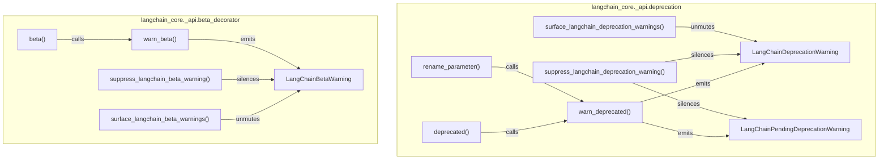

Sources: [libs/core/langchain_core/_api/deprecation.py:1-603](), [libs/core/langchain_core/_api/beta_decorator.py:1-254]()

---

## Serialization Framework

The serialization framework lives in `libs/core/langchain_core/load/`. It provides a stable way to convert LangChain objects to JSON and back, handling secrets, class renames across versions, and security constraints.

### `Serializable` Base Class

**Location:** [libs/core/langchain_core/load/serializable.py:88-293]()

`Serializable` is an abstract Pydantic `BaseModel`. All serializable LangChain objects inherit from it. Key aspects:

**Opt-in serialization.** Even if a class inherits `Serializable`, it is **not** serializable by default. The subclass must override `is_lc_serializable()` to return `True`:

```python
@classmethod
def is_lc_serializable(cls) -> bool:
    return True
```

**Class identity.** Each class has a stable string identifier built from `get_lc_namespace()` and the class name, accessed via `lc_id()`:

| Method | Returns | Purpose |
|---|---|---|
| `get_lc_namespace()` | `list[str]` | Module-like namespace path for the class |
| `lc_id()` | `list[str]` | Full identity path, e.g. `["langchain_core", "messages", "ai", "AIMessage"]` |

By default `get_lc_namespace()` splits `cls.__module__` on `"."`. Older partner packages (e.g. `langchain-openai`, `langchain-anthropic`) override this to return legacy-style paths like `["langchain", "chat_models", "openai"]` for backward-compatible deserialization.

**Secret handling.** The `lc_secrets` property maps constructor argument names to environment variable names. During serialization, these values are replaced with a `{"lc": 1, "type": "secret", "id": ["ENV_VAR_NAME"]}` placeholder:

```python
@property
def lc_secrets(self) -> dict[str, str]:
    return {"openai_api_key": "OPENAI_API_KEY"}
```

**Extra attributes.** The `lc_attributes` property provides additional non-field data to include in the serialized output.

**`to_json()` method.** Returns a `SerializedConstructor` dict for serializable objects, or a `SerializedNotImplemented` dict for non-serializable ones. The three serialized types are:

| TypedDict | `type` field value | Purpose |
|---|---|---|
| `SerializedConstructor` | `"constructor"` | A serializable object |
| `SerializedSecret` | `"secret"` | A placeholder for a secret value |
| `SerializedNotImplemented` | `"not_implemented"` | An object that cannot be serialized |

Sources: [libs/core/langchain_core/load/serializable.py:1-389]()

---

### Serialization Functions

**Location:** [libs/core/langchain_core/load/dump.py]()

| Function | Input | Output | Description |
|---|---|---|---|
| `dumpd(obj)` | Any | `dict` | Converts object to a JSON-ready dict |
| `dumps(obj, *, pretty, **kwargs)` | Any | `str` | Converts object to a JSON string |

Both functions use `_serialize_value()` internally to walk the object tree. Non-`Serializable` objects that cannot be serialized are represented as `SerializedNotImplemented`. Passing `default` as a kwarg to `dumps()` raises `ValueError`.

The `pretty=True` argument to `dumps()` enables indented output (2-space default, overridable with `indent=`).

**Escape mechanism.** User data (plain `dict` values) that happen to contain an `"lc"` key are **escaped** during serialization by wrapping them as `{"__lc_escaped__": {...}}`. This prevents injection attacks where user-controlled data could be mistaken for a LangChain constructor during deserialization. The escape marker is transparently removed during `load()`.

Sources: [libs/core/langchain_core/load/dump.py:1-121]()

---

### Deserialization Functions

**Location:** [libs/core/langchain_core/load/load.py]()

Both `load()` and `loads()` are marked `@beta()`.

| Function | Input | Description |
|---|---|---|
| `loads(text, ...)` | JSON string | Parses JSON then delegates to `load()` |
| `load(obj, ...)` | parsed dict/list | Recursively revives LangChain objects |

Both accept identical keyword parameters:

| Parameter | Default | Description |
|---|---|---|
| `allowed_objects` | `"core"` | Allowlist: `"core"`, `"all"`, or `list[type[Serializable]]` |
| `secrets_map` | `None` | Dict mapping secret IDs to their values |
| `valid_namespaces` | `None` | Extra module namespaces to permit |
| `secrets_from_env` | `False` | Whether to pull secrets from `os.environ` |
| `additional_import_mappings` | `None` | Override or extend `SERIALIZABLE_MAPPING` |
| `ignore_unserializable_fields` | `False` | If `True`, skip `not_implemented` objects instead of raising |
| `init_validator` | `default_init_validator` | Callable called before object instantiation |

The **`init_validator`** parameter accepts a callable `(class_path: tuple[str, ...], kwargs: dict) -> None`. The default `default_init_validator` blocks deserialization of objects with `template_format='jinja2'` because Jinja2 templates can execute arbitrary code.

Sources: [libs/core/langchain_core/load/load.py:1-720]()

---

### The `Reviver` Class

**Location:** [libs/core/langchain_core/load/load.py:292-501]()

`Reviver` is the core deserialization engine. It is used as a callback when `json.loads` encounters an object, and it reconstructs Python objects from their serialized dict representations.

For each dict encountered:

1. If `lc == 1` and `type == "secret"`: looks up the value in `secrets_map`, then optionally `os.environ`.
2. If `lc == 1` and `type == "not_implemented"`: raises `NotImplementedError` (or returns `None` if `ignore_unserializable_fields=True`).
3. If `lc == 1` and `type == "constructor"`: performs allowlist check, resolves the class via `import_mappings`, calls `init_validator`, and instantiates the class with the stored `kwargs`.
4. All other dicts: returned as-is.

Sources: [libs/core/langchain_core/load/load.py:292-501]()

---

### `SERIALIZABLE_MAPPING` Registry

**Location:** [libs/core/langchain_core/load/mapping.py]()

This is the central registry that maps **historical class paths** (the `id` stored in serialized JSON) to **current import paths** (where the class actually lives today). It is the mechanism that allows serialized data from old versions of LangChain to deserialize correctly even after classes have been moved or renamed.

The file defines four dicts that are merged at load time:

| Dict | Purpose |
|---|---|
| `SERIALIZABLE_MAPPING` | Primary mapping: legacy `langchain.*` paths → current locations |
| `_OG_SERIALIZABLE_MAPPING` | Very early paths (pre-split `langchain.schema.*`) |
| `OLD_CORE_NAMESPACES_MAPPING` | Paths when `langchain_core` paths were used directly |
| `_JS_SERIALIZABLE_MAPPING` | Paths as serialized by LangChain.js |

**Example entry:**

```
("langchain", "schema", "messages", "AIMessage")
    → ("langchain_core", "messages", "ai", "AIMessage")
```

This means an `AIMessage` serialized by an old version (with `id: ["langchain", "schema", "messages", "AIMessage"]`) can still be deserialized by the current codebase.

The combined `ALL_SERIALIZABLE_MAPPINGS` dict is built in `load.py` [libs/core/langchain_core/load/load.py:136-141]() and used by `Reviver`.

**Trusted namespaces.** Only modules from `DEFAULT_NAMESPACES` may be imported during deserialization [libs/core/langchain_core/load/load.py:113-128](). Two namespaces (`langchain_community`, `langchain`) are in `DISALLOW_LOAD_FROM_PATH` [libs/core/langchain_core/load/load.py:131-134](), meaning they can only be deserialized if an explicit mapping entry exists — dynamic path resolution from those namespaces is blocked.

Sources: [libs/core/langchain_core/load/mapping.py:1-1068](), [libs/core/langchain_core/load/load.py:113-141]()

---

## Wire Format

A serialized LangChain constructor object looks like this:

```json
{
  "lc": 1,
  "type": "constructor",
  "id": ["langchain", "chat_models", "anthropic", "ChatAnthropic"],
  "kwargs": {
    "model": "claude-3-haiku-20240307",
    "anthropic_api_key": {
      "lc": 1,
      "type": "secret",
      "id": ["ANTHROPIC_API_KEY"]
    }
  }
}
```

The `lc: 1` field is the format version. The `id` array is the class path. Secrets appear as nested objects with `type: "secret"`.

A non-serializable object is represented as:

```json
{
  "lc": 1,
  "type": "not_implemented",
  "id": ["langchain_core", "runnables", "base", "RunnableLambda"],
  "repr": "RunnableLambda(lambda x: x)"
}
```

Sources: [libs/core/langchain_core/load/serializable.py:33-55](), [libs/langchain/tests/unit_tests/load/__snapshots__/test_dump.ambr:1-62](), [libs/partners/anthropic/tests/unit_tests/__snapshots__/test_standard.ambr:1-33]()

---

## Serialization System: Full Flow

**Serialization and deserialization flow**

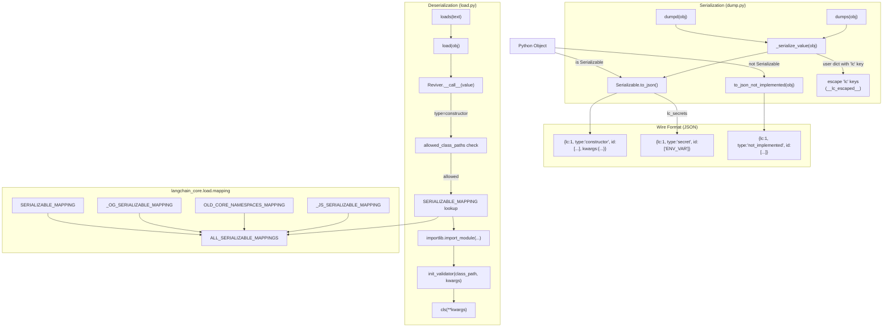

Sources: [libs/core/langchain_core/load/dump.py:1-121](), [libs/core/langchain_core/load/load.py:1-720](), [libs/core/langchain_core/load/mapping.py:1-1068](), [libs/core/langchain_core/load/serializable.py:209-285]()

---

## Security Model

Deserialization is restricted by an explicit allowlist. The `allowed_objects` parameter controls which classes may be instantiated:

| Value | Behavior |
|---|---|
| `"core"` (default) | Only classes in `SERIALIZABLE_MAPPING` whose target is `langchain_core` |
| `"all"` | All classes in `ALL_SERIALIZABLE_MAPPINGS` |
| `[Class1, Class2, ...]` | Only those specific `Serializable` subclasses |
| `[]` | No deserialization allowed |

Two additional protections are applied unconditionally:

1. **Namespace allowlist.** Only modules listed in `DEFAULT_NAMESPACES` are permitted as import targets. Attempting to deserialize a class from any other module raises `ValueError`.
2. **Jinja2 block.** The default `init_validator` (`default_init_validator`) raises `ValueError` if any object's kwargs contain `template_format='jinja2'`, preventing arbitrary code execution via Jinja2 template rendering.
3. **Escape-based injection prevention.** User data containing an `"lc"` key is escaped during serialization so it cannot be mistaken for a LangChain constructor during deserialization.

> **Warning:** `secrets_from_env=True` should only be used with fully trusted data sources. A crafted payload can enumerate arbitrary environment variable names in its `secret` fields.

Sources: [libs/core/langchain_core/load/load.py:16-94](), [libs/core/langchain_core/load/load.py:113-134](), [libs/core/langchain_core/load/load.py:176-224]()

---

## Implementing Serialization in a New Class

To make a class serializable, the following steps are needed:

1. **Inherit from `Serializable`** (directly or via a base class that already does so).
2. **Override `is_lc_serializable()`** to return `True`.
3. **Set `lc_secrets`** if the class has API keys or other secrets.
4. **Override `get_lc_namespace()`** only if the default module path is not appropriate (e.g., for backward-compatible identity).
5. **Add an entry to `SERIALIZABLE_MAPPING`** if the class path shown in `lc_id()` differs from the actual import location, or if the class may be moved in the future.

**Serializable class structure**

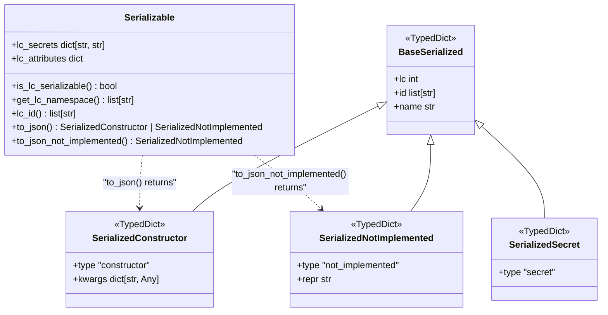

Sources: [libs/core/langchain_core/load/serializable.py:20-55](), [libs/core/langchain_core/load/serializable.py:88-195]()

# Graph Visualization


Graph visualization in LangChain provides tools for rendering Runnable chains and workflows as visual diagrams. The system supports multiple output formats including ASCII art, Mermaid syntax, and PNG images. This enables developers to inspect, debug, and document complex chain compositions.

For information about the Runnable interface and chain composition, see [Runnable Interface and LCEL](#2.1). For agent workflow visualization, see [Agent Creation and Middleware Architecture](#4.1).

## Core Graph Structure

The graph visualization system centers on three fundamental data structures defined in [langchain_core/runnables/graph.py:1-127]():

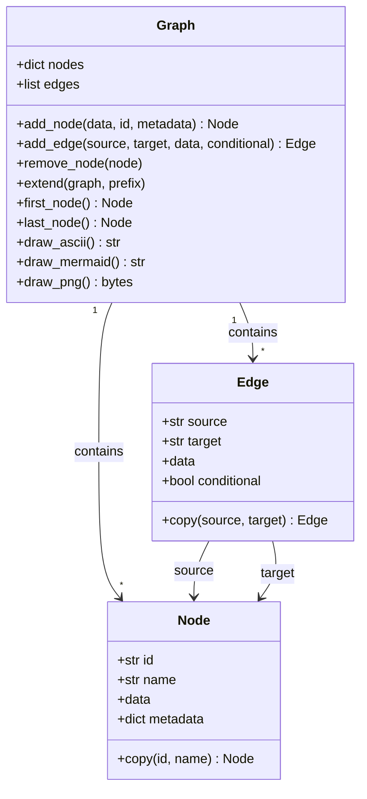

**Sources:** [langchain_core/runnables/graph.py:63-91](), [langchain_core/runnables/graph.py:93-126](), [langchain_core/runnables/graph.py:252-505]()

### Node Structure

The `Node` class represents vertices in the graph. Each node contains:

| Field | Type | Description |
|-------|------|-------------|
| `id` | `str` | Unique identifier for the node |
| `name` | `str` | Display name derived from the data |
| `data` | `BaseModel \| Runnable \| None` | The actual runnable or schema |
| `metadata` | `dict \| None` | Optional metadata (e.g., interrupt points) |

Node names are generated by `node_data_str()` which extracts meaningful names from Runnable classes or Pydantic models [langchain_core/runnables/graph.py:178-194]().

**Sources:** [langchain_core/runnables/graph.py:93-126]()

### Edge Structure

The `Edge` class represents connections between nodes:

| Field | Type | Description |
|-------|------|-------------|
| `source` | `str` | Source node ID |
| `target` | `str` | Target node ID |
| `data` | `Stringifiable \| None` | Optional label for the edge |
| `conditional` | `bool` | Whether the edge represents conditional flow |

Conditional edges are rendered with dotted lines in visualizations [langchain_core/runnables/graph_mermaid.py:203-208]().

**Sources:** [langchain_core/runnables/graph.py:63-91]()

## Rendering Methods

The `Graph` class provides three rendering methods, each optimized for different use cases:

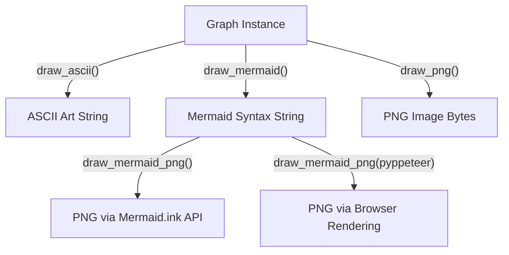

**Sources:** [langchain_core/runnables/graph.py:507-574]()

### ASCII Rendering

The `draw_ascii()` method renders graphs as ASCII art using the Grandalf library for graph layout [langchain_core/runnables/graph_ascii.py:1-235]().

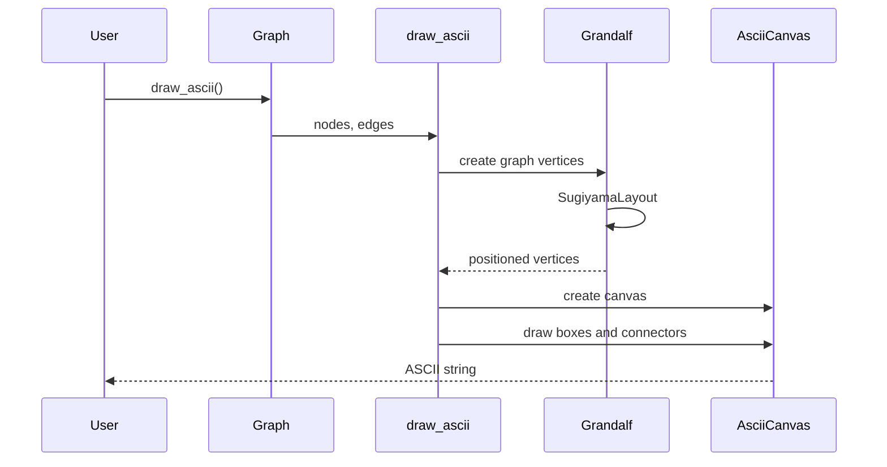

The ASCII renderer uses:
- **VertexViewer**: Defines bounding boxes for nodes [langchain_core/runnables/graph_ascii.py:27-54]()
- **AsciiCanvas**: Manages character-based drawing [langchain_core/runnables/graph_ascii.py:57-252]()
- **SugiyamaLayout**: Hierarchical graph layout algorithm [langchain_core/runnables/graph_ascii.py:134-145]()

Box characters used: `┌─┐│└┘` for node boundaries, `*` for vertical edges [langchain_core/runnables/graph_ascii.py:173-234]().

**Sources:** [langchain_core/runnables/graph.py:507-519](), [langchain_core/runnables/graph_ascii.py:27-252]()

### Mermaid Rendering

The `draw_mermaid()` method generates Mermaid syntax for web-based rendering [langchain_core/runnables/graph_mermaid.py:45-252]().

#### Mermaid Syntax Generation

The Mermaid renderer handles complex graph structures including nested subgraphs:

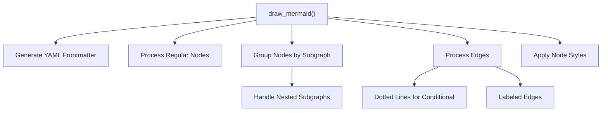

Key features:

| Feature | Implementation | Location |
|---------|----------------|----------|
| Safe IDs | Convert special chars to hex codes | [graph_mermaid.py:255-266]() |
| Subgraphs | Prefix-based grouping (e.g., `parent:child`) | [graph_mermaid.py:117-122]() |
| Edge labels | Word wrapping every N words | [graph_mermaid.py:193-202]() |
| Conditional edges | Dotted arrows (`-.->`) | [graph_mermaid.py:203-208]() |
| Node styles | CSS-like styling via `classDef` | [graph_mermaid.py:269-274]() |

The `_to_safe_id()` function ensures Mermaid compatibility by escaping special characters [langchain_core/runnables/graph_mermaid.py:255-266]().

**Sources:** [langchain_core/runnables/graph.py:575-610](), [langchain_core/runnables/graph_mermaid.py:45-252]()

#### Mermaid to PNG Conversion

The `draw_mermaid_png()` function converts Mermaid syntax to PNG images using two methods:

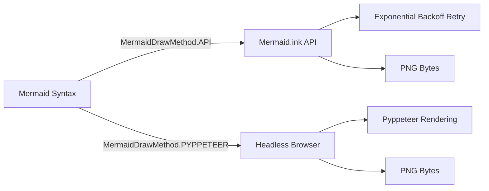

**API Method** (`_render_mermaid_using_api`):
- Base64-encodes Mermaid syntax [langchain_core/runnables/graph_mermaid.py:428-430]()
- Sends GET request to `https://mermaid.ink/img/{encoded}` [langchain_core/runnables/graph_mermaid.py:440-443]()
- Implements exponential backoff with jitter for retries [langchain_core/runnables/graph_mermaid.py:469-471]()
- Requires `requests` library

**Pyppeteer Method** (`_render_mermaid_using_pyppeteer`):
- Launches headless browser [langchain_core/runnables/graph_mermaid.py:346]()
- Loads Mermaid.js from CDN [langchain_core/runnables/graph_mermaid.py:351-352]()
- Renders SVG and captures screenshot [langchain_core/runnables/graph_mermaid.py:361-394]()
- Requires `pyppeteer` library

**Sources:** [langchain_core/runnables/graph_mermaid.py:277-498]()

### PNG Rendering

The `draw_png()` method uses Graphviz to generate high-quality PNG images [langchain_core/runnables/graph_png.py:1-167]().

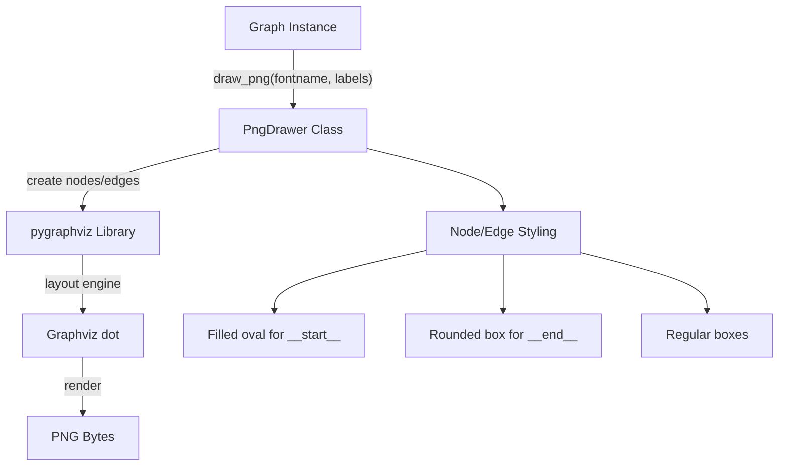

The `PngDrawer` class handles:
- **Node styling**: Ovals for start/end nodes, boxes for others [langchain_core/runnables/graph_png.py:84-109]()
- **Edge styling**: Dashed lines for conditional edges [langchain_core/runnables/graph_png.py:128-144]()
- **Label customization**: Via `LabelsDict` parameter [langchain_core/runnables/graph_png.py:29-52]()
- **Subgraph rendering**: Groups nodes with cluster subgraphs [langchain_core/runnables/graph_png.py:111-127]()

**Sources:** [langchain_core/runnables/graph.py:541-573](), [langchain_core/runnables/graph_png.py:16-167]()

## Graph Construction and Manipulation

### Building Graphs

Graphs are typically constructed automatically by Runnable objects via their `get_graph()` method, but can also be built manually:

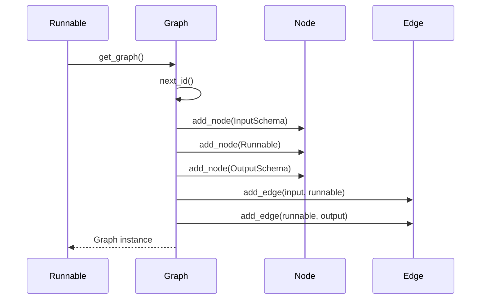

Key methods:

| Method | Purpose | Returns |
|--------|---------|---------|
| `add_node(data, id, metadata)` | Add vertex to graph | `Node` |
| `add_edge(source, target, data, conditional)` | Connect two nodes | `Edge` |
| `remove_node(node)` | Remove vertex and connected edges | `None` |
| `extend(graph, prefix)` | Merge another graph | `(Node, Node)` |

**Sources:** [langchain_core/runnables/graph.py:305-420]()

### Graph Traversal

The graph provides helper methods for identifying entry and exit points:

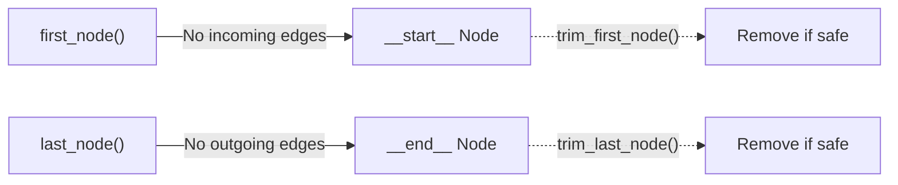

- `first_node()`: Returns the unique node with no incoming edges [langchain_core/runnables/graph.py:457-467]()
- `last_node()`: Returns the unique node with no outgoing edges [langchain_core/runnables/graph.py:469-479]()
- `trim_first_node()`: Removes start node if it doesn't leave graph without an entry point [langchain_core/runnables/graph.py:481-492]()
- `trim_last_node()`: Removes end node if it doesn't leave graph without an exit point [langchain_core/runnables/graph.py:494-505]()

**Sources:** [langchain_core/runnables/graph.py:457-505]()

### Subgraph Support

The `extend()` method merges graphs with optional prefixing for namespace isolation:

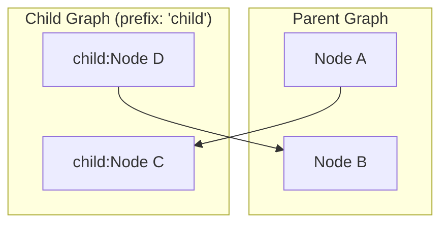

Prefix format: `parent_id:child_id:grandchild_id` for nested hierarchies [langchain_core/runnables/graph.py:384-420]().

**Sources:** [langchain_core/runnables/graph.py:384-420]()

## Styling and Customization

### Node Styles

The `NodeStyles` dataclass defines CSS-like styling for different node types:

| Style Class | Default Value | Applied To |
|-------------|---------------|------------|
| `default` | `fill:#f2f0ff,line-height:1.2` | All nodes |
| `first` | `fill-opacity:0` | Entry node |
| `last` | `fill:#bfb6fc` | Exit node |

Custom styles are applied via Mermaid's `classDef` directive [langchain_core/runnables/graph_mermaid.py:269-274]().

**Sources:** [langchain_core/runnables/graph.py:154-167]()

### Curve Styles

The `CurveStyle` enum provides edge interpolation options:

```python
class CurveStyle(Enum):
    LINEAR = "linear"          # Straight lines
    BASIS = "basis"            # B-spline curve
    CARDINAL = "cardinal"       # Cardinal spline
    CATMULL_ROM = "catmullRom" # Catmull-Rom spline
    STEP = "step"              # Step function
    # ... and 7 more options
```

Set via `draw_mermaid(curve_style=CurveStyle.BASIS)` [langchain_core/runnables/graph.py:575-610]().

**Sources:** [langchain_core/runnables/graph.py:137-152]()

### Frontmatter Configuration

Mermaid diagrams support YAML frontmatter for theme and layout customization:

```python
frontmatter_config = {
    "config": {
        "theme": "neutral",
        "look": "handDrawn",
        "themeVariables": {"primaryColor": "#e2e2e2"}
    }
}
graph.draw_mermaid(frontmatter_config=frontmatter_config)
```

The frontmatter is converted to YAML and prepended to the Mermaid syntax [langchain_core/runnables/graph_mermaid.py:90-111]().

**Sources:** [langchain_core/runnables/graph_mermaid.py:69-85](), [langchain_core/runnables/graph_mermaid.py:103-111]()

## JSON Serialization

The `to_json()` method exports graphs in a machine-readable format:

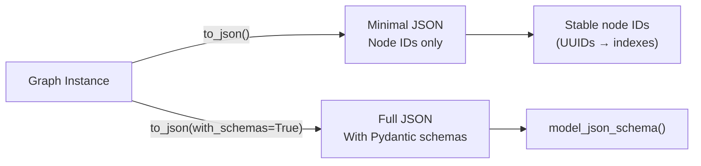

Output structure:

```json
{
  "nodes": [
    {
      "id": 0,
      "type": "runnable",
      "data": {
        "id": ["langchain", "prompts", "prompt", "PromptTemplate"],
        "name": "PromptTemplate"
      }
    }
  ],
  "edges": [
    {
      "source": 0,
      "target": 1,
      "conditional": false
    }
  ]
}
```

UUID node IDs are replaced with stable integer indexes for serialization [langchain_core/runnables/graph.py:274-277]().

**Sources:** [langchain_core/runnables/graph.py:264-299](), [langchain_core/runnables/graph.py:197-249]()

## Practical Usage Patterns

### Visualizing Chain Sequences

```python
from langchain_core.prompts import PromptTemplate
from langchain_core.output_parsers import StrOutputParser