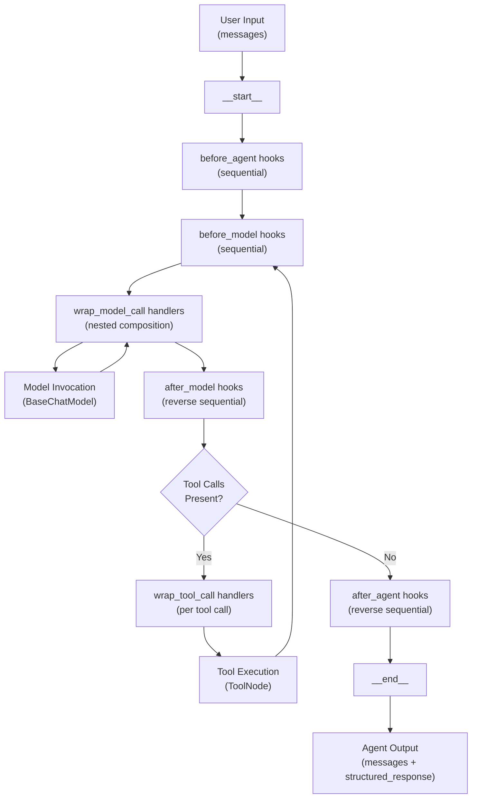
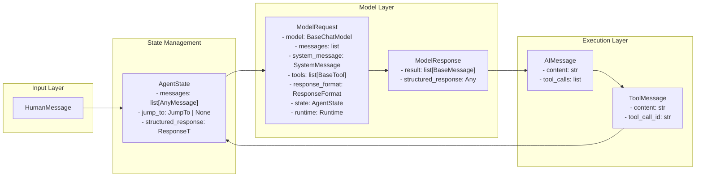
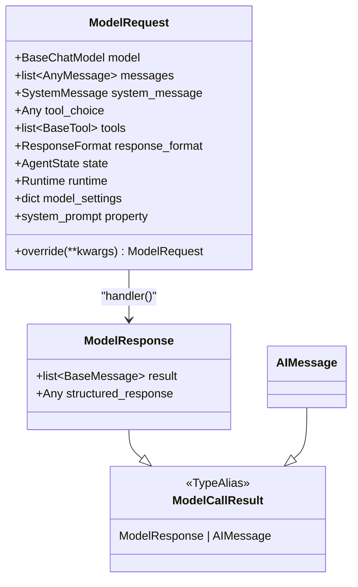
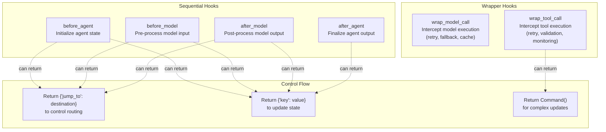

This document describes the agent execution framework in `langchain` v1, which provides a middleware-based architecture for building LLM agents with customizable behavior. The system is built on top of LangGraph's `StateGraph` and provides structured hooks for intercepting and modifying agent behavior at key execution points.

For information about the underlying abstractions (Runnable, BaseChatModel, BaseTool), see [Core Architecture](#2). For details on specific middleware implementations, see [Middleware Architecture](#4.2). For provider integrations, see [Provider Integrations](#3).

## Purpose and Scope

The agent system provides:
- A `create_agent` factory function that constructs an executable agent graph from a model, tools, and middleware
- A middleware architecture with multiple interception points (before/after agent, before/after model, wrap model/tool calls)
- Support for structured output via `ResponseFormat` strategies (ToolStrategy and ProviderStrategy)
- Tool calling loop orchestration with state management
- Conditional control flow via `jump_to` mechanism

This document focuses on the agent execution flow, middleware composition, and state management. It does not cover specific middleware implementations in detail (see [Middleware Architecture](#4.2)) or testing infrastructure (see [Testing and Quality Assurance](#5)).

**Sources:** [libs/langchain_v1/langchain/agents/factory.py:1-683](), [libs/langchain_v1/langchain/agents/middleware/types.py:1-330]()

## Architecture Overview

### Agent Execution Flow

The agent system orchestrates execution through a `StateGraph` with middleware hooks at key stages:



**Sources:** [libs/langchain_v1/langchain/agents/factory.py:541-683](), [libs/langchain_v1/langchain/agents/factory.py:860-1296]()

### Core Data Flow



**Sources:** [libs/langchain_v1/langchain/agents/middleware/types.py:85-270](), [libs/langchain_v1/langchain/agents/middleware/types.py:304-323]()

## Core Components

### create_agent Factory

The `create_agent` function is the primary entry point for constructing agents:

```python
def create_agent(
    model: str | BaseChatModel,
    tools: Sequence[BaseTool | Callable | dict[str, Any]] | None = None,
    *,
    system_prompt: str | SystemMessage | None = None,
    middleware: Sequence[AgentMiddleware[StateT_co, ContextT]] = (),
    response_format: ResponseFormat[ResponseT] | type[ResponseT] | None = None,
    state_schema: type[AgentState[ResponseT]] | None = None,
    context_schema: type[ContextT] | None = None,
    checkpointer: Checkpointer | None = None,
    store: BaseStore | None = None,
    interrupt_before: list[str] | None = None,
    interrupt_after: list[str] | None = None,
    debug: bool = False,
    name: str | None = None,
    cache: BaseCache | None = None,
) -> CompiledStateGraph[AgentState[ResponseT], ContextT, ...]
```

The factory performs several key initialization tasks:

| Task | Implementation Location |
|------|------------------------|
| Model initialization | [libs/langchain_v1/langchain/agents/factory.py:684-686]() |
| Tool processing | [libs/langchain_v1/langchain/agents/factory.py:697-792]() |
| Middleware validation | [libs/langchain_v1/langchain/agents/factory.py:793-838]() |
| State schema resolution | [libs/langchain_v1/langchain/agents/factory.py:852-859]() |
| Graph construction | [libs/langchain_v1/langchain/agents/factory.py:860-1296]() |
| Response format handling | [libs/langchain_v1/langchain/agents/factory.py:700-729]() |

**Sources:** [libs/langchain_v1/langchain/agents/factory.py:541-683]()

### AgentState

`AgentState` is the base state schema that flows through the graph:

```python
class AgentState(TypedDict, Generic[ResponseT]):
    """State schema for the agent."""
    
    messages: Required[Annotated[list[AnyMessage], add_messages]]
    jump_to: NotRequired[Annotated[JumpTo | None, EphemeralValue, PrivateStateAttr]]
    structured_response: NotRequired[Annotated[ResponseT, OmitFromInput]]
```

| Field | Type | Purpose |
|-------|------|---------|
| `messages` | `list[AnyMessage]` | Conversation history with `add_messages` reducer |
| `jump_to` | `JumpTo \| None` | Control flow destination (`"tools"`, `"model"`, `"end"`) |
| `structured_response` | `ResponseT` | Parsed output when using `response_format` |

Middleware can extend this schema with custom fields via `state_schema` attribute.

**Sources:** [libs/langchain_v1/langchain/agents/middleware/types.py:304-323](), [libs/langchain_v1/langchain/agents/factory.py:852-859]()

### ModelRequest and ModelResponse

These types encapsulate model invocation parameters and results:



The `ModelRequest` class uses `system_message` as the primary field, with a deprecated `system_prompt` parameter in `__init__` for backward compatibility. The `ModelRequest.override()` method provides immutable updates:

```python
# Example: Middleware modifying model settings
new_request = request.override(
    model=fallback_model,
    system_message=SystemMessage("New instructions")
)
```

The `system_prompt` property provides read-only access to `system_message.text` for backward compatibility.

**Sources:** [libs/langchain_v1/langchain/agents/middleware/types.py:87-264](), [libs/langchain_v1/langchain/agents/middleware/types.py:266-279]()

## Middleware Interface

### AgentMiddleware Base Class

```python
class AgentMiddleware(Generic[StateT, ContextT]):
    """Base middleware class for an agent."""
    
    state_schema: type[StateT] = AgentState
    tools: list[BaseTool]
    
    @property
    def name(self) -> str:
        """Defaults to class name."""
    
    # Hook methods (sync and async versions)
    def before_agent(self, state: StateT, runtime: Runtime[ContextT]) -> dict | None
    async def abefore_agent(self, state: StateT, runtime: Runtime[ContextT]) -> dict | None
    
    def before_model(self, state: StateT, runtime: Runtime[ContextT]) -> dict | None
    async def abefore_model(self, state: StateT, runtime: Runtime[ContextT]) -> dict | None
    
    def after_model(self, state: StateT, runtime: Runtime[ContextT]) -> dict | None
    async def aafter_model(self, state: StateT, runtime: Runtime[ContextT]) -> dict | None
    
    def after_agent(self, state: StateT, runtime: Runtime[ContextT]) -> dict | None
    async def aafter_agent(self, state: StateT, runtime: Runtime[ContextT]) -> dict | None
    
    def wrap_model_call(self, request: ModelRequest, handler: Callable) -> ModelCallResult
    async def awrap_model_call(self, request: ModelRequest, handler: Callable) -> ModelCallResult
    
    def wrap_tool_call(self, request: ToolCallRequest, handler: Callable) -> ToolMessage | Command
    async def awrap_tool_call(self, request: ToolCallRequest, handler: Callable) -> ToolMessage | Command
```

**Sources:** [libs/langchain_v1/langchain/agents/middleware/types.py:330-689]()

### Middleware Hook Types



| Hook Type | Execution Order | Can Jump | Primary Use Cases |
|-----------|----------------|----------|-------------------|
| `before_agent` | Sequential (first to last) | Yes | State initialization, validation |
| `before_model` | Sequential (first to last) | Yes | Input transformation, early exit |
| `after_model` | Reverse sequential (last to first) | Yes | Output processing, retry logic |
| `after_agent` | Reverse sequential (last to first) | Yes (to `"end"`) | Finalization, logging |
| `wrap_model_call` | Nested composition (first = outermost) | No | Retry, fallback, caching |
| `wrap_tool_call` | Nested composition (first = outermost) | No | Tool retry, validation |

**Sources:** [libs/langchain_v1/langchain/agents/factory.py:797-838](), [libs/langchain_v1/langchain/agents/middleware/types.py:351-689]()

## Middleware Hooks in Detail

### Sequential Hooks (before/after)

Sequential hooks execute in order and return state updates or control flow commands:

```python