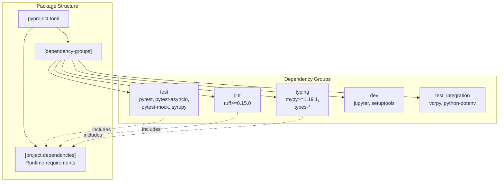
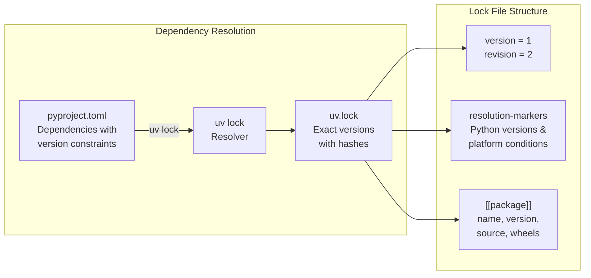
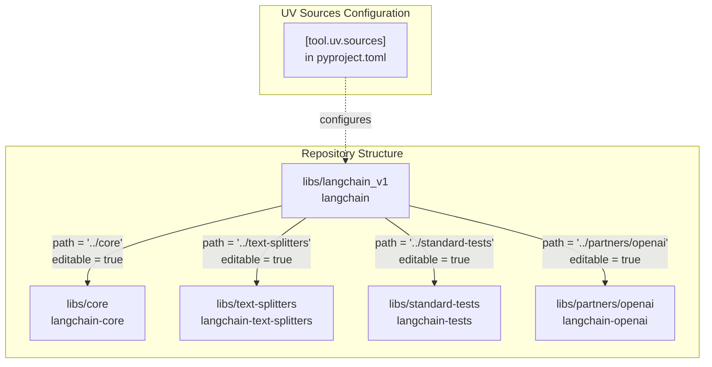
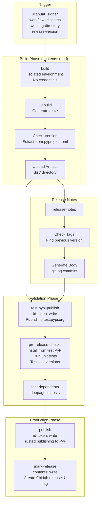

if [ "$CORE_PYPROJECT_VERSION" != "$CORE_VERSION_PY_VERSION" ]; then
    echo "langchain-core versions in pyproject.toml and version.py do not match!"
    echo "pyproject.toml version: $CORE_PYPROJECT_VERSION"
    echo "version.py version: $CORE_VERSION_PY_VERSION"
    exit 1
fi
```

**Checked files:**
- `libs/core/pyproject.toml` vs. `libs/core/langchain_core/version.py` (core package)
- `libs/langchain_v1/pyproject.toml` vs. `libs/langchain_v1/langchain/__init__.py` (langchain_v1 package)

**Trigger:** Runs on pull requests that modify these specific version files via `paths` filter.

**Purpose:** Prevents releases with mismatched version numbers between package metadata and runtime version constants. Mismatches cause `__version__` attributes to report incorrect values.

**Sources:** [.github/workflows/check_core_versions.yml:1-52]()

---

## Summary Table: Workflow Inventory

| Workflow | Trigger | Purpose | Key Outputs |
|----------|---------|---------|-------------|
| `check_diffs.yml` | PR, push to master | Main CI orchestration | Test results, lint results |
| `_lint.yml` | Called by check_diffs | Run ruff + mypy | Code quality feedback |
| `_test.yml` | Called by check_diffs | Unit tests with min versions | Test coverage, compatibility |
| `_test_pydantic.yml` | Called by check_diffs | Pydantic version compatibility | Cross-version validation |
| `_compile_integration_test.yml` | Called by check_diffs | Verify integration tests compile | Early syntax error detection |
| `_release.yml` | Manual dispatch | Publish packages to PyPI | PyPI packages, GitHub releases |
| `check_core_versions.yml` | PR to version files | Verify version consistency | Version validation |

**Sources:** [.github/workflows/check_diffs.yml:1-262](), [.github/workflows/_release.yml:1-557](), [.github/workflows/check_core_versions.yml:1-52]()

# Development and Release


This page documents the development tooling, package management, build system, and release infrastructure for the LangChain repository. It covers how packages are structured, how dependencies are managed using UV, the secure multi-stage release pipeline, and version consistency mechanisms.

For information about testing infrastructure and quality assurance, see [Testing and Quality Assurance](#5).

---

## Package Structure and Build System

### pyproject.toml Configuration

Each LangChain package uses a `pyproject.toml` file following [PEP 621](https://peps.python.org/pep-0621/) standards. The build system is configured with `hatchling` as the build backend.

**Core Package Configuration** ([libs/core/pyproject.toml:1-6]()):

```toml
[build-system]
requires = ["hatchling"]
build-backend = "hatchling.build"
```

Project metadata follows a consistent structure across all packages:

- **name**: Package name (e.g., `langchain-core`, `langchain`, `langchain-anthropic`)
- **version**: Single source of truth for package version
- **requires-python**: Supported Python versions (typically `>=3.10.0,<4.0.0`)
- **dependencies**: Required runtime dependencies
- **dependency-groups**: Optional dependency groups for development

**Example from langchain-core** ([libs/core/pyproject.toml:5-35]()):

| Field | Value |
|-------|-------|
| Package | `langchain-core` |
| Version | `1.2.19` |
| Python | `>=3.10.0,<4.0.0` |
| Core Dependencies | `langsmith`, `tenacity`, `jsonpatch`, `PyYAML`, `typing-extensions`, `packaging`, `pydantic>=2.7.4,<3.0.0`, `uuid-utils` |

Sources: [libs/core/pyproject.toml:1-50](), [libs/langchain_v1/pyproject.toml:1-60](), [libs/langchain/pyproject.toml:1-35]()

### Dependency Groups

LangChain uses **dependency groups** (PEP 735) to organize optional dependencies by purpose. This replaces the older `[project.optional-dependencies]` pattern with a more explicit structure.



**langchain-core dependency groups** ([libs/core/pyproject.toml:47-77]()):

```toml
[dependency-groups]
lint = ["ruff>=0.15.0,<0.16.0"]
typing = [
    "mypy>=1.19.1,<1.20.0",
    "types-pyyaml>=6.0.12.2,<7.0.0.0",
    "types-requests>=2.28.11.5,<3.0.0.0",
    "langchain-text-splitters",
]
test = [
    "pytest>=8.0.0,<10.0.0",
    "freezegun>=1.2.2,<2.0.0",
    "pytest-mock>=3.10.0,<4.0.0",
    "syrupy>=4.0.2,<6.0.0",
    # ... more test dependencies
]
```

Sources: [libs/core/pyproject.toml:47-82](), [libs/langchain_v1/pyproject.toml:61-92]()

### UV Package Manager and Dependency Locking

LangChain uses **UV** as its package manager, which provides fast dependency resolution and reproducible builds through lock files.



**uv.lock structure** ([libs/core/uv.lock:1-14]()):

```toml
version = 1
revision = 2
requires-python = ">=3.10.0, <4.0.0"
resolution-markers = [
    "python_full_version >= '3.14' and platform_python_implementation == 'PyPy'",
    "python_full_version == '3.13.*' and platform_python_implementation == 'PyPy'",
    # ... more platform-specific markers
]
```

Each package entry includes:
- **name**: Package identifier
- **version**: Exact resolved version
- **source**: Registry URL
- **sdist**: Source distribution with SHA256 hash
- **wheels**: Pre-built wheels for different platforms with SHA256 hashes

**Environment Variables for UV** ([.github/workflows/check_diffs.yml:38-39]()):

```yaml
env:
  UV_FROZEN: "true"   # Use lock file, don't update
  UV_NO_SYNC: "true"  # Don't sync venv on every command
```

Sources: [libs/core/uv.lock:1-100](), [libs/langchain_v1/uv.lock:1-100](), [.github/workflows/_release.yml:36-37]()

### Local Path Dependencies

For development and testing, packages reference each other using **local path dependencies** configured in `[tool.uv.sources]`. This enables editable installs for fast iteration.



**Example configuration** ([libs/langchain_v1/pyproject.toml:97-103]()):

```toml
[tool.uv.sources]
langchain-core = { path = "../core", editable = true }
langchain-tests = { path = "../standard-tests", editable = true }
langchain-text-splitters = { path = "../text-splitters", editable = true }
langchain-openai = { path = "../partners/openai", editable = true }
langchain-anthropic = { path = "../partners/anthropic", editable = true }
```

This configuration allows developers to:
1. Make changes to `langchain-core` and immediately test them in `langchain` without reinstalling
2. Debug across package boundaries with proper source mapping
3. Run tests that span multiple packages

Sources: [libs/langchain_v1/pyproject.toml:97-103](), [libs/core/pyproject.toml:80-82]()

### Hatchling Build Backend

Hatchling is configured as the build backend, which:
- Builds source distributions (`.tar.gz`) and wheels (`.whl`)
- Handles version string injection
- Supports custom build hooks if needed
- Produces PEP 517/PEP 660 compliant packages

**Build Command** ([.github/workflows/_release.yml:75-77]()):

```yaml
- name: Build project for distribution
  run: uv build
  working-directory: ${{ inputs.working-directory }}
```

This generates artifacts in the `dist/` directory:
- `{package_name}-{version}.tar.gz` (source distribution)
- `{package_name}-{version}-py3-none-any.whl` (wheel)

Sources: [.github/workflows/_release.yml:75-84](), [libs/core/pyproject.toml:1-3]()

---

## Release Process and Workflows

The release workflow ([.github/workflows/_release.yml]()) implements a secure, multi-stage pipeline that separates build and publish phases to prevent credential compromise.

### Release Pipeline Architecture



Sources: [.github/workflows/_release.yml:1-630]()

### Build Phase: Isolated and Credential-Free

The build job runs with minimal permissions to prevent supply chain attacks.

**Security Principle** ([.github/workflows/_release.yml:64-74]()):

```yaml
# We want to keep this build stage *separate* from the release stage,
# so that there's no sharing of permissions between them.
# (Release stage has trusted publishing and GitHub repo contents write access)
#
# Otherwise, a malicious `build` step (e.g. via a compromised dependency)
# could get access to our GitHub or PyPI credentials.
```

**Build Job Configuration** ([.github/workflows/_release.yml:43-55]()):

```yaml
build:
  if: github.ref == 'refs/heads/master' || inputs.dangerous-nonmaster-release
  environment: Scheduled testing
  runs-on: ubuntu-latest
  permissions:
    contents: read  # Only read access, no credentials

  outputs:
    pkg-name: ${{ steps.check-version.outputs.pkg-name }}
    version: ${{ steps.check-version.outputs.version }}
```

The build step uses Python's `tomllib` to extract version information ([.github/workflows/_release.yml:85-98]()):

```python
import os
import tomllib
with open("pyproject.toml", "rb") as f:
    data = tomllib.load(f)
pkg_name = data["project"]["name"]
version = data["project"]["version"]
with open(os.environ["GITHUB_OUTPUT"], "a") as f:
    f.write(f"pkg-name={pkg_name}\n")
    f.write(f"version={version}\n")
```

Sources: [.github/workflows/_release.yml:43-99]()

### Test PyPI Validation

Before publishing to production PyPI, packages are validated on **test.pypi.org**.

**Test PyPI Publish** ([.github/workflows/_release.yml:197-233]()):

```yaml
test-pypi-publish:
  needs: [build, release-notes]
  runs-on: ubuntu-latest
  permissions:
    id-token: write  # For trusted publishing

  steps:
    - uses: actions/download-artifact@v8
      with:
        name: dist
        path: ${{ inputs.working-directory }}/dist/

    - name: Publish to test PyPI
      uses: pypa/gh-action-pypi-publish@ed0c53931b1dc9bd32cbe73a98c7f6766f8a527e
      with:
        packages-dir: ${{ inputs.working-directory }}/dist/
        repository-url: https://test.pypi.org/legacy/
        skip-existing: true  # Allow overwrites on test PyPI
        attestations: false   # Temporary workaround
```

Sources: [.github/workflows/_release.yml:197-233]()

### Pre-Release Checks

The `pre-release-checks` job validates the package before production release by:

1. **Installing from test PyPI** ([.github/workflows/_release.yml:270-295]()):
   ```bash
   uv venv
   VIRTUAL_ENV=.venv uv pip install dist/*.whl
   
   # Import package to verify it works
   IMPORT_NAME="$(echo "$PKG_NAME" | sed s/-/_/g | sed s/_official//g)"
   uv run python -c "import $IMPORT_NAME; print(dir($IMPORT_NAME))"
   ```

2. **Running unit tests** ([.github/workflows/_release.yml:317-319]()):
   ```bash
   make tests
   ```

3. **Testing minimum dependency versions** ([.github/workflows/_release.yml:321-340]()):
   ```bash
   # Find minimum versions that satisfy constraints
   min_versions="$(uv run python $GITHUB_WORKSPACE/.github/scripts/get_min_versions.py pyproject.toml release $python_version)"
   
   # Install minimum versions and re-test
   VIRTUAL_ENV=.venv uv pip install $MIN_VERSIONS
   make tests
   ```

4. **Blocking prerelease dependencies** ([.github/workflows/_release.yml:310-315]()):
   ```bash
   # Block release if any dependencies allow prerelease versions
   # (unless this is itself a prerelease version)
   uv run python $GITHUB_WORKSPACE/.github/scripts/check_prerelease_dependencies.py pyproject.toml
   ```

5. **Running integration tests for partner packages** ([.github/workflows/_release.yml:346-388]()):
   ```bash
   if [[ "${{ startsWith(inputs.working-directory, 'libs/partners/') }}" ]]; then
     make integration_tests
   fi
   ```

Sources: [.github/workflows/_release.yml:234-389]()

### Trusted Publishing to PyPI

LangChain uses **trusted publishing** (OIDC-based authentication) instead of API tokens, eliminating the need to store credentials.

**Trusted Publishing Configuration** ([.github/workflows/_release.yml:541-586]()):

```yaml
publish:
  needs: [build, release-notes, test-pypi-publish, pre-release-checks, test-dependents]
  if: ${{ !cancelled() && !failure() }}
  runs-on: ubuntu-latest
  permissions:
    id-token: write  # Required for trusted publishing

  steps:
    - uses: actions/download-artifact@v8
      with:
        name: dist
        path: ${{ inputs.working-directory }}/dist/

    - name: Publish package distributions to PyPI
      uses: pypa/gh-action-pypi-publish@ed0c53931b1dc9bd32cbe73a98c7f6766f8a527e
      with:
        packages-dir: ${{ inputs.working-directory }}/dist/
        verbose: true
        print-hash: true
        attestations: false
```

**How Trusted Publishing Works**:

1. GitHub Actions generates an OIDC token proving the workflow identity
2. PyPI verifies the token matches the configured publisher (repository + workflow)
3. No API tokens are stored in GitHub secrets or anywhere else
4. Each package must be pre-configured on PyPI with the publisher details

Sources: [.github/workflows/_release.yml:541-586]()

### GitHub Release Marking

After successful PyPI publication, a GitHub release is created with:

- **Tag**: Format `{pkg-name}=={version}` (e.g., `langchain-core==1.2.19`)
- **Release notes**: Generated from git commit history
- **Artifacts**: Uploaded wheel and source distribution

**Mark Release Job** ([.github/workflows/_release.yml:587-630]()):

```yaml
mark-release:
  needs: [build, release-notes, test-pypi-publish, pre-release-checks, publish]
  runs-on: ubuntu-latest
  permissions:
    contents: write  # Required to create releases

  steps:
    - name: Create Tag
      uses: ncipollo/release-action@b7eabc95ff50cbeeedec83973935c8f306dfcd0b
      with:
        artifacts: "dist/*"
        tag: ${{needs.build.outputs.pkg-name}}==${{ needs.build.outputs.version }}
        body: ${{ needs.release-notes.outputs.release-body }}
        commit: ${{ github.sha }}
        makeLatest: ${{ needs.build.outputs.pkg-name == 'langchain-core'}}
```

**Release Notes Generation** ([.github/workflows/_release.yml:118-195]()):

```bash