This page documents the configuration system that controls `Runnable` execution behavior and enables runtime modification of runnable properties. The system covers:

- **Execution parameters**: callbacks, tags, metadata, concurrency, recursion limits
- **Dynamic behavior**: `configurable_fields` and `configurable_alternatives` for runtime switching
- **Resilience**: `with_retry` for transient failure handling, `with_fallbacks` for provider-level fallback
- **Context propagation**: `var_child_runnable_config` for implicit config inheritance

For information about callbacks and observability hooks, see page 4.3. For agent-specific configuration and middleware, see page 4.1.

## RunnableConfig Structure

The `RunnableConfig` TypedDict defines the configuration options available for all `Runnable` objects. Configuration is passed through the optional `config` parameter in methods like `invoke`, `ainvoke`, `stream`, `astream`, `batch`, and `abatch`.

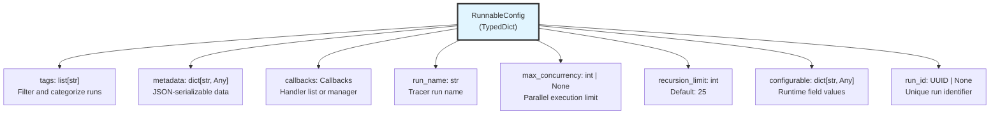

**Key Fields:**

| Field | Type | Purpose | Inherited by Children |
|-------|------|---------|----------------------|
| `tags` | `list[str]` | Categorize and filter runs in traces | Yes |
| `metadata` | `dict[str, Any]` | Attach JSON-serializable context to runs | Yes |
| `callbacks` | `Callbacks` | List of handlers or callback manager | Yes |
| `run_name` | `str` | Override default name in tracer | No |
| `max_concurrency` | `int \| None` | Control parallel execution in batch operations | Yes |
| `recursion_limit` | `int` | Maximum recursive call depth | Yes |
| `configurable` | `dict[str, Any]` | Values for dynamically configurable fields | Yes |
| `run_id` | `UUID \| None` | Unique identifier for this specific run | No |

Sources: [libs/core/langchain_core/runnables/config.py:51-123]()

## Configuration Management Functions

### ensure_config

The `ensure_config` function normalizes partial configurations into complete `RunnableConfig` objects with default values. It merges user-provided config with context-propagated config from `var_child_runnable_config`.

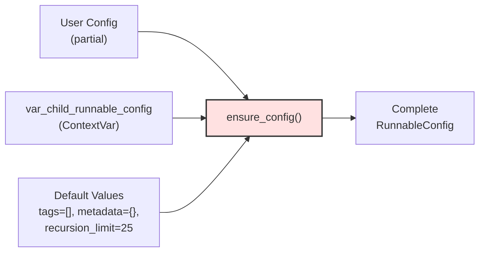

**Key Behavior:**
- Copies values from context var before applying user config
- Only copies mutable fields (`tags`, `metadata`, `callbacks`, `configurable`)
- Transfers simple configurable values to metadata for tracing
- Returns fully populated config with all required keys

Sources: [libs/core/langchain_core/runnables/config.py:216-266]()

### merge_configs

The `merge_configs` function combines multiple configurations intelligently, handling special merge logic for collections and callback managers.

**Merge Rules:**

| Field | Merge Strategy |
|-------|----------------|
| `tags` | Concatenate and deduplicate (sorted) |
| `metadata` | Shallow merge (later values override) |
| `callbacks` | Combine handlers or merge managers |
| `configurable` | Shallow merge (later values override) |
| `recursion_limit` | Use last non-default value |
| Other fields | Use last non-None value |

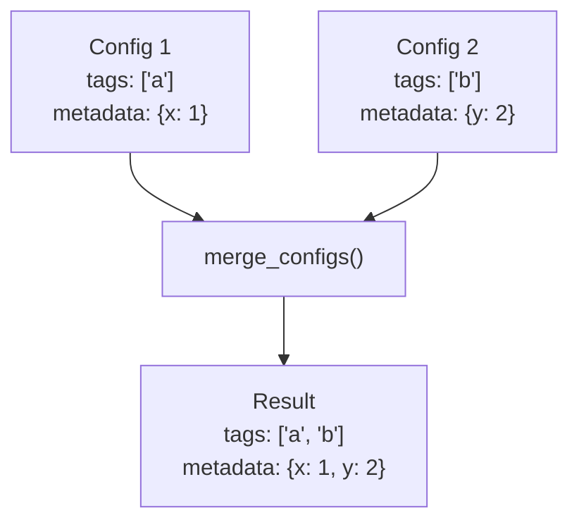

Sources: [libs/core/langchain_core/runnables/config.py:357-420]()

### patch_config

The `patch_config` function creates a new config by selectively updating specific fields. When replacing `callbacks`, it automatically removes `run_name` and `run_id` since they should apply only to the original callbacks.

Sources: [libs/core/langchain_core/runnables/config.py:315-354]()

### get_config_list

The `get_config_list` function generates a list of configs from a single config or sequence, used for batch operations. It warns if a `run_id` is provided for multiple inputs (will only use for first element).

Sources: [libs/core/langchain_core/runnables/config.py:269-312]()

## Runtime Configuration with configurable_fields

The `configurable_fields` method makes specific fields of a `Runnable` dynamically configurable at runtime without modifying the original instance. This returns a `RunnableConfigurableFields` wrapper that reads values from `config["configurable"]`.

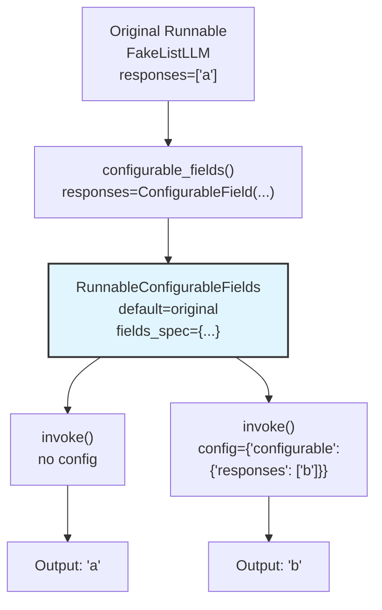

### ConfigurableField Specification

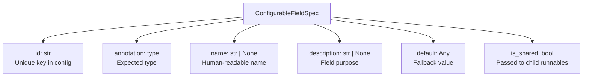

**Field Types:**

- **`ConfigurableField`**: Simple field with id and optional metadata
- **`ConfigurableFieldSingleOption`**: Field with predefined options (single selection)
- **`ConfigurableFieldMultiOption`**: Field with predefined options (multiple selection)

### Example Usage

The test cases show configurable fields in action:

```python
# Make LLM responses configurable
fake_llm = FakeListLLM(responses=["a"]).configurable_fields(
    responses=ConfigurableField(
        id="llm_responses",
        name="LLM Responses",
        description="A list of fake responses for this LLM",
    )
)

# Use with default
fake_llm.invoke("...") # Returns "a"

# Override at runtime
fake_llm.with_config(
    configurable={"llm_responses": ["b"]}
).invoke("...") # Returns "b"
```

Sources: [libs/core/tests/unit_tests/runnables/test_runnable.py:742-826](), [libs/core/langchain_core/runnables/configurable.py:318-534]()

## Runtime Alternatives with configurable_alternatives

The `configurable_alternatives` method enables switching between entirely different `Runnable` implementations at runtime based on a configuration key.

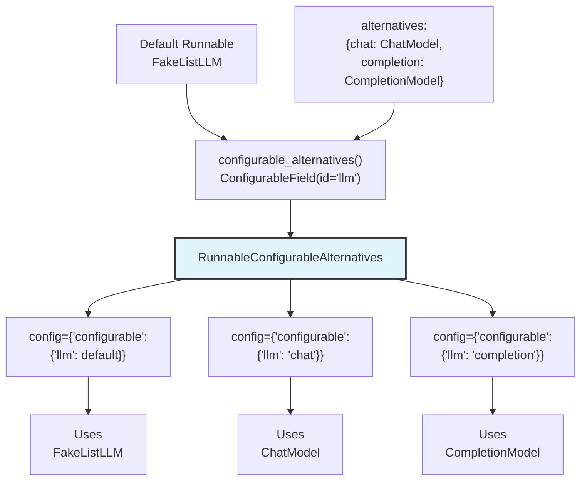

### Key Features

**`prefix_keys` Option**: When `True`, alternative-specific configurable fields are prefixed with the alternative name to avoid conflicts.

```python
fake_llm = FakeListLLM(responses=["a"]).configurable_fields(
    responses=ConfigurableField(id="responses")
).configurable_alternatives(
    ConfigurableField(id="llm", name="LLM"),
    chat=FakeChatModel().configurable_fields(
        responses=ConfigurableField(id="responses")
    ),
    prefix_keys=True
)

# Now alternatives use prefixed keys:
# - default: "responses"
# - chat alternative: "chat:responses"
```

### Alternative Factory Functions

Alternatives can be specified as:
- Direct `Runnable` instances
- Factory functions (called with no arguments)
- Factory functions using `functools.partial`

Sources: [libs/core/tests/unit_tests/runnables/test_runnable.py:872-881](), [libs/core/langchain_core/runnables/configurable.py:536-908]()

## Applying Configuration with with_config

The `with_config` method creates a new `Runnable` instance with bound configuration that will be merged with any config provided at invocation time.

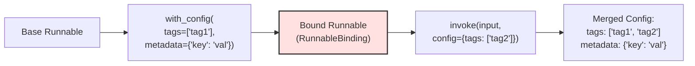

**Common Patterns:**

```python
# Bind tags for categorization
runnable = base_runnable.with_config(tags=["production", "api-v1"])

# Bind metadata for context
runnable = base_runnable.with_config(metadata={
    "user_id": "123",
    "session": "abc"
})

# Bind callbacks for monitoring
runnable = base_runnable.with_config(callbacks=[custom_handler])

# Bind run name for tracing
runnable = base_runnable.with_config(run_name="custom_chain")

# Bind configurable values
runnable = base_runnable.with_config(configurable={
    "llm_temperature": 0.7
})
```

Sources: [libs/core/langchain_core/runnables/base.py:2034-2061]()

## Retry Logic with with_retry

The `with_retry` method wraps a `Runnable` in a `RunnableRetry` that automatically retries on failure using configurable backoff logic. It is defined on the base `Runnable` class and delegates retry behavior to the `tenacity` library.

**`with_retry` parameters:**

| Parameter | Type | Default | Description |
|-----------|------|---------|-------------|
| `retry_if_exception_type` | `tuple[type[BaseException], ...]` | `(Exception,)` | Exception types that trigger a retry |
| `wait_exponential_jitter` | `bool` | `True` | Add random jitter to exponential backoff delays |
| `stop_after_attempt` | `int` | `3` | Maximum number of total attempts |

**Configuration flow:**

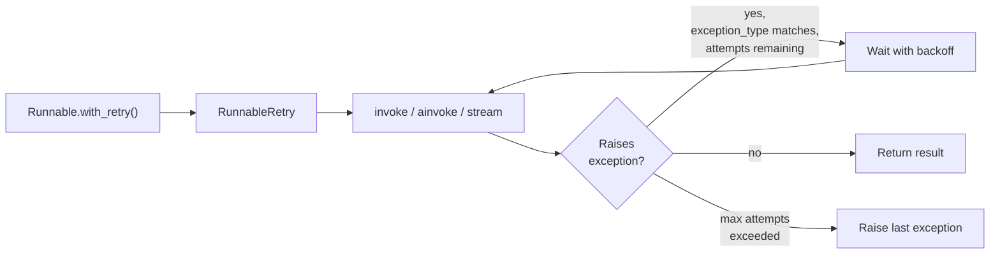

Sources: [libs/core/langchain_core/runnables/base.py:1-100]()

**Example from the `Runnable` docstring:**

```python
sequence = (
    RunnableLambda(add_one) |
    RunnableLambda(buggy_double).with_retry(
        stop_after_attempt=10,
        wait_exponential_jitter=False
    )
)
```

The `ExponentialJitterParams` type, imported in `libs/core/langchain_core/runnables/base.py`, defines the parameter schema for retry configuration. The `RunnableRetry` class itself lives in `libs/core/langchain_core/runnables/retry.py`.

Sources: [libs/core/langchain_core/runnables/base.py:1-120]()

---

## Fallback Chains with with_fallbacks

The `with_fallbacks` method wraps a `Runnable` in a `RunnableWithFallbacks`. If the primary runnable raises an exception, each fallback is attempted in order until one succeeds or all fail.

**Class:** `RunnableWithFallbacks` — defined in [libs/core/langchain_core/runnables/fallbacks.py:36-100]()

**Key fields on `RunnableWithFallbacks`:**

| Field | Type | Description |
|-------|------|-------------|
| `runnable` | `Runnable[Input, Output]` | The primary runnable to attempt first |
| `fallbacks` | `Sequence[Runnable[Input, Output]]` | Ordered list of fallback runnables |
| `exceptions_to_handle` | `tuple[type[BaseException], ...]` | Exception types that trigger a fallback (default: `(Exception,)`) |
| `exception_key` | `str \| None` | If set, passes the caught exception into the fallback's input dict under this key |

**Execution model:**

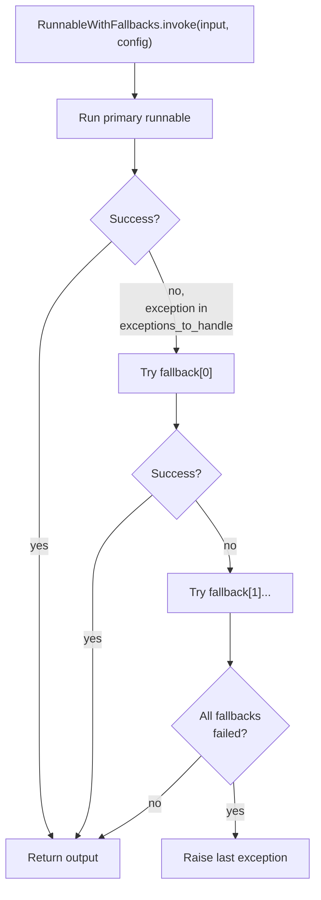

**Usage:**

```python
from langchain_anthropic import ChatAnthropic
from langchain_openai import ChatOpenAI

model = ChatAnthropic(model="claude-3-haiku-20240307").with_fallbacks(
    [ChatOpenAI(model="gpt-3.5-turbo-0125")]
)
model.invoke("hello")  # Uses Anthropic; falls back to OpenAI on error
```

**Chain-level fallback:** Fallbacks can be applied to full chains, not just individual models:

```python
from langchain_core.runnables import RunnableLambda

primary_chain = prompt | primary_llm | parser
fallback_chain = prompt | fallback_llm | parser

robust_chain = primary_chain.with_fallbacks([fallback_chain])
```

**`exception_key` usage**: When set, the caught exception object is passed into the fallback runnable's input dict, allowing the fallback to inspect the failure reason.

Sources: [libs/core/langchain_core/runnables/fallbacks.py:36-110](), [libs/core/tests/unit_tests/runnables/test_fallbacks.py:33-48]()

---

## Context Propagation

Configuration automatically propagates from parent to child runnables through the `var_child_runnable_config` context variable. This enables implicit context passing without explicit parameter threading.

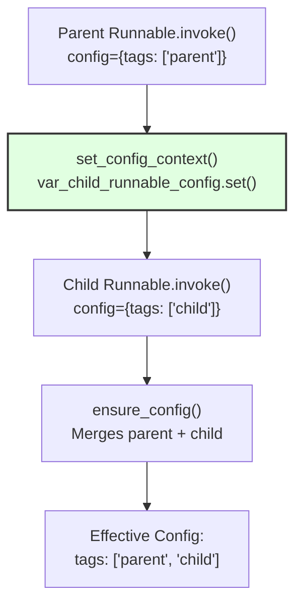

### Context Management

The `set_config_context` function establishes a context for child runnables:

1. Sets `var_child_runnable_config` context variable
2. Optionally sets tracing context for LangSmith integration
3. Returns a `Context` object for execution
4. Automatically cleaned up on exit

**Key Functions:**

- `var_child_runnable_config`: ContextVar storing current config
- `set_config_context(config)`: Context manager for config propagation
- `ensure_config(config)`: Reads from context var and merges with provided config

Sources: [libs/core/langchain_core/runnables/config.py:146-214]()

## Concurrency Control

The configuration system provides concurrency control through `max_concurrency` and executor management.

### Thread Pool Executor

The `ContextThreadPoolExecutor` extends `ThreadPoolExecutor` to preserve context variables when submitting tasks to worker threads.

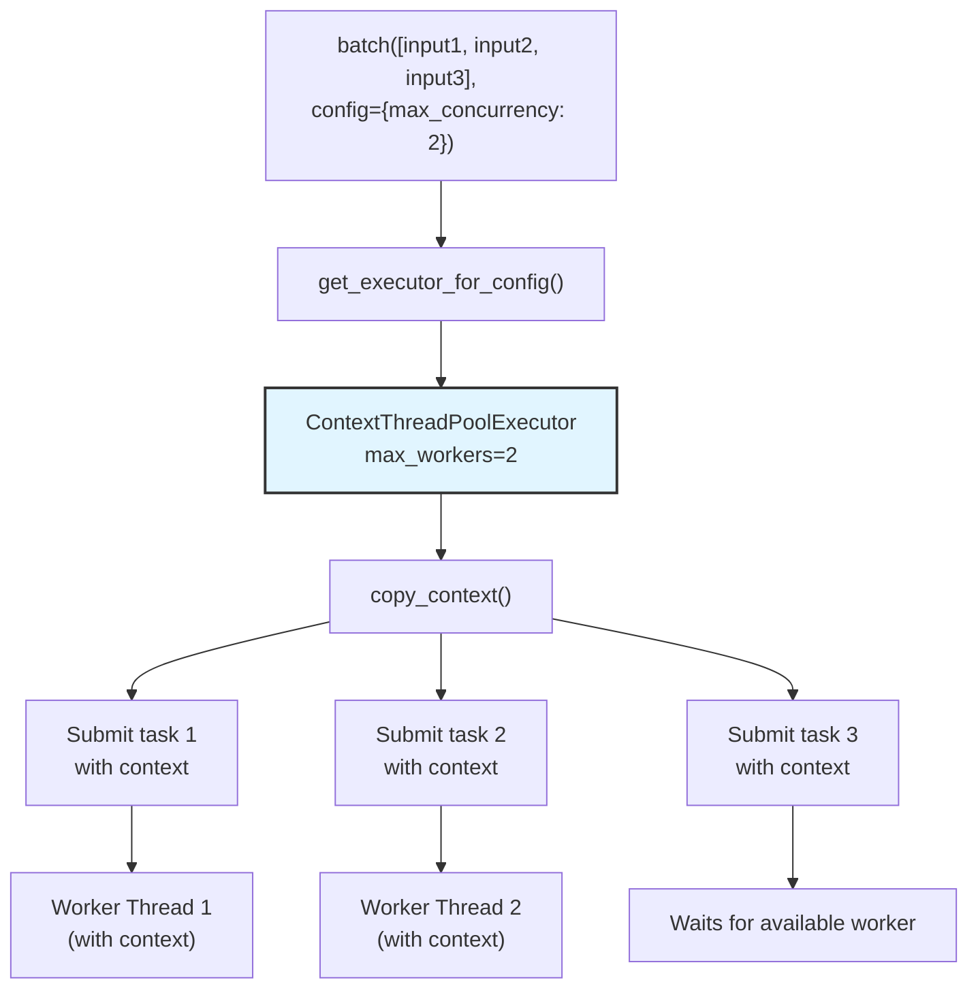

### Async Concurrency

For async operations, concurrency is controlled via semaphores in `gather_with_concurrency`:

```python
async def gather_with_concurrency(n: int | None, *coros: Coroutine):
    if n is None:
        return await asyncio.gather(*coros)
    
    semaphore = asyncio.Semaphore(n)
    return await asyncio.gather(*(gated_coro(semaphore, c) for c in coros))
```

Sources: [libs/core/langchain_core/runnables/config.py:527-596](), [libs/core/langchain_core/runnables/utils.py:49-78]()

## Callback Management

Configuration enables callback attachment and propagation through the execution hierarchy.

### Callback Manager Creation

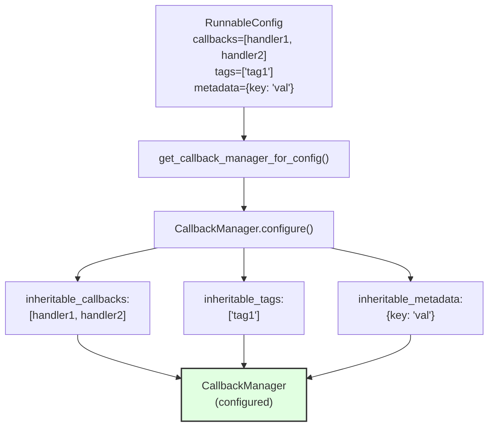

### Callback Propagation

When a `Runnable` invokes a child, callbacks are propagated:

1. Parent's callback manager creates child callback manager via `get_child()`
2. Child inherits inheritable handlers, tags, and metadata
3. Child's run becomes nested under parent run in traces
4. Non-inheritable callbacks remain at parent level only

**Functions:**

- `get_callback_manager_for_config(config)`: Creates sync callback manager
- `get_async_callback_manager_for_config(config)`: Creates async callback manager
- `patch_config(config, callbacks=run_manager.get_child())`: Updates config with child callbacks

Sources: [libs/core/langchain_core/runnables/config.py:489-520](), [libs/core/langchain_core/callbacks/manager.py:489-503]()

## Configuration Schema and Validation

Runnables expose their configurable fields through schema methods for introspection and validation.

### config_specs Property

The `config_specs` property returns a list of `ConfigurableFieldSpec` objects describing available configuration options:

```python
runnable = base_runnable.configurable_fields(
    temperature=ConfigurableField(
        id="llm_temperature",
        name="Temperature",
        description="Controls randomness"
    )
)

specs = runnable.config_specs
# Returns: [ConfigurableFieldSpec(id="llm_temperature", ...)]
```

### config_schema Method

The `config_schema` method generates a Pydantic model representing valid configuration structure:

```python
schema_model = runnable.config_schema(include=["tags", "metadata", "configurable"])