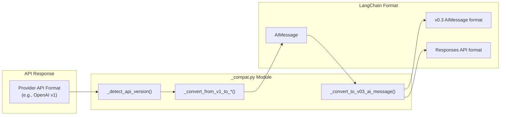
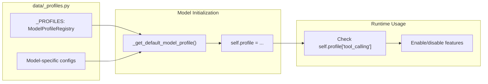

for chunk in model.stream("Hello", stream_usage=False):
    assert chunk.usage_metadata is None
```

**Provider defaults:**

| Provider | Default `stream_usage` | Notes |
|----------|----------------------|-------|
| **OpenAI** | `True` (if default `base_url`) | Set to `False` for custom endpoints |
| **Anthropic** | `True` | Always enabled |
| **Groq** | `True` | Always enabled |
| **Mistral** | N/A | Not supported in streaming |

**Sources:**
- [libs/partners/openai/langchain_openai/chat_models/base.py:654-669]()
- [libs/partners/openai/langchain_openai/chat_models/base.py:990-1009]()
- [libs/partners/anthropic/langchain_anthropic/chat_models.py:840-841]()
- [libs/partners/openai/tests/integration_tests/chat_models/test_base.py:156-174]()

### Server-Sent Events (SSE) Streaming

Mistral uses httpx-sse for streaming, which requires special handling:

```python
from httpx_sse import connect_sse, aconnect_sse

# Synchronous streaming
with connect_sse(
    self._client, "POST", url, json=payload, headers=headers
) as event_source:
    for sse in event_source.iter_sse():
        chunk = self._parse_stream_chunk(sse.data)
        yield chunk

# Asynchronous streaming
async with aconnect_sse(
    self._async_client, "POST", url, json=payload, headers=headers
) as event_source:
    async for sse in event_source.aiter_sse():
        chunk = self._parse_stream_chunk(sse.data)
        yield chunk
```

**Sources:**
- [libs/partners/mistralai/langchain_mistralai/chat_models.py]()

---

## Compatibility Layers and API Versioning

Providers often need compatibility layers to handle API changes and multiple output formats.

### Compatibility Layer Architecture

**Diagram: Version Translation Flow**



### OpenAI Compatibility Layer

OpenAI maintains multiple compatibility functions in `_compat.py`:

**Key functions:**
- `_convert_from_v1_to_chat_completions()` - Convert v1 format to Chat Completions API
- `_convert_from_v1_to_responses()` - Convert v1 format to Responses API
- `_convert_to_v03_ai_message()` - Convert to v0.3 LangChain format
- `_convert_from_v03_ai_message()` - Convert from v0.3 LangChain format

**Output version handling:**

```python
# Models support multiple output versions via output_version parameter
model = ChatOpenAI(
    model="gpt-5",
    output_version="responses/v1"  # or "v0", "v1"
)
```

| Output Version | Description | Content Format |
|---------------|-------------|----------------|
| `"v0"` | Legacy format (pre-0.3) | Standard message content |
| `"responses/v1"` | Responses API format | Structured output items as content blocks |
| `"v1"` | LangChain v1 standard | Cross-provider standard format |

**Sources:**
- [libs/partners/openai/langchain_openai/chat_models/_compat.py]()
- [libs/partners/openai/langchain_openai/chat_models/base.py:817-835]()

### Anthropic Compatibility Layer

Anthropic uses `_compat.py` for message format conversion:

**Key function:**
- `_convert_from_v1_to_anthropic()` - Handles v1 to Anthropic format conversion

**Built-in tool detection:**

The compatibility layer must handle built-in tools differently from custom tools:

```python
def _is_builtin_tool(tool: Any) -> bool:
    if not isinstance(tool, dict):
        return False
    tool_type = tool.get("type")
    if not tool_type or not isinstance(tool_type, str):
        return False
    return any(tool_type.startswith(prefix) for prefix in _BUILTIN_TOOL_PREFIXES)
```

**Sources:**
- [libs/partners/anthropic/langchain_anthropic/_compat.py]()
- [libs/partners/anthropic/langchain_anthropic/chat_models.py:171-187]()

### Mistral and Groq Compatibility

These providers use similar compatibility patterns:

**Mistral:**
- `_convert_from_v1_to_mistral()` - Handles v1 to Mistral format
- Reasoning content handling for thinking blocks

**Groq:**
- `_convert_from_v1_to_groq()` - Handles v1 to Groq format
- Reasoning format support (`parsed`, `raw`, `hidden`)

**Sources:**
- [libs/partners/mistralai/langchain_mistralai/_compat.py]()
- [libs/partners/groq/langchain_groq/_compat.py]()

---

## Model Profiles and Capabilities

All providers define model capabilities through standardized profiles.

### Model Profile Structure

**Diagram: Profile Usage Flow**



### Profile Definition Pattern

```python