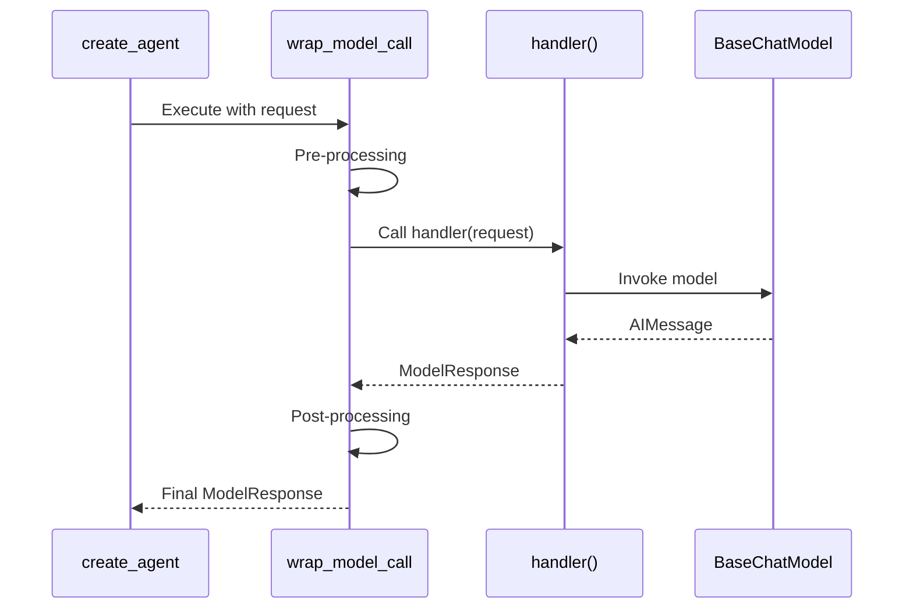
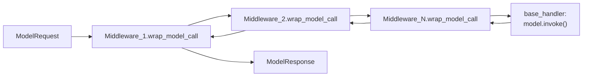

@before_model(can_jump_to=["end"])
def early_exit_middleware(state: AgentState, runtime: Runtime) -> dict | None:
    if some_condition(state):
        return {"jump_to": "end"}  # Skip model call
    return None
```

The `@hook_config` decorator or decorator parameters specify allowed jump destinations:

```python
class MyMiddleware(AgentMiddleware):
    @hook_config(can_jump_to=["tools", "end"])
    def after_model(self, state: AgentState, runtime: Runtime) -> dict | None:
        if needs_retry:
            return {"jump_to": "tools"}  # Force tool execution
        return None
```

**Sources:** [libs/langchain_v1/langchain/agents/middleware/types.py:746-797](), [libs/langchain_v1/langchain/agents/middleware/types.py:819-829]()

### Wrapper Hooks (wrap_model_call, wrap_tool_call)

Wrapper hooks intercept execution via a handler callback pattern:



Example implementations:

```python
# Retry middleware
def wrap_model_call(self, request: ModelRequest, handler: Callable) -> ModelResponse:
    for attempt in range(3):
        try:
            return handler(request)
        except Exception:
            if attempt == 2:
                raise
    
# Fallback middleware
def wrap_model_call(self, request: ModelRequest, handler: Callable) -> ModelResponse:
    try:
        return handler(request)
    except Exception:
        fallback_request = request.override(model=self.fallback_model)
        return handler(fallback_request)
```

**Sources:** [libs/langchain_v1/langchain/agents/middleware/types.py:384-529](), [libs/langchain_v1/langchain/agents/middleware/model_fallback.py:69-101]()

## Middleware Composition and Chaining

### wrap_model_call Composition

Multiple `wrap_model_call` handlers compose into a nested middleware stack via `_chain_model_call_handlers`:



The composition function implements right-to-left nesting:

```python
# From _chain_model_call_handlers
def compose_two(outer, inner):
    def composed(request, handler):
        def inner_handler(req):
            inner_result = inner(req, handler)
            return _normalize_to_model_response(inner_result)
        
        outer_result = outer(request, inner_handler)
        return _normalize_to_model_response(outer_result)
    return composed

# For middleware = [M1, M2, M3]:
# Results in nested execution: M1(M2(M3(base_handler)))
```

Each middleware receives a `handler` callback that represents all inner layers, enabling retry logic, fallbacks, and caching.

**Sources:** [libs/langchain_v1/langchain/agents/factory.py:86-196](), [libs/langchain_v1/langchain/agents/factory.py:846-855]()

### wrap_tool_call Composition

Tool call wrappers compose similarly via `_chain_tool_call_wrappers`, applied independently to each tool call:

```python