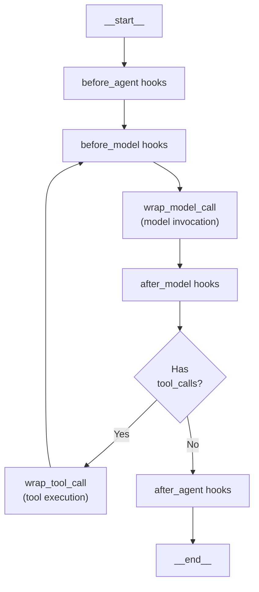
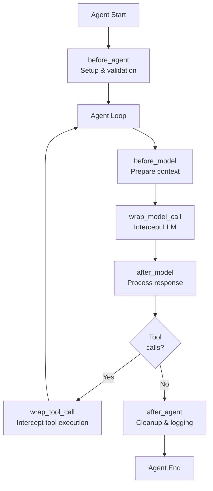
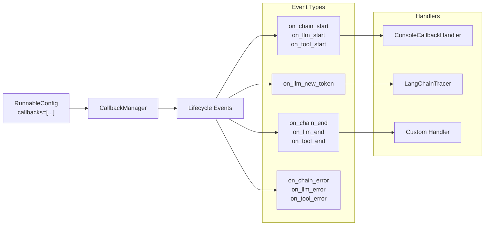

result = agent.invoke({
    "messages": [{"role": "user", "content": "What is LangChain?"}]
})
```

Sources: [libs/langchain_v1/langchain/agents/factory.py:543-688]()

**Agent Execution Loop**



Sources: [libs/langchain_v1/langchain/agents/factory.py:920-1337](), [libs/langchain_v1/langchain/agents/middleware/types.py:343-757]()

### Agent State and Components

The `AgentState` from [libs/langchain_v1/langchain/agents/middleware/types.py:313-319]() manages conversation state:

| State Field | Type | Purpose |
|-------------|------|---------|
| `messages` | `list[AnyMessage]` | Conversation history with `add_messages` reducer |
| `structured_response` | `ResponseT` | Parsed output when using `response_format` |
| `jump_to` | `JumpTo` | Internal flow control (ephemeral, not in I/O) |

**Agent Factory Parameters**

```python
agent = create_agent(
    model="openai:gpt-4o",              # str or BaseChatModel
    tools=[tool1, tool2],                # list[BaseTool | Callable | dict]
    system_prompt="Instructions",        # str or SystemMessage
    middleware=[middleware1, middleware2], # list[AgentMiddleware]
    response_format=ResponseSchema,      # For structured output
    state_schema=CustomState,            # Extend AgentState
    checkpointer=MemorySaver(),          # For persistence
    store=InMemoryStore(),               # Cross-thread data
    interrupt_before=["tools"],          # Human-in-the-loop
    debug=True                           # Verbose logging
)
```

Sources: [libs/langchain_v1/langchain/agents/factory.py:543-688](), [libs/langchain_v1/langchain/agents/middleware/types.py:313-332]()

### ModelRequest and ModelResponse

Middleware hooks receive `ModelRequest` and return `ModelResponse` objects from [libs/langchain_v1/langchain/agents/middleware/types.py:88-279]():

**ModelRequest Structure**

```python
@dataclass
class ModelRequest:
    model: BaseChatModel
    messages: list[AnyMessage]         # Excluding system message
    system_message: SystemMessage | None
    tool_choice: Any | None
    tools: list[BaseTool | dict]
    response_format: ResponseFormat | None
    state: AgentState
    runtime: Runtime
    model_settings: dict[str, Any]
    
    # Immutable - create modified copies
    def override(self, **kwargs) -> ModelRequest:
        return replace(self, **kwargs)
```

**ModelResponse Structure**

```python
@dataclass
class ModelResponse:
    result: list[BaseMessage]           # Usually [AIMessage]
    structured_response: Any = None     # Parsed structured output
```

Sources: [libs/langchain_v1/langchain/agents/middleware/types.py:88-279]()

### Execution Modes

```python
# Synchronous invoke - get final result
result = agent.invoke({"messages": [...]})

# Stream state updates - see each node completion
for chunk in agent.stream({"messages": [...]}, stream_mode="updates"):
    print(chunk)  # {"model": {...}, "tools": {...}}

# Stream messages - get token-by-token output
for msg, metadata in agent.stream({"messages": [...]}, stream_mode="messages"):
    print(msg.content, end="", flush=True)

# Async execution
result = await agent.ainvoke({"messages": [...]})
async for chunk in agent.astream({"messages": [...]}, stream_mode="updates"):
    print(chunk)
```

For detailed coverage of structured output, tool integration, and advanced agent patterns, see [Agent System with Middleware](#4.1).

Sources: [libs/langchain_v1/langchain/agents/factory.py:543-688]()

## Middleware Architecture

Middleware from [libs/langchain_v1/langchain/agents/middleware/types.py:343-757]() provides extension points throughout the agent loop. Each `AgentMiddleware` subclass implements hooks that intercept and modify agent behavior.

**Middleware Hook Points**



Sources: [libs/langchain_v1/langchain/agents/middleware/types.py:343-757]()

### Middleware Hook Signatures

| Hook | Signature | Returns | Purpose |
|------|-----------|---------|---------|
| `before_agent` | `(state, runtime)` | `dict[str, Any] \| None` | Setup, validation |
| `before_model` | `(state, runtime)` | `dict[str, Any] \| None` | Context preparation, can set `jump_to` |
| `wrap_model_call` | `(request, handler)` | `ModelResponse \| AIMessage` | Intercept model call, retry logic |
| `after_model` | `(state, runtime)` | `dict[str, Any] \| None` | Post-process response, can set `jump_to` |
| `wrap_tool_call` | `(request, handler)` | `ToolMessage \| Command` | Intercept tool execution, retry logic |
| `after_agent` | `(state, runtime)` | `dict[str, Any] \| None` | Cleanup, final logging |

All hooks have async variants (`abefore_agent`, `awrap_model_call`, etc.).

Sources: [libs/langchain_v1/langchain/agents/middleware/types.py:364-757]()

### Built-in Middleware

[libs/langchain_v1/langchain/agents/middleware/__init__.py:1-76]() exports these middleware implementations:

| Middleware | File | Purpose |
|------------|------|---------|
| `SummarizationMiddleware` | [summarization.py:151-651]() | Summarizes old messages when token limits reached |
| `HumanInTheLoopMiddleware` | [human_in_the_loop.py:161-382]() | Pauses for human approval of tool calls |
| `ShellToolMiddleware` | [shell_tool.py:555-877]() | Persistent shell with execution policies |
| `ToolRetryMiddleware` | [tool_retry.py:30-331]() | Retries failed tools with exponential backoff |
| `ModelRetryMiddleware` | [model_retry.py]() | Retries failed model calls with backoff |
| `ToolCallLimitMiddleware` | [tool_call_limit.py:137-457]() | Limits tool calls per thread/run |
| `ModelCallLimitMiddleware` | [model_call_limit.py:52-266]() | Limits model calls per thread/run |
| `ModelFallbackMiddleware` | [model_fallback.py:21-136]() | Falls back to alternative models on failure |
| `PIIMiddleware` | [pii.py:30-283]() | Detects and redacts PII (emails, credit cards, IPs) |
| `LLMToolSelectorMiddleware` | [tool_selection.py:91-348]() | Uses LLM to filter available tools |
| `TodoListMiddleware` | [todo.py:133-310]() | Maintains task list for multi-step work |
| `ContextEditingMiddleware` | [context_editing.py:185-292]() | Clears old tool results to manage context |
| `LLMToolEmulator` | [tool_emulator.py:22-178]() | Emulates tools with LLM for testing |

**Summarization Middleware Example**

```python
from langchain.agents.middleware import SummarizationMiddleware

middleware = SummarizationMiddleware(
    model="openai:gpt-4o-mini",
    trigger=("tokens", 50000),      # Trigger at 50k tokens
    keep=("messages", 20)            # Keep 20 recent messages
)

agent = create_agent(
    model="openai:gpt-4o",
    tools=[search_tool, calculator],
    middleware=[middleware]
)
```

The middleware monitors token usage via [summarization.py:379-405]() and triggers summarization via [summarization.py:286-358]() when limits are exceeded.

**Human-in-the-Loop Middleware Example**

```python
from langchain.agents.middleware import HumanInTheLoopMiddleware

middleware = HumanInTheLoopMiddleware(
    interrupt_on={
        "delete_file": {
            "allowed_decisions": ["approve", "edit", "reject"],
            "description": "This will permanently delete a file"
        }
    }
)

agent = create_agent(
    model="openai:gpt-4o",
    tools=[delete_file, read_file],
    middleware=[middleware]
)
```

When `delete_file` is called, [human_in_the_loop.py:282-367]() creates an `HITLRequest` interrupt, pausing execution until the user provides an `HITLResponse`.

For detailed implementation patterns and creating custom middleware, see [Middleware Implementations](#4.2).

Sources: [libs/langchain_v1/langchain/agents/middleware/__init__.py:1-76](), [libs/langchain_v1/langchain/agents/middleware/summarization.py:151-651](), [libs/langchain_v1/langchain/agents/middleware/human_in_the_loop.py:161-382]()

## Observability with Callbacks

The callback system provides observability into agent execution. Callbacks are passed through `RunnableConfig` and invoked at lifecycle events.

**Callback Flow**



**Basic Usage**

```python
from langchain_core.tracers import ConsoleCallbackHandler