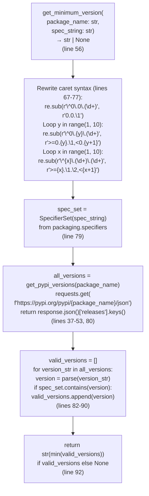
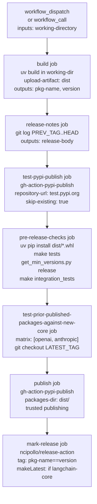

uv run --no-sync pytest ./tests/ --codspeed
```

**Modes:**
- `walltime`: For `libs/core` - measures actual execution time
- `instrumentation`: For partner packages - instruments code for detailed performance data

**Sources:** [.github/workflows/check_diffs.yml:175-233]()

---

## Minimum Version Testing

### Purpose and Strategy

The minimum version testing ensures packages work with the oldest supported dependency versions, preventing accidental requirements creep. This is implemented via `get_min_versions.py` at [.github/scripts/get_min_versions.py:1-200]().

**Targeted libraries** defined in `MIN_VERSION_LIBS` list at [.github/scripts/get_min_versions.py:20-26]():
```python
MIN_VERSION_LIBS = [
    "langchain-core",
    "langchain",
    "langchain-text-splitters",
    "numpy",
    "SQLAlchemy",
]
```

**Testing contexts and filtering:**

| Context | `versions_for` Parameter | Skipped Libraries | Rationale |
|---------|-------------------------|-------------------|-----------|
| Pull requests | `"pull_request"` | `SKIP_IF_PULL_REQUEST = ["langchain-core", "langchain-text-splitters", "langchain"]` | Core libraries may have simultaneous changes requiring coordinated releases |
| Releases | `"release"` | None (empty list) | All libraries in `MIN_VERSION_LIBS` are tested |

**Implementation:** The `get_min_version_from_toml()` function at [.github/scripts/get_min_versions.py:111-152]() checks at line 132:
```python
if versions_for == "pull_request" and lib in SKIP_IF_PULL_REQUEST:
    continue
```

**Sources:** [.github/scripts/get_min_versions.py:20-34](), [.github/scripts/get_min_versions.py:130-135]()

### Version Resolution Algorithm

The `get_minimum_version()` function at [.github/scripts/get_min_versions.py:56-92]() resolves the minimum compatible version from PyPI:

**Diagram: `get_minimum_version()` Function Logic Flow**



**Caret syntax handling** at [.github/scripts/get_min_versions.py:66-77]():

| Input | Rewritten Constraint | Explanation |
|-------|---------------------|-------------|
| `^0.0.5` | `0.0.5` | Exact version for 0.0.x |
| `^0.2.1` | `>=0.2.1,<0.3` | Compatible with 0.2.x |
| `^1.2.3` | `>=1.2.3,<2` | Compatible with 1.x |

**Sources:** [.github/scripts/get_min_versions.py:56-92]()

### Python Version Marker Handling

The `_check_python_version_from_requirement()` function respects `python_version` markers in dependencies:

```python
if "python_version" in marker_str or "python_full_version" in marker_str:
    python_version_str = "".join(
        char for char in marker_str
        if char.isdigit() or char in (".", "<", ">", "=", ",")
    )
    return check_python_version(python_version, python_version_str)
```

**Marker extraction:** Strips non-numeric/operator characters from `marker_str` to extract constraints like `>=3.9,<4.0`

**Validation:** Calls `check_python_version(python_version, python_version_str)` which converts to `Version` and checks against `SpecifierSet`

This ensures dependencies with Python version restrictions (e.g., `dependency; python_version >= "3.9"`) are only included in minimum version calculations for compatible Python versions.

**Sources:** [.github/scripts/get_min_versions.py:94-187]()

---

## Release Pipeline

### 7-Stage Release Workflow

The `_release.yml` workflow implements a secure, multi-stage release pipeline:



**Sources:** [.github/workflows/_release.yml:1-557]()

### Security Design

**Permission separation:**
```yaml