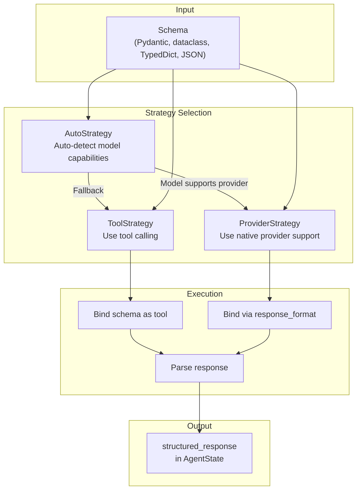

tool_node = ToolNode(
    tools=available_tools,  # middleware_tools + regular_tools
    wrap_tool_call=wrap_tool_call_wrapper,  # Composed sync wrapper
    awrap_tool_call=awrap_tool_call_wrapper,  # Composed async wrapper
)
```

| Component | Purpose | Code Reference |
|-----------|---------|----------------|
| `tools` | List of `BaseTool` instances from middleware and user | [libs/langchain_v1/langchain/agents/factory.py:771-776]() |
| `wrap_tool_call` | Synchronous tool interception handler (chained via `_chain_tool_call_wrappers`) | [libs/langchain_v1/langchain/agents/factory.py:748-751]() |
| `awrap_tool_call` | Asynchronous tool interception handler (chained via `_chain_async_tool_call_wrappers`) | [libs/langchain_v1/langchain/agents/factory.py:764-767]() |

The `ToolNode` executes each tool call through the composed wrapper chain, allowing middleware to intercept, retry, or modify tool execution.

**Sources:** [libs/langchain_v1/langchain/agents/factory.py:733-787](), [libs/langchain_v1/langchain/agents/factory.py:1088-1149]()

## Structured Output with ResponseFormat

### ResponseFormat Strategies



**Sources:** [libs/langchain_v1/langchain/agents/structured_output.py:180-286](), [libs/langchain_v1/langchain/agents/factory.py:700-729]()

### ToolStrategy

Uses tool calling to enforce structured output, with configurable error handling:

```python
ToolStrategy(
    schema=WeatherResponse,
    tool_message_content="Returning weather data",
    handle_errors=True  # or False, str, Exception types, Callable
)
```

| Parameter | Type | Purpose |
|-----------|------|---------|
| `schema` | Type or Union | Response schema(s) - supports Pydantic, dataclass, TypedDict, JSON schema |
| `schema_specs` | `list[_SchemaSpec]` | Computed list of schema specifications (auto-generated) |
| `tool_message_content` | `str \| None` | Message content for successful structured output `ToolMessage` |
| `handle_errors` | Various | Error handling strategy (see below) |

**Error Handling Options:**

| Value | Behavior | Implementation |
|-------|----------|----------------|
| `True` | Retry with default error template | Uses `STRUCTURED_OUTPUT_ERROR_TEMPLATE` |
| `False` | No retry, raise exception | Propagates `StructuredOutputValidationError` |
| `str` | Retry with custom message | Uses provided string as error message |
| `type[Exception]` | Retry only for specific exception | Checks `isinstance(exception, exc_type)` |
| `tuple[type[Exception], ...]` | Retry for multiple exception types | Checks against all types |
| `Callable[[Exception], str]` | Custom error message generator | Calls function with exception |

The retry mechanism creates artificial `ToolMessage` objects with error content, allowing the model to fix mistakes in subsequent turns.

**Sources:** [libs/langchain_v1/langchain/agents/structured_output.py:191-254](), [libs/langchain_v1/langchain/agents/factory.py:406-430]()

### ProviderStrategy

Uses model provider's native structured output mechanism (e.g., OpenAI's `response_format`):

```python
ProviderStrategy(
    schema=WeatherResponse,
    strict=True  # Request strict schema validation
)
```

The strategy is converted to model binding kwargs via `to_model_kwargs()`:

```python