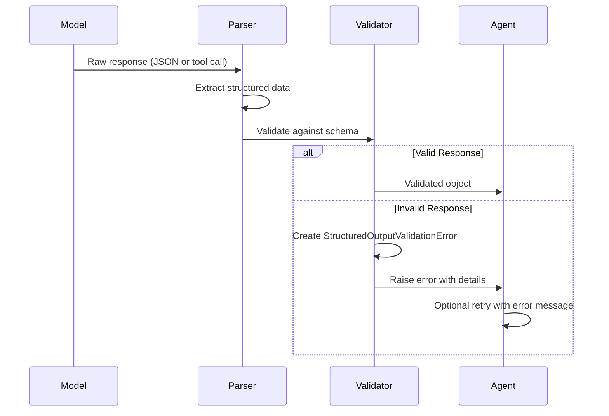
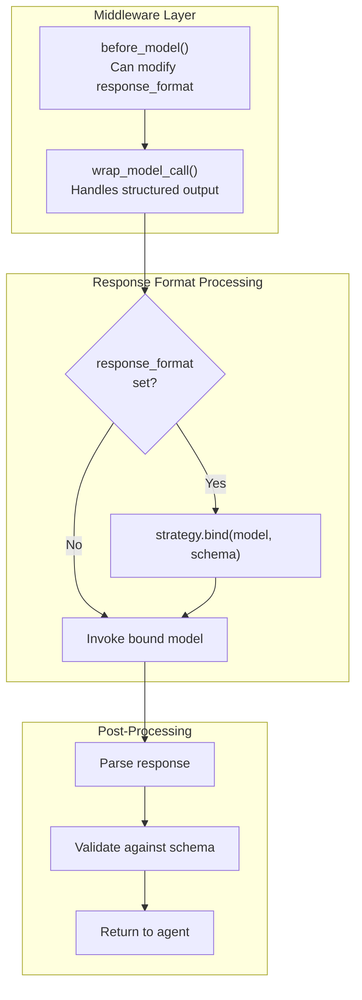

def with_structured_output(
    schema: dict | type,
    *,
    method: Literal["function_calling", "json_mode"] = "function_calling",
    include_raw: bool = False,
    **kwargs: Any,
) -> Runnable:
```

**Supported Methods:**

| Method | Mistral Models | Implementation |
|--------|----------------|----------------|
| `function_calling` | All tool-capable | Uses `tools` and `tool_choice` |
| `json_mode` | Mistral Large+ | Uses `response_format={"type": "json_object"}` |

Sources: [libs/partners/mistralai/langchain_mistralai/chat_models.py:600-800]()

## Validation and Error Handling

### Validation Flow



Sources: [libs/langchain_v1/langchain/agents/structured_output.py]()

### Error Types

**StructuredOutputError Hierarchy:**

```
StructuredOutputError (Base)
├── StructuredOutputValidationError
│   └── Raised when output doesn't match schema
└── MultipleStructuredOutputsError
    └── Raised when multiple response formats requested
```

**Error Recovery Strategy:**

When validation fails, the agent can:

1. **Add Error to Messages**: Include validation error in conversation history
2. **Retry with Guidance**: Send error message template to guide the model
3. **Fallback**: Use alternative strategy if available

Sources: [libs/langchain_v1/langchain/agents/structured_output.py](), [libs/langchain_v1/langchain/agents/factory.py:107-108]()

## Integration with Agent System

### Middleware Integration

Structured outputs are configured through the `ModelRequest.response_format` field in middleware:



Sources: [libs/langchain_v1/langchain/agents/factory.py:400-600]()

### Dynamic Response Format Configuration

Middleware can dynamically set or modify response formats:

**Example Use Cases:**

1. **Conditional Formatting**: Different schemas based on conversation state
2. **Multi-Step Validation**: Progressive refinement of outputs
3. **Fallback Strategies**: Switch methods if validation fails repeatedly

Sources: [libs/langchain_v1/langchain/agents/middleware/types.py:76-86]()

## Usage Patterns

### Basic Structured Output

```python
# Direct model usage
from pydantic import BaseModel
from langchain_openai import ChatOpenAI

class Response(BaseModel):
    answer: str
    confidence: float

model = ChatOpenAI(model="gpt-4o")
structured_model = model.with_structured_output(Response)
result = structured_model.invoke("What is the capital of France?")
# result is validated Response instance
```

Sources: [libs/partners/openai/tests/integration_tests/chat_models/test_base.py:500-600]()

### Agent with Response Format

```python