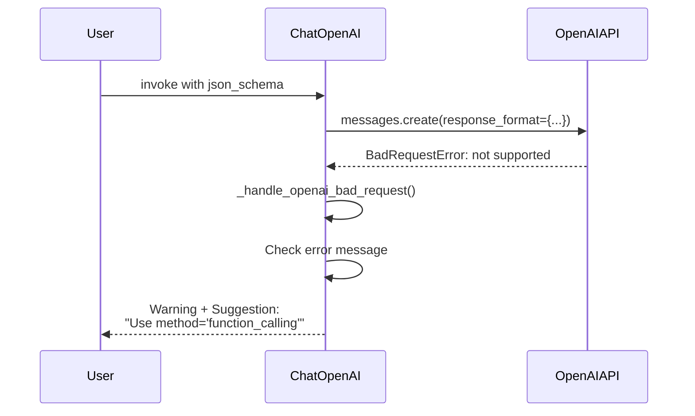

def _convert_to_openai_response_format(
    schema: dict | type[BaseModel],
    name: str | None = None,
    description: str | None = None,
) -> dict[str, Any]:
    """Convert schema to OpenAI response_format parameter."""
```

This handles:
- Pydantic model to JSON schema conversion
- Schema name and description injection
- Validation of schema against OpenAI's constraints

Sources: [libs/partners/openai/langchain_openai/chat_models/base.py:2400-2500]()

### Error Handling for Unsupported Models

OpenAI implements specific error handling for models that don't support structured outputs:



The error handler checks for:
- `"response_format' of type 'json_schema' is not supported"`
- `"Invalid schema for response_format"`

And provides actionable guidance to users.

Sources: [libs/partners/openai/langchain_openai/chat_models/base.py:495-524]()

## Anthropic Implementation

### with_structured_output Method

Anthropic's implementation uses tool calling as the primary mechanism:

```python