class CustomSerializer:
    """Custom serializer for VCR cassettes using YAML and gzip."""
    
    @staticmethod
    def serialize(cassette_dict: dict[str, Any]) -> bytes:
        """Convert cassette to YAML and compress it."""
        cassette_dict["requests"] = [
            {
                "method": request.method,
                "uri": request.uri,
                "body": request.body,
                "headers": {k: [v] for k, v in request.headers.items()},
            }
            for request in cassette_dict["requests"]
        ]
        yml = yaml.safe_dump(cassette_dict)
        return gzip.compress(yml.encode("utf-8"))
    
    @staticmethod
    def deserialize(data: bytes) -> dict[str, Any]:
        """Decompress data and convert it from YAML."""
        decoded_yaml = gzip.decompress(data).decode("utf-8")
        cassette = cast("dict[str, Any]", yaml.safe_load(decoded_yaml))
        cassette["requests"] = [Request._from_dict(r) for r in cassette["requests"]]
        return cassette
```

The `CustomPersister` class ([libs/standard-tests/langchain_tests/conftest.py:55-88]()) handles file I/O with automatic directory creation.

**Sources**: [libs/standard-tests/langchain_tests/conftest.py:20-88]()

## Release Testing and Quality Gates

The `_release.yml` workflow ([.github/workflows/_release.yml:7]()) implements a five-stage release process: build, test-pypi-publish, pre-release-checks, test-prior-published-packages-against-new-core, and publish/mark-release.

### Release Pipeline Stages

Title: Multi-Stage Release Workflow from _release.yml

```mermaid
graph TB
    subgraph "build Job (Isolated Environment)"
        BUILD_CHECK["if: github.ref == 'refs/heads/master'<br/>|| inputs.dangerous-nonmaster-release"]
        BUILD_RUN["uv_setup action<br/>uv build<br/>working-directory: ${{ inputs.working-directory }}"]
        EXTRACT["Python script:<br/>tomllib.load('pyproject.toml')<br/>pkg_name = data['project']['name']<br/>version = data['project']['version']"]
        UPLOAD_ARTIFACT["actions/upload-artifact@v6<br/>name: dist<br/>path: dist/"]
    end
    
    subgraph "release-notes Job"
        CHECK_TAGS["Git tag logic:<br/>PREV_TAG = {pkg}=={version}.{patch-1}<br/>git log --format='%s' $PREV_TAG..HEAD"]
        GEN_BODY["release-body output:<br/>'Changes since $PREV_TAG'<br/>+ git log output"]
    end
    
    subgraph "test-pypi-publish Job"
        DOWNLOAD_DIST["actions/download-artifact@v7<br/>name: dist"]
        PUBLISH_TEST["pypa/gh-action-pypi-publish@release/v1<br/>packages-dir: dist/<br/>repository-url: https://test.pypi.org/legacy/<br/>skip-existing: true"]
    end
    
    subgraph "pre-release-checks Job"
        IMPORT_TEST["uv venv<br/>VIRTUAL_ENV=.venv uv pip install dist/*.whl<br/>uv run python -c 'import $IMPORT_NAME'"]
        PRERELEASE_CHK["check_prerelease_dependencies.py pyproject.toml<br/>(blocks if any deps allow prerelease)"]
        UNIT_CURR["uv sync --group test<br/>make tests"]
        MIN_CALC["get_min_versions.py pyproject.toml release $python_version"]
        UNIT_MIN["VIRTUAL_ENV=.venv uv pip install $MIN_VERSIONS<br/>make tests"]
        INT_RUN["if: startsWith(working-directory, 'libs/partners/')<br/>uv sync --group test_integration<br/>make integration_tests"]
    end
    
    subgraph "test-prior-published-packages-against-new-core Job"
        CORE_CHK["if: startsWith(working-directory, 'libs/core')"]
        FETCH_TAG["git ls-remote --tags origin 'langchain-${{ matrix.partner }}*'<br/>| grep -E '[0-9]+\\.[0-9]+\\.[0-9]+$'<br/>| sort -Vr | head -n 1"]
        CHECKOUT_OLD["git checkout $LATEST_PACKAGE_TAG --<br/>standard-tests/ partners/${{ matrix.partner }}/"]
        INSTALL_NEW_CORE["uv pip install ../../core/dist/*.whl"]
        TEST_COMPAT["cd partners/${{ matrix.partner }}<br/>make integration_tests"]
    end
    
    subgraph "publish Job"
        PUBLISH_PROD["pypa/gh-action-pypi-publish@release/v1<br/>permissions: id-token: write<br/>Trusted publishing"]
    end
    
    subgraph "mark-release Job"
        CREATE_TAG["ncipollo/release-action@v1<br/>tag: ${{pkg-name}}==${{version}}<br/>body: ${{ release-notes.outputs.release-body }}"]
    end
    
    BUILD_CHECK --> BUILD_RUN
    BUILD_RUN --> EXTRACT
    EXTRACT --> UPLOAD_ARTIFACT
    
    UPLOAD_ARTIFACT --> CHECK_TAGS
    CHECK_TAGS --> GEN_BODY
    
    GEN_BODY --> DOWNLOAD_DIST
    DOWNLOAD_DIST --> PUBLISH_TEST
    
    PUBLISH_TEST --> IMPORT_TEST
    IMPORT_TEST --> PRERELEASE_CHK
    PRERELEASE_CHK --> UNIT_CURR
    UNIT_CURR --> MIN_CALC
    MIN_CALC --> UNIT_MIN
    UNIT_MIN --> INT_RUN
    
    INT_RUN --> CORE_CHK
    CORE_CHK --> FETCH_TAG
    FETCH_TAG --> CHECKOUT_OLD
    CHECKOUT_OLD --> INSTALL_NEW_CORE
    INSTALL_NEW_CORE --> TEST_COMPAT
    
    TEST_COMPAT --> PUBLISH_PROD
    INT_RUN --> PUBLISH_PROD
    PUBLISH_PROD --> CREATE_TAG
```



**Sources**: [.github/workflows/_release.yml:7-622]()

### Build Isolation for Security

The build and publish jobs use separate permission sets ([.github/workflows/_release.yml:45-50](), [.github/workflows/_release.yml:547-553]()) to prevent compromised build dependencies from accessing PyPI credentials:

```yaml