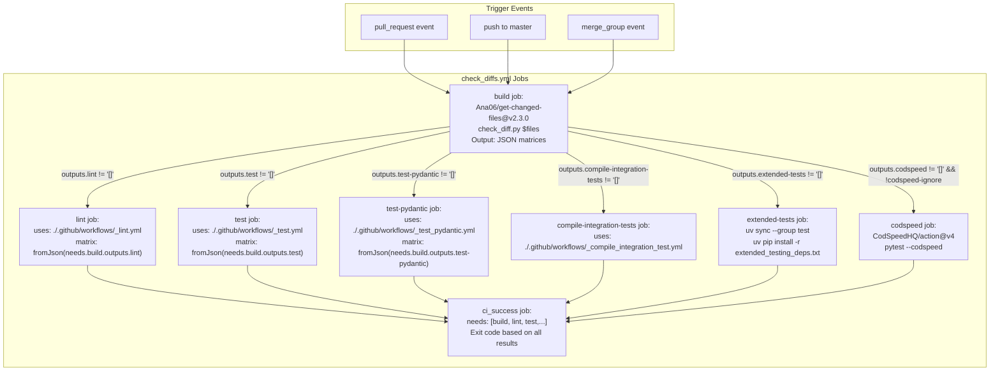
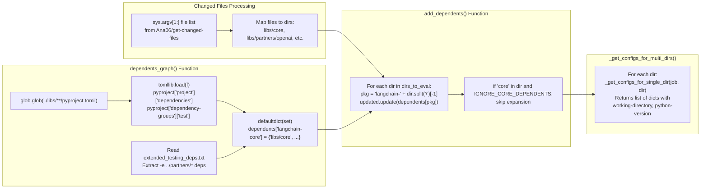
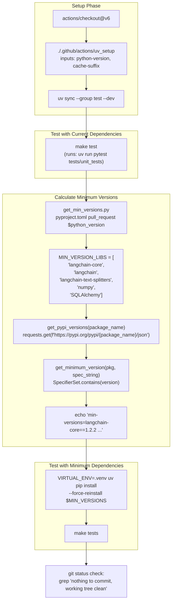

class TestChatParrotLinkUnit(ChatModelUnitTests):
    @property
    def chat_model_class(self) -> type[ChatParrotLink]:
        return ChatParrotLink
    
    @property
    def chat_model_params(self) -> dict:
        return {"model": "bird-brain-001", "temperature": 0}
    
    # Inherits test methods from ChatModelUnitTests:
    # - test_init() - validates model initialization
    # - test_serialize() - validates model serialization with dumpd/load
    # - test_standard_params() - validates temperature, max_tokens, etc.
    # - test_bind_tool_pydantic() - validates tool binding
    # - test_anthropic_inputs_with_tools() - validates Anthropic content blocks

class TestChatParrotLinkIntegration(ChatModelIntegrationTests):
    @property
    def chat_model_class(self) -> type[ChatParrotLink]:
        return ChatParrotLink
    
    # Inherits integration test methods:
    # - test_invoke() - validates model.invoke("Hello") returns AIMessage
    # - test_stream() - validates streaming with AIMessageChunk
    # - test_invoke_with_tool_calling() - validates tool call generation
    # - test_structured_output() - validates with_structured_output()
```

**Sources**: [libs/standard-tests/tests/unit_tests/test_custom_chat_model.py:17-45](), [libs/standard-tests/tests/unit_tests/custom_chat_model.py:18-149](), [libs/standard-tests/langchain_tests/unit_tests/chat_models.py:276-1033](), [libs/standard-tests/langchain_tests/integration_tests/chat_models.py:746-1059]()

## CI/CD Pipeline Architecture

The CI/CD pipeline uses intelligent change detection via the `check_diffs.yml` workflow ([.github/workflows/check_diffs.yml:15]()) and `check_diff.py` script ([.github/scripts/check_diff.py:1-341]()) to minimize test execution time while maintaining comprehensive coverage.

### Change Detection and Test Matrix Generation

Title: CI Workflow Orchestration from check_diffs.yml



**Sources**: [.github/workflows/check_diffs.yml:15-262](), [.github/scripts/check_diff.py:1-341]()

### Dependency Graph Construction

The `dependents_graph()` function ([.github/scripts/check_diff.py:63-113]()) parses `pyproject.toml` and `extended_testing_deps.txt` to build a dependency map. The `add_dependents()` function ([.github/scripts/check_diff.py:116-126]()) then expands the test matrix to include all dependent packages.

Title: Dependency Graph Construction in check_diff.py



**Sources**: [.github/scripts/check_diff.py:63-113](), [.github/scripts/check_diff.py:116-126](), [.github/scripts/check_diff.py:201-223]()

### Test Matrix Dimensions

The CI pipeline tests across multiple dimensions:

| Dimension | Configuration | Source |
|-----------|--------------|--------|
| **Python versions** | `libs/core`: 3.10, 3.11, 3.12, 3.13, 3.14<br/>Other packages: 3.10, 3.14 | [.github/scripts/check_diff.py:135-143]() |
| **Pydantic versions** | Range determined from `uv.lock` min/max versions | [.github/scripts/check_diff.py:146-199]() |
| **Dependency versions** | Current from `uv.lock` + minimum from constraints | [.github/scripts/get_min_versions.py:1-200]() |
| **Extended deps** | Optional dependencies in `extended_testing_deps.txt` | [.github/workflows/check_diffs.yml:153-160]() |

**Sources**: [.github/scripts/check_diff.py:129-199](), [.github/scripts/get_min_versions.py:20-35]()

## Test Execution Workflows

### Unit Testing with Minimum Dependencies

The `_test.yml` workflow ([.github/workflows/_test.yml:4]()) runs `make test` twice: once with current dependencies from `uv.lock`, then again with minimum supported versions calculated by `get_min_versions.py`.

Title: Unit Test Workflow with Minimum Version Testing



**Sources**: [.github/workflows/_test.yml:1-86](), [.github/scripts/get_min_versions.py:20-92](), [.github/scripts/get_min_versions.py:111-152]()

### Pydantic Version Compatibility Testing

The `_test_pydantic.yml` workflow ([.github/workflows/_test_pydantic.yml:3]()) runs tests against multiple Pydantic 2.x versions. The `_get_pydantic_test_configs()` function ([.github/scripts/check_diff.py:146-198]()) computes the version range:

```python