git log --format="%s" "$PREV_TAG"..HEAD -- $WORKING_DIR
```

Sources: [.github/workflows/_release.yml:587-630](), [.github/workflows/_release.yml:99-196]()

### Multi-Package Version Coordination

When releasing `langchain-core`, the workflow tests dependent packages to ensure compatibility.

**Testing External Dependents** ([.github/workflows/_release.yml:482-540]()):

```yaml
test-dependents:
  needs: [build, release-notes, test-pypi-publish, pre-release-checks]
  if: startsWith(inputs.working-directory, 'libs/core') || startsWith(inputs.working-directory, 'libs/langchain_v1')
  strategy:
    matrix:
      python-version: ["3.11", "3.13"]
      package:
        - name: deepagents
          repo: langchain-ai/deepagents
          path: libs/deepagents

  steps:
    - name: Install deepagents with local packages
      run: |
        cd ${{ matrix.package.name }}/${{ matrix.package.path }}
        uv sync --group test
        uv pip install $GITHUB_WORKSPACE/dist/*.whl
    
    - name: Run deepagents tests
      run: make test
```

This ensures that changes to core packages don't break dependent packages before they're published.

Sources: [.github/workflows/_release.yml:482-540]()

---

## Versioning and Dependency Management

### Version File Patterns

LangChain packages maintain version information in multiple locations that must stay synchronized.

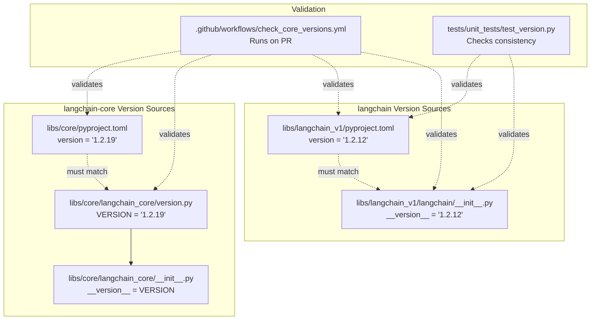

**langchain-core version pattern** ([libs/core/langchain_core/version.py:1-4]()):

```python
"""langchain-core version information and utilities."""

VERSION = "1.2.19"
```

**langchain-core __init__.py** ([libs/core/langchain_core/__init__.py:15-17]()):

```python
from langchain_core.version import VERSION

__version__ = VERSION
```

**langchain version pattern** ([libs/langchain_v1/langchain/__init__.py:1-3]()):

```python
"""Main entrypoint into LangChain."""

__version__ = "1.2.12"
```

Sources: [libs/core/langchain_core/version.py:1-4](), [libs/core/langchain_core/__init__.py:11-20](), [libs/langchain_v1/langchain/__init__.py:1-3]()

### Version Consistency Checks

**GitHub Workflow Check** ([.github/workflows/check_core_versions.yml:1-68]()):

```yaml
name: "🔍 Check Version Equality"

on:
  pull_request:
    paths:
      - "libs/core/pyproject.toml"
      - "libs/core/langchain_core/version.py"
      - "libs/langchain_v1/pyproject.toml"
      - "libs/langchain_v1/langchain/__init__.py"

jobs:
  check_version_equality:
    steps:
      - name: "✅ Verify pyproject.toml & version.py Match"
        run: |
          CORE_PYPROJECT_VERSION=$(grep -Po '(?<=^version = ")[^"]*' libs/core/pyproject.toml)
          CORE_VERSION_PY_VERSION=$(grep -Po '(?<=^VERSION = ")[^"]*' libs/core/langchain_core/version.py)
          
          if [ "$CORE_PYPROJECT_VERSION" != "$CORE_VERSION_PY_VERSION" ]; then
            echo "Version mismatch!"
            exit 1
          fi
```

**Unit Test Check** ([libs/langchain_v1/tests/unit_tests/test_version.py:10-27]()):

```python
def test_version_matches_pyproject() -> None:
    """Verify that __version__ in __init__.py matches version in pyproject.toml."""
    init_version = langchain.__version__
    
    pyproject_path = Path(__file__).parent.parent.parent / "pyproject.toml"
    with pyproject_path.open() as f:
        pyproject_data = toml.load(f)
    
    pyproject_version = pyproject_data["project"]["version"]
    
    assert init_version == pyproject_version
```

Sources: [.github/workflows/check_core_versions.yml:1-68](), [libs/langchain_v1/tests/unit_tests/test_version.py:10-28]()

### Dependency Version Constraints

LangChain uses specific dependency constraint patterns to balance stability and compatibility.

**Constraint Types**:

| Pattern | Example | Meaning |
|---------|---------|---------|
| Pinned major+minor | `pydantic>=2.7.4,<3.0.0` | Compatible Pydantic 2.x versions |
| Pinned minor | `langchain-core>=1.2.10,<2.0.0` | langchain-core 1.2.x or 1.y.z where y>2 |
| Ranged | `pytest>=8.0.0,<10.0.0` | pytest 8.x or 9.x |
| Excluded | `tenacity!=8.4.0,>=8.1.0,<10.0.0` | Exclude known broken version |

**Example from langchain-core** ([libs/core/pyproject.toml:26-35]()):

```toml
dependencies = [
    "langsmith>=0.3.45,<1.0.0",
    "tenacity!=8.4.0,>=8.1.0,<10.0.0",  # Exclude 8.4.0
    "jsonpatch>=1.33.0,<2.0.0",
    "PyYAML>=5.3.0,<7.0.0",
    "typing-extensions>=4.7.0,<5.0.0",
    "packaging>=23.2.0",
    "pydantic>=2.7.4,<3.0.0",           # Minimum Pydantic 2.7.4
    "uuid-utils>=0.12.0,<1.0",
]
```

Sources: [libs/core/pyproject.toml:26-35](), [libs/langchain_v1/pyproject.toml:25-30]()

### Minimum Version Testing

The `get_min_versions.py` script ([.github/scripts/check_diff.py:25-26]() reference) computes the minimum versions that satisfy dependency constraints, which are then tested in CI.

**Minimum Version Test Flow** ([.github/workflows/_test.yml:55-73]()):

```yaml
- name: "🔍 Calculate Minimum Dependency Versions"
  id: min-version
  run: |
    VIRTUAL_ENV=.venv uv pip install packaging tomli requests
    python_version="$(uv run python --version | awk '{print $2}')"
    min_versions="$(uv run python $GITHUB_WORKSPACE/.github/scripts/get_min_versions.py pyproject.toml pull_request $python_version)"
    echo "min-versions=$min_versions" >> "$GITHUB_OUTPUT"

- name: "🧪 Run Tests with Minimum Dependencies"
  if: ${{ steps.min-version.outputs.min-versions != '' }}
  run: |
    VIRTUAL_ENV=.venv uv pip install $MIN_VERSIONS
    make tests
```

This ensures that the package works with both:
- **Latest compatible versions** (from `uv.lock`)
- **Minimum compatible versions** (computed from `pyproject.toml` constraints)

Sources: [.github/workflows/_test.yml:55-73](), [.github/workflows/_release.yml:321-340]()

### Pydantic Compatibility Matrix

LangChain maintains compatibility with multiple Pydantic minor versions (2.7.x through latest 2.x).

**Pydantic Version Testing** ([.github/scripts/check_diff.py:142-194]()):

```python
def _get_pydantic_test_configs(dir_: str, *, python_version: str = "3.12"):
    # Read core's max Pydantic version from uv.lock
    with open("./libs/core/uv.lock", "rb") as f:
        core_uv_lock_data = tomllib.load(f)
    for package in core_uv_lock_data["package"]:
        if package["name"] == "pydantic":
            core_max_pydantic_minor = package["version"].split(".")[1]
    
    # Read package's minimum Pydantic version from pyproject.toml
    core_min_pydantic_version = get_min_version_from_toml(
        "./libs/core/pyproject.toml", "release", python_version, include=["pydantic"]
    )["pydantic"]
    
    # Generate configs for each minor version
    configs = [
        {
            "working-directory": dir_,
            "pydantic-version": f"2.{v}.0",
            "python-version": python_version,
        }
        for v in range(min_pydantic_minor, max_pydantic_minor + 1)
    ]
    return configs
```

**Pydantic Test Workflow** ([.github/workflows/_test_pydantic.yml:52-61]()):

```yaml
- name: "🔄 Install Specific Pydantic Version"
  env:
    PYDANTIC_VERSION: ${{ inputs.pydantic-version }}
  run: VIRTUAL_ENV=.venv uv pip install "pydantic~=$PYDANTIC_VERSION"

- name: "🧪 Run Core Tests"
  run: make test
```

This matrix testing ensures that LangChain works correctly across the full range of supported Pydantic versions.

Sources: [.github/scripts/check_diff.py:142-194](), [.github/workflows/_test_pydantic.yml:1-74]()

### Dependency Testing and Validation

**Dependency Test Pattern** ([libs/langchain/tests/unit_tests/test_dependencies.py:23-44]()):

```python
def test_required_dependencies(uv_conf: Mapping[str, Any]) -> None:
    """Check if a new non-optional dependency is being introduced."""
    dependencies = uv_conf["project"]["dependencies"]
    required_dependencies = {Requirement(dep).name for dep in dependencies}
    
    assert sorted(required_dependencies) == sorted([
        "PyYAML",
        "SQLAlchemy",
        "async-timeout",
        "langchain-core",
        "langchain-text-splitters",
        "langsmith",
        "pydantic",
        "requests",
    ])
```

This test prevents accidental introduction of new required dependencies, which would break users' existing installations.

**Test Group Validation** ([libs/langchain/tests/unit_tests/test_dependencies.py:47-84]()):

```python
def test_test_group_dependencies(uv_conf: Mapping[str, Any]) -> None:
    """Check if someone is attempting to add additional test dependencies."""
    dependencies = uv_conf["dependency-groups"]["test"]
    test_group_deps = {Requirement(dep).name for dep in dependencies}
    
    # Only test infrastructure dependencies should be here
    # NOT: boto3, azure, postgres, etc.
    assert sorted(test_group_deps) == sorted([
        "freezegun", "langchain-core", "langchain-tests",
        "pytest", "pytest-asyncio", "pytest-cov", # ... etc
    ])
```

Sources: [libs/langchain/tests/unit_tests/test_dependencies.py:1-85]()

---

## CI/CD Infrastructure

### Change Detection and Dynamic Matrix Generation

The `check_diff.py` script analyzes changed files to determine which packages need testing, creating an optimized CI matrix.

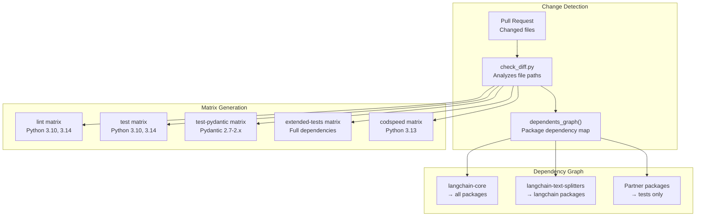

**Dependency Graph Construction** ([.github/scripts/check_diff.py:59-109]()):

```python
def dependents_graph() -> dict:
    """Construct a mapping of package -> dependents"""
    dependents = defaultdict(set)
    
    for path in glob.glob("./libs/**/pyproject.toml", recursive=True):
        with open(path, "rb") as f:
            pyproject = tomllib.load(f)
        
        pkg_dir = "libs" + "/".join(path.split("libs")[1].split("/")[:-1])
        for dep in [
            *pyproject["project"]["dependencies"],
            *pyproject["dependency-groups"]["test"],
        ]:
            requirement = Requirement(dep)
            if "langchain" in requirement.name:
                dependents[requirement.name].add(pkg_dir)
    
    return dependents
```

**Matrix Configuration Logic** ([.github/scripts/check_diff.py:125-139]()):

```python
def _get_configs_for_single_dir(job: str, dir_: str) -> List[Dict[str, str]]:
    if job == "codspeed":
        py_versions = ["3.13"]
    elif dir_ == "libs/core":
        py_versions = ["3.10", "3.11", "3.12", "3.13", "3.14"]
    elif dir_ in {"libs/partners/chroma"}:
        py_versions = ["3.10", "3.13"]
    else:
        py_versions = ["3.10", "3.14"]
    
    return [
        {"working-directory": dir_, "python-version": py_v}
        for py_v in py_versions
    ]
```

**Infrastructure Change Detection** ([.github/scripts/check_diff.py:239-258]()):

```python
for file in files:
    if any(file.startswith(dir_) for dir_ in (
        ".github/workflows",
        ".github/tools",
        ".github/actions",
        ".github/scripts/check_diff.py",
    )):
        # Infrastructure changes trigger tests on all core packages
        # as a safety measure
        dirs_to_run["extended-test"].update(LANGCHAIN_DIRS)
```

Sources: [.github/scripts/check_diff.py:1-320]()

### CI Workflow Orchestration

**Main CI Workflow** ([.github/workflows/check_diffs.yml:1-14]()):

```yaml
name: "🔧 CI"

on:
  push:
    branches: [master]
  pull_request:
  merge_group:

concurrency:
  group: ${{ github.workflow }}-${{ github.ref }}
  cancel-in-progress: true  # Cancel outdated runs
```

**Job Dependencies** ([.github/workflows/check_diffs.yml:42-127]()):

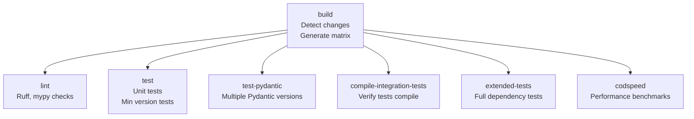

**Matrix Job Execution** ([.github/workflows/check_diffs.yml:72-83]()):

```yaml
lint:
  needs: [build]
  if: ${{ needs.build.outputs.lint != '[]' }}
  strategy:
    matrix:
      job-configs: ${{ fromJson(needs.build.outputs.lint) }}
    fail-fast: false
  uses: ./.github/workflows/_lint.yml
  with:
    working-directory: ${{ matrix.job-configs.working-directory }}
    python-version: ${{ matrix.job-configs.python-version }}
```

Sources: [.github/workflows/check_diffs.yml:1-240]()

### Linting Workflow

**Lint Targets** ([.github/workflows/_lint.yml:56-81]()):

```yaml
- name: "📦 Install Lint & Typing Dependencies"
  run: uv sync --group lint --group typing

- name: "🔍 Analyze Package Code with Linters"
  run: make lint_package

- name: "📦 Install Test Dependencies"
  run: uv sync --inexact --group test --group test_integration

- name: "🔍 Analyze Test Code with Linters"
  run: make lint_tests
```

The `lint_package` and `lint_tests` Makefile targets typically run:
- **ruff check**: Fast Python linter
- **ruff format --check**: Code formatting validation
- **mypy**: Static type checking

Sources: [.github/workflows/_lint.yml:1-82]()

### Testing Workflow

**Test Execution with Min Version Testing** ([.github/workflows/_test.yml:46-73]()):

```yaml
- name: "📦 Install Test Dependencies"
  run: uv sync --group test --dev

- name: "🧪 Run Core Unit Tests"
  run: make test

- name: "🔍 Calculate Minimum Dependency Versions"
  id: min-version
  run: |
    min_versions="$(uv run python $GITHUB_WORKSPACE/.github/scripts/get_min_versions.py pyproject.toml pull_request $python_version)"

- name: "🧪 Run Tests with Minimum Dependencies"
  if: ${{ steps.min-version.outputs.min-versions != '' }}
  run: |
    VIRTUAL_ENV=.venv uv pip install $MIN_VERSIONS
    make tests
```

This two-pass testing approach ensures compatibility across the entire supported dependency range.

Sources: [.github/workflows/_test.yml:1-86]()

### Extended Tests

Extended tests install additional dependencies from `extended_testing_deps.txt` for comprehensive validation.

**Extended Test Execution** ([.github/workflows/check_diffs.yml:153-161]()):

```yaml
- name: "📦 Install Dependencies & Run Extended Tests"
  run: |
    uv venv
    uv sync --group test
    VIRTUAL_ENV=.venv uv pip install -r extended_testing_deps.txt
    VIRTUAL_ENV=.venv make extended_tests
```

Sources: [.github/workflows/check_diffs.yml:129-173]()

### CodSpeed Benchmarks

Performance benchmarks run on `libs/core` changes unless labeled `codspeed-ignore`.

**CodSpeed Configuration** ([.github/workflows/check_diffs.yml:175-207]()):

```yaml
codspeed:
  if: ${{ needs.build.outputs.codspeed != '[]' && !contains(github.event.pull_request.labels.*.name, 'codspeed-ignore') }}
  steps:
    - name: "📦 Install Test Dependencies"
      run: uv sync --group test

    - name: "⚡ Run Benchmarks"
      uses: CodSpeedHQ/action@a50965600eafa04edcd6717761f55b77e52aafbd
      with:
        run: uv run pytest --codspeed
```

Sources: [.github/workflows/check_diffs.yml:175-207]()

# Package Structure and Build System


This page covers the physical layout of the monorepo, how each package declares its metadata and dependencies, the build backend used to produce distribution artifacts, and the tooling conventions (`uv`, dependency groups, local path sources) that tie it together.

For information about the CI/CD pipeline that builds and publishes these packages, see [6.2](). For contribution workflows and code standards, see [6.4](). For an overview of what each package does at the product level, see [1.1]().

---

## Monorepo Directory Layout

The repository is organized as a flat collection of independently versioned Python packages under the `libs/` directory. Each package directory contains its own `pyproject.toml`, `uv.lock`, source tree, and tests.

**Monorepo top-level structure**

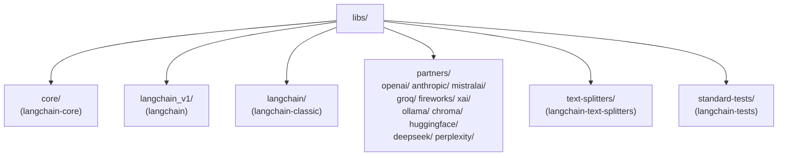

Sources: [libs/core/pyproject.toml:1-50](), [libs/langchain_v1/pyproject.toml:1-30](), [libs/langchain/pyproject.toml:1-35]()

---

## Build Backend: Hatchling

Every package in the monorepo uses [hatchling](https://hatch.pypa.io/latest/build/) as the PEP 517/518 build backend. The build system declaration appears at the top of every `pyproject.toml`:

```toml
[build-system]
requires = ["hatchling"]
build-backend = "hatchling.build"
```

This is consistent across `libs/core/pyproject.toml`, `libs/langchain_v1/pyproject.toml`, and `libs/langchain/pyproject.toml`. No `setup.py` or `setup.cfg` files are used.

Sources: [libs/core/pyproject.toml:1-3](), [libs/langchain_v1/pyproject.toml:1-3](), [libs/langchain/pyproject.toml:1-3]()

---

## Package Metadata

Each package declares its metadata under `[project]` in `pyproject.toml`. The table below summarizes the key packages.

| Directory | PyPI Name | Current Version | Python Requirement |
|---|---|---|---|
| `libs/core/` | `langchain-core` | `1.2.19` | `>=3.10.0,<4.0.0` |
| `libs/langchain_v1/` | `langchain` | `1.2.12` | `>=3.10.0,<4.0.0` |
| `libs/langchain/` | `langchain-classic` | `1.0.3` | `>=3.10.0,<4.0.0` |

Sources: [libs/core/pyproject.toml:5-25](), [libs/langchain_v1/pyproject.toml:5-25](), [libs/langchain/pyproject.toml:5-24]()

### Version Consistency

Package versions are declared in two places and must stay in sync:

1. `pyproject.toml` under `[project] version`
2. A `version.py` or `__init__.py` inside the package source

For `langchain-core`, the canonical version string lives in [libs/core/langchain_core/version.py:3]() and is imported by [libs/core/langchain_core/__init__.py:17]() to set `__version__`.

For the `langchain` package (`libs/langchain_v1/`), the version string in `__init__.py` is tested against the `pyproject.toml` value by [libs/langchain_v1/tests/unit_tests/test_version.py:10-27]().

---

## Runtime Dependencies

### langchain-core

[libs/core/pyproject.toml:26-35]()

```toml
dependencies = [
    "langsmith>=0.3.45,<1.0.0",
    "tenacity!=8.4.0,>=8.1.0,<10.0.0",
    "jsonpatch>=1.33.0,<2.0.0",
    "PyYAML>=5.3.0,<7.0.0",
    "typing-extensions>=4.7.0,<5.0.0",
    "packaging>=23.2.0",
    "pydantic>=2.7.4,<3.0.0",
    "uuid-utils>=0.12.0,<1.0",
]
```

`langchain-core` intentionally keeps its dependency surface minimal. No third-party model providers or database clients appear here.

### langchain (libs/langchain_v1/)

[libs/langchain_v1/pyproject.toml:26-30]()

```toml
dependencies = [
    "langchain-core>=1.2.10,<2.0.0",
    "langgraph>=1.1.1,<1.2.0",
    "pydantic>=2.7.4,<3.0.0",
]
```

### langchain-classic (libs/langchain/)

[libs/langchain/pyproject.toml:25-34]()

```toml
dependencies = [
    "langchain-core>=1.2.19,<2.0.0",
    "langchain-text-splitters>=1.1.1,<2.0.0",
    "langsmith>=0.1.17,<1.0.0",
    "pydantic>=2.7.4,<3.0.0",
    "SQLAlchemy>=1.4.0,<3.0.0",
    "requests>=2.0.0,<3.0.0",
    "PyYAML>=5.3.0,<7.0.0",
    "async-timeout>=4.0.0,<5.0.0; python_version < \"3.11\"",
]
```

**Dependency guard test** — `libs/langchain/tests/unit_tests/test_dependencies.py` contains two tests, `test_required_dependencies` and `test_test_group_dependencies`, that parse `pyproject.toml` and assert the exact set of allowed runtime and test dependencies. This prevents accidental introduction of new required dependencies. See [libs/langchain/tests/unit_tests/test_dependencies.py:23-84]().

---

## Optional Dependencies

Both the `langchain` and `langchain-classic` packages use `[project.optional-dependencies]` to expose partner integrations as installable extras. These extras pull in specific partner packages but do not require them at runtime by default.

**langchain (libs/langchain_v1/) optional-dependencies** ([libs/langchain_v1/pyproject.toml:32-49]()):

| Extra | Package |
|---|---|
| `anthropic` | `langchain-anthropic` |
| `openai` | `langchain-openai` |
| `mistralai` | `langchain-mistralai` |
| `groq` | `langchain-groq` |
| `fireworks` | `langchain-fireworks` |
| `ollama` | `langchain-ollama` |
| `huggingface` | `langchain-huggingface` |
| `deepseek` | `langchain-deepseek` |
| `xai` | `langchain-xai` |
| `perplexity` | `langchain-perplexity` |
| `community` | `langchain-community` |
| `google-vertexai` | `langchain-google-vertexai` |
| `google-genai` | `langchain-google-genai` |
| `aws` | `langchain-aws` |

The `langchain-classic` package declares the same set (minus `community` and `azure-ai`) at [libs/langchain/pyproject.toml:36-53]().

---

## Dependency Groups

PEP 735 dependency groups (the `[dependency-groups]` table) separate development-time dependencies from runtime ones. These are **not** installed when a user installs the package from PyPI; they exist only in the local development environment.

**Standard dependency groups across packages**

| Group | Purpose |
|---|---|
| `test` | pytest and supporting test libraries (no integration targets) |
| `test_integration` | additional packages needed for integration tests |
| `lint` | `ruff` for linting |
| `typing` | `mypy` and type stubs |
| `dev` | notebooks, development utilities |

**langchain-core dependency groups** ([libs/core/pyproject.toml:47-78]()):

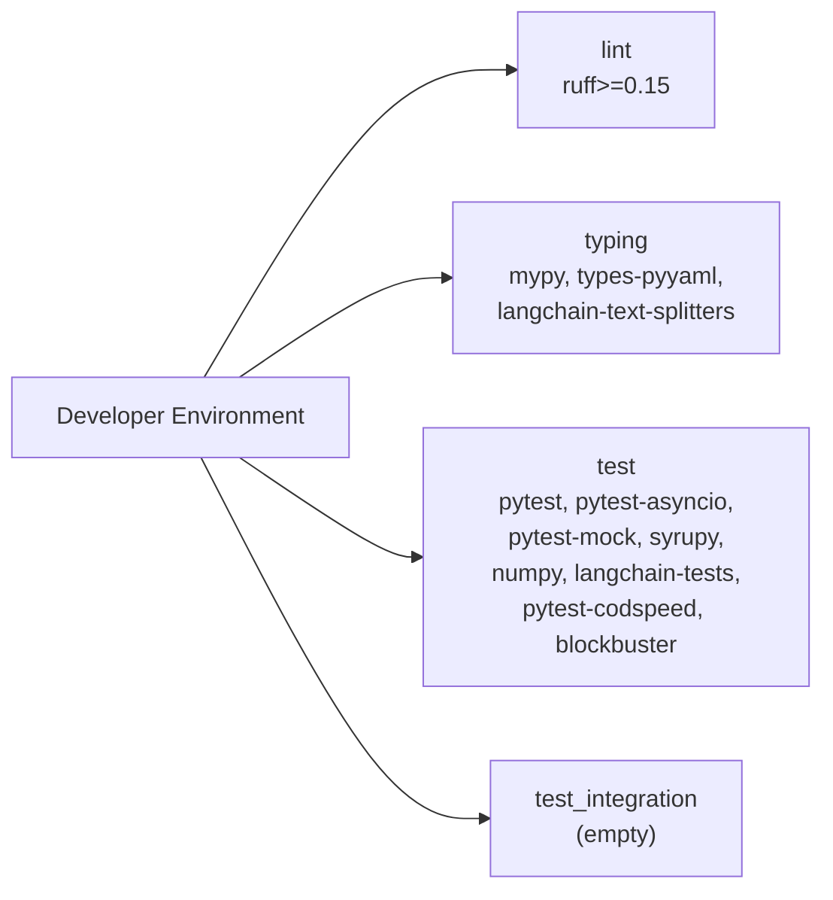

The `test_integration` group in `langchain-core` is intentionally left empty — integration tests for the core library are run through partner package test suites.

Sources: [libs/core/pyproject.toml:47-78](), [libs/langchain/pyproject.toml:65-120](), [libs/langchain_v1/pyproject.toml:61-91]()

---

## Local Path Sources with uv

Within the monorepo, packages that depend on sibling packages declare them as local editable installs using `[tool.uv.sources]`. This means during development, changes to `langchain-core` are immediately reflected in packages that depend on it without re-installing.

**langchain-core** ([libs/core/pyproject.toml:80-82]()):

```toml
[tool.uv.sources]
langchain-tests = { path = "../standard-tests" }
langchain-text-splitters = { path = "../text-splitters" }
```

**langchain-classic** ([libs/langchain/pyproject.toml:130-134]()):

```toml
[tool.uv.sources]
langchain-core = { path = "../core", editable = true }
langchain-tests = { path = "../standard-tests", editable = true }
langchain-text-splitters = { path = "../text-splitters", editable = true }
langchain-openai = { path = "../partners/openai", editable = true }
```

**langchain** (libs/langchain_v1/) ([libs/langchain_v1/pyproject.toml:97-102]()):

```toml
[tool.uv.sources]
langchain-core = { path = "../core", editable = true }
langchain-tests = { path = "../standard-tests", editable = true }
langchain-text-splitters = { path = "../text-splitters", editable = true }
langchain-openai = { path = "../partners/openai", editable = true }
langchain-anthropic = { path = "../partners/anthropic", editable = true }
```

**uv.lock files** — Each package directory contains a `uv.lock` file that pins the full resolved dependency graph. These files are checked into source control and updated by running `uv lock`. The lock files cover all dependency groups and record exact versions and hashes for reproducible installs.

Sources: [libs/core/pyproject.toml:80-82](), [libs/langchain/pyproject.toml:130-134](), [libs/langchain_v1/pyproject.toml:97-102](), [libs/core/uv.lock:1-14]()

---

## pyproject.toml Structure Map

**Annotated structure of a representative pyproject.toml**

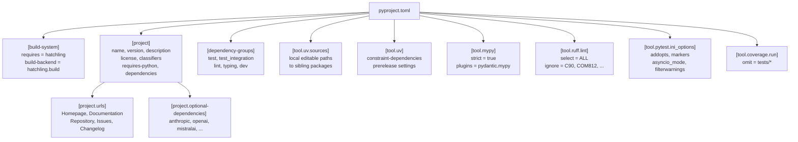

Sources: [libs/core/pyproject.toml:1-149](), [libs/langchain_v1/pyproject.toml:1-198]()

---

## Linting and Type Checking Configuration

Each package uses `ruff` for linting and formatting, and `mypy` for static type analysis.

### ruff

All packages select `"ALL"` rules and then ignore specific categories. Common ignores across packages:

| Rule | Reason |
|---|---|
| `C90` | McCabe complexity |
| `COM812` | Conflicts with ruff formatter |
| `FIX002` | TODO line suppression |
| `PLR09` | Too-many-X checks |
| `TD002`, `TD003` | Missing TODO author / issue link |
| `ANN401` | Allows `Any` type annotations |

The convention is `google` docstring style ([libs/core/pyproject.toml:127-129]()), and relative imports are banned via `ban-relative-imports = "all"` ([libs/core/pyproject.toml:124-125]()).

### mypy

All packages set `strict = true` and use the `pydantic.mypy` plugin. `disallow_any_generics` is disabled as a noted TODO ([libs/core/pyproject.toml:91]()). The `deprecated` error code is enabled to catch usage of deprecated symbols.

Sources: [libs/core/pyproject.toml:85-136](), [libs/langchain_v1/pyproject.toml:104-116](), [libs/langchain/pyproject.toml:139-206]()

---

## pytest Configuration

Pytest is configured through `[tool.pytest.ini_options]` in each package's `pyproject.toml`. The configuration is largely consistent across packages.

| Setting | Value |
|---|---|
| `addopts` | `--strict-markers --strict-config --durations=5` |
| `asyncio_mode` | `auto` (all async tests run automatically) |
| `markers` | `requires`, `compile`, `scheduled` |
| `filterwarnings` | Suppresses `LangChainBetaWarning` and `LangChainDeprecationWarning` in tests |

The `requires` marker is implemented in `conftest.py` files. The `conftest.py` in `libs/langchain/` also adds `--only-extended`, `--only-core`, and `--community` command-line options for controlling which tests run. See [libs/langchain/tests/unit_tests/conftest.py:9-28]().

Sources: [libs/core/pyproject.toml:141-149](), [libs/langchain_v1/pyproject.toml:185-198](), [libs/langchain/pyproject.toml:225-237]()

---

## Cross-Package Dependency Flow

**Runtime dependency resolution between packages**

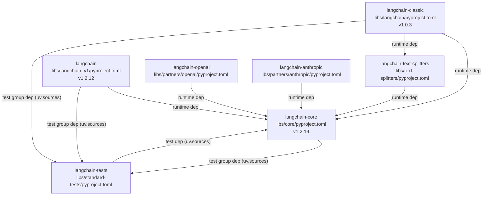

Sources: [libs/core/pyproject.toml:60-82](), [libs/langchain_v1/pyproject.toml:26-102](), [libs/langchain/pyproject.toml:25-134]()

---

## uv Constraint Dependencies

Some packages declare constraint dependencies via `[tool.uv] constraint-dependencies` to enforce minimum versions of transitive dependencies without adding them as direct runtime requirements. For example, `langchain-classic` and `langchain` both constrain:

```toml
[tool.uv]
constraint-dependencies = ["urllib3>=2.6.3"]
```

[libs/langchain/pyproject.toml:136-137](), [libs/langchain_v1/pyproject.toml:93-95]()

The `langchain` package also sets `prerelease = "allow"` to allow testing against pre-release versions of dependencies when needed.

---

## Summary Reference Table

| Concern | Mechanism | Configuration Key |
|---|---|---|
| Build backend | `hatchling` | `[build-system]` |
| Dependency locking | `uv lock` | `uv.lock` per package |
| Local sibling packages | editable path sources | `[tool.uv.sources]` |
| Dev/test deps | PEP 735 groups | `[dependency-groups]` |
| Provider extras | optional-dependencies | `[project.optional-dependencies]` |
| Linting | `ruff` | `[tool.ruff.lint]` |
| Type checking | `mypy` (strict) | `[tool.mypy]` |
| Test runner | `pytest` | `[tool.pytest.ini_options]` |
| Version tracking | `pyproject.toml` + `version.py` | `[project] version` + `VERSION` |

# Release Process and Workflows


This document describes the release pipeline for publishing LangChain packages to PyPI. The release workflow handles version management, build isolation, comprehensive pre-release validation, dependent package testing, and secure publishing using trusted publishing credentials.

For information about package structure and build configuration, see [Package Structure and Build System](#6.1). For details on the CI testing infrastructure used during development, see [CI/CD and Testing Infrastructure](#5.3).

## Overview

The release process is defined in [.github/workflows/_release.yml:1-621]() and can be triggered manually via GitHub Actions workflow dispatch. The workflow follows security best practices by separating build and publish stages with minimal permissions, validates the package through extensive testing (including minimum version compatibility), tests against downstream dependents, and publishes to both test PyPI and production PyPI before creating a GitHub release.

## Release Workflow Architecture

The release pipeline consists of eight jobs with strict dependency ordering. Note that `test-prior-published-packages-against-new-core` is currently disabled (`if: false`) at [.github/workflows/_release.yml:399]().

**_release.yml job dependency graph:**

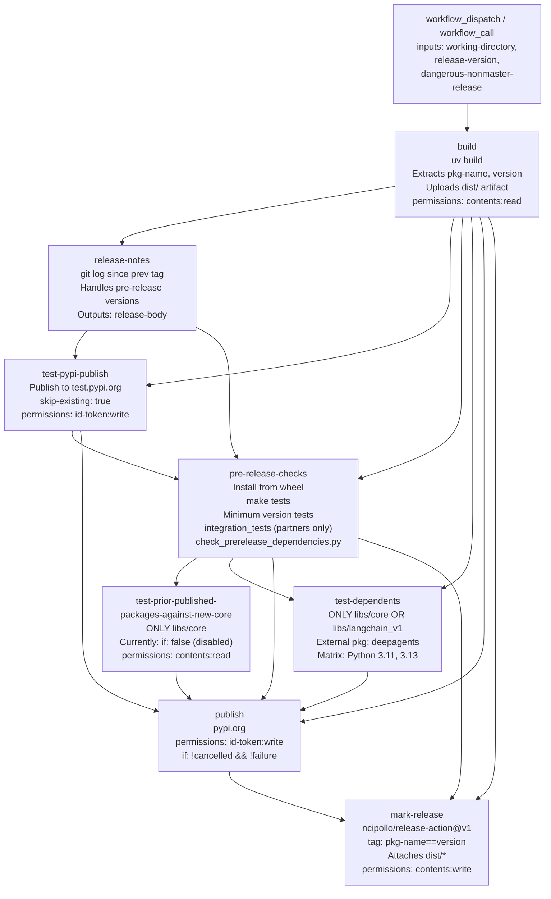

Sources: [.github/workflows/_release.yml:42-626]()

## Triggering a Release

The release workflow ([.github/workflows/_release.yml:9-32]()) supports two invocation methods:

- **`workflow_dispatch`**: Manually triggered from the GitHub Actions UI.
- **`workflow_call`**: Used as a reusable workflow called from another workflow.

| Input Parameter | Required | Default | Description |
|-----------------|----------|---------|-------------|
| `working-directory` | Yes | `libs/langchain_v1` | Package directory to release |
| `release-version` | Yes | `0.1.0` | New version number for the release |
| `dangerous-nonmaster-release` | No | `false` | Allow releases from non-master branches (hotfixes only) |

The `build` job enforces a branch safety check at [.github/workflows/_release.yml:46]():

```
if: github.ref == 'refs/heads/master' || inputs.dangerous-nonmaster-release
```

This prevents accidental releases from feature branches unless explicitly overridden. The `dangerous-nonmaster-release` flag is documented as intended only for hotfixes.

Sources: [.github/workflows/_release.yml:9-46]()

## Build Stage

The `build` job ([.github/workflows/_release.yml:45-98]()) runs under the `Scheduled testing` environment with minimal permissions (`contents: read`) to prevent credential leakage. This isolation follows PyPI trusted publishing guidance, which strongly advises separating the build job from the publish job.

**build job steps:**

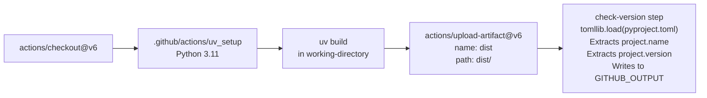

The `check-version` step at [.github/workflows/_release.yml:85-98]() uses Python's `tomllib` to read `pyproject.toml` and exports two job outputs:

- `pkg-name`: the value of `project.name`
- `version`: the value of `project.version`

These outputs are consumed by all downstream jobs. The `dist/` artifact (wheel + sdist) is uploaded and downloaded by each subsequent stage.

Sources: [.github/workflows/_release.yml:45-98]()

## Release Notes Generation

The `release-notes` job ([.github/workflows/_release.yml:99-193]()) generates release notes by analyzing git history between tags.

### Tag Resolution Logic

The workflow implements sophisticated tag resolution at [.github/workflows/_release.yml:116-171]() that handles both regular and pre-release versions:

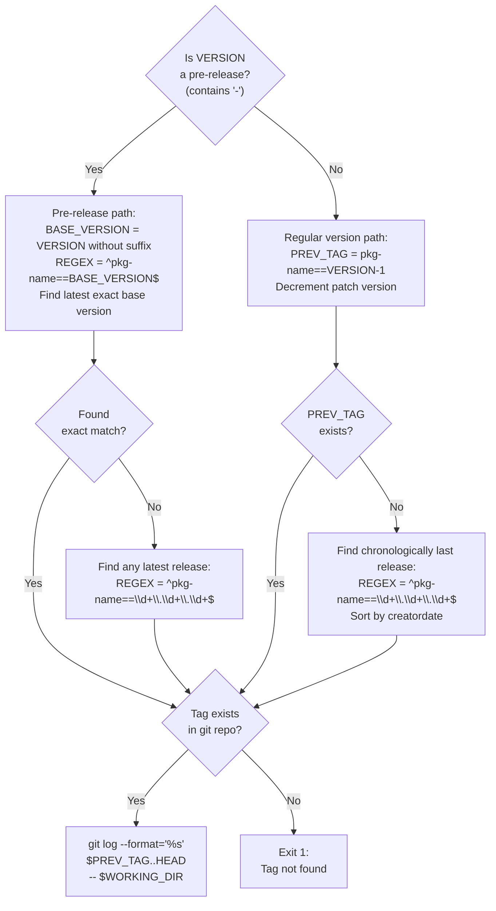

For the first release of a package, if no previous tag exists, the workflow uses the initial commit as the starting point at [.github/workflows/_release.yml:185]():
```bash
PREV_TAG=$(git rev-list --max-parents=0 HEAD)
```

**Outputs:**
- `release-body`: Multi-line string containing preamble and git log of commits

**Sources:** [.github/workflows/_release.yml:99-193]()

## Test PyPI Publishing

The `test-pypi-publish` job ([.github/workflows/_release.yml:195-228]()) validates that the package can be published and is available for pre-release testing. It uses trusted publishing with `id-token: write` permission.

### Key Configuration

The job uses `pypa/gh-action-pypi-publish@release/v1` at [.github/workflows/_release.yml:216-228]() with specific settings:

| Parameter | Value | Purpose |
|-----------|-------|---------|
| `repository-url` | `https://test.pypi.org/legacy/` | Target test PyPI |
| `skip-existing` | `true` | Allow re-runs without failure |
| `attestations` | `false` | Temporary workaround for v1.11.0+ |
| `verbose` | `true` | Detailed output for debugging |
| `print-hash` | `true` | Display package checksums |

The `skip-existing: true` setting at [.github/workflows/_release.yml:226]() is marked as **only for CI use** and **extremely dangerous** otherwise, as it allows overwriting packages with the same version.

**Sources:** [.github/workflows/_release.yml:195-228]()

## Pre-Release Validation

The `pre-release-checks` job ([.github/workflows/_release.yml:230-382]()) is the most comprehensive validation stage, running multiple test suites with both current and minimum dependency versions.

### Validation Steps

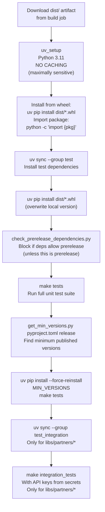

### Import Test

The import test at [.github/workflows/_release.yml:266-290]() validates that the package installs correctly and can be imported:

1. Create isolated venv with `uv venv`
2. Install wheel: `VIRTUAL_ENV=.venv uv pip install dist/*.whl`
3. Transform package name: Replace dashes with underscores, remove `_official` suffix
4. Test import: `uv run python -c "import {pkg}; print(dir({pkg}))"`

### Prerelease Dependency Check

The workflow blocks releases with prerelease dependencies at [.github/workflows/_release.yml:306-311]() by running:
```bash
uv run python $GITHUB_WORKSPACE/.github/scripts/check_prerelease_dependencies.py pyproject.toml
```

This prevents accidentally publishing a stable release that depends on an unstable dependency.

### Minimum Version Testing

The minimum version test ([.github/workflows/_release.yml:317-336]()) ensures compatibility with the oldest supported dependency versions:

1. Run `get_min_versions.py` with `release` mode (see [.github/scripts/get_min_versions.py:189-199]())
2. For each package in `MIN_VERSION_LIBS` ([.github/scripts/get_min_versions.py:20-26]()):
   - Parse version constraints from `pyproject.toml`
   - Query PyPI for all available versions
   - Find minimum version satisfying constraints
3. Force reinstall with `uv pip install --force-reinstall $MIN_VERSIONS`
4. Re-run `make tests`

This catches issues where the package inadvertently depends on newer features.

### Integration Test Coverage

For partner packages (directories starting with `libs/partners/`), the workflow runs integration tests at [.github/workflows/_release.yml:338-382]() with comprehensive API key injection:

| Environment Variable | Provider |
|---------------------|----------|
| `AI21_API_KEY` | AI21 Labs |
| `ANTHROPIC_API_KEY` | Anthropic (Claude) |
| `AZURE_OPENAI_*` | Azure OpenAI (5 variables) |
| `DEEPSEEK_API_KEY` | DeepSeek |
| `EXA_API_KEY` | Exa |
| `FIREWORKS_API_KEY` | Fireworks AI |
| `GOOGLE_API_KEY` | Google (Gemini) |
| `GROQ_API_KEY` | Groq |
| `MISTRAL_API_KEY` | Mistral AI |
| `MONGODB_ATLAS_URI` | MongoDB Atlas |
| `OPENAI_API_KEY` | OpenAI |
| And 10+ more... | Various providers |

**Sources:** [.github/workflows/_release.yml:230-382](), [.github/scripts/get_min_versions.py:1-200]()

## Dependent Package Testing

Two specialized testing jobs validate that the release doesn't break downstream packages:

### Testing Core Against Published Partners

The `test-prior-published-packages-against-new-core` job ([.github/workflows/_release.yml:386-474]()) is **currently disabled** via `if: false` at [.github/workflows/_release.yml:399](). When enabled, it runs only for `libs/core` releases and validates that the new core version is compatible with the latest published versions of partner packages.

The job uses a matrix strategy with `fail-fast: false` and is currently configured to test against `anthropic` ([.github/workflows/_release.yml:402-403]()). Its logic (when enabled):

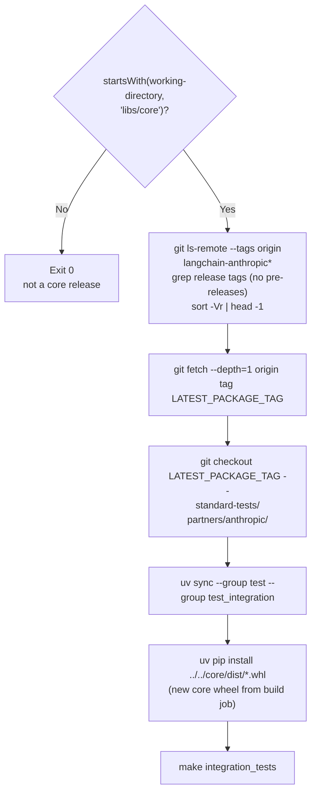

Sources: [.github/workflows/_release.yml:386-474]()

### Testing External Dependents

The `test-dependents` job ([.github/workflows/_release.yml:475-532]()) runs for `libs/core` and `libs/langchain_v1` releases to validate external packages that depend on LangChain:

| Package | Repository | Path | Python Versions |
|---------|-----------|------|-----------------|
| `deepagents` | `langchain-ai/deepagents` | `libs/deepagents` | 3.11, 3.13 |

The test procedure at [.github/workflows/_release.yml:517-532]():
1. Checkout both `langchain` and the dependent repo
2. Install dependent package: `uv sync --group test`
3. Override with release wheel: `uv pip install $GITHUB_WORKSPACE/dist/*.whl`
4. Run dependent's tests: `make test`

This ensures that the new release doesn't introduce breaking changes for downstream consumers.

Sources: [.github/workflows/_release.yml:386-535]()

## Production Publishing

The `publish` job ([.github/workflows/_release.yml:537-581]()) runs after all validation jobs succeed or are skipped:

```yaml
if: ${{ !cancelled() && !failure() }}
```

This condition ([.github/workflows/_release.yml:547]()) allows the job to proceed when conditional jobs like `test-dependents` were skipped (e.g., for non-core packages), but blocks it if any required job failed or the workflow was cancelled.

### Trusted Publishing Configuration

The job uses `pypa/gh-action-pypi-publish@release/v1` targeting production PyPI (no `repository-url` override). The `id-token: write` permission ([.github/workflows/_release.yml:552-555]()) enables OpenID Connect (OIDC) trusted publishing, eliminating the need for stored PyPI API tokens.

| Parameter | Value |
|-----------|-------|
| `packages-dir` | `{working-directory}/dist/` |
| `verbose` | `true` |
| `print-hash` | `true` |
| `attestations` | `false` (temporary workaround for v1.11.0+) |

Sources: [.github/workflows/_release.yml:537-581]()

## GitHub Release Creation

The `mark-release` job ([.github/workflows/_release.yml:583-626]()) creates the GitHub release and git tag after successful PyPI publication using `ncipollo/release-action@v1`.

| Parameter | Value | Purpose |
|-----------|-------|---------|
| `tag` | `{pkg-name}=={version}` | Git tag (e.g., `langchain-core==0.3.29`) |
| `body` | `{release-body}` from `release-notes` job | Release notes |
| `artifacts` | `dist/*` | Attaches wheel and sdist |
| `generateReleaseNotes` | `false` | Uses custom release notes, not GitHub's auto-generated ones |
| `makeLatest` | `pkg-name == 'langchain-core'` | Only core releases are marked "latest" |
| `commit` | `github.sha` | Associates the tag with the triggering commit |

The `makeLatest` condition at [.github/workflows/_release.yml:625]() ensures that partner package releases do not displace `langchain-core` as the repository's "Latest" release on GitHub.

Sources: [.github/workflows/_release.yml:583-626]()

## Security Considerations

The release workflow implements multiple security best practices:

### Build/Publish Separation

The workflow explicitly separates the `build` job from the `publish` and `mark-release` jobs to prevent credential leakage. The rationale is documented at [.github/workflows/_release.yml:64-74]():

> We want to keep this build stage *separate* from the release stage, so that there's no sharing of permissions between them. Otherwise, a malicious `build` step (e.g. via a compromised dependency) could get access to our GitHub or PyPI credentials.

**Permission assignments per job:**

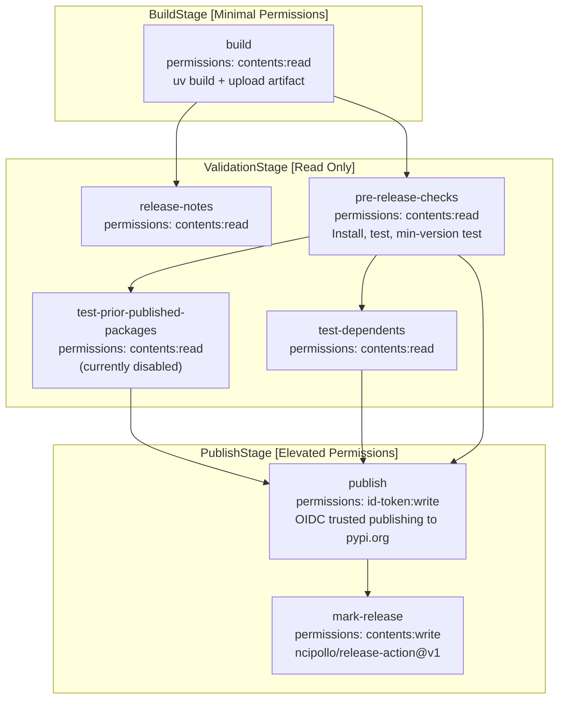

Sources: [.github/workflows/_release.yml:39-75](), [.github/workflows/_release.yml:546-626]()

### Trusted Publishing

Both `test-pypi-publish` and `publish` jobs use OIDC-based trusted publishing with the `id-token: write` permission instead of long-lived API tokens. This provides:

- **Automatic credential rotation**: Temporary tokens issued per workflow run
- **Reduced attack surface**: No stored secrets to leak
- **Audit trail**: All publishes linked to specific GitHub Actions runs

Configuration requirements are documented at [.github/workflows/_release.yml:201-206]():
- GitHub Actions must be configured as a trusted publisher on PyPI
- Separate configuration for test.pypi.org and pypi.org
- See: https://docs.pypi.org/trusted-publishers/adding-a-publisher/

### No Caching in Pre-Release Checks

The pre-release validation explicitly disables caching at [.github/workflows/_release.yml:242-253]() to prevent false positives:

> We explicitly *don't* set up caching here. This ensures our tests are maximally sensitive to catching breakage. For example, a dependency used to be required, so it may have been cached. When restoring the venv packages from cache, that dependency gets included. Tests pass, because the dependency is present even though it wasn't specified. The package is published, and it breaks on the missing dependency.

### Branch Protection

The workflow enforces master-branch-only releases at [.github/workflows/_release.yml:46]() unless explicitly overridden with the `dangerous-nonmaster-release` input, preventing accidental releases from feature branches.

**Sources:** [.github/workflows/_release.yml:39-253](), [.github/workflows/_release.yml:546-552]()

---

**Related Workflows:**

For version synchronization checks between `pyproject.toml` and `version.py`, see [.github/workflows/check_core_versions.yml:1-52](). This workflow runs on pull requests and validates that version strings match across files before allowing merges.