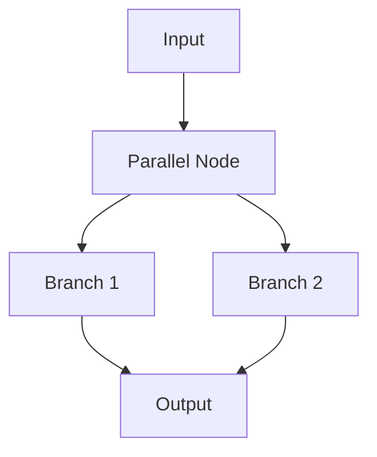

print(chain.get_graph().draw_ascii())
mermaid = chain.get_graph().draw_mermaid()
png_bytes = chain.get_graph().draw_png()
```

The graph automatically includes input/output schema nodes for clarity [libs/core/tests/unit_tests/runnables/test_graph.py:102-219]().

### Parallel Execution Visualization

Parallel runnables create branching graphs:



Each branch is represented as a separate edge from the parallel node [libs/core/tests/unit_tests/runnables/test_graph.py:222-253]().

### Conditional Routing

Conditional edges use dotted lines in visualizations:

```python
def route(state):
    if condition:
        return "path_a"
    return "path_b"

graph.add_edge(node, path_a, conditional=True)
graph.add_edge(node, path_b, conditional=True)
```

Rendered as `-.->` in Mermaid, dashed in PNG [langchain_core/runnables/graph_mermaid.py:203-208]().

**Sources:** [libs/core/tests/unit_tests/runnables/test_graph.py:27-253]()

### Debugging Complex Chains

The ASCII renderer is particularly useful for quick debugging in terminals:

```
              +-------------+              
              | PromptInput |              
              +-------------+              
                      *                    
                      *                    
             +----------------+            
             | PromptTemplate |            
             +----------------+            
                      *                    
              +-------------+              
              | FakeListLLM |              
              +-------------+              
```

Mermaid and PNG are better for documentation and sharing [libs/core/tests/unit_tests/runnables/__snapshots__/test_graph.ambr:89-118]().

**Sources:** [libs/core/tests/unit_tests/runnables/test_graph.py:27-52]()

---

**Primary Sources:**
- [langchain_core/runnables/graph.py:1-715]()
- [langchain_core/runnables/graph_mermaid.py:1-499]()
- [langchain_core/runnables/graph_png.py:1-167]()
- [langchain_core/runnables/graph_ascii.py:1-252]()
- [libs/core/tests/unit_tests/runnables/test_graph.py:1-475]()