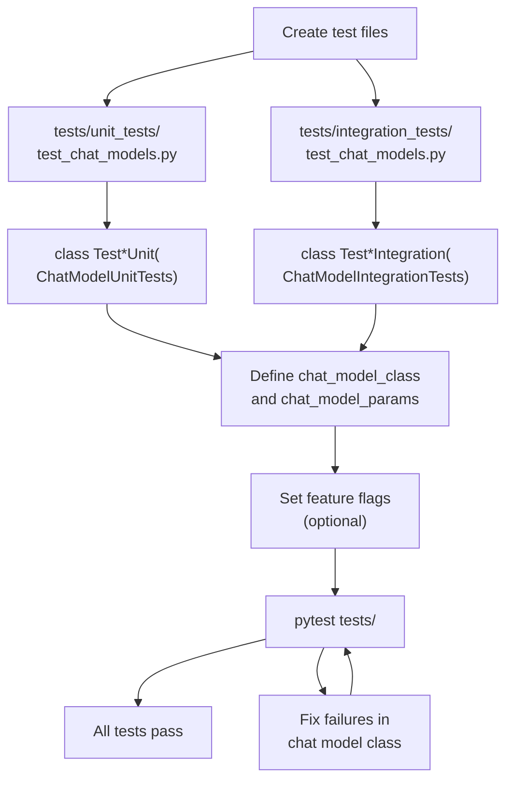

def _get_default_model_profile(model_name: str) -> ModelProfile:
    default = _MODEL_PROFILES.get(model_name) or {}
    return default.copy()

@model_validator(mode="after")
def _set_model_profile(self) -> Self:
    if self.profile is None:
        self.profile = _get_default_model_profile(self.model_name)
    return self
```

### Common Profile Fields

| Field | Type | Description |
|-------|------|-------------|
| `max_input_tokens` | `int` | Maximum input context window |
| `max_output_tokens` | `int` | Maximum output tokens |
| `tool_calling` | `bool` | Supports function/tool calling |
| `structured_output` | `bool` | Native structured output support |
| `supports_vision` | `bool` | Supports image inputs |
| `supports_audio` | `bool` | Supports audio inputs |
| `reasoning` | `bool` | Reasoning/thinking model |

**Runtime profile usage:**

```python
# Check capabilities before using features
if self.profile.get("tool_calling"):
    # Enable tool calling
    pass

# Use max_tokens from profile if not specified
if self.max_tokens is None:
    self.max_tokens = self.profile.get("max_output_tokens", 4096)
```

**Sources:**
- [libs/partners/openai/langchain_openai/data/_profiles.py]()
- [libs/partners/openai/langchain_openai/chat_models/base.py:144-146]()
- [libs/partners/openai/langchain_openai/chat_models/base.py:1003-1008]()
- [libs/partners/anthropic/langchain_anthropic/data/_profiles.py]()
- [libs/partners/anthropic/langchain_anthropic/chat_models.py:78-90]()

---

## Validation with Standard Tests

All integrations must pass `langchain-tests` to ensure compliance with LangChain's interface contracts.

**Diagram: Test Implementation Flow**



### Implementation Steps

**Step 1: Create unit test class**

```python
# tests/unit_tests/test_chat_models.py
from typing import Type
from langchain_tests.unit_tests import ChatModelUnitTests
from langchain_yourprovider import ChatYourProvider

class TestChatYourProviderUnit(ChatModelUnitTests):
    @property
    def chat_model_class(self) -> Type[ChatYourProvider]:
        return ChatYourProvider
    
    @property
    def chat_model_params(self) -> dict:
        return {
            "model": "your-model-001",
            "temperature": 0,
            "api_key": "test-key",
        }
```

**Step 2: Create integration test class**

```python